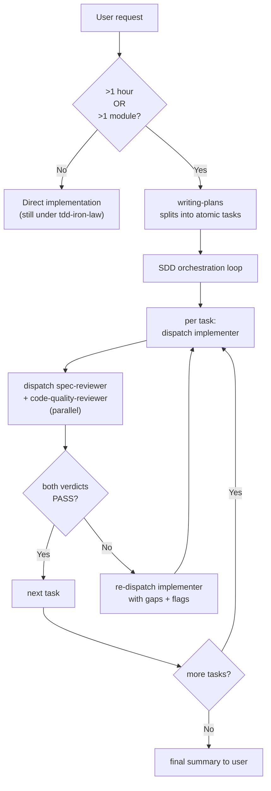

## Continuous execution

**Do not pause to check in between tasks.** When the orchestrator (this skill) receives a plan, it dispatches the first task's three subagents, waits for their verdicts, applies the resolution rule below, and immediately dispatches the next task. The user is not in the loop on a per-task basis — that is the loop SDD exists to remove.

Pause points the user **does** see:

- The plan itself, before any task is dispatched (user approves the task list).
- A `NEEDS_CONTEXT` from any implementer (orchestrator surfaces the question, waits for an answer).
- A `BLOCKED` from any implementer that the orchestrator cannot unblock by re-dispatch (e.g. missing dependency the user must install).
- The final summary after all tasks `DONE` (or `DONE_WITH_CONCERNS` triaged).

Everything else — RED-GREEN-REFACTOR cycles, reviewer rounds, re-dispatch on `NEEDS_REVISION` — runs without user intervention.

**Subagent capacity errors (usage limit / "529 Overloaded").** If a subagent dispatch fails with a monthly-limit or 529 error mid-run: (1) do not silently retry in a loop; (2) finish and commit any tasks already `DONE` in the current wave; (3) surface ONE recovery question to the user with three options: wait for capacity to recover; proceed with explicit B2 orchestrator self-review (mark every verdict "[self-review — confirmation bias risk]"); or push the branch as-is and rely on CI. Phrase this per [§Asking the user](#asking-the-user).

## Asking the user

When you surface one of those pause points — the「下一步？」hand-off after a task DONE, a `NEEDS_CONTEXT` question, a `BLOCKED`, or the 4th-retry escalation — run the decision through three gates: **① whether to ask at all**, **② what to bring when you do ask**, and **③ how to phrase it**. The reader is a warm-but-interrupted human, not the reviewer subagent. The anchor for all three gates is Horvitz, *Principles of Mixed-Initiative User Interfaces* (CHI 1999): scale the act-vs-ask threshold by the cost of being wrong, and scope each question's precision to your confidence.

### ① Whether to ask — tier by reversibility × cost

Asking has a cost. Every low-stakes confirmation teaches the user that confirmations are noise, and then the asks that actually matter lose their signal (confirmation fatigue). Tier by reversibility × cost, not by habit:

- **Reversible + inferable from context** (edits, running tests, saving a memory, advancing to the next task) → just do it, mention it after. Under a standing "一路做完 / just finish it" authorization, do **not** re-confirm these per step.
- **Irreversible / outward-facing / costly** (`git push`, `gh pr create`, `gh pr merge`, deploy, delete, a paid pipeline run) → always confirm. The standing authorization does **not** cover these (`using-code-toolkit` router rule #4).
- **Genuine taste / scope / un-inferable intent** → ask, per gate ②.

### ② What to bring — a recommendation, not an open question

When you ask a technical decision (a bug-fix approach, a design choice, error handling), bring your judgment, not the raw problem. An open-ended "how should I fix this?" with no options makes the user think *for* you — that is forbidden. Research industry practice first (`using-code-toolkit` router rule #5 / `brainstorming`'s Axis-4 — point to them, do not re-implement the protocol here), then lead with a scoped `(Recommended)` option plus one line of why. The less familiar the domain, the **more** research you owe; unfamiliarity must not collapse into an open question.

*(Grounded: Horvitz, Principles of Mixed-Initiative User Interfaces, CHI 1999 — scope precision to your confidence; "do less but correctly" beats punting wide.)*

### ③ How to phrase

1. **Outcome, not mechanism.** Each option describes what the user *gets* ("you'll get the two skills edited and tests green"), not the internal machinery ("uses SDD triad dispatch").
2. **Translate jargon; expand acronyms on first use.** Replace or gloss internal terms (`implementer`, `spec-reviewer`, 🟡/🟢, `Wave 1 = T1+T3`). **Exception**: terms the user introduced *this session* are fine as-is.
3. **Numbers carry their meaning.** `PASS 12/12` → "all 5 tasks checked out"; let the mechanism detail (`12/12`) sink to a sub-line, not the headline.
4. **Open with a one-line state anchor** (一句話現況): *we just did X; now Y needs deciding.* Reuse recap-state's Block-1 "Situation" idea — never ask a bare decision verb with zero context (「下一步？」alone is the failure). Put the anchor **inside the `AskUserQuestion` `question` field**, not only in chat prose above the call — the user reads the rendered question, not your preamble. **Never use internal vocabulary in the anchor** — phrases like "T3+T4+T5 reviewer verdicts" or "whole-branch review passed" mean nothing to the user; translate them ("three automated checks passed" / "the full-branch quality review passed"). And never list a slash command or CLI subcommand as an option without first confirming it exists (e.g. `claude --help`).
5. **≤4 options** (AskUserQuestion hard cap). Never add an explicit "Other" — the tool auto-injects it. End **open** design questions with a free-form invite; for **closed** factual questions, don't.
6. **Compound asks only when sub-questions share one topic** or are jointly judgeable. Split unrelated decisions into separate rounds.

**Worked example — the built-in `/recap` style is the target:**

```
✅ Standard (outcome-framed, no jargon, plain status, term-explained-on-use):
   "We're making code-toolkit's questions easier to understand by adding plain-language
    rules to two skills. The brief and plan are done and approved; next is editing the
    actual SKILL.md files."

❌ Avoid (jargon-dense status-report style):
   "Plan v2 PASS round 2, 0 gaps. T1-T4 sequential, Independent:false, 走 SDD 三角審查. DAG 無環."
```

This ✅ example is the calibration target for every question and hand-off the orchestrator surfaces below.

## When to use

Auto-routed by [`using-code-toolkit`](../using-code-toolkit/SKILL.md) when **either** trigger fires:

- The user's task is estimated to take **>1 hour**.
- The task touches **>1 module / >1 file boundary**.



If neither trigger fires, the user goes straight to `tdd-iron-law` for implementation. SDD's overhead is not free; do not dispatch three subagents for a one-line change.

## Process — per-task triad

For each atomic task in the plan:

1. **Dispatch `implementer`** via `Agent({subagent_type: "code-toolkit:implementer", prompt: <task body>})` with the task description + context paths + resource paths (input contract is defined in the plugin-level agent at [`code-toolkit/agents/implementer.md`](../../agents/implementer.md); that agent also carries the 12-rule engineering baseline from [`code-toolkit/scripts/_baseline.md`](../../scripts/_baseline.md)). Before dispatching, the orchestrator resolves the project's test command once via `verification-before-completion`'s declared-first rule (consult the declared surface; trust only if it runs and emits a test count; else fall back to detection), caches it **session-scoped** (re-resolve across sessions because declarations rot), and passes it into the implementer dispatch as a **`Resolved test command`** line so the implementer runs the project's real test command instead of re-detecting. (Optional optimization: invalidate the session cache mid-session if the declaring file's content-hash changes.) Wait for return.
2. **Read the implementer's output.** If `status: NEEDS_CONTEXT` → surface the question to the user (phrase it per [§Asking the user](#asking-the-user)), do not dispatch reviewers. If `status: BLOCKED` → apply the unblock step or surface to user.
3. **If `status: DONE` or `DONE_WITH_CONCERNS`**, dispatch **`spec-reviewer`** and **`code-quality-reviewer`** **in parallel** (one message, two tool calls) — both are plugin-level agents (v0.6.0 / P15-12 Phase 2): `Agent({subagent_type: "code-toolkit:spec-reviewer"})` + `Agent({subagent_type: "code-toolkit:code-quality-reviewer"})`. See [`code-toolkit/agents/spec-reviewer.md`](../../agents/spec-reviewer.md) + [`code-toolkit/agents/code-quality-reviewer.md`](../../agents/code-quality-reviewer.md) for input/output contracts. Wait for both.
4. **Resolve verdicts** per the rule below.
5. **Move to the next task** unless the resolution requires re-dispatch.

**Parallel dispatch for independent tasks.** Tasks marked `Independent: true` with disjoint file sets → dispatch all their implementers in ONE parallel message (multiple `Agent(...)` calls in one turn). When the wave completes, commit each task's `PASS` artifacts immediately — do not hold a passing task's commit while a `NEEDS_REVISION` sibling in the same wave is re-dispatched. Keeping commits atomic makes the diff bisectable.

**Read-before-Edit is non-negotiable for the orchestrator.** When the orchestrator applies post-review fixes, renames files, or edits files located via `grep`/`jq`: call `Read` on each target file before `Edit`. grep/jq output and subagent-created files do NOT satisfy the Edit read-precondition. Skipping this produces cascading "File has not been read yet" errors across every subsequent edit.

**Environment hygiene.** Commands the orchestrator (or its subagents) run directly:

- Prefix every `pytest` invocation with `PYTHONDONTWRITEBYTECODE=1` — without it, Python writes `__pycache__` directories that trip the skill-folder structure hook.
- Resolve `git worktree add` paths from the **repo root**; a relative path issued from inside a subdirectory nests the worktree inside a skill folder, triggering the same hook.
- Issue branch-push and `gh pr create` as **two separate Bash calls** — chaining them with `&&` triggers the dcg "push to main" guard pattern.

**Version / semver work in implementer tasks.** Before importing a package for version parsing or manifest handling, the implementer must confirm it is stdlib (e.g. `importlib.metadata`, plain `tuple(int(x) for x in v.split('.'))`) rather than third-party (e.g. `packaging`). Third-party imports in new code fail the code-quality-reviewer's external-surface-grounding check and return `NEEDS_REVISION`.

### Verdict resolution

| spec-reviewer | code-quality-reviewer | Resolution |
|---|---|---|
| `PASS` | `PASS` | Task DONE. Next task. |
| `PASS` | `PASS_WITH_NOTES` | Task DONE. 🟡 / 🟢 flags surfaced in final summary as debt; do not block. |
| `PASS` | `NEEDS_REVISION` | Re-dispatch implementer with `flags`. Up to **3 rounds** then escalate to user. |
| `NEEDS_REVISION` | (any) | Re-dispatch implementer with `gaps` + (if any) `flags`. Same 3-round cap. |

A 3-round cap prevents infinite loops on ambiguous specs. On the 4th retry, surface to the user — likely the spec is wrong, not the implementer. Phrase that escalation per [§Asking the user](#asking-the-user): lead with a state anchor and say what's actually stuck in plain words, not `NEEDS_REVISION ×3`.

## Definition of Done — command-surface accretion

A task that introduces a **new runnable capability** (a new test suite, build step, lint target, e2e suite, `migrate` command, etc.) must have that verb **declared in the command surface AND verified to run** before the implementer reports `DONE`. This is **accretion**: it binds "add a capability" to "declare it in the surface" exactly as TDD binds "add behaviour" to "add a test". Enforcement lives in the **implementer's task-completion contract** (verify-before-declare + declare in the managed block, as specified in [`code-toolkit/agents/implementer.md`](../../agents/implementer.md)) — it is the implementer that self-enforces this obligation, not the orchestrator's verdict-resolution table.

**Event-driven — not per-task polling.** A task that adds *no* new runnable capability triggers *no* surface change. The clause is a no-op for the common case. It is **not** a per-task audit of the whole surface, and it is **not** a build-once bootstrap.

**Moving target.** "Complete" is relative to the project's *current* capabilities. Never pre-declare a verb that does not yet exist (no `deploy` entry before deployment exists; no `migrate` entry before a migration runner exists).

**Mechanics.** The implementer reuses the declared-first resolution from `verification-before-completion` to locate the surface. Full mechanics (managed block, shim pattern, verify-before-declare discipline) are in the implementer contract at [`code-toolkit/agents/implementer.md`](../../agents/implementer.md).

## Model selection

Pick the cheapest model that meets the task's actual reasoning load.

| Task category | Model class | Examples |
|---|---|---|
| Mechanical | cheap (Haiku / equivalent) | Rename a symbol across files; add a simple test fixture; format / lint cleanup |
| Integration | standard (Sonnet / equivalent) | Wire a new endpoint; add a feature flag check; refactor a function while preserving tests |
| Architecture | most capable (Opus / equivalent) | Introduce a new module boundary; design an interface; non-trivial security-sensitive logic |

Reviewers usually run at one tier below the implementer — they grade against fixed rubrics, which is cheaper than producing the artifact. **Exception**: when the implementer ran at the most-capable tier on an architectural task, the code-quality-reviewer also runs at most-capable (subtle design errors need the same horsepower to catch).

## Status handling — implementer states

```
DONE                 → dispatch reviewers
DONE_WITH_CONCERNS   → dispatch reviewers; surface concerns to user in final summary
NEEDS_CONTEXT        → surface specific question to user; do NOT dispatch reviewers
BLOCKED              → apply unblock_step if orchestrator can; else surface to user
```

The orchestrator never silently dismisses a `BLOCKED` — even if the unblock step is trivial, log what was done so the final summary names it.

## Prompt templates

Three role-defined plugin-level subagents (v0.6.0 / P15-12 complete); all carry the 12-rule engineering baseline ([`code-toolkit/scripts/_baseline.md`](../../scripts/_baseline.md)) baked into their system prompts.

- **implementer** — worker; produces code + tests + status. [`code-toolkit/agents/implementer.md`](../../agents/implementer.md). Dispatch via `Agent({subagent_type: "code-toolkit:implementer"})`. Shipped v0.5.2 / P15-12 Phase 1.
- **spec-reviewer** — evaluator; produces `PASS` / `NEEDS_REVISION` + gap list. [`code-toolkit/agents/spec-reviewer.md`](../../agents/spec-reviewer.md). Dispatch via `Agent({subagent_type: "code-toolkit:spec-reviewer"})`. Promoted v0.6.0 / P15-12 Phase 2.
- **code-quality-reviewer** — evaluator; produces three-valued verdict + six-dimension scores + flags. [`code-toolkit/agents/code-quality-reviewer.md`](../../agents/code-quality-reviewer.md). Dispatch via `Agent({subagent_type: "code-toolkit:code-quality-reviewer"})`. Promoted v0.6.0 / P15-12 Phase 2.

Reviewer prompts intentionally constrain scope: spec-reviewer **cannot** evaluate code quality; code-quality-reviewer **cannot** evaluate spec coverage. Mixing the two collapses the signal at the orchestrator level.

## Cross-skill contract

- **[`tdd-iron-law`](../tdd-iron-law/SKILL.md)** — implementer prompts must load this skill before writing code. The reviewer's `tests` dimension scores against `standards/tdd-standard.md` (functional copy of code-team SSOT).
- **`writing-plans`** — produces the task list SDD consumes.
- **`finishing-a-development-branch`** — runs after the last task is DONE; delegates to `dev-workflow:git-memory` for commit-message memory.
- **`domain-teams:code-team`** — passive gate; not invoked by SDD directly. The knowledge layer here is a functional copy of code-team's standards / rubrics / checklists, kept byte-identical by `scripts/distribute.py` + `scripts/verify-drift.py`.

## Knowledge layer

`standards/`, `rubrics/`, `checklists/` under this skill are byte-identical functional copies (plus a 5-line SSOT header) of the canonical `code-team` knowledge layer (which lives in the sibling `domain-teams` plugin). To edit a rule:

1. Land the edit in the canonical `code-team` source.
2. In the same commit, run `python3 code-toolkit/scripts/distribute.py`.
3. CI's `verify-drift.py` enforces byte-identity.

See [`../../scripts/canonical/README.md`](../../scripts/canonical/README.md) for the full pointer table (canonical paths + functional-copy destinations).

## What this skill does NOT do

- Does **not** write code itself. It dispatches implementer subagents.
- Does **not** produce gate verdicts itself. Reviewer subagents do.
- Does **not** decide whether SDD applies. `using-code-toolkit` routes; this skill assumes the trigger fired.
- Does **not** edit the spec. If the implementer returns `NEEDS_CONTEXT` pointing at a spec gap, the orchestrator surfaces to the user; the user (or `writing-plans`) updates the spec.
- Does **not** produce the plan. `writing-plans` does — SDD consumes the plan.

## See also

- [`code-toolkit/agents/implementer.md`](../../agents/implementer.md) — plugin-level implementer (v0.5.2+).
- [`code-toolkit/agents/spec-reviewer.md`](../../agents/spec-reviewer.md) — plugin-level spec-reviewer (v0.6.0+).
- [`code-toolkit/agents/code-quality-reviewer.md`](../../agents/code-quality-reviewer.md) — plugin-level code-quality-reviewer (v0.6.0+).
- [`code-toolkit/scripts/_baseline.md`](../../scripts/_baseline.md) — SSOT for the 12-rule engineering baseline embedded in every plugin-level agent.
- [`../tdd-iron-law/SKILL.md`](../tdd-iron-law/SKILL.md)
- [`../using-code-toolkit/SKILL.md`](../using-code-toolkit/SKILL.md)
- [`../../TECH-SPEC.md`](../../TECH-SPEC.md) §3.3–3.4 — interface contracts.
