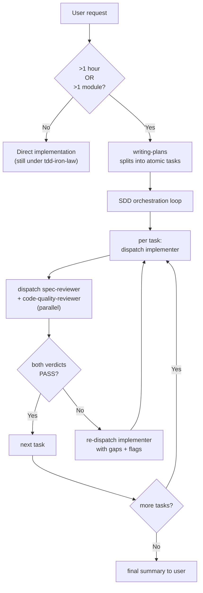

## Continuous execution

**Do not pause to check in between tasks.** When the orchestrator (this skill) receives a plan, it dispatches the first task's three subagents, waits for their verdicts, applies the resolution rule below, and immediately dispatches the next task. The user is not in the loop on a per-task basis — that is the loop SDD exists to remove.

Pause points the user **does** see:

- The plan itself, before any task is dispatched (user approves the task list).
- A `NEEDS_CONTEXT` from any implementer (orchestrator surfaces the question, waits for an answer).
- A `BLOCKED` from any implementer that the orchestrator cannot unblock by re-dispatch (e.g. missing dependency the user must install).
- The final summary after all tasks `DONE` (or `DONE_WITH_CONCERNS` triaged).

Everything else — RED-GREEN-REFACTOR cycles, reviewer rounds, re-dispatch on `NEEDS_REVISION` — runs without user intervention.

## When to use

Auto-routed by [`using-code-toolkit`](../using-code-toolkit/SKILL.md) when **either** trigger fires:

- The user's task is estimated to take **>1 hour**.
- The task touches **>1 module / >1 file boundary**.



If neither trigger fires, the user goes straight to `tdd-iron-law` for implementation. SDD's overhead is not free; do not dispatch three subagents for a one-line change.

## Process — per-task triad

For each atomic task in the plan:

1. **Dispatch `implementer`** with the task description + context paths + resource paths (see [`agents/implementer-prompt.md`](agents/implementer-prompt.md)). Wait for return.
2. **Read the implementer's output.** If `status: NEEDS_CONTEXT` → surface the question to the user, do not dispatch reviewers. If `status: BLOCKED` → apply the unblock step or surface to user.
3. **If `status: DONE` or `DONE_WITH_CONCERNS`**, dispatch **`spec-reviewer`** and **`code-quality-reviewer`** **in parallel** (one message, two tool calls). Wait for both.
4. **Resolve verdicts** per the rule below.
5. **Move to the next task** unless the resolution requires re-dispatch.

### Verdict resolution

| spec-reviewer | code-quality-reviewer | Resolution |
|---|---|---|
| `PASS` | `PASS` | Task DONE. Next task. |
| `PASS` | `PASS_WITH_NOTES` | Task DONE. 🟡 / 🟢 flags surfaced in final summary as debt; do not block. |
| `PASS` | `NEEDS_REVISION` | Re-dispatch implementer with `flags`. Up to **3 rounds** then escalate to user. |
| `NEEDS_REVISION` | (any) | Re-dispatch implementer with `gaps` + (if any) `flags`. Same 3-round cap. |

A 3-round cap prevents infinite loops on ambiguous specs. On the 4th retry, surface to the user — likely the spec is wrong, not the implementer.

## Model selection

Pick the cheapest model that meets the task's actual reasoning load.

| Task category | Model class | Examples |
|---|---|---|
| Mechanical | cheap (Haiku / equivalent) | Rename a symbol across files; add a simple test fixture; format / lint cleanup |
| Integration | standard (Sonnet / equivalent) | Wire a new endpoint; add a feature flag check; refactor a function while preserving tests |
| Architecture | most capable (Opus / equivalent) | Introduce a new module boundary; design an interface; non-trivial security-sensitive logic |

Reviewers usually run at one tier below the implementer — they grade against fixed rubrics, which is cheaper than producing the artifact. **Exception**: when the implementer ran at the most-capable tier on an architectural task, the code-quality-reviewer also runs at most-capable (subtle design errors need the same horsepower to catch).

## Status handling — implementer states

```
DONE                 → dispatch reviewers
DONE_WITH_CONCERNS   → dispatch reviewers; surface concerns to user in final summary
NEEDS_CONTEXT        → surface specific question to user; do NOT dispatch reviewers
BLOCKED              → apply unblock_step if orchestrator can; else surface to user
```

The orchestrator never silently dismisses a `BLOCKED` — even if the unblock step is trivial, log what was done so the final summary names it.

## Prompt templates

Three role-defined subagent prompts; the orchestrator substitutes `{…}` placeholders when dispatching:

- [`agents/implementer-prompt.md`](agents/implementer-prompt.md) — worker; produces code + tests + status.
- [`agents/spec-reviewer-prompt.md`](agents/spec-reviewer-prompt.md) — evaluator; produces `PASS` / `NEEDS_REVISION` + gap list.
- [`agents/code-quality-reviewer-prompt.md`](agents/code-quality-reviewer-prompt.md) — evaluator; produces three-valued verdict + six-dimension scores + flags.

Reviewer prompts intentionally constrain scope: spec-reviewer **cannot** evaluate code quality; code-quality-reviewer **cannot** evaluate spec coverage. Mixing the two collapses the signal at the orchestrator level.

## Cross-skill contract

- **[`tdd-iron-law`](../tdd-iron-law/SKILL.md)** — implementer prompts must load this skill before writing code. The reviewer's `tests` dimension scores against `standards/tdd-standard.md` (functional copy of code-team SSOT).
- **`writing-plans`** (Phase 2) — produces the task list SDD consumes. Until Phase 2 ships, the orchestrator may draft a ≤5-task plan inline and ask the user to approve it.
- **`finishing-a-development-branch`** (Phase 3) — runs after the last task is DONE; delegates to `dev-workflow:git-memory` for commit-message memory.
- **`domain-teams:code-team`** — passive gate; not invoked by SDD directly. The knowledge layer here is a functional copy of code-team's standards / rubrics / checklists, kept byte-identical by `scripts/distribute.py` + `scripts/verify-drift.py`.

## Knowledge layer

`standards/`, `rubrics/`, `checklists/` under this skill are byte-identical functional copies (plus a 5-line SSOT header) of the canonical `code-team` knowledge layer (which lives in the sibling `domain-teams` plugin). To edit a rule:

1. Land the edit in the canonical `code-team` source.
2. In the same commit, run `python3 code-toolkit/scripts/distribute.py`.
3. CI's `verify-drift.py` enforces byte-identity.

See [`../../scripts/canonical/README.md`](../../scripts/canonical/README.md) for the full pointer table (canonical paths + functional-copy destinations).

## What this skill does NOT do

- Does **not** write code itself. It dispatches implementer subagents.
- Does **not** produce gate verdicts itself. Reviewer subagents do.
- Does **not** decide whether SDD applies. `using-code-toolkit` routes; this skill assumes the trigger fired.
- Does **not** edit the spec. If the implementer returns `NEEDS_CONTEXT` pointing at a spec gap, the orchestrator surfaces to the user; the user (or `writing-plans`) updates the spec.
- Does **not** produce the plan. `writing-plans` does — SDD consumes the plan.

## See also

- [`agents/implementer-prompt.md`](agents/implementer-prompt.md)
- [`agents/spec-reviewer-prompt.md`](agents/spec-reviewer-prompt.md)
- [`agents/code-quality-reviewer-prompt.md`](agents/code-quality-reviewer-prompt.md)
- [`../tdd-iron-law/SKILL.md`](../tdd-iron-law/SKILL.md)
- [`../using-code-toolkit/SKILL.md`](../using-code-toolkit/SKILL.md)
- [`../../TECH-SPEC.md`](../../TECH-SPEC.md) §3.3–3.4 — interface contracts.
