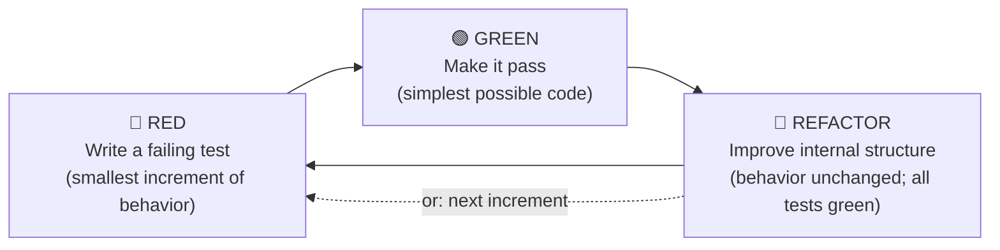

## The Iron Law

> **NO PRODUCTION CODE WITHOUT A FAILING TEST FIRST.**

This is not a guideline. It is the floor of the discipline. The Iron Law has exactly one consequence when violated:

> **Delete the code. Write the test. Start over.**

Not "add a test after the fact." Not "promise to add one later." Delete the production code, write the failing test you should have written, then re-derive the implementation under the Red-Green-Refactor cycle. The deletion is not punishment — it is restoration of the feedback loop that the violation disabled.

## Grounding (primary sources)

The Iron Law is not a stylistic preference. Four primary sources converge on it:

### Beck (2002) Preface — the canonical formulation

Kent Beck, *Test-Driven Development: By Example* (Addison-Wesley Signature Series), ISBN **978-0321146533**, Preface:

> *"Write the test you wish you had. Make it fail. Make it pass. Make it clean."*

And further in the Preface:

> *"If it's hard to test, it's probably hard to use."*

Beck does not present TDD as "test-first if convenient." The Preface frames TDD as the discipline by which design feedback is obtained at the cost of one minute per cycle. Skipping the failing test is not skipping a step — it is opting out of the feedback loop entirely.

### Beck (2002) Ch.1 + Part II — the cycle

- **Ch.1 "Multi-Currency Money"** walks the Red-Green-Refactor cycle end-to-end on a worked example.
- **Part II "Test-Driven Development Patterns"** (Ch.25 in particular) names the cycle's sub-patterns: *Fake It ('Til You Make It)*, *Triangulate*, *Obvious Implementation*, *Child Test*, *One Step Test*. These are the moves; the Iron Law is the rule that says you may only make them in order.

### Martin (2008) Clean Code Ch.9 — the Three Laws (Beck operationalized)

Robert C. Martin, *Clean Code: A Handbook of Agile Software Craftsmanship* (Prentice Hall), ISBN **978-0132350884**, Ch.9 "Unit Tests":

1. *"You may not write production code until you have written a failing unit test."*
2. *"You may not write more of a unit test than is sufficient to fail — and not compiling is failing."*
3. *"You may not write more production code than is sufficient to pass the currently failing test."*

The Three Laws operationalize Beck's Preface rule into a minute-by-minute discipline. They rule out *"I'll write ten tests, then one big implementation"* and *"I'll write a speculative implementation that handles five untested cases."*

### 和田卓人 訳 (2017) — JP 正規参照

和田卓人 訳『テスト駆動開発』(オーム社, 2017), ISBN **978-4274217883**。Beck (2002) の日本語正規訳であり、日本の TDD コミュニティの de facto 一次参照。日本人プログラマと協働する際は、訳者解説の「テストは仕様の具体化であり、設計の feedback loop である」を引用基底とする。

## Red-Green-Refactor — the only cycle

**Three steps. In order. Every time.**

- **RED**: write the smallest test expressing the next increment of behavior. Run it. **It MUST fail.** If a test passes on first run without any production code change, either the behavior already exists (no new test needed) or the test is not actually testing anything (false green — see Red Flag below).
- **GREEN**: write the simplest code that makes the failing test pass. *Simplest* does not mean *sloppy* — it means no speculative generality, no premature abstraction. Ugly duplication at GREEN is acceptable; you remove it in REFACTOR.
- **REFACTOR**: with all tests green, improve internal structure without changing behavior. If a test goes red during refactor, **revert and take a smaller step**. Skipping refactor is "tests-first," which is not TDD — see Beck (2002) Preface.

## When NOT to Use

The Iron Law has a narrow, enumerated exception list. If your work is **not** on this list, the Iron Law applies. Do not invent new exceptions.

| Exempt category | What qualifies | What does NOT qualify |
|---|---|---|
| **Throwaway / spike** | Code you will delete within the same session, never commit, never reference again. | "I'll clean it up later." That's not throwaway — that's tests-last. |
| **Pure code generation** | Output of a generator that is regenerated from a spec (protobuf, OpenAPI stubs, ORM migrations). | Hand-written code in a generated-looking style. |
| **Trivial getter / setter / pure delegation** | One-line field exposure or a method whose body is `return other.method(args)`. | Anything with branching, validation, or transformation. |
| **Pure configuration** | A `.toml` / `.yaml` / `.env` with no executable behavior. | A "config" file with embedded Python / shell / Jinja logic — that's code. |
| **Explicit user override** | User says *literally* "skip TDD for this task" AND the task matches one of the above categories. | User says *"I just want a quick fix"* — that's the rationalization the Iron Law is for. |

When uncertain, ask: *"Would I be comfortable if this code shipped to production and broke silently?"* If the answer is no, you are on the critical path — TDD applies.

## Red Flags — refuse these rationalizations

| Agent / user says | Reality | Correct response |
|---|---|---|
| "I'll write the code first, tests second." | Tests-after rationalization. The feedback loop is lost. | Refuse. Cite Beck (2002) Preface: *"Write the test you wish you had."* |
| "Just this once — it's a small change." | Iron Law violation. Small changes accumulate. | Refuse. Write the failing test. |
| "Tests are slow / flaky / annoying." | The pain is the message. (Beck 2002 Preface: *"If it's hard to test, it's probably hard to use."*) | Refactor production code until tests are fast. Do not skip. |
| "I already wrote the code. Now what?" | Code without a preceding failing test = Iron Law violation. | **Delete the code. Write the test. Start over.** |
| "The test passed on first run — done!" | False green. The test was not actually testing the change. | Force RED first: comment out the production code, confirm the test fails, restore the code, confirm it passes. |
| "Subagents add too much overhead." | Context-window argument, not quality argument. | If the task warrants SDD (see `subagent-driven-development`), it warrants TDD inside each subagent. |
| 「ちょっと試すだけ / 我先快速試一下」 | Same rationalization, localized. | Same refusal. テストを先に書く。先寫測試。 |
| "User said skip TDD." | Valid only if user is explicit AND the work matches §When NOT to Use. | Quote §When NOT to Use back. Ask for explicit confirmation. |

## False-green diagnostic

If a test passes on first run:

1. **Comment out the production code change** that the test is supposed to cover.
2. **Re-run the test.** It must fail.
3. **If it still passes**, the test is not actually testing what you think. Rewrite the test until it can fail.
4. **Restore the production code.** Re-run. It must pass.

Skipping this diagnostic is how tests-pass-but-bug-still-ships happens. Beck (2002) Ch.1 walks through exactly this discipline on the Multi-Currency Money example.

## Cross-skill contract

- **`subagent-driven-development`** dispatches implementer subagents that work under this Iron Law. The implementer prompt loads this skill before writing any code.
- **`verification-before-completion`** (Phase 3) re-checks that every behavior shipped in the diff has a corresponding failing-then-passing test in commit history.
- **`domain-teams:code-team`** evaluator subagent applies `tdd-standard.md` as one dimension of `rubrics/quality-gate.md` scoring. This skill's `standards/tdd-standard.md` is a byte-identical functional copy of that file plus a SSOT header — the canonical version lives at `domain-teams/skills/code-team/standards/tdd-standard.md`.

## Reference

- `standards/tdd-standard.md` — functional copy of code-team SSOT (full F.I.R.S.T properties, Three Laws, anti-patterns, JP anchor). Read this for the longer-form discipline.
- `references/testing-anti-patterns.md` — enumerated anti-patterns with primary-source citations.
- `../../scripts/canonical/README.md` — SSOT pointer for the functional-copy mechanism.
- `../using-code-toolkit/SKILL.md` — router; explains how this skill is invoked in the larger flow.
