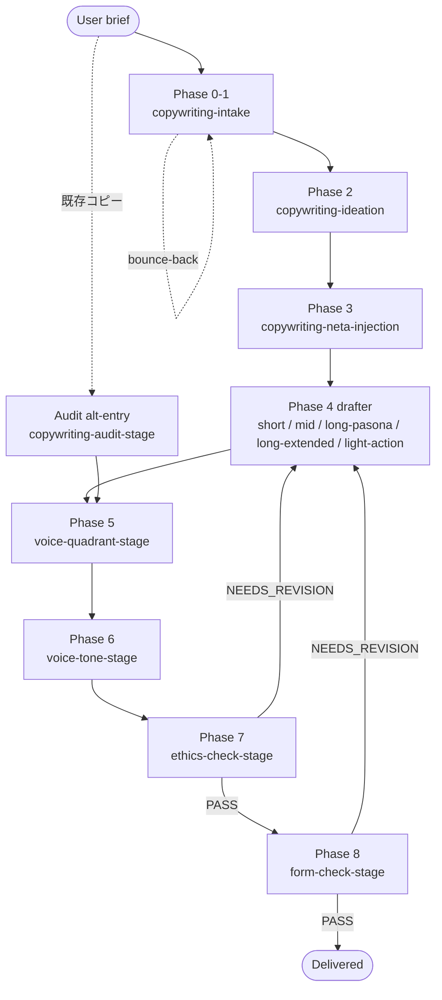

# copywriting-toolkit

> パイプライン構造の copywriting plugin — 14 skills + 2 agents + envelope contract、JP / Anglo / 中華圏のコピー伝統に grounded。

Read this in: [English](README.md) | **日本語** | [繁體中文](README.zh-TW.md)

raw な copywriting brief を、polished landing page / sales letter / headline / audit へと 9-phase pipeline で変換する Claude Code plugin。各 phase はそれぞれ独立した skill — intake が brief を明確化し、ideation が散らかして選び、neta injection が文化的フックを足し、5 つの form 別 drafter のいずれかが本文を書き、voice / tone tuning が register を整え、ethics + form gate が legal / framework 違反で配信を止める。神田昌典 PASONA / 谷山雅計 discipline / 今泉 曼陀羅 / Cialdini / Schwartz / 景品表示法 / FTC Endorsement に grounded。

## Status

- **Version**: 1.14.0（voice 衝突時の anchor autonomy、2026-04-23）
- **License**: MIT
- **Stability**: Active。14 skills + 2 agents + 90 voice anchors + 12 quadrant routers + envelope contract + CI lint baseline（accepted failure 3 件）。
- **A/B coexistence**: この plugin は `domain-teams:copywriting-team` と並列で動作する。original team skill は無変更。両 pipeline は意図的に並存しており、統合は post-A/B retrospective 後に判断。1 回の run では片方を選び、混在させない。

## Background

汎用 agent に copywriting を任せると、observable な失敗 mode が 2 つある：

1. **Aesthetic capture（美的捕獲）** — copywriter persona の model は legal / ethics / framework 判定の lens として不適切。景品表示法違反を綺麗な文章へと「軟化」させてしまう。
2. **Lineage flattening（系譜の平板化）** — brief が zh-TW なのに「糸井風で書いて」と指示すると 翻譯腔（translation-flavored prose）になる。voice lineage の選択は brief 中の maestro 名ではなく、`output_language` で governed されるべき。

この plugin は (a) persona の異なる 2 agent — drafting する `copywriter`（sonnet）と判定する `copywriter-evaluator`（opus、別 model）、(b) 9-phase の envelope-passing pipeline — 各 phase が scoped responsibility / machine-checkable preconditions / bounded retry cap を持つ — の 2 軸で関心を分離する。

## 9-Phase pipeline

| Phase | Skill | 役割 |
|---|---|---|
| 0 | `copywriting-intake` | Q1-Q10 brief intake、Level 1/2/3 field elicitation |
| 1 | `copywriting-intake`（inline） | Message Confirmation、Understanding Summary、Intake Completeness MUST gate |
| 2 | `copywriting-ideation` | 曼陀羅 + Verbalized Sampling で散らかし → KJ法 + 谷山「なんかいいよね禁止」で選ぶ |
| 3 | `copywriting-neta-injection` | WebSearch 経由の metaphor / pun / meme / 文学引用 overlay（4 技法） |
| 4 | 5 drafter のいずれか | Form 別 draft（short / mid / long-pasona / long-extended / light-action） |
| 5 | `copywriting-voice-quadrant-stage` | Authority↔Affinity × Reason↔Emotion 4 象限への positioning |
| 6 | `copywriting-voice-tone-stage` | 4-axis tone tuning + 90 anchor の register signal application |
| 7 | `copywriting-ethics-check-stage` | 景品表示法 / FTC / Cialdini / 小霜「嘘をつかない」 MUST gate |
| 8 | `copywriting-form-check-stage` | PASONA / BEAF / QUEST / PASTOR / PREP / CREMA stage 完備性 MUST gate |

Phase 0, 1, 4, 5, 6, 7, 8 は必須。Phase 2 / 3 は理由を明記すれば skip 可。Phase 7 + 8 は evaluator-only — 判定するのみで、draft を編集しない。

### Pipeline flow



Bounce-back ルール（router 強制）：`bounce_round >= 3` で HALT、`revise_round_count >= 2`（per phase）で HALT、`total_retries >= 4`（合計）で HALT。詳細は `CLAUDE.md §Envelope Violation`。

## Brief field 構造

Field tier は `copywriting-intake/SKILL.md §Field tiers` 由来。Level 1 が欠けると pipeline は BLOCK される。

| Tier | Fields |
|---|---|
| **Level 1**（Must、欠落で BLOCKED） | `form_type`、`product` + `value_proposition`、`target_audience`、form 別 must field（word-count + Schwartz / benefits + channel / emotion + char-limit / candidate count / external_copy 全文） |
| **Level 2**（Should、AI が推奨し user が承認） | `voice_reference`（糸井 / 岩崎 / 眞木 / 谷山 / Ogilvy / 龔大中 / 許舜英 / default）、`framework` / `approach` |
| **Level 3**（May、opt-in） | `neta_opt_in`（default No）、`neta_source_type_preference` |

## 2 つの execution path

`copywriting-intake` は 2 つの path のいずれかで Understanding Summary を生成する：

| Path | Protocol | 適用条件 | Elicitation |
|---|---|---|---|
| **Q1-Q10**（default） | `copywriting-brainstorming.md` | brief が rough / Level 1 fields 欠落 / bounce-back 後の re-entry | 1 ターンに 1 質問、recommended answer 付き multiple-choice |
| **Express Mode** | `express-mode.md` | router の Step 0.5 Express Qualification が「raw brief は Level-1-complete」と判定 | 合成 + single-turn confirmation |

両 path とも同一の Intake Completeness MUST gate を通過する。Express Mode は fast-path であって rigor を緩めた path ではない — rigor は質問数ではなく gate に宿る。bounce-back は re-entry 時の Express を disqualify し、失敗 envelope は user 発話から Q1-Q10 を再走（stale な合成は使わない）。

## Skills

| Skill | Phase | 役割 |
|---|---|---|
| `using-copywriting-toolkit` | router | Route + validate + Express qualify。preconditions の単一強制点 |
| `copywriting-intake` | 0-1 | Brief intake + Message Confirmation、Q1-Q10 か Express、Intake Completeness MUST gate |
| `copywriting-ideation` | 2 | 散らかし（曼陀羅 + VS + 小霜）→ 選ぶ（KJ + 谷山 3-reason）、scoped 8-12 / standard 40-64 / full 64-100+ |
| `copywriting-neta-injection` | 3 | WebSearch pipeline A-D、4 技法、Neta Safety SHOULD gate（景品表示法 ステマ + copyright veto） |
| `copywriting-short-form` | 4 | キャッチコピー / headline / tagline（7-15 字、AIDMA A+I、3 秒ルール、5 切入點） |
| `copywriting-mid-form` | 4 | EC product copy を BEAF（Benefit → Evidence → Advantage → Feature）で |
| `copywriting-long-form-pasona` | 4 | LP / sales letter / 記事広告 を 旧 PASONA（5）/ 新 PASONA（6）/ PASBECONA（9）で |
| `copywriting-long-form-extended` | 4 | EN / 国際 long-form を QUEST / PASTOR（5/6 stage、expert / shepherd / guide positioning） |
| `copywriting-light-action` | 4 | Opt-in / subscribe / download / LINE 登録 を PREP / CREMA で（Kaushik 2007 micro-conversion） |
| `copywriting-voice-quadrant-stage` | 5 | 2 軸 4 象限 — Q1 Authority-Reason / Q2 Authority-Emotion / Q3 Affinity-Emotion / Q4 Affinity-Reason |
| `copywriting-voice-tone-stage` | 6 | 4-axis tone tuning + Pass 3 voice anchor register signal（90 anchor、12 quadrant router） |
| `copywriting-ethics-check-stage` | 7 | 景品表示法 2023 / ステマ告示 / FTC 16 CFR 255 / Cialdini misuse / 小霜「嘘をつかない」 MUST gate |
| `copywriting-form-check-stage` | 8 | PASONA / BEAF / QUEST / PASTOR / PREP / CREMA stage 完備性 + length band + CTA 適切性 MUST gate |
| `copywriting-audit-stage` | alt | 既存外部コピーに対し Phase 5-8 を走らせる（intake / ideation / draft なし） |

各 skill が自身の `## Preconditions` schema を持ち、router は launch 前に envelope を該当表に対して検証する。schema は各 `SKILL.md` に、envelope vocabulary は `.claude-plugin/envelope.schema.json` に置く。

## Agents

Plugin local pair — `domain-teams` とは共有しない。2 agent、2 persona、2 model tier。

| Agent | Tier | 役割 | Persona |
|---|---|---|---|
| `copywriter` | sonnet | Drafting / ideation / audit-variant 生成 | 糸井重里 / 岩崎俊一 / 眞木準 / 谷山雅計（JP）と Ogilvy / Schwartz / Halbert / Cialdini（Anglo）の系譜を持つ reader-first copywriter、小霜「嘘をつかない」 discipline |
| `copywriter-evaluator` | opus | Gate verdict（legal / framework / voice / form） | 厳格な legal + framework reviewer、意図的に copywriter ではない |

### なぜ 2 persona か

aesthetic capture は実際に観察される anti-pattern：copywriter persona の model は景品表示法違反を綺麗な文章に軟化させる。legal-reviewer persona は信頼できる verdict を出す代わりに、rhetorical force を欠く risk-averse なコピーを書く。1 つの multi-role agent でこれを兼ねると両方が濁る。分離が両 role の正直さを保つ。

tier を区別できない platform では、両方を opus に default する。両方を sonnet に default するのは **NG** — evaluator の aesthetic-capture 抵抗は低 tier ほど維持しにくい。

## Envelope contract

Phase 間は JSON envelope で受け渡しする。field 名と型は `.claude-plugin/envelope.schema.json` に固定、skill 別 preconditions は各 `SKILL.md §Preconditions` に置く。router（`using-copywriting-toolkit`）が単一強制点 — launch 前に target skill の Preconditions table と envelope を照合し、違反時は target を起動せず `violation` envelope を上流に route する。

### Retry 上限

3 つの counter が 1 つの集計値に集約される。すべて monotonic、すべて router-owned。

| Counter | Trigger | Hard cap |
|---|---|---|
| `bounce_round` | skill 起動前の schema 違反 | `>= 3` で HALT |
| `revise_round_count` | evaluator verdict による auto-revise（per phase） | `>= 2`（per phase）で HALT |
| `total_retries` | `bounce_round + revise_round_count` | `>= 4`（合算）で HALT |

合算 cap は、schema bounce と verdict revision を交互に発生させて個別 cap を回避する pathological cycle を塞ぐためにある。`superpowers:executing-plans` の stop-and-ask に倣う：進捗が出せないときは止まって聞く。

### Immutable fields

特定の envelope field は変更せず通過させなければならない。最後にその field を書いた skill へ、router が envelope を bounce-back する。

- `voice_quadrant`（object 全体、`schwartz_alignment` を含む）
- `tone_notes.register_signal_applied.named_master_fit_warning`
- `brief.*` Level 1 fields
- `audit_trail[]`（append-only）
- `retries.*`（monotonic — 下流 skill が reset してはならない）
- `express_mode_used`
- `violation`（bounce-back 消費まで）

詳細は `CLAUDE.md §Handoff Envelope §Immutable fields`。

## Grounding

load-bearing なすべての主張は一次資料に anchored される。standards file が原典を引用し、`copywriter` agent は attribution の捏造を禁じられる。

| 領域 | Primary sources |
|---|---|
| JP long-form | 神田昌典 PASONA / 新 PASONA / PASBECONA |
| JP discipline | 谷山雅計 2007『広告コピーってこう書くんだ！読本』（なんかいいよね禁止） |
| Ideation | 今泉 1987 曼陀羅；川喜田 1967 KJ 法；小霜和也 本能分析；Zhang et al. 2025 Verbalized Sampling |
| Persuasion | Cialdini 1984 *Influence*；Schwartz 1966 *Breakthrough Advertising*（5 levels of awareness） |
| EN long-form | Fortin 2005 QUEST；Edwards 2016 PASTOR；Hopkins / Halbert / Schwartz / Ogilvy DR canon |
| Voice 軸 | Halliday 1978 Tenor（Authority↔Affinity）；Vaughn 1980/1986 FCB（Reason↔Emotion） |
| Mid-form | BEAF（Benefit-first ordering、6-Layer Marketing Pyramid 系譜） |
| SNS evolution | 秋山・杉山 AISAS；飯髙 ULSSAS |
| Metaphor / neta | McQuarrie & Mick 1996；Lakoff & Johnson 1980；Thornton 1995（subcultural capital） |
| Ethics — JP | 景品表示法 2023 改正；ステマ告示（消費者庁 2023） |
| Ethics — EN | FTC Endorsement Guides 16 CFR 255；Brignull dark patterns |

## Voice anchor library

JP / ZH（TW + HK + 大陸）/ EN にまたがる 90 個の individual-creator anchor、12 個の quadrant router file（`{lang}-q{N}-anchors.md`）から address される。各 anchor file は v2 schema に従う（canonical 構造を `scripts/lint-anchor-library.py` が CI baseline 3 件で強制）：

- frontmatter：`schema_version`、`anchor_slug`、`culture`、`quadrant`、`landmark`
- `## Native critical read`（H2）
- `## Metadata`（grouped — `Over-mimic risk` + canonical attribution rule）
- `## What this register achieves`
- `## Prose mechanics` + `## Don't`
- 5 件以上の dated / attributable な作例

`voice-anchor-meta.md` 由来の選定ルール：

- lineage は `envelope.brief.output_language` が決める。brief 中の maestro 名ではない。cross-language brief 中の maestro 引用は quadrant signal となり、anchor は target-language の native creator のうち同 quadrant のものになる。
- Cross-master context：cross-tradition transplant（例：体言止めを zh-TW に強制）は禁止。cross-language borrowing は frontmatter `cross-reference-valid-for[target_lang] == STRONG` かつ brief が許可する場合のみ。
- Named-creator routing：`brief.voice_reference` が `anchor-{slug}.md` を持つ creator を指名すると、その anchor は forced rank 1 になる。agent の fit-judgement が MEDIUM / LOW のとき `named_master_fit_warning` が発火し、下流 phase へ immutable に伝搬する。
- v1.14.0 conflict rule：anchor の `§Prose mechanics` / `§Don't` が `brief.form_hint` / `brief.tone_cue` / Phase 4 draft 構造と衝突したとき、anchor が勝つ。mechanics は binding requirement であって示唆ではない。ただし anchor は Level 1 brief field（output_language / audience / product / goal）を override できない。

## Install

```bash
# Claude Code 上、monkey-skills marketplace 有効化済みで
/plugin install copywriting-toolkit@monkey-skills
```

plugin は self-contained：API key 不要、cache path 不要、persistent state なし。skill は自身の directory + plugin-root の共有 resource（`agents/`、`CLAUDE.md`、`envelope.schema.json`）を読む。network access は `copywriting-neta-injection` Phase A の WebSearch（source-taxonomy allow-list — Path A-1 SNS / meme、Path A-2 文学）でのみ必要。

## Usage

すべての copywriting work は slash command で起動：

```
/using-copywriting-toolkit
```

intake の shape は 3 種、いずれも同じ entry point から route される：

| Shape | Trigger | Path |
|---|---|---|
| **Shape A** — new brief | "X の LP 書いて" / "Y の headline 候補" | Q1-Q10 か Express → ideation → neta → drafter → voice → ethics → form → 配信 |
| **Shape B** — audit | "この既存コピー review して" + 全文 | `copywriting-audit-stage` が `external_copy` に対し Phase 5-8 を走らせる |
| **Shape C** — pipeline 途中再開 | 過去 session の envelope | router が `envelope.phase` + 直近 verdict を読み、再開 |

target skill が判明している場合（例：user が明示的に「form gate を走らせて」）は直接呼び出しも可。external caller が initial envelope を構築する際は `CLAUDE.md §External Caller Guide` に従うこと — 事前に `voice_quadrant` を埋めたり手動で `gate_verdict: "PASS"` を立てると下流 gate を silently bypass してしまう。

## Contributing

PR は `https://github.com/kouko/monkey-skills` 経由で歓迎。conventions：

- **Tier 1（byte-identical）** — `skills/*/standards/*.md` 内の third-party academic canon prose（神田 PASONA / 谷山 / Cialdini / Schwartz / Halliday / Vaughn 等）。`domain-teams/skills/copywriting-team/` に対し `diff -q` で検証。神田昌典の PASONA 定義を plugin が編集する権限はない。
- **Tier 2（divergence 許容）** — `protocols/*.md` / `checklists/*.md` / `rubrics/*.md`。改変時は `<!-- DIVERGED FROM -->` header を付け、original prose をすべて保存（additive only — 削除 / 並び替え / 書き換え禁止）、plugin 固有の追加は `<!-- v1.x.y addition: <topic> -->` block で印を付け、各 divergence を `CHANGELOG.md` に記録。
- **Plugin-native** — voice anchor library（90 anchor + 12 quadrant router + `voice-anchor-meta.md` + `anchor-schema-v2.md`）には upstream 相当物が存在しない。plugin が完全に own する。

Commit prefix は `feat(copywriting-toolkit)` か `chore(copywriting-toolkit)` のみ — CC CI whitelist。`test:` / `ci:` commit は使わない（fixture は関連 `feat` commit に同梱）。

CI：`scripts/lint-anchor-library.py` が PR ごとに走る。baseline は accepted failure 3 件。それ以外の新規 drift は merge を block する。

## License

MIT — 詳細は repository root の [LICENSE](../LICENSE) を参照。
