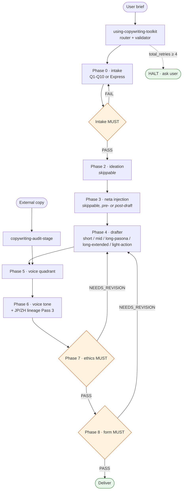

# copywriting-toolkit

[English](README.md) | **日本語** | [繁體中文](README.zh-TW.md)

pipeline 構造の copywriting plugin。`domain-teams:copywriting-team` から、それぞれ 1 つのジョブだけを担当し、self-contained な standards を持ち、stage 間を JSON-Schema で検証された hand-off envelope で受け渡す 14 個の専門 skill にリファクタリングしたもの。2 つの実行 path（Express Mode + Q1-Q10 intake）、層状の precondition / bounce-back メカニクス、primary source に錨を打った JP + ZH の voice lineage 工法を備える。

## Status

- **v1.14.0** — 現行版（2026-04-23）。voice 衝突時の anchor autonomy：`anchor §Prose mechanics / §Don't` が `brief.form_hint` / `brief.tone_cue` / Phase 4 draft 構造と衝突したときは anchor が勝つ；Level-1 フィールドは引き続き immutable。
- **v1.13.3 / v1.13.4** — フォーマット統一（90 個の anchor を単一 canonical 構造に）+ CI lint gate。
- **v1.4.0+ anchor library** — EN / JP / ZH / zh-TW / zh-HK にまたがる 90 個の voice anchor を、12 個の quadrant router（`{lang}-q{N}-anchors.md`）+ `voice-anchor-meta.md` に分割。plugin-native standards（`domain-teams` には upstream 対応物なし）。
- **v1.0.x** — 初期リリース。A/B 比較のため `domain-teams:copywriting-team` と並走。

完全な履歴は [`CHANGELOG.md`](CHANGELOG.md) を参照。

## 9-Phase Pipeline

```
Phase 0  copywriting-intake                       mandatory (Q1-Q10 or Express)
Phase 1  [inline in intake]                       mandatory, LOOSE recommend planning-team
Phase 2  copywriting-ideation                     skippable
Phase 3  copywriting-neta-injection               skippable, hybrid pre/post
Phase 4  one of:                                  mandatory
           copywriting-short-form
           copywriting-mid-form
           copywriting-long-form-pasona
           copywriting-long-form-extended
           copywriting-light-action
Phase 5  copywriting-voice-quadrant-stage      mandatory
Phase 6  copywriting-voice-tone-stage             mandatory
Phase 7  copywriting-ethics-check-stage           mandatory, evaluator-only
Phase 8  copywriting-form-check-stage             mandatory, evaluator-only
Alt      copywriting-audit-stage                  alternate entry for external copy
```

Entry router：`using-copywriting-toolkit`。

## Pipeline Flow

happy-path の背骨。bounce-back、retry caps、Express vs Q1-Q10 grill、Phase 6 JP/ZH dual-trigger conflict、audit のサブ stage は §Envelope Contract、§Two Execution Paths、各 skill の SKILL.md を参照。



## Example Brief — Pipeline への参照入力

**brief**（業界用語：creative brief）は pipeline に渡すタスク記述。Phase 0 intake はこれを `envelope.brief{}` フィールドに整形する。完全な brief は Express Mode（単ターン確認）を、不完全な brief は Q1-Q10 マルチターン intake を発火し、欠落を埋める。

### brief フィールド構造（pipeline が期待するもの）

| フィールド | Level | 役割 | 例 |
|---|---|---|---|
| `product` | 1 — required | 売っているもの、命名済み | 「禾井」台灣在地職人手工醬油 |
| `value_proposition` | 1 — required | 一文で語るコア価値 | 台灣本土非基改黑豆 + 木桶發酵 18 個月, 月訂 NT$680 含冷藏宅配 |
| `target_audience` | 1 — required | 具体的な demographic / psychographic | 30-50 歲, 注重料理品質, 已接觸日本職人醬油 / 有機食品店消費 |
| `schwartz_level` | 1 — required | awareness level（Schwartz 1966）L1-L5 | L2-L3（product-aware → solution-aware）|
| `form` | 1 — required | copy form | long-form-pasona（新 PASONA, ~3500 字 LP）|
| `channel` | 1 — required | 配信面 | landing-page hero + body |
| `target_length` | 1 — long-form 必須 | 想定字数 | ~3500 字 |
| `output_language` | 1 — required | ja / zh-TW / zh-HK / en など | zh-TW |
| `voice_reference` | 2 — AI-recommend-or-user-stated | maestro 名（user-quoted only）または記述子 | 糸井重里 / 許舜英 / "default" + voice_description |
| `voice_description` | 2 — optional | 自由文の style 記述 | "溫暖 / 狀態提案 / 體言止め / 不直接呼籲 / 余韻" |
| `framework` | 2 — AI-recommend | PASONA family / BEAF / QUEST / PASTOR / PREP / CREMA | 新 PASONA |
| `claims[]` | context | 比較級・最上級・実証必要な claim（Phase 7 裁定用）| 「全世界最長發酵時間 18 個月」（T2 — benchmark-required）|
| `neta_opt_in` | 3 — default false | pop-culture / meme / 文学レイヤーを許可するか | false |

**Level 1 = 欠落 → BLOCKED**（intake が Q1-Q10 elicitation を強制）。
**Level 2 = AI-recommend + user-confirm**（Express では `[AI-recommend]` または `[user-stated]` をラベル付け）。
**Level 3 = opt-in / default**（`[default]` ラベル）。

### 参照 brief — 「禾井」醤油月額 LP（v1.1.0 E2E test 用）

```
產品：台灣在地職人手工醬油品牌「禾井」
受眾：30-50 歲、注重料理品質、已接觸過日本職人醬油 / 有機食品店消費
      習慣 (Schwartz L2-L3)
價值主張：使用台灣本土非基改黑豆 + 純手工木桶發酵 18 個月，
          每瓶 500ml，月訂閱 NT$680 含冷藏宅配
Voice：糸井重里 ほぼ日 Q3 Affinity-Emotion — 溫暖 / 狀態提案 / 體言止め
       (user explicitly named 糸井)
Output language：zh-TW
Form：long-form-pasona 新 PASONA (6-stage, ~3500 字)
Channel：landing page hero + body

Claim to test:「全世界最長發酵時間 18 個月」— 最上級 No.1 claim;
              triggers 景表法 §5-1 優良誤認 if no benchmark
```

### なぜこの brief か — 何を行使しているか

この brief は pipeline regression のアンカーとして設計されている。toolkit を通すと v1.1.0 のメカニクス一式が行使される：

| Brief 特徴 | 何を発火するか |
|---|---|
| Level 1 フィールド全揃い | Express Mode が Step 0.5 で適格判定（Q1-Q10 fallback なし）|
| 糸井重里 user-stated + output `zh-TW` | **Dual-lineage trigger conflict** — router が violation を出し、intake で再確認；user が解決策を選ぶ（典型は Option C：`voice_reference = "default"` + `voice_description` で糸井の規律を prose posture として捉える、JP→ZH の越境移植を避けるため Pass 3 は起動しない）|
| `「全世界最」` claim | Phase 0.5-B grill での **T2 tier classification** — user-stated + benchmark_missing + 直接違反ではない → `benchmark_required_before_phase_7` flag 付きで Phase 7 へ持ち越し |
| target_length 3500 字 vs 新 PASONA の帯 3000-10000 | Phase 8 8b の字数帯 → 🟢 in-band（117%）, framework のダウングレード不要 |
| L2-L3 Schwartz × Q3 voice | `schwartz_alignment: ok` — conflict_flagged の持ち越し不要 |
| Phase 2 ideation 必須（v1.1.0）| Scoped depth（Express デフォルト）— 8-12 candidates の単一 pass、KJ で 3-5 winners に収束；`ideation_skip_rationale` は設定しない |
| Phase 4 inline micro-ideation（v1.1.0）| stage ごとに 3-5 候補 paragraph leads + 谷山 3-reason selection；落選候補は `draft_inline_ideation.rejected[]` に記録 |

期待される最終納品物：~3500 字の zh-TW 新 PASONA 6-stage LP、糸井-spirit-in-zh-TW voice、ethics gate は 1 回 auto-revise 後 PASS（「全世界最」を実証可能な比較級に置換）、Phase 8 PASS（in-band + voice 一貫）、`total_retries = 2`（1 回の dual-trigger bounce + 1 回の ethics auto-revise）、cap of 4 を十分下回る。

### この参照 brief の使い方

- 将来の各バージョンの **regression test input** として — toolkit のリリースごとに再走させて catch rate / 出力品質が後退しないか確認
- 新規ユーザーが brief の構造化を学ぶ **worked onboarding example** として
- 同一入力で本 plugin と `domain-teams:copywriting-team` を比較する **A/B baseline anchor** として
- **prompt template** として — 上記の brief block をコピー、product / audience / claim を差し替えて router に貼り付け

この brief はあえて trick の効くケースを表面化するように選ばれている（JP maestro + zh-TW output の衝突、benchmark 無しの最上級 claim）— 普通の vanilla brief ではメカニクスを十分検証できない。

## Intake の 2 つの実行 path

両 path は意図的に異なる方法で FATAL candidate を解決する（`superpowers:brainstorming` vs `superpowers:subagent-driven-development` を踏襲）：

| Path | 発火条件 | ターン数 | Grill resolution |
|---|---|---|---|
| **Q1-Q10** | brief が Level 1 フィールドを欠く / bounce-back / user が full intake を要求 | 約 10-14 user ターン | **Inline probe-and-resolve** — agent が Q8 で 3-option menu（supply / rewrite / drop）を提示；tier 概念なし |
| **Express** | brief が Level 1 フィールドを全部持ち；red flag なし | 約 3 user ターン | **Structured tier return** — T1 ABORT / T2 CARRY / T3 ABORT；tier は evaluator の output contract、`superpowers` subagent status code に類比 |

[`skills/copywriting-intake/SKILL.md §Execution Paths`](skills/copywriting-intake/SKILL.md) を参照。

## Skills

| Skill | Phase | 役割 |
|---|---|---|
| `using-copywriting-toolkit` | router | Entry + Preconditions validator + Express qualification + bounce-back enforcement |
| `copywriting-intake` | 0-1 | brief intake（Q1-Q10 または Express）+ Intake Completeness MUST gate |
| `copywriting-ideation` | 2 | Mandalart + KJ + Taniyama + VS divergence / convergence |
| `copywriting-neta-injection` | 3 | neta overlay（pre-draft bake-in / post-draft overlay）+ Neta Safety SHOULD gate |
| `copywriting-short-form` | 4 | キャッチコピー / headline（7-15 字, AIDMA A+I, 5 切入點）|
| `copywriting-mid-form` | 4 | EC product copy（BEAF: Benefit → Evidence → Advantage → Feature）|
| `copywriting-long-form-pasona` | 4 | PASONA / 新PASONA / PASBECONA（神田昌典 canonical）|
| `copywriting-long-form-extended` | 4 | QUEST（Fortin 2005）/ PASTOR（Edwards 2016）|
| `copywriting-light-action` | 4 | PREP / CREMA micro-conversion（Kaushik 2007）|
| `copywriting-voice-quadrant-stage` | 5 | Voice Quadrant（Authority↔Affinity × Reason↔Emotion）+ Schwartz routing |
| `copywriting-voice-tone-stage` | 6 | 4-axis tone + Mailchimp context-switching + JP/ZH lineage Pass 3 |
| `copywriting-ethics-check-stage` | 7 | 景品表示法 / FTC / Cialdini misuse / dark-pattern MUST gate |
| `copywriting-form-check-stage` | 8 | framework 遵守度（8a MUST）+ qualitative（8b SHOULD）|
| `copywriting-audit-stage` | alt | 外部 copy を Phase 5-8 で audit |

## Agents

plugin-local の対（`domain-teams` とは共有しない）：

| Agent | Persona | Model | 役割 |
|---|---|---|---|
| `copywriter` | reader-first、糸井 / Ogilvy / Cialdini / Schwartz lineage + 谷山 規律 + 小霜「嘘をつかない」 | sonnet | drafting、ideation、audit バリアント |
| `copywriter-evaluator` | 厳格な法務 / framework reviewer — NOT a copywriter；aesthetic-capture は明示的に anti-pattern | opus | gate verdict のみ；draft も softening もしない |

persona の分離は意図的 — charm された copywriter は 景表法 claim を通してしまう；慎重な evaluator は臨床的な copy を生む。両者を分けることで、それぞれの役割を honest に保てる。

## Envelope Contract

skill 間の hand-off は JSON-Schema で検証する。[`.claude-plugin/envelope.schema.json`](.claude-plugin/envelope.schema.json) を参照。

主要な invariant：

- **router が単一の enforcement point** — 各 skill の `## Preconditions` schema を launch 前に検証する。下流 skill は self-validate しない。
- **violation envelope** — precondition 失敗時、router が bounce-back shape（`detected_by`、`missing`、`bounce_to`、`bounce_round`、`user_message`）を発出し、上流に route する。
- **retry caps** — `bounce_round ≥ 3` → HALT；phase ごとに `revise_round_count ≥ 2` → HALT；`total_retries ≥ 4` 累積 → HALT。
- **audit trail** — envelope 上の `audit_trail[]` に skill-entered / gate-verdict / violation-detected / bounce-dispatched / halt-ask-user イベントを記録する。

## Grounding（一次資料）

`domain-teams:copywriting-team` から byte-identical で保持した standards：

- 神田昌典 2016/2021 PASONA / 新PASONA / PASBECONA
- 谷山雅計 2007 散らかす→選ぶ→磨く + なんかいいよね禁止
- 今泉浩晃 1987 曼陀羅発想法
- 川喜田二郎 1967 KJ法
- Cialdini 1984 *Influence*
- Schwartz 1966 *Breakthrough Advertising*
- Zhang et al. 2025 Verbalized Sampling（arXiv:2510.01171）
- Fortin 2005 QUEST / Edwards 2016 PASTOR
- 小霜和也 2010/2014 本能分析
- 秋山隆平・杉山恒太郎 2004 AISAS / 飯髙悠太 2019 ULSSAS
- Kaushik 2007 micro/macro conversion
- McQuarrie & Mick 1996 rhetorical operations / Lakoff & Johnson 1980 conceptual metaphor / Thornton 1995 subcultural capital
- 景品表示法（2023 年改正、2024-10-01 施行）+ FTC Endorsement Guides（16 CFR 255）
- Vaughn 1980 FCB × Halliday 1978 SFL（2-axis Voice Quadrant — team synthesis）

voice lineage 工法（Tier 3 deep-dive standards）：

- **JP** — `jp-copy-craft-lineage.md`（cp from domain-teams）：糸井重里 / 岩崎俊一 / 眞木準 / 谷山雅計 via TCC 年鑑
- **ZH** — `zh-copy-craft-lineage.md`（v1.0.1 で新規、本 toolkit 用に primary-source で調査）：許舜英（意識形態 / 中興百貨 1988-1999、日付付き 11 件のコーパス）/ 李欣頻（誠品敦南 1990s-2000s、7 件）/ 葉明桂（奧美 / 左岸 1998-、3 件 + 戦略 framework）。4 件の attribution 修正（#Z1-#Z4）と master ごとの LLM 再現 gap analysis を含む。

voice anchor library（v1.4.0+ plugin-native、upstream 対応物なし）：

- **90 個の anchor**、EN / JP / ZH / zh-TW / zh-HK にまたがる。1 ファイル 1 anchor、統一 canonical 構造（v1.13.3）で `## Metadata`、`## Native critical read`、`## Prose mechanics`、`## Don't`、`## What this register achieves` をカバー
- **12 個の quadrant router**（`{lang}-q{N}-anchors.md`）が anchor を Voice Quadrant × Schwartz × output language に index 化
- **Lint 強制** via CI の `scripts/lint-anchor-library.py`；単一 canonical フォーマット、暗黙の代替なし

## `domain-teams:copywriting-team` との A/B

オリジナルの `domain-teams:copywriting-team` は無修正で残す（copy-first 原則 — cp 済みファイルは byte-identical）。同一 brief で両者を走らせ、出力品質、gate catch rate、対話コストを比較する。両 plugin は並走；統合は A/B retrospective 後に判断。

## インストール

plugin は `monkey-skills` marketplace 経由でロードされる。repo ルートの `.claude-plugin/marketplace.json` の entry を参照。marketplace がロードされれば、14 個の skill + 2 個の agent + plugin レベルの convention（CLAUDE.md）が自動 resolve される。

setup の詳細、permissions、model tier、persistence model：[`CLAUDE.md §Setup`](CLAUDE.md) を参照。

## ライセンス

MIT — repository ルートを参照。
