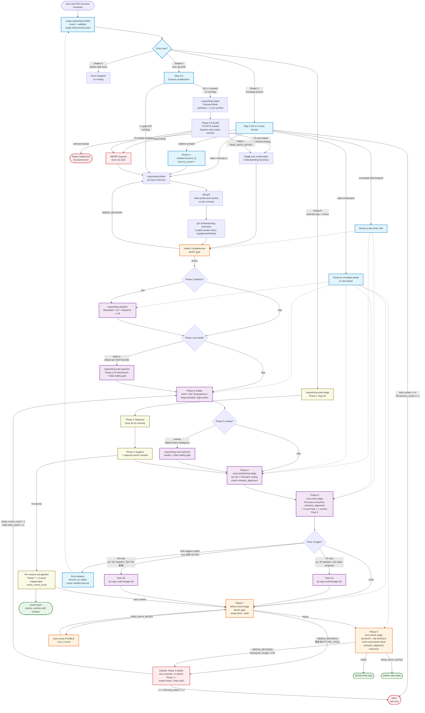

# copywriting-toolkit

Pipeline-structured copywriting plugin. Refactored from `domain-teams:copywriting-team` into 14 specialized skills — each with ONE job, self-contained standards, and JSON-Schema-validated hand-off envelopes between stages. Two execution paths (Express Mode + Q1-Q10 intake), layered precondition / bounce-back mechanics, and primary-source-grounded JP + ZH voice lineage craft.

## Status

- **v1.0.3** — current. Grill resolution strategy scope clarified per `superpowers` precedent.
- **v1.0.2** — Phase 8 word-count band rubric reconciled.
- **v1.0.1** — post-E2E-test hardening: tiered FATAL, Phase 7 brief-scope, conflict_flagged consumers, ZH lineage standard (新).
- **v1.0.0** — initial release. Coexists with `domain-teams:copywriting-team` for A/B comparison.

See [`CHANGELOG.md`](CHANGELOG.md) for full history.

## 9-Phase Pipeline

```
Phase 0  copywriting-intake                       mandatory (Q1-Q10 or Express)
Phase 1  [inline in intake]                       mandatory, LOOSE recommend planning-team
Phase 2  copywriting-ideation                     skippable
Phase 3  copywriting-neta-injection               skippable, hybrid pre/post
Phase 4  one of:                                  mandatory
           copywriting-short-form
           copywriting-mid-form
           copywriting-long-form-pasona
           copywriting-long-form-extended
           copywriting-light-action
Phase 5  copywriting-voice-quadrant-stage      mandatory
Phase 6  copywriting-voice-tone-stage             mandatory
Phase 7  copywriting-ethics-check-stage           mandatory, evaluator-only
Phase 8  copywriting-form-check-stage             mandatory, evaluator-only
Alt      copywriting-audit-stage                  alternate entry for external copy
```

Entry router: `using-copywriting-toolkit`.

## Pipeline Flow

Full routing + validation + bounce-back topology:



**Diagram legend**:

- 🔵 **Router nodes** (light blue) — `using-copywriting-toolkit`, Step 0.5 qualification, Step 2.3/2.4 re-entry checks, Phase 6 dual-trigger violation emit, and intermediate routing decisions. All bounce logic lives here (L2 single enforcement point).
- 🟠 **Gates** (light orange) — Intake Completeness MUST + Phase 7 ethics MUST + Phase 8 form 8a/8b.
- 🟣 **Drafting skills** (light purple) — Phase 2/3/4/5/6 where `copywriter` agent produces artifacts.
- 🟡 **Audit sub-pipeline** (light yellow) — Phase 1/2/3 of audit-stage + per-variant re-gating loop.
- 🔴 **HALT / abort paths** (light red) — retry-cap exhaustion, malformed envelope rejection, Q1-Q10 fallback.
- 🟢 **Delivery** (light green) — final artifact exit points.

Dashed edges represent routing hand-offs (router-mediated), solid edges are direct pipeline flow.

## Example Brief — Reference Input for the Pipeline

A **brief** (業界術語：creative brief) is the task description you hand the pipeline. It is what Phase 0 intake structures into the `envelope.brief{}` fields. Complete briefs trigger Express Mode (single-turn confirm); partial briefs trigger Q1-Q10 multi-turn intake to fill gaps.

### Brief field structure (what the pipeline expects)

| Field | Level | Role | Example |
|---|---|---|---|
| `product` | 1 — required | What you are selling, named | 「禾井」台灣在地職人手工醬油 |
| `value_proposition` | 1 — required | Single-sentence core value | 台灣本土非基改黑豆 + 木桶發酵 18 個月, 月訂 NT$680 含冷藏宅配 |
| `target_audience` | 1 — required | Concrete demographic / psychographic | 30-50 歲, 注重料理品質, 已接觸日本職人醬油 / 有機食品店消費 |
| `schwartz_level` | 1 — required | Awareness level (Schwartz 1966) L1-L5 | L2-L3 (product-aware → solution-aware) |
| `form` | 1 — required | Copy form | long-form-pasona (新 PASONA, ~3500 字 LP) |
| `channel` | 1 — required | Delivery surface | landing-page hero + body |
| `target_length` | 1 — required for long-form | Expected word count | ~3500 字 |
| `output_language` | 1 — required | ja / zh-TW / zh-HK / en etc. | zh-TW |
| `voice_reference` | 2 — AI-recommend-or-user-stated | Maestro name (user-quoted only) or descriptor | 糸井重里 / 許舜英 / "default" + voice_description |
| `voice_description` | 2 — optional | Free-text style description | "溫暖 / 狀態提案 / 體言止め / 不直接呼籲 / 余韻" |
| `framework` | 2 — AI-recommend | PASONA family / BEAF / QUEST / PASTOR / PREP / CREMA | 新 PASONA |
| `claims[]` | context | Any comparative / superlative / substantiation-required claims (for Phase 7 adjudication) | 「全世界最長發酵時間 18 個月」(T2 — benchmark-required) |
| `neta_opt_in` | 3 — default false | Whether to allow pop-culture / meme / literary layering | false |

**Level 1 = BLOCKED if missing** (intake forces Q1-Q10 elicitation).
**Level 2 = AI-recommend + user-confirm** (Express labels `[AI-recommend]` or `[user-stated]`).
**Level 3 = opt-in / defaults** (`[default]` label).

### Reference brief — 「禾井」醬油月訂閱 LP (used in v1.1.0 E2E test)

```
產品：台灣在地職人手工醬油品牌「禾井」
受眾：30-50 歲、注重料理品質、已接觸過日本職人醬油 / 有機食品店消費
      習慣 (Schwartz L2-L3)
價值主張：使用台灣本土非基改黑豆 + 純手工木桶發酵 18 個月，
          每瓶 500ml，月訂閱 NT$680 含冷藏宅配
Voice：糸井重里 ほぼ日 Q3 Affinity-Emotion — 溫暖 / 狀態提案 / 體言止め
       (user explicitly named 糸井)
Output language：zh-TW
Form：long-form-pasona 新 PASONA (6-stage, ~3500 字)
Channel：landing page hero + body

Claim to test:「全世界最長發酵時間 18 個月」— 最上級 No.1 claim;
              triggers 景表法 §5-1 優良誤認 if no benchmark
```

### Why this brief — what it exercises

This brief is designed as a pipeline regression anchor. Running it through the toolkit exercises the full v1.1.0 mechanism set:

| Brief feature | What it triggers |
|---|---|
| All Level 1 fields present | Express Mode qualifies at Step 0.5 (no Q1-Q10 fallback) |
| 糸井重里 user-stated + output `zh-TW` | **Dual-lineage trigger conflict** — router emits violation, re-clarifies via intake; user picks resolution (typically Option C: `voice_reference = "default"` + `voice_description` captures 糸井 discipline as prose posture, Pass 3 NOT activated to avoid JP→ZH cross-transplant) |
| `「全世界最」` claim | **T2 tier classification** in Phase 0.5-B grill — user-stated + benchmark_missing + not outright violation → carry to Phase 7 with `benchmark_required_before_phase_7` flag |
| target_length 3500 字 vs 新 PASONA band 3000-10000 | Phase 8 8b word-count band → 🟢 in-band (117%), no framework downgrade needed |
| L2-L3 Schwartz × Q3 voice | `schwartz_alignment: ok` — no conflict_flagged carry-forward needed |
| Phase 2 ideation mandatory (v1.1.0) | Scoped depth (Express default) — 8-12 candidates single-pass, KJ-converged to 3-5 winners; `ideation_skip_rationale` not set |
| Phase 4 inline micro-ideation (v1.1.0) | Per-stage 3-5 candidate paragraph leads + 谷山 3-reason selection; rejected candidates recorded in `draft_inline_ideation.rejected[]` |

Expected final deliverable: ~3500 字 zh-TW 新 PASONA 6-stage LP with 糸井-spirit-in-zh-TW voice, ethics gate PASS after 1 auto-revise (drops「全世界最」→ substantiable comparative), Phase 8 PASS (in-band + voice consistent), `total_retries = 2` (1 dual-trigger bounce + 1 ethics auto-revise), well under cap of 4.

### Using the reference brief

- As a **regression test input** for future versions — re-run through each toolkit release to check that catch rate / output quality doesn't regress
- As a **worked onboarding example** for new users learning how to structure briefs
- As an **A/B baseline anchor** for comparing this plugin vs `domain-teams:copywriting-team` on identical input
- As a **prompt template** — copy the brief block above, substitute your product / audience / claim, and paste into the router

Brief is deliberately chosen to surface tricky cases (JP maestro + zh-TW output conflict, 最上級 claim without benchmark) rather than a vanilla pass-through case — a vanilla brief would verify fewer mechanisms.

## Two Execution Paths for Intake

Paths resolve FATAL candidates differently, by design (mirrors `superpowers:brainstorming` vs `superpowers:subagent-driven-development`):

| Path | Trigger | Turns | Grill resolution |
|---|---|---|---|
| **Q1-Q10** | Brief missing Level 1 fields, bounce-back, or user asks for full intake | ~10-14 user turns | **Inline probe-and-resolve** — agent offers 3-option menu (supply / rewrite / drop) at Q8; no tier concept |
| **Express** | Brief carries all Level 1 fields; no red flag | ~3 user turns | **Structured tier return** — T1 ABORT / T2 CARRY / T3 ABORT; tier is an evaluator output contract, analogous to `superpowers` subagent status codes |

See [`skills/copywriting-intake/SKILL.md §Execution Paths`](skills/copywriting-intake/SKILL.md).

## Skills

| Skill | Phase | Role |
|---|---|---|
| `using-copywriting-toolkit` | router | Entry + Preconditions validator + Express qualification + bounce-back enforcement |
| `copywriting-intake` | 0-1 | Brief intake (Q1-Q10 or Express) + Intake Completeness MUST gate |
| `copywriting-ideation` | 2 | Mandalart + KJ + Taniyama + VS divergence / convergence |
| `copywriting-neta-injection` | 3 | Neta overlay (pre-draft bake-in or post-draft overlay) + Neta Safety SHOULD gate |
| `copywriting-short-form` | 4 | キャッチコピー / headline (7-15 chars, AIDMA A+I, 5 切入點) |
| `copywriting-mid-form` | 4 | EC product copy (BEAF: Benefit → Evidence → Advantage → Feature) |
| `copywriting-long-form-pasona` | 4 | PASONA / 新PASONA / PASBECONA (神田昌典 canonical) |
| `copywriting-long-form-extended` | 4 | QUEST (Fortin 2005) / PASTOR (Edwards 2016) |
| `copywriting-light-action` | 4 | PREP / CREMA micro-conversion (Kaushik 2007) |
| `copywriting-voice-quadrant-stage` | 5 | Voice Quadrant (Authority↔Affinity × Reason↔Emotion) + Schwartz routing |
| `copywriting-voice-tone-stage` | 6 | 4-axis tone + Mailchimp context-switching + JP/ZH lineage Pass 3 |
| `copywriting-ethics-check-stage` | 7 | 景品表示法 / FTC / Cialdini misuse / dark-pattern MUST gate |
| `copywriting-form-check-stage` | 8 | Framework adherence (8a MUST) + qualitative (8b SHOULD) |
| `copywriting-audit-stage` | alt | Audit external copy through Phases 5-8 |

## Agents

Plugin-local pair (not shared with `domain-teams`):

| Agent | Persona | Model | Role |
|---|---|---|---|
| `copywriter` | Reader-first in 糸井 / Ogilvy / Cialdini / Schwartz lineages + 谷山 discipline + 小霜「嘘をつかない」 | sonnet | Drafting, ideation, audit variants |
| `copywriter-evaluator` | Strict legal / framework reviewer — NOT a copywriter; aesthetic-capture explicitly anti-pattern | opus | Gate verdicts only; does not draft or soften |

Persona separation is deliberate — a charmed copywriter lets 景表法 claims through; a cautious evaluator produces clinical copy. Keeping them apart keeps each role honest.

## Envelope Contract

JSON-Schema-validated handoff between skills. See [`.claude-plugin/envelope.schema.json`](.claude-plugin/envelope.schema.json).

Key invariants:

- **Router is single enforcement point** — validates each skill's `## Preconditions` schema before launch. No downstream skill self-validates.
- **Violation envelope** — on precondition failure, router emits bounce-back shape (`detected_by`, `missing`, `bounce_to`, `bounce_round`, `user_message`) and routes upstream.
- **Retry caps** — `bounce_round ≥ 3` → HALT; `revise_round_count ≥ 2` per phase → HALT; `total_retries ≥ 4` aggregate → HALT.
- **Audit trail** — `audit_trail[]` on envelope logs skill-entered / gate-verdict / violation-detected / bounce-dispatched / halt-ask-user events.

## Grounding (primary sources)

Standards preserved byte-identical from `domain-teams:copywriting-team`:

- 神田昌典 2016/2021 PASONA / 新PASONA / PASBECONA
- 谷山雅計 2007 散らかす→選ぶ→磨く + なんかいいよね禁止
- 今泉浩晃 1987 曼陀羅発想法
- 川喜田二郎 1967 KJ法
- Cialdini 1984 *Influence*
- Schwartz 1966 *Breakthrough Advertising*
- Zhang et al. 2025 Verbalized Sampling (arXiv:2510.01171)
- Fortin 2005 QUEST / Edwards 2016 PASTOR
- 小霜和也 2010/2014 本能分析
- 秋山隆平・杉山恒太郎 2004 AISAS / 飯髙悠太 2019 ULSSAS
- Kaushik 2007 micro/macro conversion
- McQuarrie & Mick 1996 rhetorical operations / Lakoff & Johnson 1980 conceptual metaphor / Thornton 1995 subcultural capital
- 景品表示法 (2023 amendment, effective 2024-10-01) + FTC Endorsement Guides (16 CFR 255)
- Vaughn 1980 FCB × Halliday 1978 SFL (2-axis Voice Quadrant — team synthesis)

Voice lineage craft (Tier 3 deep-dive standards):

- **JP** — `jp-copy-craft-lineage.md` (cp from domain-teams): 糸井重里 / 岩崎俊一 / 眞木準 / 谷山雅計 via TCC 年鑑
- **ZH** — `zh-copy-craft-lineage.md` (NEW in v1.0.1, primary-source-researched for this toolkit): 許舜英 (意識形態 / 中興百貨 1988-1999, 11 dated corpus entries) / 李欣頻 (誠品敦南 1990s-2000s, 7 entries) / 葉明桂 (奧美 / 左岸 1998-, 3 entries + strategic frameworks). Includes 4 attribution corrections (#Z1-#Z4) and per-master LLM reproduction gap analysis.

## A/B with `domain-teams:copywriting-team`

Original `domain-teams:copywriting-team` remains untouched (copy-first principle — all cp'd files byte-identical). Run both on the same brief and compare output quality, gate catch rate, and interaction cost. Both plugins coexist; consolidation deferred to post-A/B retrospective.

## Install

Plugin loads via the `monkey-skills` marketplace. See repo-root `.claude-plugin/marketplace.json` entry. Once marketplace loads, all 14 skills + 2 agents + plugin-level conventions (CLAUDE.md) resolve automatically.

Setup detail, permissions, model tiers, persistence model: see [`CLAUDE.md §Setup`](CLAUDE.md).

## License

MIT — see repository root.
