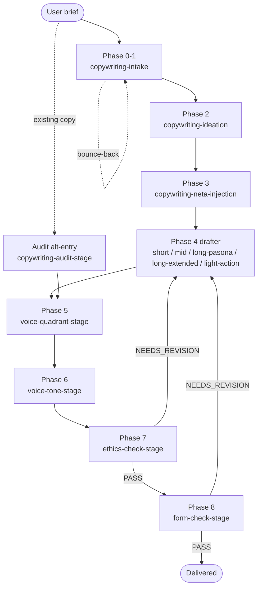

# copywriting-toolkit

> Pipeline-structured copywriting plugin — 14 skills + 2 agents + envelope contract, grounded in JP / Anglo / Sinophone copy traditions.

Read this in: **English** | [日本語](README.ja.md) | [繁體中文](README.zh-TW.md)

A Claude Code plugin that turns a raw copywriting brief into a polished landing page, sales letter, headline, or audit through a 9-phase pipeline. Each phase is its own skill — intake clarifies the brief, ideation diverges then converges, neta injection adds cultural hooks, one of 5 form-specific drafters writes the copy, voice / tone tuning fits register, and ethics + form gates block delivery on legal or framework violations. Grounded in 神田昌典 PASONA / 谷山雅計 discipline / 今泉 曼陀羅 / Cialdini / Schwartz / 景品表示法 / FTC Endorsement.

## Status

- **Version**: 1.14.0 (anchor autonomy on voice conflicts, 2026-04-23)
- **License**: MIT
- **Stability**: Active. 14 skills + 2 agents + 90 voice anchors + 12 quadrant routers + envelope contract + CI lint baseline (3 accepted failures).
- **A/B coexistence**: This plugin runs in parallel with `domain-teams:copywriting-team`. The original team skill remains untouched. Both pipelines coexist by design — consolidation is deferred to post-A/B retrospective. Pick one for any given run; do not interleave.

## Background

Copywriting work has two failure modes when handled by a generic agent:

1. **Aesthetic capture** — a copywriter-persona model is the wrong lens for legal / ethics / framework judgement. It softens 景品表示法 violations into pretty prose.
2. **Lineage flattening** — telling the model to "write like 糸井" while the brief is in zh-TW produces 翻譯腔. Voice lineage choice should be governed by `output_language`, not by the maestro name in the brief.

This plugin separates concerns through (a) two agents with distinct personas — a `copywriter` (sonnet) that drafts, and a `copywriter-evaluator` (opus) that judges, never the same model — and (b) a 9-phase envelope-passing pipeline where each phase has scoped responsibility, machine-checkable preconditions, and a bounded retry cap.

## 9-Phase pipeline

| Phase | Skill | Role |
|---|---|---|
| 0 | `copywriting-intake` | Q1-Q10 brief intake, Level 1/2/3 field elicitation |
| 1 | `copywriting-intake` (inline) | Message Confirmation, Understanding Summary, Intake Completeness MUST gate |
| 2 | `copywriting-ideation` | 曼陀羅 + Verbalized Sampling diverge → KJ法 + 谷山「なんかいいよね禁止」 converge |
| 3 | `copywriting-neta-injection` | WebSearch-sourced metaphor / pun / meme / literary overlay (4 techniques) |
| 4 | one of 5 drafters | Form-specific draft (short / mid / long-pasona / long-extended / light-action) |
| 5 | `copywriting-voice-quadrant-stage` | Authority↔Affinity × Reason↔Emotion quadrant assignment |
| 6 | `copywriting-voice-tone-stage` | 4-axis tone tuning + 90-anchor register signal application |
| 7 | `copywriting-ethics-check-stage` | 景品表示法 / FTC / Cialdini / 小霜「嘘をつかない」 MUST gate |
| 8 | `copywriting-form-check-stage` | PASONA / BEAF / QUEST / PASTOR / PREP / CREMA stage completeness MUST gate |

Phases 0, 1, 4, 5, 6, 7, 8 are mandatory. Phase 2 / 3 are skippable on rationale. Phases 7 + 8 are evaluator-only — they judge, they do not edit.

### Pipeline flow



Bounce-back rules (router-enforced): `bounce_round >= 3` HALT, `revise_round_count >= 2` per phase HALT, `total_retries >= 4` combined HALT. See `CLAUDE.md §Envelope Violation`.

## Brief field structure

Field tiers come from `copywriting-intake/SKILL.md §Field tiers`. Level 1 fields BLOCK the pipeline if missing.

| Tier | Fields |
|---|---|
| **Level 1** (Must, BLOCKED if missing) | `form_type`, `product` + `value_proposition`, `target_audience`, form-specific fields (word-count + Schwartz / benefits + channel / emotion + char-limit / candidate count / external_copy full text) |
| **Level 2** (Should, AI recommends, user approves) | `voice_reference` (糸井 / 岩崎 / 眞木 / 谷山 / Ogilvy / 龔大中 / 許舜英 / default), `framework` / `approach` |
| **Level 3** (May, opt-in) | `neta_opt_in` (default No), `neta_source_type_preference` |

## Two execution paths

`copywriting-intake` produces the Understanding Summary via one of two paths:

| Path | Protocol | When | Elicitation |
|---|---|---|---|
| **Q1-Q10** (default) | `copywriting-brainstorming.md` | Brief is rough / Level 1 fields missing / re-entry after a bounce-back | 10 questions, one per turn, multiple-choice with recommended answer |
| **Express Mode** | `express-mode.md` | Router's Step 0.5 Express Qualification declared the raw brief Level-1-complete | Synthesis + single-turn confirmation |

Both paths run the same Intake Completeness MUST gate. Express Mode is a fast-path, not a relaxed-rigor path — rigor lives in the gate, not in the question count. Bounce-backs disqualify Express on re-entry; the failed envelope re-runs Q1-Q10 from user words, not stale synthesis.

## Skills

| Skill | Phase | Role |
|---|---|---|
| `using-copywriting-toolkit` | router | Route + validate + Express qualify; single enforcement point for preconditions |
| `copywriting-intake` | 0-1 | Brief intake + Message Confirmation, Q1-Q10 or Express, Intake Completeness MUST gate |
| `copywriting-ideation` | 2 | Diverge (曼陀羅 + VS + 小霜) → converge (KJ + 谷山 3-reason); scoped 8-12 / standard 40-64 / full 64-100+ |
| `copywriting-neta-injection` | 3 | WebSearch pipeline A-D, 4 techniques, Neta Safety SHOULD gate (景品表示法 ステマ + copyright veto) |
| `copywriting-short-form` | 4 | キャッチコピー / headlines / taglines (7-15 chars, AIDMA A+I, 3秒ルール, 5 切入點) |
| `copywriting-mid-form` | 4 | EC product copy via BEAF (Benefit → Evidence → Advantage → Feature) |
| `copywriting-long-form-pasona` | 4 | LP / sales letter / 記事広告 via 旧 PASONA (5) / 新 PASONA (6) / PASBECONA (9) |
| `copywriting-long-form-extended` | 4 | EN / international long-form via QUEST / PASTOR (5/6 stages, expert / shepherd / guide positioning) |
| `copywriting-light-action` | 4 | Opt-in / subscribe / download / LINE 登録 via PREP / CREMA (Kaushik 2007 micro-conversion) |
| `copywriting-voice-quadrant-stage` | 5 | 2-axis quadrant — Q1 Authority-Reason / Q2 Authority-Emotion / Q3 Affinity-Emotion / Q4 Affinity-Reason |
| `copywriting-voice-tone-stage` | 6 | 4-axis tone tuning + Pass 3 voice anchor register signal (90 anchors, 12 quadrant routers) |
| `copywriting-ethics-check-stage` | 7 | 景品表示法 2023 / ステマ告示 / FTC 16 CFR 255 / Cialdini misuse / 小霜「嘘をつかない」 MUST gate |
| `copywriting-form-check-stage` | 8 | PASONA / BEAF / QUEST / PASTOR / PREP / CREMA stage completeness + length band + CTA appropriateness MUST gate |
| `copywriting-audit-stage` | alt | Run Phase 5-8 against external pre-existing copy (no intake / ideation / draft) |

Each skill carries its own `## Preconditions` schema; the router validates the envelope against that table before launching the skill. Schemas live in each `SKILL.md`; envelope vocabulary lives in `.claude-plugin/envelope.schema.json`.

## Agents

Plugin-local pair — NOT shared with `domain-teams`. Two agents, two personas, two model tiers.

| Agent | Tier | Role | Persona |
|---|---|---|---|
| `copywriter` | sonnet | Drafting / ideation / audit-variant production | Reader-first copywriter in 糸井重里 / 岩崎俊一 / 眞木準 / 谷山雅計 (JP) and Ogilvy / Schwartz / Halbert / Cialdini (Anglo) lineages, with 小霜「嘘をつかない」 discipline |
| `copywriter-evaluator` | opus | Gate verdicts (legal / framework / voice / form) | Strict legal + framework reviewer; deliberately NOT a copywriter |

### Why two personas

The aesthetic-capture anti-pattern is real and observable: a copywriter-persona model softens 景品表示法 violations into pretty prose. The legal-reviewer persona produces reliable verdicts but writes risk-averse copy that lacks rhetorical force. Running a single multi-role agent blurs both. Separation keeps each role honest.

If your platform cannot differentiate tiers, default both to opus. Do **not** default both to sonnet — the evaluator's aesthetic-capture resistance is harder to maintain at lower tiers.

## Envelope contract

Between every phase, skills pass a JSON envelope. Field names + types are pinned in `.claude-plugin/envelope.schema.json`; per-skill preconditions live in each `SKILL.md §Preconditions`. The router (`using-copywriting-toolkit`) is the single enforcement point — it validates the envelope against the target skill's Preconditions table before launching, and on violation emits a `violation` envelope routed back upstream rather than launching the target.

### Retry caps

Three counters converge into one aggregate, all monotonic, all router-owned:

| Counter | Trigger | Hard cap |
|---|---|---|
| `bounce_round` | Schema violation before skill runs | `>= 3` HALT |
| `revise_round_count` | Evaluator-verdict auto-revise per phase | `>= 2` per phase HALT |
| `total_retries` | `bounce_round + revise_round_count` | `>= 4` combined HALT |

The combined cap exists because pathological cycles can alternate schema bounces and verdict revisions to bypass individual caps. Mirrors `superpowers:executing-plans` stop-and-ask: when you cannot make progress, ask.

### Immutable fields

Certain envelope fields MUST pass through unchanged. The router bounces any envelope with a dropped immutable field back to the skill that last wrote it.

- `voice_quadrant` (entire object, including `schwartz_alignment`)
- `tone_notes.register_signal_applied.named_master_fit_warning`
- `brief.*` Level 1 fields
- `audit_trail[]` (append-only)
- `retries.*` (monotonic — never reset by a downstream skill)
- `express_mode_used`
- `violation` (until bounce-back consumed)

See `CLAUDE.md §Handoff Envelope §Immutable fields`.

## Grounding

Every load-bearing claim is anchored on a primary source. Standards files cite originals; the `copywriter` agent is forbidden from inventing attribution.

| Domain | Primary sources |
|---|---|
| JP long-form | 神田昌典 PASONA / 新 PASONA / PASBECONA |
| JP discipline | 谷山雅計 2007『広告コピーってこう書くんだ！読本』(なんかいいよね禁止) |
| Ideation | 今泉 1987 曼陀羅; 川喜田 1967 KJ 法; 小霜和也 本能分析; Zhang et al. 2025 Verbalized Sampling |
| Persuasion | Cialdini 1984 *Influence*; Schwartz 1966 *Breakthrough Advertising* (5 levels of awareness) |
| EN long-form | Fortin 2005 QUEST; Edwards 2016 PASTOR; Hopkins / Halbert / Schwartz / Ogilvy DR canon |
| Voice axes | Halliday 1978 Tenor (Authority↔Affinity); Vaughn 1980/1986 FCB (Reason↔Emotion) |
| Mid-form | BEAF (Benefit-first ordering — 6-Layer Marketing Pyramid lineage) |
| SNS evolution | 秋山・杉山 AISAS; 飯髙 ULSSAS |
| Metaphor / neta | McQuarrie & Mick 1996; Lakoff & Johnson 1980; Thornton 1995 (subcultural capital) |
| Ethics — JP | 景品表示法 2023 amendment; ステマ告示 (消費者庁 2023) |
| Ethics — EN | FTC Endorsement Guides 16 CFR 255; Brignull dark patterns |

## Voice anchor library

90 individual-creator anchors across JP / ZH (TW + HK + 大陸) / EN, addressable through 12 quadrant router files (`{lang}-q{N}-anchors.md`). Each anchor file follows the v2 schema (canonical structure enforced by `scripts/lint-anchor-library.py` with a 3-failure CI baseline):

- frontmatter: `schema_version`, `anchor_slug`, `culture`, `quadrant`, `landmark`
- `## Native critical read` (H2)
- `## Metadata` (grouped — `Over-mimic risk` + canonical attribution rule)
- `## What this register achieves`
- `## Prose mechanics` + `## Don't`
- 5+ dated, attributable examples

Selection rules from `voice-anchor-meta.md`:

- Lineage choice is governed by `envelope.brief.output_language`, NOT by maestro name. A maestro citation in a cross-language brief becomes a quadrant signal; the anchor is the target-language native creator in that same quadrant.
- Cross-master context: cross-tradition transplant (e.g. 体言止め onto zh-TW) is forbidden. Cross-language borrowing only when frontmatter `cross-reference-valid-for[target_lang] == STRONG` AND brief permits.
- Named-creator routing: when `brief.voice_reference` names a creator with an `anchor-{slug}.md` file, that anchor is forced rank 1; if agent fit-judgement is MEDIUM / LOW, `named_master_fit_warning` fires (immutable through downstream phases).
- v1.14.0 conflict rule: when anchor `§Prose mechanics` / `§Don't` conflicts with `brief.form_hint` / `brief.tone_cue` / Phase 4 draft structure, anchor wins. Mechanics are binding requirements, not suggestions. Anchor cannot override Level 1 brief fields (output_language / audience / product / goal).

## Install

```bash
# In Claude Code, with monkey-skills marketplace enabled
/plugin install copywriting-toolkit@monkey-skills
```

The plugin is self-contained: no API keys, no cache paths, no persistent state. Skills read files inside their own directory + plugin-root shared resources (`agents/`, `CLAUDE.md`, `envelope.schema.json`). Network access is required only for `copywriting-neta-injection` Phase A WebSearch (source-taxonomy allow-list — Path A-1 SNS/meme, Path A-2 literary).

## Usage

Start any copywriting work with the slash command:

```
/using-copywriting-toolkit
```

Three intake shapes, all routed through the same entry point:

| Shape | Trigger | Path |
|---|---|---|
| **Shape A** — new brief | "Write me an LP for X" / "Headline options for Y" | Q1-Q10 or Express → ideation → neta → drafter → voice → ethics → form → deliver |
| **Shape B** — audit | "Review this existing copy" + full text | `copywriting-audit-stage` runs Phase 5-8 against `external_copy` |
| **Shape C** — mid-pipeline resume | Envelope from a prior session | Router reads `envelope.phase` + latest verdict, resumes |

Direct skill invocation is also supported when the target skill is already known (e.g. user explicitly says "run the form gate"). External callers constructing an initial envelope should follow `CLAUDE.md §External Caller Guide` — pre-filled `voice_quadrant` or manual `gate_verdict: "PASS"` will silently bypass downstream gates.

## Contributing

PRs welcome via `https://github.com/kouko/monkey-skills`. Conventions:

- **Tier 1 (byte-identical)** — third-party academic canon prose within `skills/*/standards/*.md` (神田 PASONA / 谷山 / Cialdini / Schwartz / Halliday / Vaughn / etc.). Verify with `diff -q` against `domain-teams/skills/copywriting-team/`. A plugin has no authority to edit 神田昌典's PASONA definitions.
- **Tier 2 (may diverge)** — `protocols/*.md` / `checklists/*.md` / `rubrics/*.md`. Modifications MUST carry a `<!-- DIVERGED FROM -->` header, preserve all original prose (additive only — no deletion / re-order / rewrite), mark plugin-specific additions with `<!-- v1.x.y addition: <topic> -->` blocks, and log every divergence in `CHANGELOG.md`.
- **Plugin-native** — voice anchor library (90 anchors + 12 quadrant routers + `voice-anchor-meta.md` + `anchor-schema-v2.md`) has no upstream counterpart; plugin owns it fully.

Commit prefixes: `feat(copywriting-toolkit)` or `chore(copywriting-toolkit)` only — CC CI whitelist. No `test:` / `ci:` commits — fixtures bundle into the relevant `feat` commit.

CI: `scripts/lint-anchor-library.py` runs on every PR with a baseline of 3 accepted failures; new drift outside the baseline blocks merge.

## License

MIT — see [LICENSE](../LICENSE) at the repository root.
