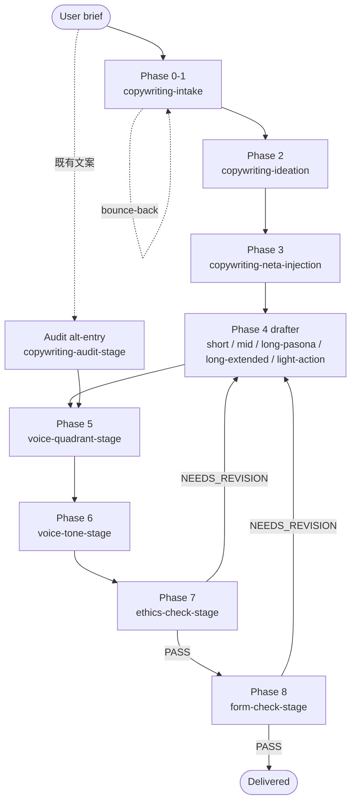

# copywriting-toolkit

> Pipeline 結構化的 copywriting plugin — 14 skills + 2 agents + envelope contract，grounded 於 JP / Anglo / 華語文案傳統。

Read this in: [English](README.md) | [日本語](README.ja.md) | **繁體中文**

把 raw 的 copywriting brief 透過 9-phase pipeline 變成精修過的 landing page、sales letter、headline 或 audit 的 Claude Code plugin。每個 phase 都是獨立的 skill — intake 釐清需求、ideation 先發散後收斂、neta injection 加上文化鉤子、5 個 form 對應的 drafter 之一寫稿、voice / tone tuning 對齊 register、ethics + form gate 在 legal 或 framework 違規時擋下交付。Grounded 於 神田昌典 PASONA / 谷山雅計 discipline / 今泉 曼陀羅 / Cialdini / Schwartz / 景品表示法 / FTC Endorsement。

## Status

- **Version**：1.14.0（voice 衝突時的 anchor autonomy，2026-04-23）
- **License**：MIT
- **Stability**：Active。14 skills + 2 agents + 90 voice anchors + 12 quadrant routers + envelope contract + CI lint baseline（accepted failure 3 件）。
- **A/B coexistence**：本 plugin 與 `domain-teams:copywriting-team` 並行運作。原始 team skill 不動。兩條 pipeline 是刻意並存，整合延後到 post-A/B retrospective 再決定。單次 run 擇一使用，不要交錯。

## Background

通用 agent 處理 copywriting 時有兩種可觀察的失敗 mode：

1. **Aesthetic capture（美學捕獲）** — copywriter persona 的 model 不適合做 legal / ethics / framework 判斷。它會把景品表示法違規軟化成漂亮文字。
2. **Lineage flattening（語系扁平化）** — brief 是 zh-TW 卻叫 model「用糸井的風格寫」會產生翻譯腔。voice lineage 應由 `output_language` governed，而不是 brief 裡提到的 maestro 名。

本 plugin 透過兩條軸線分離關注點：(a) persona 不同的兩個 agent — 負責 drafting 的 `copywriter`（sonnet）跟負責判定的 `copywriter-evaluator`（opus，永遠不是同一個 model）；(b) 9-phase 的 envelope-passing pipeline — 每個 phase 都有 scoped responsibility、machine-checkable preconditions、bounded retry cap。

## 9-Phase pipeline

| Phase | Skill | 角色 |
|---|---|---|
| 0 | `copywriting-intake` | Q1-Q10 brief intake、Level 1/2/3 field elicitation |
| 1 | `copywriting-intake`（inline） | Message Confirmation、Understanding Summary、Intake Completeness MUST gate |
| 2 | `copywriting-ideation` | 曼陀羅 + Verbalized Sampling 發散 → KJ法 + 谷山「なんかいいよね禁止」收斂 |
| 3 | `copywriting-neta-injection` | 透過 WebSearch 取得 metaphor / pun / meme / 文學引用做 overlay（4 種技法） |
| 4 | 5 個 drafter 之一 | Form 對應的 draft（short / mid / long-pasona / long-extended / light-action） |
| 5 | `copywriting-voice-quadrant-stage` | Authority↔Affinity × Reason↔Emotion 4 象限 positioning |
| 6 | `copywriting-voice-tone-stage` | 4-axis tone tuning + 90 anchor 的 register signal application |
| 7 | `copywriting-ethics-check-stage` | 景品表示法 / FTC / Cialdini / 小霜「嘘をつかない」 MUST gate |
| 8 | `copywriting-form-check-stage` | PASONA / BEAF / QUEST / PASTOR / PREP / CREMA stage 完整性 MUST gate |

Phase 0、1、4、5、6、7、8 必跑。Phase 2 / 3 提供理由可以 skip。Phase 7 + 8 是 evaluator-only — 只判定，不修改 draft。

### Pipeline flow



Bounce-back 規則（router 強制執行）：`bounce_round >= 3` HALT、`revise_round_count >= 2`（per phase）HALT、`total_retries >= 4`（合計）HALT。詳見 `CLAUDE.md §Envelope Violation`。

## Brief 欄位結構

Field tier 來自 `copywriting-intake/SKILL.md §Field tiers`。Level 1 缺少會 BLOCK pipeline。

| Tier | 欄位 |
|---|---|
| **Level 1**（Must，缺少即 BLOCKED） | `form_type`、`product` + `value_proposition`、`target_audience`、form 對應的 must field（word-count + Schwartz / benefits + channel / emotion + char-limit / candidate count / external_copy 全文） |
| **Level 2**（Should，AI 推薦使用者核可） | `voice_reference`（糸井 / 岩崎 / 眞木 / 谷山 / Ogilvy / 龔大中 / 許舜英 / default）、`framework` / `approach` |
| **Level 3**（May，opt-in） | `neta_opt_in`（default No）、`neta_source_type_preference` |

## 兩條 execution path

`copywriting-intake` 透過下列其中一條 path 產出 Understanding Summary：

| Path | Protocol | 適用時機 | Elicitation |
|---|---|---|---|
| **Q1-Q10**（default） | `copywriting-brainstorming.md` | brief 粗糙 / Level 1 fields 缺漏 / bounce-back 後 re-entry | 1 turn 1 題、附 recommended answer 的多選 |
| **Express Mode** | `express-mode.md` | router Step 0.5 Express Qualification 判定 raw brief 已 Level-1-complete | 合成 + single-turn confirmation |

兩條 path 都跑同一個 Intake Completeness MUST gate。Express Mode 是快速通道，不是寬鬆通道 — rigor 在 gate 而不在題數。bounce-back 會讓 re-entry 失去 Express 資格，失敗的 envelope 會從使用者原話重跑 Q1-Q10（不沿用 stale 合成）。

## Skills

| Skill | Phase | 角色 |
|---|---|---|
| `using-copywriting-toolkit` | router | Route + validate + Express qualify。preconditions 的單一強制點 |
| `copywriting-intake` | 0-1 | Brief intake + Message Confirmation、Q1-Q10 或 Express、Intake Completeness MUST gate |
| `copywriting-ideation` | 2 | 發散（曼陀羅 + VS + 小霜）→ 收斂（KJ + 谷山 3-reason），scoped 8-12 / standard 40-64 / full 64-100+ |
| `copywriting-neta-injection` | 3 | WebSearch pipeline A-D、4 種技法、Neta Safety SHOULD gate（景品表示法 ステマ + 著作權 veto） |
| `copywriting-short-form` | 4 | キャッチコピー / headline / tagline（7-15 字、AIDMA A+I、3 秒原則、5 切入點） |
| `copywriting-mid-form` | 4 | EC product copy 用 BEAF（Benefit → Evidence → Advantage → Feature） |
| `copywriting-long-form-pasona` | 4 | LP / sales letter / 記事広告 用 旧 PASONA（5）/ 新 PASONA（6）/ PASBECONA（9） |
| `copywriting-long-form-extended` | 4 | EN / 國際 long-form 用 QUEST / PASTOR（5/6 stage、expert / shepherd / guide positioning） |
| `copywriting-light-action` | 4 | Opt-in / subscribe / download / LINE 登錄 用 PREP / CREMA（Kaushik 2007 micro-conversion） |
| `copywriting-voice-quadrant-stage` | 5 | 2 軸 4 象限 — Q1 Authority-Reason / Q2 Authority-Emotion / Q3 Affinity-Emotion / Q4 Affinity-Reason |
| `copywriting-voice-tone-stage` | 6 | 4-axis tone tuning + Pass 3 voice anchor register signal（90 anchor、12 quadrant router） |
| `copywriting-ethics-check-stage` | 7 | 景品表示法 2023 / ステマ告示 / FTC 16 CFR 255 / Cialdini misuse / 小霜「嘘をつかない」 MUST gate |
| `copywriting-form-check-stage` | 8 | PASONA / BEAF / QUEST / PASTOR / PREP / CREMA stage 完整性 + length band + CTA 適切性 MUST gate |
| `copywriting-audit-stage` | alt | 對既有外部文案跑 Phase 5-8（不做 intake / ideation / draft） |

每個 skill 都帶自己的 `## Preconditions` schema，router 啟動 skill 之前會用該表驗證 envelope。schema 在各 `SKILL.md` 裡，envelope 詞彙在 `.claude-plugin/envelope.schema.json`。

## Agents

Plugin 本地的成對 agent — 不與 `domain-teams` 共用。兩個 agent、兩種 persona、兩種 model tier。

| Agent | Tier | 角色 | Persona |
|---|---|---|---|
| `copywriter` | sonnet | Drafting / ideation / audit-variant 產出 | reader-first 的文案撰寫者，承襲糸井重里 / 岩崎俊一 / 眞木準 / 谷山雅計（JP）與 Ogilvy / Schwartz / Halbert / Cialdini（Anglo）兩條系譜，奉行小霜「嘘をつかない」 discipline |
| `copywriter-evaluator` | opus | Gate verdict（legal / framework / voice / form） | 嚴格的 legal + framework reviewer，刻意不是 copywriter |

### 為何兩種 persona

aesthetic capture 是真實可觀察的 anti-pattern：copywriter persona 的 model 會把景品表示法違規軟化成漂亮文字。legal-reviewer persona 給得出可靠的 verdict，但寫出來的稿欠缺修辭力，過度避險。把這兩件事塞進同一個 multi-role agent 兩邊都會糊掉。分離才能讓兩種角色各自誠實。

無法區分 tier 的 platform 上，請把兩者都 default 成 opus。**不要**兩者都 default 成 sonnet — evaluator 抗 aesthetic-capture 的能力在低 tier 更難維持。

## Envelope contract

phase 之間靠 JSON envelope 傳遞。field 名與型別固定在 `.claude-plugin/envelope.schema.json`，每個 skill 的 preconditions 在各自 `SKILL.md §Preconditions` 裡。router（`using-copywriting-toolkit`）是單一強制點 — 啟動 target skill 前用 Preconditions table 驗證 envelope，違規時不啟動 target，改 emit `violation` envelope 往上游 route。

### Retry 上限

3 個 counter 匯到 1 個合計值，全部 monotonic、全部 router 持有：

| Counter | Trigger | Hard cap |
|---|---|---|
| `bounce_round` | skill 啟動前的 schema 違規 | `>= 3` HALT |
| `revise_round_count` | evaluator verdict 觸發的 auto-revise（per phase） | `>= 2`（per phase）HALT |
| `total_retries` | `bounce_round + revise_round_count` | `>= 4`（合計）HALT |

合計 cap 的存在是因為 schema bounce 與 verdict revision 可能交替發生繞過個別 cap 的 pathological cycle。對應 `superpowers:executing-plans` 的 stop-and-ask 原則：跑不動的時候就停下來問人。

### Immutable fields

特定 envelope field 必須原樣 pass through。router 會把丟掉 immutable field 的 envelope 退回最後寫入該 field 的 skill。

- `voice_quadrant`（整個 object，含 `schwartz_alignment`）
- `tone_notes.register_signal_applied.named_master_fit_warning`
- `brief.*` Level 1 fields
- `audit_trail[]`（append-only）
- `retries.*`（monotonic — 下游 skill 不得 reset）
- `express_mode_used`
- `violation`（消化 bounce-back 之前）

詳見 `CLAUDE.md §Handoff Envelope §Immutable fields`。

## Grounding

每一個 load-bearing 的論述都 anchored 在一手來源上。standards 檔案引述原典，`copywriter` agent 被禁止憑空捏造 attribution。

| 領域 | Primary sources |
|---|---|
| JP long-form | 神田昌典 PASONA / 新 PASONA / PASBECONA |
| JP discipline | 谷山雅計 2007《広告コピーってこう書くんだ！読本》（なんかいいよね禁止） |
| Ideation | 今泉 1987 曼陀羅；川喜田 1967 KJ 法；小霜和也 本能分析；Zhang et al. 2025 Verbalized Sampling |
| Persuasion | Cialdini 1984 *Influence*；Schwartz 1966 *Breakthrough Advertising*（5 levels of awareness） |
| EN long-form | Fortin 2005 QUEST；Edwards 2016 PASTOR；Hopkins / Halbert / Schwartz / Ogilvy DR canon |
| Voice 軸 | Halliday 1978 Tenor（Authority↔Affinity）；Vaughn 1980/1986 FCB（Reason↔Emotion） |
| Mid-form | BEAF（Benefit-first ordering，6-Layer Marketing Pyramid 系譜） |
| SNS evolution | 秋山・杉山 AISAS；飯髙 ULSSAS |
| Metaphor / neta | McQuarrie & Mick 1996；Lakoff & Johnson 1980；Thornton 1995（subcultural capital） |
| Ethics — JP | 景品表示法 2023 修正；ステマ告示（消費者庁 2023） |
| Ethics — EN | FTC Endorsement Guides 16 CFR 255；Brignull dark patterns |

## Voice anchor library

橫跨 JP / ZH（TW + HK + 大陸）/ EN 共 90 個 individual-creator anchor，由 12 個 quadrant router file（`{lang}-q{N}-anchors.md`）索引。每個 anchor file 遵循 v2 schema（canonical 結構由 `scripts/lint-anchor-library.py` 在 CI baseline 3 件下強制）：

- frontmatter：`schema_version`、`anchor_slug`、`culture`、`quadrant`、`landmark`
- `## Native critical read`（H2）
- `## Metadata`（grouped — `Over-mimic risk` + canonical attribution rule）
- `## What this register achieves`
- `## Prose mechanics` + `## Don't`
- 5 件以上有日期、可歸屬的範例

來自 `voice-anchor-meta.md` 的選用規則：

- lineage 由 `envelope.brief.output_language` 決定，不是 brief 裡的 maestro 名。跨語言 brief 中提到的 maestro 會被視為 quadrant signal，anchor 改用 target-language 在同 quadrant 的 native creator。
- Cross-master context：cross-tradition transplant（例如把体言止め硬套到 zh-TW）禁止。cross-language borrowing 僅限 frontmatter `cross-reference-valid-for[target_lang] == STRONG` 且 brief 允許時。
- Named-creator routing：當 `brief.voice_reference` 指名某個有 `anchor-{slug}.md` 的 creator，該 anchor 強制 rank 1。如果 agent 的 fit-judgement 是 MEDIUM / LOW，會觸發 `named_master_fit_warning`，並 immutable 地往下游 phase 傳遞。
- v1.14.0 conflict rule：當 anchor 的 `§Prose mechanics` / `§Don't` 跟 `brief.form_hint` / `brief.tone_cue` / Phase 4 draft 結構衝突時，anchor 勝出。mechanics 是 binding requirement，不是建議。但 anchor 不能 override Level 1 brief field（output_language / audience / product / goal）。

## Install

```bash
# 在已啟用 monkey-skills marketplace 的 Claude Code 中
/plugin install copywriting-toolkit@monkey-skills
```

plugin 是 self-contained：不需 API key、不需 cache path、無 persistent state。skill 讀取自身 directory 與 plugin-root 的共用 resource（`agents/`、`CLAUDE.md`、`envelope.schema.json`）。network access 只在 `copywriting-neta-injection` Phase A 的 WebSearch 時才需要（source-taxonomy allow-list — Path A-1 SNS / meme、Path A-2 文學）。

## Usage

所有 copywriting work 都從 slash command 起動：

```
/using-copywriting-toolkit
```

intake 共 3 種 shape，全部從同一個 entry point route：

| Shape | Trigger | Path |
|---|---|---|
| **Shape A** — 新 brief | "幫我寫 X 的 LP" / "Y 的 headline 候選" | Q1-Q10 或 Express → ideation → neta → drafter → voice → ethics → form → 交付 |
| **Shape B** — audit | "幫我審這份既有文案" + 全文 | `copywriting-audit-stage` 對 `external_copy` 跑 Phase 5-8 |
| **Shape C** — pipeline 中途繼續 | 上次 session 留下的 envelope | router 讀 `envelope.phase` + 最近 verdict 後續跑 |

如果已經知道 target skill（例如使用者明確說「幫我跑 form gate」），可直接呼叫該 skill。external caller 自行構建初始 envelope 時請依 `CLAUDE.md §External Caller Guide` — 預先填 `voice_quadrant` 或手動標 `gate_verdict: "PASS"` 會 silently 跳過下游 gate。

## Contributing

PR 透過 `https://github.com/kouko/monkey-skills` 提交。conventions：

- **Tier 1（byte-identical）** — `skills/*/standards/*.md` 內的 third-party academic canon prose（神田 PASONA / 谷山 / Cialdini / Schwartz / Halliday / Vaughn 等）。用 `diff -q` 對 `domain-teams/skills/copywriting-team/` 驗證。plugin 沒有權限改寫神田昌典的 PASONA 定義。
- **Tier 2（允許 divergence）** — `protocols/*.md` / `checklists/*.md` / `rubrics/*.md`。修改時必須加 `<!-- DIVERGED FROM -->` header、保留所有原始 prose（additive only — 不刪、不重排、不改寫）、用 `<!-- v1.x.y addition: <topic> -->` 區塊標出 plugin 專屬 addition、並把每次 divergence 記入 `CHANGELOG.md`。
- **Plugin-native** — voice anchor library（90 anchor + 12 quadrant router + `voice-anchor-meta.md` + `anchor-schema-v2.md`）沒有 upstream 對應物，整套由 plugin 完整 own。

Commit prefix 只用 `feat(copywriting-toolkit)` 或 `chore(copywriting-toolkit)` — CC CI whitelist。不用 `test:` / `ci:` commit（fixture 隨對應 `feat` commit 一起 bundle）。

CI：`scripts/lint-anchor-library.py` 在每次 PR 跑，baseline 為 3 件 accepted failure；超出 baseline 的新 drift 會 block merge。

## License

MIT — 詳見 repository root 的 [LICENSE](../LICENSE)。
