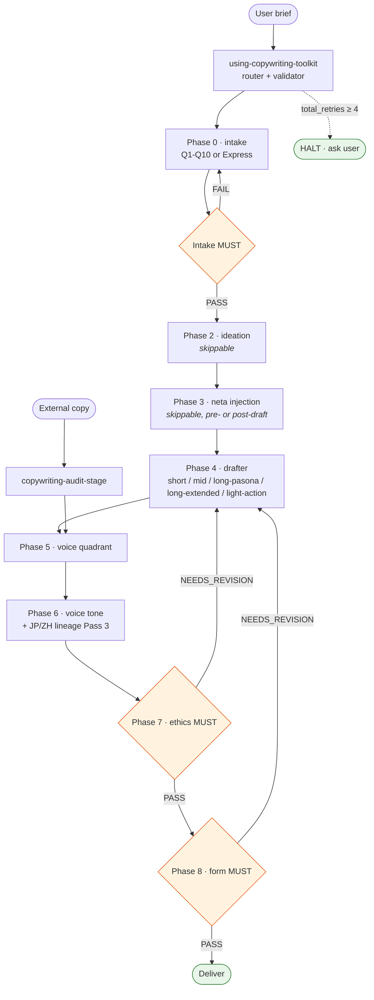

# copywriting-toolkit

[English](README.md) | [日本語](README.ja.md) | **繁體中文**

Pipeline 化的 copywriting plugin。從 `domain-teams:copywriting-team` 重構為 14 個專職 skill — 每個 skill 只做一件事、自包含 standards、各 stage 之間以 JSON-Schema 驗證的 hand-off envelope 交接。提供兩條執行路徑（Express Mode + Q1-Q10 intake）、層次化的 precondition / bounce-back 機制，以及以 primary source 錨定的 JP + ZH voice lineage 工法。

## Status

- **v1.14.0** — 目前版本（2026-04-23）。Voice 衝突時的 anchor autonomy：當 `anchor §Prose mechanics / §Don't` 與 `brief.form_hint` / `brief.tone_cue` / Phase 4 draft 結構衝突時，由 anchor 勝出；Level-1 欄位仍維持 immutable。
- **v1.13.3 / v1.13.4** — 格式統一（90 個 anchor 採用單一 canonical 結構）+ CI lint gate。
- **v1.4.0+ anchor library** — 跨 EN / JP / ZH / zh-TW / zh-HK 共 90 個 voice anchor，分到 12 個 quadrant router（`{lang}-q{N}-anchors.md`）+ `voice-anchor-meta.md`。Plugin-native standards（`domain-teams` 沒有對應 upstream）。
- **v1.0.x** — 初始發行版。與 `domain-teams:copywriting-team` 並存以利 A/B 比較。

完整歷史請見 [`CHANGELOG.md`](CHANGELOG.md)。

## 9-Phase Pipeline

```
Phase 0  copywriting-intake                       mandatory (Q1-Q10 or Express)
Phase 1  [inline in intake]                       mandatory, LOOSE recommend planning-team
Phase 2  copywriting-ideation                     skippable
Phase 3  copywriting-neta-injection               skippable, hybrid pre/post
Phase 4  one of:                                  mandatory
           copywriting-short-form
           copywriting-mid-form
           copywriting-long-form-pasona
           copywriting-long-form-extended
           copywriting-light-action
Phase 5  copywriting-voice-quadrant-stage      mandatory
Phase 6  copywriting-voice-tone-stage             mandatory
Phase 7  copywriting-ethics-check-stage           mandatory, evaluator-only
Phase 8  copywriting-form-check-stage             mandatory, evaluator-only
Alt      copywriting-audit-stage                  alternate entry for external copy
```

Entry router：`using-copywriting-toolkit`。

## Pipeline Flow

Happy-path 主幹。Bounce-back、retry caps、Express vs Q1-Q10 grill、Phase 6 JP/ZH dual-trigger conflict、audit 子 stage 等內容請見 §Envelope Contract、§Two Execution Paths 與各 skill 的 SKILL.md。



## Example Brief — Pipeline 的參考輸入

**brief**（業界術語：creative brief）是你交給 pipeline 的任務描述。Phase 0 intake 會把它整理成 `envelope.brief{}` 的各欄位。完整的 brief 會觸發 Express Mode（單輪確認）；不完整的 brief 則會走 Q1-Q10 多輪 intake 來補齊資訊。

### Brief 欄位結構（pipeline 預期的格式）

| 欄位 | Level | 角色 | 範例 |
|---|---|---|---|
| `product` | 1 — required | 你要賣的東西、有命名 | 「禾井」台灣在地職人手工醬油 |
| `value_proposition` | 1 — required | 一句話的核心價值 | 台灣本土非基改黑豆 + 木桶發酵 18 個月, 月訂 NT$680 含冷藏宅配 |
| `target_audience` | 1 — required | 具體 demographic / psychographic | 30-50 歲, 注重料理品質, 已接觸日本職人醬油 / 有機食品店消費 |
| `schwartz_level` | 1 — required | Awareness level（Schwartz 1966）L1-L5 | L2-L3（product-aware → solution-aware）|
| `form` | 1 — required | Copy form | long-form-pasona（新 PASONA, ~3500 字 LP）|
| `channel` | 1 — required | 投放介面 | landing-page hero + body |
| `target_length` | 1 — long-form 必填 | 預期字數 | ~3500 字 |
| `output_language` | 1 — required | ja / zh-TW / zh-HK / en 等 | zh-TW |
| `voice_reference` | 2 — AI-recommend-or-user-stated | Maestro 名稱（user-quoted only）或描述詞 | 糸井重里 / 許舜英 / "default" + voice_description |
| `voice_description` | 2 — optional | 自由文字風格描述 | "溫暖 / 狀態提案 / 體言止め / 不直接呼籲 / 余韻" |
| `framework` | 2 — AI-recommend | PASONA family / BEAF / QUEST / PASTOR / PREP / CREMA | 新 PASONA |
| `claims[]` | context | 任何比較級 / 最高級 / 需佐證的 claim（供 Phase 7 裁決）| 「全世界最長發酵時間 18 個月」（T2 — benchmark-required）|
| `neta_opt_in` | 3 — default false | 是否允許 pop-culture / meme / 文學疊層 | false |

**Level 1 = 缺少時 BLOCKED**（intake 強制走 Q1-Q10 elicitation）。
**Level 2 = AI-recommend + user-confirm**（Express 會標註 `[AI-recommend]` 或 `[user-stated]`）。
**Level 3 = opt-in / 預設**（標註 `[default]`）。

### 參考 brief — 「禾井」醬油月訂閱 LP（v1.1.0 E2E test 使用）

```
產品：台灣在地職人手工醬油品牌「禾井」
受眾：30-50 歲、注重料理品質、已接觸過日本職人醬油 / 有機食品店消費
      習慣 (Schwartz L2-L3)
價值主張：使用台灣本土非基改黑豆 + 純手工木桶發酵 18 個月，
          每瓶 500ml，月訂閱 NT$680 含冷藏宅配
Voice：糸井重里 ほぼ日 Q3 Affinity-Emotion — 溫暖 / 狀態提案 / 體言止め
       (user explicitly named 糸井)
Output language：zh-TW
Form：long-form-pasona 新 PASONA (6-stage, ~3500 字)
Channel：landing page hero + body

Claim to test:「全世界最長發酵時間 18 個月」— 最上級 No.1 claim;
              triggers 景表法 §5-1 優良誤認 if no benchmark
```

### 為何用這個 brief — 它能驗證的東西

這個 brief 設計成 pipeline regression 的錨點。把它跑過 toolkit 可以驗證 v1.1.0 的整套機制：

| Brief 特徵 | 觸發了什麼 |
|---|---|
| 全部 Level 1 欄位齊全 | Express Mode 在 Step 0.5 直接通過（不需要 Q1-Q10 fallback）|
| 糸井重里 user-stated + output `zh-TW` | **Dual-lineage trigger conflict** — router 發出 violation、透過 intake 重新確認；user 選擇解法（通常是 Option C：`voice_reference = "default"` + `voice_description` 把糸井紀律當成 prose posture 帶過去, Pass 3 不啟動以避免 JP→ZH 跨語移植）|
| `「全世界最」` claim | Phase 0.5-B grill 中的 **T2 tier classification** — user-stated + benchmark_missing + 不是直接違規 → 帶到 Phase 7 並掛上 `benchmark_required_before_phase_7` flag |
| target_length 3500 字 vs 新 PASONA 區間 3000-10000 | Phase 8 8b 字數區間 → 🟢 in-band（117%）, 不需要 framework 降級 |
| L2-L3 Schwartz × Q3 voice | `schwartz_alignment: ok` — 不需要 conflict_flagged 跨 phase 帶過去 |
| Phase 2 ideation 強制（v1.1.0）| Scoped depth（Express 預設）— 8-12 candidates 單輪、KJ 收斂為 3-5 winners；`ideation_skip_rationale` 不設定 |
| Phase 4 inline micro-ideation（v1.1.0）| 每個 stage 3-5 candidate paragraph leads + 谷山 3-reason selection；被淘汰的候選記錄在 `draft_inline_ideation.rejected[]` |

預期最終交付：~3500 字 zh-TW 新 PASONA 6-stage LP，糸井-spirit-in-zh-TW voice，ethics gate 經 1 次 auto-revise 後 PASS（拿掉「全世界最」→ 替換為可佐證的比較級）, Phase 8 PASS（in-band + voice 一致）, `total_retries = 2`（1 次 dual-trigger bounce + 1 次 ethics auto-revise）, 遠低於 cap of 4。

### 怎麼用這個參考 brief

- 當作未來各版本的 **regression test input** — 每次 toolkit 釋出後重跑一次, 檢查 catch rate / 輸出品質有沒有 regress
- 當作新使用者學怎麼結構化 brief 的 **worked onboarding example**
- 當作把這個 plugin 與 `domain-teams:copywriting-team` 在同一個 input 上對比的 **A/B baseline anchor**
- 當作 **prompt template** — 把上面 brief block 複製過去, 替換 product / audience / claim, 再貼進 router

這個 brief 刻意挑了會浮現 tricky cases 的設計（JP maestro + zh-TW output 衝突、最上級 claim 沒有 benchmark），而不是一個普通直通的 case — 普通 brief 能驗證的機制比較少。

## Intake 的兩條執行路徑

兩條路徑刻意用不同方式處理 FATAL candidate（仿照 `superpowers:brainstorming` vs `superpowers:subagent-driven-development`）：

| Path | 觸發條件 | 輪數 | Grill resolution |
|---|---|---|---|
| **Q1-Q10** | Brief 缺 Level 1 欄位、被 bounce-back、或 user 主動要求完整 intake | 約 10-14 個 user 輪次 | **Inline probe-and-resolve** — agent 在 Q8 提供 3-option menu（supply / rewrite / drop）；沒有 tier 概念 |
| **Express** | Brief 帶齊所有 Level 1 欄位；無紅旗 | 約 3 個 user 輪次 | **Structured tier return** — T1 ABORT / T2 CARRY / T3 ABORT；tier 是 evaluator 的 output contract，類似 `superpowers` subagent status code |

詳見 [`skills/copywriting-intake/SKILL.md §Execution Paths`](skills/copywriting-intake/SKILL.md)。

## Skills

| Skill | Phase | 角色 |
|---|---|---|
| `using-copywriting-toolkit` | router | Entry + Preconditions validator + Express qualification + bounce-back enforcement |
| `copywriting-intake` | 0-1 | Brief intake（Q1-Q10 或 Express）+ Intake Completeness MUST gate |
| `copywriting-ideation` | 2 | Mandalart + KJ + Taniyama + VS divergence / convergence |
| `copywriting-neta-injection` | 3 | Neta overlay（pre-draft bake-in 或 post-draft overlay）+ Neta Safety SHOULD gate |
| `copywriting-short-form` | 4 | キャッチコピー / headline（7-15 字, AIDMA A+I, 5 切入點）|
| `copywriting-mid-form` | 4 | EC product copy（BEAF: Benefit → Evidence → Advantage → Feature）|
| `copywriting-long-form-pasona` | 4 | PASONA / 新PASONA / PASBECONA（神田昌典 canonical）|
| `copywriting-long-form-extended` | 4 | QUEST（Fortin 2005）/ PASTOR（Edwards 2016）|
| `copywriting-light-action` | 4 | PREP / CREMA micro-conversion（Kaushik 2007）|
| `copywriting-voice-quadrant-stage` | 5 | Voice Quadrant（Authority↔Affinity × Reason↔Emotion）+ Schwartz routing |
| `copywriting-voice-tone-stage` | 6 | 4-axis tone + Mailchimp context-switching + JP/ZH lineage Pass 3 |
| `copywriting-ethics-check-stage` | 7 | 景品表示法 / FTC / Cialdini misuse / dark-pattern MUST gate |
| `copywriting-form-check-stage` | 8 | Framework 遵循度（8a MUST）+ qualitative（8b SHOULD）|
| `copywriting-audit-stage` | alt | 用 Phase 5-8 audit 外部 copy |

## Agents

Plugin-local 的搭檔（不與 `domain-teams` 共用）：

| Agent | Persona | Model | 角色 |
|---|---|---|---|
| `copywriter` | 以讀者為先, 走 糸井 / Ogilvy / Cialdini / Schwartz lineage + 谷山 紀律 + 小霜「嘘をつかない」 | sonnet | Drafting、ideation、audit 變體 |
| `copywriter-evaluator` | 嚴格的法務 / framework 審稿者 — NOT a copywriter；aesthetic-capture 明確列為 anti-pattern | opus | 只給 gate verdict；不 draft 也不軟化 |

Persona 切分是刻意的 — 一個被 charm 到的 copywriter 會放行 景表法 claim；一個謹慎的 evaluator 會生出臨床式的 copy。把兩者分開, 才能讓兩個角色都保持誠實。

## Envelope Contract

Skill 之間的 hand-off 都用 JSON-Schema 驗證。詳見 [`.claude-plugin/envelope.schema.json`](.claude-plugin/envelope.schema.json)。

關鍵 invariant：

- **Router 是單一 enforcement point** — 在 launch 之前對每個 skill 的 `## Preconditions` schema 做驗證。下游 skill 不自我驗證。
- **Violation envelope** — precondition 失敗時, router 發出 bounce-back 形狀（`detected_by`、`missing`、`bounce_to`、`bounce_round`、`user_message`）並向上 route。
- **Retry caps** — `bounce_round ≥ 3` → HALT；每個 phase `revise_round_count ≥ 2` → HALT；`total_retries ≥ 4` 累計 → HALT。
- **Audit trail** — envelope 上的 `audit_trail[]` 紀錄 skill-entered / gate-verdict / violation-detected / bounce-dispatched / halt-ask-user 等事件。

## Grounding（一手來源）

從 `domain-teams:copywriting-team` byte-identical 保留的 standards：

- 神田昌典 2016/2021 PASONA / 新PASONA / PASBECONA
- 谷山雅計 2007 散らかす→選ぶ→磨く + なんかいいよね禁止
- 今泉浩晃 1987 曼陀羅発想法
- 川喜田二郎 1967 KJ法
- Cialdini 1984 *Influence*
- Schwartz 1966 *Breakthrough Advertising*
- Zhang et al. 2025 Verbalized Sampling（arXiv:2510.01171）
- Fortin 2005 QUEST / Edwards 2016 PASTOR
- 小霜和也 2010/2014 本能分析
- 秋山隆平・杉山恒太郎 2004 AISAS / 飯髙悠太 2019 ULSSAS
- Kaushik 2007 micro/macro conversion
- McQuarrie & Mick 1996 rhetorical operations / Lakoff & Johnson 1980 conceptual metaphor / Thornton 1995 subcultural capital
- 景品表示法（2023 年修法, 2024-10-01 生效）+ FTC Endorsement Guides（16 CFR 255）
- Vaughn 1980 FCB × Halliday 1978 SFL（2-axis Voice Quadrant — team synthesis）

Voice lineage 工法（Tier 3 deep-dive standards）：

- **JP** — `jp-copy-craft-lineage.md`（cp from domain-teams）：糸井重里 / 岩崎俊一 / 眞木準 / 谷山雅計 via TCC 年鑑
- **ZH** — `zh-copy-craft-lineage.md`（v1.0.1 新增, 為本 toolkit 進行 primary-source 研究）：許舜英（意識形態 / 中興百貨 1988-1999, 11 條已標日期語料）/ 李欣頻（誠品敦南 1990s-2000s, 7 條）/ 葉明桂（奧美 / 左岸 1998-, 3 條 + 策略性 framework）。包含 4 條 attribution 修正（#Z1-#Z4）以及 per-master 的 LLM 重現 gap analysis。

Voice anchor library（v1.4.0+ plugin-native, upstream 沒有對應）：

- **90 個 anchor**, 跨 EN / JP / ZH / zh-TW / zh-HK；每個檔案一個 anchor, 統一的 canonical 結構（v1.13.3）涵蓋 `## Metadata`、`## Native critical read`、`## Prose mechanics`、`## Don't`、`## What this register achieves`
- **12 個 quadrant router**（`{lang}-q{N}-anchors.md`）把 anchor index 到 Voice Quadrant × Schwartz × output language
- **Lint enforced** via CI 中的 `scripts/lint-anchor-library.py`；單一 canonical 格式, 沒有沉默的替代格式

## 與 `domain-teams:copywriting-team` 的 A/B

原 `domain-teams:copywriting-team` 維持原狀（copy-first 原則 — 所有 cp 過來的檔案 byte-identical）。在同一個 brief 上跑兩邊, 比較輸出品質、gate catch rate、互動成本。兩個 plugin 並存；整併推遲到 A/B 結束後的回顧再決定。

## 安裝

Plugin 透過 `monkey-skills` marketplace 載入。詳見 repo 根目錄的 `.claude-plugin/marketplace.json` entry。Marketplace 載入後, 所有 14 個 skill + 2 個 agent + plugin-level convention（CLAUDE.md）會自動 resolve。

Setup 細節、權限、model tier、persistence model：見 [`CLAUDE.md §Setup`](CLAUDE.md)。

## 授權

MIT — 見 repository 根目錄。
