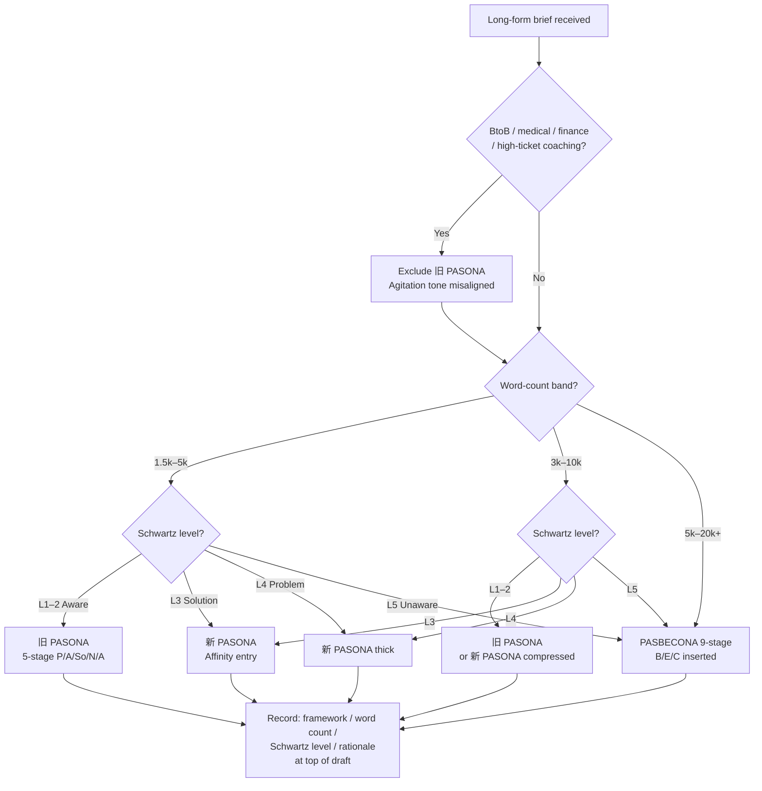

<!--
DIVERGED FROM domain-teams:copywriting-team
Original source: domain-teams/skills/copywriting-team/protocols/write-long-form-copy.md
Changes in copywriting-toolkit:
  - v1.1.0: ADDED §Inline micro-ideation (谷山 stage-level diverge-select rule)
Original content preserved verbatim below. All divergences are additive;
no deletion or re-order of original prose. Search for "v1.1.0 addition"
markers to locate plugin-specific additions.
-->

# Protocol: Write Long-Form Copy（PASONA Canon long-form writing）

**When to use**: Long-form copy requests. Typical cases — landing page (LP), sales letter, seminar / webinar invitation page, mail-magazine series, document-request trigger copy, advertorial, long-format CM script. Word count: 1,500+ characters.

**Output**: A long-form copy artifact structured stage-by-stage per the selected framework. Each stage specifies its task / word-count ratio / dropout-prevention transition. Passed through an ethics self-check before final delivery.

**Grounds on**: `../standards/long-form-pasona-canon.md`, `../standards/persuasion-psychology-anchor.md`, `../standards/voice-and-tone.md`, `../standards/persuasion-ethics.md`

This protocol is recommended to follow the Phase 3 handoff from `copy-ideation-parallel.md` (especially for Affinity / Benefit seed material). If ideation is not run first, you must prepare Problem + Affinity starting material alongside framework selection in Phase 1.

## Phase 1: Framework Selection

Cross-reference `long-form-pasona-canon.md` §三框架の適用表 and `persuasion-psychology-anchor.md` §Schwartz 5 Levels of Awareness.

### Decision tree

### Rules embedded in the tree

- **Core rule (Schwartz 1966)**: never use an Offer closer directly for Unaware readers; always go through narrative problem discovery first. (Enforced by L5 → PASBECONA path.)
- **Voice quadrant corollary** (per `voice-quadrant-positioning.md` §Schwartz × Quadrant): for Level 5 Unaware readers, prefer Q3 (Affinity + Emotion) narrative entry; never open with Q4 (Affinity + Reason direct-action voice) — Q4 assumes awareness that Level 5 readers lack, collapsing conversion.
- **Tone-boundary exclusion**: BtoB / medical / finance / high-ticket coaching → 旧 PASONA path is pruned; default to Affinity-entry of 新 PASONA / PASBECONA.

### Record example

> framework = 新 PASONA / word count 5,000 chars / Schwartz Level 3 (Solution Aware) / rationale: audience knows the product category; building an empathy-based educational LP with Affinity entry

### Exception cases (outside the decision tree)

- **Awareness level spans multiple segments** (some Level 2, some Level 4) → either choose PASBECONA full-length to cover Level 4-5 as well, or branch LP by segment — discuss with planning-team.
- **Word-count constraint imposed externally** (media word-count rules) → prioritize word count for framework selection; record the stage-compression policy.
- **Renewal of an existing LP that requires framework switch** → run `copy-audit.md` Phase 3 framework-switch proposal first, then rebuild under the new framework with this protocol.

## Phase 2: Stage-by-Stage Drafting

Draft each stage following the definitions in `long-form-pasona-canon.md`.

1. **Set word-count ratios** (`long-form-pasona-canon.md` §段階間 flow 設計原則 字數比例):
   - 旧 PASONA: P:A:So:N:A ≒ 2:2:3:2:1
   - 新 PASONA: P:A:S:O:N:A ≒ 1:1:1:1:0.5:0.5 (base)
   - PASBECONA (5,000 chars): P:A:S:B:E:C:O:N:A ≒ 1:1:1:1:2:2:1:0.5:0.5

2. **Adhere to stage tasks**: Each stage follows the "stage task" defined in `long-form-pasona-canon.md` §旧 PASONA / 新 PASONA / PASBECONA tables. Do not skip stages; do not mix tasks across stages.

3. **Affinity stage special norms** (新 / PASBECONA):
   - Allocate **equal or more volume than Problem** (`long-form-pasona-canon.md` §段階間 flow 設計原則).
   - Do not use fear-inducing expressions ("このままでは手遅れになります"). Affinity starts with "私も同じでした" — a walking-beside style.
   - Psychology anchor: `persuasion-psychology-anchor.md` §Cialdini Liking.
   - For JP projects, consult 糸井 / 岩崎 voice for "state-proposal" and "seasonal" emotional resonance (`voice-and-tone.md` §JP 情緒共鳴傳統).
   - Use the "Affinity seed" from `copy-ideation-parallel.md` Phase 3 handoff as the Phase 2 starting material.

4. **Solution → Benefit → Evidence → Contents flow (PASBECONA only)**:
   - The canonical order is abstract (Benefit) → objective (Evidence) → concrete (Contents). Reversing this increases cognitive load (`long-form-pasona-canon.md` §PASBECONA B/E/C 挿入の論理).
   - Evidence must combine 3+ types (specialist endorsement / track-record numbers / customer voice, `persuasion-psychology-anchor.md` §Cialdini Authority + Social Proof).

5. **Offer stage**: Present price / guarantee / benefits concretely. **Omission prohibited** (except 旧 PASONA). Place adjacent to Narrow down.

6. **Voice consistency**: Check against the brand voice guide (`voice-and-tone.md` §Brand Voice Guide の Checklist) at each stage. Voice must not break across headline / body / Offer / CTA (`voice-and-tone.md` §Anti-Patterns "headline と body voice 断裂").
   - Confirm all 4 voice-axis positions (Formality / Seriousness / Respectfulness / Enthusiasm) are consistent across all stages.
   - Tone is context-dependent and adjustable: Problem → matter-of-fact, Affinity → respectful / empathy, Narrow down → urgent but not incitement, Action → direct.
   - In JP projects writing the Affinity stage with 糸井 / 岩崎 voice, be careful not to suddenly switch to Anglo direct voice in Offer / Action (`voice-and-tone.md` §JP 情緒共鳴傳統 vs Anglo boundary).

## Phase 3: Stage-Transition Flow Verification (dropout-prevention checkpoint)

Follow `long-form-pasona-canon.md` §段階間 flow 設計原則 for focused inspection of stage-transition boundaries.

1. **Make dropout points explicit**: At each boundary (P→A, A→S, S→B, B→E, E→C, C→O, O→N, N→A), is the "bridge to the next stage" explicit? Design the transition using connectors / subheadings / questions.

2. **Self-ask the reader's question at each stage end**: "After finishing this stage, does the reader want to continue?" "What question does the reader hold now?" Does the next stage answer that question?

3. **Narrow down → Action adjacency**: Do not insert another stage between N and A. Separating urgency from CTA erodes scarcity.

4. **System 1 / System 2 balance** (`persuasion-psychology-anchor.md` §Kahneman System 1 / System 2):
   - headline / opener captures System 1 in short-form
   - body convinces System 2 (arguments, evidence, logical consistency)
   - closing returns to System 1 emotion (Narrow down + Action)
   - Skewing to one side causes either "emotion moves but no purchase" or "logic satisfied but no action".

5. **Psychology anchor mapping verification** (`persuasion-psychology-anchor.md` §PASONA フレームワークの心理学 anchor マッピング):
   - Problem → Schwartz Level 4→3 shift + Kahneman System 1 (instant pain evocation)
   - Affinity → Cialdini Liking + JP emotional voice (糸井 / 岩崎)
   - Solution → Schwartz Level 3→2 shift + System 2 (logical validity)
   - Benefit (PASBECONA) → Kahneman prospect theory (gain frame) + Authority
   - Evidence (PASBECONA) → Cialdini Social Proof + Authority
   - Offer → Kahneman loss aversion + Cialdini Reciprocity
   - Narrow down → Cialdini Scarcity (truthfulness required)
   - Action → Cialdini Commitment & Consistency + Nudge default
   - Self-ask whether each stage **consciously uses** the corresponding anchor, or merely satisfies the stage task superficially.

## Phase 4: Ethics Self-Check

Self-check against `persuasion-ethics.md` §景品表示法要點 + §FTC Endorsement Guides 要點 + §Dark Pattern 反模式清單 in order. The final gate judgment belongs to the evaluator. This phase is the worker's self-audit.

1. **景品表示法 (JP market)**:
   - 優良誤認表示 (§5-1) — Are superlative claims ("業界最高", "世界初", "No.1") supported by evidence?
   - 有利誤認表示 (§5-2) — No dual-price display, false limited-time offers, or hidden costs.
   - 打消し表示 — Does the disclaimer effectively negate the main claim?
   - ステマ告示 (enforced 2023-10-01) — Are any expressions hiding their advertising nature?

2. **FTC Endorsement Guides (US market)**:
   - Testimonial representativeness (§255.2) — Are only atypical cases listed?
   - Material connection disclosure (§255.5) — Is the relationship with the endorser disclosed?

3. **Dark pattern self-check** (`persuasion-ethics.md` §Dark Pattern 反模式清單):
   - False scarcity → Narrow down stage **requires truthfulness**
   - Fake social proof (fabricated testimonials) → Evidence stage uses only verifiable track records
   - Hidden costs → Offer stage discloses all fees
   - Forced continuity (hard-to-cancel auto-renewal) → if "cancel anytime" is written, the reality must match

4. **小霜 principle** (`persuasion-ethics.md` §小霜和也「嘘をつかない」原則):
   - No exaggeration / no fabricated benefits / no forged user voices / no fear-based basic strategy.

5. **Record ethics self-check results as meta-note at the end of the draft** (for evaluator reference).

## Rules

- Do not skip stages. Do not omit Offer (except in 旧 PASONA), and keep Narrow down adjacent to Action (`long-form-pasona-canon.md` §Anti-Patterns).
- Do not write Affinity as a rewording of Agitation. "不安を感じていませんか？" leans Agitation; "私も同じでした" is Affinity.
- Do not credit B/E/C stages solely to 神田 or 衣田. Use the co-authored attribution (`long-form-pasona-canon.md` §B/E/C 歸屬の uncertainty).
- Explicitly perform the Schwartz awareness level diagnosis in Phase 1. Without it, fatal errors like "direct Offer to Level 5" occur (`persuasion-psychology-anchor.md` §Anti-Patterns).
- Check voice guide alignment at each stage. If framework output and voice guide conflict, voice guide wins (`voice-and-tone.md` §PASONA / BEAF / キャッチコピー 框架的組合).
- Do not use superlative claims, dual-pricing, or fake testimonials. 景品表示法 / FTC violations are always rejected at the evaluator gate.
- Do not default to 旧 PASONA for BtoB / medical / finance / high-ticket coaching.

## Anti-Patterns

- **Citing 1999 as PASONA's first book publication**: Canonical is 2016 『稼ぐ言葉の法則』 (`long-form-pasona-canon.md` §drift #4).
- **Dating PASBECONA to 2016**: Canonical is 2021 『コピーライティング技術大全』 (`long-form-pasona-canon.md` §drift #5). 2016 is the year of 新 PASONA.
- **Keeping the Affinity stage thin**: Canonical requires volume equal to or more than Problem. Thin Affinity degenerates into "empathy-styled platitudes".
- **Placing Contents before Benefit in PASBECONA**: Violates the abstract → objective → concrete order. Leading with specs increases cognitive load.
- **Running fear-based messaging through a long-form**: Post-新 PASONA canonical is Affinity entry. Fear-amplification is a path 神田 himself reflected on in 2016.
- **Using Offer closer directly for Unaware readers**: Skipping the Schwartz awareness ladder collapses conversion.
- **Skipping ethics self-check**: "The evaluator will check" is an abdication of responsibility. 景品表示法 / FTC violations should be eliminated at the worker stage.
- **Writing long-form with short-form voice**: Extending short-form compression density into long-form produces self-repetition (`voice-and-tone.md` §Anti-Patterns "headline と body voice 断裂" flip side).
- **Using superlative claims without evidence**: "業界 No.1", "世界初", "最安値" are frequent violation types for 景品表示法 優良誤認 / 有利誤認 (`persuasion-ethics.md` §Anti-Patterns).

---

<!-- v1.1.0 addition: inline micro-ideation per PASONA / QUEST / PASTOR stage (copywriting-toolkit specific) -->

## Inline Micro-Ideation (copywriting-toolkit v1.1.0)

Applies regardless of whether Phase 2 ideation produced external candidates. Purpose: enforce 谷山 「なんかいいよね禁止」at stage level for long-form drafting.

### Procedure — per framework stage

Applies to all long-form frameworks: 旧 PASONA (5 stages) / 新 PASONA (6 stages) / PASBECONA (9 stages) / QUEST (5) / PASTOR (6).

For each stage:

1. Produce **3-5 candidate paragraph leads** (opening 1-2 sentences of the stage).
2. Apply 谷山 3-reason test per `standards/ideation-taniyama-discipline.md`:
   - Who is this for / what stage-goal does this lead serve
   - Why new vs generic long-form opening for this stage
   - Why resonant — specifically addressing the stage's role:
     - P (Problem): does it name a specific state the reader recognizes?
     - A (Affinity): does it establish peer / empathy without pandering?
     - S (Solution): does it pivot from problem to solution cleanly?
     - B (Benefit) / E (Evidence) / C (Contents): PASBECONA mid-section — concrete abstractness progression
     - O (Offer): does it crystallize the deal without feeling transactional?
     - N (Narrow-down): does it stratify reader without being exclusionary for its own sake?
     - A (Action): does it hand off to CTA without tone-collapse from the preceding register?
     - QUEST Qualify / Understand / Educate / Stimulate / Transition — per Fortin
     - PASTOR Problem-Person / Amplify-Aspiration / Story-Solution / Testimony-Transformation / Offer / Response — per Edwards
3. Select 1 winner per stage lead. Unused candidates become runner-up pool for re-draft if Phase 8 8b flags.
4. Record in `envelope.draft_inline_ideation.rejected[]`.

### Full-draft pass (long-form specific)

After all stage leads are selected and the full draft is composed:

1. Produce **2-3 full-draft alternatives** by varying the tone axis (higher / lower formality, higher / lower enthusiasm) while keeping structure identical.
2. Compare via 谷山 discipline — which alternative best serves the declared `voice_quadrant` + audience + channel?
3. Winner = deliverable; runners-up stored in `envelope.draft_alternatives[]` for A/B test variants if client requests.

### Trigger

ALWAYS runs inside Phase 4 drafting. If `envelope.ideation_depth == "skipped"`, this is the ONLY diverge-select pass — do NOT skip it.

### Why mandatory

Long-form drafts are expensive to revise at Phase 7-8. Catching stage-lead weakness at micro-ideation level prevents full-draft discard. Also: PASBECONA-sized drafts (5K-10K chars) compound single-candidate commitment — by the time Phase 8 fires 🔴, 2 hours of writing are sunk. Micro-ideation at paragraph-lead level is ~5-10% of drafting cost; catches most stage-framing errors pre-gate.