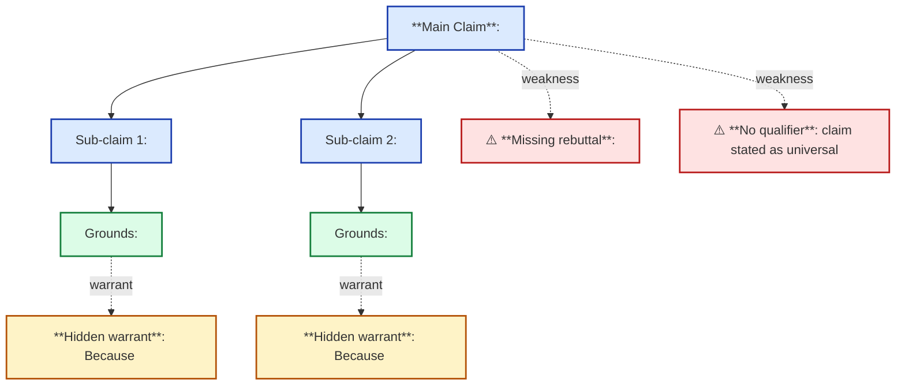
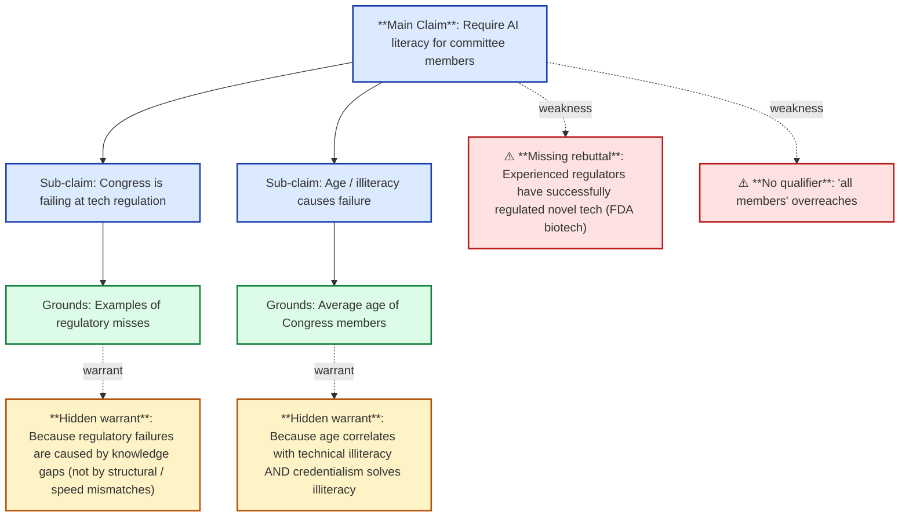

# Protocol: Argument Mapping (Mermaid format)

Render the deconstructed argument as a mermaid `flowchart TD` diagram.
The map's value is showing **hidden warrants** that the prose buries.

## Format

## Conventions

| Element | Style |
|---|---|
| Claim / sub-claim | Solid arrow from parent claim, blue node |
| Grounds | Solid arrow from claim it supports, green node |
| Warrant | **Dotted** arrow from grounds with label "warrant", yellow node — emphasizes that warrant is *hidden* and *bridges*, not directly stated |
| Weakness (missing rebuttal / no qualifier / contestable warrant) | Dotted arrow with "weakness" label, red node |
| Backing | Solid arrow from warrant up to backing, plain node (only if backing is non-trivial) |

## Why mermaid (not ASCII or images)

- Renders inline in GitHub / GitLab / Obsidian / many markdown viewers
- Editable in plain text
- Versionable in git
- Diff-friendly (commits show structural changes, not pixel diffs)

## When to skip the map

- Single-claim argument with no sub-claims and no hidden warrants — the prose is the map
- Trivial argument (< 50 words) — overhead of mermaid block exceeds value
- Argument is so unstructured the map would be misleading (signal: the report should say "no clear argument structure" rather than draw a flowchart)

## Worked example

For the AI regulation op-ed:

## Pitfalls

- **Drawing only claim → grounds**: this reproduces the surface
  argument. The whole point of the map is the warrant level.
- **Hiding weakness**: don't pretend missing rebuttals don't exist.
  Mark them in the map.
- **Over-detailed maps**: more than ~12 nodes becomes unreadable.
  If your argument has more, either split into sub-maps or simplify.
- **Inconsistent labeling**: keep labels short (one phrase). The map
  is a visual aid, not a transcript.
