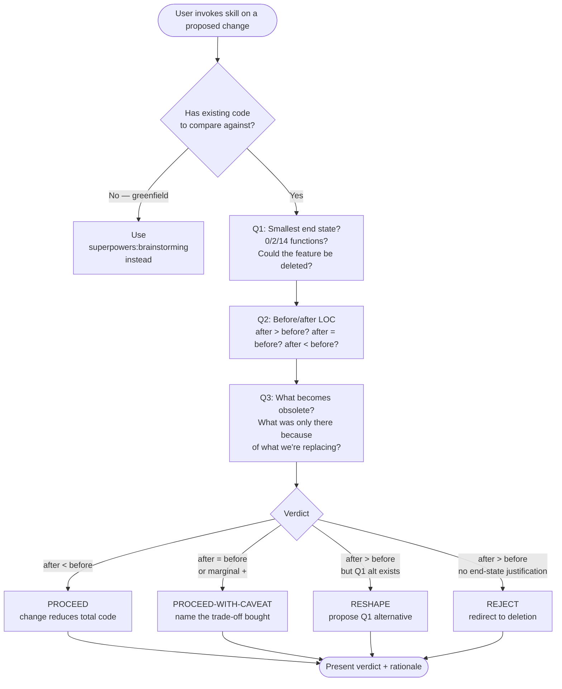

# Complexity Critique

[English](README.md) | **日本語** | [繁體中文](README.zh-TW.md)

> 既存 codebase に対する改動 — refactor / feature add / technical-debt
> cleanup — を、実装前に 3 つの deletion-first 質問で gate する。

これはユーザーが明示的に呼び出す **gate skill** である：既存 codebase
に対して refactor、feature add、technical-debt cleanup を行おうと
しているとき、改動を書く前に deletion-first の design pass を強制
するためにこの skill を呼び出す。

この README は GitHub でこの skill を読む人間向け。Claude が実際に
ロードする operational ファイルは [`SKILL.md`](SKILL.md)。

---

## なぜこの skill が存在するのか？

**繰り返される失敗モード**：code は成長する。すべての改動は「何を
*加える* べきか？」として扱われ — 「何を *加えない* べきか？」とは
めったに、「この改動は何を obsolete にするか？」とはさらにめったに
扱われない。結果として codebase は自然 entropy — より多くの file、
より多くの class、より多くの「未知の未来のための柔軟性」、誰も求めて
いない line。

明示的な gate がなければ、改動はデフォルトで *additive* になる。この
skill は additive default を捕まえる規律を凝縮したもの：

1. **Q1 — smallest end state.** smallest change ではなく smallest
   *result*。
2. **Q2 — before/after LOC count.** after > before なら原提案を
   拒否する。
3. **Q3 — 何が obsolete になるか.** すべての改動は何かを削除可能に
   する。

50 行追加して 200 行削除する改動は net win（-150）。2 つの function を
書かないために 14 の function を残すのは net loss（+12）。Metric は
end-state volume であり effort ではない。

---

## どう動くのか？

### Operational flow の一覧



### Verdict 語彙

4 つの bucket、`proposal-critique` の KEEP / KEEP-WITH-CAVEAT /
DEFER / DROP と並行：

|                       | 方向                      | 条件                                              |
|-----------------------|--------------------------|--------------------------------------------------|
| **PROCEED**           | そのまま ship             | 改動が total code を減らす                        |
| **PROCEED-WITH-CAVEAT** | Ship + trade-off を明記 | Net-neutral または marginal；何を買ったかを明示  |
| **RESHAPE**           | Q1 代替案を提示           | 改動が additive；Q1 がより小さな end state を生成 |
| **REJECT**            | 削除へリダイレクト        | 改動が additive；end-state の正当化が見えない    |

`PROCEED-WITH-CAVEAT` が鍵：改動を ship するが *何を買ったか* を
名指す（例：「30 lines bought, exhaustiveness check enforced」）。
Hidden growth がまさにこの skill が防ごうとする失敗モード。

### 4 つの reference mindsets（同梱、必須プリアンブル）

Skill は `references/` に 4 つの哲学 anchor を同梱する。Q1 に答え
る前に少なくとも 1 つを load することが必須（上游
`reducing-entropy` の設計どおり）：

- **`references/mindset-data-over-abstractions.md`** — Perlis Epigram #9 / Hickey
- **`references/mindset-design-is-taking-apart.md`** — Hickey / Out of the Tar Pit / Ousterhout
- **`references/mindset-expensive-to-add-later.md`** — Willison PAGNI
- **`references/mindset-simplicity-vs-easy.md`** — Hickey

この skill は **完全に self-contained** — complexity-critique を
動かすには `dev-workflow` のインストールだけで足りる。同じ 4 つの
mindsets の canonical SSOT 版本は
`domain-teams:code-team/standards/mindset-*.md` にも住んでいる
（code-team の brainstorming / refactoring protocols が使用）；
本 skill 内の同梱コピーには SSOT を指すヘッダーノートが付いている。

---

## いつ使うべきか？

### 以下の場合に呼び出す…

- Refactor が俎上に載っていて、やる価値があるか知りたい
- 既存 code に feature を追加していて、よりシンプルな形が欲しい
- Technical debt を片付けていて、最大限の deletion が欲しい
- 以下のような言葉を打った：
  - 「is this change worth the lines?」
  - 「can this be simpler?」
  - 「what can we delete?」
  - 「complexity audit on this change」
  - 「降低複雜度」/ 「可以再小一點」
  - 「リファクタすべきか」/ 「最佳實踐」

### 以下の場合は呼び出**さない**…

- **開放的な探索 brainstorming** — 具体的な改動や feature の提案が
  まだなく、「何を作れるか」を探している段階。先に
  `superpowers:brainstorming` で具体的な提案に落とし、その後
  complexity-critique が適用される。**具体的な feature 提案を持つ
  純 greenfield は scope 内** — Q1 / Q3 が gate を anchor する；
  Q2 の LOC count は優雅に degrade し、「0 lines = 作らない決定」が
  Q1 の有効な答え。
- **複数項目提案 triage** — 入力が ≥3 件の推奨の list / plan。先に
  `proposal-critique` を使い、生き残った項目だけここに戻る。
- **Post-implementation review** — 改動はすでに書かれている。
  Anthropic `simplify` を使う。
- **些細な micro-changes** — 1 行修正、変数リネーム、コメント更新。
  Gate コストが改動コストを超える。
- **外部 API 制約**が構造を駆動 — Q1 の代替案が存在しないかも
  しれない。制約を note して proceed。

---

## 出力はどんな形？

### Worked Example — 既存 forms に validation を追加

**ユーザー**：「I need to add validation to these 5 forms.」

**Skill 出力**：

> **Q1（smallest end state）**
> - 5 つの form-specific schema を 1 つの validator function に
>   置き換えられるか？（ルールが重なるなら likely yes）
> - 5 つの form のうち 3 つを統合または削除できるか？usage data に
>   よれば 3 つの form は <2 users / 月。
> - Smallest end state 候補：2 forms + 1 validator function。
>
> **Q2（LOC count）**
> - 現在：5 forms (~500 lines)、validation 0
> - 提案：5 schemas + helper + 5 form updates → ~800 lines
> - Q1 代替案：2 forms + 1 validator → ~350 lines
> - Q1 が 450 lines 勝ち。
>
> **Q3（何が obsolete になるか）**
> - 削除される 3 forms — usage data が支持
> - 各 form ごとの schema 重複が解消
>
> **Verdict：RESHAPE**
> 元の提案は marginal な validation カバレッジのために codebase を
> 300 行増やす。Q1 代替案は total code を 150 行減らし、副産物として
> validation を提供する。

出力は「青信号／赤信号」ではない。元の提案を、end state が元より
小さい代替案にリダイレクトしたものである。

---

## 他の skill との関係は？

この skill は **既存 code に対する単一の提案改動** を扱う。多項目
triage、より深い研究、post-impl review は行わない。必要なツールへ
ハンドオフ：

- **`proposal-critique`**（姉妹）— 入力が ≥3 件の提案 *list* の
  とき、先にそちらで triage；生き残った項目で既存 code に触れる
  ものだけここに戻る。
- **`superpowers:brainstorming`** — 既存 code がないとき
  （greenfield design）。
- **Anthropic `simplify`**（組み込み）— 改動がすでに *書かれて*
  いて、「この diff はもっと小さくできるか」が問題のとき。
- **`domain-teams:code-team/protocols/refactoring.md`** — 改動が
  approved されて「どう安全に refactor するか」が問題のとき
  （Two Hats、Bad Smells、Feathers seam model）。

この skill は他のツール名を挙げるだけで呼び出さない。組み合わせは
reference によるもので routing ではない。

---

## dev-workflow の中での位置

dev-workflow の「critique」ラインは現在こうなっている：

```
proposal-critique  →  complexity-critique  →  Anthropic simplify
（list / plan      （既存 code に対する     （post-implementation
 / prose、          単一改動、              diff review）
 まだ code がない）  実装前）
```

`proposal-critique` と `complexity-critique` は姉妹：同じ gate-skill
の形、異なる scope。proposal-critique は *lists* を扱う；
complexity-critique は *既存 code に対する単一改動* を扱う。両者で
「やる価値があるか」の判断空間の大部分をカバーし、gate ロジックは
重複しない。

---

## Origin / lineage

この skill は MIT ライセンスの上游 skill チェーンから adapted：

```
joshuadavidthomas/agent-skills（MIT、original）
  → softaworks/agent-toolkit/skills/reducing-entropy（MIT、fork）
    → kouko monkey-skills/dev-workflow/complexity-critique（本ファイル）
```

元の名前は `reducing-entropy`。本 distribution は trigger semantics の
明確化のため `complexity-critique` にリネームした（「entropy」は jargon；
「complexity-critique」は既存 `proposal-critique` skill と並行する命名）。
upstream skill の `references/` に居た 4 つの mindsets は
`domain-teams:code-team/standards/` に独立した standards として抽出され、
基礎となる書籍／講演／論文（Perlis 1982、Hickey 2011/2012、Moseley &
Marks 2006、Ousterhout 2018、Brooks 1986、Willison/Plant/Kaplan-Moss
2021）に対する一次資料 citation で書き直された。

完全な upstream chain と modification summary は [`NOTICE`](NOTICE) を、
MIT chain 保存は [`LICENSE`](LICENSE) を参照。

---

## 既知の限界

| 限界 | 意味 | 緩和策 |
|---|---|---|
| **Greenfield Q2 が degrade** | Q2 の LOC count は `before` が必要。純 greenfield「この feature を作るべきか」には baseline がない。 | Q2 を「この feature を ship する最小コードは？`0 = 作らない` も俎上に載っているか？」に置き換える — Q1 / Q3 が gate を anchor し続け、deletion bias を build decision に持ち込む。 |
| **LOC は proxy であり truth ではない** | Line は complexity と等価ではないが相関する。30 行の type-system トリックは 100 行のストレートな code より密度が高いことがある。 | Q1 の「smallest end state」質問が概念サイズをカバー；Q2 の LOC は検証しやすい proxy。 |
| **PROCEED-WITH-CAVEAT はユーザーの誠実さに依存** | Verdict は何を買ったかを *名指す* ことを要求する。それを飛ばせば hidden growth が approve されるだけ。 | Skill は net-additive 改動を黙って approve することを明示的に拒否する；rationalization-prevention テーブルは `SKILL.md` にある。 |
| **Mindset 拡張ポリシーは code-team に住む** | `references/` 内の 4 つの同梱 mindset は functional copies。5 つ目の mindset を追加するルールは `domain-teams:code-team/standards/mindset-extension-standard.md` に住む。 | Runtime は完全に self-contained。mindset ライブラリ自体への変更を *提案する* ときだけ `domain-teams` をインストールする。 |

---

## License

MIT — [repository root LICENSE](../../../../LICENSE) と skill レベルの
[`LICENSE`](LICENSE) / [`NOTICE`](NOTICE)（MIT chain 保存）を参照。

## Files

```
complexity-critique/
├── README.md           ← English README
├── README.ja.md        ← 本ファイル（日本語）
├── README.zh-TW.md     ← 繁體中文 README
├── SKILL.md            ← operational ファイル（Claude 向け）
├── LICENSE             ← MIT, joshuadavidthomas → softaworks → kouko
├── NOTICE              ← upstream chain 詳細 + 修正 summary
└── references/         ← 4 つの同梱 mindset functional copies
    ├── mindset-data-over-abstractions.md
    ├── mindset-design-is-taking-apart.md
    ├── mindset-expensive-to-add-later.md
    └── mindset-simplicity-vs-easy.md
```

`README.*.md` と `SKILL.md` は読者と役目が異なる。意図的に内容を重複
させていない：`SKILL.md` は簡潔・指示的で、gate として構造化されている
（Iron Law / Gate Function / Verdict）；README は叙述的・説明的である。
Claude は `SKILL.md` を読み、人間は対応する言語の README を読む。
