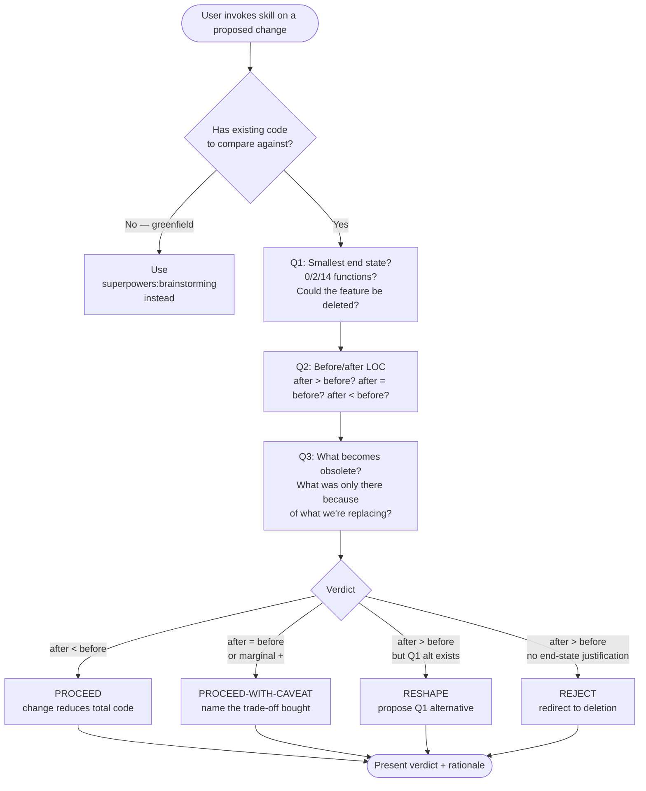

# Complexity Critique

**English** | [日本語](README.ja.md) | [繁體中文](README.zh-TW.md)

> Gate a proposed change to existing code through three deletion-first
> questions before the change is implemented.

A user-invoked **gate skill**: when you have a refactor, feature add,
or technical-debt cleanup in mind for an existing codebase, you
invoke this skill to force a deletion-first design pass before
writing the change.

This README is for humans reading the skill on GitHub. The
operational file Claude actually loads is [`SKILL.md`](SKILL.md).

---

## Why does this skill exist?

**The recurring failure mode**: code grows. Every change is treated
as "what should we add?" — rarely as "what could we *not* add", and
even more rarely as "what could this change make obsolete?". The
result is the codebase as natural-state entropy — more files, more
classes, more "flexibility for unknown futures", more lines that
nobody asked for.

Without an explicit gate, every change defaults to *additive*. This
skill captures the discipline that catches the additive default:

1. **Q1 — smallest end state.** Not the smallest change; the
   smallest *result*.
2. **Q2 — before/after LOC count.** If after > before, reject the
   change as proposed.
3. **Q3 — what becomes obsolete.** Every change makes something
   else available to delete.

A change that adds 50 lines and deletes 200 is a net win
(-150). A change that keeps 14 functions to avoid writing 2 is a
net loss (+12). The metric is end-state volume, not effort.

---

## How does it work?

### Operational flow at a glance



### The verdict vocabulary

Four buckets, parallel to `proposal-critique`'s KEEP / KEEP-WITH-CAVEAT /
DEFER / DROP:

|                       | Direction              | When                                            |
|-----------------------|------------------------|-------------------------------------------------|
| **PROCEED**           | Ship                   | Change reduces total code                       |
| **PROCEED-WITH-CAVEAT** | Ship + name trade-off | Net-neutral or marginal; explicit trade-off    |
| **RESHAPE**           | Propose Q1 alternative | Change adds; Q1 produced a smaller end state    |
| **REJECT**            | Redirect to deletion   | Change adds; no end-state justification visible |

The `PROCEED-WITH-CAVEAT` verdict is critical: it ships the change
but *names what was bought* ("30 lines bought, exhaustiveness check
enforced"). Hidden growth is the failure mode this skill exists to
prevent.

### Four reference mindsets (bundled, required preamble)

The skill bundles 4 philosophical anchors at `references/`. Loading
at least one before answering Q1 is required (per the upstream
`reducing-entropy` design):

- **`references/mindset-data-over-abstractions.md`** — Perlis Epigram #9 / Hickey
- **`references/mindset-design-is-taking-apart.md`** — Hickey / Out of the Tar Pit / Ousterhout
- **`references/mindset-expensive-to-add-later.md`** — Willison PAGNI
- **`references/mindset-simplicity-vs-easy.md`** — Hickey

The skill is **fully self-contained** — `dev-workflow` is the only
plugin you need installed for complexity-critique to run. The
canonical SSOT versions of the same mindsets also live at
`domain-teams:code-team/standards/mindset-*.md` (used by code-team's
brainstorming / refactoring protocols); the bundled copies in this
skill carry a header note pointing back to the SSOT for evolution.

---

## When should you use it?

### Invoke when…

- A refactor is on the table and you want to know if it's worth doing
- A feature is being added to existing code and you want a simpler shape
- Technical debt is being cleaned up and you want maximum deletion
- You typed something like:
  - "is this change worth the lines?"
  - "can this be simpler?"
  - "what can we delete?"
  - "complexity audit on this change"
  - "降低複雜度" / "可以再小一點"
  - "リファクタすべきか" / "最佳實踐"

### Don't invoke when…

- **Open-ended exploratory brainstorming** — no specific change or
  feature is on the table yet, just "what could we build". Use
  `superpowers:brainstorming` to land on a specific proposal first;
  then complexity-critique applies. Pure greenfield with a *named*
  feature proposal IS in scope (Q1 / Q3 anchor the gate; Q2's LOC
  count gracefully degrades — "0 lines = decline to build" is a
  valid Q1 answer).
- **Multi-item proposal triage** — input is a list / plan with ≥3
  separate recommendations. Use `proposal-critique` first; come back
  here for surviving items.
- **Post-implementation review** — the change is already written.
  Use Anthropic `simplify` instead.
- **Trivial micro-changes** — single-line fixes, variable renames,
  comment updates. The gate cost exceeds the change cost.
- **External API constraints** drive the structure — Q1's
  alternatives may not exist. Note the constraint and proceed.

---

## What does the output look like?

### Worked Example — feature add to existing forms

**User**: "I need to add validation to these 5 forms."

**Skill output**:

> **Q1 (smallest end state)**
> - Could 1 validator function replace 5 form-specific schemas?
>   (Likely yes if the rules overlap.)
> - Could 3 of the 5 forms be merged or deleted? Usage data shows
>   3 forms have <2 users / month.
> - Smallest end state candidate: 2 forms + 1 validator function.
>
> **Q2 (LOC count)**
> - Current: 5 forms (~500 lines), 0 validation
> - Proposed: 5 schemas + helper file + 5 form updates → ~800 lines
> - Q1 alternative: 2 forms + 1 validator → ~350 lines
> - Q1 wins by 450 lines.
>
> **Q3 (what becomes obsolete)**
> - 3 deleted forms — supported by usage data
> - Per-form schema duplication eliminated
>
> **Verdict: RESHAPE**
> Original proposal grows the codebase by 300 lines for marginal
> validation coverage. Q1 alternative reduces total code by 150 lines
> and delivers the validation as a side effect.

The output isn't a green-light / red-light. It's a redirected
proposal whose end state is smaller than the original was.

---

## How does it relate to other skills?

This skill operates on **a single proposed change to existing code**.
It does not do multi-item triage, deeper research, or post-impl
review. Hand off when the case calls for it:

- **`proposal-critique`** (sibling) — when the input is a *list* of
  proposals (≥3 items), triage that first; come back here for
  surviving items that touch existing code.
- **`superpowers:brainstorming`** — when there is no existing code
  (greenfield design).
- **Anthropic `simplify`** (built-in) — when the change is already
  *written* and the question is "can this diff be smaller".
- **`domain-teams:code-team/protocols/refactoring.md`** — when the
  change is approved and the question is "how to refactor safely"
  (Two Hats, Bad Smells, Feathers seam model).

This skill names those tools but does not invoke them. Composability
is by reference, not by routing.

---

## Where in dev-workflow does this fit?

The "critique" line in dev-workflow now reads:

```
proposal-critique  →  complexity-critique  →  Anthropic simplify
(list / plan       (single change to       (post-implementation
 / prose,           existing code,           diff review)
 before any code)   before implementing
                    the change)
```

`proposal-critique` and `complexity-critique` are siblings: same
gate-skill shape, different scope. proposal-critique processes
*lists*; complexity-critique processes *single changes to existing
code*. Together they cover most of the "is this worth it" decision
space without duplicating the gate logic.

---

## Origin / lineage

This skill is adapted from a chain of MIT-licensed upstream skills:

```
joshuadavidthomas/agent-skills (MIT, original)
  → softaworks/agent-toolkit/skills/reducing-entropy (MIT, fork)
    → kouko monkey-skills/dev-workflow/complexity-critique (this)
```

The original was named `reducing-entropy`. This distribution renames
to `complexity-critique` for clearer trigger semantics ("entropy" is
jargon; "complexity-critique" parallels the existing
`proposal-critique` skill). The 4 mindsets that lived inside the
upstream skill's `references/` directory are extracted to
`domain-teams:code-team/standards/` as separate standards with
primary-source citations rewritten against the underlying books /
talks / papers (Perlis 1982, Hickey 2011/2012, Moseley & Marks 2006,
Ousterhout 2018, Brooks 1986, Willison/Plant/Kaplan-Moss 2021).

See [`NOTICE`](NOTICE) for full upstream chain and modification
summary, and [`LICENSE`](LICENSE) for MIT chain preservation.

---

## Known limitations

| Limitation | What it means | Mitigation |
|---|---|---|
| **Greenfield Q2 degrades** | Q2's LOC count needs a `before`. For pure greenfield "should we build this", there's no baseline to count against. | Q2 substitutes "what's the smallest code that ships this, and is `0 = decline to build` on the table?" — Q1 / Q3 still anchor the gate; deletion bias carries into the build decision. |
| **LOC is a proxy, not the truth** | Lines aren't complexity, but they correlate. A 30-line type-system trick may be denser than 100 lines of straightforward code. | Q1's "smallest end state" question covers conceptual size; Q2's LOC count is the easy-to-check proxy. |
| **PROCEED-WITH-CAVEAT depends on user honesty** | The verdict requires *naming* what was bought. A user who skips that just got a hidden growth approval. | The skill explicitly refuses to silently approve net-additive changes; the rationalization-prevention table is in `SKILL.md`. |
| **Mindset extension policy lives in code-team** | The 4 bundled mindsets in `references/` are functional copies. The rules for adding a 5th mindset live at `domain-teams:code-team/standards/mindset-extension-standard.md`. | None at runtime — the skill runs fully bundled. Install `domain-teams` only when *proposing* changes to the mindset library itself. |

---

## License

MIT — see [repository root LICENSE](../../../../LICENSE) and the
skill-level [`LICENSE`](LICENSE) / [`NOTICE`](NOTICE) for the
upstream MIT chain.

## Files

```
complexity-critique/
├── README.md           ← this file (for humans)
├── README.ja.md        ← 日本語 README
├── README.zh-TW.md     ← 繁體中文 README
├── SKILL.md            ← operational file (for Claude)
├── LICENSE             ← MIT, joshuadavidthomas → softaworks → kouko
├── NOTICE              ← upstream chain detail + modification summary
└── references/         ← 4 bundled mindset functional copies
    ├── mindset-data-over-abstractions.md
    ├── mindset-design-is-taking-apart.md
    ├── mindset-expensive-to-add-later.md
    └── mindset-simplicity-vs-easy.md
```

`README.*.md` and `SKILL.md` have different audiences and different
jobs. They intentionally do not duplicate content: `SKILL.md` is
terse, instructional, and structured as a gate (Iron Law / Gate
Function / Verdict); the READMEs are narrative and explanatory.
Claude reads `SKILL.md`; humans read the language-appropriate README.
