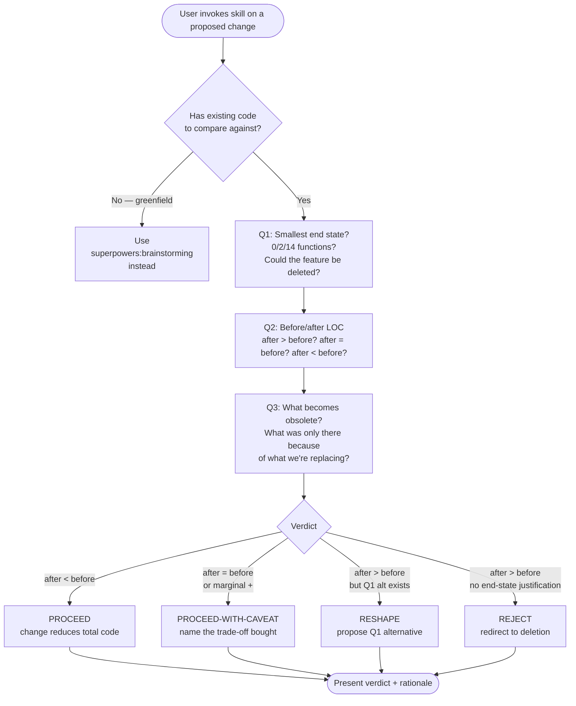

# Complexity Critique

[English](README.md) | [日本語](README.ja.md) | **繁體中文**

> 在實作之前，用三個 deletion-first 問題對「即將對既存 codebase 動的
> 改動」進行 gate。

這是一個由使用者主動呼叫的 **gate skill**：當你準備對既存 codebase
做 refactor、feature add 或 technical-debt cleanup 時，呼叫此 skill
強制執行一次 deletion-first 的設計 pass，再動手寫改動。

本 README 是給在 GitHub 上閱讀此 skill 的人類看的。Claude 實際載入的
operational 檔案是 [`SKILL.md`](SKILL.md)。

---

## 為什麼存在這個 skill？

**反覆出現的失敗模式**：code 會長大。每次改動都被當成「該加什麼？」—
很少被當成「能 *不* 加什麼？」，更很少被當成「這次改動能讓什麼變
obsolete？」。結果是 codebase 自然 entropy — 更多檔案、更多 class、
更多「為了未知未來保留的彈性」、更多沒人要求的 line。

沒有 gate，每次改動預設是 *additive*。這個 skill 把抓取 additive
default 的紀律凝結下來：

1. **Q1 — smallest end state**：不是 smallest change，是 smallest
   *result*。
2. **Q2 — before/after LOC count**：若 after > before，拒絕原提案。
3. **Q3 — 什麼變 obsolete**：每次改動都讓某個東西可以被刪。

加 50 行刪 200 行的改動是 net win（-150）。為了不寫 2 個 function 而
留下 14 個 function 是 net loss（+12）。Metric 是 end-state volume，
不是 effort。

---

## 它如何運作？

### Operational flow 一覽



### Verdict 詞彙

四個 bucket，與 `proposal-critique` 的 KEEP / KEEP-WITH-CAVEAT /
DEFER / DROP 平行：

|                       | 方向                      | 條件                                              |
|-----------------------|--------------------------|--------------------------------------------------|
| **PROCEED**           | 直接 ship                | 改動讓 total code 變少                            |
| **PROCEED-WITH-CAVEAT** | Ship 並命名 trade-off | Net-neutral 或 marginal；明確標出買到了什麼      |
| **RESHAPE**           | 提出 Q1 替代方案          | 改動是 additive；Q1 找到更小的 end state          |
| **REJECT**            | 導向刪除                  | 改動是 additive；無 end-state 正當理由            |

`PROCEED-WITH-CAVEAT` 是關鍵：ship 改動但要 *命名買到什麼*
（例如「30 lines 換到 exhaustiveness check」）。Hidden growth 正是
此 skill 要防的失敗模式。

### 三個 reference mindsets（跨 plugin）

當三問需要更深的 grounding，四個哲學 anchor 住在
`domain-teams:code-team/standards/`：

- **`mindset-data-over-abstractions.md`** — Perlis Epigram #9 / Hickey
- **`mindset-design-is-taking-apart.md`** — Hickey / Out of the Tar Pit
- **`mindset-expensive-to-add-later.md`** — Willison PAGNI
- **`mindset-simplicity-vs-easy.md`** — Hickey

這些不是 gate — 是 reference 詞彙。Mindsets 是 advisory
deepening；當 `domain-teams` 沒裝時，三問本身可獨立運作。

---

## 何時該使用？

### 在以下情境呼叫…

- 桌上有一個 refactor，你想知道值不值得做
- 在既存 code 上加 feature，想要更小的 shape
- 在清 technical debt，想要最大化 deletion
- 你打了類似這樣的話：
  - 「is this change worth the lines?」
  - 「can this be simpler?」
  - 「what can we delete?」
  - 「complexity audit on this change」
  - 「降低複雜度」/ 「可以再小一點」
  - 「リファクタすべきか」/ 「最佳實踐」

### 在以下情境**不**呼叫…

- **開放式探索 brainstorming** — 桌上還沒有具體的改動或 feature
  提案，只是在問「我們可以做什麼」。先用
  `superpowers:brainstorming` 落到具體提案，complexity-critique
  接著就適用。**有具體 feature 提案的純 greenfield 是 in scope** —
  Q1 / Q3 仍然 anchor gate；Q2 的 LOC count 優雅降級，「0 lines =
  決定不做」是 Q1 的有效答案。
- **多項目提案 triage** — 輸入是 ≥3 個建議的 list / plan。先用
  `proposal-critique`；倖存項目再回來這裡。
- **Post-implementation review** — 改動已經寫完。使用 Anthropic
  `simplify`。
- **瑣碎 micro-changes** — 單行修正、變數改名、註解更新。Gate 成本
  超過改動成本。
- **External API constraint 主導結構** — Q1 的替代方案可能不存在。
  Note constraint 然後 proceed。

---

## 輸出長什麼樣？

### Worked Example — 對既存 forms 加 validation

**使用者**：「I need to add validation to these 5 forms.」

**Skill output**：

> **Q1（smallest end state）**
> - 5 個 form-specific schema 能否替換為 1 個 validator function？
>   （rules 重疊就 likely 可以）
> - 5 個 form 能否合併或刪除其中 3 個？Usage 資料顯示 3 個 form
>   每月 <2 users。
> - Smallest end state 候選：2 forms + 1 validator function。
>
> **Q2（LOC count）**
> - 現在：5 forms (~500 lines)、0 validation
> - 提案：5 schemas + helper + 5 form updates → ~800 lines
> - Q1 替代方案：2 forms + 1 validator → ~350 lines
> - Q1 領先 450 lines。
>
> **Q3（什麼變 obsolete）**
> - 刪掉的 3 個 form — usage 資料支持
> - 每個 form 各自的 schema 重複消除
>
> **Verdict：RESHAPE**
> 原提案讓 codebase 增加 300 行，只換到邊際的 validation 覆蓋。
> Q1 替代方案減 150 行，還順便交付 validation。

輸出不是「綠燈／紅燈」。它是把原提案重新導向到一個 end state 比原本
更小的方案。

---

## 它與其他 skill 的關係？

此 skill 處理 **單一個對既存 code 的提案改動**。它不做多項目 triage、
深入研究或事後 review。需要那些工具時：

- **`proposal-critique`**（姊妹）— 輸入是 *list* 的多項提案
  （≥3 項），先 triage；倖存項目若觸及既存 code 再回來這裡。
- **`superpowers:brainstorming`** — 沒有既存 code 時（greenfield
  design）。
- **Anthropic `simplify`**（內建）— 改動已經 *寫好*，問題是
  「這個 diff 能再小嗎？」
- **`domain-teams:code-team/protocols/refactoring.md`** — 改動已
  approved，問題是「怎麼安全地 refactor」（Two Hats、Bad Smells、
  Feathers seam model）。

此 skill 只 reference 不 routing。

---

## 它在 dev-workflow 中的位置

dev-workflow 的「critique」線目前是：

```
proposal-critique  →  complexity-critique  →  Anthropic simplify
（list / plan      （對既存 code 的單一    （事後 diff review）
 / prose，          改動，實作前）
 還沒寫 code 時）
```

`proposal-critique` 與 `complexity-critique` 是姊妹：相同 gate-skill
形狀、不同 scope。proposal-critique 處理 *lists*；
complexity-critique 處理 *對既存 code 的單一改動*。兩者共同覆蓋大部分
「值不值得做」的決策空間，gate 邏輯不重複。

---

## Origin / lineage

此 skill 來自 MIT 授權上游 skill 的鏈：

```
joshuadavidthomas/agent-skills（MIT，原始）
  → softaworks/agent-toolkit/skills/reducing-entropy（MIT，fork）
    → kouko monkey-skills/dev-workflow/complexity-critique（本檔）
```

原名 `reducing-entropy`。本 distribution 改名為 `complexity-critique`
以獲得更清晰的 trigger 語義（「entropy」是 jargon；
「complexity-critique」與既有 `proposal-critique` 形成命名套組）。
原 skill 在 `references/` 中的 4 個 mindsets 被抽取到
`domain-teams:code-team/standards/` 作為獨立 standards，並針對底層
書籍／演講／論文（Perlis 1982、Hickey 2011/2012、Moseley & Marks 2006、
Ousterhout 2018、Brooks 1986、Willison/Plant/Kaplan-Moss 2021）重寫
一手來源 citation。

完整 upstream chain 與 modification summary 見 [`NOTICE`](NOTICE)；
MIT chain 保留見 [`LICENSE`](LICENSE)。

---

## 已知限制

| 限制 | 意義 | 緩解 |
|---|---|---|
| **需要既存 code** | Q2 的 LOC count 需要 baseline。Greenfield 沒有「before」。 | 交給 `superpowers:brainstorming`。 |
| **LOC 是 proxy 不是 truth** | Line 不等於 complexity，但有相關。30 行 type-system 技巧可能比 100 行直白 code 密集得多。 | Q1「smallest end state」問題涵蓋概念尺寸；Q2 的 LOC 是好驗證的 proxy。 |
| **PROCEED-WITH-CAVEAT 依賴使用者誠實** | Verdict 要求 *命名* 買到了什麼。跳過此步等於 hidden growth 通過。 | Skill 明確拒絕靜默 approve net-additive 改動；rationalization-prevention 表在 `SKILL.md`。 |
| **Mindsets 需要 code-team 安裝** | 跨 plugin delegation；`domain-teams` 不存在時 mindsets 不會 load。 | 三問 gate 自包含；mindsets 是 advisory deepening。 |

---

## License

MIT — 請見 [repository root LICENSE](../../../../LICENSE) 與 skill 層
的 [`LICENSE`](LICENSE) / [`NOTICE`](NOTICE)（保留 MIT chain）。

## Files

```
complexity-critique/
├── README.md           ← English README
├── README.ja.md        ← 日本語 README
├── README.zh-TW.md     ← 本檔（繁體中文）
├── SKILL.md            ← operational 檔（給 Claude）
├── LICENSE             ← MIT, joshuadavidthomas → softaworks → kouko
└── NOTICE              ← upstream chain 細節 + 修改 summary
```

`README.*.md` 與 `SKILL.md` 受眾與工作不同。它們刻意不重複內容：
`SKILL.md` 簡潔、指示性，並結構化為一個 gate（Iron Law / Gate
Function / Verdict）；READMEs 是敘述性與說明性。Claude 讀
`SKILL.md`；人類讀對應語言的 README。
