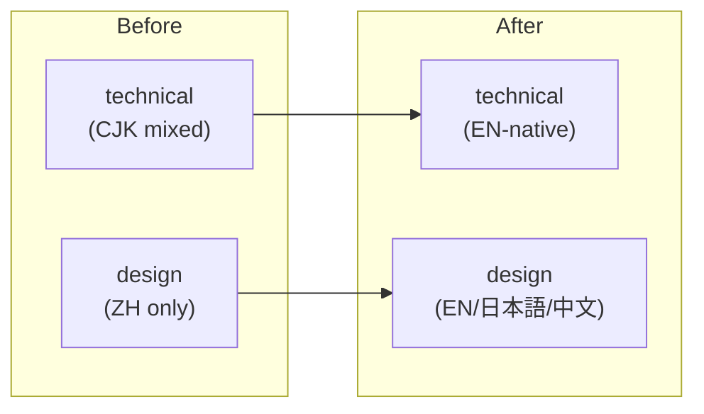

# Protocol: Composing a PR body with `## Memory` section

When you are about to open a PR (`gh pr create`), decide whether to add
a `## Memory` section on top of Claude Code's standard template.

## Step 1 — Assemble CC's standard template first

Claude Code's default `gh pr create` template is stable and should not
be modified:

```markdown
## Summary
<1-3 bullets>

## Test plan
- [ ] ...

🤖 Generated with [Claude Code]...
```

Do not rewrite, reorder, or merge memory content into `## Summary` or
`## Test plan`. The `## Memory` section is **additive**.

## Step 2 — Decide if the PR is memory-worthy

The PR-level filter is slightly different from the commit-level filter.
A PR is memory-worthy if **any** of these is true:

- The PR encodes a design decision that future readers will ask "why"
  about (scope change, tool choice, architecture adjustment, policy
  change)
- The PR discovered a non-obvious constraint or surprising behavior
  that shaped the implementation
- The PR hit gotchas worth warning future authors about
- The PR touches architecture / flow / state in a way a diagram would
  clarify

If none apply, skip `## Memory` entirely. A PR without `## Memory` is
the correct signal that the diff speaks for itself.

## Step 3 — Draft the `## Memory` section

Layout with sub-headings — omit any sub that has nothing to say.

```markdown
## Memory
### Decision
<one paragraph — core decision, alternatives referenced inline>

### Learnings
- <point 1>
- <point 2>

### Gotchas
- <trap 1>
- <trap 2>

### Architecture
<!-- only when arch/flow/state changes enough to warrant a diagram -->

```

Guidelines per sub-heading:

- **Decision**: mirrors the commit `Decision:` trailer, but can go
  longer (one paragraph) and can reference rejected alternatives as
  explicit bullets. Good Decision prose survives six months.
- **Learnings**: a bullet list — one line per learning. Each bullet
  should be specific enough to be recognized by a future reader who
  didn't live through this PR.
- **Gotchas**: a bullet list — name the trap and the correct path.
  Not "be careful with X" but "X misleading surface feature; correct
  path is Y".
- **Architecture**: a Mermaid diagram **only** when the PR changes
  architecture, data flow, or state transitions. Skip for trivial
  changes. Prefix with a one-sentence prose description so screen
  readers have context.

## Step 4 — Placement and anchoring

Insert `## Memory` **after `## Test plan`** (or after the last CC
standard section) and **before the `🤖 Generated with` footer**.

Anchor rule (for automation):

1. Search PR body for the line starting with `🤖 Generated with`
2. Insert one blank line + `## Memory` section + one blank line,
   immediately before that line
3. If the footer is absent (user has set `attribution.pr = ""`),
   append `## Memory` to the end of the body

## Step 5 — Diagram venue choice

Use the decision tree from `standards/memory-conventions.md`:

- PR body → **Mermaid** preferred (GitHub renders it natively)
- Complex diagrams (class / ER / sequence / gantt) → Mermaid only
- For very small diagrams (< 4 nodes, pure flow), ASCII also fine
  — but Mermaid is the default for PR body

## Example — a complete memory-worthy PR body

```markdown
## Summary
- Two-layer i18n split: technical EN-native, design trilingual, docs ZH
- 25 files, +2,189 / −1,775, no functional change
- Tier 1 smoke green

## Test plan
- [x] `bash -n` on all scripts
- [x] `jq empty` on all JSON
- [x] SKILL.md frontmatter validation
- [ ] Post-merge production validation on 0.5.x metrics

## Memory
### Decision
Split i18n by layer rather than one-policy-fits-all. The API surface
(enum values, scope URLs, param names) is natively English, so forcing
CJK into technical skills hurts LLM readability. The design layer,
in contrast, needs to align with the user's spoken language. These
are fundamentally different needs — hence two layers.

Rejected alternatives:
- **Full English everywhere** — loses user-language alignment in design
- **Full trilingual everywhere** — bloats technical layer, hurts LLM
  parse of API code

### Learnings
- Google Auth Platform Console (2025-01 UI refresh) localizes to
  ブランディング / 対象 / クライアント in JP — keep untranslated in
  walkthroughs so users see the same strings on-screen

### Gotchas
- `gws -s` is a service filter, not a scope specifier; use
  `--scopes=<URL>,<URL>` for scope elevation

### Architecture
Before/after layer boundary:



🤖 Generated with [Claude Code](https://claude.com/claude-code)
```

## When to skip `## Memory` entirely

- Dependency bumps (`chore(deps): bump X from 1.2 to 1.3`)
- Formatting-only PRs
- Typo fixes
- Tests-only PRs that don't change behavior
- Routine docs updates

For these, the diff and `## Summary` are sufficient signal.

## Step 6 — Confirm with user before opening

Before firing `gh pr create`, summarize the `## Memory` draft for the
user:

> "PR body includes a `## Memory` section with 1 Decision, 1 Learning,
> 1 Gotcha, and a before/after architecture diagram. OK to open?"

Adjust based on user feedback. Err on the side of less — deleting a
sub-heading is cheaper than over-drafting.
