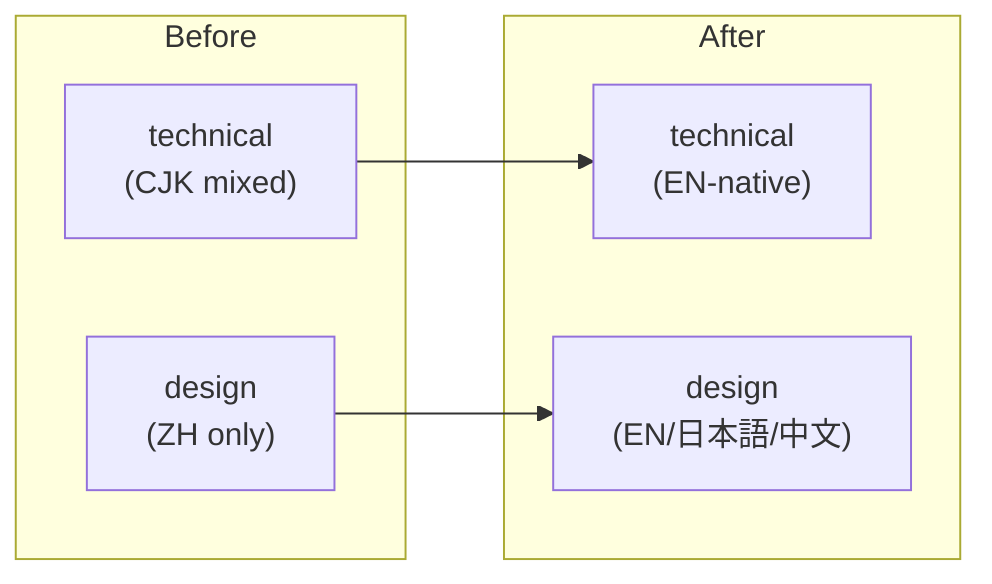

# Protocol: Composing a PR body with `## Memory` section

When you are about to open a PR (`gh pr create`), decide whether to add
a `## Memory` section on top of Claude Code's standard template.

## Step 1 — Assemble CC's standard template first

Claude Code's default `gh pr create` template is stable and should not
be modified:

```markdown
## Summary
<1-3 bullets>

## Test plan
- [ ] ...

🤖 Generated with [Claude Code]...
```

Do not rewrite, reorder, or merge memory content into `## Summary` or
`## Test plan`. The `## Memory` section is **additive**.

## Step 2 — Decide if the PR is memory-worthy

The PR-level filter is slightly different from the commit-level filter.
A PR is memory-worthy if **any** of these is true:

- The PR encodes a design decision that future readers will ask "why"
  about (scope change, tool choice, architecture adjustment, policy
  change)
- The PR discovered a non-obvious constraint or surprising behavior
  that shaped the implementation
- The PR hit gotchas worth warning future authors about
- The PR touches architecture / flow / state in a way a diagram would
  clarify

**If any apply, the PR is memory-worthy and `## Memory` is REQUIRED**
— not optional. A memory-worthy PR that closes with no `## Memory`
section (and no memory trailers on its commits) is the exact failure
this protocol exists to prevent: the substrate ships empty and the
"why" is lost.

If **none** apply, the PR is not memory-worthy — skip `## Memory`
entirely. A non-memory-worthy PR without `## Memory` is the correct
signal that the diff speaks for itself. See "When to skip" below for
the legitimate skip cases.

## Step 3 — Draft the `## Memory` section

Layout with sub-headings — omit any sub that has nothing to say.

```markdown
## Memory
### Decision
<one paragraph — core decision, alternatives referenced inline>

### Learnings
- <point 1>
- <point 2>

### Gotchas
- <trap 1>
- <trap 2>

### Architecture
<!-- only when arch/flow/state changes enough to warrant a diagram -->

```

Guidelines per sub-heading:

- **Decision**: mirrors the commit `Decision:` trailer, but can go
  longer (one paragraph) and can reference rejected alternatives as
  explicit bullets. Good Decision prose survives six months.
- **Learnings**: a bullet list — one line per learning. Each bullet
  should be specific enough to be recognized by a future reader who
  didn't live through this PR.
- **Gotchas**: a bullet list — name the trap and the correct path.
  Not "be careful with X" but "X misleading surface feature; correct
  path is Y".
- **Architecture**: a Mermaid diagram **only** when the PR changes
  architecture, data flow, or state transitions. Skip for trivial
  changes. Prefix with a one-sentence prose description so screen
  readers have context.

## Step 4 — Placement and anchoring

Two carriers land in the PR body, in this exact order — **both are
mandatory** for a memory-worthy PR:

1. **`## Memory` prose section** — inserted **after `## Test plan`**
   (or after the last CC standard section) and **before the
   `🤖 Generated with` footer**.
2. **Raw trailer footer** — a blank-line-separated raw trailer block
   (`Decision:` / `Learning:` / `Gotcha:` — unbolded, one key per
   line) as the **absolute last block in the PR body**, placed
   **after even the `🤖 Generated with` footer**. This repo's squash
   mode is `squash_merge_commit_message = PR_BODY`, so the PR body
   becomes the squash commit's message verbatim — a trailer block
   that is the message's true last block is a **precondition** for
   `%(trailers)` / `git interpret-trailers` to parse it, but not a
   guarantee: GitHub's own squash-merge UI can append a
   `---------` divider + `Co-authored-by:` block AFTER the body and
   hard-wrap long trailer lines (both live-observed on PR #576),
   which breaks the structured parse for the body's own keys even
   when the mandate above was followed correctly. Treat strict
   `%(trailers)` parsing as best-effort — the mandate's **guaranteed
   floor** is grep-level retrieval (`git log --grep`), because the
   keys still start at a line start regardless of what gets appended
   after them. **Any non-trailer line after this block — another
   heading, a stray comment, an unclosed fence — still empties
   `%(trailers)` outright** (live-found in #575, a distinct failure
   mode from #576's GitHub-appended block). This is IN ADDITION to
   the `## Memory` section, not a replacement for it. Practical tip:
   keep each trailer line short — a wrapped continuation without
   leading whitespace breaks trailer parsing too.

Anchor rule for the `## Memory` section (carrier 1 above):

1. Search PR body for the line starting with `🤖 Generated with`
2. Insert one blank line + `## Memory` section + one blank line,
   immediately before that line
3. If the footer is absent (user has set `attribution.pr = ""`),
   append `## Memory` to the end of the body

Anchor rule for the raw trailer footer (carrier 2 above):

1. After everything else is assembled (Summary, Test plan,
   `## Memory`, the `🤖 Generated with` footer), append one blank
   line, then the raw trailer block, with **nothing after it**.
2. The trailer block is blank-line-separated from the prose above
   it — not internally; its own lines run consecutively.

### Worked example — before (broken) / after (parses)

Before — the trailer block is present but is **not** the true last
block (a stray line follows it), so `%(trailers)` parses empty:

```
🤖 Generated with [Claude Code](https://claude.com/claude-code)

Decision: adopt two-layer i18n split
Learning: Google Auth Console 2025-01 UI relabels scopes

<!-- opened via gh pr create -->
```

After — the raw trailer block IS the true last block in the PR body;
nothing follows it here, so `%(trailers)` parses correctly against
this body as authored. This satisfies the mandate's guaranteed floor
(grep-level retrieval) and gives the structured parse its best shot —
but a GitHub UI squash-merge can still append its own
`---------`/`Co-authored-by:` block or hard-wrap these lines at merge
time (PR #576 live), which is outside the PR author's control; see
the caveat in `SKILL.md`:

```
🤖 Generated with [Claude Code](https://claude.com/claude-code)

Decision: adopt two-layer i18n split
Learning: Google Auth Console 2025-01 UI relabels scopes
```

## Step 5 — Diagram venue choice

Use the decision tree from `standards/memory-conventions.md`:

- PR body → **Mermaid** preferred (GitHub renders it natively)
- Complex diagrams (class / ER / sequence / gantt) → Mermaid only
- For very small diagrams (< 4 nodes, pure flow), ASCII also fine
  — but Mermaid is the default for PR body

## Example — a complete memory-worthy PR body

```markdown
## Summary
- Two-layer i18n split: technical EN-native, design trilingual, docs ZH
- 25 files, +2,189 / −1,775, no functional change
- Tier 1 smoke green

## Test plan
- [x] `bash -n` on all scripts
- [x] `jq empty` on all JSON
- [x] SKILL.md frontmatter validation
- [ ] Post-merge production validation on 0.5.x metrics

## Memory
### Decision
Split i18n by layer rather than one-policy-fits-all. The API surface
(enum values, scope URLs, param names) is natively English, so forcing
CJK into technical skills hurts LLM readability. The design layer,
in contrast, needs to align with the user's spoken language. These
are fundamentally different needs — hence two layers.

Rejected alternatives:
- **Full English everywhere** — loses user-language alignment in design
- **Full trilingual everywhere** — bloats technical layer, hurts LLM
  parse of API code

### Learnings
- Google Auth Platform Console (2025-01 UI refresh) localizes to
  ブランディング / 対象 / クライアント in JP — keep untranslated in
  walkthroughs so users see the same strings on-screen

### Gotchas
- `gws -s` is a service filter, not a scope specifier; use
  `--scopes=<URL>,<URL>` for scope elevation

### Architecture
Before/after layer boundary:



🤖 Generated with [Claude Code](https://claude.com/claude-code)

Decision: two-layer i18n split — technical EN-native, design trilingual
Learning: Google Auth Console 2025-01 UI relabels scopes in JP
```

## When to skip `## Memory` entirely

Skip **only** for non-memory-worthy PRs (the Step-2 filter found none
of its criteria). For these, `## Memory` is correctly absent:

- Dependency bumps (`chore(deps): bump X from 1.2 to 1.3`)
- Formatting-only PRs
- Typo fixes
- Tests-only PRs that don't change behavior
- Routine docs updates

For these, the diff and `## Summary` are sufficient signal. For any
memory-worthy PR, skipping is **not** an option — see Step 2.

## Step 6 — Privacy gate (fail-closed)

**Privacy gate (fail-closed).** After composing the PR body text, run
the two-layer privacy check before it is used:

1. **Layer 1 — deterministic scan.** Run
   `scripts/privacy-scan.py --text-file <composed>` (exit 0 = clean;
   exit 3 = secrets/deny-list findings printed as JSON).
2. **Layer 2 — fresh-context judge.** Dispatch a fresh-context agent
   over the same composed text per `protocols/privacy-judge-spec.md`
   (the judge SSOT: the categories it inspects, its `PASS | BLOCK`
   output schema, and its fail-closed contract). Do NOT inline the
   judge's full rubric here — point at the spec.
3. **Verdict.** Any layer-1 finding OR a layer-2 BLOCK → the PR body
   is BLOCKED: surface findings, do not proceed, escalate to the
   human.
4. **Fail-closed (explicit).** A layer-1 script error, a layer-2
   dispatch failure, or a non-conforming judge output → treat as
   BLOCK (never as PASS). This is an explicit branch, not an emergent
   default.

## Step 7 — Confirm with user before opening

Before firing `gh pr create`, summarize the `## Memory` draft for the
user:

> "PR body includes a `## Memory` section with 1 Decision, 1 Learning,
> 1 Gotcha, and a before/after architecture diagram. OK to open?"

Adjust based on user feedback. Err on the side of less — deleting a
sub-heading is cheaper than over-drafting.

## Step 8 — Verify substrate survival before the branch closes

The confirmed root cause of lost memory is **authoring-time
under-recording**: a memory-worthy PR closing with an empty
substrate (no commit trailer, no `## Memory`) and **no signal that
it's empty**. Composing the section is not enough — verify it is
actually retrievable from **both** carriers before the branch closes
/ the PR merges.

This verify is **enforced as an executable gate by
`loom-code:finishing-a-development-branch`**: its Default-flow close-out
runs `--verify HEAD` and STOPs on a memory-worthy branch whose commit
carrier is empty. The checks below describe what that gate executes.

For a memory-worthy PR (Step 2), the orchestrator runs both checks:

1. **Commit carrier** — run
   `scripts/memory-grep.sh --verify <merge-commit-or-ref>` against the
   commit that carries the memory to main (the squash/merge commit, or
   the close-out commit). It exits **0** if a
   `Decision:`/`Learning:`/`Gotcha:` trailer is retrievable from that
   ref's message body, **4** if the substrate is empty.
2. **PR carrier** — confirm the PR `## Memory` section is present
   (`gh pr view` / `memory-grep.sh` already extracts it).

An empty result — `--verify` exits **4** **and** no `## Memory`
section — is a flag to **fix before merge**, not to ignore. Re-author
the missing carrier (add the trailers and/or the `## Memory` section),
then re-run the verify. Do not close a memory-worthy branch on an
empty substrate.
