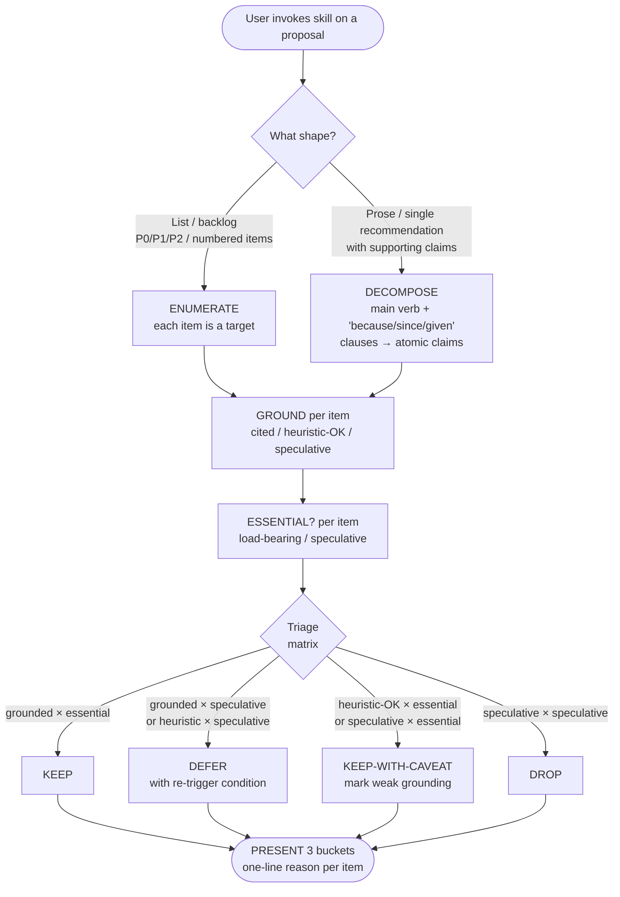

# Proposal Critique

[English](README.md) | **日本語** | [繁體中文](README.zh-TW.md)

> 複数項目の提案 — list、plan、prose 形式の推奨 — を、evidence grounding と
> YAGNI により KEEP / DEFER / DROP に振り分ける。

これはユーザーが明示的に呼び出す **gate skill** である：Claude が
複数項目の plan、backlog、prose 推奨を生成して肥大化していると
感じたとき、実行前に批判的 review pass を強制するためにこの
skill を呼び出す。

この README は GitHub でこの skill を読む人間向け。Claude が実際に
ロードする operational ファイルは [`SKILL.md`](SKILL.md)。

---

## なぜこの skill が存在するのか？

**繰り返される失敗モード**：Claude は plan を求められると、
「八方美人」な list を出す傾向がある。7 項目。検討すべき 3 つの
option。P0 / P1 / P2 の backlog が、実は「全部 ship」を優先順位の
ふりで隠したもの。多くの項目は grounding が弱く（「業界標準」
「将来への備え」）、必要性も不明（「あれば良い」）。

明示的な押し戻しがないと、これら肥大化した提案がそのまま plan に
なってしまう。

この skill は、それを捕まえる規律を凝縮したもの。各項目に対して
2 つのチェック：

1. **Evidence grounding** — その項目は出典 / 既知の失敗モード /
   測定値を引用しているか、それとも純粋な直感か？
2. **必要性（YAGNI）** — その項目は目標にとって load-bearing か、
   speculative な将来への備えか？

両方とも fail する項目は純粋な overhead。Skill は項目ごとに明示的な
verdict を強制する：**KEEP**、**DEFER**、**DROP**。

---

## どう動くのか？

### Operational flow の一覧



入力形式に関わらず flow の形は同じ — **list と prose は同じ下流の
gate に流れ込む**；異なるのは入口のステップだけ。

### Triage matrix

2 軸 3 bucket：

|                          | **Essential**（load-bearing） | **Speculative**（future-proof） |
|--------------------------|-------------------------------|---------------------------------|
| **Grounded**（cited）     | KEEP                          | DEFER                           |
| **Heuristic-OK**         | KEEP-WITH-CAVEAT              | DEFER                           |
| **Speculative**（出典なし）| KEEP-WITH-CAVEAT              | DROP                            |

- **KEEP** — そのまま ship。
- **KEEP-WITH-CAVEAT** — Ship するが、grounding が弱いことを明示的に
  記す（「n=1」「benchmark なし」）ので読者に限界が見える。
- **DEFER** — **言語化可能な re-trigger 条件**とともに記録する
  （「X が観察されたらこれをやる」）；現在の提案では出さない。
- **DROP** — 完全にカット；根底にある仮定はコストに見合わない。

#### Fall-through rule

DEFER は、verdict を変える事件を名指せる場合のみ有効。妥当な
re-trigger 条件を言語化できないなら、**DEFER は DROP に
fall-through する**。Exit 条件がなければ DEFER は「全部後で ship」
となる — まさに matrix が防ごうとする失敗モードである。

このルールは v0.1.2 で追加された。v0.1 の dogfood テストで、matrix が
妥当な re-trigger を持たない項目に対して見かけ上有効な DEFER verdict
を出した事例を捕まえたためである（「フレームワーク間比較」項目 —
framework は徐々に更新されるため、判断を変える具体的な事件はない）。
Ground truth は DROP。Fall-through rule がそのギャップを塞いだ。

### 5 ステップ gate

skill を呼び出すと、Claude は以下の順序で実行する：

1. **ENUMERATE-OR-DECOMPOSE** — 項目を列挙する。
   - List 形式の入力（番号付き backlog、P0/P1/P2）では、各項目が
     1 つの target。
   - Prose 形式の入力（アーキテクチャ決定、戦略 memo）では、
     推奨と各 supporting claim を抽出する。Heuristic：主動詞句が
     推奨；「because / since / given / so that」で導入される
     clause が supporting claim。
2. **GROUND** — 各項目を Grounded / Heuristic-OK / Speculative に
   マークする。
3. **ESSENTIAL?** — 各項目を Essential / Speculative にマークする。
4. **TRIAGE** — 上記 matrix を適用する。
5. **PRESENT** — ユーザーに 3 つの bucket と項目ごと 1 行の理由を
   提示する。

出力は元の list に verdict を inline で入れたものでは**ない** —
それはただの注釈付きドラフト。出力は**再構成された 3 つの bucket** で、
triage の決定が一目で分かる形になっている。

---

## いつ使うべきか？

### 以下の場合に呼び出す…

- 3 項目以上の推奨 / アクションの list が肥大化していて、どれが
  本当に重要か分からない
- P0/P1/P2 の backlog を見ながら、P2 のものは全部 DROP すべきでは
  と疑っている
- Prose 形式のアーキテクチャ / 戦略提案で、stress-test したい
  claim がある（「『業界標準』だけで正当化として十分か？」）
- 以下のような言葉を打った：
  - 「is this over-engineered?」
  - 「complexity audit」
  - 「業界證實了嗎」
  - 「可以簡化嗎」
  - 「what's the MVP?」
  - 「should we keep all of these?」

### 以下の場合は呼び出**さない**…

- 単純な Q&A や単一の事実回答
- typo の修正や 1 行の変更
- 内容が説明的で主張ではない（「for three reasons: …」で既存の
  挙動を説明しているのは提案ではない）
- 完了した作業が本当に done か検証したい — それは
  `superpowers:verification-before-completion` の役目
- コードレベルの簡素化が欲しい — それは Anthropic 組み込みの
  `simplify` skill の役目

---

## 出力はどんな形？

これはこの skill 自体の誕生イベントから取った実際の run。
Claude が次の 7 項目 backlog を出した：

```
1. proposal-critique skill
2. simplify-pass automation
3. evidence-grader
4. complexity-meter
5. multilingual-trigger-pack
6. backlog-formatter
7. eval-harness-extension
```

ユーザーが critique を呼び出した後、skill は次の triage を出力した：

> **KEEP**（1）
> - `proposal-critique` — evidence-grounded（過剰設計は業界既知）
>   + essential（他の項目はその前提に依存する）
>
> **DEFER**（1）
> - `evidence-grader` — heuristic + speculative；v0.1 dogfood が
>   ギャップを実証した場合のみ作る
>
> **DROP**（5）
> - `simplify-pass` — Anthropic `simplify` と冗長
> - `complexity-meter` — 既存 skill と同等
> - `multilingual-trigger-pack` — description-design.md でカバー済み
> - `backlog-formatter` — formatter ≠ critique
> - `eval-harness-extension` — speculative、まだ測定信号なし

7 項目 → 1 KEEP / 1 DEFER / 5 DROP。元の提案は 86% が overhead で、
skill がそれを捕まえた。

---

## 他の skill との関係は？

この skill は **提案テキストそのもの** を triage する。深い研究、
コードレベルの簡素化、実行検証は行わない。KEEP / KEEP-WITH-CAVEAT
項目にそれらが必要なとき、skill は他のツール名を挙げるだけで
呼び出さない：

- **`domain-teams:research-team`** — KEEP 項目の grounding が
  境界線で、一次資料による確認が欲しいとき。
- **`Anthropic simplify`**（組み込み） — KEEP 項目に含まれる
  コード自体がよりシンプルにできるとき。
- **`superpowers:verification-before-completion`** — triage
  された plan が done と宣言されようとしているとき。

組み合わせは reference によるもので、routing ではない。

---

## Origin story（およびそれが明らかにする限界）

この skill は **再帰的なプロダクト** である：単一 artifact の開発
セッション中に、Claude が 4 回過剰提案したことから生まれた。
毎回ユーザーが自然言語の押し戻し（「業界證實 嗎?」「is this
over-engineered?」）で手動 triage した。繰り返し現れた形 — 3 つの
bucket、2 つのチェック — が、この skill になった。

v0.1.0 後の最初の反復は、skill を自分の誕生 backlog に対して動かし
（1/3/3 KEEP/DEFER/DROP）、ユーザーの手動 triage（1/2/4）と比較
することから来た。Matrix が DEFER を 1 つ多く出したのは、§Common
Failures ルール「DEFER without re-trigger → DROP」が matrix 消費
時点で見えなかったため。v0.1.2 で §Fall-through rule を matrix の
直下に置き、そのギャップを塞いだ。Ship-then-test が静的 review では
捕まらないものを捕まえた。

それが強みであり限界でもある：

- **強み**：design は想像ではなく現実の失敗モードに根ざしている。
  [`SKILL.md`](SKILL.md) の最初の worked example はこの skill を
  生んだセッション**そのもの**である。
- **限界**：**n=1 の origin sample**。1 セッションは非常に小さな
  証拠基盤。Skill は `dev-workflow:skill-creator-advance` の
  [`description-design.md`](../skill-creator-advance/references/description-design.md)
  で確立された sample-size 規律に従う：empirical anchor は
  示唆的であり、権威ではない。

将来の dogfood が design を検証（または反証）する。

---

## 既知の限界

| 限界 | 意味 | 緩和策 |
|---|---|---|
| v0.1 では **user-driven only** | Claude は自身の list 形状の出力に対して skill を auto-fire しない。ユーザーが明示的に呼び出す必要がある。 | Phase 2 で ≥10 回の成功した user-triggered audit が user-driven モデルの信頼性を実証した後、auto-trigger を追加する可能性。 |
| Grounding 軸の **主観判断** | 「この evidence は十分か？」は判断であり決定論的テストではない。 | デュアル skill 構成：境界の grounding を `domain-teams:research-team` に渡して一次資料検証する。 |
| Prose 形式での **decomposition は heuristic** | atomic claim 抽出のための「main verb + because/since/given」ルールは近似であり、形式的でない。 | `SKILL.md` の Worked Example 2 がパターンを示す；複雑な prose は呼び出し前に手動 decomposition が必要かもしれない。 |
| **n=1 design sample** | 1 セッションの pattern であり、測定された業界 baseline ではない。 | `description-design.md` の規律に従い示唆的として扱う；dogfood 後に再検討。 |

---

## 今後の予定

- **Phase 2** — Claude 自身の list 形状の出力に対して
  auto-trigger（≥3 番号項目、P0/P1/P2 backlog）。
  Re-trigger 条件：≥10 回の成功した user-triggered audit
  + Claude self-fire についてのユーザー明示的要求。
- **Phase 3** — `skill-creator-advance` pattern に従う正式な
  eval harness。Re-trigger 条件：複数 repo にまたがる ≥30 件の
  triage 出力で、ground truth と比較する価値があること。
- **可能な v0.2** —
  [`commands/proposal-critique.md`](../../commands/) slash command。
  paste-and-invoke UX に需要があると示された場合（例：長い PRD）。

各 Phase には文書化された **re-trigger 条件** があるので、
作業は speculative ではない。

---

## License

MIT — [repository root LICENSE](../../../../LICENSE) を参照。

## Files

```
proposal-critique/
├── README.md           ← 本ファイル（人間向け）
├── SKILL.md            ← operational ファイル（Claude 向け）
└── evals/
    ├── trigger-eval.json   ← 16 件の trigger query（8 件 should-fire、
    │                         8 件 should-not）、run_loop.py
    │                         optimization 用にドラフト（Phase 2 に延期）
    └── body-validation.md  ← v0.1 dogfood backlog に対する gate の
                              凍結 reference run；v0.1.2 fall-through
                              rule 後の期待出力は 1 KEEP / 2 DEFER /
                              4 DROP
```

`README.md` と `SKILL.md` は読者と役目が異なる。意図的に内容を重複
させていない：`SKILL.md` は簡潔・指示的で、gate として構造化されている
（Iron Law / Gate Function / Triage Matrix）；本 README は叙述的・
説明的である。Claude は `SKILL.md` を読み、人間は本ファイルを読む。

`evals/` には test fixture が入っている。v0.1.3 までは一時的だった
（`trigger-eval.json` は private plan ファイルにあり、
`body-validation` は会話履歴と PR commit trailer にしか存在しなかった）。
ファイルとして成文化することで、将来のセッションが validation を
再実行でき、時間とともに n=1 sample を成長させられる。
