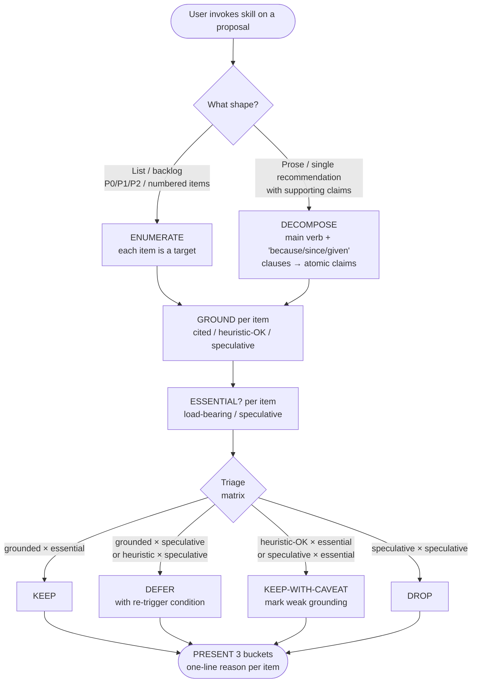

# Proposal Critique

> Triage a multi-item proposal — list, plan, or prose recommendation —
> into KEEP / DEFER / DROP via evidence grounding and YAGNI.

A user-invoked **gate skill**: when Claude has produced a multi-item
plan, backlog, or prose recommendation that feels bloated, you invoke
this skill to force a critical-review pass before acting on it.

This README is for humans reading the skill on GitHub. The
operational file Claude actually loads is [`SKILL.md`](SKILL.md).

---

## Why does this skill exist?

**The recurring failure mode**: Claude, when asked to plan something,
tends to produce charitable lists. Seven items. Three options to
consider. P0 / P1 / P2 backlogs that are really "ship everything"
disguised as priorities. Most items have weak grounding ("industry
standard", "future-proofing") and unclear necessity ("nice to have").

Without explicit pushback, those bloated proposals become the plan.

This skill captures the discipline that catches them. Two checks per
item:

1. **Evidence grounding** — does the item cite a source / known
   failure mode / measurement, or is it pure intuition?
2. **Necessity (YAGNI)** — is the item load-bearing for the goal, or
   speculative future-proofing?

Items that fail both checks are pure overhead. The skill forces an
explicit verdict per item: **KEEP**, **DEFER**, or **DROP**.

---

## How does it work?

### Operational flow at a glance



The flow is the same shape regardless of input form — **list and prose
both feed the same downstream gate**; only the entry step differs.

### The triage matrix

Two axes, three buckets:

|                          | **Essential** (load-bearing) | **Speculative** (future-proof) |
|--------------------------|-------------------------------|---------------------------------|
| **Grounded** (cited)     | KEEP                          | DEFER                           |
| **Heuristic-OK**         | KEEP-WITH-CAVEAT              | DEFER                           |
| **Speculative** (no src) | KEEP-WITH-CAVEAT              | DROP                            |

- **KEEP** — ship as-is.
- **KEEP-WITH-CAVEAT** — ship but explicitly mark the weak grounding
  ("n=1", "no benchmark yet") so the reader sees the limitation.
- **DEFER** — record with a re-trigger condition ("do this when X is
  observed"); does not ship in the current proposal.
- **DROP** — cut entirely; the underlying assumption isn't worth the
  cost.

### The 5-step gate

When you invoke the skill, Claude runs this in order:

1. **ENUMERATE-OR-DECOMPOSE** — list the items.
   - For list-shaped input (numbered backlog, P0/P1/P2), each item
     is one target.
   - For prose-shaped input (architecture decision, strategy memo),
     extract the recommendation + each supporting claim. Heuristic:
     the main verb phrase is the recommendation; clauses introduced
     by "because / since / given / so that" are supporting claims.
2. **GROUND** — mark each item Grounded / Heuristic-OK / Speculative.
3. **ESSENTIAL?** — mark each item Essential / Speculative.
4. **TRIAGE** — apply the matrix above.
5. **PRESENT** — show the user three buckets, one-line reason per item.

The output isn't the original list with verdicts inline — that's
just an annotated draft. The output is **three reorganized buckets**
that make the triage decisions visible at a glance.

---

## When should you use it?

### Invoke when...

- A list of 3+ recommendations / actions feels bloated and you're
  not sure which actually matter
- You're staring at a P0/P1/P2 backlog wondering if everything in
  P2 should actually be DROP
- A prose architecture / strategy proposal makes claims you want
  to stress-test ("Is 'industry standard' enough justification?")
- You typed something like:
  - "is this over-engineered?"
  - "complexity audit"
  - "業界證實了嗎"
  - "可以簡化嗎"
  - "what's the MVP?"
  - "should we keep all of these?"

### Don't invoke when...

- It's a simple Q&A or single factual answer
- You're fixing a typo or making a single-line change
- The content is explanatory, not advocating ("for three reasons:
  …" describing existing behavior is not a proposal)
- You're verifying that completed work is actually done — that's
  what `superpowers:verification-before-completion` is for
- You want code-level simplification — that's what Anthropic's
  built-in `simplify` skill is for

---

## What does the output look like?

Here's an actual run from this skill's own birth event. Claude
produced this 7-item backlog:

```
1. proposal-critique skill
2. simplify-pass automation
3. evidence-grader
4. complexity-meter
5. multilingual-trigger-pack
6. backlog-formatter
7. eval-harness-extension
```

After the user invoked critique, the skill produced this triage:

> **KEEP** (1)
> - `proposal-critique` — evidence-grounded (over-engineering is
>   industry-known) + essential (the others depend on its premise)
>
> **DEFER** (1)
> - `evidence-grader` — heuristic + speculative; only build if v0.1
>   dogfood proves the gap
>
> **DROP** (5)
> - `simplify-pass` — redundant with Anthropic `simplify`
> - `complexity-meter` — equivalent to existing skill
> - `multilingual-trigger-pack` — covered by description-design.md
> - `backlog-formatter` — formatter ≠ critique
> - `eval-harness-extension` — speculative, no measurement signal yet

7 items → 1 KEEP / 1 DEFER / 5 DROP. The original proposal was 86%
overhead; the skill caught it.

---

## How does it relate to other skills?

This skill triages **the proposal text itself**. It doesn't do
deeper research, code-level simplification, or execution
verification. When KEEP / KEEP-WITH-CAVEAT items need those, the
skill names other tools but doesn't invoke them:

- **`domain-teams:research-team`** — when a KEEP item's grounding
  is borderline and you want primary-source confirmation.
- **`Anthropic simplify`** (built-in) — when a KEEP item involves
  code that could itself be simpler.
- **`superpowers:verification-before-completion`** — when the
  triaged plan is about to be claimed done.

Composability is by reference, not by routing.

---

## Origin story (and the limitation it reveals)

This skill is a **recursive product**: it was born from a session in
which Claude over-proposed four times within a single artifact's
development. Each time, the user manually triaged via natural-
language pushback ("業界證實 嗎?" / "is this over-engineered?").
The recurring shape — three buckets, two checks — became this skill.

That's both the strength and the limit:

- **Strength**: the design is grounded in real failure modes, not
  imagined ones. The first worked example in [`SKILL.md`](SKILL.md)
  IS the session that produced the skill.
- **Limit**: **n=1 origin sample**. One session is a tiny
  evidence base. The skill follows the sample-size discipline
  established in `dev-workflow:skill-creator-advance`'s
  [`description-design.md`](../skill-creator-advance/references/description-design.md):
  empirical anchors are indicative, not authoritative.

Future dogfood will validate (or invalidate) the design.

---

## Known limitations

| Limitation | What it means | Mitigation |
|---|---|---|
| **User-driven only** in v0.1 | Claude doesn't auto-fire the skill on its own list-shape output. The user has to invoke it explicitly. | Phase 2 may add auto-trigger after ≥10 successful user-triggered audits prove the user-driven model reliable. |
| **Subjective judgment** on grounding axis | "Is this evidence sufficient?" is a judgment call, not a deterministic test. | Dual-skill composition: hand off borderline grounding to `domain-teams:research-team` for primary-source verification. |
| **Decomposition is heuristic** for prose shape | The "main verb + because/since/given" rule for extracting atomic claims is approximate, not formal. | Worked Example 2 in `SKILL.md` shows the pattern; complex prose may need manual decomposition before invoking. |
| **n=1 design sample** | One session's pattern, not a measured industry baseline. | Treated as indicative per `description-design.md` discipline; revisit after dogfood. |

---

## What's planned for later

- **Phase 2** — auto-trigger on Claude's own list-shape output
  (≥3 numbered items, P0/P1/P2 backlog). Re-trigger condition: ≥10
  successful user-triggered audits + user explicit request for
  Claude self-fire.
- **Phase 3** — formal eval harness following
  `skill-creator-advance` patterns. Re-trigger condition:
  ≥30 triage outputs across multiple repos worth comparing against
  ground truth.
- **Possible v0.2** —
  [`commands/proposal-critique.md`](../../commands/) slash command
  if `paste-and-invoke` UX shows demand (e.g. for long PRDs).

Each Phase has a documented **re-trigger condition** so the work
isn't speculative.

---

## License

MIT — see [repository root LICENSE](../../../../LICENSE).

## Files

```
proposal-critique/
├── README.md           ← this file (for humans)
├── SKILL.md            ← operational file (for Claude)
└── evals/
    ├── trigger-eval.json   ← 16 trigger queries (8 should-fire,
    │                         8 should-not), drafted for run_loop.py
    │                         optimization (deferred to Phase 2)
    └── body-validation.md  ← frozen reference run of the gate
                              against the v0.1 dogfood backlog;
                              expected output 1 KEEP / 2 DEFER /
                              4 DROP after v0.1.2 fall-through rule
```

`README.md` and `SKILL.md` have different audiences and different
jobs. They intentionally do not duplicate content: `SKILL.md` is
terse, instructional, and structured as a gate (Iron Law / Gate
Function / Triage Matrix); this README is narrative and explanatory.
Claude reads `SKILL.md`; humans read this.

`evals/` contains test fixtures. They were ephemeral until v0.1.3
(`trigger-eval.json` lived in a private plan file; `body-validation`
existed only in conversation history and PR commit trailers).
Codifying them as files lets future sessions re-run the validation
and grow the n=1 sample over time.
