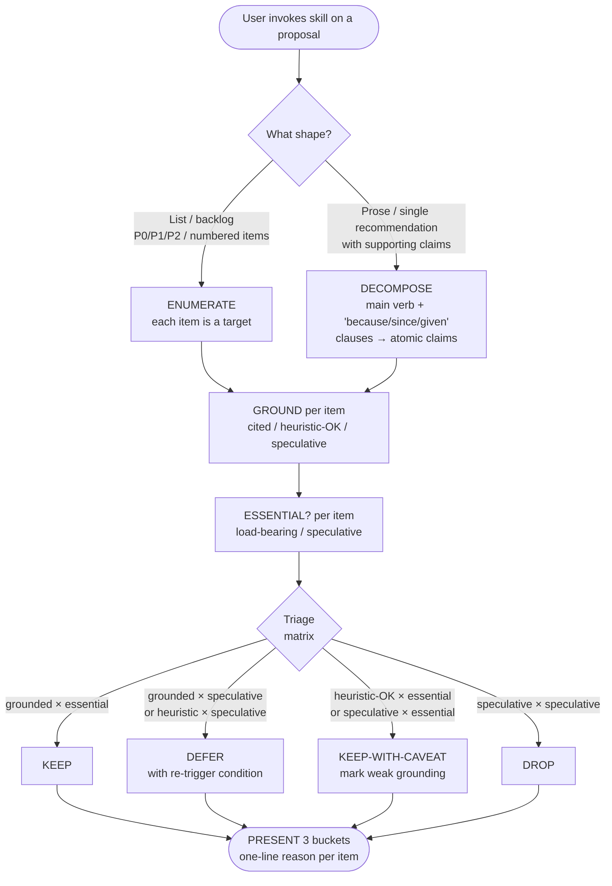

# Proposal Critique

[English](README.md) | [日本語](README.ja.md) | **繁體中文**

> 透過 evidence grounding 與 YAGNI 將多項目提案 — list、plan 或
> prose 形式的建議 — 分類為 KEEP / DEFER / DROP。

這是一個由使用者主動呼叫的 **gate skill**：當 Claude 產出了一份多項目
plan、backlog 或 prose 建議，看起來顯得臃腫時，你可以呼叫此 skill
強制在執行前進行一次批判式 review pass。

本 README 是給在 GitHub 上閱讀此 skill 的人類看的。Claude 實際載入的
operational 檔案是 [`SKILL.md`](SKILL.md)。

---

## 為什麼存在這個 skill？

**反覆出現的失敗模式**：Claude 被要求做 plan 時，傾向於產生「皆大歡喜」
的清單。七個項目。三個 option 供考慮。表面是 P0 / P1 / P2 backlog，
實際上是把「全部 ship」偽裝成「有優先順序」。多數項目的 grounding
很弱（「業界標準」「未來保留」），必要性也不明（「nice to have」）。

如果沒有明確的反向推力，這些臃腫提案就會直接成為 plan。

這個 skill 把抓取它們的紀律凝結下來。每個項目兩項檢查：

1. **Evidence grounding** — 該項目是否引用一個來源 / 已知失敗模式 /
   實測，或者只是純粹直覺？
2. **必要性（YAGNI）** — 該項目是否對目標 load-bearing，或是
   speculative 的未來保留？

兩項都 fail 的項目就是純 overhead。Skill 強制每個項目給出明確
verdict：**KEEP**、**DEFER** 或 **DROP**。

---

## 它如何運作？

### Operational flow 一覽



不論輸入形式為何，flow 形狀相同 — **list 與 prose 都餵入同一個下游
gate**；只有入口步驟不同。

### Triage matrix

兩軸三 bucket：

|                          | **Essential**（load-bearing） | **Speculative**（future-proof） |
|--------------------------|-------------------------------|---------------------------------|
| **Grounded**（cited）     | KEEP                          | DEFER                           |
| **Heuristic-OK**         | KEEP-WITH-CAVEAT              | DEFER                           |
| **Speculative**（無來源） | KEEP-WITH-CAVEAT              | DROP                            |

- **KEEP** — 直接 ship。
- **KEEP-WITH-CAVEAT** — Ship，但要明確標註其 grounding 較弱
  （「n=1」「尚無 benchmark」），讓讀者看見限制。
- **DEFER** — 連同**可言明的 re-trigger 條件**一起紀錄
  （「當觀察到 X 時再做」）；目前提案中不出貨。
- **DROP** — 整項砍掉；底層假設不值得這個成本。

#### Fall-through rule

只有當你能說出會改變 verdict 的事件時，DEFER 才有效。如果
說不出任何合理的 re-trigger 條件，**DEFER 就 fall-through 到 DROP**。
若無 exit 條件，DEFER 就變成「全部之後再 ship」 — 這正是 matrix
要防止的失敗模式。

此規則在 v0.1.2 加入，源自 v0.1 的 dogfood 測試抓到一個案例：
matrix 對某個其實沒有合理 re-trigger 的項目產出了看似有效的
DEFER verdict（一個「跨 framework 比較」項目 — framework 是
漸進更新的，沒有具體事件能改變判斷）。Ground truth 是 DROP。
Fall-through rule 修補了這個漏洞。

### 5 步 gate

當你呼叫此 skill 時，Claude 會依以下順序執行：

1. **ENUMERATE-OR-DECOMPOSE** — 列出項目。
   - 對 list 形式輸入（編號 backlog、P0/P1/P2），每個項目就是一個 target。
   - 對 prose 形式輸入（架構決策、策略 memo），抽出建議
     + 每個支持 claim。Heuristic：主要動詞 phrase 是建議；
     由「because / since / given / so that」引出的 clause 是
     supporting claim。
2. **GROUND** — 每個項目標記 Grounded / Heuristic-OK / Speculative。
3. **ESSENTIAL?** — 每個項目標記 Essential / Speculative。
4. **TRIAGE** — 套用上述 matrix。
5. **PRESENT** — 將三個 bucket 與每項一行原因呈現給使用者。

輸出**不是**原始 list 加 inline verdict — 那只是有註記的草稿。
輸出是**重組後的三個 bucket**，讓 triage 決策一目瞭然。

---

## 何時該使用？

### 在以下情境呼叫…

- 一份 3 項以上建議 / 行動的 list 看起來臃腫，你不確定哪些
  其實重要
- 你盯著一個 P0/P1/P2 backlog，懷疑 P2 的所有東西其實該 DROP
- 一份 prose 形式架構 / 策略提案做出了你想 stress-test 的 claim
  （「『業界標準』夠當理由嗎？」）
- 你打了類似這樣的話：
  - 「is this over-engineered?」
  - 「complexity audit」
  - 「業界證實了嗎」
  - 「可以簡化嗎」
  - 「what's the MVP?」
  - 「should we keep all of these?」

### 在以下情境**不**呼叫…

- 是簡單 Q&A 或單一事實答覆
- 你在修 typo 或做單行修改
- 內容是說明性的，不是在主張（「for three reasons: …」描述
  既有行為不算提案）
- 你在驗證已完成的工作是否真的完成 — 那是
  `superpowers:verification-before-completion` 的工作
- 你想要 code 層級的簡化 — 那是 Anthropic 內建的 `simplify`
  skill 的工作

---

## 輸出長什麼樣？

這是這個 skill 自己誕生事件的一次實際 run。Claude 產出了這個
7 項 backlog：

```
1. proposal-critique skill
2. simplify-pass automation
3. evidence-grader
4. complexity-meter
5. multilingual-trigger-pack
6. backlog-formatter
7. eval-harness-extension
```

使用者呼叫 critique 後，skill 產出了這個 triage：

> **KEEP**（1）
> - `proposal-critique` — evidence-grounded（over-engineering 是
>   業界已知問題）+ essential（其他項目都依賴其前提）
>
> **DEFER**（1）
> - `evidence-grader` — heuristic + speculative；只在 v0.1
>   dogfood 證實有缺口時再建
>
> **DROP**（5）
> - `simplify-pass` — 與 Anthropic `simplify` 重複
> - `complexity-meter` — 等同既有 skill
> - `multilingual-trigger-pack` — description-design.md 已涵蓋
> - `backlog-formatter` — formatter ≠ critique
> - `eval-harness-extension` — speculative，尚無實測訊號

7 項 → 1 KEEP / 1 DEFER / 5 DROP。原始提案有 86% 是 overhead；
skill 抓到了。

---

## 它與其他 skill 的關係？

這個 skill triage **提案文字本身**。它不做更深的研究、code 層級
簡化或執行驗證。當 KEEP / KEEP-WITH-CAVEAT 項目需要這些時，
skill 會點名其他工具但不主動呼叫它們：

- **`domain-teams:research-team`** — 當某 KEEP 項目的 grounding
  在邊界，你想要一手來源確認時。
- **`Anthropic simplify`**（內建）— 當某 KEEP 項目涉及的 code
  本身可以更簡潔時。
- **`superpowers:verification-before-completion`** — 當 triage 後
  的 plan 即將被宣告完成時。

可組合性是透過 reference，不是透過 routing。

---

## Origin story（以及它揭示的限制）

這個 skill 是一個**遞迴產品**：它誕生於一次 session，
在那次 session 中 Claude 在單一 artifact 開發過程中過度提案
了四次。每次使用者都用自然語言反推手動 triage（「業界證實 嗎？」
「is this over-engineered?」）。這個反覆出現的形狀 — 三個 bucket、
兩項檢查 — 變成了這個 skill。

v0.1.0 之後第一次迭代來自把 skill 對自己的誕生 backlog 跑一次
（1/3/3 KEEP/DEFER/DROP）並對照使用者手動 triage（1/2/4）。
Matrix 多產出了一個 DEFER，因為 §Common Failures 規則
「DEFER without re-trigger → DROP」在 matrix consumption 點
看不到。v0.1.2 把 §Fall-through rule 直接放在 matrix 下方，
補上這個 gap。Ship-then-test 抓到了靜態 review 抓不到的東西。

這既是強項也是侷限：

- **強項**：design 根植於真實失敗模式，不是想像出來的。
  [`SKILL.md`](SKILL.md) 中第一個 worked example 就**是**
  產出此 skill 的那次 session。
- **侷限**：**n=1 origin sample**。一次 session 是極小的證據基礎。
  此 skill 遵循 `dev-workflow:skill-creator-advance` 中
  [`description-design.md`](../skill-creator-advance/references/description-design.md)
  建立的 sample-size 紀律：empirical anchor 只是參考，不是權威。

未來的 dogfood 會驗證（或推翻）此 design。

---

## 已知限制

| 限制 | 意義 | 緩解 |
|---|---|---|
| v0.1 為 **user-driven only** | Claude 不會在自己產生 list 形狀輸出時 auto-fire 此 skill。使用者必須明確呼叫。 | Phase 2 可能在 ≥10 次成功 user-triggered audit 證實 user-driven model 可靠後，加入 auto-trigger。 |
| Grounding 軸的 **主觀判斷** | 「此 evidence 是否充分？」是判斷題，不是確定性測試。 | 雙 skill 組合：邊界 grounding 交給 `domain-teams:research-team` 做一手來源驗證。 |
| Prose 形式的 **decomposition 是 heuristic** | 「main verb + because/since/given」抽取 atomic claim 的規則是近似，非形式化。 | `SKILL.md` 中 Worked Example 2 顯示 pattern；複雜 prose 可能需要在呼叫前手動 decomposition。 |
| **n=1 design sample** | 一次 session 的 pattern，不是經量測的業界 baseline。 | 依 `description-design.md` 紀律視為參考；dogfood 後再 revisit。 |

---

## 後續規劃

- **Phase 2** — 對 Claude 自己的 list 形狀輸出 auto-trigger
  （≥3 編號項目、P0/P1/P2 backlog）。Re-trigger 條件：
  ≥10 次成功 user-triggered audit + 使用者明確要求 Claude 自我觸發。
- **Phase 3** — 依 `skill-creator-advance` pattern 建立正式
  eval harness。Re-trigger 條件：≥30 個 triage 輸出橫跨多個
  repo，值得對照 ground truth 比較。
- **可能的 v0.2** —
  [`commands/proposal-critique.md`](../../commands/) slash command，
  若 paste-and-invoke UX 顯示有需求（例如長 PRD）。

每個 Phase 都有文件化的 **re-trigger 條件**，所以後續工作不是
speculative。

---

## License

MIT — 請見 [repository root LICENSE](../../../../LICENSE)。

## Files

```
proposal-critique/
├── README.md           ← 本檔（給人類）
├── SKILL.md            ← operational 檔（給 Claude）
└── evals/
    ├── trigger-eval.json   ← 16 個 trigger query（8 個 should-fire、
    │                         8 個 should-not），為 run_loop.py
    │                         optimization 草擬（推遲到 Phase 2）
    └── body-validation.md  ← gate 對 v0.1 dogfood backlog 的
                              凍結 reference run；v0.1.2 fall-through
                              rule 後預期輸出 1 KEEP / 2 DEFER / 4 DROP
```

`README.md` 與 `SKILL.md` 的受眾與工作不同。它們刻意不重複內容：
`SKILL.md` 簡潔、指示性，並結構化為一個 gate（Iron Law / Gate
Function / Triage Matrix）；本 README 則是敘述性與說明性。
Claude 讀 `SKILL.md`；人類讀本檔。

`evals/` 收錄 test fixture。在 v0.1.3 前它們是短暫的
（`trigger-eval.json` 在私有 plan 檔中、`body-validation` 只存在於
對話歷史與 PR commit trailer）。把它們編成檔案讓未來 session 能
重新 run validation，並讓 n=1 sample 隨時間累積。
