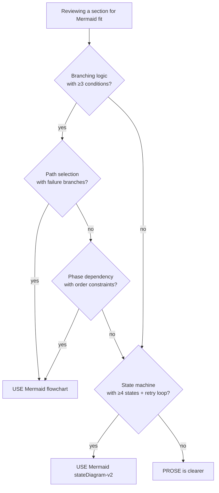

# Mermaid Usage Guidelines

When and how to use Mermaid diagrams when authoring Claude skills.
Applies to SKILL.md, protocols, reference files, and any supporting
markdown documents within a skill.

## Core Finding

Mermaid diagrams **add clarity to branching logic** but **do NOT
reduce token or line count** when paired with explanatory prose. The
value is in **eliminating prose ambiguity** — phrases like "if we
consider..." or "and in some cases..." become explicit graph branches.

**Decision criterion**: use Mermaid when your prose would have
≥3 branch conditions OR ≥4 state transitions. Below that threshold,
prose is clearer and cheaper.

## When to Use Mermaid (STRONG candidates)

- **Multi-condition decision trees**: e.g. "if input is X and context
  is Y, go path A; otherwise path B or C depending on Z"
- **State machines with retry loops**: e.g. operation states with
  retry caps, verdict transitions, lifecycle phases
- **Multi-path routing with failure branches**: e.g. "try method A;
  on failure, fall back to B; on both failing, escalate"
- **Phase-dependency diagrams**: when Phase 1 → Phase 2 order is
  load-bearing and narrative prose would obscure it
- **Cross-cutting flows touching 3+ components**: agent handoffs,
  multi-file pipelines, cross-system integration

## When NOT to Use Mermaid

- **Bibliographies / citations** — prose with dates and sources is denser
- **Rationale / anti-patterns** — Mermaid nodes can't hold the
  "because X would cause Y" reasoning
- **Example corpora** — code examples, quote collections, sample
  outputs belong in prose or code blocks
- **Philosophy or conceptual explanations** — one-page descriptions
  of an idea cannot be diagrammed without losing nuance
- **Already-clean tables** — if information is natively rows × columns,
  keep it as a table; converting loses readability
- **Single-line conditionals** — "if X then Y" is clearer as prose
- **Linear sequences without branches** — 1 → 2 → 3 is a numbered
  list, not a diagram

## Cost-Benefit Framework

Before adding a Mermaid diagram, evaluate:

| Factor | Favors Mermaid | Favors prose |
|--------|---------------|--------------|
| Branch count | ≥3 distinct conditions | 1-2 conditions |
| State count | ≥4 distinct states | ≤3 states |
| Retry loops | Present | Absent |
| Edge labels needed | ≥3 unique labels | ≤2 labels |
| Reader action | "Which path do I take?" | "What is X?" |
| Update frequency | Rarely changes | Frequently edited |
| Content in nodes | Flow concepts only | Quoted content, citations |

**Maintenance cost**: Mermaid diagrams are harder to edit
incrementally than prose. Consider this for content that will be
updated often.

## Mermaid Type Selection

| Type | Use for |
|------|---------|
| `flowchart TD` | Decision trees, routing (most common) |
| `stateDiagram-v2` | State machines with retry loops, lifecycle |
| `sequenceDiagram` | Multi-agent interaction flow (rare) |

Avoid for skill authoring:
- `flowchart LR` (horizontal) — usually worse readability in markdown
- `classDiagram` — rarely relevant for skills
- `gantt` — timelines rarely needed
- `pie` / `journey` — decorative, not structural

## Syntax Conventions

- **Labels with spaces**: use brackets directly or double-quote
  - Good: `["Phase 1: Selection"]`
  - Works: `[Phase 1: Selection]` (no special chars)
  - Quote when containing punctuation or starting with symbols
- **Line breaks in labels**: ` ` for 2-line nodes; keep each line
  under 40 chars
- **Guard / decision nodes**: diamond shape with `?` suffix —
  `{"condition?"}`
- **Terminator nodes in stateDiagram**: `[*]`
- **Edge labels**: always label non-trivial transitions
  - Decisions: `-- "yes"` / `-- "no"`
  - State transitions: `-- "trigger event"`
- **Node count**: keep ≤15-20 per diagram. If more, split into
  multiple smaller diagrams or reconsider whether Mermaid is right.

## Anti-Patterns

- **Forcing Mermaid where prose is natural** — "Step 1, then Step 2,
  then Step 3" does not need a diagram. A numbered list is better.
- **Diagrams so complex they need prose explanation** — if readers
  must read 3 paragraphs of prose to understand the diagram, the
  diagram isn't doing its job. Simplify or split.
- **Mermaid with >20 nodes** — becomes unreadable. Split into 2
  smaller diagrams or revert to prose.
- **Missing edge labels on decision branches** — at minimum use
  `-- yes` / `-- no`; complex transitions need descriptive labels.
- **Storing canonical content inside Mermaid nodes** — quotes,
  citations, code examples belong in prose/code blocks, not inside
  nodes. Nodes are for flow concepts.
- **Converting tables to Mermaid** — if the information is natively
  rows × columns, keep it as a table. Mermaid loses.
- **Duplicating the same state machine across files** — if multiple
  files show the same flow, extract to one canonical location and
  cross-reference.

## Integration with Skill Structure

- **SKILL.md body**: small flowcharts are fine; keep under 15 nodes
  to preserve SKILL.md token budget (~6,000 tokens).
- **Protocol files**: good candidates for decision-tree diagrams at
  the start of each phase.
- **Reference files** (this file's class): fine to include diagrams;
  these files are loaded on demand so size budget is looser.
- **Example / corpus files**: avoid Mermaid; these files are content,
  not flow.

## Summary Decision Rule

> Add Mermaid when prose would force the reader to reconstruct a
> branching flow from sentences. Keep prose when prose can state the
> rule plainly.
