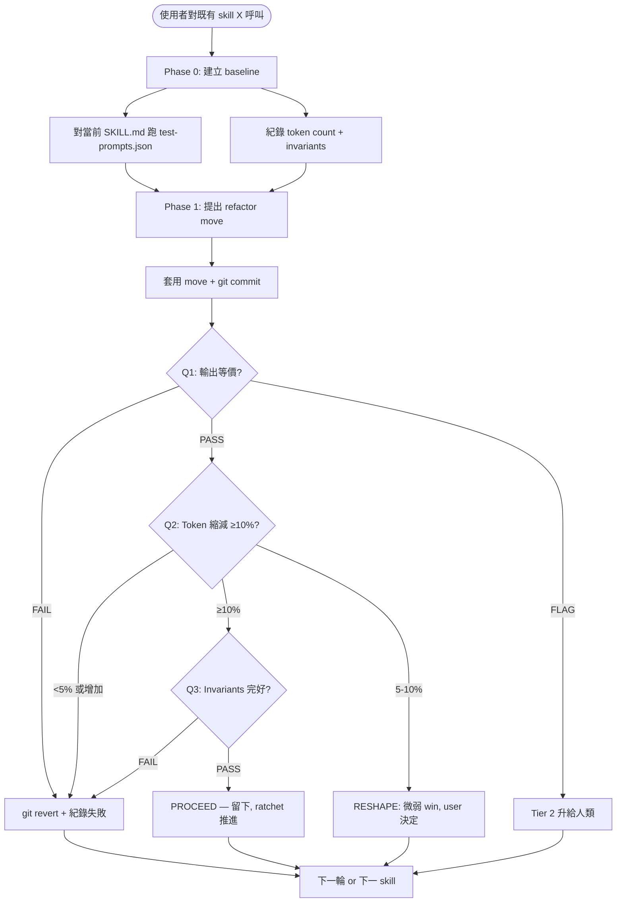

# Skill Refactor

[English](README.md) | [日本語](README.ja.md) | **繁體中文**

> 對既有 skill 進行 token / 結構重構 — 行為保留、用 multi-judge
> ensemble + 結構化比對證明等價、退步自動 git revert。

由使用者主動呼叫的 **gate skill**：當既有 skill 的 `SKILL.md` 累積
過多 token / 雜訊，想要在**不改變 skill 行為**的前提下縮短 / 整理，
呼叫此 skill。它強制把「輸出等價」當成 hard precondition，任何
token-saving 編輯需先通過等價檢查才能 commit。

本 README 給在 GitHub 上閱讀的人類。Claude 實際載入的 operational
檔案是 [`SKILL.md`](SKILL.md)。

---

## 為什麼存在這個 skill？

**反覆出現的失敗模式**：skill 會累積 token。SKILL.md 在多輪編輯
中變大。多數編輯是 additive — 補一個 corner case、加一個範例。結
果：skill 載入要的 token 比真正需要的多，輸出行為跟之前一樣
（或更差 — 長 prompt 反而稀釋 focus）。

沒有明確的 gate，每次編輯預設是 *additive*。這個 skill 把抓取
additive default 的紀律凝結，**專門處理 token / 結構工作**，並把
行為改變排除在 scope 外。

紀律是三項檢查：

1. **輸出等價** — 由 3-judge ensemble + 結構化比對證明，不是編輯者
   主張
2. **Token 縮減 ≥10%** — 美化型微調拿不到 ratchet 信用
3. **Invariants 保留** — name / dependencies / contract / 檔案結構
   不變

任一失敗 → `git revert`。**Ratchet 只能往前**。

---

## 它如何運作？

### Operational flow 一覽



### 三項檢查

| 檢查 | 機制 | 失敗 → |
|---|---|---|
| **Q1 等價性** | Layer 1 結構（決定性）+ Layer 2 LLM-judge ensemble（3 call, 不同框架）| REJECT 或 FLAG (Tier 2) |
| **Q2 Token 縮減** | `wc -w` 前後比；≥10% 門檻 | REJECT（5-10% 為 RESHAPE）|
| **Q3 Invariants** | name / dependencies / contract / 結構不變 | REJECT |

### Verdict 詞彙

跟其他 dev-workflow critique skill 平行：

| Verdict | 條件 | 動作 |
|---|---|---|
| **PROCEED** | 三項全部嚴格 pass | Ratchet 推進、commit 留下 |
| **RESHAPE** | Q2 微弱（5-10%）但 Q1+Q3 過 | 給 user 看、user 決定留或繼續 refactor |
| **REJECT** | Q1/Q2/Q3 任一失敗 | `git revert`、記 results.tsv、繼續 |
| (Tier 2) | Q1 ensemble 分歧但無明確 fail | 升給人類 review |

### Multi-judge ensemble（核心 innovation）

LLM-as-judge 有已知失敗模式（verbosity bias、position bias、
self-preference、subtle 變化不敏）。單 judge 對等價性的判斷不可靠。
此 skill 跑 3 個不同 framing 的 judge：

| Judge | Frame | 抓什麼 |
|---|---|---|
| 1 | 「對 user 是否同價值」（utility）| 結構保留 |
| 2 | 「資訊集合是否相同」（content）| 內容靜默漏失 |
| 3 | 「邊界處理是否相同」（boundary）| 失去的 fallback / warning |

加上：**specific-behavior-diff override**。單一 judge 指出**具體**
行為改變時，即使 2/3 多數說等價，也會 override 多數。這是抓「以
refactor 包裝行為改變」的關鍵。

完整 protocol：[`references/multi-judge-ensemble.md`](references/multi-judge-ensemble.md)。

---

## 何時該使用？

### 在以下情境呼叫…

- 既有 skill 的 SKILL.md 太長 / 重複 / 雜訊多，想要精簡
- 你打了類似這樣的話：
  - 「縮短這個 skill」
  - 「reduce token count」
  - 「縮減 SKILL.md」
  - 「整理 skill 結構」
  - 「保留行為的前提下 refactor」
  - 「リファクタ skill / トークン削減」
- 要 refactor 的 skill 有（或可建立）`test-prompts.json` 含 ≥3 個
  代表性 prompt
- 你**明確想要**輸出行為保留

### 在以下情境**不**呼叫…

- **Skill 輸出不好 / 錯誤** — 用 `dev-workflow:skill-tasting`
  *(可用時)* — 品質改進需人類 A/B，不是等價保留 refactor
- **想加 phase / 改 agent / 重組 workflow** — 用
  `dev-workflow:skill-creator-advance` — 結構性重寫是 feature hat
- **建立新 skill** — 用 `dev-workflow:skill-creator-advance`
- **單行 cosmetic 編輯** — 直接改；gate 成本超過改動成本
- **Skill 沒 `test-prompts.json` 且 user 不願寫** — 等價檢查無法
  跑；給 prompt 或用 `skill-creator-advance` 重設計
- **Skill 輸出是創意 / 非決定性**（寫作風格、文案、設計感受）—
  等價檢查不可靠；用 `skill-tasting`

---

## 輸出長什麼樣？

### Worked Example — skill-creator-advance 的 token 膨脹

**Input**：使用者「skill-creator-advance 已經 5627 字、嚴重超過
soft cap，refactor 一下」。

**Phase 0（baseline）**：
- 建立 `test-prompts.json`（3 個 prompt：創建 / 改進 / description
  optimization）
- 對當前 skill 跑 baseline → outputs 落 `<workspace>/baseline/`
- Token count: 5627 字
- Invariant snapshot：`name` / 依賴 / 結構紀錄下來

**Phase 1, Round 1**：
- Move：把 Description Optimization section（~700 字）抽到
  `references/description-optimization.md`
- Git commit
- Q1 ensemble：3/3 say 輸出等價（description-opt 使用情境仍
  work，因為 reference 按需載入）
- Q2：5627 → 4927 = 12.4% 縮減 ✓
- Q3：name 不變、依賴不變、結構加一個 reference 檔（被允許）✓
- **Verdict: PROCEED**

**Phase 1, Round 2**：
- Move：把兩個 phase-2 section 之間的重複文字 dedupe
- ...（類似）
- **Verdict: PROCEED**

3 round 後：5627 → 4927 → 4400 → 4100。Skill 回到 soft cap 之
下。輸出行為不變。每輪獨立驗證。

### Worked Example — 應該 REJECT 的 refactor

**Input**：使用者「我試試這個改寫 — 比較清楚」。

- Q1 結果：2/3 judges say 輸出等價；1 反對 — 「candidate 的輸出
  跳過了 baseline 會做的 file-permission 檢查」
- Q2 結果：5% 縮減
- Q3 結果：乾淨

反對 judge 的理由指出**具體行為改變**。即使 2/3 投等價，這啟動
specific-behavior-diff override。

**Verdict: FLAG → user 看反對意見**

User 檢查確認 — 是的，那個「比較清楚」的改寫漏掉了一句話，這句
話原本提醒 Claude 做 file-permission 檢查。Refactor 包裝下的細微
行為改變。

→ **REJECT 這輪、不 commit**。這是 multi-judge ensemble 存在的
理由。

---

## 它與其他 skill 的關係？

此 skill 處理 **單一既有 skill、保留行為**。需要轉手時：

- **`dev-workflow:proposal-critique`** — 多個 refactor 提案要 triage
  時，先決定哪個先做
- **`dev-workflow:complexity-critique`** — 問題是「該不該 refactor
  這個 skill」時（smallest-end-state 思考再呼叫 refactor）
- **`dev-workflow:skill-creator-advance`** — 改動是結構性的（加
  phase / 改 agent / 重設計）
- **`dev-workflow:skill-tasting`** *(可用時)* — 問題從「輸出等價
  嗎」變成「哪個輸出更好」時
- **`dev-workflow:skill-judge`** — 可選 advisory；refactor 前 / 後
  跑分；如果分數降但等價檢查持續通過，是細微 taste drift 的訊號

---

## 在 dev-workflow 中的位置

dev-workflow skill 家族目前長這樣：

```
proposal-critique  → complexity-critique → skill-creator-advance
（list/plan triage）  （單變更 gate）         （創建 + 重設計）

skill-judge          skill-refactor       skill-tasting
（advisory 評分）     （Phase A: token /    （Phase B: 輸出 A/B,
                       結構, 行為保留）       人類 judge）
                                            [PR-3 即將]
```

`skill-refactor`（Phase A）跟 `skill-tasting`（Phase B）的拆分
反映 Fowler Two Hats 套到 skill：refactor 保留行為、tasting 改變
行為。**故意分開**避免 rubric-mixing 讓 LLM-as-judge 可靠處理不了
的問題。

---

## Origin / lineage

此 skill 是 **獨立設計**，不是 port 或 fork。

「自主迴圈 + git ratchet」的概念由
[`alchaincyf/darwin-skill`](https://github.com/alchaincyf/darwin-skill)
（MIT）推廣，後者本身啟發自 Andrej Karpathy 的
[`autoresearch`](https://github.com/karpathy/autoresearch)。

**為何是獨立而非衍生**：`darwin-skill` 把結構 refactor 跟輸出品質
評估混在單一 8 維 rubric。此 skill（skill-refactor）刻意只處理
Phase A（結構 + 行為保留）；Phase B（輸出品質 A/B）是另一個獨立
skill `skill-tasting`。這個拆分避開了單一 rubric 帶 LLM-as-judge /
Goodhart drift 的問題 — 詳見
[`../../docs/skill-evolution-architecture.md`](../../docs/skill-evolution-architecture.md)
§1 的架構推理。

其他差異：3-judge ensemble + varied framing（vs 單 judge）、
specific-behavior-diff override（vs 多數決）、三項具體問題（vs
8 維加權分）、Tier 1/2/3 cascade（vs 二元 keep/revert）。

完整 design-influence 細節見 [`NOTICE`](NOTICE)。

---

## 已知限制

| 限制 | 意義 | 緩解 |
|---|---|---|
| **需要 test-prompts.json** | 沒有 ≥3 個文件化 test prompt 的 skill 跑不了 gate | Skill 自動 abort 並請 user 撰寫（或用 skill-creator-advance 重設計含 test infra）|
| **LLM-judge 不是萬無一失** | 即使 3-judge ensemble 仍可能漏失細微行為改變 | Specific-behavior-diff override + Tier 2 人類升級 +（可選）golden anchor 錨定 |
| **Token-only metric 粒度粗** | 30 行 type-system 技巧可能比 100 行直白文字密 | 10% 縮減門檻防 tiny-win refactor；實質 refactor 看得見 |
| **創意 skill 的「輸出保留」定義不清** | 寫作風格 / 散文 skill 沒有客觀「等價」 | 自動 abort 並推薦 `skill-tasting` |
| **跨輪累積 drift** | 連續 3 個 moderate-confidence PROCEED 可能複合細微 drift | 連續 3 輪 moderate-confidence 後自動 flag 累積 diff 給人類 review |
| **未經驗證即發布** | 此 skill 在 ≥2 個真實 skill 的 dry-run validation 之前 ship | 架構 doc §6 的 validation gate 為 OUTSTANDING；PR-2 在 PR description 標註此 caveat |

---

## License

MIT — 見 [`LICENSE`](LICENSE) 與 [`NOTICE`](NOTICE)（design-influence
acknowledgments）。Repository root：[`../../../../LICENSE`](../../../../LICENSE)。

## Files

```
skill-refactor/
├── README.md           ← English README
├── README.ja.md        ← 日本語 README
├── README.zh-TW.md     ← 本檔（繁體中文）
├── SKILL.md            ← operational 檔（給 Claude）
├── LICENSE             ← MIT, 獨立設計
├── NOTICE              ← 跟 darwin-skill 設計差異、inspiration
├── references/
│   ├── equivalence-check-protocol.md   ← Q1 Layer 1+2 細節
│   ├── multi-judge-ensemble.md         ← 3-judge spawn protocol
│   ├── refactor-moves-catalog.md       ← Fowler-inspired moves
│   ├── golden-anchor-protocol.md       ← 共用 convention（skill-tasting 也有）
│   ├── test-prompts-schema.md          ← 共用 convention
│   └── constitution-schema.md          ← 共用 convention
└── scripts/
    ├── equivalence_check.py            ← Layer 1 結構比對
    ├── multi_judge.py                  ← Ensemble 聚合 + consensus
    └── golden_compare.py               ← Tier 2 anchor 比對
```

## Bottom Line

行為保留、Token 縮減、Invariants 完好。否則 revert。

Ratchet 只能往前。
