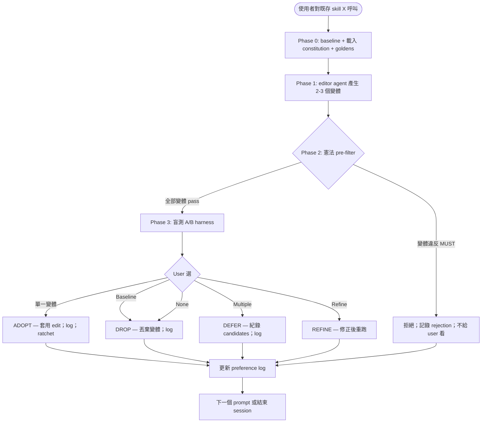

# Skill Tasting

[English](README.md) | [日本語](README.ja.md) | **繁體中文**

> 對既有 skill 進行輸出品質 A/B — 產生不同 output trait 的變體、
> 盲測呈現、捕捉使用者偏好。Constitution 是底線、taste 是上限、
> preference log 累積成 RLHF-lite dataset。

由使用者主動呼叫的 **gate skill**：當既有 skill 的輸出感覺不對 —
語氣不對、文字平、風格偏 — 想嘗試變體並選出實際更好的版本，呼叫
此 skill。它強制盲測 + 每輪人類判斷 + 持久化偏好紀錄。

本 README 給在 GitHub 上閱讀的人類。Claude 實際載入的 operational
檔案是 [`SKILL.md`](SKILL.md)。

---

## 為什麼存在這個 skill？

**反覆出現的失敗模式**：skill 輸出有 *taste-sensitive 維度*（風格、
聲音、語氣、節奏、說服力），LLM-as-judge 不可靠地評估它們。一個
「能跑」的 skill 仍可能產出平淡、語氣不對、不是 user 想要的輸出。
改善這類 skill 需要**人類偏好訊號**，不是更多規則遵循。

此 skill 是 [`skill-refactor`](../skill-refactor/) refactor hat 的
**feature hat** 對偶：refactor 保留行為（用 LLM-as-judge 驗等價，
這是 LLM 處理得好的二元檢查），tasting 刻意改變行為以找更好的輸出
（用人類判斷，因為 taste 正是 LLM-as-judge 失靈的地方）。

此分割是基礎性的。完整理由見
[`../../docs/skill-evolution-architecture.md`](../../docs/skill-evolution-architecture.md)
§1。

---

## 它如何運作？

### Operational flow 一覽



### 4 個 phases

| Phase | 機制 | 輸出 |
|---|---|---|
| **0 Baseline** | 載入 test-prompts.json + constitution.md +（選用）goldens；跑 baseline | Baseline outputs + invariants 記錄 |
| **1 變體產生** | Spawn editor subagent with feature-hat prompt；每輪產生 2-3 個變體 | 候選 SKILL.md edit 含 named dimension |
| **2 憲法 pre-filter** | 每個變體對 MUST / MUST NOT 在代表性 prompt 上測試 | 通過 / 失敗（含原因）|
| **3 盲測 A/B harness** | 隨機 label 分派；並列展示；user 選 single / multiple / none / refine | User pick + 解碼 identity |

### Verdict 詞彙

跟其他 dev-workflow critique skill 平行：

| Verdict | 條件 | 動作 |
|---|---|---|
| **ADOPT** | User 偏好非 baseline 變體 | 套用 edit；ratchet；log 偏好 |
| **DROP** | User 偏好 baseline 或全部變體更差 | 丟棄變體；保留 baseline；log |
| **DEFER** | 多個變體被偏好（無單一勝者）| 紀錄 candidates；不立即改 |
| **REFINE** | User 需要不同 test input / 變體 | 重跑；尚未決定 |
| **ESCALATE** | Multi-evaluator 分歧 >30% | 阻擋；先 human-to-human 解決 |

**沒有 auto-revert**。不像 skill-refactor（LLM equivalence check
驅動 auto-revert），skill-tasting 需要人類 ADOPT 才能 ship。沒有
人類選擇 = 沒有改動。

### 憲法判定（底線）

Skill 的 `constitution.md` 列 MUST / MUST NOT clause。違反 MUST 的
變體**在 user 看到前就被過濾** — 永遠不到 Phase 3 A/B。這保護 preference
log：每個 entry 代表純粹的 taste 訊號、不是違約訊號。

完整機制見 [`references/constitutional-judging.md`](references/constitutional-judging.md)。

### Preference log → self-trained judge（H4）

每次選擇都帶完整 context 紀錄（label 分派、被拒變體、憲法拒絕紀錄、
決策時間、user notes）。隨時間累積成 preference-pair dataset。

當單一 skill 累積 ≥1000 ADOPT entries，dataset 就是 **domain-specific
preference model** 的訓練輸入 — 一個比通用 LLM judge 更貼近 user
taste 的自訓 judge。

Pipeline **在 v1.7.0 為 scaffolded 但未啟動**。完整計畫見
[`references/self-trained-judge-pipeline.md`](references/self-trained-judge-pipeline.md)。

---

## 何時該使用？

### 在以下情境呼叫…

- Skill 輸出感覺不對 — 語氣不對、平淡、太通用
- 想試不同 phrasing / 結構 / 語氣
- 你**明確接受**輸出可能在每輪不同（這就是重點）
- 你打了類似這樣的話：
  - 「improve skill output」
  - 「A/B test variants」
  - 「改善 skill 輸出」
  - 「風格優化」
  - 「出力品質を改善」
  - 「this output isn't quite right — let me try alternatives」
- 目標 skill 有（或可建立）`test-prompts.json` +（強烈建議）`constitution.md`

### 在以下情境**不**呼叫…

- **想保留輸出行為** — 用 [`skill-refactor`](../skill-refactor/)
  （Phase A：token / 結構重構含等價性）
- **想結構性重設計**（加 phase / 改 agent）— 用
  `skill-creator-advance`
- **建立新 skill** — 用 `skill-creator-advance`
- **輸出是決定性 / 機械性的**（file transforms / JSON spec / 固定
  格式 report）— 輸出是二元對錯；沒有 taste 維度可 A/B
- **單次 vibes-check** — 別為一次性「這看起來對嗎」累積 preference
  log；直接改即可
- **Skill 既無 constitution 也無 test prompts** — gate 無法安全運行；
  推薦先做基礎工作

---

## 輸出長什麼樣？

### Worked example — 改善 status-report skill 的語氣

**Input**：使用者「status-report skill 產出乾澀、正式的散文。我想要
更溫暖、更直接的輸出，但不能失去資訊密度」。

**Phase 0**：載入 test prompt（3 個：週報 / blocker post / shipping
announcement）；載入 constitution（MUST 「含三項：shipped / in flight
/ blocked」；MUST NOT「捏造 metric」）；跑 baseline。

**Phase 1**：產生 3 個變體 —
- A：同內容、口語化語氣（縮寫、短句）
- B：列表優先、減少散文
- C：以人本故事開場、再講事實

**Phase 2**：憲法檢查 — 3 個都過（三項覆蓋、無捏造）。

**Phase 3**：盲測 A/B 隨機 label。User 選「A 或 C 都對；B 太稀疏」。

**Verdict**：DEFER（多選）— 記錄 A 與 C 為 candidates。Round 2 產
生 A/C 風格變體；user 選 A。Round 3 確認；ADOPT。

3 round 後：skill 產出溫暖且密集的 status report；preference log
有 9 個 entry；對「溫暖」在此 context 中的意義有持久化紀錄。

### Worked example — 變體被憲法拒絕

User 想對 inventory-snapshot skill 跑變體。產生的變體 C 說「我們大
約有 200 個 widget 跟幾打 sprocket...」。

Phase 2 抓到：違反 MUST「所有數量必須是 input 的精確整數」。變體 C
在 user 看到前被過濾。

通知 user：「變體 C 已產生但被拒絕，因為它估算數量（『大約 200』
『幾打』），違反 skill 的精確性需求。」

A 與 B 進到 A/B。User 選 A。

**這就是憲法作為底線**：user *可能會偏好* 的變體（更溫暖文字）被
過濾，因為違反不可妥協的精確性合約。

---

## 它與其他 skill 的關係？

- **`dev-workflow:skill-refactor`** — 姊妹 Phase A skill；保留行為、
  LLM-judge 等價；tasting 改變行為、人類 judge。可組合：先 refactor
  縮短 token，再 taste 優化品質。
- **`dev-workflow:skill-creator-advance`** — 當 tasting 顯示同形狀
  下沒有變體產出偏好輸出時，handoff 到重設計。
- **`dev-workflow:skill-judge`** — 對變體的 advisory check（advisory
  only；不懂 taste）。
- **`copywriting-toolkit:voice-anchors`** — 寫作層的對應概念；此
  skill 借鑑其策展紀律。
- **`dev-workflow:proposal-critique`** — 多個 tasting 提案要 triage 時。

---

## 在 dev-workflow 中的位置

dev-workflow skill 完整家族：

```
proposal-critique  → complexity-critique → skill-creator-advance
（list / plan         （單變更 gate）         （建立 + 重設計）
 triage）

skill-judge          skill-refactor        skill-tasting
（advisory 評分）    （Phase A: token /     （Phase B: 輸出 A/B,
                       結構, 行為保留）       人類 judge,
                                              preference log）
```

`skill-refactor`（Phase A）跟 `skill-tasting`（Phase B）的拆分是
基礎性的 — 反映 Fowler Two Hats 套到 skill：refactor 保留行為、
tasting 改變行為。把它們混在一個 skill（如 `darwin-skill` 用 8 維
rubric）會讓 LLM-as-judge 在 taste 維度不可靠。拆開讓每個工具用對
的評估機制。

---

## Origin / lineage

**獨立設計**、不是 port 或 fork。

啟發此 skill 的自主迴圈概念追溯：
- Andrej Karpathy 的 [`autoresearch`](https://github.com/karpathy/autoresearch) — 原型
- alchaincyf 的 [`darwin-skill`](https://github.com/alchaincyf/darwin-skill) — 首次套到 Claude Agent Skills

此 skill 的設計是獨立的。值得注意的差異（完整見 [`NOTICE`](NOTICE)）：

1. **Phase B 隔離** — 只處理 taste-sensitive A/B
2. **Human-in-loop 不可跳過** — 每輪必有人類選擇
3. **憲法 pre-filter** 作為底線
4. **盲測 A/B + 隨機 label** position-bias 緩解
5. **4 選項捕捉**（single / multiple / none / refine）
6. **Preference log 作 RLHF-lite dataset** 為自訓 judge 準備
7. **Self-trained judge scaffold**（H4 軌跡）
8. **沒有 auto-revert** — taste 無法可靠自動回退

---

## 已知限制

| 限制 | 意義 | 緩解 |
|---|---|---|
| **每輪需人類時間** | 每 round 需人類選擇；不能背景執行 | 每 session 上限 3-5 round；鼓勵休息；只用在高價值 skill |
| **Self-trained judge 尚未啟動** | Pipeline scaffolded 但需 ≥1000 entry 才啟動 | 持續用 LLM-judge advisory pre-filter；log 累積後再啟用 |
| **憲法檢查是二元** | 模糊 MUST 強迫主觀判斷 | 推薦把模糊 MUST 改寫為可測試規則（anti-pattern 已記錄）|
| **User taste 隨時間漂移** | 多年前偏好可能不再有效 | Time-decay weighting（規劃中）；per-skill scope 限制 cross-context drift |
| **單一 evaluator 跑法** | 一個人的 taste 不一定是團隊的 | 支援 Multi-evaluator extension；實務罕見但可用 |
| **變體產生依賴 editor agent 品質** | 爛變體 → 浪費 A/B round | 用更強的 dimension instruction 重產；擴大變體空間 |

---

## License

MIT — 見 [`LICENSE`](LICENSE) 與 [`NOTICE`](NOTICE)（design-influence
acknowledgments）。Repository root：[`../../../../LICENSE`](../../../../LICENSE)。

## Files

```
skill-tasting/
├── README.md           ← English README
├── README.ja.md        ← 日本語 README
├── README.zh-TW.md     ← 本檔（繁體中文）
├── SKILL.md            ← operational 檔（給 Claude）
├── LICENSE             ← MIT, 獨立設計
├── NOTICE              ← 跟 darwin-skill 設計差異、inspirations
├── references/
│   ├── ab-harness-protocol.md         ← Phase 3 盲測 A/B 機制
│   ├── constitutional-judging.md      ← Phase 2 pre-filter 機制
│   ├── preference-log-schema.md       ← JSONL 格式 + 保留政策
│   ├── self-trained-judge-pipeline.md ← H4 horizon scaffold
│   ├── golden-anchor-protocol.md      ← 共用 convention（functional copy）
│   ├── test-prompts-schema.md         ← 共用 convention（functional copy）
│   └── constitution-schema.md         ← 共用 convention（functional copy）
└── scripts/
    ├── ab_harness.py        ← Phase 3 盲測 A/B 編排
    ├── preference_log.py    ← JSONL append/query/aggregate
    └── judge_train_stub.py  ← H4 stub（≥1000 entry 前 fail fast）
```

## Bottom Line

```
Constitution 是底線、taste 是上限。
User 選的變體 ship；沒選的也 log 訊號。
這裡的 ratchet 是 preference log — 只會累積。
```
