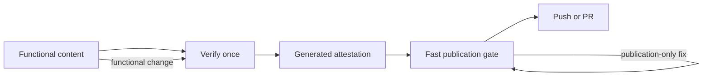

# Simplify Loom evidence gates — brief

> **Phase**: brainstorming output (`brainstorming` → `writing-plans` handoff)
> **Date**: 2026-09-08
> **Author**: Codex with kouko

## Problem

When functional behaviour has already been verified, maintainers need to publish the same functional content without repeating expensive tests and reviews merely because review metadata, commit messages, or public-facing text changed. The current close-out flow makes process bookkeeping dominate implementation time and can restart valid verification after a late publication-only failure.

## Users

- Repository maintainers using Loom across GitHub repositories — need automatic protection without hand-editing a ledger or remembering manual gates.
- Coding agents on Claude Code or Codex — need one repo-neutral contract whose evidence remains valid exactly while functional content remains unchanged.
- Reviewers — need a compact, generated record of what ran and what was reviewed, without maintaining rounds, dispatch accounting, or commit-SHA synchronization.

## Smallest End State

Loom separates functional verification from publication verification. An automatically generated attestation binds package tests, adversarial probes, and reviewer verdicts to a repo-neutral functional-content digest; unchanged functional content reuses that attestation, while any functional mutation invalidates it. A single lightweight publication hook always checks destination safety and deterministic secret scanning, invokes the semantic privacy judge only for ambiguous private-party text, and never reruns functional verification because only metadata or publication text changed. Success is demonstrated by tests for reuse, invalidation, forgery/malformed input, conditional privacy escalation, and one end-to-end dogfood run of this change; elapsed-time improvement is informative, not a release criterion.

## Current State Evidence

- **Forward**: `push` first validates the manually maintained review record, then unconditionally executes package tests and adversarial programs before allowing publication (`loom-code/scripts/loom_checker.py:3521`, `loom-code/scripts/loom_checker.py:3574`, `loom-code/scripts/loom_checker.py:3628`).
- **Reverse**: the review station creates and appends `review.json`, while Ship requires its own review-only commit at HEAD (`loom-code/skills/review/SKILL.md:57`, `loom-code/skills/review/SKILL.md:80`, `loom-code/skills/ship/SKILL.md:64`).
- **Error**: a metadata-shaped HEAD, SHA mismatch, dirty tree, or probe failure blocks the complete push path; late failures therefore occur after the record and content identities have been coupled (`loom-code/scripts/loom_checker.py:3545`, `loom-code/scripts/loom_checker.py:3605`, `loom-code/scripts/loom_checker.py:3631`).
- **Data**: the review artifact stores reviewed SHA, verdicts, probes, findings, dispatches, and process cost, with several values manually accumulated or replaced across rounds (`loom-code/contract/manifest.yaml:184`, `loom-code/contract/manifest.yaml:206`, `loom-code/contract/manifest.yaml:221`).
- **Boundary**: `[SECURITY]` commit and PR publication currently always run a deterministic secrets scan and then dispatch a fresh-context semantic privacy judge; judge failure or malformed output blocks publication (`loom-workflow/skills/git-memory/protocols/compose-commit.md:101`, `loom-workflow/skills/git-memory/protocols/privacy-judge-spec.md:17`, `loom-workflow/skills/git-memory/protocols/privacy-judge-spec.md:99`).
- **Evidence paths**:
  - `loom-code/scripts/loom_checker.py:380`
  - `loom-code/scripts/loom_checker.py:430`
  - `loom-code/scripts/loom_checker.py:3521`
  - `loom-code/scripts/loom_checker.py:3545`
  - `loom-code/scripts/loom_checker.py:3574`
  - `loom-code/scripts/loom_checker.py:3605`
  - `loom-code/scripts/loom_checker.py:3628`
  - `loom-code/scripts/loom_checker.py:3631`
  - `loom-code/scripts/loom_checker.py:3668`
  - `loom-code/scripts/loom_checker.py:4335`
  - `loom-code/scripts/loom_checker.py:4886`
  - `loom-code/contract/manifest.yaml:184`
  - `loom-code/contract/manifest.yaml:206`
  - `loom-code/contract/manifest.yaml:221`
  - `loom-code/skills/review/SKILL.md:57`
  - `loom-code/skills/review/SKILL.md:80`
  - `loom-code/skills/review/SKILL.md:391`
  - `loom-code/skills/ship/SKILL.md:64`
  - `loom-code/skills/ship/SKILL.md:196`
  - `loom-code/skills/ship/SKILL.md:221`
  - `loom-workflow/skills/git-memory/protocols/compose-commit.md:101`
  - `loom-workflow/skills/git-memory/protocols/privacy-judge-spec.md:17`
  - `loom-workflow/skills/git-memory/protocols/privacy-judge-spec.md:99`

## Decision

Keep one automatic publication interception point but replace the old ledger-shaped push contract with a generated content attestation and a fast publication gate. Reuse the existing Git tree plumbing as the basis for a functional digest, generalized through manifest-declared publication-only paths rather than a monkey-skills path list. `finalize-review` will generate the attestation from actual checker-owned executions and structured reviewer inputs; the publication gate will recompute the digest and accept only a complete, well-formed matching attestation. We will delete the review-only commit, exact-SHA, dispatch-accounting, append-only-round, and unconditional replay mechanisms in the same change. The trade-off is explicit: local attestations protect against accidental drift and stale evidence, not a malicious repository author who can rewrite both repository code and history; independent CI remains the external trust boundary.

## Out of Scope

- Replacing GitHub CI or cryptographically signing provenance with a remote identity service.
- Changing how many reviewers or adversarial cases a risk lane requires.
- Redesigning intent, spec, or plan interviews beyond removing references to obsolete close-out bookkeeping.
- Modifying unrelated repository hooks such as language anchoring or skill-folder validation.
- Migrating frozen historical Loom records.

## Alternatives Considered

1. **Keep `review.json` and merely exempt more files from its digest** — rejected because it retains manual rounds, dispatch accounting, commit shape, and replay costs.
2. **Cache passing commands only in `.git/loom/`** — rejected because the evidence would not travel with the branch and reviewers or CI could not inspect it.
3. **Remove the publication hook entirely** — rejected because it shifts destination and secret safety back to human memory and makes the workflow easier to bypass accidentally.

## What Becomes Obsolete

- The manually accumulated `review.json` schema and template; a generated `attestation.json` becomes the per-change verification record.
- `push.review-only-head`, `push.reviewed-sha`, `push.dispatch-covers-tasks`, and `review.round-append-only`.
- Probe records pinned to commit SHAs and unconditional suite/probe replay during publication.
- The Ship nit-batch confirmation round and review-only checkpoint commit.
- Mandatory fresh-context privacy judging for obviously public or non-identifying publication text.
- Per-worktree Loom checker scaffolding and its hook-firing ledger as a Loom prerequisite; the installed plugin hook is the supported publication entry point.

## Open Questions

None.

## Diagrams

The key is that publication edits loop only through the fast gate; functional edits invalidate the attestation and return to verification.

