# Proposal — docs review baseline

Status: ratified — kouko, 2026-08-31

> no PRINCIPLES — spec is unconstrained. The repository's standing on-ramp
> choice sends Loom-family arcs directly forward without a project
> `PRINCIPLES.md`; the ratified discovery artifacts remain the intent source.

Seed:
[`docs/loom/discovery/2026-08-31-docs-review-cost/user-insights.md`](../discovery/2026-08-31-docs-review-cost/user-insights.md)
N1–N3, ratified 2026-08-31.

## USM backbone

| Step | Actor | Journey action | Objects / CTA | Provenance |
|---|---|---|---|---|
| 1 | Maintainer | Select historical review cases whose source snapshots and expected consequential findings can be inspected | Corpus case / nominate | inferred |
| 2 | Maintainer | Label each expected finding and record why it is load-bearing or non-blocking | Oracle revision / draft | seeded |
| 3 | Maintainer | Ratify and freeze the first oracle revision; later corrections create a new revision | Oracle revision / ratify | seeded |
| 4 | Baseline operator | Bind a corpus revision, reviewer contract version, the resolved weak-model execution profile, and immutable artifact snapshot into a run | Review run / prepare | seeded / inferred |
| 5 | Reviewer runtime | Review the bound artifact and return a verdict plus located findings | Review run / execute | seeded |
| 6 | Baseline operator | Normalize returned findings and match them to the ratified oracle without overwriting raw output | Finding observation / classify | inferred |
| 7 | Baseline operator | Compute finding rate, false-alarm rate, repeat-run agreement, elapsed time, available usage, and cost per load-bearing finding | Metric report / calculate | seeded |
| 8 | Maintainer | Inspect evidence limitations and decide whether the next arc should improve authoring, reviewer behavior, or neither | Baseline report / decide | seeded |

Navigation graph (stage ids refer to the table above):

| From | Edge | To | Required journey reaction | Provenance |
|---|---|---|---|---|
| 1 | forward | 2 | Preserve the nominated artifact snapshot and evidence locators | inferred |
| 2 | back | 1 | Return an unsupported case to nomination without publishing an oracle | inferred |
| 2 | forward | 3 | Present the full draft oracle for human ratification | seeded |
| 3 | back | 2 | Create a new draft revision; never mutate a frozen revision | seeded |
| 3 | forward | 4 | Bind the ratified corpus revision into a new run | inferred |
| 4 | abandon | 3 | Record no run result; leave the frozen corpus unchanged | inferred |
| 4 | forward | 5 | Dispatch a scored run only when every immutable binding, including exact host and model identity, is available | seeded / inferred |
| 5 | error_escape | 4 | Preserve the failed attempt and allow a new run rather than rewriting it | inferred |
| 5 | forward | 6 | Store raw reviewer output before normalization | inferred |
| 6 | retry_self | 6 | Correct classification as a new attribution revision with provenance | inferred |
| 6 | forward | 7 | Calculate only metrics whose denominators are present | seeded |
| 7 | back | 4 | Add a repeat run against the same frozen corpus and reviewer configuration | seeded |
| 7 | forward | 8 | Present metrics together with unknown and invalid-run counts | inferred |
| 8 | resume_reenter | 4 | A later comparison resumes by creating new runs against an explicit frozen corpus revision | inferred |

## OOUX object model

### 物件清單

| 物件 | 職責與承重 attributes | 合法 CTA | Provenance |
|---|---|---|---|
| `CorpusCase` | 一個可重播的歷史文件案例；保存 `case_id`、immutable artifact snapshot、digest、source/evidence locators、eligibility reason | nominate、substantiate、exclude、retire | seeded / inferred |
| `DocumentRevision` | 可重建的文件版本與 parent/diff lineage；保存 snapshot digest、authoring/remediation event、stage actor 與 evidence bundle | capture、link parent、verify diff、inspect lineage | critic-found |
| `OracleRevision` | 某 case 的人工答案版本；保存 expected findings、load-bearing/non-blocking label、rationale、evidence locator、ratifier、digest、parent revision | draft、edit draft、ratify、draft correction、compare | seeded / inferred |
| `CorpusRevision` | 一份不可變考卷 manifest；每個 binding 固定 case snapshot digest 與一個 ratified oracle revision | derive draft、bind、validate、ratify、inspect history | inferred |
| `ReviewerContractRevision` | 不可變的 review instructions/contract；保存 content digest、owner、parent、change reason 與 required execution boundary | draft、ratify、bind、derive correction、compare | critic-found |
| `ReviewerRuntimeRevision` | 不可變的 skill/package/runtime implementation 身分；保存 package digest、owner、parent、change reason 與 host compatibility | draft、ratify、bind、derive correction、compare | critic-found |
| `CampaignPolicyRevision` | 本次實驗的資料、權限、獨立性、弱模型、工具邊界與資源上限；保存 ratifier 與 digest | draft、ratify、authorize、deny、derive correction | critic-found |
| `ClassificationDecision` | 某 snapshot 在某 campaign policy 下的資料分類與 handling-basis 決定；保存 classifier、approver、allow/deny、evidence digest | draft、approve、deny、supersede | critic-found |
| `ReviewRun` | 對固定 corpus revision、artifact snapshot 與 reviewer configuration 的單次不可改寫 attempt；保存 weak execution tier、host、exact model id、effort、raw output、elapsed/usage availability、failure | prepare、dispatch、capture、fail、normalize、repeat | seeded / inferred |
| `FindingObservation` | 從一個 run 的 raw output losslessly 擷取出的 reviewer observation；保存 raw span/hash 與 reviewer-stated fields | capture、inspect | seeded / inferred |
| `AttributionRevision` | 對 observation 的人工 matching、classification 與 defect-origin 解讀；保存 oracle binding、rationale、unknown/disputed 狀態與 parent revision | draft、ratify、draft correction、compare | seeded / inferred |
| `MetricReport` | 對一組可比較 runs 的不可變量測快照；每項 metric 保存 value/null、numerator、denominator、availability 與排除原因 | prepare、validate、calculate、freeze、compare | seeded / inferred |
| `PopulationManifest` | report 計算前原子凍結的 runs/observations/attributions/parser/metric-definition 集合；保存 canonical digest | enumerate、validate、freeze、bind report | critic-found |
| `AuditEvent` | 不可覆寫且不複製敏感 payload 的 actor/action/target/policy/outcome 記錄 | append、inspect under authority | critic-found |

### CorpusCase

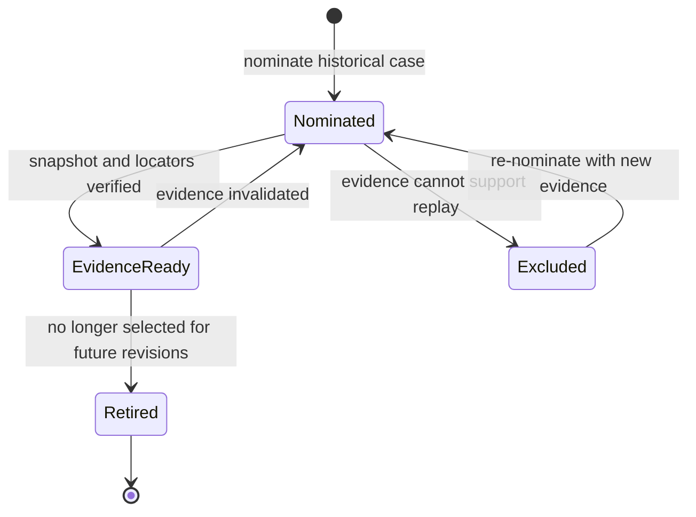

- `EvidenceReady` does not mean scoreable: a ratified `OracleRevision` and a
  ratified `CorpusRevision` binding are separately required. (inferred)
- A path, branch head, or audit narrative without recoverable artifact bytes is
  not an immutable snapshot and cannot enter a scored corpus. (inferred)
- Retirement removes future eligibility but never deletes historical bindings.
  (inferred)

### DocumentRevision

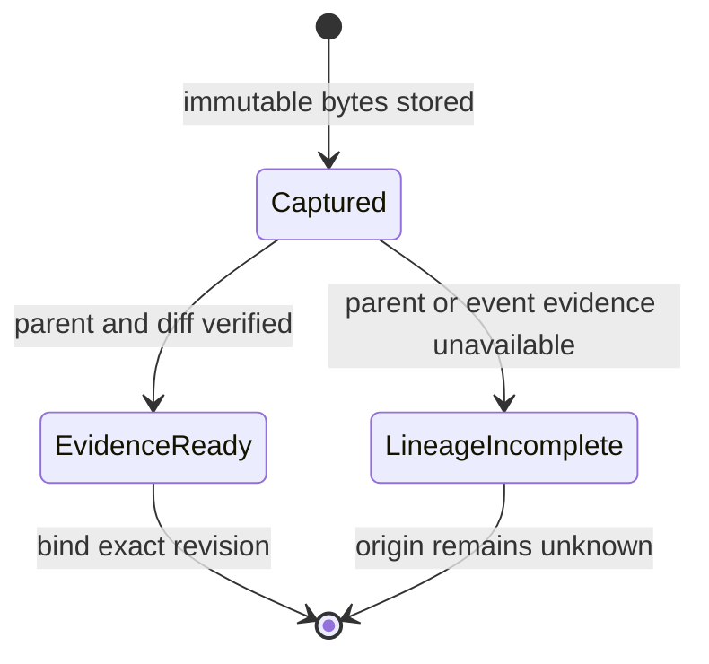

- `initial-writing` and `fix-introduced` are ratifiable only from an inspectable
  revision chain; a final snapshot alone cannot establish causation.
  (critic-found: missing-object lens)
- A remediation event records the before/after digests, responsible pipeline
  stage, actor role, and supporting diff without claiming intent from a diff
  alone. (critic-found: missing-object lens)

### OracleRevision

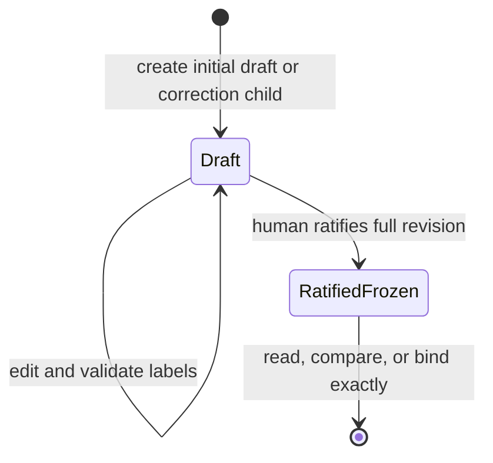

- `RatifiedFrozen` is terminal. Any correction creates a child `Draft` with a
  reason; no field, locator, digest, or label is changed in place. (seeded)
- A run binds an exact revision id, never `latest`. (inferred)
- Ratification requires immutable snapshot identity plus a rationale and
  evidence locator for every load-bearing expected finding. (inferred)

### CorpusRevision

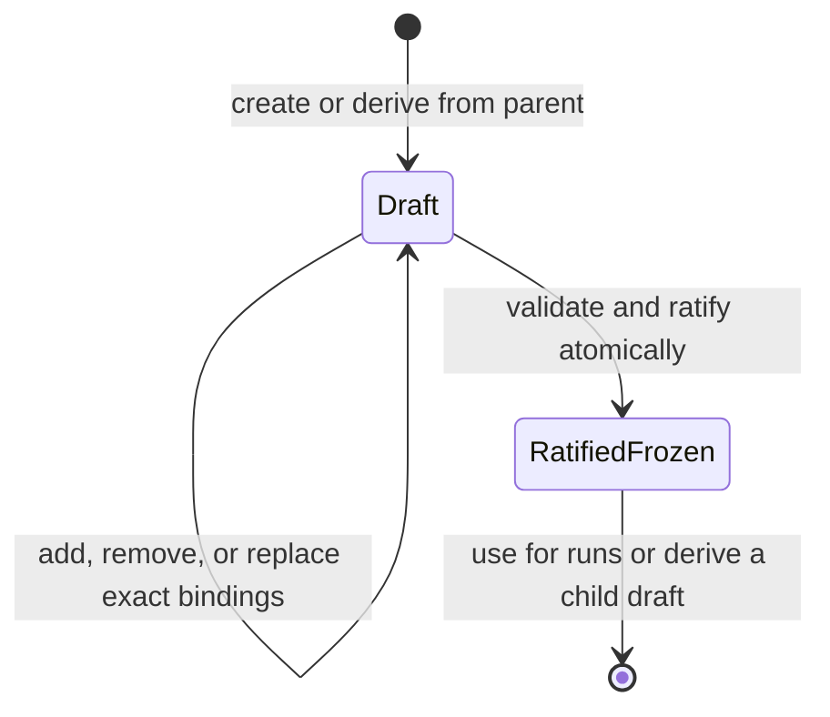

- Each binding is `(case_id, snapshot_digest, oracle_revision_id)` and each
  case appears at most once. (inferred)
- Every oracle must be ratified and must describe the same snapshot digest.
  (inferred)
- The canonical manifest ordering, digest algorithm, and serialization version
  are recorded so the manifest digest can be recomputed. (inferred)

### ReviewRun

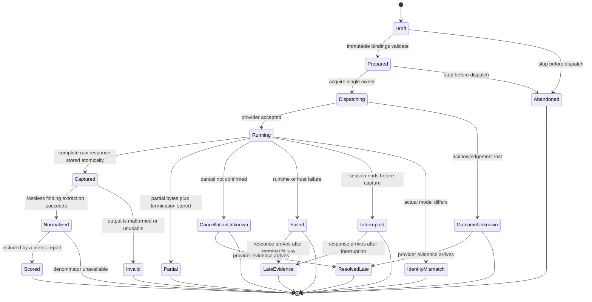

- Core bindings are corpus revision, artifact snapshot, reviewer contract,
  execution tier, host, exact resolved model id, requested effort, and
  configuration fingerprint. After dispatch they never change. (seeded / inferred)
- The initial baseline uses the repository's `economy` profile: currently
  Claude Code `haiku` and Codex `gpt-5.6-luna`, both at low effort. The profile
  is resolved live before dispatch and the exact result is recorded, because
  these host mappings may change. (seeded / observed 2026-08-31)
- A run whose host or exact model identity is `unknown` remains an attempted
  run but is not scoreable or comparable. Elapsed time and usage may still be
  explicit `unknown`; zero and empty string never substitute for unknown.
  (seeded / inferred)
- Failure, interruption, and malformed output remain attempts; they never mean
  zero findings. Retrying creates a new run id. (inferred)
- Dispatch ownership is single-winner. Partial, late, acknowledgement-unknown,
  cancellation-unknown, and identity-mismatch outcomes never overwrite another
  terminal attempt or enter metrics implicitly. Raw bytes, completeness, digest,
  and state are captured crash-safely. (critic-found: state + system lenses)
- Ownership takeover uses a higher fencing generation; a stale owner cannot
  dispatch or commit provider acknowledgement after revival. (critic-found:
  targeted system round 2)
- Identity mismatch is an eligibility outcome layered on crash-safely captured
  bytes, not a reason to discard or pretend no response existed. (critic-found:
  targeted state round 2)
- This baseline arc measures whole-artifact reviewer runs only; production
  post-fix confirmation orchestration is out of scope. (inferred, pruned)

### ReviewerContractRevision

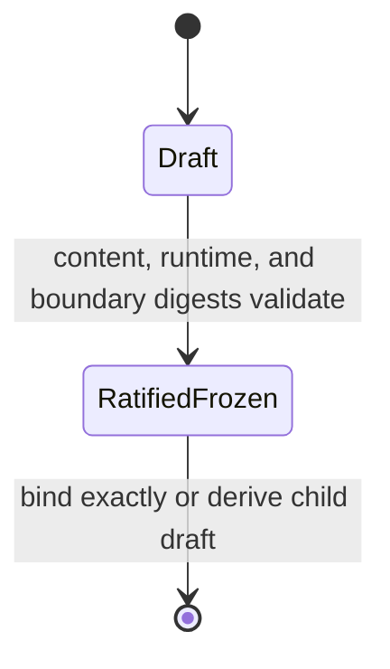

- Review instructions are versioned independently from their runtime
  implementation. Any contract change separates repeatability cohorts.
  (critic-found: missing-object lens)
- Artifact text is always untrusted content. Corpus-external files, tools,
  network, and connectors are denied unless both contract and campaign policy
  explicitly permit them. (critic-found: NFR + policy lenses)

### ReviewerRuntimeRevision

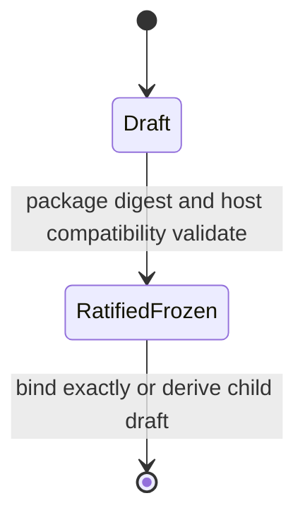

- Skill/package/runtime changes create a new runtime revision even when contract,
  model, and effort stay fixed; such runs cannot share a repeatability cohort.
  (critic-found: targeted missing-object round 2)

### CampaignPolicyRevision

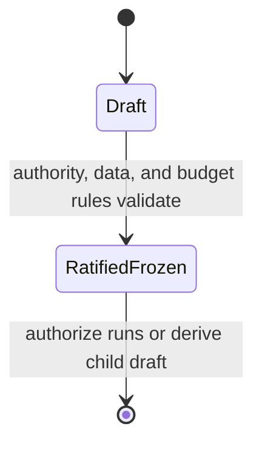

- The policy freezes the economy-profile rule, admissible data classes, actor
  authority, ratifier independence, execution boundary, and finite campaign/run
  limits. It is an experiment manifest, not a request to build a general RBAC
  platform. (critic-found: NFR + policy lenses)
- An unknown or unapproved security, rights, permission, model, or budget input
  blocks scored dispatch; it does not become an optimistic default.
  (critic-found: NFR + policy lenses)

### ClassificationDecision

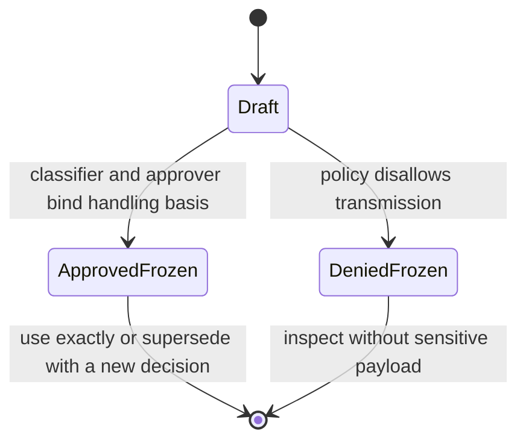

- Campaign-wide admissibility does not classify an individual snapshot. Every
  transmitted digest needs its own decision under the exact policy revision.
  (critic-found: targeted missing-object round 2)

### FindingObservation

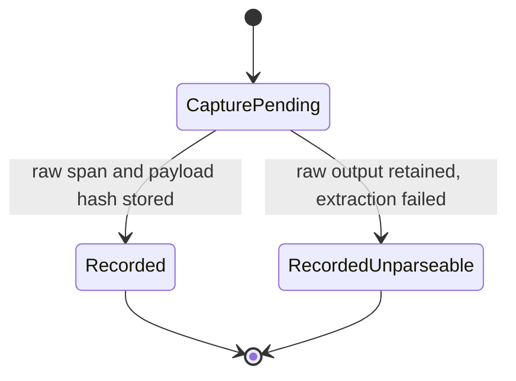

- Recorded observations are immutable and point back to immutable raw output.
  A parser correction creates a replacement observation with an explicit
  relation; it never overwrites the original. (inferred)
- Reviewer wording, cited location, severity, and verdict are preserved as
  observations, not accepted as ground truth. (seeded)

### AttributionRevision

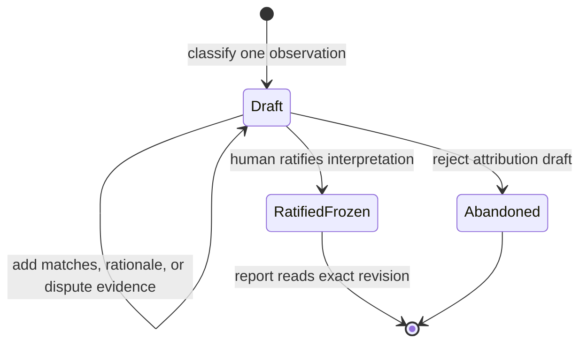

- Matching is many-to-many: one observation may partially cover several oracle
  findings, and repeated observations may match one oracle finding. (inferred)
- `unknown` means evidence is insufficient; `disputed` means concrete
  interpretations conflict. Neither enters precision or false-alarm
  denominators. (inferred)
- `unmatched` is not automatically a false alarm: it may be a real oracle escape,
  an unscorable claim, or a new defect. (inferred)
- Corrections create a child revision bound to the same observation and explicit
  corpus/oracle versions. (seeded / inferred)

### PopulationManifest

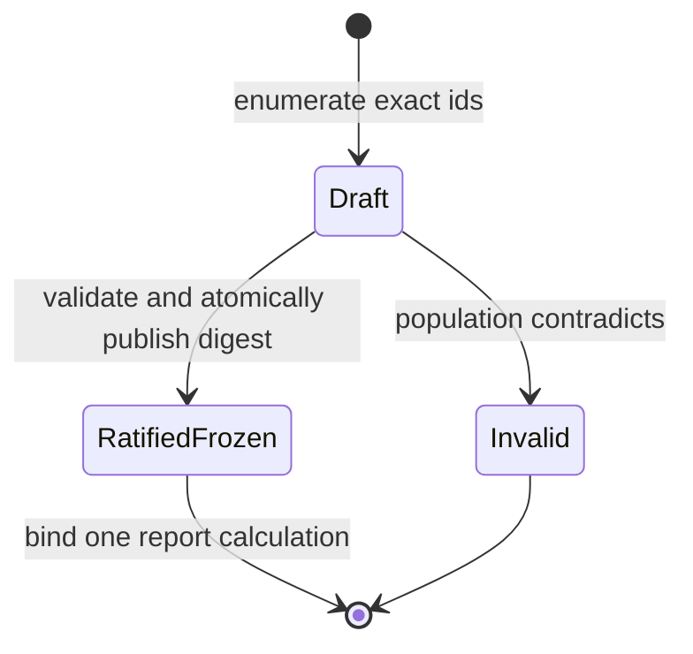

- A report id accepts one complete manifest digest. Crash residue is unreadable;
  a different population requires a new report id. (critic-found: targeted
  state + system round 2)

### AuditEvent

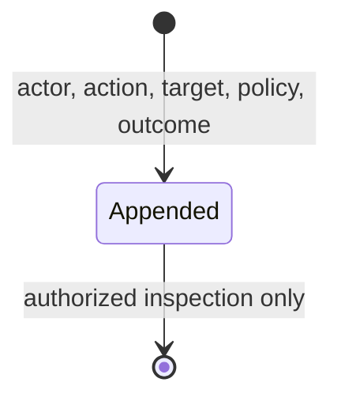

- Events are append-only and identify governed actions without copying artifact,
  raw-output, credential, or other sensitive payload. (critic-found: targeted
  missing-object round 2)

### MetricReport

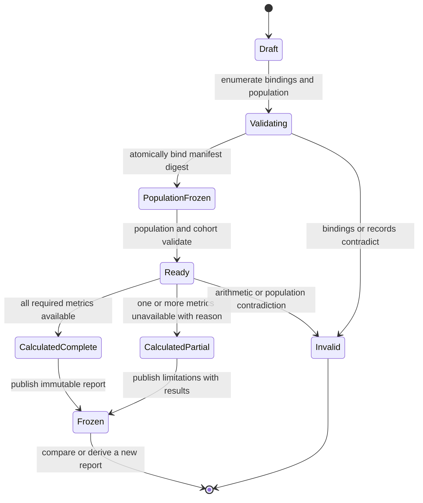

- A report binds one corpus revision, reviewer contract/configuration, metric
  definition version, included run ids, and exact attribution revisions.
  (inferred)
- Calculation starts only after one atomically published `PopulationManifest`
  wins for the report id; a partial or conflicting manifest is unreadable, and
  another population requires a new report id. (critic-found: state + system
  targeted round 2)
- Every metric is a record containing `value | null`, numerator, denominator,
  `calculated | unavailable | invalid`, and a reason. Missing or zero
  denominators never become `0%`, `100%`, or `NaN`. (seeded / inferred)
- Failed, abandoned, invalid, unknown, disputed, and unparseable populations are
  counted visibly even when excluded from a metric. (seeded)
- Elapsed and usage are summarized only over the population where each is
  available; units are never mixed. (seeded / inferred)

### Relations

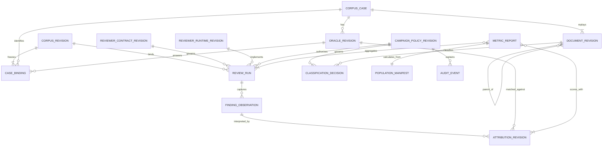

跨物件不變式：

1. A report never resolves a floating latest corpus, oracle, attribution, or
   metric definition. (inferred)
2. Raw output, frozen revisions, and frozen reports are append-only history;
   correction means a new related object. (seeded / inferred)
3. A repeatability cohort requires byte-identical corpus manifest and reviewer
   configuration fingerprints plus identical host, exact model id, execution
   tier, and requested effort. The initial baseline requires at least two
   independent runs in each Claude-economy and Codex-economy cohort.
   (seeded / inferred)
4. No derived classification or metric may rewrite the run or oracle that it
   interprets. (seeded)

## Path × edge matrix

| Backbone step | Object | CTA | State | Lens verdict | Expected reaction |
|---|---|---|---|---|---|
| 1 | CorpusCase | nominate | no immutable snapshot | flag — state legality / NFR | Keep the nomination out of scored corpus and name the missing replay evidence. (inferred) |
| 1 | CorpusCase | nominate | immutable snapshot + inspectable locators | keep — CRUD | Create an evidence-ready case with a recomputable digest. (inferred) |
| 1 | DocumentRevision | verify origin lineage | parent revision or remediation diff unavailable | flag — state legality | Keep the case scoreable for reviewer quality but force defect origin to `unknown`. (critic-found) |
| 2 | OracleRevision | draft | no expected findings | keep — empty boundary | Allow a negative-control draft, but require an explicit rationale before ratification. (inferred) |
| 3 | OracleRevision | ratify | complete draft | keep — state legality / permissions | Record named human ratification and freeze the revision digest. (seeded) |
| 3 | OracleRevision | edit | ratified frozen | flag — state legality | Refuse mutation and create a correction child draft. (seeded) |
| 3 | CorpusRevision | ratify | oracle/snapshot digest mismatch | flag — state legality | Refuse ratification and name every mismatched binding. (inferred) |
| 3 | CorpusRevision | ratify | one or more valid bindings | keep — BVA / CRUD | Atomically freeze a non-empty, deterministically ordered manifest. (inferred) |
| 4 | ReviewRun | prepare | economy profile resolves to exact host/model/effort; elapsed or usage unknown | keep — empty boundary | Permit the scored run; record exact execution identity and explicit unknown cost telemetry. (seeded / inferred) |
| 4 | ReviewRun | prepare | host or exact model identity unknown | flag — state legality | Preserve an attempted-run identity if allocated, but refuse scored dispatch and cohort membership. (seeded / inferred) |
| 4 | CampaignPolicyRevision | authorize | data class, actor authority, execution boundary, or finite budget unresolved | flag — permissions / NFR | Refuse scored dispatch and name the unresolved policy input without exposing sensitive content. (critic-found) |
| 4 | ReviewRun | prepare | core binding missing or floating latest | flag — state legality | Refuse dispatch; no run result is created. (inferred) |
| 5 | ReviewerContractRevision | execute | artifact contains runtime-like instructions | keep — permissions / NFR | Treat them as untrusted review content and deny actions outside the frozen execution boundary. (critic-found) |
| 5 | ReviewRun | dispatch | prepared | keep — state legality | Persist the attempt identity before invoking the reviewer. (inferred) |
| 5 | ReviewRun | dispatch | concurrent executors or acknowledgement loss | flag — state legality / NFR | Select one dispatch owner; preserve an outcome-unknown attempt rather than blind retry. (critic-found) |
| 5 | ReviewRun | capture | reviewer returns output | keep — CRUD | Store raw bytes and hash before parsing findings. (seeded) |
| 5 | ReviewRun | capture | partial, late, or identity-mismatched output | flag — error / NFR | Preserve bytes and exact terminal semantics; exclude until an explicit eligibility rule permits scoring. (critic-found) |
| 5 | ReviewRun | fail | runtime, quota, timeout, or host failure | keep — error | Preserve failure and any resource telemetry; never synthesize zero findings. (inferred) |
| 5 | ReviewRun | normalize | malformed output | flag — error | Mark the run invalid while retaining raw output; exclude it visibly from quality metrics. (inferred) |
| 6 | FindingObservation | capture | parseable finding | keep — CRUD | Store raw text, span, payload hash, and reviewer-stated fields losslessly. (seeded) |
| 6 | FindingObservation | capture | unparseable segment | keep — error | Preserve an unparseable observation count rather than dropping it. (inferred) |
| 6 | AttributionRevision | classify | exact/partial oracle match | keep — state legality | Record match relation, rationale, origin, and exact oracle revision. (inferred) |
| 6 | AttributionRevision | classify | unmatched observation | flag — state legality | Require adjudication among new true defect, false alarm, oracle escape, unscorable, or unknown. (inferred) |
| 6 | AttributionRevision | classify | disputed evidence | keep — permissions | Preserve both interpretations and exclude the item from precision denominators until ratified. (inferred) |
| 6 | AttributionRevision | correct | ratified attribution | flag — state legality | Create a child revision; do not rewrite the old classification. (seeded) |
| 7 | MetricReport | calculate finding rate | expected load-bearing denominator present | keep — BVA | Store matched/expected numerator and denominator with the value. (seeded) |
| 7 | MetricReport | calculate false-alarm rate | classifiable observation denominator present | keep — BVA | Exclude unknown/disputed items and show their counts separately. (seeded / inferred) |
| 7 | MetricReport | calculate repeat agreement | fewer than two comparable valid runs | flag — BVA | Mark agreement unavailable; never infer stability from one run. (inferred) |
| 7 | MetricReport | calculate repeat agreement | two or more corpus/config/host/model/effort-identical runs | keep — NFR | Compare normalized finding identities and expose the formula/version. (seeded / inferred) |
| 7 | MetricReport | compare weak hosts | two valid same-corpus cohorts, each with at least two repeats | keep — BVA / NFR | Report each host cohort separately before any cross-host comparison; never pool repeats. (seeded / inferred) |
| 7 | MetricReport | calculate cost | elapsed or usage unavailable | keep — empty boundary | Mark only the affected cost metric unavailable; keep other valid measures. (seeded) |
| 7 | MetricReport | aggregate usage | incompatible units/providers | flag — NFR | Refuse addition across units and report each availability population separately. (inferred) |
| 7 | MetricReport | freeze | some metrics unavailable with reasons | keep — state legality | Publish a partial report containing all populations and limitations. (seeded) |
| 8 | MetricReport | compare | corpus or metric definition differs | flag — state legality | Label as different-test comparison; do not claim a pure reviewer improvement. (inferred) |

Behavioral burden retained after pruning: immutable revision lineage, explicit
unknown/disputed states, and per-metric denominator records remain because they
protect reproducibility and honest cost attribution. Production confirmation
orchestration, automatic reviewer tuning, pricing conversion, UI, network
storage, and cross-repository telemetry are dropped from this arc because none
is required to establish the historical replay baseline. (inferred)

## Cross-object combinations

Wide-stage generation trace:

```text
argv: ["python3", "loom-design/scripts/spec/pairwise.py"]
stdin: {"params":{"ReviewRun":["normalized","invalid_or_failed"],"FindingObservation":["recorded","unparseable"],"AttributionRevision":["ratified","unknown_or_disputed"],"OracleRevision":["ratified_matching","ratified_corrected"],"MetricReport":["draft","calculated_partial"]}}
```

| Stage | Co-active objects | Joint state | Required reaction |
|---|---|---|---|
| Scoring | ReviewRun + FindingObservation + AttributionRevision + OracleRevision + MetricReport | normalized + recorded + ratified + ratified_matching + draft | Calculate eligible quality metrics from exact frozen revisions. (inferred) |
| Scoring | ReviewRun + FindingObservation + AttributionRevision + OracleRevision + MetricReport | normalized + recorded + unknown_or_disputed + ratified_corrected + draft | Keep report partial; expose excluded observations and bind the old run to its original oracle. (inferred) |
| Scoring | ReviewRun + FindingObservation + AttributionRevision + OracleRevision + MetricReport | normalized + unparseable + ratified + ratified_matching + draft | Count the unparseable observation; do not treat it as absent or false. (inferred) |
| Scoring | ReviewRun + FindingObservation + AttributionRevision + OracleRevision + MetricReport | invalid_or_failed + recorded + ratified + ratified_corrected + draft | Preserve attempted-cost telemetry only; exclude the run from quality metrics and do not rebind it to the corrected oracle. (inferred) |
| Scoring | ReviewRun + FindingObservation + AttributionRevision + OracleRevision + MetricReport | normalized + unparseable + ratified + ratified_corrected + calculated_partial | Freeze only with explicit oracle-version and parsing limitations; never compare as the same exam. (inferred) |
| Scoring | ReviewRun + FindingObservation + AttributionRevision + OracleRevision + MetricReport | invalid_or_failed + unparseable + unknown_or_disputed + ratified_matching + calculated_partial | Count every invalid/unknown population; no finding-quality rate is calculated from this run. (inferred) |
| Scoring | ReviewRun + FindingObservation + AttributionRevision + OracleRevision + MetricReport | normalized + recorded + ratified + ratified_matching + calculated_partial | Permit freeze when unavailable cost telemetry is the only missing measure and its denominator is shown. (seeded / inferred) |

Pairwise output covers every pair of listed parameter values, not every
higher-order interaction. Residual combinations involving simultaneous oracle
correction, parser-version change, and metric-definition change remain a blind
spot and must not be described as covered. (inferred)

## Journey navigation

| From | Edge | To | Restored / revalidated state | Reaction |
|---|---|---|---|---|
| 1 | forward | 2 | immutable snapshot, digest, evidence locators | Begin oracle drafting only when evidence remains inspectable. (inferred) |
| 2 | back | 1 | nomination rationale and rejection reasons | Return unsupported case without manufacturing labels. (inferred) |
| 2 | forward | 3 | full oracle draft and snapshot binding | Ask the maintainer to ratify the whole revision. (seeded) |
| 3 | back | 2 | frozen parent plus correction reason | Create a child draft; never reopen the parent. (seeded) |
| 3 | forward | 4 | ratified manifest digest | Prepare runs against exact bindings. (inferred) |
| 4 | abandon | 3 | frozen corpus unchanged | Preserve an abandoned attempt record only if run identity was already allocated. (inferred) |
| 4 | forward | 5 | core binding validation | Dispatch after rechecking manifest and configuration fingerprints. (inferred) |
| 5 | error_escape | 4 | failed attempt, raw partial output, telemetry availability | A retry creates a new run; the failed run remains visible. (inferred) |
| 5 | forward | 6 | raw output bytes and digest | Normalize without loss or ground-truth assumptions. (seeded) |
| 6 | retry_self | 6 | prior attribution revision and evidence | Correction creates a new attribution revision and preserves disagreement. (seeded) |
| 6 | forward | 7 | selected ratified attribution revisions | Validate every denominator before arithmetic. (seeded) |
| 7 | back | 4 | frozen corpus and configuration fingerprints | Create an independent repeat run in the same cohort. (seeded) |
| 7 | forward | 8 | frozen metric report plus exclusions | Present results and limitations before any process change. (seeded) |
| 8 | resume_reenter | 4 | explicit corpus, oracle, contract, and metric-definition versions | Later A/B work starts new runs and reports rather than rewriting baseline history. (inferred) |

## Provenance

- `seeded` — N1–N3, the bounded baseline appetite, required metrics, explicit
  unknown telemetry, raw-output preservation, frozen correction semantics, and
  the user's 2026-08-31 instruction to simulate with weak models.
- `observed 2026-08-31` — repository dispatch and dual-host dogfood records map
  the weak/economy tier to Claude Code `haiku` and Codex `gpt-5.6-luna`, with
  low effort. A run still records the live resolved identity rather than
  treating these names as a permanent provider guarantee.
- `inferred` — identities, digests, canonical manifests, append-only lineage,
  many-to-many finding matching, explicit invalid/unparseable populations, and
  per-metric availability records are engineering consequences needed to make
  the seeded outcomes reproducible.
- `critic-found` — round 1 recovered the document-revision/remediation chain
  (missing-object lens), frozen reviewer contract/runtime identity
  (missing-object + system lenses), campaign authority/data/budget boundaries
  (NFR + policy lenses), crash-safe dispatch/capture semantics (state + system
  lenses), explicit zero/partial populations (state lens), execution-identity
  point-of-use verification (state + system lenses), and a frozen report
  population manifest (system lens).
- `critic-found` — targeted round 2 separated reviewer contract from runtime,
  added per-snapshot classification decisions and audit events (missing-object
  lens), closed cancellation/outcome-unknown/captured-mismatch states (state
  lens), and added dispatch fencing plus atomic population-manifest publication
  (system lens).

Coverage is relative to the seed plus six lenses (state legality, BVA, CRUD,
permissions, empty/error/loading, and NFR) plus the behavioral-complexity lens.

## Blind spots — needs human/field input

- The first corpus size and its case mix are not yet evidence-backed; historical
  incidents overrepresent difficult branches. (seeded)
- The human rubric for load-bearing, non-blocking, oracle escape, false alarm,
  and unscorable remains to be authored and ratified. (seeded)
- Exact repeat-agreement math is not ratified; finding-identity pairwise Jaccard
  is an inferred candidate, not yet a requirement. (inferred)
- Host-specific usage may remain unavailable and no provider cost conversion is
  specified. Exact host/model identity is mandatory for scored runs; if a host
  cannot expose it, that attempt is retained but excluded. (seeded / inferred)
- The current weak-model mappings may drift; the runner must resolve the live
  `economy` profile and must not silently substitute a stronger model.
  (observed / inferred)
- Snapshot storage must avoid secrets and private document leakage; the seed
  does not define an admissibility policy. (inferred)
- Pairwise generation leaves higher-order interactions among oracle correction,
  parser changes, and metric-definition changes uncovered. (inferred)
- **needs human/field input — campaign owner:** define the operational evidence
  thresholds for `initial-writing`, `fix-introduced`, reviewer variance, and
  review-policy effect; Git history alone does not prove causation.
- **needs human/field input — security/privacy owner:** ratify admissible data
  classes, redaction rules, execution isolation, retention/deletion behavior,
  and whether each weak host can actually attest model identity and deny tools,
  network, connectors, and corpus-external files.
- **needs human/field input — governance owner:** name CTA authority, ratifier
  independence/conflict rules, dispute escalation, report invalidation, and
  whether immutable payloads require tombstone or quarantine semantics.
- **needs human/field input — experiment owner:** set finite per-run and campaign
  size/time/usage/retry/concurrency limits, negative-control policy, partial
  output eligibility, and weak-host scheduling needed for independent repeats.
- **needs human/field input — runtime/storage owners:** establish provider
  acknowledgement/idempotency/late-response behavior and storage atomicity,
  durability, and snapshot-isolation guarantees.
- **needs human/field input — next-arc owner:** N3's defect taxonomy, pre-review
  check success threshold, and masking rule remain deferred until this baseline
  identifies a repeatable defect class.
