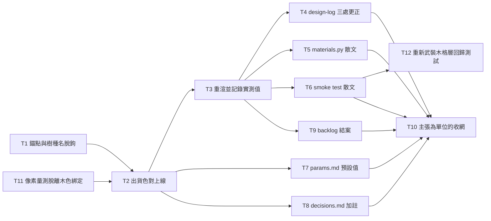

<!-- Source: /Users/kouko/GitHub/kumiko-zaiku-app-icons/docs/loom/plans/2026-08-20-light-wood-and-darker-inside-paper.md -->
<!-- Copied verbatim 2026-09-05 for W3-01 A/B evidence; not modified below this line -->
# Plan: 淺木色與更深的窗內紙

Source brief: docs/loom/specs/2026-08-20-light-wood-and-darker-inside-paper.md
Goal: 木材改檜木 `#D9B382`、窗內底紙加深為 `#585148`，窗外紙與背景不動，三條對比驗收線原值通過，倉庫裡所有因此失效的記載就地加註更正。
Stage: finishing
Total tasks: 12
Critical-path depth: 5 (≤5)
Execution order: parallel-where-possible
Plan-document-reviewer verdict: PASS (2026-08-22, third amendment round — T12 added to re-arm a test this arc disarmed)

## Task-flow diagram

## Open Questions

N/A — no unresolved question: 兩個目標色碼由使用者在對照圖前拍板，三條門檻的通過與否已由 `docs/loom/measurements/2026-08-20-paper-darkness-sweep.md` 實測，唯一的判斷題（未量測的 40% 規則之去留）已在 brief 的 Decision 裁定為就地降級。

## Task 1 — 讓 design-log 的木色錨點與樹種名脫鉤

- Description: `tests/test_render_blender_smoke.py`'s `_design_log_wood_hex()` helper parses the shipped wood hex with the regex `核桃木 ~(#[0-9A-Fa-f]{6})` — the machine-readable anchor is welded to a wood-species name.
  - Introduce a species-neutral anchor instead: add an explicit `出貨色 ~#RRGGBB` marker to the 「木色選擇」 row's value cell in `docs/loom/design-log.md`, carrying the CURRENT value `#6B4A2F`, and repoint `_design_log_wood_hex()` at that marker.
  - Preserve every existing word of the cell, including both species names and their verdicts — this task changes only which token the parser anchors on. The shipped colour does not change in this task.
- Module: tests/test_render_blender_smoke.py
- Files touched: tests/test_render_blender_smoke.py, docs/loom/design-log.md
- Context paths:
  - tests/test_render_blender_smoke.py
  - docs/loom/design-log.md
- Acceptance:
  - RED: Add a new test `test_the_design_log_wood_anchor_does_not_depend_on_a_species_name` asserting that `_design_log_wood_hex()` resolves the row's shipped hex from a marker containing no wood-species word — it fails today because the helper's regex requires the literal 「核桃木」.
    - Report the observed failure message verbatim.
  - GREEN: The new test passes; `test_the_wood_colour_round_trips_to_the_design_log_hex` still passes unchanged against `#6B4A2F`; both species names and their original verdicts are still present in the cell; the whole package suite is green.
- Dependencies: none
- Independent: false
- Brief item covered: BI-1
- Status: done(7f38d12)
- Gloss: 現在測試是靠「核桃木」這四個字找出貨色的，換樹種會讓它把新色貼上舊樹種名還照樣過關——先把這個地雷拆掉。

## Task 2 — 出貨色對上線（木色＋窗內紙一起）

- Description: Ship the new colour pair as one change: set `_WOOD_SRGB_HEX = "#D9B382"` and `_PAPER_INSIDE_SRGB_HEX = "#585148"` in `blender/materials.py`, set the hand-copied `_WOOD_HEX` in `src/kumiko/output/measurement.py` to the wood value,
  - and update `docs/loom/design-log.md`'s 「木色選擇」 row (its Task-1 `出貨色` marker, and the species label attached to the shipped value, so the cell does not claim hinoki's hex is walnut) and 「窗內底紙色」 row (hex and stated L*, the latter computed by running `kumiko.render.colour.lstar_of("#585148")`).
  - The two constants ship together because they are one configuration: hinoki with the OLD inside paper measures a 16px gap of 15.46 against a threshold of 24, so changing the wood alone leaves the suite red. Leave the row's prose verdicts (「有洗白風險」 etc.) untouched — those are Task 4's subject.
- Module: blender/materials.py
- Files touched: blender/materials.py, src/kumiko/output/measurement.py, docs/loom/design-log.md
- Context paths:
  - blender/materials.py
  - src/kumiko/output/measurement.py
  - docs/loom/design-log.md
  - tests/test_render_blender_smoke.py
  - tests/test_panel_slats.py
  - docs/loom/measurements/2026-08-20-paper-darkness-sweep.md
- Acceptance:
  - RED: Update the design-log 「木色選擇」 row's `出貨色` marker to `#D9B382` FIRST and run `tests/test_render_blender_smoke.py::test_the_wood_colour_round_trips_to_the_design_log_hex` — it fails because `_WOOD_SRGB_HEX` still reads `#6B4A2F`.
    - Then confirm `tests/test_panel_slats.py::test_the_measurement_tool_copies_the_wood_hex` fails once the constant changes but `measurement.py`'s copy does not. Report both observed failure messages verbatim; if either does NOT fail as predicted, report that as a finding rather than proceeding.
  - GREEN: Both named tests pass; `test_the_inside_paper_carries_its_own_darker_material` passes with `_MATERIAL_CONTRAST_MIN` unchanged at 15; the 「木色選擇」 cell nowhere attaches the hinoki hex to the word 「核桃木」 (verify by grepping the row for both adjacency orders);
    - the row's note column no longer claims the shipped material takes 核桃木's value (quote the note column's updated sentence in the report); the whole package suite is green.
- Dependencies: Tasks 1, 11 complete first
- Independent: false
- Brief item covered: BI-1, BI-2, BI-4
- Status: done(a312e7c)
- Gloss: 淺檜木與加深的窗內紙一起上線——分開改的話 16px 那條線會紅，它們本來就是一個組態。

## Task 3 — 用出貨組態重渲，記錄三條驗收線的實測值

- Description: With the new pair in place, run the production-configuration render and record the measured values of all three acceptance metrics into a new note `docs/loom/measurements/2026-08-20-shipped-pair-verification.md`:
  - the 1024px wood-vs-outside-paper L* gap, the 1024px paper-vs-paper gap, and the 16px thumbnail gap, each with its threshold constant's current value and the resulting margin. Also record the rendered wood L* and rendered inside-paper L*.
  - Tasks 4, 5 and 6 consume these numbers, so they must come from THIS render, not from the pre-ship sweep notes, which were produced before the constants changed. Do NOT modify any threshold constant.
- Module: docs/loom/measurements
- Files touched: docs/loom/measurements/2026-08-20-shipped-pair-verification.md
- Context paths:
  - tests/test_render_blender_smoke.py
  - docs/loom/measurements/2026-08-20-paper-darkness-sweep.md
  - blender/materials.py
- Acceptance:
  - RED: `test -f docs/loom/measurements/2026-08-20-shipped-pair-verification.md` exits non-zero (the note does not exist).
  - GREEN: The note exists and states all five measured values plus the exact command that produced them; `_MATERIAL_CONTRAST_MIN`, `_PAPER_CONTRAST_MIN` and `_THUMBNAIL_CONTRAST_MIN` are confirmed unchanged at 15, 15 and 24 by reading them back from `tests/test_render_blender_smoke.py`;
    - and all three of their tests pass.
- External surfaces:
  - Category: CLI flag. Name: `blender --background`, invoked through `tests/test_render_blender_smoke.py`'s existing `_run` helper. Grounding: Live-verification — that helper is exercised by the suite that ran 382 passed at the previous arc's close-out; version pinned in `docs/loom/tool-versions.toml`.
  - Category: CLI flag. Name: headless Chrome rasterisation, used only by the 16px downsample leg via the same test module's existing path. Grounding: Live-verification — same suite run. Reuse both; do not introduce a new render path.
- Dependencies: Task 2 completes first
- Independent: false
- Brief item covered: BI-3, BI-8
- Status: done(c1d8cc7)
- Gloss: 換完色真的渲一次，把三條驗收線的實際數字記下來——後面每個寫數字的地方都引這一份，不准各自推算。

## Task 4 — design-log 三處記載就地更正

- Description: In `docs/loom/design-log.md`, annotate three claims in place, preserving every original sentence and adding a dated 2026-08-20 correction naming this arc beside each:
  - (a) the 「木色選擇」 row's rejection of hinoki as 「有洗白風險」 — overturned on TWO independent grounds, both of which the correction must state: this arc's measured 16px margin from Task 3, AND the craft record.
  - (a, cont.) The craft ground: hinoki is the representative kumiko timber and walnut is not a traditional one at all, per the sourced 「組子的實物木材樹種」 row landed in the 有出典 section on 2026-08-20 — cite that row by its label; do not restate its sources.
  - (b) the 「紋樣與白底的明度差」 row's ≥40%-darker / L*≤60 rule — demoted to superseded-as-a-decision-basis, naming the measured 16px line as its successor and stating that the two disagree in the hex-L* 50–65 band;
  - (c) the 「底紙色」 row's cited co-rendered wood figure `#8B6345`（L* 45.4）— replaced with Task 3's measured value.
  - Read each row's ENTIRE table cell before judging whether a claim is already corrected: this repo's cells run to thousands of characters, and a correction written far below reads identically to no correction.
- Module: docs/loom/design-log.md
- Files touched: docs/loom/design-log.md
- Context paths:
  - docs/loom/design-log.md
  - docs/loom/specs/2026-08-20-light-wood-and-darker-inside-paper.md
  - docs/loom/measurements/2026-08-20-shipped-pair-verification.md
  - docs/loom/memory/a-correction-written-far-below-in-a-huge-cell-reads-as-no-correction.md
  - docs/loom/design-log.md 「組子的實物木材樹種」 row (有出典 section, added 2026-08-20)
- Acceptance:
  - RED: For each of the three claims, grep its original sentence and confirm the hit exists with NO dated correction naming this arc anywhere in the same table cell. Record the three cell boundaries (start and end line) used for that judgement.
    - The RED is "hit present, no adjacent correction" — never "grep finds nothing", which this repo's annotate-don't-delete convention makes unreachable.
  - GREEN: All three original sentences still present, each with a dated 2026-08-20 correction inside the same table cell naming this arc and citing the measurement note; claim (a)'s correction additionally names the 「組子的實物木材樹種」 row and states the 推測-vs-有出典 standing;
    - the same three greps and the same cell-boundary read confirm it; `bash scripts/verify-docs.sh` shows its four design-log checks still PASS (its first two checks fail for an unrelated pre-existing reason — see Notes); the whole package suite is green.
- Dependencies: Task 3 completes first
- Independent: true
- Brief item covered: BI-5, BI-6, BI-9
- Status: done(2970cfd)
- Gloss: 倉庫裡那句「檜木有洗白風險，否決」正好否決本 arc 在做的事——就地推翻它，連同它所依據的那條沒量過的規則。

## Task 5 — materials.py 的散文更正

- Description: Correct the stale prose in `blender/materials.py` in place, preserving originals: the module docstring and the `_WOOD_SRGB_HEX` comment that name the wood 「核桃木」, and the comment citing 木 `#8B6345`（L* 45.4）. Replace the stale rendered figure with Task 3's measured value;
  - annotate stale naming rather than silently rewriting it. Read each full docstring or comment block before judging, not only the matched line. Change no code and no constant.
- Module: blender/materials.py
- Files touched: blender/materials.py
- Context paths:
  - blender/materials.py
  - docs/loom/measurements/2026-08-20-shipped-pair-verification.md
  - docs/loom/memory/a-correction-written-far-below-in-a-huge-cell-reads-as-no-correction.md
- Acceptance:
  - RED: Grep `核桃木` and `#8B6345` in `blender/materials.py`; for each hit read the enclosing docstring or comment block in full and confirm no dated correction naming this arc is present in that block. List every hit with its enclosing block's line range.
  - GREEN: Every listed hit either carries a dated 2026-08-20 correction in its enclosing block or has its stale number replaced with Task 3's measured value; `git diff blender/materials.py` shows no change to any executable line; the whole package suite is green.
- Dependencies: Task 3 completes first
- Independent: true
- Brief item covered: BI-5, BI-6
- Status: done(2970cfd)
- Gloss: 這個倉庫把註解當契約讀，所以講舊木色的句子和用舊數字算出來的說明都要改。

## Task 6 — smoke test 裡的散文更正

- Description: Correct the stale prose in `tests/test_render_blender_smoke.py` in place, preserving originals: the `#8B6345`（L* 45.4）figure inside `test_the_paper_renders_in_the_wood_layer_and_not_the_background`'s docstring (replace with Task 3's measured value),
  - and the docstrings of the three custom-wood-hex tests — `test_a_custom_wood_hex_reaches_the_material` (:2385), `test_a_custom_wood_hex_reaches_the_report` (:2427) and `test_a_second_wood_hex_replaces_the_cached_material` (:2469) — which justify `#FFFFFF` as 「離核桃木最遠的顏色」.
  - That justification is false once the default is hinoki, though the tests stay functionally correct, so annotate the reasoning; do not change the tests' inputs or assertions.
- Module: tests/test_render_blender_smoke.py
- Files touched: tests/test_render_blender_smoke.py
- Context paths:
  - tests/test_render_blender_smoke.py
  - docs/loom/measurements/2026-08-20-shipped-pair-verification.md
  - docs/loom/memory/a-correction-written-far-below-in-a-huge-cell-reads-as-no-correction.md
- Acceptance:
  - RED: Grep `核桃木`, `#8B6345` and `#FFFFFF` in `tests/test_render_blender_smoke.py`; for each hit read the enclosing docstring in full and confirm no dated correction naming this arc is present. List every hit with its enclosing docstring's line range.
  - GREEN: Every listed hit carries a dated 2026-08-20 correction or its stale number replaced with Task 3's measured value; no test input, assertion or threshold constant changed (verify by reading `git diff` for this file and confirming every changed line lies inside a docstring or comment);
    - the whole package suite is green.
- Dependencies: Task 3 completes first
- Independent: true
- Brief item covered: BI-5, BI-6
- Status: done(5d857fb)
- Gloss: 三個測試用白色當「離木色最遠」的對照，那個理由在預設換成檜木之後就是假的——測試本身沒錯，錯的是它寫下的理由。

## Task 7 — params.md 的木色預設值更正

- Description: In `docs/loom/params.md`, correct the three places that document CLI defaults by naming the wood 「核桃木」 — the `--wood-hex` default at :75, the `wood_hex=None` fallback description at :89, and the `kumiko-measure --lstar` default sweep description at :99 — so they name hinoki and `#D9B382`.
  - Verify each against what the code actually defaults to rather than assuming: read `blender/build_mesh.py`'s flag default and `src/kumiko/output/measurement.py`'s constant, and make the doc match the code.
- Module: docs/loom/params.md
- Files touched: docs/loom/params.md
- Context paths:
  - docs/loom/params.md
  - blender/build_mesh.py
  - src/kumiko/output/measurement.py
- Acceptance:
  - RED: Grep `核桃木` in `docs/loom/params.md` and confirm exactly three hits (:75, :89, :99), each with no dated correction naming this arc in its enclosing row. List the three with their enclosing block line ranges.
  - GREEN: All three hits name hinoki and `#D9B382`, and each matches the value actually read from `blender/build_mesh.py` and `src/kumiko/output/measurement.py` (quote both source values in the report).
    - `bash scripts/verify-docs.sh` shows its four design-log-related checks PASS — NOT that it exits 0, which its hard-coded plugin path makes impossible on this machine (see Notes). Do not change `scripts/verify-docs.sh`.
- Dependencies: Task 2 completes first
- Independent: true
- Brief item covered: BI-5
- Status: done(b25f634)
- Gloss: 參數文件寫的是使用者在命令列會看到的預設值，寫錯就是直接誤導。

## Task 8 — decisions.md 的當日觀察加註

- Description: In `docs/loom/decisions.md`, annotate the 2026-08-10 look-dev entry's phrase 「丸輪框、核桃木色、去背正確」 (:1605) in place with a dated 2026-08-20 note that the wood colour has since changed to hinoki, citing this arc.
  - Preserve the original sentence verbatim — that entry records what was observed on that date, and it must stay readable as an accurate record OF THAT DATE. Do not rewrite it to describe today's colour.
- Module: docs/loom/decisions.md
- Files touched: docs/loom/decisions.md
- Context paths:
  - docs/loom/decisions.md
  - docs/loom/specs/2026-08-20-light-wood-and-darker-inside-paper.md
- Acceptance:
  - RED: Grep `核桃木` in `docs/loom/decisions.md` and confirm exactly one hit (:1605) with no dated correction naming this arc anywhere in its enclosing entry. Record the entry's start and end line as the boundary used for that judgement.
  - GREEN: The original sentence is still present verbatim, and a dated 2026-08-20 annotation naming this arc sits inside the same entry; the same grep and the same entry-boundary read confirm it.
- Dependencies: Task 2 completes first
- Independent: true
- Brief item covered: BI-5
- Status: done(fd369ac)
- Gloss: 決策紀錄寫的是當天看到的東西，所以只在旁邊加註「後來換色了」，不改寫原句。

## Task 9 — backlog 條目結案

- Description: Close `docs/loom/backlog/light-wood-colour.md`: flip its `status:` to SHIPPED,
  - append a body note naming which of its three proposed paths was actually taken — a combination of path 1 (the unmeasured threshold demoted) and path 2 (the inside paper darkened), with no `PRINCIPLES.md` Deviation Ledger entry — citing this branch and the measurement notes;
  - annotate its 「現況的數字」 table in place to record that its L* figures were hex-derived rather than measured from renders, preserving the original table;
  - and annotate its closing paragraph's claim that its measurement premise must be re-measured before opening, since that re-measurement is now done and cited.
  - Then regenerate the indexes with `python3 scripts/backlog_index.py --write` and `python3 scripts/backlog_index.py --direction-write docs/loom/DIRECTION.md`.
- Module: docs/loom/backlog
- Files touched: docs/loom/backlog/light-wood-colour.md, docs/loom/BACKLOG.md, docs/loom/DIRECTION.md
- Context paths:
  - docs/loom/backlog/light-wood-colour.md
  - docs/loom/measurements/2026-08-20-shipped-pair-verification.md
  - docs/loom/measurements/2026-08-20-wood-lightness-sweep.md
  - docs/loom/measurements/2026-08-20-paper-darkness-sweep.md
  - scripts/backlog_index.py
- Acceptance:
  - RED: `grep -c '^status: COMMITTED-NEXT' docs/loom/backlog/light-wood-colour.md` returns 1 (still open), and the entry contains no note naming which path was taken.
  - GREEN: `status: SHIPPED`; the entry names the taken path and cites this branch plus the measurement notes; the original table and closing paragraph are preserved with dated annotations; `python3 scripts/backlog_index.py --validate` exits 0; the regenerated `BACKLOG.md` and `DIRECTION.md` are staged.
- Dependencies: Task 3 completes first
- Independent: true
- Brief item covered: BI-7
- Status: done(9e6826e)
- Gloss: 這筆 backlog 是本 arc 的起點，出貨後要結掉並寫明走了三條路裡的哪一條，否則下一個人會重問一次。

## Task 10 — 以「主張」為單位的收網掃描

- Description: Sweep the WHOLE repository — including files no earlier task listed — for surviving copies of the seven claims this arc overturns, enumerated by claim rather than by file: (C1) the wood is walnut `#6B4A2F`; (C2) hinoki was rejected for wash-out risk;
  - (C3) the ≥40%-darker rule is the wood-colour decision basis; (C4) the inside paper is `#8A8072`; (C5) the co-rendered wood figure is `#8B6345` / L* 45.4; (C6) `#FFFFFF` is the colour farthest from the default wood; (C7) the `light-wood-colour` backlog entry is open and its premise unmeasured.
  - For each claim search by MEANING as well as by literal string — a sentence saying 「深色木紋」 or 「紋樣比底紙暗」 is a hit with no hex in it — and check `README.md` explicitly even though earlier reconnaissance found nothing there, since it is the most-read file and belonged to no task's list.
  - Write a receipt at `docs/loom/measurements/2026-08-20-claim-sweep-receipt.md` listing every hit and, per hit, either the correction now sitting beside it or a named reason it needs none. State scope honestly: name which files were read in full and which only at the matched line.
- Module: whole-repo prose sweep
- Files touched: docs/loom/measurements/2026-08-20-claim-sweep-receipt.md, plus any file found to still carry an uncorrected claim
- Context paths:
  - docs/loom/memory/slicing-a-sweep-by-file-leaves-the-defects-between-the-slices.md
  - docs/loom/memory/a-correction-written-far-below-in-a-huge-cell-reads-as-no-correction.md
  - docs/loom/specs/2026-08-20-light-wood-and-darker-inside-paper.md
  - README.md
- Acceptance:
  - RED: `test -f docs/loom/measurements/2026-08-20-claim-sweep-receipt.md` exits non-zero.
  - GREEN: The receipt exists and accounts for all seven claims; every surviving hit is listed with an adjacent named correction or a stated reason it needs none; `README.md` is explicitly accounted for; the scope statement distinguishes full-read files from matched-line-only files;
    - `bash scripts/verify-docs.sh` shows its four design-log checks PASS — NOT that it exits 0, which its hard-coded plugin path makes impossible on this machine (see Notes) — and the whole package suite is green.
- Dependencies: Tasks 4, 5, 6, 7, 8, 9 complete first
- Independent: false
- Brief item covered: BI-5, BI-6
- Status: done(98963d7)
- Gloss: 上一個 arc 的七處遺漏全部落在「每個人的檔案清單之間」——這一關改用主張當單位再掃一次，專門找沒人負責的角落。

## Task 11 — 像素量測脫離木色綁定：判別門檻重錨於 B/R 0.6685，中心像素改區域取樣

- Description: Two colour-coupled measurement defects in `tests/test_render_blender_smoke.py` ship as one change; the second's fix consumes the first's, so they are not separable (see the atomicity note at the end of this Description).
  - **(a) The threshold.** `_SIDE_WALL_WOOD_BR_MAX = 0.62` calls a pixel wood by its blue/red ratio; the CHANNEL is right and stays, the VALUE is a walnut-only calibration and must move. Re-anchor it at **0.6685** — the midpoint of the measured cross-species intersection.
  - That value comes from `docs/loom/measurements/2026-08-22-cross-species-wood-discriminator.md`: admissible window (all three tests actually run, both woods) B/R [0.636, 0.682].
  - Separation window (outside both woods' and both papers' distributions) is B/R (0.6549, 0.7426]; the intersection is (0.6549, 0.682], and misclassification at its midpoint is 0.00% in both directions on both woods.
  - Rewrite the constant's docstring from that note, keeping the 2026-08-18-era walnut figures as dated historical calibration per this repo's annotate-don't-delete convention.
  - State the re-sweep trigger explicitly: a future wood whose wood-pixel B/R upper edge exceeds 0.6549, or whose paper lower edge drops below 0.682, puts the threshold back inside a distribution and requires re-running that sweep.
  - The channel stays blue/red, so no consumer changes channel and `_blue_over_red` (`:2238`) keeps its name and meaning.
  - Update only the prose that quotes the OLD VALUE or its walnut-era ramp figures as current — `:1793`, `:2141`, `:2264`, and any other surviving sentence that does so. Sweep by that claim, not by this coordinate list.
  - **(b) The centre-pixel test.** `:945`'s `test_the_inside_paper_is_actually_visible_in_the_rendered_wood_layer` samples the image's centre pixel; measurement confirms that pixel is a slat, reading the wood-top median, so it never sampled paper at all.
  - It passed under walnut only because walnut sat nearer the inside-paper colour by coincidence, and it would read the same pixel if the inside paper vanished entirely — the assertion is dead in both directions.
  - Re-anchor it on the inside annulus via the existing `_region_pixels` helper (`:1038`) with wood filtered out by (a)'s classifier, preserving the test's original subject: the inside paper is not wholly occluded by the outside sheet.
  - **Atomicity**: (b)'s wood filter is (a)'s classifier. Shipping (b) first would filter hinoki wood as paper and pollute the very population it asserts over, so its GREEN could not be verified.
  - Splitting them into two dependent tasks would also push this plan's critical-path depth to 6, over the schema's limit of 5.
- Reuse-adequacy:
  - Observed: `_region_pixels` selects opaque pixels by world radius on ONE caller-supplied plane, converting pixel to world coordinates through `_view_width(camera, plane_z)`; its docstring states the camera is perspective, that each plane perpendicular to the optical axis has its own view width, and that passing the wrong `plane_z` turns nothing red — it silently shifts the sampled annulus to a different radius — read tests/test_render_blender_smoke.py:1056
  - Intended: call it from `test_the_inside_paper_is_actually_visible_in_the_rendered_wood_layer` on the `rendered_twice` fixture, passing the INSIDE paper surface's own z (not the slat-top z, not the outside sheet's), bounded to the inside annulus, then drop wood pixels with (a)'s re-anchored blue/red classifier and assert over the surviving paper population.
- Module: tests/test_render_blender_smoke.py
- Files touched: tests/test_render_blender_smoke.py
- Context paths:
  - tests/test_render_blender_smoke.py
  - docs/loom/measurements/2026-08-21-light-wood-pixel-discriminator.md
  - docs/loom/measurements/2026-08-22-cross-species-wood-discriminator.md
- Acceptance:
  - RED: With the working tree's hinoki constants in place, run `::test_an_off_axis_slat_shows_its_centre_facing_side_wall`, `::test_the_rim_stays_round_under_the_perspective_camera` and `::test_the_inside_paper_is_actually_visible_in_the_rendered_wood_layer`; report all three failures verbatim.
    - Then show (b)'s assertion is dead in the occlusion direction: render with the inside paper overridden to the outside paper's colour (an override, never an edit to a shipped constant).
    - The CURRENT centre-pixel test still PASSES on that render under walnut — it does not detect the defect it exists to detect. Report that pass verbatim; it is the primary RED for (b).
  - GREEN: All three tests pass under hinoki AND under walnut, the latter verified by re-rendering with the `--wood-hex #6B4A2F` override rather than by editing any constant back.
    - The rewritten (b) FAILS on the occlusion-simulating render, proving it now detects what the old one could not.
    - Report the wood-vs-paper margin on both woods, the threshold's distance to the nearer population edge in each case, and the surviving paper-pixel population size per run — a median over a handful of pixels is not a population.
    - Report the misclassification rate in BOTH directions on BOTH woods against the geometry-truth wood mask; the measurement note records 0.00%/0.00%, so any nonzero rate is a discrepancy to report, not to absorb.
    - `_FOOT_SHADOW_PAPER_BR_MIN`'s docstring no longer claims it shares the side-wall constant's calibration — that cross-reference went stale when the side-wall value moved. Annotate in place; do not change its value.
    - `_MATERIAL_CONTRAST_MIN`, `_PAPER_CONTRAST_MIN` and `_THUMBNAIL_CONTRAST_MIN` are unchanged at 15, 15 and 24; the whole package suite is green.
- Dependencies: none
- Independent: false
- Brief item covered: none — 實作期才發現的事實：brief 假設只有三條對比驗收線與木色耦合，量測找到第四個耦合處（一個像素分類器與一個取樣方法），兩者都不是驗收線而是量測工具。證據在 `docs/loom/measurements/2026-08-21-light-wood-pixel-discriminator.md` 與 `2026-08-22-cross-species-wood-discriminator.md`。**與 BI-6 相鄰但不由它涵蓋**：BI-6 管的是「由舊木色推出的字面數字」，該分類器的舊校準數字確實是其中之一；但本任務三條 RED 斷言的是側壁寬度、丸輪圓度與紙的可見性，沒有一條是任何 BI 點名的東西，故依 schema 的 tie-break（主要指涉物是 RED 所斷言的那一項）取 `none`
- Status: done(8a91210)
- Gloss: 那兩個「哪裡是木頭、哪裡是紙」的判斷都是踩在深木色上的巧合——換淺木把巧合戳破，這一關把門檻挪到兩種木色都在分布之外的位置，並把取樣方法換成真的量得到紙的那一種。

## Task 12 — 重新武裝被本 arc 解除武裝的木格層回歸測試

- Description: `tests/test_render_blender_smoke.py`'s `test_the_paper_renders_in_the_wood_layer_and_not_the_background` exists to catch one defect: the backing paper failing to appear in the wood layer. Under the shipped hinoki it can no longer catch it.
  - Measured on the shipped configuration: rendered wood `#FFDEA1` and rendered outside paper `#E3D7BF` BOTH satisfy all three of the test's assertions — `!= "#FFFFFF"`, `red > blue` (255>161 and 227>191), and `80 <= lstar_of(dominant) <= 92` (89.89 and 86.35).
  - A wood-only dominant colour is therefore indistinguishable from a paper dominant colour, so the assertion set passes whether or not the defect is present.
  - Re-arm it on the axis that still separates them: blue-over-red. Rendered wood B/R = 161/255 = **0.6314**; rendered outside paper B/R = 191/227 = **0.8414**.
  - That is the same axis `_SIDE_WALL_WOOD_BR_MAX = 0.6685` already uses, and that constant's own cross-species intersection `(0.6549, 0.682]` sits between the two populations.
  - Keep the existing three assertions — they are still true and still cheap — and add a hue-based one that fails when the dominant colour is wood.
  - Compute the ratio from `_hex_channels(dominant)`, which this same test already calls one line above for its `red > blue` assertion — same helper, same call path, same data shape.
  - **Do NOT reuse `_blue_over_red`**: its signature is `(row: bytearray, offset: int)` over a raw pixel row, not a `#RRGGBB` string, and its `red == 0 → return 1.0` convention encodes 「transparent pixel, therefore not wood」 — a pixel-scan rule with no meaning for a layer's dominant colour.
  - Annotate the `[80, 92]` band's stale justification, which Task 6 already dated; do not delete it.
- Module: tests/test_render_blender_smoke.py
- Files touched: tests/test_render_blender_smoke.py
- Context paths:
  - tests/test_render_blender_smoke.py
  - docs/loom/measurements/2026-08-20-shipped-pair-verification.md
  - docs/loom/measurements/2026-08-22-cross-species-wood-discriminator.md
- Acceptance:
  - RED: Demonstrate the test is currently blind. Feed the rendered wood colour `#FFDEA1` through the test's existing assertion set and show all three pass, so the test would stay green if the wood layer contained no paper at all.
    - Report that pass verbatim. The RED here is a PASS that should have been a failure — never "the test errors", which it does not.
  - GREEN: With the new assertion in place, the same wood-only dominant colour FAILS, while the real production render still passes on BOTH woods — hinoki, and walnut via a `--wood-hex #6B4A2F` override render rather than by editing any constant.
    - Report the dominant colour and its B/R for each of the three runs, and the threshold's distance to each population.
    - `_MATERIAL_CONTRAST_MIN`, `_PAPER_CONTRAST_MIN`, `_THUMBNAIL_CONTRAST_MIN` unchanged at 15, 15, 24 and `_SIDE_WALL_WOOD_BR_MAX` unchanged at 0.6685; the whole package suite is green.
- Dependencies: Task 6 completes first
- Independent: false
- Brief item covered: none — 本任務修的是本 arc 自己造成的附帶損害：換木色讓一條既有回歸測試的斷言集對它要抓的缺陷失明。brief 只預見三條對比驗收線與木色耦合，沒有預見一條用明度區分木與紙的測試會因為兩者變得同亮而失效。證據見 Notes 的 2026-08-22 條目與 `docs/loom/measurements/2026-08-20-shipped-pair-verification.md`
- Status: done(5be7f45)
- Gloss: 換色之後，那條「紙有沒有出現在木格層」的測試連純木頭的畫面都會判過——它現在抓不到它唯一該抓的東西，本關把它修回會失敗。

## Notes

- **本計畫刻意先列主張、再分配檔案。** `docs/loom/memory/slicing-a-sweep-by-file-leaves-the-defects-between-the-slices.md` 記錄了上一個 arc 的七處遺漏，共同成因是「按檔案切清掃，缺陷長在清單之間」。Task 10 是那條記憶的直接對策，且刻意點名 `README.md`——它不在任何技術任務的自然範圍裡，卻是新人第一個讀到假話的地方。
- **驗收條件不寫成「grep 沒有命中」。** 本倉庫的慣例是就地加註、原句保留，所以原句永遠會命中。Task 4／5／6 的 RED 因此定義為「命中存在，但同一個表格格子／docstring 區塊內沒有具名的更正」，並要求實作者回報他判定所依據的區塊範圍——這是 `a-correction-written-far-below-in-a-huge-cell-reads-as-no-correction` 那條記憶的對策。
- **Task 3 是所有數字的單一來源。** Task 4／5／7 要寫的每一個渲染數值都必須引 Task 3 的量測筆記，不得各自推算或沿用出貨前的掃描值——那兩份掃描是在常數改變**之前**跑的。
- **三條門檻常數（15／15／24）在本計畫中沒有任何任務被授權修改。** 它們是使用者的驗收線。任何任務若發現必須調降才能通過，那是 BLOCKED，要回報而不是自行放寬。
- **使用者選了較柔的 A 級（`#585148`）而非餘裕較大的 B 級（`#403B33`）**，理由是後續已規劃的兩件事（放大組子紋樣比例、加深木材 z 軸擠出）都會把 16px 對比再往上推，先選強的會過頭。因此 A 的 +2.19 餘裕落在量測解析度（±3–5）之內是**已知且刻意**的——若日後某個 arc 讓這條線翻掉，成因是這裡的取捨，不是回歸。
- **Kickoff decision: 那條「紋樣需比白底深 40% 以上」的規則不刪除、不沿用，而是就地降級為「已被 16px 實測線取代」**（brief 的 Decision 段）。實作者若認為該規則仍應具約束力，那是 BLOCKED，回報而不是自行判斷。
- **審查第一輪 NEEDS_REVISION，兩處都是實質缺陷，已改：**
  - 原 T1 指示「只換色碼」會讓 `design-log.md`「木色選擇」格變成「核桃木 ~#D9B382 安全；檜木 ~#D9B382 有洗白風險」——同一色碼出現兩次、其一貼錯樹種名，而 `_design_log_wood_hex()` 的正規式寫死 `核桃木 ~(#RRGGBB)`，所以**測試照樣全綠**。根因是機器讀的錨點綁在樹種名上，故新增 T1 先讓錨點與樹種脫鉤，改色是 T2。
  - 原 T5 的 `Module` 同時列了兩個檔案路徑（schema 只允許一個），已拆成 T5（materials.py）與 T6（smoke test）。
  - 原 T5 描述稱三個測試都叫 `_custom_wood_hex_*`，實際第三個是 `test_a_second_wood_hex_replaces_the_cached_material`——已更正為逐一具名。
  - T3 的 `External surfaces` 欄改為 plan-format 要求的「類別＋名稱＋佐證」形狀。
- **木色與窗內紙必須同一個任務上線。** 檜木配舊窗內紙的 16px 對比實測 15.46，門檻 24——只改木色會讓套件變紅。兩者是一個組態，不是兩件可以分開的事。
- **審查第二輪 NEEDS_REVISION，一處，而且是第一輪同一類缺陷的第二份**：第一輪指出「Module 欄不得列兩個檔案」並點名當時的 T5，我拆了 T5 卻沒回頭掃其他任務，於是 T7（`docs/loom (params + decisions)`）原封不動地留著同樣的毛病。已拆為 T7（params.md）與 T8（decisions.md）。**這正是 `slicing-a-sweep-by-file-leaves-the-defects-between-the-slices` 的縮小版**：按被指出的位置修，缺陷留在沒被指出的位置。兩則附註一併處理：T3 的 External surfaces 類別改用 schema 認可的 `CLI flag`；T2 的 GREEN 補上「註解欄不再宣稱出貨材質取核桃木的值」這一項的檢查。

- 2026-08-20 — 出典先行落地，計畫在後：使用者在計畫定稿後問了「標準日本組子用什麼木材」，查證結果（檜為代表、杉與檜葉同列基本材、神代杉等深色材只作部分使い、核桃木非傳統材）已直接寫進 `design-log.md` 有出典段的「組子的實物木材樹種」列，**不等本計畫執行**——它是新增一列有來源的事實，不改任何常數、不動任何既有列，與本計畫的十個任務無依賴。本計畫受影響的只有 Task 4：那條「檜木有洗白風險」的裁定現在有了第二個推翻理由，且該理由在文件層級上高於它（推測 vs 有出典）。查證同時修正了我口頭說法的兩處過頭：「杉是第二常見」查無排名依據，シナ 只有海外來源列為傳統材——兩者都已在該列標為誠實條款。沒有任何來源提供色碼或 L\*，該列因此明寫「本列不是倉庫木色 hex 的出典」。
- 2026-08-20 — `scripts/verify-docs.sh:4` 把外掛路徑寫死成 `loom-product-principles/0.12.0`，該版本已不在本機（只剩 0.12.1／0.13.0／0.2.0），所以它開頭兩項檢查（PRINCIPLES.md 結構、種子可追溯性）目前恆為 FAIL，**與文件內容無關**。本 arc 不修它——任何任務的 GREEN 只斷言與 design-log 相關的那四項 PASS，不得斷言全綠，也不得為了讓它全綠而改那行路徑。

- 2026-08-21 — **同一個缺陷類別在本計畫連續出現三次，每次都是我修了被點名的那一處。**第一輪：Module 欄列兩個檔案，我修了被點名的 T5、漏了 T7。第二輪修完後，我把「verify-docs.sh exits 0」這個不可能成立的驗收條件改掉——改了 Task 4 與 Task 10，**漏了 Task 7**，由第三輪抓出。這不是三個獨立疏失，是同一個動作模式：**收到一個座標，就只去那個座標**。對策已寫進 Task 10 的形式（以主張為單位、不以檔案為單位），但那條紀律必須同樣套用在**修審查意見**上，不只套用在清掃任務上——每次修一處缺陷，先問「這個缺陷的其他實例在哪」，再動手。

- 2026-08-22 — **計畫增修一個任務（T11），前一次 PASS 因此作廢，verdict 退回 PENDING。**T2 把兩個顏色常數上線後，全套跑出 3 failed / 380 passed。三個紅掉的測試量的是幾何（側壁寬度、丸輪圓度、窗內紙可見性），主題沒變——壞的是它們用來找木頭的像素分類器`_SIDE_WALL_WOOD_BR_MAX`，那是在核桃木上校準的。實測：檜木木頂面 B/R 中位數 0.6314，門檻 0.62，**54.3% 的木頭像素被判成紙**。量測另外確認兩件事：(a) 用完美的幾何遮罩、不動任何常數，同一份幾何的側壁讀數是 12px，所以失敗完全來自分類器；(b) 飽和度 `(max−min)/max` 在此**恆等於** 1 − B/R（1304 個取樣像素零反例），所以「換飽和度試試」是假的多樣性，不是替代方案。使用者裁定改用藍/綠比（單一門檻 ≈0.80 同時分開核桃木與檜木），讓這個工具從此不綁任何一種木色，而不是每換一次木色重校一次。**（2026-08-22 同日推翻：見下方第二次增修那則——藍/綠比的交集是空的，最終出貨的是 B/R 重錨於 0.6685。）**
- 2026-08-22 — **T11 的 `Brief item covered` 是 `none — <理由>`，這是刻意的。**brief 的 Smallest End State 只點名三條對比驗收線與木色耦合；第四個耦合常數是實作期量出來的，brief 寫作時無從知道。與其把一條事後的 BI 塞回 brief 假裝當初想到了，不如在計畫裡誠實記為「實作期發現」並附證據路徑。**本任務不動那三條驗收線的任何一個值。**

- 2026-08-22 — **同一個缺陷類別的第四次：改了被點名的位置，沒掃同類。**增修輪的審查抓到三處，全部是這個模式的實例：(a) T1 的提交在 smoke test 上游插了行，Task 6 引用的三個測試位置整體偏 27 行——我改完 T1 沒回頭掃計畫裡其他指向同一檔案的行號；(b) 我把「兩個任務」的殘句在 Notes 裡改掉了，**卻留著表頭第 9 行同一句話**，由 delta 確認再抓一次；(c) mermaid 圖與 Dependencies 欄講的不是同一張圖（T11 沒進圖）。**前三次記在上面兩則附註裡，這是第四次。**結論已經不是「下次注意」了：任何一處缺陷修完，**先列出這個缺陷的判準，再用那個判準掃全文**——這正是 Task 10 用主張而非檔案當單位的同一條紀律，只是它到現在為止只被套用在清掃任務上，沒有被套用在修審查意見上。收尾時把這條寫進 `docs/loom/memory/`。
- 2026-08-22 — Check 17 的 (c2) 由審查裁定重用成立，並記下一個**已被驗收條件擋住、不是被假設掉**的殘餘風險：`rendered_twice` 是 pitch 1.0 的密集面板，窗內環帶木條密集，濾掉木頭後倖存的紙像素可能很少。Task 11 的 GREEN 已要求逐次回報倖存紙像素的母體大小，所以這個風險是宣告過且有閘門的。

- 2026-08-22 — **T11 的判別通道決定被量測推翻，計畫二度增修。**第一輪量測（`2026-08-21-…`）以「木與紙的分布分不分得開」排名候選，推薦藍/綠比 ≈0.80。實作照那個值做，發現 0.80 讓檜木的側壁只讀到 1px（驗收要 ≥2），改用 0.78 才過——而 0.78 落在核桃木的木頭分布**裡面**。規格審查因此退件，判定「Description 與 GREEN 互相不可滿足，這是計畫的缺陷，不是實作的」。使用者裁定再量一輪，這次把側壁懸崖納入合格條件。第二輪（`2026-08-22-…`）的結論推翻第一輪的排除理由：**答案是原本那條 B/R 通道，只是值要挪。**第一輪排除 B/R 的理由是「兩種木的分布彼此不重疊」——那與問題無關，門檻只需高於兩種木的**上緣**（0.6549）並低於兩種紙的**下緣**（0.7426）。B/R 的跨木種間隙 0.0877 是 B/G（0.0181）的 4.8 倍，交集 (0.6549, 0.682] 非空，中點 0.6685，兩個方向的誤判率在兩種木色下都是 0.00%。B/G 的交集則是空的，差 0.020。
- 2026-08-22 — **兩輪量測的方法差異值得記住**：第一輪只比分布，第二輪把候選門檻插樁進去**實跑那三個測試**。差別不在數據品質，在目標函式——分布分得開是必要條件，不是充分條件，因為 1024px 上的側壁（3–5px）與抗鋸齒漸層（3–4px）同一個級數，門檻往紙端挪太多會把抗鋸齒吞進木的連續段，平坦度檢查再把整段否掉。第二輪另外撞到一個安靜的陷阱並記了下來：第一批渲染的 `wood_hex=` 是 keyword-only 參數，傳錯位置時被**默默忽略**、三張「不同」的圖回來逐位元相同而且不報錯，只因為標記圖的中心像素該是紅的卻是檜木色才被抓到。

- 2026-08-22 — **第二次增修的審查是第一次「掃描沒留下同類」的一輪**。審查逐項掃過 `blue/green`／`藍/綠`／`_SIDE_WALL_WOOD_BG_MAX`／`0.80`／`0.78`，只在 Notes 的兩則歷史記載命中，兩則都標了日期且明寫已被推翻，沒有任何一處活的指示還指向舊通道。前四次的模式在這一輪沒有復發——差別在於這次的改動一開始就是「先列判準、再掃全文」，而不是「改被點名的那一處」。
- 2026-08-22 — **審查記下三件執行期要帶著的事，其中兩件不是缺陷而是限制**：(a) T11 的 RED 預設的是**已提交的基準**，不是當前工作樹——樹上還躺著被取代的 B/G 0.78 嘗試，那三個測試在它之下是**通過**的，所以實作必須先把那次嘗試還原，RED 才重現得出來；這一點寫在派工裡，不改計畫。(b) 側壁那個可行窗 [0.636, 0.682] 只來自**兩個**面板組態，而 `_SIDE_WALL_MIN_PIXELS` 的配方橫跨八個；完整掃描只會讓這個窗變窄，而餘裕只有 0.0136／0.0135。這不是現在的缺陷，是收尾時要明講的薄弱處。(c) 重掃觸發條件的措辭偏早（門檻要過 0.6685 才真的進入分布），保守、無漏判，但敘述的因果不完全成立——出貨的 docstring 要寫精確版本，不照抄計畫這句。

- 2026-08-22 — **收尾時要開成 backlog 條目的五件事**（實作期量出來或審查抓到，都不在本 arc 範圍）：
  1. **木材與窗外紙幾乎同亮度**：渲染 L\* 89.89 對 86.35，差 3.54，且木材的紅通道已削頂在 `#FF`。兩者現在只靠色相分開、不靠明暗。16px 那條門檻量的是「窗內對窗外」不是「木材對窗外紙」，所以它過關並不涵蓋這件事。使用者已規劃的放大紋樣與加深 z 軸會推高窗內對比，但**不會**改善這一項。
  2. **`_MATERIAL_CONTRAST_MIN` 的標籤原本在 brief 與本計畫裡都寫錯**（**2026-08-22 更新**：brief 已於 `specs/2026-08-20-…:22` 就地加註更正；本計畫的任務欄位裡並未出現該標籤，只有本則與下一則 Notes 提到它、而兩則都是更正）：兩處原本都稱它「1024px 木紙對比」，但 `tests/test_render_blender_smoke.py:828` 的斷言比的是兩個 design-log **色碼**的 L\*——紙對紙、色碼推導、不碰渲染。**「木材對窗外紙」的差距沒有任何常數在守。**
  3. **`_FOOT_SHADOW_PAPER_BR_MIN = 0.75` 的餘裕沒了**：檜木紙的 B/R 下緣是 0.7426，餘裕 −0.0074，而它的姊妹常數是刻意留 +0.0136。程式品質審查判定「今天無害但餘裕沒了」——掉在下限之下的是抗鋸齒邊緣（跳過迴圈本來就要吃掉），陰影帶內部因 B/R 對暗免疫而不可能低於它，且寬度從中點算不從下限算，所以失敗會是紅不是假綠。**🟡，進 backlog，不擋分支。**
  4. **design-log 的 parser 該錨定首欄**：`if line.startswith("|") and "<鍵>" in line` 是對整列做子字串掃描，任何一列的散文都可能劫走別列的鍵（本 arc 的 T2 就發生過一次，「白底色」把首次命中從 55 搬到 52）。改成 `^\| *<鍵> *\|` 即可根治。這在 `tests/` 裡，不屬於本 arc 任何任務。
  5. **`tests/test_render_blender_smoke.py:2067`／`:2072` 的腳部陰影讀數未重量**：受光 163.4／落影 126.4–128.3／差 37–45 是**窗內紙**的讀數，而本 arc 的 T2 把窗內紙改暗了，很可能動到它們。測試是綠的，數字可能過期。審查特別指出實作給的理由（「需要陰影帶機制、不能讀快取渲染」）**不成立**——同一個實作就用了類比的 `_widest_side_wall_band` 重量了別處；正確的理由是「那屬於 T2 的波及範圍」。別讓錯的理由進記錄。
- 2026-08-22 — **T4／T5／T6 抄數字時要抄 T3 那份 note 的標籤，不是抄本計畫的措辭。**本計畫把 36.07 稱作「1024px 木紙對比」是錯的（見上一則第 2 點）；照抄會把 T3 剛剛修掉的「色碼推導 vs 渲染像素」混淆重新種回去。這是規格審查在 T3 的 notes 裡明確交代的下游義務。

- 2026-08-22 — **「dated 2026-08-20 correction」在 T4/T5/T6 的驗收裡是寫死的日期，執行日卻是 2026-08-22。**計畫寫於 8/20 並預設當天執行完。實作一律以**真實日期 2026-08-22** 加註，不為了滿足字面 grep 而寫一個假的日期——那正是本倉庫「加註不刪除」慣例要防的那種不誠實。驗收條款的實質要求是「同一個區塊裡有一則標了日期、指名本 arc 的更正」，日期取實際發生日。

- 2026-08-22 — **計畫的任務清單漏了一整個檔案：`blender/build_mesh.py`。**T7 的實作回報它的 `:129` 與 `:875` 說明文字仍寫著「design-log 的核桃木」；規格審查逐一比對十一個任務的 `Files touched`，確認**沒有任何一個任務認領它**，只有 T10 那句開放式的「plus any file found to still carry an uncorrected claim」抓得到。這正是 T10 以主張為單位（而非以檔案清單為單位）掃描的存在理由——但也證明了按檔案分派任務時，漏掉的檔案不會有人發現，除非最後有一關不按檔案走。**T10 的派工必須逐字點名 `blender/build_mesh.py`**，與它已經點名 `README.md` 的理由相同。
- 2026-08-22 — **審查臂的選擇與偏離**：計畫沒有為任何任務宣告 `Review-weight`，依 SDD 預設應跑完整三方（implementer／spec-reviewer／code-quality-reviewer）。T7／T8 的 `Files touched` 全部是人寫的 `.md`，符合 prose substitution 的執行期資格測試，故以 `docs-reviewer` 取代 code-quality 臂；T9 因為含 `BACKLOG.md`／`DIRECTION.md` 兩個**腳本生成**的檔案，資格測試 fail-closed，走完整三方。此處記錄為刻意偏離，不是遺漏。

- 2026-08-22 — **本 arc 解除了一條既有回歸測試的武裝，因此新增 T12 把它修回去，計畫三度增修。**`test_the_paper_renders_in_the_wood_layer_and_not_the_background` 的三條斷言（`!= "#FFFFFF"`、`red > blue`、`80 <= L* <= 92`）在核桃木時期能分辨木與紙；換成檜木之後，渲染木 `#FFDEA1`（L\* 89.89）與渲染窗外紙 `#E3D7BF`（L\* 86.35）**三條全部都過**，orchestrator 已自行以 `lstar_of` 逐條驗算確認。也就是說：**即使木格層裡完全沒有紙，這條測試仍然綠。**程式品質審查在整條分支的尺度上把它評為 🔴 級——「這條分支會帶著一條只剩 docstring 保護的回歸測試出貨」。修法是換一個仍然分得開的軸：B/R，木 0.6314 對紙 0.8414，而 `_SIDE_WALL_WOOD_BR_MAX = 0.6685` 正好落在兩者之間。
- 2026-08-22 — **T12 的 `Brief item covered` 是 `none`，理由與 T11 同類但不同源**：T11 修的是量測工具的校準前提，T12 修的是**本 arc 自己造成的附帶損害**。brief 預見了三條對比驗收線與木色耦合，沒有預見「木與紙變得同亮」會讓一條靠明度分辨兩者的測試失明。**修復自己造成的損害屬於原本的請求之內，不是範圍擴張**——一條被解除武裝的回歸測試若隨這條分支出貨，下一個人不會知道它已經不設防。

- 2026-08-22 — **T12 的初稿指定了一個簽章不合的 helper，由計畫審查抓出。**我原本寫「重用 `_blue_over_red`」，但它吃的是 `(row: bytearray, offset: int)`（原始像素列），而 T12 的呼叫端手上是 `report['layers']['木格']['dominant_hex']`——一個 `#RRGGBB` 字串。更糟的是它的 `red == 0 → 1.0` 慣例編碼的是「透明像素，因此不是木頭」，那是逐像素掃描的規則，對一個「層的主色」沒有意義。正確的是 `_hex_channels`——**同一條測試在上一行就已經在用它**，同一條路徑、同一種資料形狀，因此不需要 `Reuse-adequacy` 宣告。已改寫，並在描述裡明寫「不要用 `_blue_over_red`」與理由，免得實作「順手」換過去。
- 2026-08-22 — **審查回報三處行號已因本 arc 自己的提交而位移**：T6 引用的三個測試（`:2385`／`:2427`／`:2469`）實際在 `:2529`／`:2579`／`:2628`，T11 引用的 `_region_pixels`（`:1038` → `:1102`）、`_blue_over_red`（`:2238` → `:2374`）、以及 T11 `Reuse-adequacy` 的 `read …:1056` 標記（該段 docstring 現在在 `:1113-1131`）。**三處都因為任務自己出貨而腐爛，不是寫錯**；T6 與 T11 都已完成並提交，不重派。審查明說它在 Check 17 (c1) 上放行 T11 是一個判斷：來源逐字說了 `Observed` 宣稱的話，座標腐爛只因為 T11 自己上線了——在那裡判失敗等於懲罰執行。這個判斷我同意，記錄在此。
