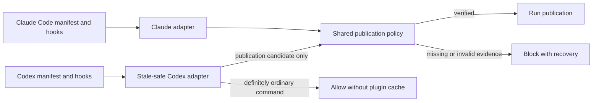

# Cross-host plugin contracts — spec

intent: 2026-09-09-cross-host-plugin-contracts@c974a1a7e
pre-build-review: required — this changes a cross-host publication enforcement boundary and the public package contract for two plugin runtimes

## Requirements

REQ-1 — Native host contracts
  WHEN the loom-code package is installed independently in Codex or Claude Code, the package shall expose skills, manifests, hook configuration, root variables, event matchers, and hook results that conform to that host's documented plugin contracts, with exactly the Codex hook configuration named by the Codex manifest registered on Codex → Acceptance #1

REQ-2 — Stale Codex cache does not block ordinary work
  WHILE a live Codex task retains a hook definition from an earlier plugin version whose cache directory no longer exists, the hook shall allow a non-publication Bash command without loading any file from that version directory → Acceptance #2

REQ-3 — Publication remains fail-closed
  IF a Bash command is not on the stale-cache read-only allowlist and the installed checker cannot be loaded THEN the hook shall deny the command, name the missing checker path, instruct the user to restart Codex, and shall not search another version directory, the cache root, or `PATH` for a substitute checker → Acceptance #3

REQ-4 — Cross-host lifecycle proof
  WHEN the package is verified from an unrelated installation path, the verification shall execute the host lifecycle matrix below and shall require equivalent publication-policy outcomes only while each host's documented version root remains available → Acceptance #4

REQ-5 — Independent contract review
  WHEN the specification is ready for planning, a fresh Claude Code reviewer shall independently evaluate both official host contracts and adversarial lifecycle cases before implementation begins → Acceptance #5

## Design decision

Use one shared publication-policy implementation and two host-owned integration surfaces. The Claude Code manifest and hook configuration use Claude Code's documented discovery rules, `${CLAUDE_PLUGIN_ROOT}`, event vocabulary, and result schema. The Codex manifest explicitly selects one Codex hook configuration, replacing default discovery of the Claude-shaped file, and uses `PLUGIN_ROOT`, Codex-supported matchers, and Codex result semantics. This is agent-decided because the hosts document overlapping but non-identical contracts, so a shared hook manifest would make compatibility behavior the source of truth.

Keep skill content shared where its behavior is provider-neutral. Where installation paths, runtime tools, invocation syntax, or lifecycle promises differ, use an explicit host-labelled branch and validate it against that host rather than presenting Claude Code behavior as a Codex guarantee. This is agent-decided because duplicating whole skills would create two workflow contracts that can drift.

Make the Codex publication hook stale-safe before it touches versioned files. While the checker exists, the retained command passes every Bash payload to the shared checker, leaving all publication classification in one place. When the checker is missing, the retained command enters recovery mode and permits only a closed read-only allowlist: `git status`, `git log`, `git diff`, `git show`, `git branch --list`, `ls`, `cat`, `rg`, and `find`, including documented read-only options and literal path arguments. Compound commands, substitutions, redirections, interpreters, malformed JSON, empty input, unrecognised options, and every command outside that list are denied with the restart instruction from REQ-3. A shared corpus test must prove that every existing checker publication case is denied in recovery mode. This is agent-decided because a recovery allowlist avoids creating a second hand-written publication classifier while still unblocking the observed read-only operations.

On Codex, omit SessionStart because skills are discovered natively and no bootstrap behavior is required. Omit the PostToolUse `Skill` language anchor because the Codex hook contract does not expose Claude Code's `Skill` tool event; language behavior remains instruction-owned. Therefore a vanished Codex plugin root leaves only the self-contained PreToolUse recovery command active. On Claude Code, retain SessionStart and PostToolUse with their existing native matchers; a live session follows Claude Code's documented retained-version and `/reload-plugins` lifecycle. These are agent-decided host adaptations, not changes to shared Loom policy.

Keep Claude Code's version-root execution model instead of adding the Codex stale-cache adapter to it. Claude Code documents that live sessions keep the previous root, retains orphaned versions for a grace period, and provides `/reload-plugins`; using that supported lifecycle avoids a second unnecessary mechanism. This is agent-decided.

Do not add a globally installed launcher, repo-local hook copy, compatibility symlink, old-version forwarding file, or second hand-written publication classifier. A global launcher is reserved as a later fallback only if a real Codex lifecycle test proves the retained self-contained hook command cannot satisfy REQ-2 and REQ-3. This is agent-decided because those alternatives create an additional install and cleanup lifecycle before evidence shows it is necessary.

Register the Codex PreToolUse adapter as a host-qualified hook mechanism with the lifecycle regression test as its `eval:`. Extend mechanism recomputation to read both host hook manifests and declare the added mutually exclusive host adapter in the release CHANGELOG with a budget exception. This is agent-decided because `PRINCIPLES.md` requires every new mechanism to have a regression eval and an explicit exception when the package-level count rises.

Update `PRINCIPLES.md` Fixed choices from Codex `.codex/hooks.json` to Codex plugin hooks. The confirmed intent already fixes installed-plugin hooks and rejects repo-local copies, so this wording alignment records the user's confirmed choice rather than opening a new design decision.

### Host contract grounding

Official sources were checked on 2026-09-09:

- Codex hook packaging, manifest override, `PLUGIN_ROOT`, matcher coverage, stdin payloads, and deny/exit semantics: [OpenAI Codex Hooks](https://learn.chatgpt.com/docs/hooks). In particular, a manifest hook declaration replaces default `hooks/hooks.json`, `PLUGIN_ROOT` names the installed root, and exit code 2 denies PreToolUse.
- Codex plugin and skill packaging: [OpenAI plugin packaging](https://developers.openai.com/plugins/build/plugins) and [OpenAI Skills](https://developers.openai.com/codex/skills). Host-neutral skill instructions remain shared; Codex-only runtime steps are explicitly labelled.
- Claude Code root substitution, cache lifecycle, reload behavior, hook events, and skill packaging: [Claude Code plugin reference](https://code.claude.com/docs/en/plugins-reference), [Claude Code hooks](https://code.claude.com/docs/en/hooks), and [Claude Code skills](https://code.claude.com/docs/en/skills). Claude keeps its native root variable and host-specific event coverage.

The host boundary is:

### Lifecycle verification matrix

The harness extracts the committed command from the applicable hook manifest, installs the plugin under an unrelated temporary path, feeds the host's documented JSON payload on stdin, then removes the installed directory when the scenario requires it. Codex payload fixtures carry `cwd`, `hook_event_name`, `tool_name: Bash`, and `tool_input.command`; Claude fixtures retain the fields that its official schema requires.

| Scenario | Codex ordinary read | Codex publication or unknown | Claude Code |
|---|---|---|---|
| Fresh start | exit 0 | shared checker verdict | native hooks and shared checker verdict |
| Resume, root present | exit 0 | shared checker verdict | retained root and shared checker verdict |
| Live replacement, old root present | exit 0 | shared checker verdict from the loaded version | retained root until reload |
| Old root removed | allowlisted read exits 0 | exit 2; missing path + restart message | N/A — official cache grace period is the supported contract |
| After host reload/restart | exit 0 | newly installed checker verdict | newly installed hook definitions and checker verdict |
| Malformed JSON or empty stdin | exit 2 | exit 2 | native hook error behavior |

Codex tests additionally assert that the Claude-shaped hook file is not registered, SessionStart and PostToolUse are absent from its selected manifest, and no missing-root recovery case searches sibling versions or `PATH`.

## Alternatives considered

- Keep one hooks file with `${PLUGIN_ROOT:-${CLAUDE_PLUGIN_ROOT}}`: rejected because it hides real matcher, lifecycle, and output-contract differences, and both variables remain pinned during a live Codex process.
- Change only Codex references from `CLAUDE_PLUGIN_ROOT` to `PLUGIN_ROOT`: rejected because this improves contract clarity but does not make an already retained command follow a newly installed root.
- Keep previous cache directories or install forwarding files: rejected because correctness would depend on undocumented Codex cache retention and permanent legacy cleanup.
- Install one stable global executable like multi-host permission tools do: deferred because it solves path stability by adding PATH, install, upgrade, and uninstall state that the narrower retained-command adapter may avoid.
- Fail open whenever the checker path is missing: rejected because an update could silently disable the publication boundary.
- Run the complete checker for every Bash invocation even when its file is absent: rejected because it recreates the failure recorded in the confirmed intent's Problem section, where a vanished path blocked unrelated read-only commands.

## Current state evidence

- Forward: `loom-code/.codex-plugin/plugin.json:27` declares the shared skills directory but does not select a Codex-specific hook manifest, leaving default hook discovery to reuse the Claude-shaped file.
- Reverse: `loom-code/hooks/hooks.json:3` registers SessionStart, PreToolUse, and PostToolUse together, and lines 9, 21, and 32 route all three through `${CLAUDE_PLUGIN_ROOT}`.
- Error: `loom-code/scripts/test_hooks_json.py:64` pins the Bash matcher and `loom-code/scripts/test_hooks_json.py:68` pins the version-root checker command; the tests therefore codify the stale-path failure instead of exercising it.
- Data: `loom-code/scripts/loom_checker.py:2778` reads one PreToolUse JSON object and lines 2808-2832 distinguish publication-shaped commands from ordinary Bash only after the versioned checker has already launched.
- Skill: `loom-code/skills/write-plan/SKILL.md:28-32` contains the existing host-labelled command branch, while later examples use the Claude form and require Codex readers to substitute the injected root; `loom-code/skills/write-plan/references/codex-first-contact.md:19-25` defines the Codex resolution and trust step that must remain host-native.
- Boundary: `scripts/test_loom_plugin_install_layout.py:1` owns arbitrary-root standalone-install proof, while `scripts/check_plugin_boundaries.py:2` limits cross-plugin filesystem coupling; the change extends those install boundaries but does not alter review, attestation, privacy, CI, or model dispatch policy.

## UI flows

N/A — this engineering change adds no command, screen, argument, or user-authored data format; its observable contract is captured by the install and hook requirements above.
