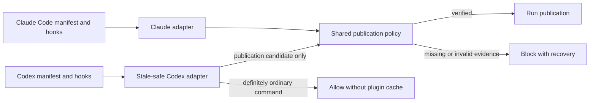

# Cross-host plugin contracts — spec

intent: 2026-09-09-cross-host-plugin-contracts@c974a1a7e
pre-build-review: required — this changes a cross-host publication enforcement boundary and the public package contract for two plugin runtimes

## Requirements

REQ-1 — Native host contracts
  WHEN the loom-code package is installed independently in Codex or Claude Code, the package shall expose skills, manifests, hook configuration, root variables, event matchers, and hook results that conform to that host's documented plugin contracts → Acceptance #1

REQ-2 — Stale Codex cache does not block ordinary work
  WHILE a live Codex task retains a hook definition from an earlier plugin version whose cache directory no longer exists, the hook shall allow a non-publication Bash command without loading any file from that version directory → Acceptance #2

REQ-3 — Publication remains fail-closed
  IF a command may publish commits or create a pull request and the installed checker cannot be loaded THEN the hook shall deny the command with a recovery message rather than bypass publication verification → Acceptance #3

REQ-4 — Cross-host lifecycle proof
  WHEN the package is verified from an unrelated installation path, the verification shall cover fresh start, resume, live-version replacement, removed old cache, ordinary commands, and publication commands for each applicable host contract while asserting the same shared publication-policy outcomes → Acceptance #4

REQ-5 — Independent contract review
  WHEN the specification is ready for planning, a fresh Claude Code reviewer shall independently evaluate both official host contracts and adversarial lifecycle cases before implementation begins → Acceptance #5

## Design decision

Use one shared publication-policy implementation and two host-owned integration surfaces. The Claude Code manifest and hook configuration use Claude Code's documented discovery rules, `${CLAUDE_PLUGIN_ROOT}`, event vocabulary, and result schema. The Codex manifest explicitly selects a Codex hook configuration that uses `PLUGIN_ROOT`, Codex-supported matchers, and Codex result semantics. This is agent-decided because the hosts document overlapping but non-identical contracts, so a shared hook manifest would make compatibility behavior the source of truth.

Keep skill content shared where its behavior is provider-neutral. Where installation paths, runtime tools, invocation syntax, or lifecycle promises differ, use an explicit host-labelled branch and validate it against that host rather than presenting Claude Code behavior as a Codex guarantee. This is agent-decided because duplicating whole skills would create two workflow contracts that can drift.

Make the Codex publication hook stale-safe before it touches versioned files: its retained command must classify an ordinary invocation without loading the old plugin root, return success immediately for definitely non-publication commands, and invoke the shared checker only for publication candidates. Missing or malformed classification and a missing checker remain blocking on the publication path. This is agent-decided because merely replacing `${CLAUDE_PLUGIN_ROOT}` with `PLUGIN_ROOT` leaves both values pinned to the old root in a live process.

Keep Claude Code's version-root execution model instead of adding the Codex stale-cache adapter to it. Claude Code documents that live sessions keep the previous root, retains orphaned versions for a grace period, and provides `/reload-plugins`; using that supported lifecycle avoids a second unnecessary mechanism. This is agent-decided.

Do not add a globally installed launcher, repo-local hook copy, compatibility symlink, old-version forwarding file, or second publication-policy implementation. A global launcher is reserved as a later fallback only if a real Codex lifecycle test proves the retained self-contained hook command cannot satisfy REQ-2 and REQ-3. This is agent-decided because those alternatives create an additional install and cleanup lifecycle before evidence shows it is necessary.

The host boundary is:

## Alternatives considered

- Keep one hooks file with `${PLUGIN_ROOT:-${CLAUDE_PLUGIN_ROOT}}`: rejected because it hides real matcher, lifecycle, and output-contract differences, and both variables remain pinned during a live Codex process.
- Change only Codex references from `CLAUDE_PLUGIN_ROOT` to `PLUGIN_ROOT`: rejected because this improves contract clarity but does not make an already retained command follow a newly installed root.
- Keep previous cache directories or install forwarding files: rejected because correctness would depend on undocumented Codex cache retention and permanent legacy cleanup.
- Install one stable global executable like multi-host permission tools do: deferred because it solves path stability by adding PATH, install, upgrade, and uninstall state that the narrower retained-command adapter may avoid.
- Fail open whenever the checker path is missing: rejected because an update could silently disable the publication boundary.
- Run the complete checker for every Bash invocation: rejected because it recreates the observed failure where an unrelated read is coupled to publication infrastructure.

## Current state evidence

- Forward: `loom-code/.codex-plugin/plugin.json:27` declares the shared skills directory but does not select a Codex-specific hook manifest, leaving default hook discovery to reuse the Claude-shaped file.
- Reverse: `loom-code/hooks/hooks.json:3` registers SessionStart, PreToolUse, and PostToolUse together, and lines 9, 21, and 32 route all three through `${CLAUDE_PLUGIN_ROOT}`.
- Error: `loom-code/scripts/test_hooks_json.py:64` requires every Bash call to enter the checker, while lines 68-75 require the version-root checker command; the tests therefore codify the stale-path failure instead of exercising it.
- Data: `loom-code/scripts/loom_checker.py:2778` reads one PreToolUse JSON object and lines 2808-2832 distinguish publication-shaped commands from ordinary Bash only after the versioned checker has already launched.
- Boundary: `scripts/test_loom_plugin_install_layout.py:1` owns arbitrary-root standalone-install proof, while `scripts/check_plugin_boundaries.py:2` limits cross-plugin filesystem coupling; the change extends those install boundaries but does not alter review, attestation, privacy, CI, or model dispatch policy.

## UI flows

N/A — this engineering change adds no command, screen, argument, or user-authored data format; its observable contract is captured by the install and hook requirements above.
