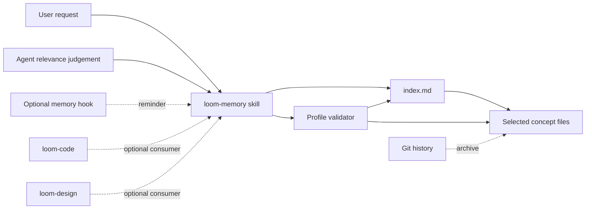

# OKF-compatible loom-memory — spec
intent: 2026-09-10-okf-compatible-loom-memory@c3d0dc26e
pre-build-review: required — this defines a new independently installable plugin, a cross-host knowledge contract, and a migration path for existing repository data

## Requirements

REQ-1 — Independently installable capability
  The `loom-memory` capability shall ship as its own installable plugin with its skill, store template, validator, and any optional hook contained inside that plugin, and its manifests shall declare no mandatory dependency on `loom-code`, `loom-design`, or `loom-workflow` → Acceptance #1, #4

REQ-2 — Symmetric optional consumption
  WHERE `loom-memory` is installed, `loom-code`, `loom-design`, and a user working without either plugin shall be able to invoke the same public memory skill without reading another plugin's private paths → Acceptance #3, #4

REQ-3 — Absence never blocks core Loom
  IF the `loom-memory` plugin is not installed THEN an isolated `loom-code` install shall complete `loom_checker.py intake write-plan <fixture-change-id>` with exit 0 in a fixture repository whose local remote-default ref contains the valid fixture intent, an isolated `loom-design` install shall retain its complete skill and executable surface, and neither result nor installed skill text shall name `loom-memory` as a missing requirement; an absent store or empty recall result shall likewise return a normal no-memory result from `loom-memory` rather than affect either consumer → Acceptance #4

REQ-4 — Passive activation only
  WHEN the user explicitly asks to remember, recall, reconcile, or retire repository knowledge, or the agent independently identifies a concrete need for prior repository experience, the memory skill shall perform the matching operation; no Loom station shall invoke it merely because that station was reached → Acceptance #3, #4

REQ-5 — Optional hook boundary
  WHERE the plugin provides a hook, the hook shall be owned entirely by `loom-memory`, remain optional, and limit itself to a non-blocking relevance reminder or an explicit-memory-operation integrity check; it shall neither author or delete entries nor fail unrelated Loom operations → Acceptance #3, #4, #6

REQ-6 — OKF v0.2 bundle conformance
  The generated repository store shall satisfy OKF v0.2 conformance: every non-reserved Markdown document has parseable YAML frontmatter with a non-empty `type`, and each present reserved `index.md` or `log.md` follows its reserved structure → Acceptance #1

REQ-7 — Declared compatibility profile
  The bundle-root `index.md` shall declare `okf_version: "0.2"`, and the validator and documentation shall call the result an `OKF v0.2-compatible Loom memory profile` rather than claiming implementation of optional OKF services or future versions → Acceptance #1

REQ-8 — Progressive-disclosure index
  WHEN an entry is created, changed, reconciled, migrated, or retired, the plugin shall deterministically regenerate `index.md` from current concept metadata, grouping lesson links by memory type, placing the charter concept under `Guides`, and copying each concept's `description` byte-identically after stripping leading and trailing whitespace on both inputs so an agent can choose documents without loading their bodies → Acceptance #2, #3

REQ-9 — Index remains derived
  IF committed `index.md` differs from a fresh regeneration under REQ-8's normalization rule THEN explicit memory validation shall fail with the mismatched entry or section, while regeneration shall touch only `index.md` and produce byte-identical output on a second unchanged run → Acceptance #1, #2, #6

REQ-10 — Minimum Loom concept schema
  Each Loom memory concept shall contain `type`, `name`, `description`, and at least one `sources[].resource`; `name` shall equal the filename stem, `description` shall be a standalone durable relevance rule, and every `sources` entry shall follow OKF v0.2 provenance structure → Acceptance #1, #2, #5

REQ-11 — Minimum actionable body
  WHEN the skill records a new lesson or semantically edits an existing lesson, it shall author one durable lesson with `Trigger`, `Correct path`, and `Why` sections and include `Limits` only for a real non-applicability boundary; this is a skill-output obligation tested through Record and Reconcile behavior, not a structural validator invariant, and migration alone shall not invent or rewrite those sections in untouched legacy bodies → Acceptance #2, #3, #5

REQ-12 — Optional OKF metadata stays optional
  IF an entry contains optional or unknown OKF metadata THEN read, migration, and round-trip writes shall preserve it without making its absence or unrecognized shape a Loom-profile failure; field-specific validation shall be added only in the same change that makes a Loom operation emit that field → Acceptance #1, #3

REQ-13 — Recall operation
  WHEN recall is requested or independently judged relevant, the skill shall search `index.md` first, open only the bounded set of matching entries, verify that any named file, flag, skill, or command still exists before acting, and treat an absent store or empty result as normal; a store containing concept files but no `index.md` shall fail that explicit recall as structural corruption and direct the user to validate or migrate it → Acceptance #2, #3, #4, #6

REQ-14 — Record operation
  WHEN recording is requested or independently judged useful, the skill shall first classify the candidate as a durable repository lesson rather than an open task, change narrative, verification record, commit-bound decision, or user preference; it shall search for equivalent or contradictory live entries before creating exactly one concept → Acceptance #3

REQ-15 — Reconcile operation
  WHEN a new lesson contradicts or narrows a current entry, the skill shall update that entry or replace it with one current concept rather than create a contradictory sibling, preserving source provenance and regenerating the index → Acceptance #3, #5

REQ-16 — Retire operation
  WHEN an entry is no longer true and has no current replacement value, the skill shall require explicit user approval before deleting it, rely on Git history rather than `log.md` for archival history, and regenerate and validate the index after deletion → Acceptance #3

REQ-17 — Scoped structural failure
  IF a requested memory operation encounters malformed frontmatter, a missing required Loom field, duplicate concept identity, index drift, or a broken index target THEN that operation shall stop with every offender and violated invariant named; the failure shall not install another plugin or block unrelated code or design work → Acceptance #1, #4, #6

REQ-18 — Safe migration of the existing store
  WHEN the existing `docs/loom/memory` store is migrated, the migration shall preserve every lesson body and `description` byte-for-byte, retain every legacy `origin` string verbatim as a `sources[].resource`, add a source describing the full introducing commit for a lesson with no `origin`, assign the generic `type: Memory` rather than invent a narrower classification when legacy `type` is absent, generate `index.md`, and give the existing `README.md` charter the complete concept metadata `type: Memory Store Guide`, `name: README`, a standalone `description`, and a `sources[].resource` naming its full introducing commit; the migration proof shall compare the count and per-body fingerprints of lesson concepts separately from the one guide concept → Acceptance #5

REQ-19 — No duplicate change log
  The profile shall omit `log.md` because Git is the authoritative update history, while remaining conformant because OKF v0.2 makes both `index.md` and `log.md` optional → Acceptance #1, #3, #5

REQ-20 — Git-memory remains separate
  The `git-memory` skill shall continue to own commit- and pull-request-bound Decision, Learning, and Gotcha carriers, while `loom-memory` owns only repository lessons that outlive a change; neither skill shall be a required runtime dependency of the other → Acceptance #3, #4

REQ-21 — Cross-host behavior contract
  WHERE a host supports agent skills and repository file access, the plugin's canonical skill and store schema shall contain no host-specific path or private API, and any host-specific discovery or hook adapter shall remain a separate optional file whose removal leaves Recall, Record, Reconcile, Retire, and validation semantics unchanged → Acceptance #1, #2, #3, #4

REQ-22 — Isolated-install proof
  The existing `scripts/test_loom_plugin_install_layout.py` and `scripts/check_plugin_boundaries.py` harnesses shall be extended, rather than paralleled, to copy each of `loom-memory`, `loom-code`, and `loom-design` into unrelated clean install roots, validate `scripts/fixtures/loom-memory/okf-v0.2/` using only the installed `loom-memory` files, exercise REQ-3's absence case, and reject every mandatory sibling dependency or sibling-private path → Acceptance #1, #4, #6

REQ-23 — Migration is not implicit
  IF the plugin encounters a legacy README-indexed store THEN it shall report that an explicit migration is required without modifying files; the migration command is the only legacy-format reader and shall be removed together with its fixtures after every repository-owned legacy store in this repository has migrated, while installation, session start, recall, and unrelated Loom stations shall never migrate implicitly → Acceptance #4, #5, #6

REQ-24 — Retire the Ship-owned repository-memory action
  WHEN the new plugin is introduced, `loom-code/contract/manifest.yaml` shall retain its public `git-memory` tool declaration but remove every repository-memory coupling: the `docs/loom/memory/**` publication-only path, the Ship-owned `memory` action, the `memory` artifact charter and template pointer, the `docs/loom/memory/**` artifact-type glob, and every `goes_to: memory` routing entry; the same change shall deregister `action:memory` from `docs/loom/evidence/mechanisms.yaml` and update `loom-code/scripts/test_contract_manifest.py`, `loom-code/scripts/test_probes_charter_charter.py`, and any equivalent contract pin so no test expects the retired action, artifact, template, routing, or glob; after the change no Loom station or `loom-code` artifact contract shall claim ownership of the repository memory store, while optional commit-carrier behavior remains wholly described by the public `git-memory` tool → Acceptance #3, #4

REQ-25 — One store-template owner
  WHEN the new plugin is introduced, the repository shall contain exactly one active store template under `loom-memory`, `loom-code/contract/templates/memory-README.md` shall be deleted, and no `loom-code` or `loom-design` runtime contract shall restate or link to the private template or schema → Acceptance #1, #4

REQ-26 — One validator implementation
  WHEN this repository migrates its store, `scripts/check_loom_memory_integrity.py` and its README-index-specific tests shall be retired in the same change that installs the plugin-owned OKF-profile validator and moves their still-valid invariants into that validator's tests; no legacy `--write` path shall remain capable of rewriting the migrated store → Acceptance #1, #5, #6

## Design decision

- **Independent plugin:** Create `loom-memory` as a fourth, standalone Loom-family plugin rather than placing the skill inside `loom-code`, `loom-design`, or `loom-workflow` (user-decided). This gives code and design symmetric access and makes absence a real supported state.
- **Compatibility profile, not wholesale adoption:** Implement the small OKF v0.2 conformance surface plus Loom's actionable lesson contract (user-decided). Optional trust, lifecycle, and computation families stay optional because making them universal would add maintenance without improving ordinary recall.
- **`index.md` is operational; `log.md` is not:** Use the OKF reserved index for progressive disclosure and keep Git as the sole historical log (user-decided). A second chronological file would duplicate history and create drift.
- **Provenance migration:** Replace legacy `origin` in the target profile with OKF `sources`, because `sources[].resource` is the standardized provenance carrier. Preserve every original origin string verbatim even when adding a stronger repository or URL source; when origin is absent, derive only the full introducing commit recorded by Git (agent-decided).
- **Strict profile, explicit migration reader:** Normal operations accept only the new profile; the bounded migration operation alone reads the known legacy README-indexed shape (agent-decided). This prevents installation from becoming a destructive data migration and avoids maintaining two permanent read paths.
- **Charter location:** Keep the existing `README.md` as a `Memory Store Guide` concept and make `index.md` a generated discovery file containing no charter prose (agent-decided). This gives each file one owner and one reason to change.
- **No truth gate:** Deterministic validation proves structure, identity, provenance shape, and index consistency; it does not claim that a lesson is true. Freshness is checked at use time against named repository surfaces, and uncertain semantic conflicts remain agent judgement (agent-decided).
- **Hook is removable:** The complete mechanism works through the skill alone. Any hook is an optional adapter and cannot become the only discovery, write, or validation path (agent-decided).

The solid path is the complete mechanism. Dashed edges are optional callers or historical support; removing any dashed edge leaves Recall, Record, Reconcile, Retire, and validation usable.

## Alternatives considered

- Keep `loom-memory` inside `loom-code`: rejected because `loom-design` would depend on a sibling plugin's private implementation or receive asymmetric behavior.
- Put `loom-memory` inside `loom-workflow`: rejected because installation of a broad workflow toolbox would still be required for one optional shared capability.
- Keep the current README-only store without OKF compatibility: rejected because it preserves local behavior but gives external consumers no declared portable contract.
- Adopt every OKF v0.2 optional field: rejected because verification actors, timestamps, lifecycle state, and computation attestations do not apply uniformly to durable workflow lessons.
- Require `log.md`: rejected because Git already supplies attribution, history, and diffs and two histories can diverge.
- Automatically preload all entries: rejected because it removes progressive disclosure, consumes context for unrelated work, and increases exposure to stale or irrelevant lessons.
- Use embeddings or a vector database: rejected because the current corpus is repository-local and greppable, and an external retrieval service would add a runtime dependency before measured need exists.
- Attach mandatory memory calls to fixed Loom stations: rejected because reaching a station is not evidence that relevant memory exists and would turn an optional capability into workflow ceremony.

## Current state evidence

- Forward: `loom-code/contract/manifest.yaml` under `actions: - name: memory` currently assigns memory to Ship and describes it as a before-push action.
- Reverse: `loom-code/skills/ship/SKILL.md` under `Use loom-workflow:git-memory` currently performs memory classification within the publication station.
- Error: `scripts/check_loom_memory_integrity.py` under `The five invariants` treats `README.md` as the index and excludes only that filename, so it neither implements OKF reserved-file semantics nor validates the required `type` field.
- Data: `docs/loom/memory/README.md` under `Format — one fact per file` defines `name`, `description`, `type`, and `origin`, while the current store contains legacy entries that predate or omit parts of that shape.
- Boundary: `scripts/check_plugin_boundaries.py` under its plugin-boundary rules and `scripts/test_loom_plugin_install_layout.py` under `MANDATORY_DEPENDENCY_KEYS` already establish that installable Loom roots may not depend on sibling-private files or mandatory sibling plugins.

Normative external baseline: [Open Knowledge Format v0.2 at commit 62432a095456147ee71e70ac6e4dc0d2dea3ac30](https://github.com/GoogleCloudPlatform/knowledge-catalog/blob/62432a095456147ee71e70ac6e4dc0d2dea3ac30/okf/SPEC.md). This specification locally fixes the compatibility clauses to: (1) every non-reserved Markdown file has parseable YAML frontmatter; (2) each such frontmatter has a non-empty `type`; (3) a present `index.md` or `log.md` follows its reserved structure; (4) missing optional metadata, unknown types, unknown extra keys, broken cross-links, and a missing `index.md` do not make a generic OKF bundle nonconformant; (5) the Loom profile may impose its own required `index.md`, metadata, and body contract; and (6) the only frontmatter permitted on the bundle-root `index.md` is `okf_version: "0.2"`. A later upstream edit or OKF version has no effect until a separate change updates this pinned baseline.

## UI flows

N/A — this is an internal skill, file-format, and plugin-boundary change with no GUI, TUI, CLI argument, or external API surface covered by the repository's declared interface globs.
