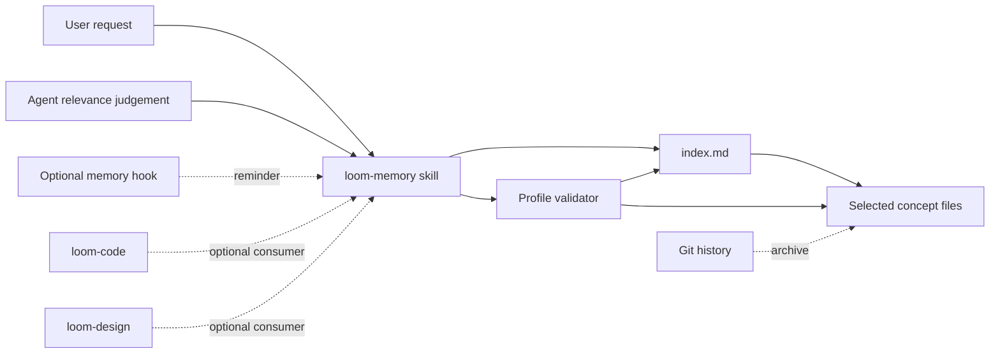

# OKF-compatible loom-memory — spec
intent: 2026-09-10-okf-compatible-loom-memory@c3d0dc26e
pre-build-review: required — this defines a new independently installable plugin, a cross-host knowledge contract, and a migration path for existing repository data

## Requirements

REQ-1 — Independently installable capability
  The `loom-memory` capability shall ship as its own installable plugin with its skill, store template, validator, and any optional hook contained inside that plugin, and its manifests shall declare no mandatory dependency on `loom-code`, `loom-design`, or `loom-workflow` → Acceptance #1, #4

REQ-2 — Symmetric optional consumption
  WHERE `loom-memory` is installed, `loom-code`, `loom-design`, and a user working without either plugin shall be able to invoke the same public memory skill without reading another plugin's private paths → Acceptance #3, #4

REQ-3 — Absence never blocks core Loom
  IF the `loom-memory` plugin is not installed, the repository store is absent, or recall finds no relevant entry THEN `loom-code` and `loom-design` shall continue their requested work without an error, installation prompt, degraded-verification claim, or mandatory fallback → Acceptance #4

REQ-4 — Passive activation only
  WHEN the user explicitly asks to remember, recall, reconcile, or retire repository knowledge, or the agent independently identifies a concrete need for prior repository experience, the memory skill shall perform the matching operation; no Build, Review, Ship, capture-intent, or write-spec station shall invoke it merely because that station was reached → Acceptance #3, #4

REQ-5 — Optional hook boundary
  WHERE the plugin provides a hook, the hook shall be owned entirely by `loom-memory`, remain optional, and limit itself to a non-blocking relevance reminder or an explicit-memory-operation integrity check; it shall neither author or delete entries nor fail unrelated Loom operations → Acceptance #3, #4, #6

REQ-6 — OKF v0.2 bundle conformance
  The generated repository store shall satisfy OKF v0.2 conformance: every non-reserved Markdown document has parseable YAML frontmatter with a non-empty `type`, and each present reserved `index.md` or `log.md` follows its reserved structure → Acceptance #1

REQ-7 — Declared compatibility profile
  The bundle-root `index.md` shall declare `okf_version: "0.2"`, and the validator and documentation shall call the result an `OKF v0.2-compatible Loom memory profile` rather than claiming implementation of optional OKF services or future versions → Acceptance #1

REQ-8 — Progressive-disclosure index
  WHEN an entry is created, changed, reconciled, migrated, or retired, the plugin shall deterministically regenerate `index.md` from current entry metadata, grouping links by memory type and copying each entry's `description` exactly so an agent can choose entries without loading their bodies → Acceptance #2, #3

REQ-9 — Index remains derived
  IF committed `index.md` differs from a fresh regeneration THEN explicit memory validation shall fail with the mismatched entry or section, while regeneration shall preserve the charter prose and produce byte-identical output on a second unchanged run → Acceptance #1, #2, #6

REQ-10 — Minimum Loom concept schema
  Each Loom memory concept shall contain `type`, `name`, `description`, and at least one `sources[].resource`; `name` shall equal the filename stem, `description` shall be a standalone durable relevance rule, and every `sources` entry shall follow OKF v0.2 provenance structure → Acceptance #1, #2, #5

REQ-11 — Minimum actionable body
  Each Loom memory concept body shall state one durable lesson and contain `Trigger`, `Correct path`, and `Why` sections, with `Limits` included only when a real non-applicability boundary exists → Acceptance #2, #3, #5

REQ-12 — Optional OKF metadata stays optional
  IF an entry uses OKF `generated`, `verified`, `status`, `stale_after`, tags, or source credibility fields THEN validation shall enforce the corresponding OKF v0.2 shape; otherwise their absence shall not block storage, retrieval, or use → Acceptance #1, #3

REQ-13 — Recall operation
  WHEN recall is requested or independently judged relevant, the skill shall search `index.md` first, open only the bounded set of matching entries, verify that any named file, flag, skill, or command still exists before acting, and treat an empty result as normal → Acceptance #2, #3, #4

REQ-14 — Record operation
  WHEN recording is requested or independently judged useful, the skill shall first classify the candidate as a durable repository lesson rather than an open task, change narrative, verification record, commit-bound decision, or user preference; it shall search for equivalent or contradictory live entries before creating exactly one concept → Acceptance #3

REQ-15 — Reconcile operation
  WHEN a new lesson contradicts or narrows a current entry, the skill shall update that entry or replace it with one current concept rather than create a contradictory sibling, preserving source provenance and regenerating the index → Acceptance #3, #5

REQ-16 — Retire operation
  WHEN an entry is no longer true and has no current replacement value, the skill shall require explicit user approval before deleting it, rely on Git history rather than `log.md` for archival history, and regenerate and validate the index after deletion → Acceptance #3

REQ-17 — Scoped structural failure
  IF a requested memory operation encounters malformed frontmatter, a missing required Loom field, duplicate concept identity, index drift, or a broken index target THEN that operation shall stop with every offender and violated invariant named; the failure shall not install another plugin or block unrelated code or design work → Acceptance #1, #4, #6

REQ-18 — Safe migration of the existing store
  WHEN the existing `docs/loom/memory` store is migrated, the migration shall preserve every entry body and `description`, map each legacy `origin` into at least one `sources[].resource`, add missing `type` values without inventing semantics, generate `index.md`, retain the charter as an OKF concept or equivalent non-conflicting document, and prove before/after entry counts and content fingerprints → Acceptance #5

REQ-19 — No duplicate change log
  The profile shall omit `log.md` because Git is the authoritative update history, while remaining conformant because OKF v0.2 makes both `index.md` and `log.md` optional → Acceptance #1, #3, #5

REQ-20 — Git-memory remains separate
  The `git-memory` skill shall continue to own commit- and pull-request-bound Decision, Learning, and Gotcha carriers, while `loom-memory` owns only repository lessons that outlive a change; neither skill shall be a required runtime dependency of the other → Acceptance #3, #4

REQ-21 — Cross-host behavior contract
  WHERE a host supports agent skills and repository file access, the plugin shall expose the same Recall, Record, Reconcile, and Retire meanings and the same store artifacts on Claude Code, Codex, and Gemini-compatible consumers, with host adapters limited to discovery or optional hooks → Acceptance #1, #2, #3, #4

REQ-22 — Isolated-install proof
  The package verification shall copy each of `loom-memory`, `loom-code`, and `loom-design` into unrelated clean install roots and prove that `loom-memory` can validate and use a fixture store alone and that the other two plugins retain their normal declared surfaces without it → Acceptance #1, #4, #6

REQ-23 — Migration is not implicit
  IF the plugin encounters a legacy README-indexed store THEN recall shall remain read-compatible, while any rewrite or migration shall require an explicit memory migration operation and shall not occur during plugin installation, session start, or an unrelated Loom station → Acceptance #4, #5, #6

## Design decision

- **Independent plugin:** Create `loom-memory` as a fourth, standalone Loom-family plugin rather than placing the skill inside `loom-code`, `loom-design`, or `loom-workflow` (user-decided). This gives code and design symmetric access and makes absence a real supported state.
- **Compatibility profile, not wholesale adoption:** Implement the small OKF v0.2 conformance surface plus Loom's actionable lesson contract (user-decided). Optional trust, lifecycle, and computation families stay optional because making them universal would add maintenance without improving ordinary recall.
- **`index.md` is operational; `log.md` is not:** Use the OKF reserved index for progressive disclosure and keep Git as the sole historical log (user-decided). A second chronological file would duplicate history and create drift.
- **Provenance migration:** Replace legacy `origin` in the target profile with OKF `sources`, because `sources[].resource` is the standardized provenance carrier. Preserve the original origin text as the resource when no stronger repository or URL reference can be derived; do not fabricate a resolvable citation (agent-decided).
- **Strict profile, permissive reader:** New and migrated entries must meet the Loom profile, but recall remains capable of reading the legacy README-indexed shape until an explicit migration occurs (agent-decided). This prevents installation from becoming a destructive data migration.
- **No truth gate:** Deterministic validation proves structure, identity, provenance shape, and index consistency; it does not claim that a lesson is true. Freshness is checked at use time against named repository surfaces, and uncertain semantic conflicts remain agent judgement (agent-decided).
- **Hook is removable:** The complete mechanism works through the skill alone. Any hook is an optional adapter and cannot become the only discovery, write, or validation path (agent-decided).

The solid path is the complete mechanism. Dashed edges are optional callers or historical support; removing any dashed edge leaves Recall, Record, Reconcile, Retire, and validation usable.

## Alternatives considered

- Keep `loom-memory` inside `loom-code`: rejected because `loom-design` would depend on a sibling plugin's private implementation or receive asymmetric behavior.
- Put `loom-memory` inside `loom-workflow`: rejected because installation of a broad workflow toolbox would still be required for one optional shared capability.
- Keep the current README-only store without OKF compatibility: rejected because it preserves local behavior but gives external consumers no declared portable contract.
- Adopt every OKF v0.2 optional field: rejected because verification actors, timestamps, lifecycle state, and computation attestations do not apply uniformly to durable workflow lessons.
- Require `log.md`: rejected because Git already supplies attribution, history, and diffs and two histories can diverge.
- Automatically preload all entries: rejected because it removes progressive disclosure, consumes context for unrelated work, and increases exposure to stale or irrelevant lessons.
- Use embeddings or a vector database: rejected because the current corpus is repository-local and greppable, and an external retrieval service would add a runtime dependency before measured need exists.
- Attach mandatory memory calls to fixed Loom stations: rejected because reaching a station is not evidence that relevant memory exists and would turn an optional capability into workflow ceremony.

## Current state evidence

- Forward: `loom-code/contract/manifest.yaml` under `actions: - name: memory` currently assigns memory to Ship and describes it as a before-push action.
- Reverse: `loom-code/skills/ship/SKILL.md` under `Use loom-workflow:git-memory` currently performs memory classification within the publication station.
- Error: `scripts/check_loom_memory_integrity.py` under `The five invariants` treats `README.md` as the index and excludes only that filename, so it neither implements OKF reserved-file semantics nor validates the required `type` field.
- Data: `docs/loom/memory/README.md` under `Format — one fact per file` defines `name`, `description`, `type`, and `origin`, while the current store contains legacy entries that predate or omit parts of that shape.
- Boundary: `scripts/check_plugin_boundaries.py` under its plugin-boundary rules and `scripts/test_loom_plugin_install_layout.py` under `MANDATORY_DEPENDENCY_KEYS` already establish that installable Loom roots may not depend on sibling-private files or mandatory sibling plugins.

Normative external baseline: [Open Knowledge Format v0.2](https://github.com/GoogleCloudPlatform/knowledge-catalog/blob/main/okf/SPEC.md), especially bundle structure, concept frontmatter, provenance, reserved index/log files, conformance, and versioning. If that upstream specification changes, this specification remains pinned to v0.2 until a separate change explicitly adopts another version.

## UI flows

N/A — this is an internal skill, file-format, and plugin-boundary change with no GUI, TUI, CLI argument, or external API surface covered by the repository's declared interface globs.
