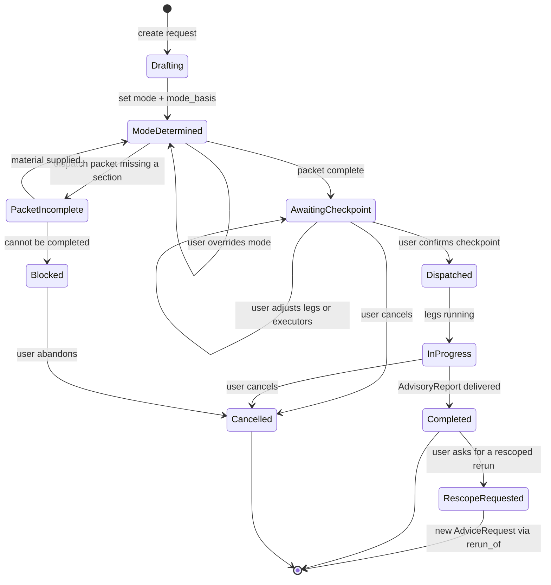
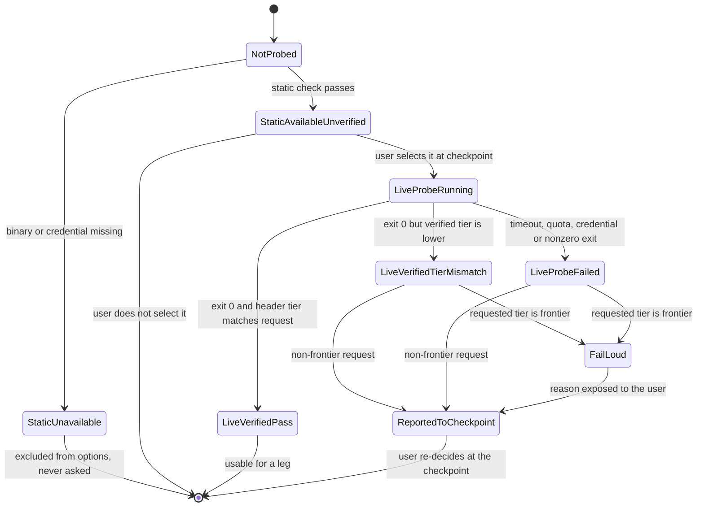
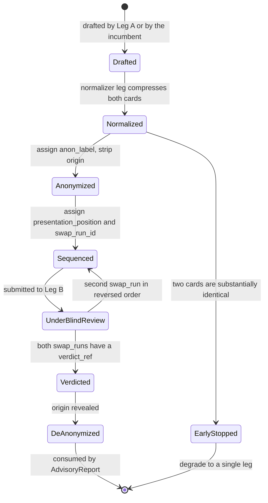
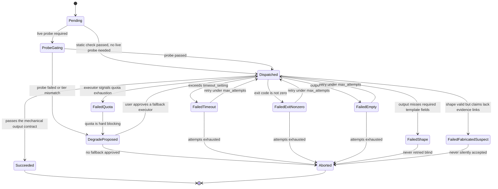
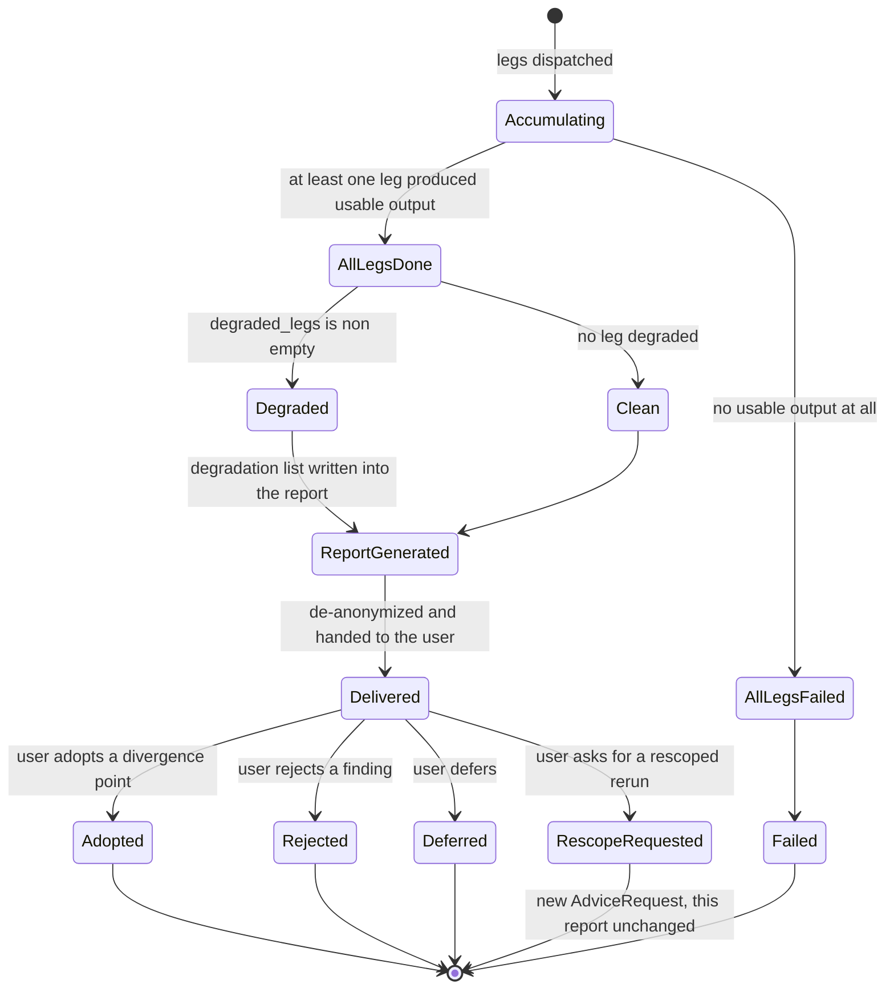
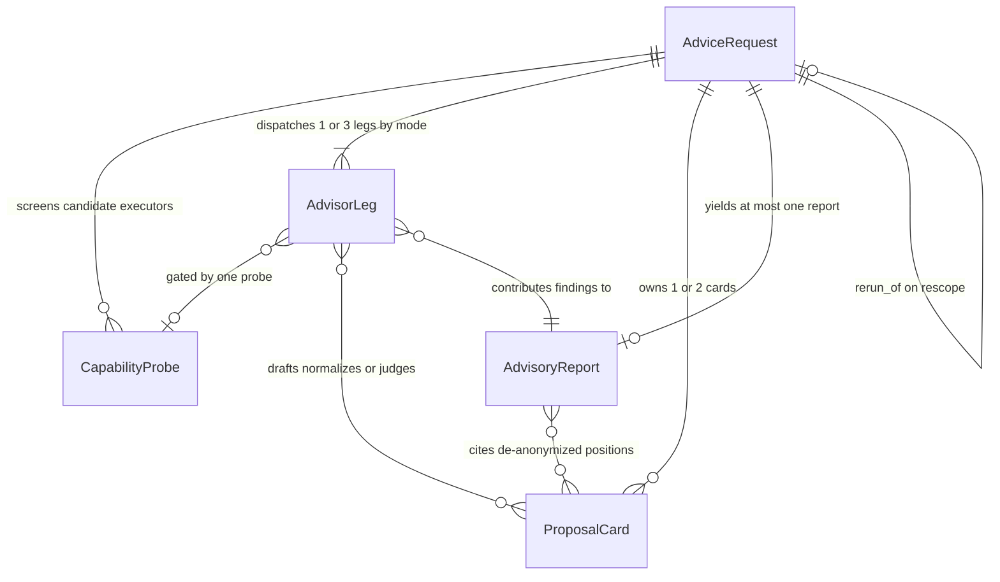

# independent-advisor — spec expansion proposal

- change-id: `2026-08-28-independent-advisor`
- 種子來源：2026-08-28 對話中談定的設計（雙模式、三腿、兩層偵測、單一檢查點）
- 治理caveat：**no PRINCIPLES — spec is unconstrained**。monkey-skills 依
  `docs/loom/KICKOFF-DEFAULTS.md` 的常設選擇刻意不維護 `docs/loom/PRINCIPLES.md`，
  因此本規格沒有憲章層約束 fan-out 範圍與 NFR 姿態。

## USM backbone

單一表面工具（一支 skill 的一次諮詢），但旅程有真實的多階段時序，故主幹不塌縮為單節點。

| # | 旅程步驟 | 主要角色 | 產出 | provenance |
|---|---|---|---|---|
| 1 | 使用者請求獨立評估 | 使用者 | 意圖 + 標的 | seeded |
| 2 | 判定模式（explore／audit）並容許使用者覆寫 | 主控 agent | 模式決定 + 判定依據一行 | seeded |
| 3 | 組派工包（決策陳述／已否決選項／證據路徑／現行提案） | 主控 agent | 派工包 | seeded |
| 4 | 靜態偵測可用執行者 | 主控 agent | 候選執行者集合 | seeded |
| 5 | 單一檢查點：確認腿數＋執行者＋成本 | 使用者 | 已核准的執行計畫 | seeded |
| 6 | 活體探針驗證所選執行者 | 主控 agent | 探針結果 | seeded |
| 7 | Leg A 全盲提案（僅 explore 模式） | 提案腿 | 挑戰方案 | seeded |
| 8 | 正規化：匿名化＋順序對消 | 正規化器 | 方案卡組 | seeded（順序對消為 critic-found，見下） |
| 9 | Leg B 對稱盲審 | 盲審腿 | 每張卡的裁決 | seeded |
| 10 | 解匿名並產出報告（分歧點優先） | 主控 agent | 諮詢報告 | seeded |
| 11 | 使用者裁決 | 使用者 | 採納／駁回／擱置 | inferred |

### 導覽圖（typed edges，供 0-switch 走訪）

| 從 | 到 | 邊型別 | 觸發條件 |
|---|---|---|---|
| 1 | 2 | forward | 請求成立 |
| 2 | 3 | forward | 模式已定 |
| 2 | 2 | retry_self | 使用者覆寫模式 |
| 3 | 4 | forward | 派工包齊備 |
| 3 | 11 | abandon | 派工包缺關鍵素材且無法補齊 |
| 4 | 5 | forward | 至少一個候選執行者 |
| 4 | 11 | error_escape | 候選集為空（無任何可用外部執行者） |
| 5 | 6 | forward | 使用者核准含跨廠商 |
| 5 | 7 | skip | 使用者核准但只用同 host 執行者（免探針） |
| 5 | 11 | abandon | 使用者取消 |
| 5 | 4 | back | 使用者要求改變執行者組合 |
| 6 | 7 | forward | 探針通過且 explore 模式 |
| 6 | 8 | skip | 探針通過且 audit 模式（無提案腿） |
| 6 | 5 | error_escape | 探針失敗 → 帶著失敗原因回到檢查點重選 |
| 7 | 8 | forward | 提案產出 |
| 7 | 9 | skip | 提案與現行方案實質相同 → 早停，退化為單腿 |
| 8 | 9 | forward | 方案卡就緒 |
| 9 | 10 | forward | 裁決齊備 |
| 9 | 9 | retry_self | 順序對消的第二輪 |
| 10 | 11 | forward | 報告送達 |
| 10 | 3 | resume_reenter | 使用者要求換範圍重跑 |

## OOUX object model

五份分頭產出的物件模型合併於此。合併時發現的跨物件矛盾，逐條在 §裁決紀錄
列出；本章節內容一律採用裁決後的版本。

### 物件清單

| 物件 | 一句話職責 | 終態 | provenance |
|---|---|---|---|
| `AdviceRequest` | 承載一次諮詢的模式、判定依據、派工包與範圍邊界，是整條旅程的擁有者 | 有（`Completed` / `Cancelled`） | seeded |
| `CapabilityProbe` | 只回答「這個執行者現在能不能用、是不是它宣稱的能力等級」 | 有（可選／不可選） | seeded |
| `ProposalCard` | 被壓成同一模板、匿名化、排序過的方案卡，是盲審的唯一輸入 | 有（`DeAnonymized` / `EarlyStopped`） | seeded |
| `AdvisorLeg` | 一次外部執行者派工的生命週期與輸出契約 | 有（`Succeeded` / `Aborted`） | seeded |
| `AdvisoryReport` | 解匿名後交付使用者的唯讀歷史記錄，以分歧點為主體 | 有（`Delivered` 後的使用者裁決態） | seeded |

### 裁決紀錄（跨物件矛盾）

1. **早停時機衝突**（advice-request.md × proposal-card.md）
   前者：`Dispatched --> EarlyStopped`（派工之後）；後者：「`EarlyStopped` 只能從
   `Normalized` 觸發」。**採用 proposal-card 版**——種子把早停敘述緊接在正規化步驟
   之後，且「實質相同」的判斷前提是兩案已被壓成可比較的同模板。（seeded）

2. **腿的組成衝突**（advice-request.md × advisor-leg.md）
   前者：三腿＝Leg A ＋每腿一張卡；後者：「explore：Leg A + 2 次 Leg B 順序對消」。
   **兩者都不採**——種子逐字寫「三腿」為①全盲提案②正規化③對稱盲審。順序對消是
   Leg B **腿內**的兩個 `swap_run`，不是第二條腿。`role` enum 因此補上 `normalizer`。（seeded）

3. **`mode_basis` vs `mode_rationale`**（advice-request.md × advisory-report.md）
   同一概念兩個名字。**採用 `mode_basis`**，`AdviceRequest` 是擁有者，報告只複製不改名。（inferred）

4. **`early_stop_triggered` vs `early_stopped`**（advice-request.md × advisory-report.md）
   **採用 `early_stopped`**（布林欄位慣例，且報告欄位要與請求欄位同名才能機械對帳）。（inferred）

5. **tier 型別衝突**（capability-probe.md × advisor-leg.md）
   前者把 `requested_tier` 寫成「enum × effort」的單一值，後者寫成
   `{cost_tier, effort_tier}` 結構。**採用 advisor-leg 的結構化配對**——種子的 tier 詞彙
   本來就是兩個獨立軸（economy/standard/frontier × low/medium/high），壓成單值會讓
   `tier_mismatch` 無法指出是哪一軸掉下來。（seeded）

6. **effort 列舉衝突**（capability-probe.md 的 `low|medium|high|xhigh|max` × advisor-leg.md 的 `low|medium|high`）
   **兩者都保留但改名分家**：`cli_effort_arg`（claude CLI 實際參數，五值，seeded）
   與 `effort_tier`（repo tier 詞彙，三值，seeded）是不同層的東西，混用會逼人自創詞彙。
   映射表種子未給，列為開放問題。（inferred）

7. **降級職責重疊**（capability-probe.md × advisor-leg.md）
   兩份各自宣稱擁有「降級」判斷。**裁決**：`CapabilityProbe` 只產出「可用／不可用／
   tier 不符」的事實；「要不要降級重派」是 `AdvisorLeg` 的 CTA，且必須先經使用者。（inferred）

8. **frontier 降級與重試打架**（capability-probe.md 不變式 3 × advisor-leg.md 降級重派 CTA）
   前者：frontier 未驗證必須 fail loud，不得靜默改用低 tier；後者允許
   「`verified_tier` 低於 `requested_tier` → 降級重派」。**採用 fail-loud 優先**——
   降級只能是 fail loud **之後**、使用者明確再確認低 tier 的動作，不是自動路徑。（seeded）

9. **卡片歸屬基數衝突**（advisory-report.md「AdvisorLeg 各自產出 1 ProposalCard」×
   proposal-card.md「卡片是被多條腿依序處理的共享物件」）
   **採用 proposal-card 版**——若卡片歸某條腿所有，`normalized_by` 與 `verdict_ref`
   會被併成一個「作者」欄位，匿名化與正規化的職責分離就沒了。（seeded）

10. **報告的生命週期越界**（advisory-report.md 狀態機含 `Requested`/`ModeJudged`/
    `CheckpointPending` × advice-request.md 同名階段）
    同一段旅程被兩個物件各自建模。**裁決**：檢查點之前的狀態歸 `AdviceRequest`；
    `AdvisoryReport` 的狀態機從 `Accumulating` 起算。（inferred）

11. **探針關係基數衝突**（advice-request.md「AdviceRequest→CapabilityProbe 一對多」×
    capability-probe.md「經 AdvisorLeg 間接關聯」）
    **採用直接一對多**——靜態層在腿存在之前就要跑（要組候選清單），掛在腿下會沒有歸屬。（seeded）

### AdviceRequest

承重欄位：`mode`、`mode_basis`、`mode_override`、`target`、`dispatch_packet`（四段）、
`scope_boundary`、`leg_count`、`leg_executors`、`estimated_cost`、`early_stopped`、
`rerun_of`。



不變式：

1. `mode_basis` 必須是可查事實原文（commit / PR / 使用者原句），不可是需要二次判斷的
   散文。**保護**：使用者能機械覆核並否決模式判定。（seeded）
2. `mode_override=true` 時 `mode` 等於使用者指定值，且原判定依據不得被抹除。
   **保護**：稽核鏈完整——覆寫是額外事實，不是取代事實。（inferred）
3. `mode=audit` ⇒ `leg_count=1`；`mode=explore` ⇒ 預設 3，早停或使用者調整後才可為其他值。
   **保護**：腿數與模式不會各自漂移。（seeded）
4. `len(leg_executors) == leg_count`，且每個執行者已通過靜態偵測。
   **保護**：沒過靜態偵測的執行者連問都不問。（seeded）
5. 進入 `Dispatched` 前派工包四段皆不可為空。**保護**：半成品派工包不會被送出去。（seeded）
6. 一個 `AdviceRequest` 至多一份 `AdvisoryReport`；換範圍重跑開新請求並以 `rerun_of` 串接，
   原筆不回改。**保護**：歷史花費不被重跑掩蓋。（inferred）

### CapabilityProbe

承重欄位：`host`、`model`、`cli_effort_arg`、`requested_tier{cost_tier,effort_tier}`、
`static_check_status`、`live_probe_status`、`verified_model`、`verified_effort`、
`verified_tier`、`tier_mismatch`、`available_for_selection`。



不變式：

1. `static_check_status != pass` 的候選絕不進入選項清單。**保護**：不浪費使用者的一次提問。（seeded）
2. 活體探針只能在使用者明確選定後執行。**保護**：成本不對稱（靜態免費／活體要錢）。（seeded）
3. `requested_tier.cost_tier == frontier` 且探針未通過或 `tier_mismatch` ⇒ 必須 fail loud
   並攤開具體失敗原因。**保護**：使用者不會拿到偽裝成 frontier 的低 tier 結果。（seeded）
4. 成敗判定必須取探針指令本身的 exit code，不可被 `| tail` 之類管線末端覆蓋。
   **保護**：不會把管線的成功誤當成執行者的成功。（seeded）
5. 未取得 `verified_model` / `verified_effort` 不得判 `pass`。**保護**：exit 0 不等於能力等級屬實。（inferred）
6. `static_check_status == pass` 只解鎖「可嘗試活體探針」，不等價於「已驗證可用」。
   **保護**：靜態結果不被下游當成驗證結論。（seeded）

### ProposalCard

承重欄位：`card_id`、`origin`（`incumbent`/`challenger`）、`anon_label`、
`presentation_position`、`swap_run_id`、四模板欄（`core_claim` / `key_assumption` /
`failure_mode` / `cost`）、`normalized_by`、`normalized_by_is_incumbent_author`、`verdict_ref`。



不變式：

1. `origin` 對任何送交 Leg B 的卡片副本完全不可讀，含間接洩漏（語域、篇幅、人稱殘留）。
   **保護**：身份偏好（self-preference）不進審查。（seeded）
2. explore 的每一對卡必須被兩個 `swap_run_id`（正序＋反序）覆蓋才可進 `Verdicted`；
   不得以 prompt 提醒替代。**保護**：位置偏好——種子量測顯示提醒法只把 68% 拉到 58%，
   只有結構性 swap 有效。（seeded）
3. 早停只能從 `Normalized` 觸發（裁決 1）。**保護**：「實質相同」的判斷有可比較的前提。（seeded）
4. 解匿名只能在所有已排入的 `swap_run_id` 都回填 `verdict_ref` 之後、且只能一次。
   **保護**：不存在「先解匿名再等剩餘 verdict」的洩漏路徑。（inferred）
5. 卡片不擁有 verdict 內容，進入 `Verdicted` 後四模板欄不可再編輯。
   **保護**：後段步驟不回寫前段資料，稽核性成立。（inferred）
6. `normalized_by_is_incumbent_author = true` 必須在報告中原樣攤開。
   **保護**：正規化者與現任作者的利益衝突不被靜默通過。（inferred）

### AdvisorLeg

承重欄位：`leg_id`、`role`（`proposer` / `normalizer` / `blind_judge` / `auditor`）、
`mode`、`executor_binding{vendor, invocation}`、`requested_tier`、`verified_tier`、
`blind_scope`、`input_dispatch_ref`、`output_ref`、`exit_code`、`cost_actual`、
`attempt_count` / `max_attempts`、`probe_result`。



不變式：

1. `role=proposer` ⇒ `blind_scope=problem_only`；派工包若含現行方案的任何描述，該腿即刻
   `Aborted` 不得補救。**保護**：Leg A 的全盲性——不盲就沒有獨立提案。（seeded）
2. `role=blind_judge` ⇒ `blind_scope=two_cards_anonymized`，且匿名化與順序對消都已完成。
   **保護**：兩種偏差是不同控制，缺一即失效。（seeded）
3. `role=auditor` ⇒ `blind_scope=full_context`，這是設計內而非違規。
   **保護**：audit 模式要打擊現行方案，必須看得到它。（seeded）
4. 輸出寫進報告前必須通過機械輸出契約（`exit_code == 0` → 非空 → 非拒答 →
   模板欄齊全 → 未複述輸入 → 主張有可查依據）；腿自稱完成不構成通過。
   **保護**：「回傳是收據不是工作」。（seeded）
5. `requested_tier` 與 `verified_tier` 必須分開存放，frontier 不符即 fail loud（裁決 8）。
   **保護**：靜默降級無處藏身。（seeded）
6. `attempt_count >= max_attempts` 必轉 `Aborted` 並攤開，不得靜默放棄。
   **保護**：不可無限重試，失敗要被看見。（seeded）
7. 每條腿的輸出必須保留推理痕跡而不只是結論。**保護**：下游才能判斷多腿一致是
   「獨立」還是「同質」。（inferred）

### AdvisoryReport

承重欄位：`mode`、`mode_basis`、`leg_count`、`early_stopped`、`verdict`（三值）、
`divergence_points[]`、`findings[]`（每筆含 `category` / `confidence` /
`concrete_change` / `source_leg_id` / `corroborated_by`）、`known_weaknesses[]`、
`degraded_legs[]`、`actual_cost`、`coverage_disclaimer`、`anonymization_note`、
`source_request_id`。

`verdict ∈ { CHALLENGER_PREFERRED, INCUMBENT_HOLDS, INCONCLUSIVE }`；`INCONCLUSIVE`
是預設安全值，不需要任何 finding 即可成立。



不變式：

1. `corroborated_by` 只能如實列出哪幾腿提出，不得附加「因此更可信」；`confidence`
   的判定不得把「被幾腿提及」當輸入。**保護**：兩腿都同意是在量樣本不是量世界。（seeded）
2. 任一腿降級或失敗必寫入 `degraded_legs`，且必須先經 `Degraded` 狀態才能產出報告。
   **保護**：不存在「靜默跳過一腿、報告當三腿跑完」的路徑。（seeded）
3. 全報告禁用「完整／全面／窮盡」類措辭（可關鍵字掃描）。**保護**：不宣稱覆蓋完整。（seeded）
4. `known_weaknesses` 至少含一條固定樣板：匿名化與順序對消只消除審查者之間的相對
   偏好差異，無法偵測所有審查者共享的系統性盲點。**保護**：ensemble 治不了群體共有偏差。（seeded）
5. `actual_cost` 記錄實際發生的花費（含失敗腿已付的探針成本），早停省下的花費不可倒填
   成預估值。**保護**：花費據實回報，重跑不掩蓋歷史。（seeded）
6. Adopt / Reject / Defer 只在項目上附加 `resolution_status`，不改 `verdict` /
   `findings` / `actual_cost`。**保護**：報告是唯讀歷史記錄。（inferred）

### 關係圖



### 開放問題（種子未給，不發明）

- `verified_model` / `verified_effort` → tier 的換算對照表（capability-probe.md）。
- claude headless 是否像 codex 一樣自報 model / reasoning effort（僅 codex 已實測）。
- `max_attempts` 具體數值，以及輸出契約各門檻（`word_count` / `echoes_input_ratio` /
  `claim_evidence_linkage` 覆蓋率）。
- `cli_effort_arg`（五值）與 `effort_tier`（三值）之間的映射（裁決 6 帶出）。
- `AdviceRequest` 是否需要顯式 `id` 欄位及其格式。

## Path × edge matrix

先機械展開 `USM backbone 步驟 × 物件 × CTA × 狀態` 的 cartesian grid（刻意過度生成），
再用六個 lens 逐格裁決。DROP 的格子不入表；`Lens verdict` 只有 keep 與 flag 兩值。
覆蓋度僅相對於「種子 + 6 個 lens」而言，不主張超出這個範圍。

lens 縮寫：`ST`＝狀態轉移合法性、`BVA`＝邊界值、`CRUD`＝持久化操作、
`PERM`＝權限／角色、`EEL`＝空/錯誤/載入、`NFR`＝規模/安全/併發/時序義務。

| Backbone step | Object | CTA | State | Lens verdict | Expected reaction |
|---|---|---|---|---|---|
| 2 | AdviceRequest | determine mode | `Drafting → ModeDetermined` | keep（ST，seeded） | 寫入 `mode` 與 `mode_basis` 原文一行；依據必須是可查事實 |
| 2 | AdviceRequest | user overrides mode | `ModeDetermined → ModeDetermined` | keep（ST/PERM，seeded） | `mode_override=true`，原判定依據保留不抹除 |
| 2 | AdviceRequest | determine mode with no citable fact | `Drafting` | flag（ST，inferred） | 種子未定「找不到可查事實」時的行為；暫定不得自行編造依據，須降級為問使用者 |
| 2 | AdviceRequest | user overrides to `audit` after 3 legs approved | `AwaitingCheckpoint` | flag（ST，inferred） | 腿數需回落為 1；種子未言明既有核准是否作廢 |
| 3 | AdviceRequest | assemble dispatch packet | `ModeDetermined → AwaitingCheckpoint` | keep（ST，seeded） | 四段齊備才可前進 |
| 3 | AdviceRequest | assemble packet missing one section | `→ PacketIncomplete` | keep（EEL，seeded） | 指名缺哪一段，不得以空字串填充 |
| 3 | AdviceRequest | packet cannot be completed | `PacketIncomplete → Blocked` | keep（ST，seeded） | 攤開缺口並讓使用者放棄（走 `3 → 11` abandon 邊） |
| 3 | AdviceRequest | packet contains 現行方案描述 while `mode=explore` | `AwaitingCheckpoint` | keep（PERM，seeded） | 這份 packet 不得餵給 `role=proposer` 的腿；否則該腿即刻 `Aborted` |
| 3 | AdviceRequest | packet 恰含 0 個已否決選項 | `AwaitingCheckpoint` | keep（BVA，inferred） | 空的已否決清單合法，但必須顯式標示為空而非省略欄位 |
| 4 | CapabilityProbe | static check passes | `NotProbed → StaticAvailableUnverified` | keep（ST，seeded） | 進入候選清單，但不得被下游當成「已驗證」 |
| 4 | CapabilityProbe | binary missing (`command -v codex` 失敗) | `→ StaticUnavailable` | keep（EEL，seeded） | 不進選項、不問使用者，僅在事後說明可用執行者為何較少 |
| 4 | CapabilityProbe | credential file missing (`~/.codex/auth.json`) | `→ StaticUnavailable` | keep（EEL，seeded） | 同上；理由需可區分於 binary 缺失 |
| 4 | CapabilityProbe | binary 在但無執行權限 | `NotProbed` | flag（EEL，inferred） | 種子只列 binary 與憑證兩項；權限失敗歸類未定 |
| 4 | AdviceRequest | 候選集為空 | `AwaitingCheckpoint` 前 | keep（EEL，seeded） | 走 `4 → 11` error_escape；不得退回同 host 自審偽裝成獨立意見 |
| 4 | CapabilityProbe | 候選集僅剩與主控同 host 同模型 | — | keep（NFR，seeded） | 必須告知「同家族≈放大共同盲點」，讓使用者決定是否仍要跑 |
| 4 | CapabilityProbe | static check 花費 | — | keep（NFR，seeded） | 靜態層零 token 成本；任何在此階段的 API 呼叫都算違規 |
| 5 | AdviceRequest | 單一檢查點一次問完 | `AwaitingCheckpoint` | keep（ST，seeded） | 模式＋依據＋腿數＋各腿執行者＋預估成本同一問句 |
| 5 | AdviceRequest | user confirms | `→ Dispatched` | keep（ST，seeded） | 記錄核准當下的腿數與執行者組合 |
| 5 | AdviceRequest | user cancels | `→ Cancelled` | keep（ST，seeded） | 不跑任何活體探針，`actual_cost` 為 0 |
| 5 | AdviceRequest | user changes executor set | `AwaitingCheckpoint → AwaitingCheckpoint`（`5 → 4` back） | keep（ST，seeded） | 重跑靜態偵測與成本估算，不沿用舊估值 |
| 5 | AdviceRequest | user changes leg count 3 → 1 | `AwaitingCheckpoint` | keep（BVA，seeded） | 下界；退化為單腿並在報告標示非預設腿數 |
| 5 | AdviceRequest | user changes leg count 3 → 0 | `AwaitingCheckpoint` | keep（BVA，inferred） | 剛越界；等同取消，不得產出零腿報告 |
| 5 | AdviceRequest | user 要求 4 腿以上 | `AwaitingCheckpoint` | flag（BVA，inferred） | 種子只定義 1 與 3；上界未給 |
| 5 | AdviceRequest | user 只核准部分執行者 | `AwaitingCheckpoint` | keep（PERM，inferred） | `len(leg_executors) == leg_count` 必須重新成立才可前進 |
| 5 | AdviceRequest | 主控 agent 略過檢查點直接派工 | `AwaitingCheckpoint → Dispatched` | keep（PERM，seeded） | 非法；花錢的動作沒有使用者核准不得發生 |
| 5 | AdviceRequest | 估算成本與實際落差 | — | flag（NFR，inferred） | 種子未給可接受落差門檻；先記錄兩值差異，不設閾值 |
| 6 | CapabilityProbe | live probe on selected executor | `StaticAvailableUnverified → LiveProbeRunning` | keep（ST，seeded） | 只在使用者選定後才花約 10k tokens |
| 6 | CapabilityProbe | probe exit 0 且 header tier 相符 | `→ LiveVerifiedPass` | keep（ST，seeded） | 回填 `verified_model` / `verified_effort` 後才可判 pass |
| 6 | CapabilityProbe | probe exit 0 但 tier 較低 | `→ LiveVerifiedTierMismatch` | keep（ST，seeded） | 指出是 `cost_tier` 還是 `effort_tier` 掉下來 |
| 6 | CapabilityProbe | probe timeout（8 秒預期） | `→ LiveProbeFailed` | keep（EEL，seeded） | 逾時原因原文回報，回到檢查點重選 |
| 6 | CapabilityProbe | probe 回 quota 耗盡 | `→ LiveProbeFailed` | keep（EEL，seeded） | 與 timeout 分開歸因；配額是硬阻斷 |
| 6 | CapabilityProbe | probe 憑證失效（靜態通過但活體拒絕） | `→ LiveProbeFailed` | keep（EEL，seeded） | 靜態 pass 不保證活體可用，這正是兩層偵測的理由 |
| 6 | CapabilityProbe | probe 非零 exit | `→ LiveProbeFailed` | keep（EEL，seeded） | 取探針指令自身 exit code，不得被 `\| tail` 之類管線末端覆蓋 |
| 6 | CapabilityProbe | probe 因 stdin 未關而卡住 | `LiveProbeRunning` | keep（EEL，seeded） | codex 呼叫必須帶 `< /dev/null`；卡住需以 timeout 收斂為失敗而非無限等待 |
| 6 | CapabilityProbe | 非信任目錄導致 codex 拒跑 | `→ LiveProbeFailed` | keep（EEL，seeded） | 呼叫需帶 `--skip-git-repo-check`；否則歸因為環境失敗 |
| 6 | CapabilityProbe | frontier 請求且探針未通過 | `→ FailLoud` | keep（NFR，seeded） | fail loud 並攤開原因；不得靜默改用低 tier |
| 6 | CapabilityProbe | frontier 請求且 tier mismatch | `→ FailLoud` | keep（NFR，seeded） | 同上；降級只能是 fail loud 之後使用者再確認的動作 |
| 6 | CapabilityProbe | 非 frontier 請求且 tier mismatch | `→ ReportedToCheckpoint` | keep（ST，seeded） | 回檢查點由使用者重決，不自動續跑 |
| 6 | CapabilityProbe | claude headless 未自報 model / effort | `LiveProbeRunning` | flag（EEL，seeded） | 僅 codex 已實測會自報；claude 側驗證手段為開放問題 |
| 6 | CapabilityProbe | 探針花費已付但使用者隨後取消 | `→ ReportedToCheckpoint` | keep（NFR，seeded） | 已付探針成本必須計入 `actual_cost`，不得歸零 |
| 6 | AdvisorLeg | 同 host 執行者免探針直接派工 | `Pending → Dispatched` | keep（ST，seeded） | 走 `5 → 7` skip 邊；報告需標示該腿未經活體驗證 |
| 6 | CapabilityProbe | 多個執行者的探針並行 | `LiveProbeRunning` | flag（NFR，inferred） | 種子未言明並行或串行，也未給總時間預算 |
| 7 | AdvisorLeg | proposer 產出挑戰方案 | `Dispatched → Succeeded` | keep（ST，seeded） | `blind_scope=problem_only`，輸出須含推理痕跡非只有結論 |
| 7 | AdvisorLeg | proposer 的 packet 洩漏現行方案 | `→ Aborted` | keep（PERM，seeded） | 即刻中止不得補救；不盲就沒有獨立提案 |
| 7 | AdvisorLeg | proposer 輸出為空 | `→ FailedEmpty` | keep（EEL，seeded） | 在 `max_attempts` 內重試 |
| 7 | AdvisorLeg | proposer 輸出缺模板欄 | `→ FailedShape` | keep（EEL，seeded） | 不重試（重試會泄漏格式提示破壞盲性），直接 `Aborted` |
| 7 | AdvisorLeg | proposer 輸出形狀合格但主張無可查依據 | `→ FailedFabricatedSuspect` | keep（NFR，seeded） | 永不靜默接受；`Aborted` 並寫入 `degraded_legs` |
| 7 | AdvisorLeg | proposer 輸出只複述輸入 | `→ FailedShape` | keep（EEL，seeded） | 機械輸出契約含「未複述輸入」一關 |
| 7 | AdvisorLeg | `attempt_count` 達 `max_attempts` | `→ Aborted` | keep（BVA，seeded） | 上界；攤開失敗不得靜默放棄 |
| 7 | AdvisorLeg | `max_attempts` 具體值 | — | flag（BVA，seeded） | 種子未給數值，列為開放問題 |
| 7 | ProposalCard | 挑戰方案與現行方案實質相同 | `Normalized → EarlyStopped` | keep（ST，seeded） | 走 `7 → 9` skip 邊退化單腿；早停只能從 `Normalized` 觸發 |
| 8 | ProposalCard | normalizer 壓成同一模板 | `Drafted → Normalized` | keep（ST，seeded） | 四模板欄齊備：核心主張／關鍵假設／失敗模式／成本 |
| 8 | ProposalCard | 匿名化並指派 `anon_label` | `→ Anonymized` | keep（ST，seeded） | 移除 `origin`，含語域／篇幅／人稱等間接洩漏 |
| 8 | ProposalCard | 匿名化後仍有間接身份線索 | `Anonymized` | keep（PERM，seeded） | 不得送交 Leg B；身份偏好一旦進審查即失控 |
| 8 | ProposalCard | 指派 `presentation_position` 與 `swap_run_id` | `→ Sequenced` | keep（ST，seeded） | 正序一次、反序一次，兩個 run id |
| 8 | ProposalCard | 以 prompt 提醒取代結構性 swap | `Sequenced` | keep（NFR，seeded） | 非法路徑；種子量測顯示提醒法只由 68% 降到 58% |
| 8 | ProposalCard | `normalized_by` 即現任作者 | `Normalized` | keep（PERM，seeded） | `normalized_by_is_incumbent_author=true` 必須在報告原樣攤開 |
| 8 | ProposalCard | 順序對消使成本翻倍 | — | keep（NFR，seeded） | 2x 成本與平手率上升（8%→19%）須在檢查點的預估成本中先講明 |
| 9 | AdvisorLeg | blind_judge 審兩張卡 | `Dispatched → Succeeded` | keep（ST，seeded） | `blind_scope=two_cards_anonymized`，同一把尺 |
| 9 | ProposalCard | 第二個 swap_run 反序重審 | `UnderBlindReview → Sequenced` | keep（ST，seeded） | `9 → 9` retry_self 邊；兩 run 都要有 `verdict_ref` |
| 9 | ProposalCard | 只有一個 swap_run 有裁決就想進 `Verdicted` | `UnderBlindReview` | keep（ST，seeded） | 非法；缺一即位置偏好未被控制 |
| 9 | AdvisorLeg | blind_judge 得知誰是現任 | `Dispatched` | keep（PERM，seeded） | 該腿裁決作廢，不可事後宣稱不受影響 |
| 9 | AdvisorLeg | 兩個 swap_run 結論相反 | `Succeeded` | keep（EEL，seeded） | 合法輸出；報告記為平手／`INCONCLUSIVE`，不得挑一個當結論 |
| 9 | AdvisorLeg | audit 模式的 auditor 看得到現行方案 | `Dispatched` | keep（PERM，seeded） | `blind_scope=full_context` 是設計內而非違規 |
| 10 | ProposalCard | 解匿名 | `Verdicted → DeAnonymized` | keep（ST，seeded） | 只能在所有 `swap_run_id` 都回填 `verdict_ref` 之後、且只能一次 |
| 10 | ProposalCard | 先解匿名再等剩餘 verdict | `UnderBlindReview` | keep（PERM，inferred） | 非法洩漏路徑 |
| 10 | AdvisoryReport | 所有腿皆無可用輸出 | `Accumulating → AllLegsFailed → Failed` | keep（EEL，seeded） | 產出失敗報告而非空報告，攤開每腿失敗歸因 |
| 10 | AdvisoryReport | 至少一腿降級 | `AllLegsDone → Degraded` | keep（ST，seeded） | 必經 `Degraded` 才可產報告；`degraded_legs` 非空 |
| 10 | AdvisoryReport | 三腿跑完但其中一腿被靜默跳過 | `AllLegsDone → Clean` | keep（PERM，seeded） | 非法；不存在「跳過一腿卻報成三腿」的路徑 |
| 10 | AdvisoryReport | 零個分歧點 | `ReportGenerated` | keep（BVA，seeded） | 下界；`INCONCLUSIVE` 是預設安全值，不需任何 finding 即成立 |
| 10 | AdvisoryReport | 兩腿提出同一 finding | `ReportGenerated` | keep（NFR，seeded） | `corroborated_by` 只如實列出哪幾腿，不得推導「因此更可信」 |
| 10 | AdvisoryReport | 報告出現「完整／全面／窮盡」措辭 | `ReportGenerated` | keep（NFR，seeded） | 可關鍵字掃描的硬性禁令 |
| 10 | AdvisoryReport | `known_weaknesses` 缺固定樣板 | `ReportGenerated` | keep（NFR，seeded） | 必含「順序對消治不了審查者共有的系統性盲點」一條 |
| 10 | AdvisoryReport | `actual_cost` 倒填為預估值 | `ReportGenerated` | keep（NFR，seeded） | 非法；早停省下的花費不可回填 |
| 11 | AdvisoryReport | user adopts / rejects / defers | `Delivered → Adopted/Rejected/Deferred` | keep（CRUD，seeded） | 只在項目上附加 `resolution_status`，不改 `verdict` / `findings` / `actual_cost` |
| 11 | AdvisoryReport | user 要求換範圍重跑 | `Delivered → RescopeRequested` | keep（ST，seeded） | 開新 `AdviceRequest` 以 `rerun_of` 串接，原筆不回改（`10 → 3` resume_reenter） |
| 11 | AdvisoryReport | 更新既有報告內容 | `Delivered` | keep（CRUD，seeded） | 缺 update 腿是刻意的——報告是唯讀歷史記錄 |
| 11 | AdvisoryReport | 刪除既有報告 | `Delivered` | flag（CRUD，inferred） | 種子未定義刪除／保留期限；暫定無 delete 腿 |
| 11 | AdviceRequest | 讀取歷史請求 | `Completed` | flag（CRUD，inferred） | 種子未給持久化位置與查詢介面 |
| 1 | AdviceRequest | create request | `[*] → Drafting` | keep（CRUD，seeded） | 建立唯一 `AdviceRequest`，承載整條旅程 |
| 1 | AdviceRequest | 請求標的不存在（分支／PR／檔案查無） | `Drafting` | keep（EEL，inferred） | 不得以「假設標的長這樣」續跑；當場回問 |
| 1 | AdviceRequest | 同時請求兩個互不相干的標的 | `Drafting` | flag（BVA，inferred） | 種子只設想單一標的；是否拆成兩筆請求未定 |
| 1 | AdviceRequest | 使用者已指定模式（跳過判定） | `Drafting → ModeDetermined` | keep（PERM，seeded） | `mode_override=true` 且 `mode_basis` 記為使用者原句 |
| 2 | AdviceRequest | 依據＝分支上有已實作 commit | `ModeDetermined` | keep（ST，seeded） | 傾向 `audit`；依據原文須為 commit 識別而非轉述 |
| 2 | AdviceRequest | 依據＝brief 已核准但尚未實作 | `ModeDetermined` | keep（ST，seeded） | 傾向 `explore`；解空間仍開著 |
| 2 | AdviceRequest | 依據＝使用者動詞「要不要做」 | `ModeDetermined` | keep（ST，seeded） | 傾向 `explore` |
| 2 | AdviceRequest | 依據＝使用者動詞「這樣做對嗎」 | `ModeDetermined` | keep（ST，seeded） | 傾向 `audit` |
| 2 | AdviceRequest | 多個依據互相矛盾（有 commit 但使用者問「要不要做」） | `ModeDetermined` | flag（ST，inferred） | 種子未給仲裁順序；暫定攤開兩依據交由檢查點決 |
| 2 | AdviceRequest | 以「判斷目前處於哪個階段」的散文替代可查事實 | `Drafting` | keep（NFR，seeded） | 非法；需判斷的散文守不住，判定必須綁可查事實 |
| 3 | AdviceRequest | 派工包含決策陳述 | `AwaitingCheckpoint` | keep（CRUD，seeded） | 四段之一；缺則 `PacketIncomplete` |
| 3 | AdviceRequest | 派工包含已否決選項 | `AwaitingCheckpoint` | keep（CRUD，seeded） | 四段之二；避免外部執行者重提已否決方案 |
| 3 | AdviceRequest | 派工包含證據路徑 | `AwaitingCheckpoint` | keep（CRUD，seeded） | 四段之三；傳路徑不傳內容 |
| 3 | AdviceRequest | 派工包含現行提案 | `AwaitingCheckpoint` | keep（CRUD，seeded） | 四段之四；僅供 normalizer 與 auditor，不給 proposer |
| 3 | AdviceRequest | 證據路徑指向外部執行者讀不到的位置 | `AwaitingCheckpoint` | keep（EEL，inferred） | 路徑不可解等同該段為空，須在派工前偵測 |
| 3 | AdviceRequest | 派工包超出外部執行者的 prompt 長度上限 | `AwaitingCheckpoint` | flag（NFR，inferred） | 種子未給長度上界與截斷策略 |
| 3 | AdviceRequest | `scope_boundary` 未設 | `AwaitingCheckpoint` | keep（BVA，inferred） | 範圍邊界缺失會讓報告無從判斷是否離題；視為缺段 |
| 4 | CapabilityProbe | 靜態偵測同時發現 codex 與 claude | `StaticAvailableUnverified` ×2 | keep（ST，seeded） | 異家族並存是去相關價值最高的組合，優先建議 |
| 4 | CapabilityProbe | 靜態偵測只發現與主控同家族的執行者 | `StaticAvailableUnverified` | keep（NFR，seeded） | 可用，但須告知同家族 debate ≈ 放大共同盲點 |
| 4 | CapabilityProbe | 憑證檔存在但內容為空／格式壞 | `NotProbed` | flag（EEL，inferred） | 種子只檢查「檔在不在」；內容有效性未定義 |
| 4 | CapabilityProbe | binary 版本與實測版本不同 | `StaticAvailableUnverified` | flag（NFR，seeded） | 實測基準為 codex-cli 0.149.1 / claude 2.1.247；版本漂移的處置未給 |
| 5 | AdviceRequest | 使用者只想知道成本不想現在決定 | `AwaitingCheckpoint` | keep（PERM，inferred） | 停在檢查點不派工，不得視為核准 |
| 5 | AdviceRequest | 使用者要求換成另一個未在清單上的執行者 | `AwaitingCheckpoint` | keep（PERM，inferred） | 該執行者未過靜態偵測則不得加入；說明排除理由 |
| 5 | AdviceRequest | 使用者接受判定但要求換模式對應的腿數 | `AwaitingCheckpoint` | keep（ST，seeded） | 允許；但 `mode` 與 `leg_count` 的偏離須寫進報告 |
| 5 | AdviceRequest | 使用者對同一檢查點回答不完整（只答腿數不答執行者） | `AwaitingCheckpoint` | keep（EEL，inferred） | 補問缺項，不得以預設值填補後派工 |
| 5 | AdviceRequest | 檢查點分兩次問（腿數一次、執行者一次） | `AwaitingCheckpoint` | keep（NFR，seeded） | 非法；腿數與執行者是同一筆帳必須同問句 |
| 6 | CapabilityProbe | 探針成功但耗時遠超 8 秒 | `LiveVerifiedPass` | flag（NFR，seeded） | 8 秒是實測值不是門檻；逾時上界未給 |
| 6 | CapabilityProbe | 探針輸出被 `\| tail` 之類管線截斷 | `LiveProbeRunning` | keep（NFR，seeded） | 成敗必須取探針指令本身 exit code |
| 6 | CapabilityProbe | codex 呼叫未帶 `--sandbox read-only` | `LiveProbeRunning` | keep（PERM，seeded） | 非法；探針不得具備寫入權限 |
| 6 | CapabilityProbe | claude 呼叫要求 `--effort xhigh` | `LiveProbeRunning` | keep（BVA，seeded） | 五值 enum 上界；in-session Agent 工具無法升 effort，只能走 headless CLI |
| 6 | CapabilityProbe | `cli_effort_arg` 為 `xhigh` / `max` 需對映 `effort_tier` | — | flag（BVA，seeded） | 五值對三值的映射種子未給（裁決 6） |
| 6 | CapabilityProbe | `verified_model` 取得但 `verified_effort` 缺 | `LiveProbeRunning` | keep（EEL，seeded） | 不得判 `pass`；兩值皆須取得 |
| 6 | CapabilityProbe | 探針回傳內容看似正常但 header 缺 tier 欄 | `LiveProbeRunning` | keep（EEL，seeded） | 視為未驗證；frontier 請求即 fail loud |
| 6 | AdvisorLeg | 探針通過但派工時換了另一個模型別名 | `Pending → Dispatched` | keep（PERM，inferred） | 非法；驗證對象與派工對象必須同一 |
| 7 | AdvisorLeg | proposer 拒答（policy refusal） | `Dispatched → FailedShape` | keep（EEL，seeded） | 輸出契約含「非拒答」一關 |
| 7 | AdvisorLeg | proposer 產出方案但無成本欄 | `→ FailedShape` | keep（EEL，seeded） | 四模板欄缺一即不合格 |
| 7 | AdvisorLeg | proposer 主張引用不存在的檔案路徑 | `→ FailedFabricatedSuspect` | keep（NFR，seeded） | 捏造嫌疑須逐條列出，不得以「大致正確」放行 |
| 7 | AdvisorLeg | proposer 主張引用真實路徑但內容與宣稱不符 | `→ FailedFabricatedSuspect` | keep（NFR，inferred） | 依據可查 ≠ 依據支持該主張 |
| 7 | AdvisorLeg | proposer 只回結論無推理痕跡 | `Succeeded` | keep（NFR，seeded） | 不合格；下游需要痕跡才能判斷多腿一致是獨立還是同質 |
| 7 | AdvisorLeg | proposer 重試時被餵入前次失敗輸出 | `FailedEmpty → Dispatched` | keep（PERM，inferred） | 非法；重試不得引入現行方案或前次挑戰方案的線索 |
| 8 | ProposalCard | 兩張卡篇幅差距懸殊 | `Anonymized` | keep（PERM，seeded） | 篇幅是間接身份線索；正規化須壓到可比長度 |
| 8 | ProposalCard | 現行方案卡殘留第一人稱／專案內部代號 | `Anonymized` | keep（PERM，seeded） | 語域殘留同屬洩漏，須清除 |
| 8 | ProposalCard | 只做匿名化不做順序對消 | `Sequenced` | keep（NFR，seeded） | 非法；兩者治不同偏差，缺一即失效 |
| 8 | ProposalCard | 只做順序對消不做匿名化 | `Sequenced` | keep（NFR，seeded） | 同上，非法 |
| 8 | ProposalCard | audit 模式只有一張卡 | `Normalized` | keep（BVA，seeded） | 下界；無對照即無順序偏差，不需 swap_run |
| 8 | AdvisorLeg | normalizer 順手改寫方案內容 | `Dispatched` | keep（PERM，inferred） | 非法；正規化是壓模板不是重寫主張 |
| 9 | AdvisorLeg | blind_judge 與 proposer 是同一執行者 | `Dispatched` | keep（PERM，inferred） | 自審會退化為同一模型批自己，違反本 skill 的差異點 |
| 9 | AdvisorLeg | blind_judge 兩個 swap_run 用了不同 effort | `Succeeded` | keep（NFR，inferred） | 非法；同一把尺包含同 tier 同 effort |
| 9 | ProposalCard | 兩個 swap_run 結論一致 | `Verdicted` | keep（NFR，seeded） | 合法但不得寫成強訊號——一致只代表位置偏好未翻轉 |
| 9 | AdvisorLeg | blind_judge 逾時於第二個 swap_run | `→ FailedTimeout` | keep（EEL，seeded） | 在 `max_attempts` 內重試；仍失敗則整對裁決作廢 |
| 10 | AdvisoryReport | 報告以結論為主體而非分歧點 | `ReportGenerated` | keep（ST，seeded） | 非法；種子指定報告以分歧點為主體 |
| 10 | AdvisoryReport | `divergence_points` 為空但 `findings` 非空 | `ReportGenerated` | keep（BVA，inferred） | 合法；`verdict` 應為 `INCONCLUSIVE` 或 `INCUMBENT_HOLDS` |
| 10 | AdvisoryReport | 早停後仍宣稱跑了三腿 | `ReportGenerated` | keep（PERM，seeded） | 非法；`early_stopped` 與 `leg_count` 須據實 |
| 10 | AdvisoryReport | `confidence` 把「被幾腿提及」當輸入 | `ReportGenerated` | keep（NFR，seeded） | 非法；兩腿都同意是在量樣本不是量世界 |
| 10 | AdvisoryReport | 未經活體驗證的腿之輸出寫入報告 | `ReportGenerated` | keep（PERM，seeded） | 允許但須標示該腿的 tier 無驗證證據 |
| 10 | AdvisoryReport | `coverage_disclaimer` 缺失 | `ReportGenerated` | keep（NFR，seeded） | 不得產出無覆蓋度但書的報告 |
| 11 | AdvisoryReport | 使用者採納某分歧點後要求直接改碼 | `Adopted` | keep（PERM，inferred） | 超出本 skill 範圍；報告只給結論不改動標的 |
| 11 | AdviceRequest | `rerun_of` 指向自己 | `RescopeRequested` | keep（ST，inferred） | 非法；串接必須指向前一筆不同的請求 |

## Cross-object combinations

只對 interaction-density 成立的階段展開：某一對物件的聯合反應不等於各自反應的聯集。
判定結果是**只有「腿在跑」這個階段成立**（backbone 步驟 6-9）——該階段有四個共同活躍
物件（`AdviceRequest` / `CapabilityProbe` / `AdvisorLeg` / `ProposalCard`），且探針結果、
腿狀態、卡片階段三者的組合會決定「洩漏／偽裝 frontier／偽裝三腿」哪一種傷害發生。
步驟 1-5 只有 `AdviceRequest`（＋步驟 4-5 加入 `CapabilityProbe`）活躍，步驟 10-11 的
`AdvisoryReport` 反應是各物件反應的直接匯總，皆不成立，故不列。

該階段共同活躍物件為 4 個（≥4），依規定執行 pairwise 工具，不 inline 枚舉。

實際 argv（直接執行，未經 shell）：

```
["python3", "/Users/kouko/.claude/plugins/cache/monkey-skills/loom-design/0.5.4/scripts/spec/pairwise.py"]
```

實際 stdin payload：

```json
{"params": {"AdviceRequest": ["Dispatched", "InProgress", "Cancelled"], "CapabilityProbe": ["LiveVerifiedPass", "LiveVerifiedTierMismatch", "LiveProbeFailed"], "AdvisorLeg": ["Dispatched", "DegradeProposed", "FailedFabricatedSuspect", "Aborted"], "ProposalCard": ["Normalized", "Sequenced", "UnderBlindReview", "EarlyStopped"]}}
```

工具回傳 17 組。**殘差 blind spot**：pairwise 保證每一對參數值都被涵蓋，三階以上的交互
仍可能遺漏；下表是相對於 pairwise 覆蓋準則的結果，不是全部組合。

| Stage | Co-active objects | Joint state | Required reaction |
|---|---|---|---|
| Legs in flight | AdviceRequest / ProposalCard / CapabilityProbe / AdvisorLeg | `InProgress` + `Normalized` + `LiveVerifiedPass` + `Dispatched` | 正常主路徑；卡片可續往 `Anonymized`（seeded） |
| Legs in flight | 同上 | `Dispatched` + `EarlyStopped` + `LiveVerifiedPass` + `DegradeProposed` | 早停已成立則不得再為盲審腿提降級方案——降級提案應撤回而非續問使用者（inferred） |
| Legs in flight | 同上 | `Dispatched` + `UnderBlindReview` + `LiveVerifiedTierMismatch` + `Aborted` | 審到一半的卡片必須退回 `Sequenced` 並標記該 swap_run 無裁決；不得以單邊裁決湊 `Verdicted`（inferred） |
| Legs in flight | 同上 | `Cancelled` + `Sequenced` + `LiveProbeFailed` + `Dispatched` | 請求已取消但仍有在跑的腿：必須主動中止該腿，已付探針成本仍計入（inferred） |
| Legs in flight | 同上 | `InProgress` + `Sequenced` + `LiveVerifiedTierMismatch` + `FailedFabricatedSuspect` | 兩個獨立疑點疊加（tier 不符＋疑似捏造）；報告需分列兩筆而非合併為一句「該腿不可靠」（seeded） |
| Legs in flight | 同上 | `InProgress` + `UnderBlindReview` + `LiveProbeFailed` + `DegradeProposed` | 降級換執行者會讓兩個 swap_run 由不同執行者評判——必須整對重跑，不得混用（inferred） |
| Legs in flight | 同上 | `Cancelled` + `Normalized` + `LiveVerifiedTierMismatch` + `DegradeProposed` | 取消優先於降級：不再問使用者要不要降級（inferred） |
| Legs in flight | 同上 | `Dispatched` + `EarlyStopped` + `LiveVerifiedTierMismatch` + `Dispatched` | 早停後只剩單腿，該腿的 tier 不符仍須照 frontier 規則 fail loud（seeded） |
| Legs in flight | 同上 | `Cancelled` + `UnderBlindReview` + `LiveVerifiedPass` + `FailedFabricatedSuspect` | 取消時仍要保留捏造疑點的證據，供使用者理解為何不再續跑（inferred） |
| Legs in flight | 同上 | `Dispatched` + `Normalized` + `LiveProbeFailed` + `Aborted` | 探針失敗導致腿中止而卡片尚未匿名化：卡片停在 `Normalized`，不得半匿名進入下一步（inferred） |
| Legs in flight | 同上 | `Dispatched` + `Normalized` + `LiveProbeFailed` + `FailedFabricatedSuspect` | 探針失敗與捏造疑點同時出現時，捏造歸因優先寫入報告——探針失敗不可用來掩蓋內容問題（inferred） |
| Legs in flight | 同上 | `Dispatched` + `Sequenced` + `LiveVerifiedPass` + `Aborted` | 已排序但腿中止：該 `swap_run_id` 標記為未執行，`Verdicted` 條件不成立（seeded） |
| Legs in flight | 同上 | `Cancelled` + `EarlyStopped` + `LiveVerifiedPass` + `Aborted` | 終態組合，產出取消記錄而非報告；`actual_cost` 含已付探針（seeded） |
| Legs in flight | 同上 | `Dispatched` + `UnderBlindReview` + `LiveVerifiedPass` + `Dispatched` | 正常盲審中；主控不得在此期間向該腿補送任何身份線索（seeded） |
| Legs in flight | 同上 | `Dispatched` + `Sequenced` + `LiveVerifiedPass` + `DegradeProposed` | 排序完成後才提降級：降級一旦被核准，既有排序作廢重排（inferred） |
| Legs in flight | 同上 | `InProgress` + `EarlyStopped` + `LiveVerifiedPass` + `Aborted` | 早停＋腿中止＝無任何可用輸出，報告走 `AllLegsFailed`（inferred） |
| Legs in flight | 同上 | `Dispatched` + `EarlyStopped` + `LiveProbeFailed` + `FailedFabricatedSuspect` | 三重失效；報告必須逐項列出三個原因，不得只寫「本次諮詢失敗」（seeded） |

## Journey navigation

對 `## USM backbone` 的 typed-edge 導覽表做 0-switch 覆蓋：每條合法邊各走一次。
本章不受 lens 篩選，是結構性必填。

| 邊 | 型別 | 要恢復什麼狀態 | 使用者落在哪裡 | 警告 | 什麼要重新驗證 | provenance |
|---|---|---|---|---|---|---|
| 1 → 2 | forward | 無（旅程起點，僅帶入意圖與標的） | 等待模式判定結果 | 無 | 標的是否在可讀範圍內 | seeded |
| 2 → 3 | forward | 沿用 `mode` 與 `mode_basis` | 尚未被打斷，等檢查點 | 無 | 無 | seeded |
| 2 → 2 | retry_self | 保留原判定依據，附加使用者覆寫值 | 停在模式確認處 | 提示覆寫後腿數會跟著改變 | `leg_count` 與 `mode` 的一致性不變式 | seeded |
| 3 → 4 | forward | 派工包四段固定不再變動 | 等候選執行者清單 | 無 | 派工包是否含 proposer 不該看的現行方案 | seeded |
| 3 → 11 | abandon | 保留已組好的部分派工包供事後查閱 | 收到「無法組出派工包」的說明並結束 | 明示缺哪一段、為何補不齊 | 無（不進入任何花費路徑） | seeded |
| 4 → 5 | forward | 候選集與各自的 `static_check_status` | 面對唯一檢查點的單一問句（模式＋依據＋腿數＋執行者＋成本同時呈現） | 標示哪些執行者僅通過靜態、尚未驗證 | 成本估算須對應當前候選組合 | seeded |
| 4 → 11 | error_escape | 保留每個被排除執行者的排除理由 | 收到「無可用外部執行者」並結束 | 明示這不是失敗而是前提不成立；不得退回同 host 自審冒充獨立意見 | 無 | seeded |
| 5 → 6 | forward | 已核准的腿數＋執行者組合凍結為執行計畫 | 等待探針結果 | 告知即將產生活體探針花費 | 每個被選中的執行者都要跑活體探針 | seeded |
| 5 → 7 | skip | 同上，但跳過探針階段 | 等待腿的輸出 | 明示該腿未經活體驗證，tier 屬實與否無證據 | 無探針，改由輸出契約承擔驗證 | seeded |
| 5 → 11 | abandon | 保留模式判定與候選清單供下次參考 | 取消結束 | 無 | 無；`actual_cost` 為 0 | seeded |
| 5 → 4 | back | 丟棄舊的執行者組合與成本估算 | 回到同一個檢查點，選項已更新 | 提示先前的估算已作廢 | 重跑靜態偵測與成本估算 | seeded |
| 6 → 7 | forward | `verified_model` / `verified_effort` / `verified_tier` 回填完成 | 等待挑戰方案 | 無 | 無 | seeded |
| 6 → 8 | skip | 同上，但無 Leg A 產物，僅現行方案一張卡 | 等待正規化與單腿結果 | 明示 audit 模式無獨立提案，報告僅涵蓋「會不會爆」 | 無 | seeded |
| 6 → 5 | error_escape | 保留失敗歸因（timeout／quota／憑證／非零 exit／tier 不符）與已付探針成本 | 回到檢查點，帶著失敗原因重選執行者 | frontier 請求需 fail loud 攤開；已花的探針成本照計 | 換上的執行者要重跑靜態＋活體探針 | seeded |
| 7 → 8 | forward | 挑戰方案卡進入 `Drafted` | 等待正規化 | 無 | 輸出契約六關（exit 0／非空／非拒答／模板欄齊／未複述／有依據） | seeded |
| 7 → 9 | skip | 早停旗標 `early_stopped=true`，卡片停在 `EarlyStopped` | 收到「兩案實質相同」的說明與單腿結果 | 明示已退化為單腿，覆蓋度低於原計畫 | 「實質相同」的判斷前提是兩案已被壓成同模板 | seeded |
| 8 → 9 | forward | `anon_label`／`presentation_position`／`swap_run_id` 全部指派完成 | 等待盲審裁決 | 無 | 匿名化是否有間接洩漏（語域／篇幅／人稱） | seeded |
| 9 → 9 | retry_self | 保留第一個 swap_run 的 `verdict_ref`，卡片退回 `Sequenced` | 仍在等待，總成本為兩倍 | 提示 2x 成本與平手率上升 | 反序 run 必須由同一執行者、同一把尺執行 | seeded |
| 9 → 10 | forward | 兩個 swap_run 的 `verdict_ref` 皆已回填 | 等待報告 | 無 | 解匿名前確認沒有 swap_run 遺漏 | seeded |
| 10 → 11 | forward | 報告解匿名後凍結為唯讀歷史 | 面對分歧點清單做裁決 | 附 `known_weaknesses` 與 `coverage_disclaimer`；禁用完整類措辭 | 無 | seeded |
| 10 → 3 | resume_reenter | 原報告一字不改；新 `AdviceRequest` 以 `rerun_of` 串接 | 回到派工包組裝，帶著新範圍 | 提示這是新的一筆花費，歷史花費不被覆蓋 | 模式判定、候選執行者、成本估算全部重來 | seeded |

## Provenance

既有五個章節（USM backbone／OOUX object model／Path × edge matrix／Cross-object
combinations／Journey navigation）的出處在各表格的 `provenance` 欄逐列標注：`seeded`
指種子設計文件（seed-design.md）已明說或已實測的內容，涵蓋模式判定、兩層偵測、盲審與
順序對消、輸出契約六關、單一檢查點、報告形狀等主幹；`inferred` 指本次擴寫由種子推導、
種子未明說的內容，主要落在物件欄位補完、狀態機的錯誤出邊、以及 NFR 相關的推論列。
REQ-1..REQ-26 承接這兩類來源，不另標。

以下為本輪五個 lens 批判者的發現去重後、回寫進 spec 的條目，provenance 一律
`critic-found`。「收斂」欄記錄哪些 lens 各自打中同一個缺口——跨 lens 收斂只提高排序
信心，不構成任何覆蓋度主張。

| 回寫 | 合併發現 | 收斂的 lens |
|---|---|---|
| REQ-27 | 檢查點未揭露「送什麼給誰」，同意只涵蓋花費 | L1 S3-2、L2 P-01、L3 F4、L2 P-12 |
| REQ-28 | leg 層級的權限邊界（讀取上界／寫入／網路）未定義，REQ-22 只管探針 | L1 S3-4、L2 P-02、L5 S3-8 |
| REQ-29 | 派工包出境前沒有祕密／個資機械掃描 | L1 S3-1、L2 P-03、L1 S2-2 |
| REQ-30 | 外部回傳未被當成不可信輸入，形狀檢查擋不住指令注入 | L1 S3-3、L3 F5 |
| REQ-31 | 子行程生命週期：中止、逾時、孤兒、重試前未確認前次已死 | L1 S3-7、L3 F6、L4 S3-4、L5 S3-1、L5 S3-2 |
| REQ-32 | 沒有持久稽核／出境紀錄，主控死亡後無從得知已付與已送 | L1 S3-8、L2 P-06、L4 S2-8、L5 S3-9、L2 P-14 |
| REQ-33 | 每腿逾時上界不存在（`timeout_setting` 被引用卻未定義） | L1 S3-6、L4 S2-4、L5 S2-2 |
| REQ-34 | 核准範圍與支出上限未定義，重試／第二個 swap run 算不算已核准沒寫 | L1 S2-4、L2 P-04、L2 P-05 |
| REQ-35 | 沒有 repo／組織層的禁用或廠商白名單機制 | L1 S2-7、L2 P-07 |
| REQ-36 | 無人值守／headless 情境下唯一花費閘門形同不存在 | L2 P-08、L3 F2、L4 S3-3 |
| REQ-37 | 標的不是物件，跑到一半被改動與未裁決的舊報告都無處置 | L3 F3、L4 S3-8、L4 S3-9 |
| REQ-38 | 外部執行者的執行環境未建模：cwd 可讀到現任、載入自己的設定、繼承他家憑證 | L1 S2-1、L3 F1、L5 S2-8 |
| REQ-39 | 兩個 swap run 的行程隔離未要求，重用同一 session 會讓對消變裝飾 | L5 S3-4 |
| REQ-40 | 三腿是管線不是集成，缺一個階段仍被寫成「退化的比較」 | L5 S3-5 |
| REQ-41 | 探針到派工之間的 TOCTOU 未關閉，驗證結果沒有時效 | L4 S3-3、L5 S3-6 |
| REQ-42 | 同時兩筆 AdviceRequest 的隔離與歸因未定義 | L3 F9、L4 S3-8、L5 S3-7 |
| REQ-43 | 「還沒有現行方案」被壓進 `PacketIncomplete`，把 explore 推去 Blocked | L4 S3-1 |
| REQ-44 | 候選集恰為 1 時 explore 死鎖，REQ-20 只處理空集合 | L4 S3-2 |
| REQ-45 | 「存在但用不了」（binary 不可執行／憑證壞）沒有可辨識的排除理由 | L4 S3-5 |
| REQ-46 | 派工包過長與腿輸出過大都會被誤歸因成執行者失敗 | L4 S3-6、L5 S2-5 |
| REQ-47 | 成本估不出來時沒有 unknown 態，零成本與「沒算」不可分 | L4 S3-7 |
| REQ-48 | prompt 以 shell 字串拼接，沒有 argv 隔離要求 | L1 S3-5 |
| REQ-49 | 重試的輸入同一性與失敗次數的計費累加未規定 | L5 S3-3 |

未回寫成 requirement 的具名殘差（嚴重度 2 為主，留在此處待作者裁決，不升格）：
去匿名對照表的持有者與隔離（L3 F7、L5 S2-6）、廠商配額與使用者互動 session 共用
（L3 F8）、暫存工件的位置／權限／保留（L1 S2-3、L3 F6、L5 S2-6）、外部 CLI 版本漂移
的解析失敗歸因（L1 S2-5、L4 S2-10、L5 S2-7）、離線與 quota／憑證的分流（L4 S2-6）、
`FailedEmpty` 的變體細分（L4 S2-7）、檢查點的非法回答（L4 S2-9）、角色分化與重跑授權
（L2 P-09）、報告的敏感度標示與外部產出的來源標注（L2 P-13、P-15）、audit 單卡在狀態
機中的路徑（L4 S2-1）、卡片數與腿數上界（L4 S2-2、S2-3）、`controller_host` 欄位
（L3 F10）、報告的機器可讀下游契約（L3 F11）。

### 第二輪批判（三個 lens）的回寫

第二輪只派三個 lens（NFR／安全、缺失物件與角色、跨物件與系統層失效），獵的是
**REQ-27..REQ-49 自己帶出來的新缺口**。以下為去重後升格為需求的條目，provenance 一律
`critic-found`（round 2）。「收斂」欄同樣只影響排序信心，不構成覆蓋度主張。
lens 縮寫：`N`＝NFR／安全、`O`＝缺失物件／角色、`R2`＝跨物件與系統層失效。

| 回寫 | 合併發現 | 收斂的 lens |
|---|---|---|
| REQ-50 | 稽核紀錄的寫入時點未定（可在派工後才寫），且寫入失敗無處置 | R2-1、N5(b) |
| REQ-51 | append-only 紀錄在併發下沒有可解析性要求 | R2-12 |
| REQ-52 | 逾時計時起算點未定，且整筆諮詢沒有時間上界 | R2-7 |
| REQ-53 | `actual_cost` 沒有 unknown 態，訂閱制執行者會讓上限閘門變裝飾 | R2-5 |
| REQ-54 | 支出上限是 check-then-act，多腿並行與單腿在飛時皆可越限 | R2-4、N9 |
| REQ-55 | 子行程識別不可驗證（PID 回收會誤傷），且孤兒偵測押在「下一次執行」 | R2-2、N8、O2-1 |
| REQ-56 | 無法確認終止時狀態機沒有出路 | R2-8 |
| REQ-57 | 政策宣告沒有擁有者、格式、跨 repo 判準與衝突優先序；且宣告缺席時檢查點靜默 | O3-2、N11、O1-2 |
| REQ-58 | 上游 skill 代答檢查點與真人回答不可分辨，唯一花費閘門被繞過 | O3-3 |
| REQ-59 | 被計費的帳號身分不在紀錄也不在檢查點 | O3-5 |
| REQ-60 | REQ-29 的阻擋態沒有出口，誤判會逼出「放寬範圍或關掉掃描」 | N7、O1-1 |
| REQ-61 | 被截斷的輸出可以通過四欄形狀契約，被當成完整卡片 | R2-9 |
| REQ-62 | 排隊出列時沿用已過期的核准與估算 | R2-11 |
| REQ-63 | 尺寸失敗在核准之後才被發現，探針成本已付 | R2-13 |
| REQ-64 | 現行提案的作者是第三人時，該角色未被承認 | O2-2 |
| REQ-65 | 釘住的 revision 不可解、未裁決舊報告沒有關閉動作 | O2-3 |
| REQ-66 | REQ-49 的輸入同一性與 REQ-41／REQ-34 的重驗、重核准互相矛盾 | N12 |
| REQ-67 | 本 run 在稽核紀錄之外寫出的素材（含受限腿的工作副本）沒有生命週期 | N13 |

第二輪**未升格為需求**的發現——結構性，補一條需求只會變成特例，逐條見
§Blind spots 的「結構性問題」小節：

| 未升格項 | 合併發現 | 收斂的 lens |
|---|---|---|
| B1 | 掃描／釘選的集合 ≠ 執行者實際可讀與出境的集合 | N1、N2、N3、R2-3、R2-6 |
| B2 | REQ-38 只記錄外部執行者載入了哪些 hook／MCP／skill，而載入即執行 | N4、O3-4 |
| B3 | REQ-30 只保護主控欄位，注入文字原樣流向報告消費者與下游腿 | N6、R2-10 |
| B4 | 稽核紀錄本身是出境素材的第二份副本，落在同一棵可讀樹裡 | N5(a)、O3-1 |

### 第二輪結構性項目的作者修訂（round 2, author revision）

使用者裁定了產品形狀：本 skill 的隱私保證**只涵蓋派工包本身**，不涵蓋外部執行者實際
可讀的範圍；理由是外部執行者在使用者機器上讀活的工作樹，任何事前掃描快照的保證都能被
時間差繞過。因此 B1 走的是揭露路線（B1 原文的 (b)），不是加強掃描。以下需求由此裁定
新增，provenance 一律 `critic-found`（round 2, author revision）。這些條目寫的是
**必須說什麼**，不設任何數值門檻。

| 新增 | 來源 | 內容 |
|---|---|---|
| REQ-68 | B1 | 核准前以白話陳述：被檢查的是派工包，執行者可讀範圍是 `scope_boundary` 且較大，並列舉該範圍涵蓋什麼 |
| REQ-69 | B1 | 掃描通過只能表述為「派工包被掃過且無命中」，不得表述為內容安全或等價說法 |
| REQ-70 | B1 | 報告必須記錄「本次保證只涵蓋派工包」這個限制 |
| REQ-71 | B1 | 釘住的 revision 降級為「派工包擷取自該 revision」，不得宣稱執行者評的就是它 |
| REQ-72 | B2 | 載入即執行必須在檢查點揭露；無法列舉將載入什麼時必須明說無法列舉 |
| REQ-73 | B3 | 外部回傳文字納入報告時帶「外部來源、未受信任」標記，且標記隨報告傳給下游消費者（含自動採納的 agent） |
| REQ-74 | B4 | 稽核紀錄必須宣告存的是參照與摘要還是原文；存原文者繼承派工包的處理限制，位置在檢查點揭露 |

## Blind spots — needs human/field input

以下項目本輪判不了，需要外部輸入才能關閉。每條標明能關掉它的來源類型。覆蓋度僅相對於
種子加上本輪五個 lens 而言，此清單不代表其外沒有其他缺口。

| 待補 | 來源類型 |
|---|---|
| 把本機原始碼送往第三方廠商在契約上是否被允許（NDA／客戶合約／授權條款） | 法務審查 |
| 各執行者廠商對 CLI 送入內容的保存期限與訓練再利用條款 | 廠商當期條款文本（需註明查核日期） |
| 是否落入特定法規範圍（個資、跨境傳輸、產業別規範） | 法務審查＋使用者對資料分類的輸入 |
| 稽核紀錄與報告的保存期限數字 | 法務或組織政策擁有者 |
| 外部模型產出併入受特定授權碼庫的可行性 | 法務審查＋該碼庫授權條款 |
| 企業／組織允不允許程式碼出境、允許哪些廠商 | 企業政策擁有者 |
| 「使用者自己的 repo」與「受託維護的他人 repo」預設是否該不同 | 使用者訪談／專案擁有者決定 |
| 每腿逾時秒數、探針總時間預算、併發上限 | 使用者等待容忍度＋本機實測延遲分佈 |
| `max_attempts` 數值與輸出契約各門檻 | 使用者指定或一次校準實測 |
| 成本容忍倍數與支出上限數值 | 使用者指定 |
| `claude` CLI 在釘選版本是否有 read-only／sandbox 等價機制（REQ-28 對它可否實作） | 本機實測 `claude --help`／廠商 CLI 文件 |
| 外部 `claude` / `codex` 在 repo cwd 執行時實際載入哪些設定、hook、skill、MCP（REQ-38 的強度） | 本機 live 探測 |
| 派工包長度上界與 argv 上限的實測值、截斷行為 | 目標主機上兩支 CLI 的實測 |
| quota／憑證／離線各自可辨識的錯誤輸出特徵 | 各廠商 CLI 的真實錯誤樣本 |
| 廠商是否對逾時或斷線的請求計費、是否有 idempotency key 可避免重試重複計費 | 廠商計費文件＋使用者帳號上的實測 |
| 主機速率限制行為、同一廠商兩支 CLI 是否共用配額 | 本機量測／帳號設定 |
| 使用者帳號的方案與額度語意（腿會不會吃掉互動 session 的額度） | 使用者本人 |
| 釘選 CLI 版本的重新量測頻率 | 維護者對兩支 CLI 發版節奏的觀察 |
| 成本估算的計價來源（token／美元／訂閱制如何換算） | 廠商計價頁或使用者的訂閱條件 |
| 出境紀錄應持久化到何處、以何介面查詢（REQ-32 的落地形式） | 使用者對本機儲存位置的偏好 |
| proposer 腿的「全盲」宣稱要不要跟著縮口徑——`scope_boundary` 可能授權到現行方案的實作檔，REQ-68..REQ-71 只縮了隱私宣稱，沒碰盲性宣稱（第三輪確認回合，B1 殘餘） | 作者決策（宣稱措辭）＋本機實測 `scope_boundary` 對 audit 形狀標的實際涵蓋什麼 |
| 腿與腿之間（proposer → normalizer → blind_judge）的外部文字未受信任標記——REQ-73 只綁「納入報告」那條路徑（第三輪確認回合，B3 殘餘） | 作者決策：是否把 REQ-73 的標記義務延伸到腿間輸入 |
| 主控 agent 採納某分歧點時是否必須由人複述而非直接吃報告原文（第三輪確認回合，B3 殘餘，作者已自陳未決） | 作者決策＋使用者對無人值守採納的容忍度 |
| 稽核紀錄是否須排除在後續諮詢的 `scope_boundary`、證據路徑與派工前掃描之外——REQ-74 只讓顆粒度可宣告並繼承派工包的處理限制，沒關掉「第二份副本落在同一棵可讀樹」（第三輪確認回合，B4 殘餘） | 作者決策（顆粒度與位置）＋使用者對本機儲存位置的偏好 |

### 結構性問題 — 不可用再加一條需求蓋過去（第二輪，需作者裁決）

第一輪加了 REQ-27..REQ-49 共 23 條。第二輪三個 lens 收斂發現：這些補丁被**逐一繞過**，
而繞過的方式不是實作偷懶，是規格自身的結構使然。以下四條因此**刻意不寫成需求**——
再寫一條只會在同一個結構上疊特例。每條寫三件事：問題是什麼、為什麼補丁補不掉、
需要作者做什麼決策。

#### B1（核心）掃描／釘選的集合 ≠ 實際可讀與出境的集合

- **問題是什麼**：REQ-29 在派工前掃描派工包，以及證據路徑解析到的檔案內容；
  REQ-37 釘住標的 revision。但 REQ-28 交給外部執行者的是 `scope_boundary`——一個
  **路徑授權範圍**，不是一份檔案清單。執行者在**它自己讀取的當下**讀使用者機器上的
  **活工作樹**：目錄下未被列舉的檔、symlink 指出去的檔、掃描之後才被寫入的檔，
  都在可讀集合內，都沒被掃過，而 REQ-28 同時記錄執行者**保留對外網路能力**。
  同一個缺口的另一面：REQ-10／REQ-38 要 proposer 腿全盲，但 REQ-10 只檢查**派工包文字**，
  `scope_boundary` 對 audit 形狀的標的本來就包含實作現行方案的檔案——全盲性在讀取層被打開。
  再一面：報告宣稱針對某個釘住的 revision，實際被評的可能是之後改過的內容。
- **為什麼補丁補不掉**：任何形式的「派工前掃描」「凍結時釘選」都是**在時間點 T 對一份
  快照做的保證**，而讀取發生在 T 之後、由**我們不控制的行程**決定讀什麼。要讓保證成立，
  只有兩條路：(a) 不再授權路徑範圍，改成把已掃描、已釘選的**內容**餵給執行者
  （執行者不再讀本機檔案系統）；(b) 接受保證只覆蓋派工包本身，並在檢查點據實說明
  「執行者可讀的範圍大於被掃描的範圍」。第三輪再加一條「掃描集合必須等於授權集合」
  也只是把矛盾往下推——集合會在掃描與讀取之間變動，這一條自己就不可實現。
- **需要作者決策**：在 (a) 內容投遞 與 (b) 縮小保證並據實揭露 之間選一個。這是產品形狀的
  抉擇，不是需求措辭問題；選 (a) 會連帶推翻「傳路徑不傳內容」這條種子設計，
  選 (b) 會讓 REQ-29 的安全宣稱明顯變弱。
- **已裁定**：採 (b)——保證縮到派工包本身，並把揭露義務寫成承重需求（核准前白話說明
  可讀範圍大於被檢查範圍；掃描通過不得說成內容安全；報告記錄此限制；釘選 revision 只
  作為派工包出處）→ 見 REQ-68、REQ-69、REQ-70、REQ-71。**殘餘**：掃描的技術選型與
  誤判率仍未定；企業環境是否另有更強義務仍待政策擁有者輸入。

#### B2 REQ-38 只記錄外部執行者載入了什麼，而載入即執行

- **問題是什麼**：REQ-38 要求記錄外部執行者載入了哪些 project instructions／hooks／
  skills／MCP servers，而且是在**腿完成之後**記錄。載入一個 hook 或 MCP server，
  是在使用者的 repo 裡、由我們的派工觸發的**本機程式執行**；它們的寫入與網路行為
  不受 REQ-28 約束（REQ-28 綁的是我們組出的 invocation，不是被載入的第三方設定）。
  「受託維護的他人 repo」情境下，是先執行、後描述。
- **為什麼補丁補不掉**：「派工前先抑制這些載入」能不能做到，取決於兩支外部 CLI
  在釘選版本上**是否提供這種開關**——這是外部工具的事實，規格不能發明。寫一條
  「MUST 抑制」而工具做不到，等於寫一條註定被 waive 的需求；寫一條「MUST 記錄」
  就是現況，擋不住任何事。
- **需要作者決策**：先做本機實測確認兩支 CLI 有無抑制開關；若有，決定是否強制開啟
  （代價：外部執行者失去 repo 慣例脈絡，輸出品質可能下降）；若沒有，決定是否
  在檢查點把「這次派工會在你的 repo 裡執行第三方設定」列為必須明示的一項，
  或乾脆禁止在非自有 repo 派工。
- **已裁定**：不宣稱抑制，改採揭露——載入即執行必須在檢查點說明，無法列舉將載入什麼
  時必須明說無法列舉，不得以沉默暗示沒有 → 見 REQ-72。**殘餘**：兩支釘選 CLI 有無
  抑制開關仍需本機實測；非自有 repo 是否另有更嚴規則仍未決。

#### B3 REQ-30 只保護主控欄位，注入文字原樣流向下游

- **問題是什麼**：REQ-30 禁止外部回傳改變 mode／scope／執行者綁定／匿名狀態／證據路徑，
  並要求把注入企圖**記進報告**。但報告接著交給主控 coding agent，使用者採納某個分歧點時，
  那段文字就成為對該 agent 的指令；而被記錄下來的注入企圖本身也是原樣存著。
  腿與腿之間同樣沒有隔離：proposer 的輸出本來就是 normalizer 的輸入，
  normalized card 又是 blind_judge 的輸入——對下游腿而言那就是普通 prompt 內容。
- **為什麼補丁補不掉**：本 skill 的產出**唯一的用途**就是被下游的 agent 與人讀進去並據以行動。
  「讓外部文字不影響下游」與「把外部意見送到下游」是同一件事的兩面，
  不存在一條需求能同時滿足。可做的只有降低而非消除：標記來源、以惰性內容形式引用、
  在報告開頭聲明 `findings`／`divergence_points` 是未經驗證的外部文字。
- **需要作者決策**：接受「本 skill 的輸出對其消費者永遠是不可信輸入」這個前提，並決定
  哪些降險措施要做（來源標記／惰性引用／報告層免責聲明），以及主控 agent 在採納一個
  分歧點時是否必須由人複述而不是直接吃報告原文。
- **已裁定**：採降險而非關閉——外部文字帶「外部來源、未受信任」標記，且標記隨報告傳到
  下游消費者（含不經人手就採納報告的 agent），保護不限於主控自身欄位 → 見 REQ-73。
  **殘餘**：主控 agent 採納分歧點時是否必須由人複述，仍未裁決。

#### B4 稽核紀錄本身是出境素材的第二份副本

- **問題是什麼**：REQ-32 要求持久記錄「送出的 packet 段落、被授權讀取的路徑、廠商與
  模型綁定」。這份紀錄因此**逐字含有 REQ-29 存在的理由所要管制的素材**，
  包含掃描沒有歸類為機敏的部分。若它落在工作 repo 內，下一次諮詢的證據路徑與掃描
  就會把它當成普通可讀素材——上一輪出境的內容在下一輪再次出境。
- **為什麼補丁補不掉**：紀錄要能事後回答「到底送了什麼出去」就必須保留內容；
  保留內容就是製造第二份副本。只存段落識別碼會讓 REQ-32 的稽核用途落空，
  存內容則製造新的出境面。兩者不可兼得，這是一個取捨不是一個遺漏。
  （REQ-50／REQ-51 只處理寫入時點與併發可解析性，**沒有**碰這個取捨。）
- **需要作者決策**：紀錄存**內容**還是**段落識別碼**；若存內容，它放在工作 repo 之外
  的哪個位置、讀取權限為何、以及是否要明確排除在後續掃描與證據路徑之外。
  位置與保存期限本身已列在上表待作者輸入，此處主張的是**必須先決定內容顆粒度**，
  因為那決定了位置問題的嚴重性。
- **已裁定**：顆粒度不由規格代選，但必須被宣告——紀錄要講明存的是參照與摘要還是原文；
  存原文者繼承與派工包相同的處理限制，且位置在檢查點揭露 → 見 REQ-74。**殘餘**：
  實際採哪種顆粒度、存放位置、讀取權限與保存期限，仍在上表待輸入。
