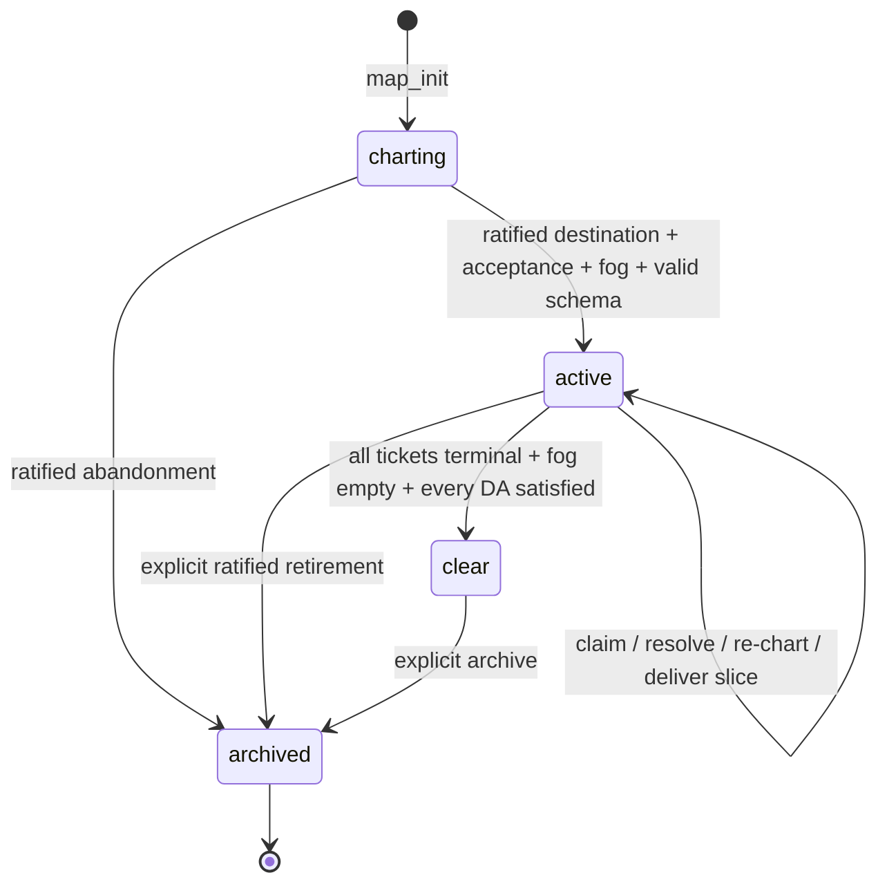
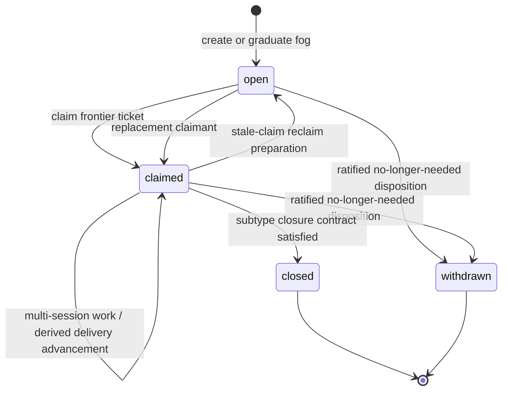
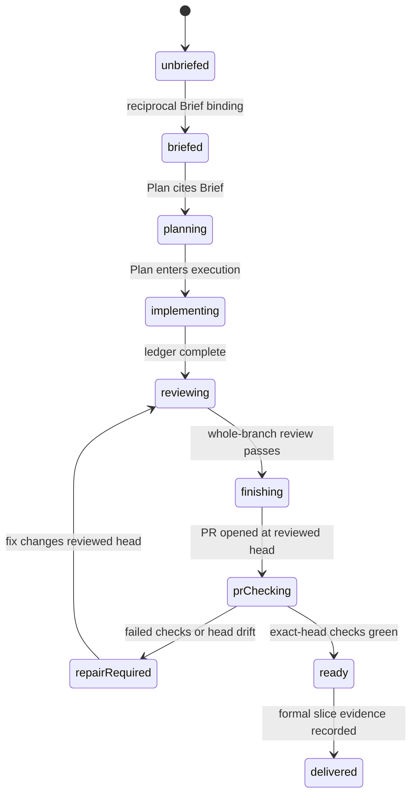
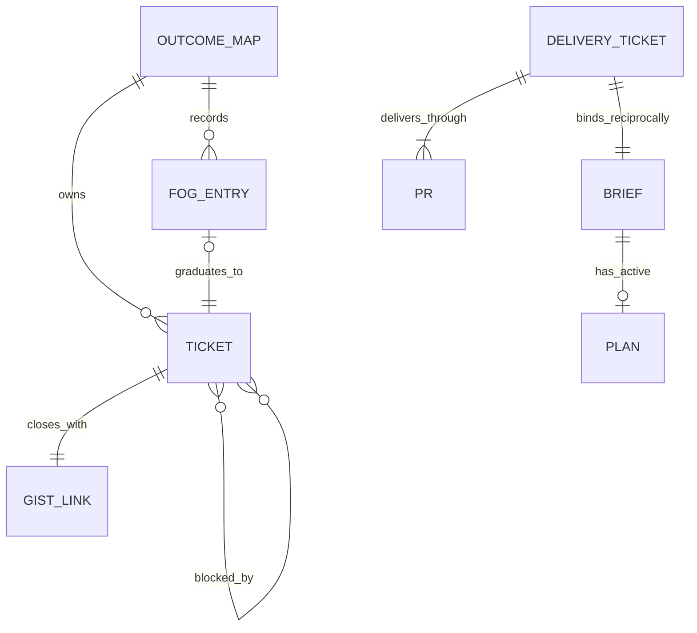
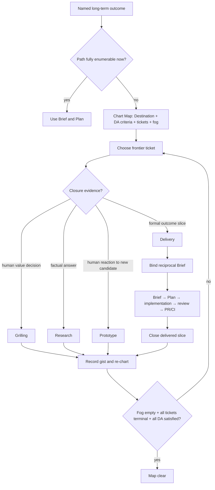

# Outcome Map v3 proposal

Status: ratified — kouko, 2026-08-31

Ratified by kouko on 2026-08-31, recorded retroactively in the
contract-repair arc (docs/loom/specs/2026-08-31-contract-repair-post-v3.md,
item R1): the v3 arc merged without a signed decision trail; the itemized
semantic decisions were ratified then and are logged in the plan's Decision
Log (docs/loom/plans/2026-08-30-outcome-map-v3.md).

Principles basis: no `docs/loom/PRINCIPLES.md` exists; this proposal is unconstrained by repository principles.

## USM backbone

| Stage | Actor intent | Primary object | CTA | Observable result |
|---|---|---|---|---|
| Re-enter | Find the named long-term outcome without reconstructing old sessions | Outcome Map | assess / open | One valid live Map and its current frontier are shown |
| Chart | Ratify the durable outcome and record known unknowns | Outcome Map | chart / ratify | Destination, acceptance, initial tickets and fog form a valid charting Map |
| Choose frontier | Select the next unblocked uncertainty or outcome slice | Ticket | claim | One open frontier ticket becomes exclusively claimed |
| Resolve uncertainty | Close a value decision, factual question, or human-evaluated candidate | Ticket | resolve | A grilling, research, or prototype ticket closes under its subtype evidence contract |
| Start delivery | Turn one ready outcome slice into an implementation arc | Delivery ticket | start delivery | A canonical ticket↔Brief binding exists; no progress state is copied into the Map |
| Execute delivery | Move through Brief, Plan, implementation, review, PR and CI | Delivery Arc | advance | Detailed state remains in owning artifacts and can be derived read-only |
| Close delivery | Verify the promised slice was formally delivered | Delivery ticket | close | Delivery evidence satisfies the ticket without implying Map completion |
| Re-chart | Record new fog/tickets exposed by the completed work | Outcome Map | graduate / add fog | The frontier changes without requiring a pre-enumerated backlog |
| Assess outcome | Decide mechanically whether the long-term outcome is actually satisfied | Outcome Map | assess clear | Fog is empty, every ticket is terminal, and Destination acceptance evidence holds |
| Retire | Preserve a completed or abandoned Map as history | Outcome Map | archive | The Map no longer accepts work and all external relationships remain auditable |

### Backbone invariants

- A session may perform many activities, but every ticket has exactly one closure contract determined by its type.
- Ticket selection is dynamic; the backbone order is stable, but individual ticket order is dependency- and evidence-driven.
- `Start delivery` is a mode of decision-map, not a separate `map-to-task` skill and not a fifth ticket type.
- A closed delivery changes one outcome slice from promised to delivered; only `Assess outcome` may move the whole Map to clear.
- The Map references Brief/Plan/Git/PR state but never becomes another writable progress ledger.

## OOUX object model

### Object inventory

| Object | Stable identity | Persisted truth | Derived-only truth | Primary owner |
|---|---|---|---|---|
| Outcome Map | `docs/loom/maps/<map-id>/MAP.md` | Destination, acceptance criteria, state, fog, gist links, scope | frontier, clear eligibility, delivery progress | decision-map |
| Ticket | `docs/loom/maps/<map-id>/tickets/<slug>.md` | type, status, claim, blockers, closure contract or withdrawal disposition | frontier eligibility; delivery phase | decision-map |
| Brief | repo-relative brief path | promised delivery slice, acceptance, reciprocal delivery-ticket link | related active Plan | brainstorming / writing-plans handoff |
| Plan | repo-relative plan path | Source brief, Stage, task ledger | aggregate execution state | writing-plans / SDD / finishing |
| PR | repository + PR number | external review and delivery record | current head/check conclusions | GitHub delivery workflow |

Brief, Plan and PR are part of the Delivery Arc relation, but decision-map does not own or copy their mutable state.

### Outcome Map ORCA

- **Attributes:** immutable `map-id`; `schema_version: 3`; state; ratified Destination; stable `DA-<n>` acceptance criteria; Notes; closed-ticket gist links; monotonic `F-<n>` fog; Out-of-scope.
- **Relationships:** one Map owns many Tickets; each Fog entry graduates to at most one Ticket; every closed Ticket has exactly one gist link; each delivery Ticket owns one Brief relation.
- **CTAs:** chart, ratify, validate, assess liveness, show frontier, add/graduate fog, record gist, start delivery, derive delivery progress, assess clear, retire.
- **Invariants:** Map is the outcome control surface, not a backlog or progress ledger; broken is never absence; closing any one ticket cannot directly set Map clear.

`clear` is a historical conclusion under its recorded evidence and is not reopened. A later regression opens a successor Map that cites the predecessor; it does not rewrite the old conclusion. An active Map may be retired without claiming success, but requires an explicit human-ratified retirement reason.

Archiving is a state transition in the stable Map directory, never a physical move. Stable Ticket paths therefore keep reciprocal Brief links valid.

### Ticket ORCA

- **Common attributes:** type, status, claim, optional `graduated-from`, optional acyclic `blocked-by`, description, selection basis, Resolution.
- **Closure attributes:** grilling records a value/direction decision and ratification; research records a factual answer and inspectable evidence; prototype records candidate artifact plus human evaluation/selection and ratification; delivery records promised slice, canonical Brief relation and formal delivery evidence.
- **Relationships:** exactly one owning Map; zero or more sibling blockers; zero or one source Fog entry; delivery alone has exactly one reciprocal Brief.
- **CTAs:** create/graduate, claim/reclaim, resolve, close; subtype verbs are ask/ratify, investigate/evidence, create/evaluate candidate, and start/query/close delivery.

The persisted state intentionally remains small. `briefed`, `planning`, `implementing`, `reviewing`, `pr-checking` and `ready` are derived Delivery Arc phases, never ticket statuses. `withdrawn` is a terminal disposition, not a successful closure: it records why a no-longer-needed ticket stopped participating in the frontier without pretending its subtype contract was satisfied.
Terminal tickets (`closed` or `withdrawn`) are immutable historical records. Corrections, withdrawn conclusions and regressions create new fog or a follow-up ticket; they never replace the old type, binding, disposition or evidence.

### Delivery Arc ORCA

- **Canonical join:** delivery Ticket frontmatter has `brief: docs/loom/specs/<brief>.md`; the Brief carries `Outcome Map ticket: docs/loom/maps/<map-id>/tickets/<slug>.md`; both paths must be byte-exact reciprocal repo-relative regular-file paths. Plan continues to point at its Brief through `Source brief`.
- **Closure policy:** the Brief declares one formal delivery policy—`pr-ci`, `merged`, or `artifact`—and the evidence required by that policy. Repository-required checks remain owned by the finishing workflow rather than copied into Map schema.
- **Cardinality:** one delivery Ticket owns one Brief; one Brief belongs to at most one delivery Ticket and has at most one Plan for its lifetime; one delivery may use several ordered PRs; one PR belongs to only one delivery Ticket. An unusable Plan causes the owning delivery to be withdrawn and replaced by a new ticket/Brief rather than silently superseded.
- **Derived phases:** unbriefed → briefed → planning → implementing → reviewing → finishing → pr-checking → ready → delivered. Failure/head drift derives `repair-required` without mutating Map state.
- **CTAs:** start delivery creates or binds the Brief; show progress resolves Ticket → Brief → Plan and reports derived state; loom-code owns planning, implementation, review and PR/CI; close delivery records final evidence after the Brief acceptance is formally met.

### Relations

### Closure decision tree

1. Human ratifies a value, direction or trade-off without evaluating a new candidate artifact → `grilling`.
2. Human evaluates or selects a newly created candidate artifact → `prototype`.
3. Inspectable evidence answers a factual question, including inventory or measured feasibility → `research`.
4. Formal delivery evidence satisfies a promised outcome slice → `delivery`.
5. None applies → keep it as fog, dependency or checklist information; do not mint another type.

## Path × edge matrix

| Stage | Object / state | CTA | Expected edge | Refusal or recovery edge |
|---|---|---|---|---|
| Re-enter | Map absent | assess | report no live Map | never fabricate one from topic similarity |
| Re-enter | Map broken | assess | identify structural violation | refuse to treat broken as absent |
| Re-enter | several live Maps | select | use user name or recorded branch signal | ambiguous ownership requires human selection |
| Chart | Map charting, no fog | activate | route to a Plan | refuse Map activation because path is already enumerable |
| Chart | missing Destination ratification/DA criteria | activate | remain charting | validator names missing contract |
| Claim | open frontier Ticket | claim | become claimed with dated owner | reject blocked, already claimed or archived-map ticket |
| Claim | stale claimed Ticket | reclaim | replace claim and record takeover | reject when Git evidence shows post-claim work |
| Resolve | grilling claimed | close | decision + ratification | discussion without a ratified choice remains claimed |
| Resolve | research claimed | close | factual answer + evidence | opinion or uncited assertion remains claimed |
| Resolve | prototype claimed | close | candidate + human evaluation | machine pass/fail is rerouted to research |
| Start delivery | delivery unbriefed | create/bind | reciprocal Ticket↔Brief join | reject missing, duplicate, escaping or non-reciprocal path |
| Execute | delivery claimed | show progress | derive Brief→Plan ledger phase | missing/ambiguous Plan reports unresolved, writes nothing |
| Review | PR at reviewed head | check | exact-head review/CI evidence | head drift returns to review; failed CI requires repair |
| Close delivery | delivery ready | close | immutable slice evidence + gist | reject green-but-stale SHA, incomplete acceptance or first of several required PRs |
| Re-chart | closed Ticket exposed unknown | add/graduate | new fog or typed Ticket | reject silent loss or reused fog id |
| Assess clear | all local work closed | assess | also evaluate every DA item | an empty work list alone remains active |
| Retire | active Map abandoned | retire | archive with ratified reason | never label abandonment as clear |
| Regression | archived/clear predecessor | continue | create successor Map with citation | do not rewrite historical closure evidence |

### Pruning results

- DELETE generic CRUD wording: tickets are not arbitrary records; create/close operations are governed by fog, claim and subtype closure rules.
- DELETE `Map part:` and any writable delivery-progress fields: reciprocal artifact paths plus derivation replace them.
- KEEP stale-claim recovery because a multi-session control loop otherwise deadlocks.
- KEEP active retirement distinct from clear because abandonment and outcome attainment are different facts.
- FLAG delivery evidence verification beyond local artifact integrity: GitHub check truth is external and must be queried at close time, not cached in Map.

## Cross-object combinations

The interaction-dense stages have at most three co-active objects, so the relevant joint states are enumerated directly; no pairwise generator is required.

| Stage | Co-active objects | Joint state | Required reaction |
|---|---|---|---|
| Start delivery | Ticket claimed + Brief absent | unbriefed | create one Brief with reciprocal links |
| Start delivery | Ticket claimed + Brief exists/unbound | bindable | add both joins only after validating ownership |
| Start delivery | Ticket claimed + Brief bound elsewhere | conflict | refuse; never steal another delivery's Brief |
| Start delivery | non-delivery Ticket + Brief request | type mismatch | refuse; research/grilling/prototype do not own delivery arcs |
| Plan resolution | Brief bound + no Plan | briefed | report planning as next owner action |
| Plan resolution | Brief bound + one active Plan | executable | derive its Stage and ledger |
| Plan resolution | Brief bound + multiple unsuperseded Plans | ambiguous | refuse until one active Plan is authoritative |
| PR checking | Plan reviewed + PR exact head green | ready | allow formal delivery closure |
| PR checking | Plan reviewed + PR head drift | stale | invalidate readiness and return to review |
| PR checking | multi-PR delivery + some PR missing evidence | incomplete | keep claimed and name remaining PR role |
| PR ownership | one PR cited by two tickets | ownership conflict | refuse; merge tickets before work or split PR |
| Map assessment | all Tickets closed + fog empty + all DA satisfied | clear eligible | allow active → clear |
| Map assessment | all Tickets closed + fog empty + DA open | outcome incomplete | remain active and expose acceptance gap |
| Map assessment | delivery closed + other Ticket/fog open | frontier changed | remain active; select next frontier work |
| Retirement | active + unresolved Ticket/fog + ratified reason | abandoned | archive without claiming Destination success |

## Journey navigation

Navigation always returns to the Map after a closure. It never jumps from a green delivery PR directly to Map clear; the independent Destination-acceptance assessment is mandatory.

| Edge kind | Legal navigation | Required reaction |
|---|---|---|
| forward | frontier → claimed → subtype resolution | validate the next state's entry guard |
| back | failed delivery check → review/repair | preserve prior evidence and derive the repair owner |
| skip | blocked frontier ticket → another frontier ticket | never mutate the skipped ticket |
| abandon | active → archived | require ratified retirement; never call it clear |
| resume_reenter | named Map → claimed ticket or derived delivery phase | show the owning artifact and next CTA |
| error_escape | broken join/map/evidence → repair target | fail closed and write no progress state |
| retry_self | transient external unavailable or optimistic-write conflict | re-read authoritative sources before retry |

## Provenance

- seeded — Real-case corpus: `docs/loom/research/2026-08-30-outcome-map-v3-case-corpus.md`.
- seeded — Current v2 schema and behavior: `loom-workflow/skills/decision-map/`.
- seeded — Wayfinder comparison: `docs/loom/research/2026-08-28-wayfinder-mechanism-and-family-placement-research.md` and `docs/loom/research/2026-08-28-wayfinder-vs-loom-decision-map-diff.md`.
- seeded — Backlog/map boundary v2: `docs/loom/specs/2026-08-30-backlog-map-boundary-v2.md`.
- inferred — One delivery Ticket owns one Brief; the reciprocal path replaces free-text `Map part:`.
- inferred — One delivery may span multiple PRs, but a PR has one delivery owner; this resolves the corpus cardinality pressure in favor of unambiguous closure.
- critic-found — NFR + state + system-failure convergence: optimistic conflict detection, idempotent retry and recoverable reciprocal writes are required for claim, binding, closure and clear.
- critic-found — NFR + policy + state convergence: evidence needs explicit valid, invalid, unavailable and stale results; transient external failure cannot be treated as a negative fact.
- critic-found — cross-layer + object convergence: Destination acceptance needs stable ids, evidence pointers and human ratification for evaluative criteria.
- critic-found — state + cross-layer convergence: liveness/frontier assessment and resume CTAs must be normative, not proposal-only guidance.
- critic-found — object + system-failure convergence: schema migration needs preview, idempotency, source digest and zero-write refusal on ambiguity.
- critic-found — state + cross-layer convergence: charting rejects work before activation, closed tickets are immutable, obsolete non-closed tickets use a ratified withdrawn disposition, and stale reclaim needs an observable guarded transition.
- critic-found — system-failure + cross-layer convergence: archive keeps stable paths, blocker graphs are same-Map/acyclic, and delivery closure policy is authored rather than defaulted.

## Blind spots — needs human/field input

- needs human/field input — Repository owner: decide whether high-impact ratification requires an independent person or whether the interactive user may ratify their own local workflow; local files cannot authenticate a free-text identity.
- needs human/field input — Repository/security owner: define whether Maps may contain private or regulated data and any retention/redaction policy; no applicable legal regime is present in the seed.
- needs human/field input — GitHub workflow owner: choose each Brief's explicit `pr-ci`, `merged`, or `artifact` closure policy and define the repository-required checks referenced by that policy.
- needs human/field input — Field failure injection: measure whether SIGKILL, disk-full and two-process contention expose filesystem behaviors beyond optimistic digest checks and temp-file replacement.
- needs human/field input — Scale owner: provide actual upper bounds for ticket count, evidence size and validation latency before inventing resource limits or SLOs.
