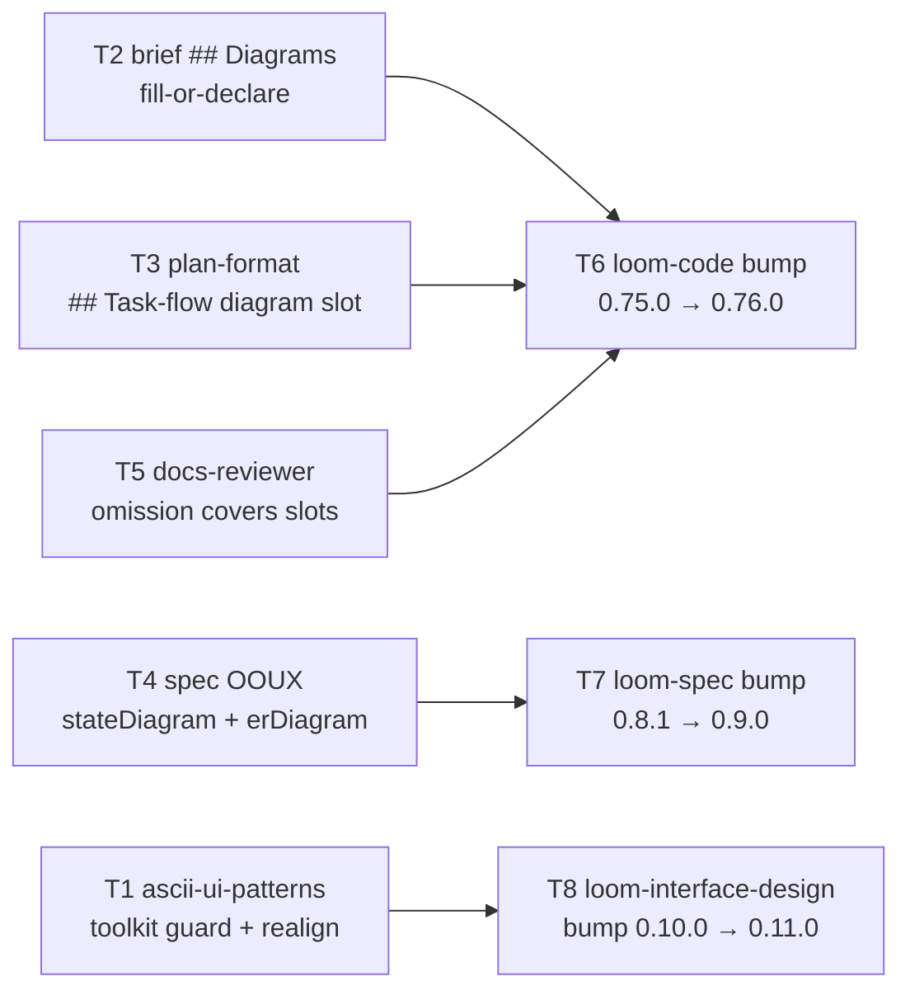

# Plan: visualization trigger layer

**Source brief**: docs/loom/specs/2026-08-11-visualization-trigger-layer.md
Goal: brief/plan/spec templates carry fill-or-declare diagram slots (Mermaid
    forms named per content shape), docs-reviewer treats a missing slot or
    unjustified N/A as an omission, and ascii-ui-patterns generates its
    skeletons via the toolkit instead of hand-drawing.
Stage: finishing
Steps:
  1. 內容改動五路並行：三個模板加圖表槽、審查提示補缺圖、ASCII 範例修正
  2. 版本收尾：三個 plugin bump＋codex 鏡射＋changelog
**Total tasks**: 8
**Critical-path depth**: 2 (≤5 ✓)
**Execution order**: parallel-where-possible
**Plan-document-reviewer verdict**: PASS (2026-08-11, round 2, 15/15)

## Task-flow diagram



## Task 1 — Rework ascii-ui-patterns: toolkit-guarded generation + realigned skeletons

- **Description**: In `loom-interface-design/skills/interaction-flows/references/ascii-ui-patterns.md`, replace the hand-drawing instruction in the `## Conventions` bullets (currently "Use box-drawing characters (`┌ ─ ┐ │ └ ┘ ├ ┤ ┬ ┴ ┼`) for region borders." — `ascii-ui-patterns.md:24-30`) with the §Pinned availability guard (Pin C, transcribe VERBATIM), keeping the other conventions bullets (fenced block, uppercase region tags, coarse skeletons, one-per-screen) intact. Re-align every fenced skeleton in Patterns 1–4 so that within each fenced block, all border lines (lines whose first non-space char is one of `┌ ├ └ │`) render to the same display width (labels are all-ASCII; box-drawing chars are width-1, so `len()` equality per block is the oracle). Add one sentence at the end of §When ASCII vs when Mermaid pointing to the channel SSOT: "Channel rule SSOT: `loom-pipeline/hooks/family-relay.md §(b) Visual defaults`." Write the failing test FIRST (TDD).
- **Module**: `loom-interface-design/skills/interaction-flows/references/ascii-ui-patterns.md`
- **Files touched**: `loom-interface-design/skills/interaction-flows/references/ascii-ui-patterns.md`, `loom-interface-design/scripts/test_ascii_ui_patterns.py` (NEW)
- **Context paths**:
  - /Users/kouko/GitHub/monkey-skills/loom-interface-design/skills/interaction-flows/references/ascii-ui-patterns.md
  - /Users/kouko/GitHub/monkey-skills/loom-interface-design/scripts/test_interaction_flows_skill.py (house test style)
  - /Users/kouko/GitHub/monkey-skills/docs/loom/plans/2026-08-11-visualization-trigger-layer.md (§Pinned wording)
- **Acceptance**:
  - **RED**: `loom-interface-design/scripts/test_ascii_ui_patterns.py::test_generation_guard_full_phrases_present` fails on the current file (Pin C phrases absent), and `::test_skeleton_border_lines_equal_width_per_block` fails on any currently misaligned Pattern row (if all rows already align, the test still pins the property and RED comes from the guard-phrase test alone — state which in the task report).
  - **GREEN**: both new tests pass; the full suite `python3 -m pytest loom-interface-design/scripts/ -v` is green (notably `test_interaction_flows_skill.py::test_body_references_both_reference_docs_by_relative_path` — the SKILL.md pointer to this file must survive).
- **Dependencies**: none
- **Independent**: true
- **Brief item covered**: "ascii-ui-patterns ↔ toolkit contradiction fix … Add an availability-guarded generation instruction" + user ruling "ascii-ui-patterns 範例列順手重生"; also traces the brief's Hosts obligation "everything must stay host-neutral (no Claude-only preview paths in doctrine)" — satisfied by omission across ALL tasks (no Claude-only preview mechanism is introduced anywhere; brief Decision: "We will NOT build … any Mermaid-preview mechanism (host-specific)"), and Pin C's degrade path is host-agnostic.
- **Status**: done(0a4017a6)
- **Gloss**: 修掉「教人手繪框圖」與工具使命的矛盾——有裝工具就用工具生成，沒裝就限 ASCII 標籤、CJK 降級表格，範例本身也對齊。

## Task 2 — Brief template `## Diagrams` becomes fill-or-declare

- **Description**: In `loom-code/skills/brainstorming/references/handoff-brief-format.md`, rewrite the `### `## Diagrams`` spec entry (`handoff-brief-format.md:100-102`) and the template copy (`:162-164`, currently "(embed Mermaid blocks; preceded by 1-sentence captions; remove this section if no diagrams)") so the section is fill-or-declare: transcribe Pin B VERBATIM into the spec entry, append the loom-code-local pointer sentence "When-to-draw judgment: see [visual-companion.md](visual-companion.md)." after it, and make the template copy carry the short form "(embed Mermaid blocks with 1-sentence captions, or write the pinned N/A line — do not delete this section)". The literal string "remove this section if no diagrams" must be gone. Write the failing test FIRST (TDD).
- **Module**: `loom-code/skills/brainstorming/references/handoff-brief-format.md`
- **Files touched**: `loom-code/skills/brainstorming/references/handoff-brief-format.md`, `loom-code/scripts/test_brief_diagram_slot.py` (NEW)
- **Context paths**:
  - /Users/kouko/GitHub/monkey-skills/loom-code/skills/brainstorming/references/handoff-brief-format.md
  - /Users/kouko/GitHub/monkey-skills/loom-code/skills/brainstorming/references/visual-companion.md
  - /Users/kouko/GitHub/monkey-skills/docs/loom/plans/2026-08-11-visualization-trigger-layer.md (§Pinned wording)
- **Acceptance**:
  - **RED**: `loom-code/scripts/test_brief_diagram_slot.py::test_diagrams_section_fill_or_declare_full_phrases` fails on the current file (asserts Pin A's full line-prefix `N/A — no flow/state/architecture-shaped content:` and Pin B's sentence "Do not delete the section heading" present; asserts "remove this section if no diagrams" ABSENT).
  - **GREEN**: new test passes; full suite `python3 -m pytest loom-code/scripts/ scripts/ .claude/hooks/ -v` green.
- **Dependencies**: none
- **Independent**: true
- **Brief item covered**: "upgrade the existing `## Diagrams` section from optional to fill-or-declare"; also carries brief Decision item "Rider pointers (demoted, cheap only)" — the slot text itself is the visual-companion/§(b) pointer carrier.
- **Status**: done(93593fde)
- **Gloss**: brief 的圖表欄位從「可刪」變成「填圖或明寫 N/A＋理由」——可選欄位無行為（29 份只 1 份有圖）的實證修法。

## Task 3 — Plan schema gains a plan-level `## Task-flow diagram` slot

- **Description**: In `loom-code/skills/writing-plans/references/plan-format.md`, add a new `### Plan-level diagram slot` subsection immediately after §Top-level header (before §Per-task block) defining a required top-level section `## Task-flow diagram`: a Mermaid `flowchart` of the task dependency DAG placed between the header and Task 1, governed by the fill-or-declare contract — transcribe Pin B VERBATIM, then append the loom-code-local sentence "When-to-draw judgment: see [`../../brainstorming/references/visual-companion.md`](../../brainstorming/references/visual-companion.md)." Add one `## Task-flow diagram` line (with a one-line mermaid placeholder comment) to the §Worked example plan so the example stays schema-conformant. Per-task diagrams are explicitly NOT required (state this in the subsection). Write the failing test FIRST (TDD).
- **Module**: `loom-code/skills/writing-plans/references/plan-format.md`
- **Files touched**: `loom-code/skills/writing-plans/references/plan-format.md`, `loom-code/scripts/test_plan_diagram_slot.py` (NEW)
- **Context paths**:
  - /Users/kouko/GitHub/monkey-skills/loom-code/skills/writing-plans/references/plan-format.md
  - /Users/kouko/GitHub/monkey-skills/loom-code/scripts/test_plan_format_prose_weight.py (existing pins on this file — do not break)
  - /Users/kouko/GitHub/monkey-skills/loom-code/scripts/test_plan_format_progress_fields.py (existing pins)
  - /Users/kouko/GitHub/monkey-skills/docs/loom/plans/2026-08-11-visualization-trigger-layer.md (§Pinned wording)
- **Acceptance**:
  - **RED**: `loom-code/scripts/test_plan_diagram_slot.py::test_plan_level_diagram_slot_defined` fails on the current file (asserts the full heading `### Plan-level diagram slot`, the literal `## Task-flow diagram`, and Pin B's sentence "Do not delete the section heading" all present in plan-format.md).
  - **GREEN**: new test passes; existing plan-format pin tests (`test_plan_fact_grounding.py`, `test_plan_format_prose_weight.py`, `test_plan_format_progress_fields.py`, `test_sdd_review_weight_marker.py`) stay green; full loom-code suite green (same invocation as Task 2).
- **Dependencies**: none
- **Independent**: true
- **Brief item covered**: "add one plan-level slot (task dependency/flow shape), NOT per-task"
- **Status**: done(150d7d20)
- **Gloss**: 每份 plan 從此自帶任務依賴圖（或明寫 N/A）——讀 plan 的人先看形狀再讀任務，本 plan 自己就是首個示範。

## Task 4 — Spec OOUX visible artifact renders Mermaid stateDiagram + erDiagram

- **Description**: In `loom-spec/skills/spec-expansion/SKILL.md`, extend the OOUX **Visible artifact** instruction (currently "emit a `## OOUX object model` section in `proposal.md` — the object inventory plus, for each object, its state machine (states + legal transitions)", ~SKILL.md:219-221) so that inside the SAME `## OOUX object model` section: each object's state machine is rendered as a fenced ```mermaid `stateDiagram-v2` block, and object-to-object relations as one fenced ```mermaid `erDiagram` block; both governed by the fill-or-declare contract — transcribe Pin B VERBATIM (no local visual-companion pointer; cross-plugin paths do not resolve). DO NOT change any emitted section header literal (`## USM backbone`, `## OOUX object model`, `## Path × edge matrix`) — `loom-spec/scripts/validate_spec_output.py:274-315` matches whole-line headers and `test_spec_expansion_skill.py::test_three_visible_artifact_sections_per_phase` pins the literals. Write the failing test FIRST (TDD).
- **Module**: `loom-spec/skills/spec-expansion/SKILL.md`
- **Files touched**: `loom-spec/skills/spec-expansion/SKILL.md`, `loom-spec/scripts/test_spec_expansion_diagram_forms.py` (NEW)
- **Context paths**:
  - /Users/kouko/GitHub/monkey-skills/loom-spec/skills/spec-expansion/SKILL.md
  - /Users/kouko/GitHub/monkey-skills/loom-spec/scripts/test_spec_expansion_skill.py (house style + pinned literals)
  - /Users/kouko/GitHub/monkey-skills/loom-spec/scripts/validate_spec_output.py (header constants — read, do not edit)
  - /Users/kouko/GitHub/monkey-skills/docs/loom/plans/2026-08-11-visualization-trigger-layer.md (§Pinned wording)
- **Acceptance**:
  - **RED**: `loom-spec/scripts/test_spec_expansion_diagram_forms.py::test_ooux_names_mermaid_diagram_forms` fails on the current file (asserts full phrases `stateDiagram-v2` and `erDiagram` and Pin A's line-prefix present in SKILL.md).
  - **GREEN**: new test passes; `test_spec_expansion_skill.py` all green (headers untouched); full suite `python3 -m pytest loom-spec/scripts/ -v` green.
- **Dependencies**: none
- **Independent**: true
- **Brief item covered**: "state-machine content → Mermaid `stateDiagram-v2`; OOUX object model relations → Mermaid `erDiagram`"
- **Status**: done(2a1da346)
- **Gloss**: spec 的物件狀態機與關係從清單升級成可渲染的圖——最天然該畫圖的素材（狀態機）從此真的畫出來。

## Task 5 — docs-reviewer omission dimension covers diagram-slot contracts

- **Description**: In `loom-code/agents/docs-reviewer.md`, extend the **omission** row of the dimensions table (`docs-reviewer.md:560`, cell currently ending "Assert only after the full-text read (rule 1).") by appending this sentence VERBATIM before the final "Assert only…" sentence: "A diagram slot required by the artifact's own template contract (fill-or-declare) that is absent, and an `N/A — no flow/state/architecture-shaped content:` declaration whose reason does not hold against the artifact's own content, are both omissions." Touch NOTHING inside the distribute.py-managed marker blocks (`<!-- BEGIN … -->` / `<!-- END … -->`). Write the failing test FIRST (TDD). NOTE (behavioral-verification limit): reviewers dispatched THIS session load the cached plugin contract, not this edit — verification for this task is static (test pin + suite), never a dispatched reviewer's self-report (docs/loom/memory/agent-contract-edits-do-not-reach-this-sessions-subagents.md).
- **Module**: `loom-code/agents/docs-reviewer.md`
- **Files touched**: `loom-code/agents/docs-reviewer.md`, `loom-code/scripts/test_docs_reviewer_diagram_omission.py` (NEW)
- **Context paths**:
  - /Users/kouko/GitHub/monkey-skills/loom-code/agents/docs-reviewer.md
  - /Users/kouko/GitHub/monkey-skills/loom-code/scripts/test_docs_reviewer_agent.py (14 existing pins — must stay green)
  - /Users/kouko/GitHub/monkey-skills/loom-code/scripts/test_reviewer_carve_out_wording.py (byte-equal carve-out pin — must stay green)
  - /Users/kouko/GitHub/monkey-skills/docs/loom/plans/2026-08-11-visualization-trigger-layer.md (§Pinned wording)
- **Acceptance**:
  - **RED**: `loom-code/scripts/test_docs_reviewer_diagram_omission.py::test_omission_row_names_diagram_slot_contract` fails on the current file (asserts the appended sentence's full phrase "required by the artifact's own template contract (fill-or-declare)" present in the omission row).
  - **GREEN**: new test passes; `test_docs_reviewer_agent.py` (14 tests), `test_reviewer_carve_out_wording.py`, and the full loom-code suite (same invocation as Task 2) green.
- **Dependencies**: none
- **Independent**: true
- **Brief item covered**: "add missing-diagram-slot / unjustified-N/A to `agents/docs-reviewer.md`'s omission dimension prompt (… not a new dimension, not a convergence-loop change)"
- **Status**: done(c05bd5e8)
- **Gloss**: 回饋迴圈接上——「該有圖的槽沒填」和「假 N/A」從此是審查會抓的 omission，漂移不再零成本。

## Task 6 — loom-code version bump + codex mirror + changelog entry

- **Description**: In `loom-code/.claude-plugin/plugin.json`, replace the exact literal `"version": "0.75.0"` with the exact literal `"version": "0.76.0"`. Then run exactly `python3 scripts/sync_codex_manifests.py loom-code` (verified 2026-08-11: script exists at `scripts/sync_codex_manifests.py`, positional arg = plugin directory name; SSOT is `.claude-plugin/plugin.json` — `scripts/sync_codex_manifests.py:2-8`) and commit its output to `loom-code/.codex-plugin/plugin.json` unmodified. Insert Pin D's loom-code entry (transcribe VERBATIM, date 2026-08-11) as the newest entry of `loom-code/CHANGELOG.md`, heading format copied from that file's current top entry. No other changes.
- **Module**: `loom-code/.claude-plugin/plugin.json`
- **Files touched**: `loom-code/.claude-plugin/plugin.json`, `loom-code/.codex-plugin/plugin.json`, `loom-code/CHANGELOG.md`
- **Context paths**:
  - /Users/kouko/GitHub/monkey-skills/loom-code/CHANGELOG.md (top-entry heading format)
  - /Users/kouko/GitHub/monkey-skills/docs/loom/plans/2026-08-11-visualization-trigger-layer.md (§Pinned wording, Pin D)
- **Acceptance**:
  - **RED**: `grep -F '"version": "0.76.0"' loom-code/.claude-plugin/plugin.json` exits 1 before the edit; `python3 scripts/sync_codex_manifests.py loom-code --check` exits non-zero after bumping `.claude-plugin` but before the sync run.
  - **GREEN**: the grep exits 0 on BOTH `loom-code/.claude-plugin/plugin.json` and `loom-code/.codex-plugin/plugin.json`; `python3 scripts/sync_codex_manifests.py loom-code --check` exits 0; suite `python3 -m pytest loom-code/scripts/ scripts/ .claude/hooks/ -v` green.
- **External surfaces**: none (in-repo manifests + repo's own sync script)
- **Dependencies**: Tasks 2, 3, 5 complete first
- **Independent**: true
- **Review-weight**: mechanical
- **Brief item covered**: "three plugins bump versions (loom-code, loom-spec, loom-interface-design) each with `.codex-plugin` manifest mirror + marketplace sync" (marketplace.json carries zero version fields — verified 2026-08-11 recon, `.claude-plugin/marketplace.json` grep `"version"` → 0 hits — so no marketplace edit is needed; this sentence records why that half of the brief item is N/A)
- **Status**: done(ae19e5dd)
- **Gloss**: loom-code 的槽改動要隨版本出貨——不 bump 的話 marketplace 更新是靜默 no-op。

## Task 7 — loom-spec version bump + codex mirror + changelog entry

- **Description**: In `loom-spec/.claude-plugin/plugin.json`, replace the exact literal `"version": "0.8.1"` with the exact literal `"version": "0.9.0"`. Then run exactly `python3 scripts/sync_codex_manifests.py loom-spec` (same verified script and SSOT as Task 6) and commit its output to `loom-spec/.codex-plugin/plugin.json` unmodified. Insert Pin D's loom-spec entry (transcribe VERBATIM, date 2026-08-11) as the newest entry of `loom-spec/CHANGELOG.md`, heading format copied from that file's current top entry. No other changes.
- **Module**: `loom-spec/.claude-plugin/plugin.json`
- **Files touched**: `loom-spec/.claude-plugin/plugin.json`, `loom-spec/.codex-plugin/plugin.json`, `loom-spec/CHANGELOG.md`
- **Context paths**:
  - /Users/kouko/GitHub/monkey-skills/loom-spec/CHANGELOG.md (top-entry heading format)
  - /Users/kouko/GitHub/monkey-skills/docs/loom/plans/2026-08-11-visualization-trigger-layer.md (§Pinned wording, Pin D)
- **Acceptance**:
  - **RED**: `grep -F '"version": "0.9.0"' loom-spec/.claude-plugin/plugin.json` exits 1 before the edit; `python3 scripts/sync_codex_manifests.py loom-spec --check` exits non-zero after bumping `.claude-plugin` but before the sync run.
  - **GREEN**: the grep exits 0 on BOTH `loom-spec/.claude-plugin/plugin.json` and `loom-spec/.codex-plugin/plugin.json`; `--check` exits 0; suite `python3 -m pytest loom-spec/scripts/ -v` green.
- **External surfaces**: none (in-repo manifests + repo's own sync script)
- **Dependencies**: Task 4 completes first
- **Independent**: true
- **Review-weight**: mechanical
- **Brief item covered**: "three plugins bump versions (loom-code, loom-spec, loom-interface-design) each with `.codex-plugin` manifest mirror + marketplace sync" (marketplace N/A rationale recorded in Task 6's field)
- **Status**: done(604a7691)
- **Gloss**: loom-spec 的 OOUX 圖形升級隨 0.9.0 出貨。

## Task 8 — loom-interface-design version bump + codex mirror + changelog entry

- **Description**: In `loom-interface-design/.claude-plugin/plugin.json`, replace the exact literal `"version": "0.10.0"` with the exact literal `"version": "0.11.0"`. Then run exactly `python3 scripts/sync_codex_manifests.py loom-interface-design` (same verified script and SSOT as Task 6) and commit its output to `loom-interface-design/.codex-plugin/plugin.json` unmodified. Insert Pin D's loom-interface-design entry (transcribe VERBATIM, date 2026-08-11) as the newest entry of `loom-interface-design/CHANGELOG.md`, heading format copied from that file's current top entry. No other changes.
- **Module**: `loom-interface-design/.claude-plugin/plugin.json`
- **Files touched**: `loom-interface-design/.claude-plugin/plugin.json`, `loom-interface-design/.codex-plugin/plugin.json`, `loom-interface-design/CHANGELOG.md`
- **Context paths**:
  - /Users/kouko/GitHub/monkey-skills/loom-interface-design/CHANGELOG.md (top-entry heading format)
  - /Users/kouko/GitHub/monkey-skills/docs/loom/plans/2026-08-11-visualization-trigger-layer.md (§Pinned wording, Pin D)
- **Acceptance**:
  - **RED**: `grep -F '"version": "0.11.0"' loom-interface-design/.claude-plugin/plugin.json` exits 1 before the edit; `python3 scripts/sync_codex_manifests.py loom-interface-design --check` exits non-zero after bumping `.claude-plugin` but before the sync run.
  - **GREEN**: the grep exits 0 on BOTH `loom-interface-design/.claude-plugin/plugin.json` and `loom-interface-design/.codex-plugin/plugin.json`; `--check` exits 0; suite `python3 -m pytest loom-interface-design/scripts/ -v` green.
- **External surfaces**: none (in-repo manifests + repo's own sync script)
- **Dependencies**: Task 1 completes first
- **Independent**: true
- **Review-weight**: mechanical
- **Brief item covered**: "three plugins bump versions (loom-code, loom-spec, loom-interface-design) each with `.codex-plugin` manifest mirror + marketplace sync" (marketplace N/A rationale recorded in Task 6's field)
- **Status**: done(a8a3dd0e)
- **Gloss**: ascii-ui-patterns 的修正隨 0.11.0 出貨。

## Notes

**Endpoint recording**: endpoint named: no → human-pumped (user approved the arc stage-by-stage; PR-open still requires the finishing flow later).

**Amendment log**: verdict stamped PENDING → PASS (2026-08-11, round 2) — stamping the verdict, no re-review (sanctioned kind 1). Kickoff-decision lines appended post-PASS — recording already-made rulings (user 2026-08-11) + pin-resolved forks, no technical content change beyond the record itself.

Kickoff decision: quota vs structural slots → fill-or-declare slots, never counts (user-ratified 2026-08-11; industry EN+JA both slot-shaped)
Kickoff decision: committed-doc diagram default → Mermaid; chat → markdown table / ascii-graph-toolkit availability-guarded (user-ratified 2026-08-11)
Kickoff decision: empty-slot form → Pin A verbatim N/A line, reason mandatory (pin-resolved)
Kickoff decision: T1 skeleton alignment oracle → per-fenced-block border-line len() equality, labels stay ASCII (pin-resolved)

**Change-folder detection**: N/A — explicit brief handoff (Layer 0 analog: the orchestrator invoked writing-plans with the brief path). The two resident date-slug folders under `docs/loom/` (`2026-07-12-us-sec-primary-source-layer`, `2026-07-19-8k-prose-kpi-intake`) belong to already-shipped investing arcs, not this change — binding either would hijack the arc.

**User rulings (2026-08-11)**: regenerate/realign ascii-ui-patterns example rows in-arc (→ Task 1); backlog items `2026-07-06-anti-copy-acceptance-greps-pass-paraphrase-copies` and `2026-07-10-grounding-notes-for-sibling-stations-claude-code-tools-md` explicitly RE-PARKED (their start-triggers fire on this arc's touches, but each is its own mini-feature; adopting them would unfocus a three-plugin arc).

**Recorded debt (→ PR body 🟢)**: plan-document-reviewer-prompt.md gets no `## Task-flow diagram` presence check this arc (adding Check 18 touches the check enum, `checks_passed` denominator, and verdict-mapping lines — invasive relative to yield). The loop for plans is covered at branch time by docs-reviewer (Task 5); revisit if slot-skipping is observed in practice.

**Grep-pin discipline (all NEW tests)**: assert the full phrase the failure message names, never a lone token; `count()` the asserted phrase in the guarded scope and assert uniqueness where the pin is load-bearing (docs/loom/memory/substring-assertions-must-pin-the-phrase-their-message-names.md).

**Standing trap-guards for every dispatch packet**: Read a file before you Edit it; on a modified-since-read error, re-Read then re-Edit — never retry the same diff. If a guard/hook blocks the same command twice, stop and report the block message verbatim. Never use `git stash`. The Write tool refuses basename `report.md` — write another basename then `mv`.

### Pinned wording — transcribe VERBATIM; amendments go AFTER a pin, never inside it

**Pin A — the N/A line** (the only sanctioned empty-slot form; `<one-line reason>` is the author's):

```
N/A — no flow/state/architecture-shaped content: <one-line reason>
```

**Pin B — the fill-or-declare contract** (shared core for Tasks 2, 3, 4; local pointer sentences are appended AFTER it, per task Description):

```
This section is fill-or-declare: either embed the diagram(s) this section
names, or replace the body with the single line
`N/A — no flow/state/architecture-shaped content: <one-line reason>`.
Do not delete the section heading — an absent heading or a bare section is
a reviewable omission, and an N/A whose reason does not hold against the
artifact's own content is a reviewable claim. A paragraph that suffices
needs no diagram — the slot forces the declaration, not the drawing.
Channel rule SSOT: `loom-pipeline/hooks/family-relay.md §(b) Visual defaults`.
```

**Pin C — the availability guard** (Task 1):

```
Generate every skeleton with the `ascii-graph` skill (ascii-graph-toolkit)
when that skill is available in the session — its width-aware generators
and verify loop keep box borders aligned. When the toolkit is absent (it
ships separately and may not be installed): hand-drawing is permitted only
when every label is plain ASCII; a skeleton needing CJK labels degrades to
a labeled markdown table or a prose region list — never hand-drawn CJK box
art (eyeballed full-width padding breaks silently). This absence is
environmental (an optional sibling plugin), not an undelivered artifact of
this plugin.
```

**Pin D — changelog entries** (Task 6; date 2026-08-11):

```
loom-code 0.76.0: Visualization trigger layer — the brief's `## Diagrams`
section and the new plan-level `## Task-flow diagram` slot become
fill-or-declare (pinned N/A line); docs-reviewer's omission dimension now
covers a missing diagram slot and an unjustified N/A.

loom-spec 0.9.0: OOUX visible artifact renders each object's state machine
as Mermaid `stateDiagram-v2` and object relations as `erDiagram`,
fill-or-declare with the pinned N/A line.

loom-interface-design 0.11.0: ascii-ui-patterns — skeletons are generated
via ascii-graph-toolkit when available (availability-guarded degrade path,
CJK labels never hand-drawn); example skeletons re-aligned.
```

## Decision Log

1. chose to keep docs-reviewer's new omission clause template-scoped because the 0.75.0 contract-class narrowing excludes record-class docs/** from review (T5 reviewer finding: the clause reaches contract-class template files only, never generated brief/plan instances) — cost-of-change: the day you want generated plans' `## Task-flow diagram` mechanically gated, this choice costs adding plan-document-reviewer Check 18 (the debt this plan's Notes already records, now known to be the ONLY automated gate candidate for instances, upgrading its priority; the Notes sentence "the loop for plans is covered at branch time by docs-reviewer" overstates coverage and is corrected by this entry)
2. chose to accept T6's fourth touched file (test_docs_review_blocking_class.py, the shipping-version pin rewritten 0.75.0→0.76.0) because the test's own docstring documents per-bump rewrites and git log confirms the convention across four prior bumps — cost-of-change: none going forward, but plan-time recon for any future bump task must grep for shipping-version pin tests so Files touched declares them up front (this arc's mechanical self-check correctly voided the exemption and routed T6 through the full triad, which is the system working as designed)
