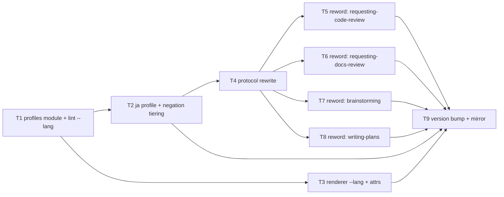

# Plan: adjudication view — Japanese support and an honest firing condition

Source brief: docs/loom/specs/2026-08-12-adjudication-view-japanese.md
Goal: A language-profile layer over the adjudication view's single-language machinery — `--lang` on both scripts defaulting to zh-Hant, a Japanese profile with JIS-derived modality and warning-tier negation, per-profile render attributes, and a firing condition that names its supported languages instead of claiming "not English".
Stage: finishing
Endpoint named: yes → continuous (user signed off the brief with "Go"; recorded per continuous-mode entry rule)
Total tasks: 9
Critical-path depth: 5 (≤5)
Execution order: parallel-where-possible
Plan-document-reviewer verdict: PASS (2026-08-12, round 2, 15/15)

## Task-flow diagram

## Task 1 — language-profile module + `--lang` on the lint

- Description: Create `adjudication_profiles.py` holding one profile per language tag and a `get_profile(lang)` accessor; move the zh-Hant language facts into it verbatim (`_ZH_NEGATION_MARKERS` "不未無非沒勿", `_ZH_NEGATION_PREFIX` "不未非", the five EN→ZH modality pairs), with each modality value stored as a TUPLE of accepted forms (zh-Hant entries are single-element tuples). Add `--lang` to `adjudication_lint.py`, default `zh-Hant`, and route the checks through the profile. Behavior at the default must be byte-identical to today.
- Module: loom-code/scripts
- Files touched: loom-code/scripts/adjudication_profiles.py, loom-code/scripts/adjudication_lint.py, loom-code/scripts/test_adjudication_profiles.py
- Context paths:
  - loom-code/scripts/adjudication_lint.py
  - docs/loom/specs/2026-08-12-adjudication-view-japanese.md
- Acceptance:
  - RED: `test_adjudication_profiles.py::test_zh_hant_profile_carries_the_shipped_language_facts` fails (module absent)
  - GREEN: the zh-Hant profile returns the three shipped constant values (marker set, prefix set, five modality pairs as tuples); the existing `test_adjudication_lint.py` + `test_adjudication_lint_language.py` suites stay green unchanged, proving the default path is behavior-identical
- External surfaces: none (stdlib)
- Dependencies: none
- Independent: false
- Brief item covered: "Profile table replacing the three hardcoded constants (`_ZH_NEGATION_MARKERS`, `_ZH_NEGATION_PREFIX`, `_MODALITY_MAP`) with one dict keyed by language tag" + "`--lang` on both scripts, defaulting to `zh-Hant`"
- Status: done(06ffb9a3)
- Gloss: 把三個寫死的語言常數抽成一張以語言為鍵的表，中文行為完全不變

## Task 2 — Japanese profile + evidence-tiered negation

- Description: Add the `ja` profile — JIS Z 8301:2019 Clause 7-derived modality forms as tuples (must → しなければならない/する/とする; must not → してはならない/しない; should → することが望ましい/するのがよい/することを推奨する; should not → 望ましくない/しない方がよい; may → してもよい/してよい/差し支えない) and kana negation patterns (ない/ません/ぬ/ず/まい) — and make the negation check's TIER a profile property: zh-Hant hard-fails on a missing negation marker, `ja` emits a WARNING and never affects the exit code. Modality stays warning-tier for both.
- Module: loom-code/scripts
- Files touched: loom-code/scripts/adjudication_profiles.py, loom-code/scripts/adjudication_lint.py, loom-code/scripts/test_adjudication_lint_japanese.py
- Context paths:
  - loom-code/scripts/adjudication_profiles.py
  - docs/loom/specs/2026-08-12-adjudication-view-japanese.md
- Acceptance:
  - RED: `test_adjudication_lint_japanese.py::test_japanese_negation_mismatch_warns_not_blocks` fails
  - GREEN: the measured failure case from the brief — source "The verdict block must not be rewritten.", rendition 「verdict ブロックを書き換えてはいけません。」 — exits 0 under `--lang ja` (today it exits 1); a Japanese rendition that genuinely drops the negation produces a WARNING line and still exits 0; a modality form drawn from ANY of the JIS-accepted alternatives for that modal is quiet (set-membership, not single-form match); zh-Hant negation still hard-fails (tier is per-profile, not global)
- External surfaces: none (stdlib)
- Dependencies: Task 1 completes first
- Independent: false
- Brief item covered: "Japanese negation check runs at WARNING tier, not hard-fail" + "Japanese modality per JIS Z 8301:2019 Clause 7" + "Each Japanese modal takes a SET of accepted forms, not one"
- Status: done(8e912013)
- Gloss: 日文設定檔上線：modality 依 JIS 一組多形式、否定降為警告不擋

## Task 3 — renderer `--lang` and per-profile page attributes

- Description: Add `--lang` (default `zh-Hant`) to `adjudication_render.py`; read the page language tag and font stack from the profile instead of the hardcoded `<html lang="zh-Hant">` (:101) and `Noto Sans TC` (:42). The `ja` profile supplies `lang="ja"` and a Noto Sans JP-first stack. One template, parameterized — no per-language template.
- Module: loom-code/scripts
- Files touched: loom-code/scripts/adjudication_render.py, loom-code/scripts/adjudication_profiles.py, loom-code/scripts/test_adjudication_render_lang.py
- Context paths:
  - loom-code/scripts/adjudication_render.py
  - loom-code/scripts/adjudication_profiles.py
- Acceptance:
  - RED: `test_adjudication_render_lang.py::test_ja_lang_attribute_and_font_stack` fails
  - GREEN: `--lang ja` output carries `<html lang="ja">` and a Noto Sans JP-first font stack; `--lang zh-Hant` (and the flagless default) output is byte-identical to the current renderer's output for the same units fixture; both doc and verdict modes honor the flag
- External surfaces: none (stdlib)
- Dependencies: Task 1 completes first
- Independent: true
- Brief item covered: "Renderer emits the right `lang` attribute and font stack per profile (`zh-Hant` + Noto Sans TC / `ja` + Noto Sans JP)"
- Status: done(9ede42a1)
- Gloss: 渲染器依語言輸出正確的 lang 與字型，中文輸出逐位不變

## Task 4 — protocol: supported-language firing conditions + per-language modality

- Description: Rewrite `protocols/adjudication-view.md` §Firing conditions (:93-100) so the view fires when the conversation language is a SUPPORTED profile (zh-Hant, ja) and any other non-English language is N/A-loud; and restructure §Fixed modality mapping (:40-56) to carry one table per language. Record the two JIS caveats verbatim in the protocol: the English↔Japanese correspondence is 参考 not 規定 (so the text says "derived from", never "per"), and our source "must" maps by FORCE to the 要求事項 table, not to JIS's own `must` row (which means an external constraint). State the negation tier per language and why they differ.
- Module: loom-code/skills/using-loom-code
- Files touched: loom-code/skills/using-loom-code/protocols/adjudication-view.md, loom-code/scripts/test_adjudication_protocol_pins.py
- Context paths:
  - docs/loom/specs/2026-08-12-adjudication-view-japanese.md
  - loom-code/scripts/adjudication_profiles.py
- Acceptance:
  - RED: `test_adjudication_protocol_pins.py::test_protocol_names_supported_languages_and_tiers` fails
  - GREEN: pin test passes — the protocol names both supported language tags, states the per-language negation tier, carries a Japanese modality table, and contains the "derived from" wording plus the 参考/規定 caveat; the existing protocol pins (modality rows, unit-1:1 rule, schema field list) stay green
- External surfaces: none (prose + stdlib test)
- Dependencies: Task 2 completes first
- Independent: false
- Brief item covered: "Firing conditions state the supported set" + "the protocol must say 'derived from' and not 'per'" + "Map by meaning, not by matching the English token"
- Status: done(f4dc721d)
- Gloss: 協定改寫：觸發條件列出支援語言、modality 分語言列表、JIS 兩個限定寫進正文

## Task 5 — reword the requesting-code-review pointers to defer to the protocol

- Description: In `requesting-code-review/SKILL.md` Step 5 and `references/relay-phrasing.md`, replace the restated firing condition ("when the live conversation language is not English and findings ≥ 1") with a deferral to the protocol's own §Firing conditions. Pointers stop copying the condition, so future language changes need no wiring edit — SSOT discipline, and it also fixes the recorded 🟢 debt that relay-phrasing omitted the findings-≥-1 half.
- Module: loom-code/skills/requesting-code-review
- Files touched: loom-code/skills/requesting-code-review/SKILL.md, loom-code/skills/requesting-code-review/references/relay-phrasing.md, loom-code/scripts/test_adjudication_wiring_rcr.py
- Context paths:
  - loom-code/skills/using-loom-code/protocols/adjudication-view.md
- Acceptance:
  - RED: `test_adjudication_wiring_rcr.py::test_rcr_pointers_defer_to_protocol_firing_conditions` fails
  - GREEN: both files still cite `protocols/adjudication-view.md`, neither restates "not English", and the machine-precise fence phrase stays byte-unchanged (existing fence pin still green)
- External surfaces: none
- Dependencies: Task 4 completes first
- Independent: true
- Brief item covered: "the four wiring pointers … the wording is the defect, so every copy moves in this change"
- Status: done(84343ff5)
- Gloss: review 呈報的兩處指標改成指向協定條件，不再自己複述

## Task 6 — reword the requesting-docs-review pointers

- Description: Same deferral rewrite at `requesting-docs-review/SKILL.md`'s two pointer sites (hand-to-user moment and the STILL_BLOCKING stop).
- Module: loom-code/skills/requesting-docs-review
- Files touched: loom-code/skills/requesting-docs-review/SKILL.md, loom-code/scripts/test_adjudication_wiring_rdr.py
- Context paths:
  - loom-code/skills/using-loom-code/protocols/adjudication-view.md
- Acceptance:
  - RED: `test_adjudication_wiring_rdr.py::test_rdr_pointers_defer_to_protocol_firing_conditions` fails
  - GREEN: both pointers still cite the protocol path, neither restates "not English"
- External surfaces: none
- Dependencies: Task 4 completes first
- Independent: true
- Brief item covered: "the four wiring pointers … the wording is the defect, so every copy moves in this change"
- Status: done(5d01c2ac)
- Gloss: docs review 兩處指標同樣改為指向協定

## Task 7 — reword the brainstorming pointer

- Description: Same deferral rewrite at `brainstorming/SKILL.md`'s sign-off checkpoint pointer; also drop the "side-by-side" phrase the renderer does not produce (recorded 🟢 debt) in favor of the protocol's own term.
- Module: loom-code/skills/brainstorming
- Files touched: loom-code/skills/brainstorming/SKILL.md, loom-code/scripts/test_adjudication_wiring_brainstorming.py
- Context paths:
  - loom-code/skills/using-loom-code/protocols/adjudication-view.md
- Acceptance:
  - RED: `test_adjudication_wiring_brainstorming.py::test_brainstorming_pointer_defers_to_protocol` fails
  - GREEN: the pointer still cites the protocol path, does not restate "not English", and no longer contains "side-by-side"
- External surfaces: none
- Dependencies: Task 4 completes first
- Independent: true
- Brief item covered: "the four wiring pointers … the wording is the defect, so every copy moves in this change"
- Status: done(d9ffb8ad)
- Gloss: brief sign-off 的指標同步改寫，順手修掉「side-by-side」措辭失真

## Task 8 — reword the writing-plans pointers

- Description: Same deferral rewrite at `writing-plans/SKILL.md`'s two plan-presentation pointers (kickoff briefing, post-PASS card relay).
- Module: loom-code/skills/writing-plans
- Files touched: loom-code/skills/writing-plans/SKILL.md, loom-code/scripts/test_adjudication_wiring_writing_plans.py
- Context paths:
  - loom-code/skills/using-loom-code/protocols/adjudication-view.md
- Acceptance:
  - RED: `test_adjudication_wiring_writing_plans.py::test_writing_plans_pointers_defer_to_protocol` fails
  - GREEN: both pointers still cite the protocol path, neither restates "not English"
- External surfaces: none
- Dependencies: Task 4 completes first
- Independent: true
- Brief item covered: "the four wiring pointers … the wording is the defect, so every copy moves in this change"
- Status: done(6c082a31)
- Gloss: plan 呈報的兩處指標同步改寫

## Task 9 — version bump + codex mirror sync

- Description: Bump loom-code 0.77.0 → 0.78.0 in `loom-code/.claude-plugin/plugin.json`, add the 0.78.0 CHANGELOG entry (language-profile layer, Japanese profile, per-language firing conditions), regenerate the Codex mirror via `python3 scripts/sync_codex_manifests.py loom-code`, and update the shipping-version pin in `test_docs_review_blocking_class.py`.
- Module: loom-code
- Files touched: loom-code/.claude-plugin/plugin.json, loom-code/CHANGELOG.md, loom-code/.codex-plugin/plugin.json, loom-code/scripts/test_docs_review_blocking_class.py
- Context paths:
  - loom-code/CHANGELOG.md
  - .claude/hooks/check-codex-manifest-drift.sh
- Acceptance:
  - RED: after bumping only the canonical manifest, `.claude/hooks/check-codex-manifest-drift.sh` reports drift (exit 2), and the shipping-version pin test fails against 0.77.0
  - GREEN: after the sync run, the drift check exits 0; both manifests read 0.78.0; the CHANGELOG carries a `## [0.78.0]` heading; the version pin test passes
- External surfaces: none
- Dependencies: Tasks 2, 3, 5, 6, 7, 8 complete first
- Independent: false
- Brief item covered: the closing task under the brief's Decision umbrella — "Build the language-profile layer (`--lang`, profile dict, per-profile render attributes), Japanese profile with JIS-derived modality and warning-tier negation, and rewrite the firing condition plus the four wiring pointers" — nothing in that list reaches a consumer without the version bump and mirror sync; also carries the close-out duty from brief Open Question 4, recorded in ## Notes "Close-out duty"
- Status: done(1f2802ba)
- Gloss: 出貨行政：0.78.0、變更記錄、Codex 鏡射、版本 pin

## Decision Log

- 2026-08-12 (wave-4 resolution, T5-T8): all four spec arms PASS. Two code-quality arms (T5, T6) INDEPENDENTLY found the same guard-precision gap and each mutation-proved it: the new absence-only pins (`"not English" not in text`) permit both a re-spelled restatement of the condition ("for non-English-speaking sessions with at least one finding") AND the total deletion of the deferral clause. This is the THIRD occurrence of the can't-fail-pin class in this arc (T0's bare-digit substring, T4's whole-file substrings, now this), so it was fixed before commit rather than carried under the PASS_WITH_NOTES auto-proceed rule — the cheap-hardening precedent applies: existing evidence plus a near-zero fix should not hide behind a severity threshold. Fixed as ONE batched task across all four pin files (single mechanical pattern, worked example proven twice by the reviewers), each pin gaining a POSITIVE assertion that the deferral marker is present, occurrence-counted on the two-site files.
- 2026-08-12 (wave-4 debts carried, both out of the tasks' declared scope): (a) T7 arm found "side-by-side" still describing this doc view in three ALREADY-COMMITTED artifacts — loom-code/CHANGELOG.md's 0.77.0 entry, and the previous arc's spec and plan. Ruling: the two previous-arc documents are historical records of plan-time intent and are NOT retro-edited (same principle applied to this plan's own Task 2 Description); the CHANGELOG entry, however, is a factual claim about what 0.77.0 shipped and it is wrong, so Task 9's 0.78.0 entry must correct it in place of rewriting history. (b) T8 arm found the wiring pin's module docstring citing a stale task number and the previous arc's plan filename — folded into the batch hardening task since that file was already open.

- 2026-08-12 (T2 round-1 resolution): both review arms found a SILENT failure — the check returning nothing on meaning-inverted input — from one shared root cause: a grammatically-valid form list was adopted as a matching set without evaluating each form's collision rate in real prose. (a) JIS Table 3 lists bare 「する」/「とする」 for shall; 「とする」 is a substring of the prohibitive 「実行しないこととする」, and ja's empty negation_prefix leaves no second defence, so an obligation→prohibition inversion passed silently. ja's `must` is narrowed to 「しなければならない」 alone — a deliberate, comment-recorded deviation from the JIS list, permitted because our stance is "derived from", never conformance. (b) The kana negation pattern included 「ず」, which 「必ず」 contains — one of the commonest words in Japanese technical instructions — so a fully inverted rendition produced zero output. The pattern is narrowed to 「ない」/「ません」; 「ぬ」/「まい」 are archaic in technical prose and their recall value does not pay for their collisions. The honesty comments now state MEASURED collision words (少ない/危ない/つまらない, 必ず/わずか/いぬ/死ぬ/うまい) instead of asserting a general caveat.
- 2026-08-12 (T2 debt, both arms agree — carried NOT fixed): 「しない」(must not) is a literal substring of 「しない方がよい」(should not), so a should-not rendition satisfies a must-not source silently (reproduced by the spec arm: source "must not" / rendition 「スキップしない方がよい」 → zero warnings). Carried rather than fixed because BOTH forms are brief-mandated JIS entries, so removing one lacks the "adds no obligation signal" justification that licensed the must-tuple narrowing, and because the failure is an obligation-STRENGTH blur between two negative-polarity forms, not a direction flip. Recorded here rather than only in a code comment so it survives to close-out.
- 2026-08-12 (plan-text reconciliation): Task 2's Description names the kana negation forms as `ない / ません / ぬ / ず / まい`. Execution narrowed that to `ない / ません` on measured evidence (see the round-1 resolution entry above). The Description stands as the plan-time intent and is NOT retro-edited; this Decision Log entry is the authoritative record of what shipped, and Task 9's CHANGELOG entry must state the shipped set rather than the planned one.
- 2026-08-12 (T1 review note carried): T1 landed the negation-tier mechanism that Task 2's plan text claims, so T2's RED could only fail on the missing `ja` profile. Recorded so the acceptance trail is not misread as a vacuous RED.

## Notes

- Verdict stamped in header after the round-2 PASS — amendment kind 1 (stamping), no re-review.

- Change-folder detection: two non-archived `docs/loom/<change-id>/` folders exist (2026-07-12-us-sec-primary-source-layer, 2026-07-19-8k-prose-kpi-intake) — both are July investing arcs unrelated to this work, and the branch name matches neither; the input is the brainstorming brief. Recorded per the detection-cascade honesty rule.
- The wiring rewrite (T5-T8) deliberately makes the pointers DEFER to the protocol's firing conditions instead of restating them. This is why a future third language needs no wiring edit, and it retires two recorded 🟢 debts in passing (relay-phrasing's missing findings-≥-1 half; brainstorming's "side-by-side").
- Japanese negation stays WARNING-tier by design, not by omission — the brief's Alternatives section records the measured homograph evidence (少ない / 危ない / つまらない all match a naive kana regex) and the absence of any evaluated regex-only baseline. Do not "upgrade" it to hard-fail without new evidence.
- The JIS table is cited as `derived from JIS Z 8301:2019 Clause 7` and never as conformance: JIS itself labels the English correspondence 参考 with 「この規格で規定する事項ではない」. Verification reached PARTIAL (kikakurui.com mirror; JSA original paywalled) — recorded in the brief, and the protocol must not overclaim it.
- Close-out duty (brief Open Question 4): the close-out report MUST state that the Japanese profile ships tested but **un-exercised on real Japanese prose** — the tests are authored fixtures, and no Japanese-language session has yet driven a real gate through it. Do not let the green suite imply field validation. The first Japanese session that hits a gate is the dogfood target; whatever it surfaces is next-arc input, not a blocker for this one.
- No `LOOM-SIMPLIFY:` markers are planned; deliberate shortcuts (no い-adjective exception lexicon) are recorded in the brief's Alternatives and Decision sections instead.
