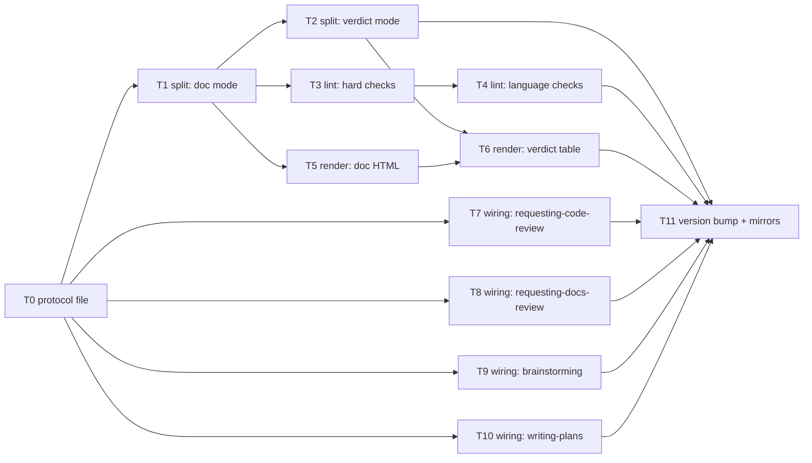

# Plan: adjudication view — conversation-language views of artifacts under adjudication

Source brief: docs/loom/specs/2026-08-12-adjudication-digest.md
Goal: Document-view (plan + brief) as core plus verdict digest: a protocol file, split/translate/reassemble renderer with EN/ZH side-by-side HTML for documents and a findings-table rendition for verdicts, a zero-token lint (modality warning-mode), and wiring at four skills' presentation moments.
Stage: planning
Endpoint named: yes → continuous (goal "把這個功能實作完" names completion; recorded per continuous-mode entry rule)
Total tasks: 12
Critical-path depth: 5 (≤5)
Execution order: parallel-where-possible
Plan-document-reviewer verdict: PASS (2026-08-12, round 3 + same-reviewer delta confirmation, 15/15)

## Task-flow diagram

## Task 0 — protocol file (SSOT) + pin test

- Description: Write `protocols/adjudication-view.md` under the using-loom-code skill — the SSOT for view rules: unit 1:1 with source structure (omissions marked, compression only within a unit), fixed modality mapping table (must→必須 / should→應 / may→可 / must not→不得 / should not→不應), technical nouns + enum tokens verbatim, translator additions provenance-tagged (標記 `譯注`), every rendition regenerated from the artifact, severity emoji verbatim, units-JSON schema (unit id / heading / source_text / anchors / rendition), delivery adapters (Claude Code: side-panel render of scratchpad HTML; Codex: print path + `open` hint — environmental-absence fallback, not a delivery gap), firing conditions (conversation language ≠ English; verdict mode only when findings ≥ 1), and the lint-failure rule (regenerate once, no loop; second failure surfaces to user).
- Module: loom-code/skills/using-loom-code
- Files touched: loom-code/skills/using-loom-code/protocols/adjudication-view.md, loom-code/scripts/test_adjudication_protocol_pins.py
- Context paths:
  - docs/loom/specs/2026-08-12-adjudication-digest.md
  - loom-code/skills/using-loom-code/SKILL.md
  - loom-code/skills/requesting-code-review/references/relay-phrasing.md
- Acceptance:
  - RED: `test_adjudication_protocol_pins.py::test_protocol_carries_modality_table_and_unit_rule` fails (file absent)
  - GREEN: pin test passes — protocol file exists, contains the modality mapping rows, the unit-1:1 rule, the units-JSON schema field list, and the two firing conditions
- External surfaces: none (prose + stdlib test)
- Dependencies: none
- Independent: false
- Brief item covered: "Protocol file (SSOT): `adjudication-digest` protocol under `using-loom-code` — shared rules for both objects"; also brief Smallest End State item 4 ("Conditions: fires only when live conversation language is not English; verdict digest fires only when findings ≥ 1") — pinned by GREEN's firing-conditions check
- Status: pending
- Gloss: 立規則的那份總綱：翻譯視圖怎麼切、怎麼譯、什麼時候觸發，全寫死在這一份

## Task 1 — splitter: document mode

- Description: Create `adjudication_split.py` with doc mode — split a markdown artifact (brief H2 sections; plan `## Task N` blocks) into units JSON per the protocol schema, extracting per-unit anchors (numbers, enum tokens, backticked terms, CamelCase/snake_case identifiers).
- Module: loom-code/scripts
- Files touched: loom-code/scripts/adjudication_split.py, loom-code/scripts/test_adjudication_split.py
- Context paths:
  - loom-code/skills/using-loom-code/protocols/adjudication-view.md
  - loom-code/scripts/backlog_index.py
  - docs/loom/specs/2026-08-12-adjudication-digest.md
- Acceptance:
  - RED: `test_adjudication_split.py::test_doc_mode_unit_count_matches_h2_count` fails (module absent)
  - GREEN: doc-mode split of an inline fixture (brief-shaped markdown) yields exactly one unit per H2 section, each with non-empty source_text and extracted anchors
- External surfaces: none (stdlib only — no markdown library; H2/Task splitting is regex/line-based by design)
- Dependencies: Task 0 completes first
- Independent: false
- Brief item covered: "script splits the English artifact by section/task"
- Status: pending
- Gloss: 把英文文件機械切成一節一節，1:1 由切分保證

## Task 2 — splitter: verdict mode

- Description: Add verdict mode to `adjudication_split.py` — parse a structured verdict block's findings (severity / dimension / where / note / class; docs-variant `quote:`) into units JSON, unit key = where + dimension, ordinal ids assigned.
- Module: loom-code/scripts
- Files touched: loom-code/scripts/adjudication_split.py, loom-code/scripts/test_adjudication_split_verdict.py
- Context paths:
  - loom-code/skills/requesting-code-review/SKILL.md
  - loom-code/skills/requesting-docs-review/SKILL.md
  - loom-code/skills/using-loom-code/protocols/adjudication-view.md
- Acceptance:
  - RED: `test_adjudication_split_verdict.py::test_verdict_mode_parses_findings_with_where_and_severity` fails
  - GREEN: verdict-mode split of an inline fixture (verdict block with 3 findings incl. one docs-variant) yields 3 units carrying verbatim severity emoji, where, dimension
- External surfaces: none (stdlib)
- Dependencies: Task 1 completes first
- Independent: true
- Brief item covered: "Verdict digest: markdown table inline in chat (編號 assigned | severity verbatim emoji | 中文摘述 | `where` anchor verbatim)"
- Status: pending
- Gloss: 同一把刀補 verdict 模式：findings 逐條拆單元、emoji 與錨點原樣帶走

## Task 3 — lint: hard checks

- Description: Create `adjudication_lint.py` — hard checks over units JSON with renditions: every unit has a non-empty rendition (count parity is inherent), and every anchor (number / enum token / backticked term) from each unit's source appears verbatim in that unit's rendition. Non-zero exit on violation, per-unit report.
- Module: loom-code/scripts
- Files touched: loom-code/scripts/adjudication_lint.py, loom-code/scripts/test_adjudication_lint.py
- Context paths:
  - loom-code/skills/using-loom-code/protocols/adjudication-view.md
  - loom-code/scripts/adjudication_split.py
- Acceptance:
  - RED: `test_adjudication_lint.py::test_missing_anchor_echo_fails_lint` fails
  - GREEN: fixture with one rendition missing a source number exits non-zero naming the unit; clean fixture exits 0
- External surfaces: none (stdlib)
- Dependencies: Task 1 completes first
- Independent: true
- Brief item covered: "Zero-token lint on the structured intermediate: unit count == source unit count; every number / enum / English term from each unit appears verbatim in its rendition"
- Status: pending
- Gloss: 零 token 的照合檢查：數字、專名、token 逐字對回原文，漏了就擋

## Task 4 — lint: language checks (negation hard, modality warning)

- Description: Add language checks to `adjudication_lint.py`: source unit containing EN negation tokens (not / no / never / cannot / must not / without) requires ZH negation markers (不 / 未 / 無 / 非 / 沒 / 勿 / 不得) in its rendition — hard fail; modality mapping check (must→必須 / should→應 / may→可) reports WARNING lines without failing (warning mode pinned by test).
- Module: loom-code/scripts
- Files touched: loom-code/scripts/adjudication_lint.py, loom-code/scripts/test_adjudication_lint_language.py
- Context paths:
  - loom-code/skills/using-loom-code/protocols/adjudication-view.md
- Acceptance:
  - RED: `test_adjudication_lint_language.py::test_negation_dropped_in_rendition_fails` fails
  - GREEN: negation-dropped fixture exits non-zero; modality-mismatch fixture exits 0 but emits a WARNING line naming the unit and the expected mapping
- External surfaces: none (stdlib)
- Dependencies: Task 3 completes first
- Independent: false
- Brief item covered: "negation-marker presence check; modality mapping check in warning mode"
- Status: pending
- Gloss: 抓最危險的錯：否定詞被譯丟直接擋下，modality 對照先觀測不硬擋

## Task 5 — renderer: document view (EN/ZH side-by-side HTML)

- Description: Create `adjudication_render.py` with doc mode — units JSON → single self-contained HTML: per unit the ZH rendition with the EN original collapsible beside it (`
`), restrained styling (single accent color, no gradients, no cards, print-safe), embedded CSS, no external resources.
- Module: loom-code/scripts
- Files touched: loom-code/scripts/adjudication_render.py, loom-code/scripts/test_adjudication_render.py
- Context paths:
  - loom-code/skills/using-loom-code/protocols/adjudication-view.md
  - loom-code/scripts/adjudication_split.py
- Acceptance:
  - RED: `test_adjudication_render.py::test_doc_mode_html_carries_both_languages_per_unit` fails
  - GREEN: rendered HTML from a 3-unit fixture contains 3 `
` blocks each holding the unit's source_text, 3 rendition blocks, embedded `<style>`, and zero external URLs
- External surfaces: none (stdlib; template embedded as a module constant)
- Dependencies: Task 1 completes first
- Independent: true
- Brief item covered: "Document view: EN/ZH side-by-side HTML (original collapsible beside each translated unit)"
- Status: pending
- Gloss: 中英對照的 HTML 視圖：譯文為主、原文折疊在旁，抽查零成本

## Task 6 — renderer: verdict table (markdown + HTML)

- Description: Add verdict mode to `adjudication_render.py` — units JSON → (a) markdown table (編號 | severity verbatim emoji | 中文摘述 | where anchor verbatim) for inline chat, and (b) HTML rendition of the same rows via the doc template's table styling. Row order = source order; severity column is copied from the unit field, never recomputed.
- Module: loom-code/scripts
- Files touched: loom-code/scripts/adjudication_render.py, loom-code/scripts/test_adjudication_render_verdict.py
- Context paths:
  - loom-code/skills/using-loom-code/protocols/adjudication-view.md
- Acceptance:
  - RED: `test_adjudication_render_verdict.py::test_verdict_table_rows_equal_findings_and_severity_verbatim` fails
  - GREEN: markdown table from a 3-finding fixture has exactly 3 data rows, severity cells byte-equal to unit severity fields, where cells byte-equal to unit where fields
- External surfaces: none (stdlib)
- Dependencies: Tasks 2, 5 complete first
- Independent: false
- Brief item covered: "findings-table rendition for verdicts … HTML rendition of the same structured rows via the same template"
- Status: pending
- Gloss: verdict 表格兩種皮同一來源：severity 只搬運不重判

## Task 7 — wiring: requesting-code-review

- Description: Add pointer lines (duty + protocol path, no copied rules) at `requesting-code-review/SKILL.md` Step 5 and `references/relay-phrasing.md`; machine-precise verdict-block fence untouched. Pin test asserts both pointer lines exist and the fence wording is unchanged.
- Module: loom-code/skills/requesting-code-review
- Files touched: loom-code/skills/requesting-code-review/SKILL.md, loom-code/skills/requesting-code-review/references/relay-phrasing.md, loom-code/scripts/test_adjudication_wiring_rcr.py
- Context paths:
  - loom-code/skills/using-loom-code/protocols/adjudication-view.md
  - docs/loom/specs/2026-08-12-adjudication-digest.md
- Acceptance:
  - RED: `test_adjudication_wiring_rcr.py::test_rcr_pointers_present_and_fence_intact` fails (pointers absent)
  - GREEN: pin test passes — both pointer lines present, fence lines byte-unchanged
- External surfaces: none
- Dependencies: Task 0 completes first
- Independent: true
- Brief item covered: "requesting-code-review/SKILL.md Step 5 (:118) + references/relay-phrasing.md"
- Status: pending
- Gloss: whole-branch review 呈報時刻接上 verdict 表格義務

## Task 8 — wiring: requesting-docs-review

- Description: Add pointer lines at `requesting-docs-review/SKILL.md` verdict-presentation moments (:52 hand-to-user, :125 STILL_BLOCKING stop). Pin test asserts both pointers exist.
- Module: loom-code/skills/requesting-docs-review
- Files touched: loom-code/skills/requesting-docs-review/SKILL.md, loom-code/scripts/test_adjudication_wiring_rdr.py
- Context paths:
  - loom-code/skills/using-loom-code/protocols/adjudication-view.md
  - docs/loom/specs/2026-08-12-adjudication-digest.md
- Acceptance:
  - RED: `test_adjudication_wiring_rdr.py::test_rdr_pointers_present` fails
  - GREEN: pin test passes — both pointer lines present
- External surfaces: none
- Dependencies: Task 0 completes first
- Independent: true
- Brief item covered: "requesting-docs-review/SKILL.md (:52, :125)"
- Status: pending
- Gloss: docs review 的 verdict 與卡關呈報接上同一義務

## Task 9 — wiring: brainstorming

- Description: Add a pointer line at `brainstorming/SKILL.md` sign-off checkpoint directing the orchestrator to produce the document view per the protocol before requesting sign-off. Pin test asserts the pointer exists.
- Module: loom-code/skills/brainstorming
- Files touched: loom-code/skills/brainstorming/SKILL.md, loom-code/scripts/test_adjudication_wiring_brainstorming.py
- Context paths:
  - loom-code/skills/using-loom-code/protocols/adjudication-view.md
  - docs/loom/specs/2026-08-12-adjudication-digest.md
- Acceptance:
  - RED: `test_adjudication_wiring_brainstorming.py::test_brainstorming_pointer_present` fails
  - GREEN: pin test passes — pointer line present at the sign-off checkpoint
- External surfaces: none
- Dependencies: Task 0 completes first
- Independent: true
- Brief item covered: "brainstorming/SKILL.md sign-off checkpoint (:219)"
- Status: pending
- Gloss: brief sign-off 時刻接上中英對照視圖

## Task 10 — wiring: writing-plans

- Description: Add pointer lines at `writing-plans/SKILL.md` plan-presentation moments (kickoff briefing + post-PASS card) directing the orchestrator to produce the document view per the protocol. Pin test asserts both pointers exist.
- Module: loom-code/skills/writing-plans
- Files touched: loom-code/skills/writing-plans/SKILL.md, loom-code/scripts/test_adjudication_wiring_writing_plans.py
- Context paths:
  - loom-code/skills/using-loom-code/protocols/adjudication-view.md
  - docs/loom/specs/2026-08-12-adjudication-digest.md
- Acceptance:
  - RED: `test_adjudication_wiring_writing_plans.py::test_writing_plans_pointers_present` fails
  - GREEN: pin test passes — both pointer lines present
- External surfaces: none
- Dependencies: Task 0 completes first
- Independent: true
- Brief item covered: "writing-plans/SKILL.md plan-presentation moments"
- Status: pending
- Gloss: plan review gate 時刻接上中英對照視圖

## Task 11 — version bump + codex mirror sync

- Description: Bump loom-code plugin version 0.76.0 → 0.77.0 in the canonical manifest `loom-code/.claude-plugin/plugin.json`, add the 0.77.0 CHANGELOG entry, and regenerate the Codex mirror `loom-code/.codex-plugin/plugin.json` via `python3 scripts/sync_codex_manifests.py` (SSOT: the canonical manifest; the PostToolUse hook `.claude/hooks/check-codex-manifest-drift.sh` blocks on drift at edit time). Root `.claude-plugin/marketplace.json` needs no touch — verified: its loom-code entry carries no version field and the description is unchanged (`scripts/check-marketplace-description-sync.py` OK on current tree).
- Module: loom-code
- Files touched: loom-code/.claude-plugin/plugin.json, loom-code/CHANGELOG.md, loom-code/.codex-plugin/plugin.json
- Context paths:
  - loom-code/CHANGELOG.md
  - .claude/hooks/check-codex-manifest-drift.sh
  - scripts/sync_codex_manifests.py
- Acceptance:
  - RED: after bumping only the canonical manifest, `.claude/hooks/check-codex-manifest-drift.sh` reports drift (exit 2) — the diagnostic RED
  - GREEN: after `python3 scripts/sync_codex_manifests.py`, drift check exits 0; both manifests read 0.77.0; CHANGELOG 0.77.0 entry present
- External surfaces: none
- Dependencies: Tasks 2, 4, 6, 7, 8, 9, 10 complete first
- Independent: false
- Brief item covered: "One loom-code version bump + `.codex-plugin` mirror sync"; also brief Open Question 3 ("DIRECTION bet … at close-out") — disposition recorded in ## Notes "DIRECTION bet" entry with its file:line citation (existing mechanism at finishing-a-development-branch/SKILL.md:201; no new task work)
- Status: pending
- Gloss: 出貨行政：版本、變更記錄、Codex 鏡射一次到位（皆在 loom-code 模組內）

## Notes

- Verdict stamped in header after round-3 delta confirmation — amendment kind 1 (stamping), no re-review.
- Change-folder detection: two non-archived `docs/loom/<change-id>/` folders exist (2026-07-12-us-sec-primary-source-layer, 2026-07-19-8k-prose-kpi-intake) — both are July investing arcs unrelated to this work; the continuous-mode freeze declared the brainstorming brief as the entry artifact, so the change-folder consumption path does not apply. Recorded here per detection-cascade honesty.
- Naming decision (brief Open Question 1): mechanism named **adjudication view**; grep-verified `adjudicat*` has only generic-verb hits in loom-code and the finishing "digest-silently" vocabulary is untouched.
- DIRECTION bet (brief Open Question 3): `## Now` promotion to COMMITTED-NEXT is deferred to the user's close-out call — out of this plan's task scope. The surfacing mechanism already exists and is cited, not claimed: `loom-code/skills/finishing-a-development-branch/SKILL.md:201` (Backlog-close check row — "if COMMITTED-NEXT is EMPTY, surface a betting prompt to the user … the USER promotes … agents never auto-promote"). Task 11's `Brief item covered` field points here for traceability.
- Check-15 advisory answer (round 1): Task 4 and Task 6 stay `Independent: false` deliberately — Task 4 shares `adjudication_lint.py` with Independent-true Task 3, and Task 6 shares `adjudication_render.py` with Independent-true Task 5, so marking them true would violate Check 14's pairwise disjointness; the file-sharing is the real semantic reason.
- Rider backlog items (brief Open Question 2): `2026-07-06-anti-copy-acceptance-greps-pass-paraphrase-copies` (start condition now fires — this plan touches writing-plans SKILL.md) and `2026-07-10-change-binding-chain-integration-test` (fires on any loom-code touch) — both surfaced, neither bundled: deferred to the close-out betting step for the user's call. Queue informs, never hijacks.
- Test fixtures are inline in each test file (repo convention per existing `test_backlog_index.py` / `test_plan_card.py`); the real brief `docs/loom/specs/2026-08-12-adjudication-digest.md` serves as a manual smoke target, not a committed fixture.
- The LLM translate-per-unit step is orchestrator-side (fills `rendition` in units JSON) — deliberately not in any script; scripts stay deterministic stdlib-only.
