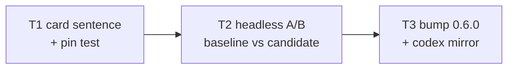

# Plan: ascii-graph generative trigger sentence

**Source brief**: docs/loom/specs/2026-08-12-ascii-graph-generative-trigger.md
Goal: the always-loaded chat card gains one pinned generative imperative —
    explain-a-flow moments trigger diagram-first behavior, A/B-verified on
    a weak tier before ship — and the toolkit ships it as 0.6.0.
Stage: finishing
Steps:
  1. 卡文加句＋釘測試
  2. 弱模型 A/B 行為驗證
  3. 版本 bump 出貨
**Total tasks**: 3
**Critical-path depth**: 3 (≤5 ✓)
**Execution order**: sequential
**Plan-document-reviewer verdict**: PASS (2026-08-12, round 1, 15/15)

## Task-flow diagram



## Task 1 — Append the pinned generative sentence + extend the pin test

- **Description**: In `ascii-graph-toolkit/hooks/trigger-card.md`, append the §Pinned generative sentence (Pin G, transcribe VERBATIM) as a new paragraph after the existing text. Do NOT alter existing lines — `test_trigger_card.py::test_session_start_emits_trigger_card` pins "ascii-graph", "CJK", "Trivial all-ASCII sketches" in the emitted context and the hooks.json wiring (`ascii-graph-toolkit/scripts/test_trigger_card.py:60-63,66-77`). Extend `ascii-graph-toolkit/scripts/test_trigger_card.py` with a new test function `test_card_carries_generative_trigger` that runs the real hook (same subprocess pattern as the existing test) and asserts Pin G's full load-bearing phrases in `additionalContext`: the complete phrase "about to EXPLAIN in chat any flow / state machine / architecture" and the complete guard phrase "never draw for decoration", each `count() == 1` in the card file. Write the failing test FIRST (TDD).
- **Module**: `ascii-graph-toolkit/hooks/trigger-card.md`
- **Files touched**: `ascii-graph-toolkit/hooks/trigger-card.md`, `ascii-graph-toolkit/scripts/test_trigger_card.py`
- **Context paths**:
  - /Users/kouko/GitHub/monkey-skills/ascii-graph-toolkit/hooks/trigger-card.md
  - /Users/kouko/GitHub/monkey-skills/ascii-graph-toolkit/scripts/test_trigger_card.py
  - /Users/kouko/GitHub/monkey-skills/docs/loom/plans/2026-08-12-ascii-graph-generative-trigger.md (§Pinned wording)
- **Acceptance**:
  - **RED**: `ascii-graph-toolkit/scripts/test_trigger_card.py::test_card_carries_generative_trigger` fails on the current card (Pin G phrases absent).
  - **GREEN**: full suite `python3 -m pytest ascii-graph-toolkit/scripts/ -q` green (baseline 2 tests + 1 new = 3), existing two tests untouched and passing.
- **Dependencies**: none
- **Independent**: false
- **Brief item covered**: "ONE generative imperative sentence appended … Existing pinned phrases … stay intact" + "Pin test extended"
- **Status**: done(5441c394)
- **Gloss**: 常駐卡從「要畫時管怎麼畫」升級為「該畫時主動畫」——用已證 2/2 有效的祈使句型載體。

## Task 2 — Headless weak-tier A/B: baseline card vs candidate card

- **Description**: Behavioral A/B per the recipe in `docs/loom/memory/headless-branch-plugin-testing-recipe.md` (Read it FIRST; `--plugin-dir` wrapper, neutral empty cwd, verify probe hook injection before trusting a leg). Legs: baseline = main's `ascii-graph-toolkit` (git show main:… to a temp copy), candidate = this branch's plugin dir. Probe prompt (identical both legs, no diagram mention): a request to explain a 4-step multi-component flow in chat (e.g. "explain how a request travels through loadbalancer, auth, cache and db in our setup" — exact prompt recorded in the report). n≥2 per leg on the weakest available tier (haiku). Success signal per run: the reply leads with (or contains) an ascii-graph-skill-generated diagram (or an explicit skill invocation attempt) BEFORE/alongside prose; baseline expectation ≈ prose-only. Also probe the anti-decoration guard once on the candidate: a trivially linear 2-step question must NOT produce a diagram. Write the report to `docs/loom/dogfood/2026-08-12-generative-trigger-card-ab.md` (candidate vs baseline per-run table, verbatim probe prompts, injection-verified note, verdict). Candidate ≤ baseline → report NEEDS_REVISION of the sentence wording back to the orchestrator (do not silently pass). NOTE: the Write tool refuses basename `report.md` — the dogfood filename above avoids it.
- **Module**: `docs/loom/dogfood/2026-08-12-generative-trigger-card-ab.md` (NEW)
- **Files touched**: `docs/loom/dogfood/2026-08-12-generative-trigger-card-ab.md`
- **Context paths**:
  - /Users/kouko/GitHub/monkey-skills/docs/loom/memory/headless-branch-plugin-testing-recipe.md
  - /Users/kouko/GitHub/monkey-skills/docs/loom/dogfood/2026-07-10-visual-trigger-weak-model-dogfood.md (precedent format + the 2/2 vs 0/2 baseline)
  - /Users/kouko/GitHub/monkey-skills/ascii-graph-toolkit/hooks/trigger-card.md (candidate card, post-T1)
- **Acceptance**:
  - **RED**: baseline leg (main's card) produces prose-only on the explain-a-flow probe (expected ≈0/2 diagram-first) — the diagnostic that the gap exists.
  - **GREEN**: candidate leg produces diagram-first behavior on ≥2/2 explain-a-flow probes AND 0/1 on the anti-decoration probe; report file exists with per-run evidence.
- **External surfaces**: CLI flag: `claude --plugin-dir` (grounding: in-repo evidence — docs/loom/memory/headless-branch-plugin-testing-recipe.md, recorded live recipe)
- **Dependencies**: Task 1 completes first
- **Independent**: false
- **Brief item covered**: "Behavioral A/B before ship: headless `--plugin-dir` probes … baseline vs candidate, n≥2 per leg, weak tier; report → docs/loom/dogfood/"
- **Status**: done(07dd0886)
- **Gloss**: 照 0.5.0 卡的先例實測新句子真的翻轉行為、且不誘發裝飾圖——測不過就改句子，不出貨未驗證的卡。

## Task 3 — Bump ascii-graph-toolkit 0.5.0 → 0.6.0 + codex mirror

- **Description**: In `ascii-graph-toolkit/.claude-plugin/plugin.json`, replace the exact literal `"version": "0.5.0"` with `"version": "0.6.0"`. Then run exactly `python3 scripts/sync_codex_manifests.py ascii-graph-toolkit` (script verified 2026-08-11 at `scripts/sync_codex_manifests.py`, positional arg = plugin dir name, SSOT = `.claude-plugin/plugin.json`) and commit its output to `ascii-graph-toolkit/.codex-plugin/plugin.json` unmodified. No CHANGELOG (this plugin has never carried one — brief §Smallest End State item 4 records the verified rationale); no shipping-version pin test exists in this plugin (verified by grep, same brief item). No other changes.
- **Module**: `ascii-graph-toolkit/.claude-plugin/plugin.json`
- **Files touched**: `ascii-graph-toolkit/.claude-plugin/plugin.json`, `ascii-graph-toolkit/.codex-plugin/plugin.json`
- **Context paths**:
  - /Users/kouko/GitHub/monkey-skills/docs/loom/plans/2026-08-12-ascii-graph-generative-trigger.md (§Pinned wording)
- **Acceptance**:
  - **RED**: `grep -F '"version": "0.6.0"' ascii-graph-toolkit/.claude-plugin/plugin.json` exits 1 before the edit; `python3 scripts/sync_codex_manifests.py ascii-graph-toolkit --check` exits non-zero after bumping `.claude-plugin` but before the sync run.
  - **GREEN**: the grep exits 0 on BOTH json files; `--check` exits 0; suite `python3 -m pytest ascii-graph-toolkit/scripts/ -q` green (3 tests).
- **External surfaces**: none (in-repo manifests + repo's own sync script)
- **Dependencies**: Task 2 completes first
- **Independent**: false
- **Review-weight**: mechanical
- **Brief item covered**: "Version bump 0.5.0 → 0.6.0, both manifests via `python3 scripts/sync_codex_manifests.py ascii-graph-toolkit`"
- **Status**: done(e4dcf14e)
- **Gloss**: A/B 過了才出貨——bump 排在驗證後面，不給市集半成品。

## Notes

**Endpoint recording**: endpoint named: no → human-pumped.

**Change-folder detection**: N/A — explicit brief handoff (the two resident date-slug folders belong to shipped investing arcs; unchanged from the 2026-08-11 plan's finding).

**User rulings (2026-08-12)**: option 1 only — trigger-card.md is the sole behavior surface; family-relay §(b) rewrite (option 2) and relay-seam slots (option 3) explicitly rejected; SKILL.md description untouched this arc.

**Recorded debt (→ PR body 🟢)**: no CI workflow runs `ascii-graph-toolkit/scripts/` (pre-existing; tests are local-only — this arc runs them in every task's GREEN but CI stays blind); Codex-side injection probe for THIS plugin's hook rides the post-merge telemetry backlog item (2026-07-10-ascii-graph-trigger-fix-post-ship-telemetry-a-b-re-run).

**Grep-pin discipline**: new assertions pin the full phrases their failure messages name, `count() == 1` in the guarded scope (docs/loom/memory/substring-assertions-must-pin-the-phrase-their-message-names.md).

**Standing trap-guards for every dispatch packet**: Read a file before you Edit it; on a modified-since-read error, re-Read then re-Edit — never retry the same diff. If a guard/hook blocks the same command twice, stop and report the block message verbatim. Never use `git stash` (an autostash was applied on this branch's parent checkout — never pop). Stage by explicit path only; never `git add -A`/`-u`.

### Pinned wording — transcribe VERBATIM; amendments go AFTER a pin, never inside it

**Pin G — the generative trigger sentence** (Task 1; appended as a new paragraph):

```
GENERATIVE trigger — when you are about to EXPLAIN in chat any flow /
state machine / architecture involving ≥3 steps, states, or components:
invoke the `ascii-graph` skill FIRST and lead the explanation with the
generated diagram, then narrate. Skip when one short paragraph fully
covers it — never draw for decoration; option comparisons keep the
table rule above.
```
