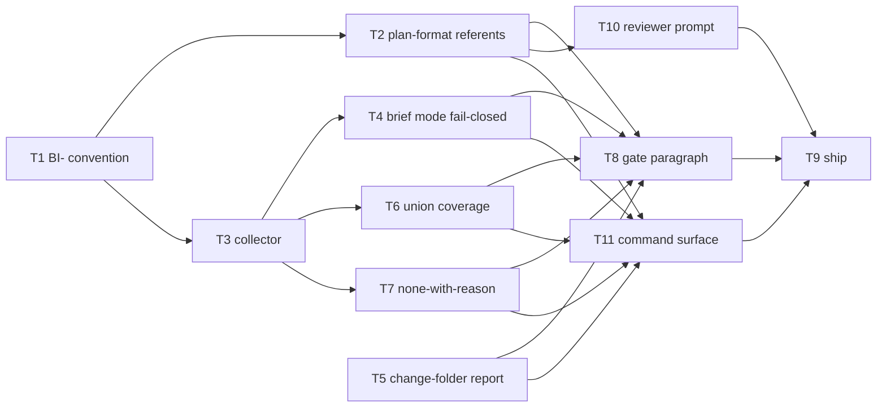

# Plan: brief-item addressability

Source brief: docs/loom/specs/2026-08-13-brief-item-addressability.md
Goal: Give brief items hybrid identity (an immutable `BI-<n>` plus the human-readable text) in every outcome-declaring section, let `Brief item covered` cite that id inside the existing field, extend the coverage checker with a brief mode that treats an item as covered by the union of citing tasks, and make an unresolvable citation an error instead of a silent zero.
Stage: finishing
Endpoint named: no — the request named implementation ("開始依照 loom 的標準流程實作吧"), not a publish endpoint; PR and merge stay human-pumped.
Total tasks: 11
Critical-path depth: 5 (≤5)
Execution order: parallel-where-possible
Plan-document-reviewer verdict: PASS (2026-08-13, round 2 + delta confirmation)

Steps:
  1. 宣告識別碼慣例、同時修掉舊路徑的沉默
  2. 引用端與解析端開工
  3. 檢查器行為與下游消費者
  4. 接上閘門
  5. 出貨行政

## Task-flow diagram

## Task 1 — declare the `BI-<n>` convention in the brief schema

- Description: Add a `## Brief item identifiers` section to `handoff-brief-format.md` declaring: identifiers take the form `BI-<n>`; they are authored, never derived from headings; they are assigned monotonically and **never renumbered or reused** (an item inserted later takes the next unused number regardless of position); they are declared on outcome-declaring items in **any** section, not only `## Smallest End State`; and each declaration is written as the id followed by the human-readable item text on the same line. State the two-part rationale in one sentence each: monotonic-never-reused is what makes the id immutable under insertion, and authored-not-derived is what stops the id desyncing when the text is reworded.
- Module: loom-code/skills/brainstorming/references/handoff-brief-format.md
- Files touched: loom-code/skills/brainstorming/references/handoff-brief-format.md, loom-code/scripts/test_brief_item_ids.py
- Context paths:
  - loom-code/skills/brainstorming/references/handoff-brief-format.md
  - docs/loom/specs/2026-08-13-brief-item-addressability.md
- Acceptance:
  - RED: `loom-code/scripts/test_brief_item_ids.py::test_schema_declares_the_identifier_convention` fails — no `## Brief item identifiers` section exists in `handoff-brief-format.md`.
  - GREEN: the section exists and the pin resolves all four declared properties (form, authored-not-derived, monotonic-never-reused, any-outcome-section scope) by slicing that section rather than searching the whole file.
- Dependencies: none
- Independent: true
- Brief item covered: "Brief items carry hybrid identity — an immutable short ID plus the human-readable text"
- Status: done(bd357f60)
- Gloss: brief 格式第一次有了「項目怎麼命名」的規則，而且規定編號只增不改

## Task 2 — teach `plan-format.md` the new referent kind, the none-value, and the tie-break

- Description: Extend `plan-format.md`'s `Brief item covered` definition with referent kind (c) — a `BI-<n>` id declared by the source brief — alongside the existing quote and join-key kinds. Add the legal no-requirement value `none — <reason>` with the reason mandatory, and state why it exists (a task that delivers no brief outcome must not be forced into a false citation). Add the tie-break rule: when a task plausibly delivers two items, the primary referent is **the item the task's RED test asserts**. Do NOT add a second traceability field — `test_traceability_generalization.py:62-70` forbids it by design.
- Module: loom-code/skills/writing-plans/references/plan-format.md
- Files touched: loom-code/skills/writing-plans/references/plan-format.md, loom-code/scripts/test_plan_format_referent_kinds.py
- Context paths:
  - loom-code/skills/writing-plans/references/plan-format.md
  - loom-code/scripts/test_traceability_generalization.py
- Acceptance:
  - RED: `loom-code/scripts/test_plan_format_referent_kinds.py::test_bi_referent_none_value_and_tiebreak_are_declared` fails — `plan-format.md` names no `BI-` referent kind, no `none — <reason>` value, and no tie-break rule.
  - GREEN: all three are declared, and `loom-code/scripts/test_traceability_generalization.py` still passes unchanged (no second traceability field name was introduced).
- Dependencies: Task 1 completes first
- Independent: false
- Brief item covered: "`Brief item covered` accepts the ID as a third referent form" + "A written tie-break rule for the primary referent"
- Status: done(66b2fe1d)
- Gloss: 計畫端學會引用新的識別碼，有了合法的「無需求對應」寫法，平手規則也寫死

## Task 3 — collect declared `BI-<n>` ids from a brief

- Description: Add a brief-item collector to `check_scenario_coverage.py` that reads a brief file and returns its declared `BI-<n>` ids with their line numbers. A brief declaring zero ids returns an empty set — that is a legal legacy brief, not an error.
- Module: loom-code/scripts/check_scenario_coverage.py
- Files touched: loom-code/scripts/check_scenario_coverage.py, loom-code/scripts/test_check_scenario_coverage.py
- Context paths:
  - loom-code/scripts/check_scenario_coverage.py
  - loom-code/skills/brainstorming/references/handoff-brief-format.md
- Acceptance:
  - RED: `loom-code/scripts/test_check_scenario_coverage.py::test_collects_declared_brief_item_ids` fails — no collector exists.
  - GREEN: given a fixture brief declaring three ids across two different sections, the collector returns exactly those three with correct line numbers; given a brief declaring none, it returns an empty set without raising.
- Dependencies: Task 1 completes first
- Independent: false
- Brief item covered: "The coverage checker gains a brief mode"
- Status: done(ac15c95e)
- Gloss: 檢查器學會從 brief 讀出宣告過的識別碼，舊格式 brief 不會因此報錯

## Task 4 — brief mode: resolve citations and fail closed on an unresolvable one

- Description: Resolve each task's `Brief item covered` value against the collected id set. When the brief declares at least one id, a value that is neither a resolvable `BI-<n>` nor the `none — <reason>` form is an ERROR that names the offending task and quotes the value verbatim. When the brief declares no ids, the legacy quote form stays legal and no resolution is attempted — announce that legacy mode in the output rather than passing silently.
- Module: loom-code/scripts/check_scenario_coverage.py
- Files touched: loom-code/scripts/check_scenario_coverage.py, loom-code/scripts/test_check_scenario_coverage.py
- Context paths:
  - loom-code/scripts/check_scenario_coverage.py
  - loom-code/scripts/test_check_scenario_coverage.py
- Acceptance:
  - RED: `loom-code/scripts/test_check_scenario_coverage.py::test_unresolvable_citation_errors_when_brief_declares_ids` fails — an unknown `BI-99` citation currently contributes zero keys silently and the run exits 0.
  - GREEN: the unknown citation exits non-zero with a message naming the task and quoting `BI-99`; a legacy brief with zero declared ids still exits 0 while printing an explicit legacy-mode line; and the existing prose-referent pin `test_malformed_plan_prose_only_zero_coverage_exit_1` passes **unchanged** (same exit code, same `Empty result set` and `Single match` stderr assertions) — brief mode must not reach the change-folder path it guards.
- Dependencies: Task 3 completes first
- Independent: false
- Brief item covered: "The fail-open closes. A `Brief item covered` value matching no known referent grammar is an ERROR"
- Status: done(bad3a07a)
- Gloss: 引用寫錯會當場報錯並指名，不再安靜地變成「這條沒人做」

## Task 5 — change-folder mode: name the referents that did not parse instead of dropping them

- Description: Close the same silence on the change-folder path the brief says shares the defect. The skip is `if m is None: continue` inside `collect_plan_join_keys` — a referent that does not match the join-key grammar vanishes with no trace, so a typo among otherwise-valid keys reads as "this scenario has no task". Report every unparsed referent with its task and the value verbatim. **Do not turn it into an error**: on this path a prose quote is a legal referent kind, so an unparsed value is genuinely ambiguous between a legitimate quote and a typo — the harm is the silence, not the permissiveness. Exit-code semantics stay exactly as they are.
- Module: loom-code/scripts/check_scenario_coverage.py
- Files touched: loom-code/scripts/check_scenario_coverage.py, loom-code/scripts/test_check_scenario_coverage.py
- Context paths:
  - loom-code/scripts/check_scenario_coverage.py
  - loom-code/scripts/test_check_scenario_coverage.py
- Acceptance:
  - RED: `loom-code/scripts/test_check_scenario_coverage.py::test_unparsed_change_folder_referent_is_named_not_dropped` fails — a plan mixing one valid join key with one malformed referent currently reports only the resulting coverage gap, never the malformed value.
  - GREEN: the malformed value and its task appear in the output verbatim; and BOTH existing pins pass **unchanged** — `test_malformed_plan_prose_only_zero_coverage_exit_1` (exit 1, `Empty result set`, `Single match`) and `test_malformed_plan_no_brief_item_field_at_all_zero_coverage_exit_1` (exit 1).
- Dependencies: none
- Independent: true
- Brief item covered: "This fix applies to the existing change-folder path too — the defect is in shared code"
- Status: done(7aa98bd4)
- Gloss: 舊路徑上解析不出來的引用會被列名，不再無聲消失；但不改判成錯誤，因為那條路上引述本來就合法

## Task 6 — treat an item as covered by the union of citing tasks

- Description: Compute coverage per declared id as the union of every task citing it, so an item delivered jointly by several tasks counts as covered once all its citing tasks exist, and report any declared id that no task cites. The experiment found one real item (`--lang` on **both** scripts) delivered half by one task and half by another, with neither alone satisfying it.
- Module: loom-code/scripts/check_scenario_coverage.py
- Files touched: loom-code/scripts/check_scenario_coverage.py, loom-code/scripts/test_check_scenario_coverage.py
- Context paths:
  - loom-code/scripts/check_scenario_coverage.py
  - docs/loom/specs/2026-08-13-brief-item-addressability.md
- Acceptance:
  - RED: `loom-code/scripts/test_check_scenario_coverage.py::test_item_cited_by_two_tasks_is_covered_once` fails — no per-id union coverage exists.
  - GREEN: a fixture where two tasks each cite `BI-2` reports `BI-2` covered exactly once (not double-counted); a declared id cited by no task is reported as uncovered with its line number; and the existing prose-referent pin `test_malformed_plan_prose_only_zero_coverage_exit_1` passes unchanged.
- Dependencies: Task 3 completes first
- Independent: false
- Brief item covered: "Coverage is directional both ways… the checker must therefore treat an item as covered by the UNION of citing tasks"
- Status: done(c1163888)
- Gloss: 一個項目由兩個任務各做一半也算被覆蓋，沒人做的項目會被指名

## Task 7 — make `none` legal only with a reason

- Description: Accept `none — <reason>` as a valid `Brief item covered` value and reject a bare `none`, an empty reason, or a whitespace-only reason with an error naming the task. The mandatory reason is what stops the value becoming a silent opt-out.
- Module: loom-code/scripts/check_scenario_coverage.py
- Files touched: loom-code/scripts/check_scenario_coverage.py, loom-code/scripts/test_check_scenario_coverage.py
- Context paths:
  - loom-code/scripts/check_scenario_coverage.py
  - loom-code/skills/writing-plans/references/plan-format.md
- Acceptance:
  - RED: `loom-code/scripts/test_check_scenario_coverage.py::test_bare_none_is_rejected_and_none_with_reason_is_accepted` fails — no `none` handling exists.
  - GREEN: `none — release administration only` passes; bare `none` and `none — ` both exit non-zero naming the task.
- Dependencies: Task 3 completes first
- Independent: false
- Brief item covered: "A legal no-requirement value: `none — <reason>`, reason mandatory"
- Status: done(9a54a1d7)
- Gloss: 「這個任務沒有需求對應」是合法的，但必須寫理由，不能空著混過去

## Task 8 — wire brief mode into the writing-plans gate paragraph

- Description: In `writing-plans/SKILL.md`'s coverage-gate paragraph (`:251`), add one sentence stating that when the source brief declares `BI-` ids, the same `check_scenario_coverage.py` invocation runs in brief mode before the plan-document-reviewer dispatch, with the same block-on-nonzero rule. Then remove EVERY claim in that paragraph that the check is change-folder-only — there are at least two: the heading "Coverage self-check (change-folder input only)" and the body sentence "This check applies only to the change-folder input path; a brainstorming-brief-only plan has no change-folder to check coverage against". Pointer, not copy — the mechanics stay in the script and in `plan-format.md`.
- Module: loom-code/skills/writing-plans/SKILL.md
- Files touched: loom-code/skills/writing-plans/SKILL.md, loom-code/scripts/test_wp_extraction_pointers.py
- Context paths:
  - loom-code/skills/writing-plans/SKILL.md
  - loom-code/scripts/test_wp_extraction_pointers.py
- Acceptance:
  - RED: `loom-code/scripts/test_wp_extraction_pointers.py::test_brief_mode_coverage_gate_is_named` fails — the paragraph mentions only the change-folder input.
  - GREEN: the new sentence is present AND the sliced paragraph contains no sentence restricting the check to the change-folder input path (one assertion covering heading and body, since both are single lines); the file's existing word ceiling still passes — if the addition breaches it, raise it deliberately with the reason recorded inline rather than trimming the new duty.
- Dependencies: Tasks 2, 4, 5, 6, 7 complete first
- Independent: true
- Brief item covered: "The coverage checker gains a brief mode… This mirrors what the change-folder path already gets, on the path every arc actually uses"
- Status: done(e4943660)
- Gloss: 閘門那段學會 brief 模式，並且把「只適用 change-folder」這個說法從標題與本文一起拿掉

## Task 11 — declare the `--brief` invocation form in the command surface

- Description: `AGENTS.md`'s command-surface entry declares this script as `python3 loom-code/scripts/check_scenario_coverage.py <change-folder> <plan-path>` only, and its parenthetical label reads "(writing-plans self-check, change-folder input only)". Add the `--brief` invocation form and remove the change-folder-only claim from that label — per `writing-plans`' runnable-capability rule that a new verb is declared in the command surface AND verified to run.
- Module: AGENTS.md
- Files touched: AGENTS.md, loom-code/scripts/test_writing_plans_change_binding.py
- Context paths:
  - AGENTS.md
  - loom-code/scripts/test_writing_plans_change_binding.py
- Acceptance:
  - RED: extend `loom-code/scripts/test_writing_plans_change_binding.py::test_agents_md_declares_coverage_script` (def at `:148`, asserts through `:158`) to assert the entry declares the `--brief` form; it fails today because `AGENTS.md:54` declares the two-positional form only. The existing pin asserts only that the block names the script, which is already true — that is why a new assertion is required rather than reuse.
  - GREEN: the entry carries the `--brief` form, the sliced entry carries no remaining claim that the check is change-folder-only — the parenthetical at `:53` is one such claim and the body at `:55-58` describes only the change-folder mode, so an ABSENCE assertion over the entry is required rather than naming one line — and that form was EXECUTED once against a real brief/plan pair to confirm it runs.
- Dependencies: Tasks 2, 4, 5, 6, 7 complete first
- Independent: true
- Brief item covered: "The coverage checker gains a brief mode" + none — the command-surface declaration duty comes from `writing-plans`' splitting framework, not from a brief item
- Status: done(983ac653)
- Gloss: 命令表面補上 `--brief` 這個呼叫形式，並且實跑一次確認它真的能動

## Task 9 — version bump, CHANGELOG, and Codex mirror sync

- Description: Bump `loom-code/.claude-plugin/plugin.json` to the next minor version, write the CHANGELOG entry for this arc, and re-run the Codex manifest sync so `.codex-plugin/plugin.json` mirrors it. The CHANGELOG entry must state the honest limit: the experiment measured citation determinacy on ONE brief/plan pair, so the scheme ships tested but not field-validated across arcs.
- Module: loom-code/.claude-plugin/plugin.json
- Files touched: loom-code/.claude-plugin/plugin.json, loom-code/.codex-plugin/plugin.json, loom-code/CHANGELOG.md
- Context paths:
  - loom-code/CHANGELOG.md
  - .claude/hooks/check-codex-manifest-drift.sh
- Acceptance:
  - RED: `scripts/test_check_version_bump.py::test_skill_content_without_version_bump_is_a_violation` fails while this branch's skill-content edits sit unbumped; and `.claude/hooks/check-codex-manifest-drift.sh` exits non-zero while `.codex-plugin/plugin.json` still carries the old version.
  - GREEN: both pass, the CHANGELOG entry exists with the honest-limit sentence, and the full suite is green.
- Dependencies: Tasks 8, 10, 11 complete first
- Independent: false
- Brief item covered: none — release administration; this task delivers no brief outcome. Escape authorised by brief §Smallest End State item 5 ("A legal no-requirement value: `none — <reason>`, reason mandatory") and by §Experiment's unmappable-by-design finding, where all three probes independently called the equivalent release task unmappable. This task is also the plan's own worked instance of the value Task 7 makes legal.
- Status: done(004c0799)
- Gloss: 出貨行政：版本號、變更記錄、Codex 鏡射三者對齊

## Task 10 — teach the plan-document-reviewer prompt the new referent kind and the none-value

- Description: Update `plan-document-reviewer-prompt.md` so its own checks accept what `plan-format.md` now declares. Check 3 enumerates "EITHER referent kind: (a)… OR (b)…" and must gain kind (c), the `BI-<n>` identifier. Check 9 says every task's `Brief item covered` "quotes / references the brief" and must state that `none — <reason>` satisfies it, with the reason mandatory — a task delivering no brief outcome is not an orphan. Point at `plan-format.md`'s definition rather than restating the rules; that file is the SSOT for referent kinds.
- Module: loom-code/skills/writing-plans/references/plan-document-reviewer-prompt.md
- Files touched: loom-code/skills/writing-plans/references/plan-document-reviewer-prompt.md, loom-code/scripts/test_plan_reviewer_referent_kinds.py
- Context paths:
  - loom-code/skills/writing-plans/references/plan-document-reviewer-prompt.md
  - loom-code/skills/writing-plans/references/plan-format.md
- Acceptance:
  - RED: `loom-code/scripts/test_plan_reviewer_referent_kinds.py::test_checks_accept_the_bi_referent_and_the_none_value` fails — Check 3 names only kinds (a) and (b), and Check 9 admits no no-requirement value.
  - GREEN: both checks name the new referent kind and the `none — <reason>` value, asserted by slicing each check's own table row rather than searching the file; and the nine other test modules pinning this prompt still pass unchanged.
- Dependencies: Task 2 completes first
- Independent: false
- Brief item covered: "`Brief item covered` accepts the ID as a third referent form" + "A legal no-requirement value: `none — <reason>`, reason mandatory"
- Status: done(43133773)
- Gloss: 計畫審查者的檢查表學會新的引用形式，否則作者用了新值反而會被自家閘門判缺口

## Notes

- **Kickoff decision — ID form**: `BI-<n>`, assigned monotonically, never renumbered, never reused. Chosen over ordinal-position numbering because ordinals are not immutable under insertion, which defeats the "immutable ID" half of the hybrid. Rationale is ADR's published convention ("numbered sequentially and monotonically. Numbers will not be reused"); the brief's identifier research records why insertion/renumbering is the documented failure mode of ordinal schemes (ISO requires dated clause references for exactly this reason).
- **Kickoff decision — authored, not derived**: the id is written by the brief author, not slugified from the heading. A derived id desyncs the moment the text is reworded — the documented hole in every hybrid surveyed (Jira keeps stale key aliases resolving after a rename).
- **Kickoff decision — legacy briefs**: a brief declaring zero `BI-` ids puts the checker in legacy mode, where the quote referent stays legal and no resolution is attempted. Task 4's GREEN requires that mode be announced in the output rather than passing silently, so "legacy" can never be mistaken for "checked".
- **Kickoff decision — tie-break**: the primary referent is the item the task's RED test asserts. Chosen because the RED test is this repo's definition of done, so it is the least arbitrary anchor available; the alternative (the item most of `Files touched` serves) tracks effort rather than outcome.
- **Kickoff decision — the change-folder half reports, it does not error** (Task 5). On that path a prose quote is a legal referent kind, so an unparsed value cannot be distinguished from a typo; erroring would break two shipped pins and would punish a legal form. Brief mode can error because there the grammar is unambiguous. The two paths therefore close the same silence with different verbs, deliberately.
- **`Review-weight: prose` is unavailable to this plan.** Every task ships a `.py` RED test, so no task's `Files touched` is all-`.md` — the marker's eligibility test cannot be satisfied here, and round 1 of review correctly caught three tasks claiming it. All tasks run the full triad.
- **Obligation-sweep note for the plan-document-reviewer**: the source brief quotes external sources heavily (ISO, CVE, Anthropic, OpenSpec, EARS studies, spec-kit). Sentences carrying `must` / `should` / `required` inside `## Alternatives Considered` and the Sources lines are quotations or descriptions of other systems' obligations, not obligations this arc undertakes. `## Experiment` is NOT uniformly external — its closing method note ("A future run of this shape should extract task blocks with `sed`") is this repo's own self-directed note; it binds no deliverable in this arc because this arc runs no probe, which is why no task covers it. Round 1 verified this reading and found one exception it was right to gap — the `must not` in §Current State Evidence → Boundary about the existing prose-referent pin — now covered by Tasks 4, 5 and 6's GREEN clauses.
- **Adjacent backlog entry: condition fired, deliberately not folded in.** `2026-07-06-anti-copy-acceptance-greps-pass-paraphrase-copies` starts on "next touch of loom-code writing-plans SKILL.md", and Task 8 edits exactly that file. It is NOT taken into this arc: its subject is acceptance-criteria authoring guidance (anti-copy criteria need a mechanical leg AND a reviewer-judgment leg), which is a different deliverable needing its own RED test, and adding it would push this plan past its depth ceiling. The entry stays OPEN with its condition recorded as fired.
- **Parallel-marking, and why it is deliberately narrow.** The only genuine parallel pair is T1 + T5: both have no dependencies and their file sets are disjoint. Every other code task (T3, T4, T6, T7) touches `check_scenario_coverage.py` and its test file, so none may be marked `Independent: true` alongside T5 — a concurrent dispatch would race the same file. T2 and T3 sit at the same dependency level with disjoint files and would otherwise qualify, but T3 shares files with the dependency-free T5, which could still be running; marking T3 independent would invite exactly that race. Task 10 is also disjoint from T3/T4/T6/T7 with no dependency edge either way, so the amendment adds a second advisory under-mark; it stays unmarked for the same reason. Under-marking is advisory (Check 15); over-marking is a real defect (Check 14), so this plan under-marks deliberately.
- **Ironic self-reference, recorded deliberately**: this plan cites its own brief by quote (referent kind (a)), because the brief that introduces `BI-` ids does not itself declare any — the convention does not exist until Task 1 lands. The first brief to carry `BI-` ids will be the next arc's.
- No `LOOM-SIMPLIFY:` markers are planned.

## Decision Log

- **The unlisted-section gate borrows a vocabulary sized for a lighter cost.**
  Task 1's scope clause routes an unlisted outcome-declaring section into the
  brief's `## Open Questions`, which this repo documents as blocking
  `writing-plans`. The gate itself was ruled correct — an unlisted section
  means the canonical list is measurably incomplete, and surfacing that once
  beats every future brief rediscovering it; the identifiers are assigned
  before the gate fires, so what is delayed is the plan, not the work. But the
  docs reviewer noted a real mismatch the ruling did not account for:
  `## Open Questions` offers two resolutions — answer in-session, or hand back
  to the user — and the first is explicitly foreclosed by the same clause
  ("not something a brief's author makes mid-session"). What actually
  discharges the question is a maintainer editing a shared plugin skill file,
  with its own review/test/version-bump cycle. So "specific enough to answer
  in one round" and "requires a maintainer PR to a shared file" now ride the
  same mechanism at quietly different cost classes. Not reopened (the
  reviewer did not propose it, and the identifiers stand whichever way the
  question resolves) — recorded so the next toucher sees the mismatch rather
  than rediscovering it. Cost-of-change if it ever bites: one clause, in the
  same bullet.

- **A fourth surface nobody named at plan time: the reviewer's own prompt.**
  Task 2's implementer flagged, and correctly declined to fix outside its
  `Files touched`, that `plan-document-reviewer-prompt.md`'s Check 3
  enumerates only referent kinds (a) and (b), and its Check 9 requires every
  `Brief item covered` to quote or reference the brief. So a task using the
  newly-legal `none — <reason>` conforms to `plan-format.md` and is gapped by
  the project's own plan reviewer. Without closing it the value is inert in
  practice — authors would meet a gap every time they used it and stop using
  it. This is the same shape as round 1's fatal finding (real in the
  library, inert at the site that executes), and it is worse for having been
  visible earlier: round 1's reviewer DID gap Task 9's `none —` value under
  Check 9, and that was resolved by strengthening the field's own text rather
  than by asking why the check rejected it. Fixing the symptom removed the
  signal. Added as Task 10, which re-opens plan review for the amendment.

- **Amendment skip note (2026-08-13).** After the amendment PASSed, four
  corrections landed that assert nothing new: four stale `file:line` cites — all of them the SAME test's line, not two
  tests' worth — refreshed to the coordinate the reviewer measured (that pin
  moved when this branch's own commits inserted above it), the parallel-marking
  Notes bullet's justification updated because Task 10 made its stated reason
  ("every other code task touches `check_scenario_coverage.py`") untrue, and
  the `Steps:` level-3 title widened because the amendment added a
  non-checker task to that level. Each is a coordinate or a justification
  catching up to a fact the reviewer established; no acceptance criterion,
  dependency edge, scope or claim changed. Confirmed by delta with the same
  reviewer rather than carried silently.

- **Correction to the record (2026-08-13), mine.** The delta report for
  `eaa66f8c`, and that commit's own message, claimed "two pinned tests moved"
  and that Task 5 had carried a stale `:113` for the sibling pin. Neither is
  true: `git show eaa66f8c^` finds zero occurrences of `113` in the plan or
  the brief, and Task 5 cites that pin by NAME only, before and after. The
  cause was mine and is worth naming because it is the class this arc keeps
  finding: the fix script contained a `:113 → :121` substitution that matched
  nothing, and the report described it as though it had matched. A
  substitution that replaces zero occurrences is indistinguishable from a
  successful one unless you check the count — and I checked the count for the
  cite I cared about (`94`, verified zero remaining) but not for the one I had
  assumed. The commit message cannot be amended; this entry is the correction,
  and the claim does not travel to the PR body.

- **Third amendment (2026-08-13): Task 8 splits into 8a/8b.** The second
  amendment (below) put three separately-checkable duties behind one RED, and
  the AGENTS.md duty had no failing test at all — the existing managed-block
  pin asserts only that the block names the script, which was already true,
  so it stayed green with or without `--brief`. Split by consumer at the same
  dependency level (numbered 8 and 11 — the `Dependencies` grammar accepts
  only numeric task ids, so the reviewer's suggested `8a`/`8b` labels were
  rejected by `plan_card.py` and renumbered), so depth is unchanged at 5. **And a second, worse finding:
  the amendment fixed the falsified HEADING and left two sibling sentences
  asserting the same falsehood** — `writing-plans/SKILL.md:251`'s body ("This
  check applies only to the change-folder input path") and `AGENTS.md`'s own
  parenthetical ("change-folder input only"). An amendment written to repair a
  falsified neighbour reproduced the defect twice inside itself. Both GREENs
  now assert the ABSENCE of any change-folder-only claim in the sliced region,
  rather than naming one sentence to fix.

- **Second amendment (2026-08-13): Task 8 gains `AGENTS.md` and a
  command-surface duty.** Task 4 introduced a new invocation form (`--brief`).
  `writing-plans`' splitting framework requires a task introducing a runnable
  capability to carry an acceptance line stating the new verb is declared in
  the command surface and verified to run — the plan gave Task 4 no such line,
  and `AGENTS.md:54` still declares this script as change-folder-only. A
  consumer census over the invocation grammar found exactly two live consumers
  (`AGENTS.md:54` and `writing-plans/SKILL.md:251`); CHANGELOG and historical
  plans are records, not contracts. Task 8 already owned the second, but
  under-scoped: its paragraph's own heading says "change-folder input only",
  which this change falsifies. Both are now Task 8's, with the command-surface
  form required to be executed rather than merely written. This is the third
  amendment and the second instance in one arc of the census lesson recorded at
  `docs/loom/memory/widening-a-value-grammar-needs-a-consumer-census-at-plan-time.md`
  — the entry was written between the first instance and this one, which is
  evidence the lesson is real and that recording it did not by itself prevent
  the recurrence.

- **Dispatch hazard found by the amendment review, binding for the rest of this
  arc.** Reviewers dispatched against `~/.claude/plugins/cache/.../0.76.0/...`
  paths judge by PRE-BRANCH rules: this branch has moved `plan-format.md` to
  v0.79.0 and rewritten two rows of the reviewer prompt, while the cache still
  carries 0.76.0. The review confirmed the consequence is verdict-changing, not
  cosmetic — Task 9's `none — <reason>` is legal under the repo copy and FAILS
  Check 9 under the cached one, which would have produced a spurious gap on the
  one task that is this arc's worked instance of the value. Every remaining
  dispatch in this arc, and the whole-branch review at close-out, must pass
  REPO paths for any contract this branch edits.

- **Open design question, two reviewers disagree — routed to whole-branch
  review, deliberately not resolved inside a task.** In brief mode, a value
  that is a well-formed change-folder join key (referent kind (b)) errors,
  because it contains no `BI-<n>`. Task 4's code-quality reviewer judged the
  question moot: the CLI makes the two modes mutually exclusive. Task 4's spec
  reviewer disagreed after reading Task 8's Description, which implies both
  checks run as SEPARATE invocations against the same plan when a brief with
  ids and a change-folder both exist — under which a plan mixing kind-(b) and
  kind-(c) tasks would have its legitimate kind-(b) citations wrongly flagged.
  Its words: mode-exclusivity "merely hides the question rather than resolving
  it". Both reviewers agree this is NOT a Task 4 defect — the artifact executes
  its own Description exactly. It is a plan-level gap, arguably Task 2's (which
  framed the three kinds as coexisting "alongside" one another) or Task 8's.
  Not folded into Task 4's fix round: that round already carries three findings
  and this would widen it past its Description, which is the boundary discipline
  this arc has enforced on every implementer. The cheap candidate fix, recorded
  so it need not be re-derived: brief mode tolerates a well-formed join key as
  "not my business" rather than treating it as unresolvable — the same tolerance
  the change-folder path already extends to prose.

- **Carried, cheap, deliberately deferred to avoid a concurrent-edit race.** The
  Task 4 spec reviewer noted that `test_duplicate_scenario_key_warns_on_stderr`
  is safe from the `tmp_path` self-satisfaction class only *by accident of the
  current message shape* — its warning happens not to embed a path — whereas the
  repaired legacy pin is now immune *by construction* (line-initial prefix match,
  path assertion scoped to that same line). Nothing records that the duplicate
  pin's safety depends on a fact no test enforces. Fix is one line: scope its
  assertion to the warning line preemptively, as the legacy pin now does. NOT
  done at the time of writing because Task 6 was mid-flight in that same file.
  **QUEUED FOR DISPATCH THE MOMENT TASK 6 LANDS** — not routed to whole-branch
  review. The reviewer argued the distinction and was right: whole-branch review
  is where JUDGMENT calls get synthesized, and this fix has no judgment left in
  it (direct reuse of a pattern already proven on the legacy pin, one line).
  Parking a judgment-free mechanical fix there adds an attention dependency —
  someone must notice the line-item among everything else review surfaces — and
  buys nothing back. Two of the same reviewer's other observations WERE correctly
  routed to review in this arc (the join-key design tension, the AGENTS.md task
  placement) precisely because those need a plan-owner's call. This one does not,
  so it gets a trigger instead of a hope.
- **The leak sweep's blind spots, named by the same reviewer so a later round
  does not over-trust it.** The `ast`-literal method reaches only literal
  constants sitting directly in the assert expression — not assertions built
  from a variable, a module constant, or a helper-composed prefix; it compares
  only against the test's OWN truncated name, not the other `tmp_path` segments
  (`pytest-of-<user>/pytest-<run-N>/`), so a literal matching the username or a
  run number leaks by a route the sweep never modelled; and it tests whole-literal
  containment, not fragment containment against a differently-segmented path. The
  reviewer grepped and confirmed none of those shapes exists live in this file
  today, and extended the sweep with a second AST pass over the three unmodelled
  shapes, finding two benign non-literal needles and nothing at risk. Treat the
  sweep as a first-pass filter for ONE shape, never as proof that no other shape
  exists in the wider suite.
- **The sweep's tally was measured three times and came back three different
  ways, and none of the three was wrong.** The implementer reported 21 tests /
  17 taking `tmp_path` / 4 not; the reviewer's own AST parse gave 21 / 16 / 5;
  an orchestrator parse at a later tree state gives 23 / 18 / 5. The file was
  moving under all three — concurrent arms were landing commits throughout. The
  lesson is not that someone miscounted: it is that **a count over a file under
  concurrent edit is valid only until the next commit**, so a tally quoted in a
  durable artefact needs the tree state it was taken at, or it will read as a
  contradiction later. The 5-not-taking-`tmp_path` figure was stable across all
  three, which is the part the sweep's conclusion actually rested on.
- **A reviewer's own blind spot, named by itself and worth keeping.** The Task 4
  code-quality arm wrote: "I ran mutations on the *implementation* but never
  checked whether the *test itself* could fail — didn't occur to me to ask a
  passing test 'why does it pass'." That is the distinction the legacy-pin
  defect turned on. Mutating the implementation proves the test is sensitive to
  the implementation; it does not prove the test passes for the reason its name
  claims. Those are different questions and only the second finds a
  self-satisfying assertion.

- **Task 6's report-vs-gate tension, recorded at its reviewer's request.** The
  brief's Smallest End State item 3 says "every declared ID is covered", which
  reads as a gate. Task 6 ships a REPORT: uncovered ids are named with their
  declaring line, and the run does not fail on them. Two independent reasons
  this is right, not a quiet decline. (a) Task 6's `Brief item covered` cites
  SES item 6 (union / directional-both-ways), never item 3 — it was not
  textually committed to enforcing that clause. (b) A gate would falsify a
  shipped sibling pin that encodes a REAL case:
  `test_none_with_reason_is_not_treated_as_unresolvable` leaves `BI-2` cited by
  nobody because its second task legitimately opts out via `none — <reason>`,
  which is SES item 5's escape working as designed. The reviewer generalised
  further: a plan authored progressively — tasks still `pending` when brief mode
  runs — would produce spurious failures at every intermediate run if gated.
  **So the gate is not merely deferred; it is probably not wanted
  unconditionally.** If whole-branch review revisits it, the question is not
  "should uncovered ids fail" but "at what moment", and the answer must survive
  the mid-authoring case.
- **Stopped maintaining a coordinate that has rotted three times.** The plan
  cited `test_malformed_plan_prose_only_zero_coverage_exit_1` by name AND line.
  That line has been 94, then 102, then 106 — moved each time by this branch's
  own commits inserting above it, and corrected twice by reviewers. The test
  NAME is a stable anchor and `plan-format.md` §Stated facts accepts a verbatim
  string in place of a coordinate, so the line numbers are removed rather than
  refreshed a third time. Maintaining a coordinate nobody can keep current
  manufactures the drift it is meant to prevent.

- **Rule of Three crossed in `check_scenario_coverage.py`, routed to
  whole-branch review — and routed differently from the duplicate-pin fix, on
  purpose.** Task 6's reviewer found this file now has THREE functions running
  the same skeleton (`_BRIEF_ITEM_LINE.finditer` → strip → `_enclosing_heading`),
  with one line copy-pasted verbatim between `resolve_plan_brief_citations` and
  the new `brief_item_coverage`; and `check_brief_coverage` now makes two
  near-identical passes over the same `plan_text` in one call. It also found the
  simplification that would close it: `brief_item_coverage` returns
  `dict[str, set[str]]` keyed by enclosing heading, but the only consumer tests
  `if not coverage[item_id]` — the heading set is computed, stored, and never
  read. A plain `set[str]` of ids-with-≥1-citation gives byte-identical CLI
  output AND removes the third scan. **Deletion-first and the duplication fix
  are the same change here.**
  Why this one goes to review rather than a scheduled trigger: unlike the
  duplicate-pin hardening — which had zero judgment left and therefore only lost
  by waiting — this carries a real design call. Dropping heading identity
  forecloses a future consumer asking "delivered by ≥2 DISTINCT tasks", and the
  reviewer noted that if such a consumer ever appears, heading-as-key would need
  replacing with something stabler anyway (task ordinal, or the RED test's own
  numbering), since two identically-titled headings are a real authoring case
  this scheme cannot distinguish. A judgment with a foreclosure in it is exactly
  what whole-branch review is for.
  Also inert-today, verified by the reviewer with a live probe: two tasks sharing
  a heading collapse into one citer, but coverage is consumed as a boolean, so a
  collision can never flip covered↔uncovered — it only affects a cardinality
  nothing reads.

- **Latent defect recorded, not fixed: T8's slice anchor is
  first-occurrence-fragile.** `test_wp_extraction_pointers.py`'s coverage-gate
  slicer locates its paragraph with `text.index("**Coverage self-check")`,
  which takes the FIRST occurrence in the file. §Self-review precedes
  §Consuming a loom-spec change-folder, so any future BOLDED mention of that
  phrase above the gate paragraph silently re-points the pin at the wrong
  region — the pin would still pass, against the wrong text. The T8 fix round
  hit this live: its first draft bolded the pointer's mention and turned T8
  red; it un-bolded rather than touching T8, because acceptance required T8
  unchanged. **The fragility is unfixed by design of that acceptance, and is
  carried here rather than in a reviewer's head.** Cheapest fix when someone
  next touches that file: anchor on the section heading rather than the bolded
  lead-in, or take the LAST occurrence.
- **Second word-ceiling raise in one arc, ruled acceptable.** `writing-plans/SKILL.md`
  went 4210 → 4220 (brief-mode sentence) → 4250 (the §Self-review pointer),
  each recorded inline with its reason. Two raises in one arc looks like drift
  and the implementer flagged it rather than absorbing it — which is the
  ceiling mechanism working as designed. The ceiling exists to make accretion
  VISIBLE, not to make it impossible; both additions are duties that cannot be
  trimmed without dropping either the invocation form or the gate ordering, and
  the alternative — shrinking a contract to fit a number — is the failure the
  house convention explicitly forbids.
- **A better fix than the one I specified, recorded because the reasoning
  generalises.** For T7's separator gap I proposed `\s+-\s+`. The implementer
  shipped `\s*[–—]|\s+-(?=\s|$)` instead and gave the reason: both reject
  `none -r`, but the lookahead keeps a reason-less `none -` INSIDE `_NONE_VALUE`,
  so it still receives the "no-requirement value with no reason" diagnostic
  rather than being misrouted to "cites no BI-<n>". My version would have made
  the hyphen form behave differently from the em-dash form for the SAME
  authoring mistake. The generalisable point: when tightening a matcher to
  close a hole, check what the newly-excluded inputs fall through TO — an input
  that lands in the wrong error is a second defect wearing the first one's fix.
- **Carried cost, out of scope, worth an eye at review**: unicode look-alike
  dashes (U+2212, U+FF0D) are ruled OUT of the separator set, fail-closed and
  pinned. The cost the implementer named: the fallthrough message says "cites no
  BI-<n> identifier", which gives a CJK author who typed a fullwidth dash no hint
  that the GLYPH was the problem.

- **Why Task 8's placement fix was folded in rather than routed — recorded
  late, at its reviewer's fair insistence.** Every other mid-task finding with
  judgment in it was either split into a new task (Task 2's reviewer-prompt
  finding → Task 10) or routed to whole-branch review (the join-key ambiguity,
  the Rule-of-Three dedup), with same-round folding reserved for the
  judgment-free case (the duplicate-pin hardening). The placement fix carried
  judgment by the implementer's own account ("a strict swap, not a fix") and was
  folded anyway, and no entry said why. The reviewer was right that the omission
  is itself the defect — this plan's stated practice is to record such calls so
  the next toucher does not rediscover them.
  **The criterion I actually applied, stated so it can be reused or refuted:
  does resolving the finding require going OUTSIDE the task's declared
  `Files touched`, or does it change what ANOTHER task means?** Task 10's
  finding needed a different file; the join-key and Rule-of-Three questions
  change what sibling tasks mean. The placement fix needed neither — same file,
  same paragraph, same task's own subject — and the question it answered ("is a
  wire the audience cannot see actually wired?") is about whether Task 8's OWN
  acceptance was met, not about a new obligation. On that criterion it is the
  task's completion, not an extension of it. The criterion is offered, not
  asserted: if whole-branch review thinks it draws the line in the wrong place,
  the line is what should move, not this instance.

- **T7 and T8 shipped without same-reviewer delta confirmation, and this is a
  disclosure rather than a repair.** Both tasks were implemented, reviewed
  (T8: spec PASS, code-quality PASS_WITH_NOTES), and fixed. Their fix rounds
  were then supposed to close via the repo's standard resolution — the SAME
  reviewer confirming the delta by `SendMessage`. That path was gone: a context
  compaction dropped every completed reviewer's handle, and `ListAgents`
  enumerates only live subagents and peer sessions, so no completed reviewer
  could be readdressed. The loss produced no error of any kind; it presented as
  simply not knowing whom to ask.
  Two repairs suggested themselves and both were rejected. Dispatching a FRESH
  reviewer is exactly the whole-artifact re-round the delta contract exists to
  prevent, and would re-sample the whole corpus for new unrelated findings.
  Flipping the ledger as if confirmed would launder an unconfirmed fix into the
  record — worst precisely for judgment-bearing findings, which is what these
  were. So the fixes ride into whole-branch review (which reads the entire diff
  regardless) and are named here as unconfirmed. Recorded as a durable lesson
  in `docs/loom/memory/same-reviewer-delta-confirmation-dies-at-a-context-compaction.md`:
  reviewer handles are perishable state, and the fix is to write the handle
  into the artifact when the gating verdict arrives — not to remember it.

- **Correction to the record (2026-08-13), mine — the "shorter" claim in commit
  `9a3b758c` is false.** That commit's message says the `SKILL.md:253` fix was
  made "within the file's 3-word ceiling headroom by writing something SHORTER
  and more precise, rather than raising the ceiling a third time this arc", and
  I repeated the claim to the docs reviewer in its delta packet. The delta
  confirmation checked it and it does not hold: the replaced phrase was 8 words
  ("blocking on a non-zero exit exactly as above"), the replacement is 10
  ("blocking on an unresolvable citation; an uncovered id only warns"), so the
  edit ADDED two words. Independently re-verified by direct count. The file
  moved 4247 → 4249 against a 4250 cap.
  What survives of the claim: the ceiling was not raised a third time, and the
  fix did fit. What does not: it fit because there was room, not because the
  new wording was more economical. The commit cannot be amended under this
  repo's no-amend policy, so the correction lives here.
  **The part that matters more than the correction: headroom is now ONE word.**
  A 4250-word ceiling with 1 word left is not a budget, it is a tripwire — the
  next correctness fix to this file, however small, cannot land without a
  ceiling decision. The ceiling's stated purpose is to make accretion VISIBLE,
  and it has now succeeded: three raises and a 1-word remainder in a single arc
  is the file telling us it is at its natural size. Filed as a backlog
  candidate rather than resolved here, because splitting a skill file is a
  design call and this is a close-out.
