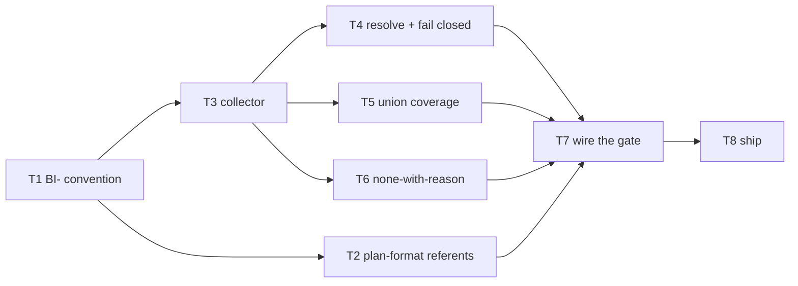

# Plan: brief-item addressability

Source brief: docs/loom/specs/2026-08-13-brief-item-addressability.md
Goal: Give brief items hybrid identity (an immutable `BI-<n>` plus the human-readable text) in every outcome-declaring section, let `Brief item covered` cite that id inside the existing field, extend the coverage checker with a brief mode that treats an item as covered by the union of citing tasks, and make an unresolvable citation an error instead of a silent zero.
Stage: planning
Endpoint named: no — the request named implementation ("開始依照 loom 的標準流程實作吧"), not a publish endpoint; PR and merge stay human-pumped.
Total tasks: 8
Critical-path depth: 5 (≤5)
Execution order: parallel-where-possible
Plan-document-reviewer verdict: PENDING

Steps:
1. 宣告識別碼慣例（brief 格式）
2. 引用端與解析端同時開工
3. 檢查器三項行為
4. 接上閘門
5. 出貨行政

## Task-flow diagram

## Task 1 — declare the `BI-<n>` convention in the brief schema

- Description: Add a `## Brief item identifiers` section to `handoff-brief-format.md` declaring: identifiers take the form `BI-<n>`; they are authored, never derived from headings; they are assigned monotonically and **never renumbered or reused** (an item inserted later takes the next unused number regardless of position); they are declared on outcome-declaring items in **any** section, not only `## Smallest End State`; and each declaration is written as the id followed by the human-readable item text on the same line. State the two-part rationale in one sentence each: monotonic-never-reused is what makes the id immutable under insertion, and authored-not-derived is what stops the id desyncing when the text is reworded.
- Module: loom-code/skills/brainstorming/references/handoff-brief-format.md
- Files touched: loom-code/skills/brainstorming/references/handoff-brief-format.md, loom-code/scripts/test_brief_item_ids.py
- Context paths:
  - loom-code/skills/brainstorming/references/handoff-brief-format.md
  - docs/loom/specs/2026-08-13-brief-item-addressability.md
- Acceptance:
  - RED: `test_brief_item_ids.py::test_schema_declares_the_identifier_convention` fails — no `## Brief item identifiers` section exists in `handoff-brief-format.md`.
  - GREEN: the section exists and the pin resolves all four declared properties (form, authored-not-derived, monotonic-never-reused, any-outcome-section scope) by slicing that section rather than searching the whole file.
- Dependencies: none
- Independent: false
- Review-weight: prose
- Brief item covered: "Brief items carry hybrid identity — an immutable short ID plus the human-readable text"
- Status: pending
- Gloss: brief 格式第一次有了「項目怎麼命名」的規則，而且規定編號只增不改

## Task 2 — teach `plan-format.md` the new referent kind, the none-value, and the tie-break

- Description: Extend `plan-format.md`'s `Brief item covered` definition with referent kind (c) — a `BI-<n>` id declared by the source brief — alongside the existing quote and join-key kinds. Add the legal no-requirement value `none — <reason>` with the reason mandatory, and state why it exists (a task that delivers no brief outcome must not be forced into a false citation). Add the tie-break rule: when a task plausibly delivers two items, the primary referent is **the item the task's RED test asserts**. Do NOT add a second traceability field — `test_traceability_generalization.py:62-70` forbids it by design.
- Module: loom-code/skills/writing-plans/references/plan-format.md
- Files touched: loom-code/skills/writing-plans/references/plan-format.md, loom-code/scripts/test_plan_format_referent_kinds.py
- Context paths:
  - loom-code/skills/writing-plans/references/plan-format.md
  - loom-code/scripts/test_traceability_generalization.py
- Acceptance:
  - RED: `test_plan_format_referent_kinds.py::test_bi_referent_none_value_and_tiebreak_are_declared` fails — `plan-format.md` names no `BI-` referent kind, no `none — <reason>` value, and no tie-break rule.
  - GREEN: all three are declared, and `test_traceability_generalization.py` still passes (no second traceability field name was introduced).
- Dependencies: Task 1 completes first
- Independent: true
- Review-weight: prose
- Brief item covered: "`Brief item covered` accepts the ID as a third referent form"
- Status: pending
- Gloss: 計畫端學會引用新的識別碼，並且有了「這個任務沒有需求對應」的合法寫法

## Task 3 — collect declared `BI-<n>` ids from a brief

- Description: Add a brief-item collector to `check_scenario_coverage.py` that reads a brief file and returns its declared `BI-<n>` ids with their line numbers. A brief declaring zero ids returns an empty set — that is a legal legacy brief, not an error.
- Module: loom-code/scripts/check_scenario_coverage.py
- Files touched: loom-code/scripts/check_scenario_coverage.py, loom-code/scripts/test_check_scenario_coverage.py
- Context paths:
  - loom-code/scripts/check_scenario_coverage.py
  - loom-code/skills/brainstorming/references/handoff-brief-format.md
- Acceptance:
  - RED: `test_check_scenario_coverage.py::test_collects_declared_brief_item_ids` fails — no collector exists.
  - GREEN: given a fixture brief declaring three ids across two different sections, the collector returns exactly those three with correct line numbers; given a brief declaring none, it returns an empty set without raising.
- Dependencies: Task 1 completes first
- Independent: true
- Brief item covered: "The coverage checker gains a brief mode"
- Status: pending
- Gloss: 檢查器學會從 brief 讀出宣告過的識別碼，舊格式 brief 不會因此報錯

## Task 4 — resolve citations and fail closed on an unresolvable one

- Description: Resolve each task's `Brief item covered` value against the collected id set. When the brief declares at least one id, a value that is neither a resolvable `BI-<n>` nor the `none — <reason>` form is an ERROR that names the offending task and quotes the value verbatim. When the brief declares no ids, the legacy quote form stays legal and no resolution is attempted — say so loudly in the output rather than passing silently.
- Module: loom-code/scripts/check_scenario_coverage.py
- Files touched: loom-code/scripts/check_scenario_coverage.py, loom-code/scripts/test_check_scenario_coverage.py
- Context paths:
  - loom-code/scripts/check_scenario_coverage.py
  - loom-code/scripts/test_check_scenario_coverage.py
- Acceptance:
  - RED: `test_check_scenario_coverage.py::test_unresolvable_citation_errors_when_brief_declares_ids` fails — an unknown `BI-99` citation currently contributes zero keys silently and the run exits 0.
  - GREEN: the unknown citation exits non-zero with a message naming the task and quoting `BI-99`; and a legacy brief with zero declared ids still exits 0 while printing an explicit legacy-mode line.
- Dependencies: Task 3 completes first
- Independent: false
- Brief item covered: "The fail-open closes. A `Brief item covered` value matching no known referent grammar is an ERROR"
- Status: pending
- Gloss: 引用寫錯會當場報錯並指名，不再安靜地變成「這條沒人做」

## Task 5 — treat an item as covered by the union of citing tasks

- Description: Compute coverage per declared id as the union of every task citing it, so an item delivered jointly by several tasks counts as covered once all its citing tasks exist, and report any declared id that no task cites. The experiment found one real item (`--lang` on **both** scripts) delivered half by one task and half by another, with neither alone satisfying it.
- Module: loom-code/scripts/check_scenario_coverage.py
- Files touched: loom-code/scripts/check_scenario_coverage.py, loom-code/scripts/test_check_scenario_coverage.py
- Context paths:
  - loom-code/scripts/check_scenario_coverage.py
  - docs/loom/specs/2026-08-13-brief-item-addressability.md
- Acceptance:
  - RED: `test_check_scenario_coverage.py::test_item_cited_by_two_tasks_is_covered_once` fails — no per-id union coverage exists.
  - GREEN: a fixture where two tasks each cite `BI-2` reports `BI-2` covered exactly once (not double-counted), and a declared id cited by no task is reported as uncovered with its line number.
- Dependencies: Task 3 completes first
- Independent: false
- Brief item covered: "Coverage is directional both ways… the checker must therefore treat an item as covered by the UNION of citing tasks"
- Status: pending
- Gloss: 一個項目由兩個任務各做一半也算被覆蓋，沒人做的項目會被指名

## Task 6 — make `none` legal only with a reason

- Description: Accept `none — <reason>` as a valid `Brief item covered` value and reject a bare `none`, an empty reason, or a whitespace-only reason with an error naming the task. The mandatory reason is what stops the value becoming a silent opt-out.
- Module: loom-code/scripts/check_scenario_coverage.py
- Files touched: loom-code/scripts/check_scenario_coverage.py, loom-code/scripts/test_check_scenario_coverage.py
- Context paths:
  - loom-code/scripts/check_scenario_coverage.py
  - loom-code/skills/writing-plans/references/plan-format.md
- Acceptance:
  - RED: `test_check_scenario_coverage.py::test_bare_none_is_rejected_and_none_with_reason_is_accepted` fails — no `none` handling exists.
  - GREEN: `none — release administration only` passes; bare `none` and `none — ` both exit non-zero naming the task.
- Dependencies: Task 3 completes first
- Independent: false
- Brief item covered: "A legal no-requirement value: `none — <reason>`, reason mandatory"
- Status: pending
- Gloss: 「這個任務沒有需求對應」是合法的，但必須寫理由，不能空著混過去

## Task 7 — run the brief-mode check at the same gate the change-folder check already uses

- Description: Add one sentence to `writing-plans/SKILL.md`'s existing coverage-gate paragraph stating that when the source brief declares `BI-` ids, the same `check_scenario_coverage.py` invocation runs in brief mode before the plan-document-reviewer dispatch, with the same block-on-nonzero rule. Pointer, not copy — the mechanics stay in the script and in `plan-format.md`.
- Module: loom-code/skills/writing-plans/SKILL.md
- Files touched: loom-code/skills/writing-plans/SKILL.md, loom-code/scripts/test_wp_extraction_pointers.py
- Context paths:
  - loom-code/skills/writing-plans/SKILL.md
  - loom-code/scripts/test_wp_extraction_pointers.py
- Acceptance:
  - RED: `test_wp_extraction_pointers.py::test_brief_mode_coverage_gate_is_named` fails — the SKILL.md coverage-gate paragraph mentions only the change-folder input.
  - GREEN: the sentence is present inside that paragraph (asserted by slicing the paragraph, not the whole file), and the file's existing word ceiling still passes — if the addition breaches it, raise the ceiling deliberately with the reason recorded inline per house convention rather than trimming the new duty.
- Dependencies: Tasks 2, 4, 5, 6 complete first
- Independent: false
- Review-weight: prose
- Brief item covered: "The coverage checker gains a brief mode… This mirrors what the change-folder path already gets, on the path every arc actually uses"
- Status: pending
- Gloss: 新檢查接上既有的閘門，跟 change-folder 那條走同一個位置與同一條擋人規則

## Task 8 — version bump, CHANGELOG, and Codex mirror sync

- Description: Bump `loom-code/.claude-plugin/plugin.json` to the next minor version, write the CHANGELOG entry for this arc, and re-run the Codex manifest sync so `.codex-plugin/plugin.json` mirrors it. The CHANGELOG entry must state the honest limit: the experiment measured citation determinacy on ONE brief/plan pair, so the scheme ships tested but not field-validated across arcs.
- Module: loom-code/.claude-plugin/plugin.json
- Files touched: loom-code/.claude-plugin/plugin.json, loom-code/.codex-plugin/plugin.json, loom-code/CHANGELOG.md
- Context paths:
  - loom-code/CHANGELOG.md
  - .claude/hooks/check-codex-manifest-drift.sh
- Acceptance:
  - RED: the shipping-version pin test fails against the bumped `plugin.json` until the CHANGELOG and the Codex mirror agree.
  - GREEN: the full suite passes, including the codex-manifest-drift check, with all three files in agreement.
- Dependencies: Task 7 completes first
- Independent: false
- Brief item covered: none — release administration; this task delivers no brief outcome, and it is the plan's own worked instance of the value Task 6 makes legal
- Status: pending
- Gloss: 出貨行政：版本號、變更記錄、Codex 鏡射三者對齊

## Notes

- **Kickoff decision — ID form**: `BI-<n>`, assigned monotonically, never renumbered, never reused. Chosen over ordinal-position numbering because ordinals are not immutable under insertion, which defeats the "immutable ID" half of the hybrid. Rationale is ADR's published convention ("numbered sequentially and monotonically. Numbers will not be reused"); the brief's identifier research records why insertion/renumbering is the documented failure mode of ordinal schemes (ISO requires dated clause references for exactly this reason).
- **Kickoff decision — authored, not derived**: the id is written by the brief author, not slugified from the heading. A derived id desyncs the moment the text is reworded — the documented hole in every hybrid surveyed (Jira keeps stale key aliases resolving after a rename).
- **Kickoff decision — legacy briefs**: a brief declaring zero `BI-` ids puts the checker in legacy mode, where the quote referent stays legal and no resolution is attempted. Task 4's GREEN requires that mode be announced in the output rather than passing silently, so "legacy" can never be mistaken for "checked".
- **Kickoff decision — tie-break**: the primary referent is the item the task's RED test asserts. Chosen because the RED test is this repo's definition of done, so it is the least arbitrary anchor available; the alternative (the item most of `Files touched` serves) tracks effort rather than outcome.
- **Obligation-sweep note for the plan-document-reviewer**: the source brief quotes external sources heavily (ISO, CVE, Anthropic, OpenSpec, EARS studies, spec-kit). Sentences carrying `must` / `should` / `required` inside `## Alternatives Considered`, `## Experiment`, and the Sources lines are **quotations or descriptions of other systems' obligations**, not obligations this arc undertakes. The obligations this arc undertakes are the seven `## Smallest End State` items, each mapped to a task above.
- **Ironic self-reference, recorded deliberately**: this plan cites its own brief by quote (referent kind (a)), because the brief that introduces `BI-` ids does not itself declare any — the convention does not exist until Task 1 lands. The first brief to carry `BI-` ids will be the next arc's.
- No `LOOM-SIMPLIFY:` markers are planned.
