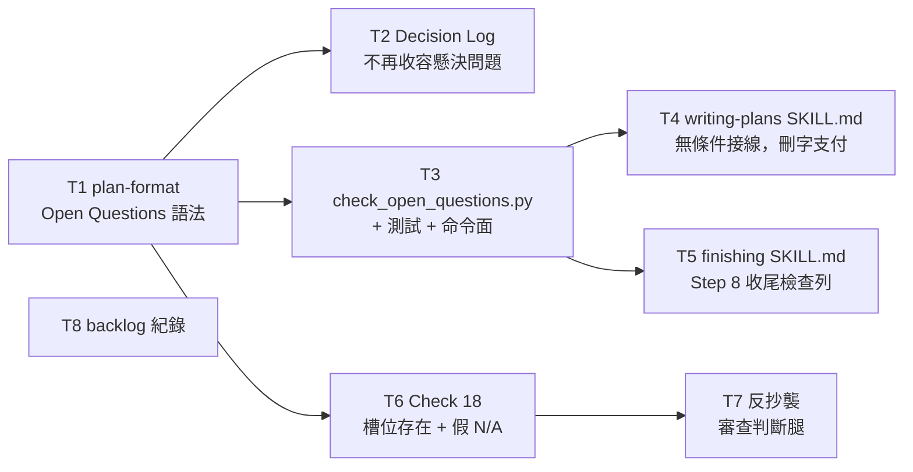

# Plan: open-question dispatch gate

**Source brief**: docs/loom/specs/2026-08-13-open-question-dispatch-gate.md
Goal: A plan document holds unresolved questions in a gated, identifier-bearing section, and an unresolved entry blocks both the plan-write gate and branch close-out.
Stage: finishing
Steps:
    1. 語法與紀錄
    2. 檢查器與審查檢查
    3. 兩道閘門接線
**Total tasks**: 8
**Critical-path depth**: 3 (≤5)
**Execution order**: parallel-where-possible
**Plan-document-reviewer verdict**: PENDING (round-3 gap fixed — Task 7 flipped to `Independent: false`; plus the plan's own `## Open Questions` slot added and Task 6 given its blast-radius repair)

## Task-flow diagram

## Open Questions

- OQ-1 [RESOLVED] — May Task 7 carry `Independent: true` while sharing
  `plan-document-reviewer-prompt.md` with Task 6, on the strength of
  `plan-format.md`'s declared-dependency carve-out? Two per-task reviewers
  excused it citing that carve-out; the plan-document-reviewer rejected it,
  pointing at this plan's own Task 1 / Task 2 pair, which marks the dependent
  task `false` for the identical shape. → resolved: flipped Task 7 to
  `Independent: false`. The carve-out remains valid in general; a single plan
  reading two ways on one question is the defect, not the rule.
- OQ-2 [RESOLVED] — Where does the fix land for
  `loom-code/scripts/test_plan_obligation_sweep.py`'s
  `PRE_EXISTING_MAX_CHECK_NUMBER` pin, which Check 18 breaks and which sits
  outside every task's declared `Files touched`? → resolved: added to Task 6's
  `Files touched` with its own acceptance line — the task that breaks a guard
  owns repairing it, rather than leaving a red suite for a later task or for
  whole-branch review to discover.

- OQ-3 [RESOLVED] — Where does the repair land for the reviewer prompt's Output
  contract, which still states 15 applicable checks and the id range
  `1-4, 6-14, 16-17` after Check 18 shipped, and whose old values are hardcoded
  in two sibling test files? Task 6 declined to cross into those files and
  flagged it. First answered by opening a separate Task 9 to keep tasks atomic.
  → resolved: **that answer was reversed** — Task 6's round-2 spec reviewer
  argued that a check no reviewer can cite is not shipped, so "add Check 18"
  and "make the contract describe the check set" are one deliverable, not two.
  Task 9 was folded back into Task 6, whose `Files touched` now carries the two
  sibling test files. Total tasks returns to 8, critical-path depth to 3. The
  earlier reasoning — that repairing it inside Task 6 would rob Task 9 of a RED
  test — protected a task boundary the orchestrator had invented, not a real
  delivery boundary.

This section is written against the grammar Task 1 shipped
(`d5889550`). The plan predates its own schema requirement, which is why the
section is being added mid-arc rather than at authoring time; the gate that
would have caught the omission is itself still pending in Task 6.

## Task 1 — plan-format gains the Open Questions slot

- Description: Add a `## Open Questions` plan section to the plan schema — fill-or-declare, `OQ-<n>` authored identifiers, a two-valued bracketed status token, a resolution clause required on a resolved entry, and an explicit statement of the fields this section does NOT carry.
- Module: loom-code/skills/writing-plans/references
- Files touched: loom-code/skills/writing-plans/references/plan-format.md, loom-code/scripts/test_plan_open_questions_slot.py
- Context paths:
  - loom-code/skills/writing-plans/references/plan-format.md
  - loom-code/skills/brainstorming/references/handoff-brief-format.md
  - loom-code/scripts/test_plan_diagram_slot.py
  - docs/loom/specs/2026-08-13-open-question-dispatch-gate.md
- Acceptance:
  - RED: `loom-code/scripts/test_plan_open_questions_slot.py::test_plan_format_declares_open_questions_fill_or_declare_slot` — fails today because `plan-format.md` has zero occurrences of "Open Question".
  - GREEN: `plan-format.md` specifies, and the test pins, all six of: (a) the section is fill-or-declare — write entries or write the pinned N/A line with a one-line reason, deleting the heading forbidden; (b) entry form `- OQ-<n> [<TOKEN>] — <question text>` with `OQ-<n>` authored, monotonic, never renumbered, never reused, mirroring the `BI-<n>` rules already in `handoff-brief-format.md`; (c) exactly two status tokens, `[OPEN]` and `[RESOLVED]`; (d) a `[RESOLVED]` entry must carry how it was resolved on the same entry; (e) the section carries no owner field, no deadline field, no routing field, and no per-task linkage field, each named as deliberately absent; (f) the text points at `~/.claude/rules/judgment-rubrics.md` §3 for when an agent must ask the user rather than settle a question itself, rather than restating that rule.
  - Follows the `## Diagrams` fill-or-declare precedent at `handoff-brief-format.md:106-119` — reuse its wording shape so a reader meets one convention, not two.
- External surfaces: none — prose schema file, no runtime surface.
- Dependencies: none
- Independent: true
- Brief item covered: BI-1, BI-2, BI-6
- Status: done(d5889550)
- Gloss: plan 終於有地方寫下「還沒決定的事」，而且不能靜默省略。

## Task 2 — Decision Log stops being the home for unresolved questions

- Description: Narrow the `## Decision Log` section's stated jurisdiction in the plan schema so it records decisions, and point an unresolved question at the new section instead.
- Module: loom-code/skills/writing-plans/references
- Files touched: loom-code/skills/writing-plans/references/plan-format.md, loom-code/scripts/test_plan_open_questions_slot.py
- Context paths:
  - loom-code/skills/writing-plans/references/plan-format.md
  - docs/loom/plans/2026-08-13-brief-item-addressability.md
- Acceptance:
  - RED: `loom-code/scripts/test_plan_open_questions_slot.py::test_decision_log_disclaims_unresolved_questions` — fails today because the Decision Log section text places no limit on what it absorbs.
  - GREEN: the Decision Log section states that an unresolved question belongs in `## Open Questions`, not here, and the test pins that sentence. The worked example at `plan-format.md:303` is checked and, if it demonstrates a Decision Log absorbing an undecided fork, updated.
  - Tripwire (absence claim): the plan asserts the Decision Log text today places no such limit. If the implementer finds an existing limiting sentence, STOP and report rather than adding a second one — the fallback rule is to strengthen the existing sentence in place.
- External surfaces: none — prose schema file.
- Dependencies: Task 1 completes first
- Independent: false
- Brief item covered: BI-7
- Status: done(bca8edee)
- Gloss: 把「懸決問題」從決策紀錄裡趕出去，避免兩個家。

## Task 3 — the checker script

- Description: Add `check_open_questions.py`, which reads a plan document, scopes its scan to the `## Open Questions` section only, and exits non-zero while any entry is unresolved or the slot is absent or malformed.
- Module: loom-code/scripts
- Files touched: loom-code/scripts/check_open_questions.py, loom-code/scripts/test_check_open_questions.py, AGENTS.md
- Context paths:
  - loom-code/scripts/check_scenario_coverage.py
  - loom-code/scripts/test_check_scenario_coverage.py
  - loom-code/skills/writing-plans/references/plan-format.md
  - AGENTS.md
- Acceptance:
  - RED: `loom-code/scripts/test_check_open_questions.py::test_unresolved_question_exit_1` — fails today because the script does not exist.
  - GREEN: exit 1 on any `[OPEN]` entry (naming its `OQ-<n>` on stderr), on an absent `## Open Questions` heading, and on an N/A line missing its reason; exit 0 when every entry is `[RESOLVED]` or the pinned N/A line is well-formed. Script follows the sibling convention — docstring stating the exit-code contract, `main(argv) -> int` + `argparse`, `sys.exit(main())` guard (`check_scenario_coverage.py:544,594-595`); tests exercise it as a CLI subprocess like `test_check_scenario_coverage.py:8-9`.
  - **Section scoping is a required assertion, not an incidental**: a `[OPEN]` token appearing anywhere outside the `## Open Questions` section (a Decision Log sentence, a quoted example, a fenced code block) must NOT trigger a failure. Reuse the `_enclosing_heading` shape at `check_scenario_coverage.py:223`.
  - **Exercised against a real artifact of this system**: the test suite includes one case running the checker against this very plan document (`docs/loom/plans/2026-08-13-open-question-dispatch-gate.md`), not only against hand-authored fixtures. A hit on machine vocabulary is a spec bug in the scanner, to be fixed with a test at that moment.
  - Runnable-capability duty: the new verb is declared in the managed command-surface block of `AGENTS.md` (block begins `AGENTS.md:34`; siblings at `:54,:59`) with its invocation and exit-code contract, and verified to run. Nothing validates that block mechanically, so this is an explicit acceptance line rather than an assumed side effect.
- External surfaces: `[API]` new CLI entry point `python3 loom-code/scripts/check_open_questions.py <plan-path>` — stdlib only, matching the sibling checkers.
- Dependencies: Task 1 completes first
- Independent: true
- Brief item covered: BI-3
- Status: done(84edd790)
- Gloss: 真正會擋人的那支腳本；只看 Open Questions 區段，不會被別處的字誤觸。

## Task 4 — plan-write gate wiring, paid for by deletion

- Description: Wire the checker into `writing-plans` as an unconditional gate run after the plan is produced and before the plan-document-reviewer dispatch, and pay for the added words by deleting prose from the same file — the 4250-word ceiling is not raised.
- Module: loom-code/skills/writing-plans
- Files touched: loom-code/skills/writing-plans/SKILL.md, loom-code/scripts/test_wp_extraction_pointers.py
- Context paths:
  - loom-code/skills/writing-plans/SKILL.md
  - loom-code/scripts/test_wp_extraction_pointers.py
  - loom-code/scripts/check_open_questions.py
- Acceptance:
  - RED: `loom-code/scripts/test_wp_extraction_pointers.py::test_skill_wires_open_questions_gate_unconditionally` — fails today because `SKILL.md` never names the checker.
  - GREEN: `SKILL.md` names `check_open_questions.py`, states the gate runs on **every** plan (not conditional on a change-folder or on the brief declaring `BI-` ids — the two existing invocations at `:253` are both conditional and cannot be ridden), and states that a non-zero exit blocks the plan from PASS. The existing `test_word_count_at_most_4250` (`test_wp_extraction_pointers.py:484-486`) still passes **without its threshold being edited** — a raise of that number fails this task.
  - **The words are paid for by a named duplicate-deletion, decided at kickoff**: replace the body of `### Parallel-dispatch markup (v0.8.0+)` (`SKILL.md:199-203`, 122 words) with the section heading plus one pointer sentence to `references/plan-format.md` §`Files touched` and `Independent`. Net saving ≈ 95 words, well past the ~30 needed.
  - **Duplicate-deletion precondition — verify before deleting, do not assume**: every sentence removed must already exist in `plan-format.md`. Confirmed at plan time: the parallel-dispatch gating rule at `plan-format.md:119`; the two-field semantics at `:114-120`; `opt-in` + `Default false` at `:91`; and the overlapping-`Files touched` plan-error rule, near-verbatim including the refuse-to-dispatch clause, at `:514` (cited as `:493` at plan time; Task 1 inserted the open-questions slot earlier in that file and pushed every later line down — the content is unchanged, only the pointer drifted). Re-verify each of these four before cutting; if any has moved or changed, STOP and report rather than deleting an only copy.
  - **Named deliberate prose loss**: the half-sentence asserting `plan-document-reviewer` should catch an overlapping-`Files touched` claim has no verbatim twin in `plan-format.md`. It is not carried over: the reviewer's Check 14 enforces it mechanically, so the mechanism survives while the prose does not. Recorded here so review sees this was decided, not overlooked.
  - This is a **deletion of a duplicate, not a relocation of unique content** — the SSOT copy in `plan-format.md` is untouched, so no equivalence A/B is owed. That is what distinguishes it from the slimming arc's extract-to-reference work (Task 8b), which moves content that lives in only one place and therefore does need `skill-refactor`'s equivalence gate.
  - The deleted span must be free of test pins: confirm no assertion in any `loom-code/scripts/test_*.py` references text inside `SKILL.md:199-203` before cutting (two independent sweeps found zero hits; verify, do not inherit the claim).
  - Tripwire: if the required words still cannot be freed without losing a load-bearing rule, STOP and report. Pre-recorded fallback: move the *elaboration* — not the rule — to `plan-format.md`, which has no ceiling; a single-sentence behaviour rule must stay inline in `SKILL.md`, because a one-line rule moved into a `references/` file loads with the bulk yet does not reliably fire (measured on `brainstorming`'s Axis-4 rule, PR #352).
- External surfaces: none — prose skill file referencing an internal script.
- Dependencies: Task 3 completes first
- Independent: true
- Brief item covered: BI-4, BI-9
- Status: done(b1726fc4)
- Gloss: 寫完 plan 就擋一次；為了塞進去，同一份檔要先刪字，不抬天花板。

## Task 5 — close-out gate wiring

- Description: Add the checker as a row in `finishing-a-development-branch`'s Step 8 close-out sub-checks table, so a question born during execution is caught before the branch closes.
- Module: loom-code/skills/finishing-a-development-branch
- Files touched: loom-code/skills/finishing-a-development-branch/SKILL.md, loom-code/scripts/test_finishing_open_questions_gate.py
- Context paths:
  - loom-code/skills/finishing-a-development-branch/SKILL.md
  - loom-code/scripts/test_finishing_memory_store_integrity.py
  - loom-code/scripts/test_finishing_backlog_close.py
  - loom-code/scripts/check_open_questions.py
- Acceptance:
  - RED: `loom-code/scripts/test_finishing_open_questions_gate.py::test_step8_table_names_open_questions_check` — fails today because the Step 8 table does not name the checker.
  - GREEN: the Step 8 sub-checks table (`finishing-a-development-branch/SKILL.md:191-203`) carries a row invoking `check_open_questions.py` against the branch's plan, in the same condition / action / on-failure shape as the `check_loom_memory_integrity.py` row at `:200` and the `backlog_index.py --write` row at `:201`, with STOP on non-zero. The test follows the sibling pins in `test_finishing_memory_store_integrity.py` / `test_finishing_backlog_close.py`.
  - No word ceiling applies — that file is pinned by no `test_*.py` and sits at 4492 words; do not introduce one.
- External surfaces: none — prose skill file referencing an internal script.
- Dependencies: Task 3 completes first
- Independent: true
- Brief item covered: BI-4
- Status: done(82d2a831)
- Gloss: 收尾前再擋一次；執行途中才冒出來的問題就是靠這道攔住。

## Task 6 — plan-document-reviewer Check 18

- Description: Add Check 18 to the plan-document-reviewer prompt: the `## Open Questions` slot must be present, and an `N/A — none` declaration contradicted by hedging language elsewhere in the plan is a gap.
- Module: loom-code/skills/writing-plans/references
- Files touched: loom-code/skills/writing-plans/references/plan-document-reviewer-prompt.md, loom-code/scripts/test_plan_document_reviewer_check18.py, loom-code/scripts/test_plan_obligation_sweep.py, loom-code/scripts/test_sdd_review_weight_marker.py, loom-code/scripts/test_plan_reviewer_output_contract_count.py, loom-code/scripts/test_plan_document_reviewer_check17.py
- Context paths:
  - loom-code/skills/writing-plans/references/plan-document-reviewer-prompt.md
  - loom-code/scripts/test_plan_document_reviewer_check17.py
  - loom-code/scripts/test_plan_obligation_sweep.py
  - docs/loom/plans/2026-08-13-brief-item-addressability.md
- Acceptance:
  - RED: `loom-code/scripts/test_plan_document_reviewer_check18.py::test_check18_gates_absent_slot_and_false_na` — fails today because the prompt holds 17 checks.
  - GREEN: the prompt carries a Check **18** (never 5 — that slot is permanently retired at `:37` and must stay unreassigned), gating on two conditions: the slot is absent, or the plan declares `N/A — none` while its own prose elsewhere hedges an undecided fork. The false-N/A half is written as a **verifiable action**, not a judgment call — the reviewer greps the plan for hedging vocabulary (for example "deliberately not resolved", "two reviewers disagree", "left open", "TBD", "routed to whole-branch review") and reports a hit against an N/A declaration as a gap. The failing verdict uses the file's existing vocabulary (`NEEDS_REVISION` with a `gaps:` entry, `:54,:56`), not a new severity label.
  - The 2026-08-13 brief-item-addressability plan is used as the worked negative case: its `## Decision Log` at `:354-373` contains the exact hedging sentence this check must catch.
  - **The Output contract must learn Check 18 exists — in this task, not a later one.** A check no reviewer can cite is not shipped. The prompt's `checks_passed: <N>/<15>` line, its `check_id: <1-4, 6-14, 16-17>` range, and its `NEEDS_REVISION: … 1–4, 6–14, 16–17` verdict-mapping line all still describe the 17-check era: a reviewer following this file literally has no valid `check_id` to cite when Check 18 fails, and undercounts `checks_passed` by one on every PASS. Update all three to include Check 18 and state the correct total (16 applicable = 18 minus retired 5 minus advisory 15), and update the two sibling tests that hardcode the old values — `test_sdd_review_weight_marker.py` (asserts the literal `"<15>"`) and `test_plan_document_reviewer_check17.py` (asserts the literal `"16-17"` twice) — in the same change so the suite stays green.
  - The new `test_plan_reviewer_output_contract_count.py` must fail if a future check is appended without updating the contract: derive the expected total from the checks table's own rows, read from the file, rather than hardcoding the number in a second place. A test that merely swaps 15 for 16 recreates this defect one check later.
  - **Blast-radius repair, in this task**: adding Check 18 breaks `loom-code/scripts/test_plan_obligation_sweep.py`, which pins the prompt's highest check number at `PRE_EXISTING_MAX_CHECK_NUMBER = 17` (`:42`) and asserts equality at `:78`. That pin is designed to be updated — its own docstring at `:19` says so — so update it to 18 and confirm the whole resolved test command goes green. The task that breaks a guard repairs it; leaving a red suite for a later task or for whole-branch review to discover is not an option. Do **not** weaken the assertion to `>=` — the pin's value is that it forces this exact conversation on every new check.
- External surfaces: none — evaluator prompt file.
- Dependencies: Task 1 completes first
- Independent: true
- Brief item covered: BI-5, BI-8
- Status: done(7650ee82)
- Gloss: 腳本看不到的那一件事：宣稱「沒有懸決問題」卻被 plan 自己的內文打臉。

## Task 7 — anti-copy criteria need a reviewer-judgment leg

- Description: Add the anti-copy rider's reviewer-prompt leg — a check hint that an anti-copy / SSOT-protection acceptance criterion needs a reviewer-judgment leg alongside its mechanical grep.
- Module: loom-code/skills/writing-plans/references
- Files touched: loom-code/skills/writing-plans/references/plan-document-reviewer-prompt.md, loom-code/scripts/test_plan_reviewer_anticopy_judgment_leg.py
- Context paths:
  - loom-code/skills/writing-plans/references/plan-document-reviewer-prompt.md
  - docs/loom/backlog/2026-07-06-anti-copy-acceptance-greps-pass-paraphrase-copies.md
- Acceptance:
  - RED: `loom-code/scripts/test_plan_reviewer_anticopy_judgment_leg.py::test_anticopy_criterion_requires_reviewer_judgment_leg` — fails today because the prompt says nothing about anti-copy criteria.
  - GREEN: the prompt states that a plan whose acceptance criterion protects content from copying must carry BOTH a mechanical verbatim grep AND an explicit reviewer-judgment check ("no paraphrase reproduction of the protected content"), and that a mechanical-only criterion is a gap. Grounding: a five-row paraphrase of a protected charter table once passed the verbatim grep and was caught only by the judgment leg.
  - The rider's `writing-plans/SKILL.md` leg is explicitly NOT in this task — it goes to the slimming arc (Task 8 records that).
- External surfaces: none — evaluator prompt file.
- Dependencies: Task 6 completes first
- Independent: false
- Brief item covered: BI-10
- Status: done(7650ee82)
- Gloss: 搭車案的一半：機械 grep 擋不住「改寫版抄襲」，得再加一條人為判斷腿。

## Task 8 — backlog records

- Description: Record this arc's three queue decisions in the backlog store and regenerate the index.
- Module: docs/loom/backlog
- Files touched: docs/loom/backlog/2026-07-06-anti-copy-acceptance-greps-pass-paraphrase-copies.md, docs/loom/backlog/2026-07-14-pocock-loom-roadmap-arcs-c-d-e-remainder.md, docs/loom/backlog/2026-08-13-close-out-open-question-gate-is-prose-orchestrated-not-hook-enforced.md, docs/loom/BACKLOG.md, docs/loom/DIRECTION.md
- Context paths:
  - docs/loom/backlog/README.md
  - docs/loom/backlog/2026-07-06-anti-copy-acceptance-greps-pass-paraphrase-copies.md
  - docs/loom/backlog/2026-07-14-pocock-loom-roadmap-arcs-c-d-e-remainder.md
  - scripts/backlog_index.py
- Acceptance:
  - RED: `grep -q "Split decided 2026-08-13" docs/loom/backlog/2026-07-06-anti-copy-acceptance-greps-pass-paraphrase-copies.md` exits non-zero today.
  - **Tense discipline — this task runs in wave 1, before the legs it records land.** Every record must state what was DECIDED, never what has shipped: Task 4's `SKILL.md` deletion and Task 7's reviewer-prompt leg are both still pending when this task executes. A record asserting either as complete is a false claim about the repo, and backlog entries are read months later as ground truth. The RED phrase above is decision-tense for exactly this reason — a completion-tense grep target would let unsubstantiated prose satisfy a mechanical criterion, which is the failure mode Task 7 itself exists to catch.
  - GREEN: three records exist and `python3 scripts/backlog_index.py --write` regenerates `BACKLOG.md` / `DIRECTION.md` cleanly — (a) the anti-copy entry records the **split as decided**: the reviewer-prompt leg is committed to this arc as Task 7, the `SKILL.md` leg is deferred to the slimming arc with the 4250-word ceiling as the recorded reason, and this supersedes the flat 2026-08-13 decline note. The entry stays `OPEN` until the committed leg actually lands; (b) the Pocock roadmap entry's slim-round-2 leg adds `writing-plans` (4,249 w) to its target set alongside `requesting-code-review` / `spec-expansion` / `skill-judge`; (c) a new entry records that the close-out gate is prose-orchestrated (a Step 8 table row), not hook-enforced, with the tripwire `start:` — first branch that closes with an unresolved `OQ-<n>` despite the table row, or the next `loom_gate_markers.py` touch — and names the mechanized alternative (fold the checker into the `review-pass` / `verified --run` mint path).
  - `docs/loom/DIRECTION.md`'s `## Now` is GENERATED — regenerate via the script, never hand-edit.
- External surfaces: none — record files plus a repo script already in the command surface.
- Dependencies: none
- Independent: true
- Brief item covered: none — backlog hygiene, and the three records differ in provenance: (a) the anti-copy split and (b) the Pocock roadmap addition are both named in the brief's §Out of Scope, while (c) the close-out-gate prose-vs-hook tripwire is a new operational decision made during this plan's own authoring and recorded in this plan's §Notes, not in the brief. None of the three ships a Smallest End State outcome, so no `BI-<n>` citation exists to make.
- Status: done(7f2710d0)
- Gloss: 把這一弧做過的三個隊列決定寫回 backlog，別讓它們只活在對話裡。

## Decision Log

- **Banked as debt: Task 7's guard pins descriptive wording, and that is
  acceptable here because the risk runs the safe direction.** The anti-copy
  rider tells plan authors a mechanical grep cannot catch a paraphrase — and its
  own guard is a mechanical grep over prose. A reviewer reworded the rider twice
  while preserving its full meaning and the test reddened both times. The split
  matters: the *quoted template sentence* ("no paraphrase reproduction of the
  protected content") is legitimately pinned verbatim, since its purpose is to
  become boilerplate an author copies — the same reason `plan-format.md` pins
  its `N/A — no unresolved question:` grammar. Only the two leg-name descriptors
  and the gap-framing sentence are descriptive prose pinned by wording. Left
  as-is because the failure direction is inverted from the incident that
  motivated the rider: that incident's danger was a false PASS (bad content
  slipping past a grep); this brittleness produces a false RED on a harmless
  copy-edit. Same mechanism, opposite risk — an annoyance, never a silent
  acceptance of a defect. Loosening the descriptor assertions would trade a real
  guard for convenience. The repo already holds this position explicitly:
  `test_plan_document_reviewer_check18.py`'s own docstring states that phrase
  pinning is leg one and human/LLM reading for meaning is the deliberate leg two.
- **Banked as debt: the `KNOWN LIMIT` docstring's imperative is broader than its
  reasoning.** `test_plan_document_reviewer_check18.py`'s neutering guard
  documents that no blacklist length closes a semantic-rewording gap — verified
  true by mutation — then says "do not widen the blacklist in response". The
  factual claim is sound; the imperative overshoots, since it could be read as
  discouraging even the cheap, now-*observed* hardening of adding the F′
  phrasing, which this repo's own rule says should just be done. Left as-is:
  both reviewers returned PASS and this is a 🟢 on wording, not behaviour. The
  orchestrator's dispatch wording is what over-scoped it.
- **Banked as debt: the Step-8 grep-test family cannot see a relocated or
  duplicated row.** Task 5's tests miss two mutations — moving the row out of
  the Close-out table, and duplicating it verbatim. Verified inherited, not a
  regression: the same mutations run against the cited sibling
  (`test_finishing_memory_store_integrity.py`, whose helper *looks* stronger)
  also stay green, and neither sibling carries a `count()` uniqueness check.
  A shared positional+uniqueness helper across the three files would close it
  family-wide; that is its own change, not this arc's.
- **Recorded, dormant: old-format plans have no escape hatch from the new
  gate.** `check_open_questions.py` exits 1 on an absent `## Open Questions`
  heading with no predates-the-schema carve-out, unlike the sibling Stage-flip
  row which explicitly exempts a plan whose ledger predates the `Stage:` header.
  About 24 plans under `docs/loom/plans/` predate the slot; every one sampled is
  already `Stage: finishing`, so none will re-run this gate — dormant, not live.
  It belongs to Tasks 1/3's shipped scope, and would bite only if an old plan
  were reopened for close-out.
- **Blast radius of Task 1, not yet closed — `test_plan_diagram_slot.py`'s
  PIN_B assertion is now ambiguous.** Task 1 added a second byte-identical copy
  of the fill-or-declare anchor sentence to `plan-format.md` (the Diagrams slot
  at `:64-66` already carried it; the Open Questions slot at `:80-82` now does
  too). `test_plan_diagram_slot.py:43-47` pins that sentence with an **unscoped**
  whole-file `in` check, so it can now be satisfied by the Open-Questions copy
  and would stay green if the Diagrams copy were deleted. Found by Task 1's
  round-2 code-quality reviewer, proven on a scratch copy. The file is outside
  every current task's `Files touched`, so it is **not** silently folded into
  one: recorded here, to be closed before the branch closes — the whole-branch
  reviewer owns it. Classified below the one-way-door bar (a test-scoping fix,
  fully reversible), so it was logged rather than briefed.

## Notes

- Verdict stamped `PASS (2026-08-13, round 2)` — **stamping the verdict**, no
  re-review (amendment kind 1). The `Kickoff decision:` lines below were added
  in the same post-PASS pass, which `references/kickoff-briefing.md` §b
  prescribes as a post-PASS step into this section.
- **Kickoff appetite read**: this repo has no `docs/loom/PRINCIPLES.md`, so
  `kickoff-briefing.md` §d's default applies — every one-way-door hit is
  briefed, none suppressed. Sweep found exactly one (Task 4's deletion choice);
  the forks below are triage arm-1 look-ups, recorded unbriefed.
- Kickoff decision: Check 18's hedging-vocabulary list → derived from the
  2026-08-13 incident's own wording plus a sweep of existing `## Decision Log`
  sections under `docs/loom/plans/`, never invented; the list is additive and
  two-way, so it is not a briefing item.
- Kickoff decision: the Open Questions pinned N/A line's wording → mirror the
  `## Diagrams` fill-or-declare form at `handoff-brief-format.md:110-116`
  rather than inventing a second shape, so a reader meets one convention.
- Kickoff decision: `OQ-<n>` uniqueness and monotonicity → the checker warns on
  a reused identifier on stderr, mirroring `collect_brief_item_ids`' first-wins
  plus warn behaviour at `check_scenario_coverage.py:270`; Check 18 does not
  duplicate the mechanical half.
- Kickoff decision: which prose pays for Task 4's gate wiring → delete the
  duplicated body of `### Parallel-dispatch markup` (`SKILL.md:199-203`, 122
  words), keeping the heading plus one pointer; net ≈95 words. **Briefed as the
  round's only one-way-door decision; user chose it over the three narrower
  cuts on 2026-08-13.** Two subagent sweeps disagreed on this span's risk and
  both were partly wrong — the extraction sweep claimed two facts were missing
  from `plan-format.md` (they are present at `:91` and `:493`; it had only read
  `:114-120`), and the deletion sweep rated it MEDIUM risk on the belief that
  the parallel-gating rule is one writing-plans executes (it is executed by
  `dispatching-parallel-agents`; writing-plans' own duties at `SKILL.md:62,:64`
  stay inline). Verified directly before deciding. This amendment changed a
  task's Acceptance, so it re-reviews — it is outside the three-kind closed list.
- Kickoff decision: close-out enforcement strength → prose-orchestrated Step 8
  row, decided 2026-08-13 with the hook-mechanized alternative recorded as a
  tripwire-backed backlog entry (Task 8c). Recorded, not re-opened.
- **Change-folder binding**: this plan is bound to the brainstorming brief, NOT
  to a change-folder. Two non-archived change-folders exist
  (`docs/loom/2026-07-12-us-sec-primary-source-layer`,
  `docs/loom/2026-07-19-8k-prose-kpi-intake`); both belong to arcs that shipped
  weeks ago, are unrelated to this arc's subject, and carry their own backlog
  entry asking to be archived. Recorded rather than silently skipped.
- **Status token spelling** (`[OPEN]` / `[RESOLVED]`) was chosen against the
  reviewer's existing vocabulary — `verdict:`, `PASS`, `NEEDS_REVISION`,
  `gaps:`, `notes:` — and against the per-task `Status:` field, to avoid a
  scanner meeting the toolchain's own words. Task 3's section-scoping assertion
  is the mechanical guard behind that choice.
- **Close-out enforcement strength**: Task 5 ships the prose-orchestrated form
  (a Step 8 table row), matching the three checkers already in that table. The
  hook-level alternative — folding the checker into `loom_gate_markers.py`'s
  mint path — was not taken because it edits a contract whose docstring
  declares it frozen and whose every field is asserted by
  `test_loom_gate_markers.py`. Task 8(c) records this with a tripwire.
