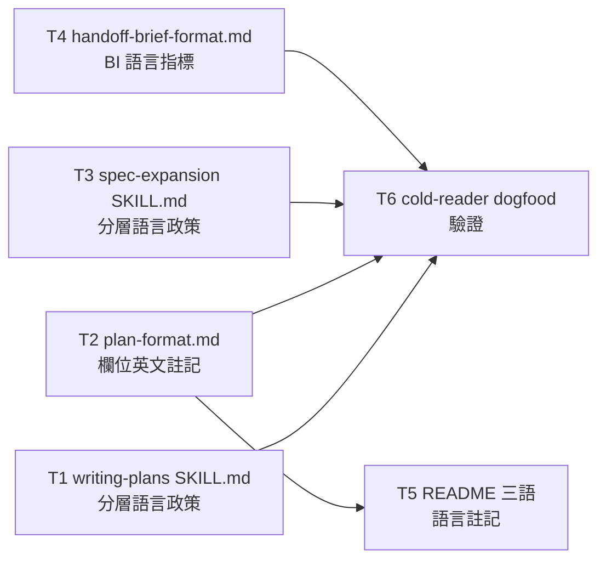

# Plan: Loom doc language layering

**Source brief**: docs/loom/specs/2026-08-14-loom-doc-language-layering.md
Goal: A layered language policy is stated in the two artifact-producing skills (writing-plans, loom-spec) plus a pointer in brainstorming's brief-format, so plan/spec content is deliberately split: machine-executed precision content in English, human sense-making content in the session's conversation language, and the existing adjudication-view named as the display layer for reading the English precision content in zh-Hant/ja.
Stage: finishing
Steps:
  1. 政策落地（T1／T2／T3／T4 平行）
  2. 鏡像與驗證（T5／T6）
**Total tasks**: 6
**Critical-path depth**: 2
**Execution order**: parallel-where-possible
**Plan-document-reviewer verdict**: PASS (2026-08-14, round 2)
**Continuous mode**: endpoint named: yes → continuous (2026-08-14)

## Task-flow diagram

## Open Questions

N/A — no unresolved question: the brief's Decision settled the layered policy, the landing spots (writing-plans SKILL.md, spec-expansion SKILL.md, handoff-brief-format.md), and the verification method (cold-reader dogfood); writing-plans left no open questions.

## Task 1 — writing-plans SKILL.md 加分層語言政策

- **Description**: Add a §Language policy section to `loom-code/skills/writing-plans/SKILL.md` stating the layered policy inline: task **Description** bodies and **Acceptance** (RED/GREEN) are written in English; **Steps** titles, **Gloss**, **Goal**, task titles, and **Notes** stay in the session's conversation language; `adjudication-view` is cited as the display layer for careful reading of the English precision content in zh-Hant/ja (BI-4). Reword the §Progress surface's per-field statement (`SKILL.md:131-137` — "Steps titles and Gloss lines are written at plan time in the user's conversation language") to reference the umbrella policy — the consolidation is reworded, not deleted (BI-7). Update `test_wp_extraction_pointers.py`'s `test_progress_surface_steps_and_gloss_emit_duty_present` (`:194-205`) in the same change — it pins the current Steps/Gloss wording verbatim (whitespace-normalized), so the SKILL.md reword and the test update land together (doc-mirrors-code).
- **Module**: `loom-code/skills/writing-plans/SKILL.md`
- **Files touched**: `loom-code/skills/writing-plans/SKILL.md`, `loom-code/scripts/test_wp_extraction_pointers.py`
- **Context paths**:
  - `/Users/kouko/GitHub/monkey-skills/loom-code/skills/writing-plans/SKILL.md:131-137`（§Progress surface — BI-7 合併目標）
  - `/Users/kouko/GitHub/monkey-skills/loom-code/scripts/test_wp_extraction_pointers.py:194-205`（逐字釘住現行 Steps/Gloss 措辭）
  - `/Users/kouko/GitHub/monkey-skills/loom-code/skills/using-loom-code/protocols/adjudication-view.md:13-21,178-184`（政策引用的顯示層）
- **Acceptance**:
  - **RED**: `test_layered_language_policy_declared`（new test in `test_wp_extraction_pointers.py`）fails — asserts the layered policy statement (Description/Acceptance English; Steps/Gloss/Goal/titles/Notes conversation language) and the adjudication-view citation appear in writing-plans SKILL.md
  - **GREEN**: the new pin passes; `test_progress_surface_steps_and_gloss_emit_duty_present` updated to pin the reworded phrase and passes; `python3 -m pytest loom-code/scripts/test_wp_extraction_pointers.py` green
- **Dependencies**: none
- **Independent**: true
- **Brief item covered**: BI-1 — writing-plans declares the layered policy（主，RED 斷言政策陳述落地）＋ BI-4 — the policy cites adjudication-view as the display layer＋ BI-6 — The umbrella outcome: both skills (plus the brief pointer) carry a consistent, inline layered language policy＋ BI-7 — §Progress surface statements consolidated into the umbrella policy
- **Status**: done(f2f78791)
- **Gloss**: 讓 writing-plans 的 SKILL.md 明載分層語言政策——機器執行的欄位（Description／Acceptance）用英文，人讀的欄位（Steps／Gloss／Goal／Notes）用會話語言，adjudication-view 當顯示層。

## Task 2 — plan-format.md 的 Description／Acceptance 欄位加英文規則

- **Description**: Annotate the **Description** and **Acceptance** schema lines in `loom-code/skills/writing-plans/references/plan-format.md` with the English rule — the schema SSOT carries the language annotation the policy declares (the brief's Current State Evidence notes these fields "carry no language annotation — the English layer is entirely unstated"). The existing Steps/Gloss conversation-language annotations (`plan-format.md:40,126`) stay unchanged — they remain true under the layered policy. `test_plan_format_progress_fields.py` pins only the Steps/Gloss wording (`:82,88,100,188`), so it stays green without modification.
- **Module**: `loom-code/skills/writing-plans/references/plan-format.md`
- **Files touched**: `loom-code/skills/writing-plans/references/plan-format.md`
- **Context paths**:
  - `/Users/kouko/GitHub/monkey-skills/loom-code/skills/writing-plans/references/plan-format.md:98,104-106`（Description／Acceptance schema 行）
  - `/Users/kouko/GitHub/monkey-skills/loom-code/skills/writing-plans/references/plan-format.md:40,126`（Steps／Gloss 既有 conversation-language 註記，不動）
  - `/Users/kouko/GitHub/monkey-skills/loom-code/scripts/test_plan_format_progress_fields.py:82,88,100,188`（只釘 Steps/Gloss，不受影響）
- **Acceptance**:
  - **RED**: Diagnostic — `grep -n "imperative voice>" loom-code/skills/writing-plans/references/plan-format.md` hits a Description schema line carrying no English-rule annotation
  - **GREEN**: The Description/Acceptance schema lines carry a "written in English" annotation; `python3 -m pytest loom-code/scripts/test_plan_format_progress_fields.py` stays green
- **Dependencies**: none
- **Independent**: true
- **Brief item covered**: BI-1 — writing-plans declares the layered policy（欄位層落地；brief 的 Current State Evidence 明載 plan-format.md 的 Description/Acceptance「carry no language annotation」）
- **Status**: done(5d46b74a)
- **Gloss**: 讓 plan-format.md（schema 的 SSOT）的 Description／Acceptance 欄位明載「用英文寫」——政策在欄位定義層落地，Steps／Gloss 的會話語言註記不變。

## Task 3 — spec-expansion SKILL.md 加分層語言政策

- **Description**: Add the layered language policy to `loom-spec/skills/spec-expansion/SKILL.md`'s §The hybrid output format (`:362-442`) — or a new §Language policy section beside it — stating: spec-delta **requirement lines** (RFC-2119) and **Scenario** GIVEN/WHEN/THEN criteria are written in English; proposal.md narrative (Problem/Users/Smallest End State/Decision reasoning) stays in the session's conversation language; `adjudication-view` is cited as the display layer for careful reading of the English precision content in zh-Hant/ja (BI-4). The policy is stated inline — no new shared reference file (cross-plugin convention: loom-code/loom-spec reference each other's SKILLs/scripts, never each other's `references/*.md`).
- **Module**: `loom-spec/skills/spec-expansion/SKILL.md`
- **Files touched**: `loom-spec/skills/spec-expansion/SKILL.md`
- **Context paths**:
  - `/Users/kouko/GitHub/monkey-skills/loom-spec/skills/spec-expansion/SKILL.md:362-442`（§The hybrid output format — 政策落地點）
  - `/Users/kouko/GitHub/monkey-skills/loom-spec/skills/spec-expansion/SKILL.md:389-394`（RFC-2119 keyword 與 GIVEN/WHEN/THEN skeleton）
  - `/Users/kouko/GitHub/monkey-skills/loom-code/skills/using-loom-code/protocols/adjudication-view.md:13-21,178-184`（政策引用的顯示層）
- **Acceptance**:
  - **RED**: Diagnostic — `grep -n "conversation language\|written in English" loom-spec/skills/spec-expansion/SKILL.md` returns no hits (policy not landed)
  - **GREEN**: The policy statement exists (requirement lines/Scenario in English, proposal.md narrative in conversation language, adjudication-view cited); `python3 -m pytest loom-spec/scripts/` stays green
- **Dependencies**: none
- **Independent**: true
- **Brief item covered**: BI-2 — loom-spec declares the layered policy（主，RED 斷言政策陳述落地）＋ BI-4 — the policy cites adjudication-view as the display layer
- **Status**: done(28d048ff)
- **Gloss**: 讓 spec-expansion 的 SKILL.md 明載分層語言政策——spec 的 requirement 行與 Scenario 判準用英文，proposal.md 的敘事用會話語言，adjudication-view 當顯示層。

## Task 4 — handoff-brief-format.md 加 BI 語言指標

- **Description**: Add a pointer to `loom-code/skills/brainstorming/references/handoff-brief-format.md`'s §Brief item identifiers (`:121-138`) stating that **BI statements** are machine-executed precision content → written in English (they seed the spec's requirement lines). The pointer is one line in the BI-identifier section — the brief-format carries the pointer, not a full policy (the full policy lives in writing-plans and loom-spec).
- **Module**: `loom-code/skills/brainstorming/references/handoff-brief-format.md`
- **Files touched**: `loom-code/skills/brainstorming/references/handoff-brief-format.md`
- **Context paths**:
  - `/Users/kouko/GitHub/monkey-skills/loom-code/skills/brainstorming/references/handoff-brief-format.md:121-138`（§Brief item identifiers）
- **Acceptance**:
  - **RED**: Diagnostic — `grep -n "BI statements" loom-code/skills/brainstorming/references/handoff-brief-format.md` returns no hits (pointer not landed)
  - **GREEN**: §Brief item identifiers carries the BI language pointer (BI statements → English)
- **Dependencies**: none
- **Independent**: true
- **Brief item covered**: BI-3 — brainstorming's brief-format carries a pointer: BI statements are machine-executed precision content → English
- **Status**: done(d72d71ac)
- **Gloss**: 讓 brainstorming 的 brief-format 明載「BI 陳述用英文寫」——BI 是機器執行的精確內容，種子進 spec 的 requirement 行。

## Task 5 — writing-plans README 三語加語言註記

- **Description**: Add a one-line language note to the field-list sections of the three writing-plans READMEs (`README.md`, `README.ja.md`, `README.zh-TW.md`) — Description/Acceptance are written in English; Steps/Gloss in the session's conversation language — mirroring the plan-format.md annotation (Task 2). The READMEs are orientation mirrors pinned by `test_writing_plans_readme_sync.py` (field NAMES present, never full grammar), so the note addition doesn't break the sync test.
- **Module**: `loom-code/skills/writing-plans/README.md`
- **Files touched**: `loom-code/skills/writing-plans/README.md`, `loom-code/skills/writing-plans/README.ja.md`, `loom-code/skills/writing-plans/README.zh-TW.md`
- **Context paths**:
  - `/Users/kouko/GitHub/monkey-skills/loom-code/skills/writing-plans/README.md:30-42`（§What each task carries 欄位清單）
  - `/Users/kouko/GitHub/monkey-skills/loom-code/scripts/test_writing_plans_readme_sync.py`（三語 mirror 同步測試）
- **Acceptance**:
  - **RED**: Diagnostic — `grep -n "written in English" loom-code/skills/writing-plans/README.md` returns no hits (note not landed)
  - **GREEN**: All three READMEs' field lists carry the language note; `python3 -m pytest loom-code/scripts/test_writing_plans_readme_sync.py` stays green
- **Dependencies**: Task 2 completes first
- **Independent**: false
- **Brief item covered**: BI-1 — writing-plans declares the layered policy（README 是 writing-plans 的人讀 orientation mirror）
- **Status**: done(a85ba721)
- **Gloss**: 讓三語 README 的欄位清單也帶語言註記——人讀 orientation 不漂移，與 plan-format.md 的 schema 註記一致。

## Task 6 — cold-reader dogfood 驗證

- **Description**: Dispatch a fresh-context cold-reader agent to write a sample plan following the layered policy — the agent reads writing-plans SKILL.md + plan-format.md blind (no prior context from this session), seeded with a minimal synthetic brief — then verify the language layering lands correctly: task Description bodies and Acceptance (RED/GREEN) in English; Steps titles, Gloss, Goal, task titles, and Notes in the session's conversation language. Commit the sample plan as the verification artifact.
- **Module**: `docs/skill-dogfood/2026-08-14-language-layering/`
- **Files touched**: `docs/skill-dogfood/2026-08-14-language-layering/sample-plan.md` (NEW)
- **Context paths**:
  - `/Users/kouko/GitHub/monkey-skills/loom-code/skills/writing-plans/SKILL.md`（Task 1 產出）
  - `/Users/kouko/GitHub/monkey-skills/loom-code/skills/writing-plans/references/plan-format.md`（Task 2 產出）
- **Acceptance**:
  - **RED**: Diagnostic — `docs/skill-dogfood/2026-08-14-language-layering/sample-plan.md` does not exist
  - **GREEN**: File exists and is committed; language layering is correct (Description/Acceptance in English, Gloss in conversation language — verified by grep); the cold-reader is a fresh-context agent (no context from this session)
- **Dependencies**: Tasks 1, 2, 3, 4 complete first
- **Independent**: false
- **Brief item covered**: BI-5 — verification: a fresh-context cold-reader dogfood writes a sample plan following the policy and the language layering lands correctly
- **Status**: done(d364acf9)
- **Gloss**: 用一個沒有本會話上下文的冷讀 agent 照政策寫一份樣本 plan，驗證語言分層真的落地——這是政策的品質地板。

## Notes

- **Escalation appetite**：`docs/loom/PRINCIPLES.md:39` 的 escalation appetite 逐字是「每個里程碑開頭簡報一次架構選擇，之後除非撞牆不打斷」。本計畫的 brief 即開工簡報記錄，所有計畫決策都是 two-way door，無需 kickoff briefing。
- **平行派發**：T1／T2／T3／T4 同層（L1）且 `Independent: true`、`Files touched` 互斥，可平行；T5 因 doc-mirrors-code（README 欄位清單 mirror plan-format.md 的 schema 註記）依賴 T2；T6 依賴 T1-T4。
- **Plugin-wide contradiction-sweep review arm（memory 約束）**：本變更新增語言規則（非翻轉既有規則語意），但 memory `a-semantics-change-needs-a-plugin-wide-contradiction-sweep-arm` 要求 whole-branch review 加一支掃全 plugin 的 contradiction-sweep arm。種子詞彙：`conversation language`／`會話語言`／`会話言語`。已預掃：除 writing-plans SKILL.md:134 的 §Progress surface（T1 改寫）外，其餘命中全是 conversation narration（progress card／relay／memory surfacing）或 Steps/Gloss 欄位——新政策下仍成立；sweep arm 在 review 時重掃確認，並判 loom-spec 頂層 README（只描述輸出格式、無語言規則）為 still-true。
- **Cross-plugin 政策措辭**：政策 inline 寫在三個 skill（writing-plans、spec-expansion、handoff-brief-format），逐字轉錄（`pin-shared-wording` practice），不開共享 reference 檔（cross-plugin 慣例：loom-code/loom-spec 只互相引用 SKILLs/scripts，references/*.md 各自自足）。
- **本計畫即政策的第一個 dogfood**：本 plan 的 Description／Acceptance 用英文、Gloss／Notes／Steps 用會話語言（繁體中文）——正是政策要的分層。
- **Amendment skip note（2026-08-14, round 2 後）**：T5/T6 的 `Dependencies` 欄位移除括號中文註記——schema 格式修正（plan_card 拒收），dependency edge 不變，屬 formatting fix，no re-review。
- **Amendment skip note（2026-08-14, continuous-mode 記錄）**：header 加 `**Continuous mode**: endpoint named: yes → continuous` 一行——stamping 類（記錄流程狀態，無技術內容變更），no re-review。
- **Kickoff decision**: 政策落地點 → writing-plans SKILL.md（§Language policy section）＋ plan-format.md（欄位註記）＋ spec-expansion SKILL.md（§The hybrid output format 旁）＋ handoff-brief-format.md（§Brief item identifiers 指標）；adjudication-view 只被引用、不改。
- **Kickoff decision**: 驗證方式 → 新 pin test（`test_layered_language_policy_declared`）＋ cold-reader dogfood（BI-5）；不寫「斷言產出內容語言」的測試（brief Out of Scope：結構上不可能，enforcement 是 rule-text cold-reader gate）。
