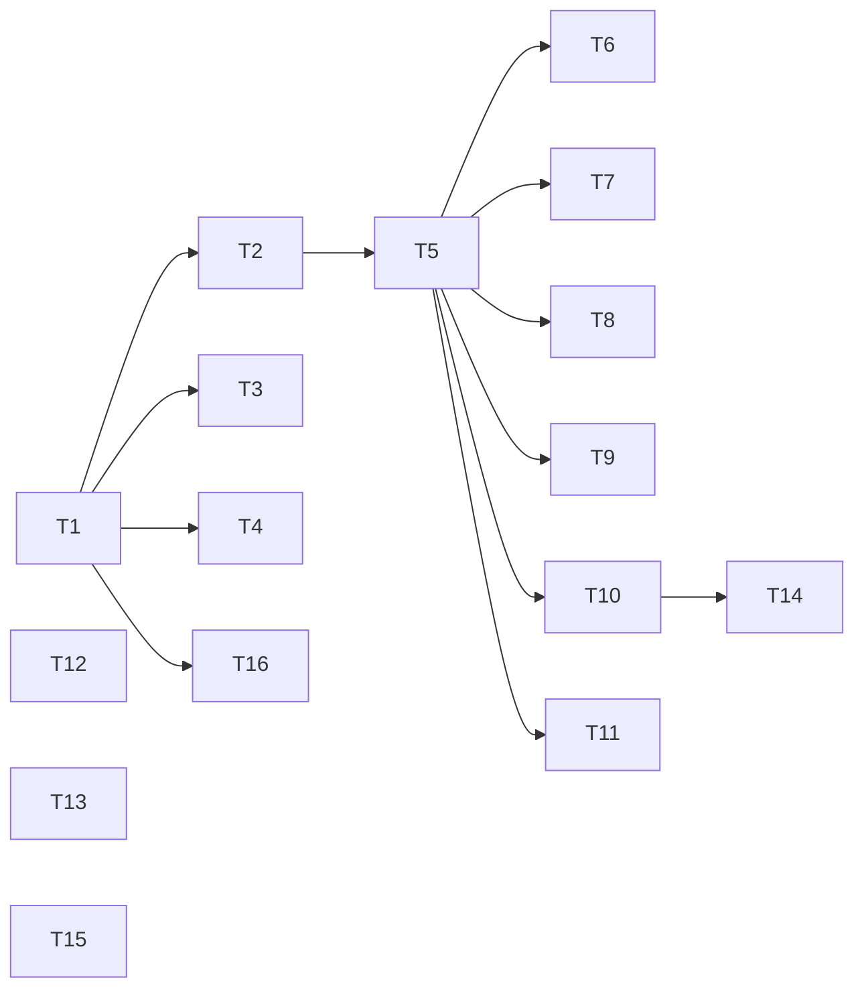

# Plan: plain-relay contract + leak-point fixes (P0+P1)

**Source brief**: docs/loom/specs/2026-08-15-plain-relay-contract.md
Goal: 新增一份白話轉譯契約 + 一張每次回覆注入的觸發卡 + 修五個外洩點 + 去重重複的 brief-before-fork 樣板,讓 loom skill 回覆不再把內部詞彙外洩給使用者
Stage: finishing
Steps:
  1. 建立白話契約檔與各自獨立的外洩點修補(無相依)
  2. 注入觸發卡並在三處加上指向契約的指標(需契約存在)
  3. 在 reception 建立 brief-before-fork 單一來源(需觸發卡位置)
  4. 六處散落的 brief-before-fork 樣板改指向單一來源(需來源存在)
  5. brainstorming 研究模板建議先行重排(需 brainstorming 指標完成)
**Total tasks**: 16
**Critical-path depth**: 5 (≤5 ✓) — T1 → T2 → T5 → T10 → T14
**Execution order**: parallel-where-possible
**Plan-document-reviewer verdict**: PASS (2026-08-15, round 3)

## Task-flow diagram



## Open Questions

- OQ-1 [RESOLVED] — Does `requesting-docs-review/SKILL.md` carry a literal 3-option jargon menu to plainify? → resolved: recon (bash grep 2026-08-15) found no user-facing 3-option block; `delta-scoped`/`reviewed_sha`/`CONFIRMED_RESOLVED` are internal mechanism names (`loom-code/skills/requesting-docs-review/SKILL.md:8,22,47,57,80`), not a user option menu. Per the brief's own default ("Default if unrecoverable: drop"), this P1 item is DROPPED — no task. No 3-option menu is invented to fix. **Coverage linkage**: this resolution covers the brief `## Decision` item "requesting-docs-review options → plain labels (this item open — see OQ-1)" — the brief itself routed that item to OQ-1, so the OQ resolution is its coverage mechanism, not a task.

## Task 1 — Create plain-relay contract file

- **Description**: Create `loom-pipeline/hooks/plain-relay.md` containing the 7-rule Plain-Relay Contract (1 conclusion-first first line; 2 translate every internal token via glossary; 3 hard caps — default reply ≤10 lines, one idea per sentence, ≤3 bullets; 4 one decision per ask ≤3 options + named default, stakes line first; 5 never lead with a raw gate/error string, plain words first; 6 announce stages in outcome language, never internal markers; 7 status symbols carry meaning inline or are dropped), a Shared glossary table (token → meaning) covering PASS / PASS_WITH_NOTES / NEEDS_REVISION / DONE / BLOCKED / NEEDS_CONTEXT / 🔴🟡🟢 / Wave N·fan-out / Axis N·Phase·Stage (never printed), and one ✅/❌ calibration pair. Render meanings in a language-neutral form (the contract is English prose per repo convention; live output is the conversation language). Use the draft in the research note as the starting text — do not paraphrase its rule wording.
- **Module**: `loom-pipeline/hooks/plain-relay.md`
- **Files touched**: `loom-pipeline/hooks/plain-relay.md`, `scripts/test_plain_relay_contract.py`
- **Context paths**:
  - `/Users/kouko/kouko-obsidian-vault/research/2026-08-15 loom skill 回應白話化研究——ADHD-friendly 溝通契約設計.md` (§4.2 carries the contract + glossary + calibration pair draft — the verbatim source)
  - `/Users/kouko/GitHub/monkey-skills/loom-pipeline/hooks/family-relay.md` (sibling relay doc — match its heading/section style)
  - `/Users/kouko/GitHub/monkey-skills/scripts/test_router_card_rule_tokens.py` (block-scope grep test idiom, lines 62-99 + 106-139)
- **Acceptance**:
  - **RED**: `scripts/test_plain_relay_contract.py > test_contract_has_seven_rules_and_glossary` fails on the unedited repo (file absent) — pytest asserts the file exists AND each of the 7 rule lead-ins AND the glossary header AND both ✅/❌ markers are present in the contract block; non-vacuity via the tmp_path mutation pattern (remove one rule lead-in → AssertionError names it).
  - **GREEN**: file exists at `loom-pipeline/hooks/plain-relay.md` with all 7 rules, the glossary table, and the ✅/❌ calibration pair; test passes.
- **Dependencies**: none
- **Independent**: true
- **Brief item covered**: "One plain-relay contract (loom-pipeline/hooks/plain-relay.md): 7 rules … + a token→meaning glossary + one ✅/❌ calibration pair"
- **Status**: done(4ff504ef)
- **Gloss**: 一份全家共用的白話轉譯契約誕生——後續所有指向與觸發卡都 reference 它,這是整個白話化的單一來源。

## Task 2 — Inject PLAIN-RELAY trigger card into the SessionStart reception

- **Description**: Append the ≤6-line `<PLAIN-RELAY>` trigger card to `loom-pipeline/hooks/family-reception.md` so the SessionStart bash script (`hooks/session-start:37` cats the whole file verbatim into the injected additionalContext) preloads it at every session start. Card content (verbatim, it is a contract surface):

  ```
  <PLAIN-RELAY>
  Before EVERY user-visible reply while a loom skill is active:
  - 1st line = plain-language conclusion, in the conversation language.
  - Translate every internal token (PASS_WITH_NOTES, Axis, Wave, 🔴🟡🟢) — glossary: loom-pipeline/hooks/plain-relay.md.
  - Default reply ≤10 lines; ONE decision per ask (≤3 options + a recommended default).
  - Never lead with a raw gate/error string — plain words first.
  </PLAIN-RELAY>
  ```

  Place the card as its own section near the top of family-reception.md (after the intro, before the family map) so the agent reads it early. Do NOT edit the `session-start` script — it is a pure pass-through reader.
- **Module**: `loom-pipeline/hooks/family-reception.md`
- **Files touched**: `loom-pipeline/hooks/family-reception.md`, `scripts/test_plain_relay_trigger_card.py`
- **Context paths**:
  - `/Users/kouko/GitHub/monkey-skills/loom-pipeline/hooks/session-start` (bash script — confirm `cat "${RECEPTION_PATH}"` at line 37 means appended content flows through; do not edit it)
  - `/Users/kouko/GitHub/monkey-skills/loom-pipeline/hooks/family-reception.md` (file being edited)
  - `/Users/kouko/GitHub/monkey-skills/scripts/test_router_card_rule_tokens.py` (grep idiom)
- **Acceptance**:
  - **RED**: `scripts/test_plain_relay_trigger_card.py > test_reception_contains_plain_relay_card` fails — pytest read_text of family-reception.md asserts the literal `<PLAIN-RELAY>` opener and the four bullet lines are present; non-vacuity via tmp_path mutation.
  - **GREEN**: family-reception.md carries the verbatim card block; test passes. (No script edit needed — session-start cats the file.)
- **Dependencies**: Task 1 completes first
- **Independent**: false
- **Brief item covered**: "One injected trigger card (≤6 lines, appended to the SessionStart hook that already injects the Loom Family Reception) — the imperative short card the local A/B proved"
- **Status**: done(6857e92c)
- **Gloss**: 一張每次 session 開始就預載的短命令卡,把「白話回覆」從「需要記得」變成「每輪自動綁定」——A/B 證明注入短卡有效、供查閱長文無效。

## Task 3 — Point family-relay.md at the plain-relay contract

- **Description**: Add a one-line pointer in `loom-pipeline/hooks/family-relay.md` directing readers to `loom-pipeline/hooks/plain-relay.md` for the plain-language translation contract (the 7 rules + glossary), placed near the existing relay-mechanics rules. Do not duplicate the rules — point only.
- **Module**: `loom-pipeline/hooks/family-relay.md`
- **Files touched**: `loom-pipeline/hooks/family-relay.md`, `scripts/test_plain_relay_pointer_family_relay.py`
- **Context paths**:
  - `/Users/kouko/GitHub/monkey-skills/loom-pipeline/hooks/family-relay.md` (file being edited — note existing `§(b) Visual defaults` at line 52+ and cell-cap rule)
  - `/Users/kouko/GitHub/monkey-skills/loom-pipeline/hooks/plain-relay.md` (produced by Task 1 — the pointer target)
- **Acceptance**:
  - **RED**: `scripts/test_plain_relay_pointer_family_relay.py > test_family_relay_points_at_plain_relay` fails — pytest asserts family-relay.md contains a reference string naming `plain-relay.md`; non-vacuity via mutation.
  - **GREEN**: family-relay.md carries the one-line pointer to plain-relay.md; test passes.
- **Dependencies**: Task 1 completes first
- **Independent**: true
- **Brief item covered**: "family-relay.md + relay-phrasing.md gain a one-line pointer to plain-relay" (family-relay half)
- **Status**: done(b4f5ba55)
- **Gloss**: 讓 relay 機制的 SSOT 檔也指向白話契約,讀到 relay 規則的人不會漏掉白話要求。

## Task 4 — Point relay-phrasing.md at the plain-relay contract

- **Description**: Add a one-line pointer in `loom-code/skills/requesting-code-review/references/relay-phrasing.md` directing readers to `loom-pipeline/hooks/plain-relay.md` for the family-wide plain-language contract, so the review-report-specific phrasing rule (rules 2/4 + ✅❌ at lines 27-43) is understood as one instance of the family contract. Point only, do not duplicate.
- **Module**: `loom-code/skills/requesting-code-review/references/relay-phrasing.md`
- **Files touched**: `loom-code/skills/requesting-code-review/references/relay-phrasing.md`, `scripts/test_plain_relay_pointer_relay_phrasing.py`
- **Context paths**:
  - `/Users/kouko/GitHub/monkey-skills/loom-code/skills/requesting-code-review/references/relay-phrasing.md` (file being edited; rules at lines 8-32, examples 37-43)
  - `/Users/kouko/GitHub/monkey-skills/loom-pipeline/hooks/plain-relay.md` (Task 1 output)
- **Acceptance**:
  - **RED**: `scripts/test_plain_relay_pointer_relay_phrasing.py > test_relay_phrasing_points_at_plain_relay` fails — pytest asserts relay-phrasing.md references `plain-relay.md`; non-vacuity via mutation.
  - **GREEN**: relay-phrasing.md carries the pointer; test passes.
- **Dependencies**: Task 1 completes first
- **Independent**: true
- **Brief item covered**: "family-relay.md + relay-phrasing.md gain a one-line pointer to plain-relay" (relay-phrasing half)
- **Status**: done(16a1c52c)
- **Gloss**: 原本只在一個 skill 用的轉述規則,現在掛鉤到家族級白話契約,避免讀者以為它只是局部規則。

## Task 5 — Establish brief-before-fork SSOT in the reception

- **Description**: Add a new section `## Brief before a complex fork` to `loom-pipeline/hooks/family-reception.md` carrying the canonical brief-before-fork trigger text (the `≥3 trade-offs, ≥2 implementation paths, or architectural blast radius → run dev-workflow:brief-before-asking` rule, including its threshold definition and the one-line stakes-first framing). This becomes the single source the 6 duplicated copies (Tasks 6-11) will point to. Author the section so it stands alone (a reader landing here understands the rule without the surrounding router context). Place it after the trigger card section (Task 2) to avoid an edit conflict on the same file.
- **Module**: `loom-pipeline/hooks/family-reception.md`
- **Files touched**: `loom-pipeline/hooks/family-reception.md`, `scripts/test_brief_before_fork_source.py`
- **Context paths**:
  - `/Users/kouko/GitHub/monkey-skills/loom-pipeline/hooks/family-reception.md` (file being edited; Task 2 already added the trigger card)
  - `/Users/kouko/GitHub/monkey-skills/loom-code/skills/brainstorming/SKILL.md` (line 58 — one of the 6 copies, source of the current trigger wording)
  - `/Users/kouko/GitHub/monkey-skills/loom-code/skills/subagent-driven-development/SKILL.md` (line 40 — another copy)
- **Acceptance**:
  - **RED**: `scripts/test_brief_before_fork_source.py > test_reception_has_brief_before_fork_section` fails — pytest asserts family-reception.md has a `## Brief before a complex fork` heading AND the threshold phrase `≥3 trade-offs` (or its rendered form) within that section; non-vacuity via mutation.
  - **GREEN**: the section exists with the canonical trigger text; test passes.
- **Dependencies**: Task 2 completes first
- **Independent**: false
- **Brief item covered**: "dedup brief-before-fork: 6 full copies + 2 partial → one source, rest point" (the one-source half)
- **Status**: done(a46e4b5e)
- **Gloss**: 把散在六處的「複雜分岔前先簡報」規則收成一個權威來源,讓後續六處只需指向它,不再各自複製。

## Task 6 — Replace brief-before-fork copy in using-loom-discovery with a pointer

- **Description**: In `loom-discovery/skills/using-loom-discovery/SKILL.md` (line 63), replace the full brief-before-fork template block with a one-line pointer to `loom-pipeline/hooks/family-reception.md §Brief before a complex fork`. Remove the duplicated threshold text; keep only the pointer and any router-specific one-line anchor that ties the pointer to this router's context.
- **Module**: `loom-discovery/skills/using-loom-discovery/SKILL.md`
- **Files touched**: `loom-discovery/skills/using-loom-discovery/SKILL.md`, `scripts/test_brief_before_fork_pointer_discovery.py`
- **Context paths**:
  - `/Users/kouko/GitHub/monkey-skills/loom-discovery/skills/using-loom-discovery/SKILL.md` (file being edited; copy at line 63)
  - `/Users/kouko/GitHub/monkey-skills/loom-pipeline/hooks/family-reception.md` (Task 5 output — the pointer target)
- **Acceptance**:
  - **RED**: `scripts/test_brief_before_fork_pointer_discovery.py > test_discovery_points_at_source` fails — pytest asserts the SKILL.md references `family-reception.md §Brief before a complex fork` AND no longer carries the verbatim threshold phrase `≥3 trade-offs` (the copy is removed, not just augmented); non-vacuity via re-inserting the threshold phrase → test fails.
  - **GREEN**: the full template is gone, replaced by the pointer; test passes.
- **Dependencies**: Task 5 completes first
- **Independent**: true
- **Brief item covered**: "dedup brief-before-fork: 6 full copies + 2 partial → one source, rest point" (discovery copy)
- **Status**: done(90b890b3)
- **Gloss**: discovery 路由器不再自己背一份簡報規則,改成指向家族單一來源——少一份就少一處將來會飄的複本。

## Task 7 — Replace brief-before-fork copy in using-loom-interface-design with a pointer

- **Description**: In `loom-interface-design/skills/using-loom-interface-design/SKILL.md` (line 41), replace the full brief-before-fork template block with a one-line pointer to `loom-pipeline/hooks/family-reception.md §Brief before a complex fork`. Remove the duplicated threshold text; keep only the pointer + router-specific anchor.
- **Module**: `loom-interface-design/skills/using-loom-interface-design/SKILL.md`
- **Files touched**: `loom-interface-design/skills/using-loom-interface-design/SKILL.md`, `scripts/test_brief_before_fork_pointer_interface.py`
- **Context paths**:
  - `/Users/kouko/GitHub/monkey-skills/loom-interface-design/skills/using-loom-interface-design/SKILL.md` (copy at line 41)
  - `/Users/kouko/GitHub/monkey-skills/loom-pipeline/hooks/family-reception.md` (Task 5 output)
- **Acceptance**:
  - **RED**: `scripts/test_brief_before_fork_pointer_interface.py > test_interface_points_at_source` fails — asserts pointer present AND verbatim threshold phrase `≥3 trade-offs` removed; non-vacuity via re-insert.
  - **GREEN**: pointer replaces the copy; test passes.
- **Dependencies**: Task 5 completes first
- **Independent**: true
- **Brief item covered**: "dedup brief-before-fork: 6 full copies + 2 partial → one source, rest point" (interface copy)
- **Status**: done(7e8ce46a)
- **Gloss**: interface-design 路由器改指向單一來源,簡報規則只在 reception 維護一份。

## Task 8 — Replace brief-before-fork copy in using-loom-product-principles with a pointer

- **Description**: In `loom-product-principles/skills/using-loom-product-principles/SKILL.md` (line 43), replace the full brief-before-fork template block with a one-line pointer to `loom-pipeline/hooks/family-reception.md §Brief before a complex fork`. Remove the duplicated threshold text; keep only the pointer + router-specific anchor.
- **Module**: `loom-product-principles/skills/using-loom-product-principles/SKILL.md`
- **Files touched**: `loom-product-principles/skills/using-loom-product-principles/SKILL.md`, `scripts/test_brief_before_fork_pointer_principles.py`
- **Context paths**:
  - `/Users/kouko/GitHub/monkey-skills/loom-product-principles/skills/using-loom-product-principles/SKILL.md` (copy at line 43)
  - `/Users/kouko/GitHub/monkey-skills/loom-pipeline/hooks/family-reception.md` (Task 5 output)
- **Acceptance**:
  - **RED**: `scripts/test_brief_before_fork_pointer_principles.py > test_principles_points_at_source` fails — asserts pointer present AND verbatim threshold phrase removed; non-vacuity via re-insert.
  - **GREEN**: pointer replaces the copy; test passes.
- **Dependencies**: Task 5 completes first
- **Independent**: true
- **Brief item covered**: "dedup brief-before-fork: 6 full copies + 2 partial → one source, rest point" (principles copy)
- **Status**: done(9f190e07)
- **Gloss**: product-principles 路由器改指向單一來源。

## Task 9 — Replace brief-before-fork copy in using-loom-spec with a pointer

- **Description**: In `loom-spec/skills/using-loom-spec/SKILL.md` (line 19), replace the full brief-before-fork template block with a one-line pointer to `loom-pipeline/hooks/family-reception.md §Brief before a complex fork`. Remove the duplicated threshold text; keep only the pointer + router-specific anchor.
- **Module**: `loom-spec/skills/using-loom-spec/SKILL.md`
- **Files touched**: `loom-spec/skills/using-loom-spec/SKILL.md`, `scripts/test_brief_before_fork_pointer_spec.py`
- **Context paths**:
  - `/Users/kouko/GitHub/monkey-skills/loom-spec/skills/using-loom-spec/SKILL.md` (copy at line 19)
  - `/Users/kouko/GitHub/monkey-skills/loom-pipeline/hooks/family-reception.md` (Task 5 output)
- **Acceptance**:
  - **RED**: `scripts/test_brief_before_fork_pointer_spec.py > test_spec_points_at_source` fails — asserts pointer present AND verbatim threshold phrase removed; non-vacuity via re-insert.
  - **GREEN**: pointer replaces the copy; test passes.
- **Dependencies**: Task 5 completes first
- **Independent**: true
- **Brief item covered**: "dedup brief-before-fork: 6 full copies + 2 partial → one source, rest point" (spec copy)
- **Status**: done(24ab1675)
- **Gloss**: spec 路由器改指向單一來源。

## Task 10 — Replace brief-before-fork copy in brainstorming with a pointer

- **Description**: In `loom-code/skills/brainstorming/SKILL.md` (line 58), replace the full brief-before-fork template block with a one-line pointer to `loom-pipeline/hooks/family-reception.md §Brief before a complex fork`. Remove the duplicated threshold text; keep the pointer + the brainstorming-specific anchor. Note: this file is also touched by Task 14 (axis4-research-protocol.md reorder) — that is a DIFFERENT file (references/axis4-research-protocol.md), so no conflict.
- **Module**: `loom-code/skills/brainstorming/SKILL.md`
- **Files touched**: `loom-code/skills/brainstorming/SKILL.md`, `scripts/test_brief_before_fork_pointer_brainstorming.py`
- **Context paths**:
  - `/Users/kouko/GitHub/monkey-skills/loom-code/skills/brainstorming/SKILL.md` (copy at line 58)
  - `/Users/kouko/GitHub/monkey-skills/loom-pipeline/hooks/family-reception.md` (Task 5 output)
- **Acceptance**:
  - **RED**: `scripts/test_brief_before_fork_pointer_brainstorming.py > test_brainstorming_points_at_source` fails — asserts pointer present AND verbatim threshold phrase removed; non-vacuity via re-insert.
  - **GREEN**: pointer replaces the copy; test passes.
- **Dependencies**: Task 5 completes first
- **Independent**: true
- **Brief item covered**: "dedup brief-before-fork: 6 full copies + 2 partial → one source, rest point" (brainstorming copy)
- **Status**: done(8bc0f516)
- **Gloss**: brainstorming skill 改指向單一來源(此檔的 axis4 模板重排由 Task 14 另行處理,不同檔不衝突)。

## Task 11 — Replace brief-before-fork copy in subagent-driven-development with a pointer

- **Description**: In `loom-code/skills/subagent-driven-development/SKILL.md` (line 40), replace the full brief-before-fork template block with a one-line pointer to `loom-pipeline/hooks/family-reception.md §Brief before a complex fork`. Remove the duplicated threshold text; keep the pointer + SDD-specific anchor.
- **Module**: `loom-code/skills/subagent-driven-development/SKILL.md`
- **Files touched**: `loom-code/skills/subagent-driven-development/SKILL.md`, `scripts/test_brief_before_fork_pointer_sdd.py`
- **Context paths**:
  - `/Users/kouko/GitHub/monkey-skills/loom-code/skills/subagent-driven-development/SKILL.md` (copy at line 40)
  - `/Users/kouko/GitHub/monkey-skills/loom-pipeline/hooks/family-reception.md` (Task 5 output)
- **Acceptance**:
  - **RED**: `scripts/test_brief_before_fork_pointer_sdd.py > test_sdd_points_at_source` fails — asserts pointer present AND verbatim threshold phrase removed; non-vacuity via re-insert.
  - **GREEN**: pointer replaces the copy; test passes.
- **Dependencies**: Task 5 completes first
- **Independent**: true
- **Brief item covered**: "dedup brief-before-fork: 6 full copies + 2 partial → one source, rest point" (SDD copy)
- **Status**: done(f1a76066)
- **Gloss**: SDD skill 改指向單一來源,六處簡報規則從此只維護一份。

## Task 12 — Announce spec-expansion phases in conversation language, not internal markers

- **Description**: In `loom-spec/skills/spec-expansion/SKILL.md`, change the 5 forced verbatim English phase-marker prints (lines 150, 201, 237, 296, 330 — `— Phase ① USM backbone —` etc.) so the CHAT announcement uses outcome language in the conversation language ("next I'll confirm the requirement boundary"), while the internal phase marker is kept only inside the artifact (the spec delta), not printed to chat. Also fix the internal inconsistency at line 235 (Japanese section heading 自動拓展矩陣) vs line 237 (English marker) — the chat announcement uses conversation language consistently. Do not change the artifact-internal phase identifiers.
- **Module**: `loom-spec/skills/spec-expansion/SKILL.md`
- **Files touched**: `loom-spec/skills/spec-expansion/SKILL.md`, `scripts/test_spec_expansion_phase_markers.py`
- **Context paths**:
  - `/Users/kouko/GitHub/monkey-skills/loom-spec/skills/spec-expansion/SKILL.md` (5 markers at lines 150/201/237/296/330; §heading 235)
  - `/Users/kouko/GitHub/monkey-skills/loom-pipeline/hooks/plain-relay.md` (Task 1 output — rule 6 "announce stages in outcome language")
- **Acceptance**:
  - **RED**: `scripts/test_spec_expansion_phase_markers.py > test_no_verbatim_phase_marker_in_chat_instruction` fails — pytest asserts the SKILL.md no longer instructs printing the verbatim `— Phase ①` marker to chat (the print-verbatim instruction is removed/replaced) AND still references the phase internally for the artifact; non-vacuity via re-inserting the verbatim print instruction → test fails.
  - **GREEN**: chat announcement uses outcome language; internal markers retained for the artifact; test passes.
- **Dependencies**: none
- **Independent**: true
- **Brief item covered**: "spec-expansion → announce step in conversation language, internal marker only in artifact" (SE3 leak-point)
- **Status**: done(e2cb158b)
- **Gloss**: spec 展開過程不再把「Phase ① USM backbone」這類內部標記印給使用者,改成白話說「下一步在做什麼」。

## Task 13 — Prepend a user-facing plain line to each git-guard MSG_* block message

- **Description**: In `loom-code/hooks/git-guard.py`, prepend a one-line user-facing plain summary to each of MSG_NO_VERIFY (line 114), MSG_REVIEW (line 119), MSG_VERIFIED (line 125) — each summary says in plain words what happened + the two options the user has. The existing model-facing action directives ("Drop the flag and let the hooks run", "Run the package-level test suite green") and the existing discriminator substrings `load-bearing` (MSG_NO_VERIFY) and `verification marker` (MSG_VERIFIED) MUST be preserved (the existing `loom-code/scripts/test_git_guard.py:417,420` asserts them in stderr) — the plain line is PREPENDED, not a replacement. This gives the agent ready-made plain text to relay instead of pasting the raw model-facing stderr.
- **Module**: `loom-code/hooks/git-guard.py`
- **Files touched**: `loom-code/hooks/git-guard.py`, `loom-code/scripts/test_git_guard.py`
- **Context paths**:
  - `/Users/kouko/GitHub/monkey-skills/loom-code/hooks/git-guard.py` (MSG_* at lines 114-130; stderr emission at line 97)
  - `/Users/kouko/GitHub/monkey-skills/loom-code/scripts/test_git_guard.py` (existing assertions at lines 417/420/421/288-298 — must keep passing)
  - `/Users/kouko/GitHub/monkey-skills/loom-pipeline/hooks/plain-relay.md` (Task 1 — rule 5 "never lead with a raw gate string")
- **Acceptance**:
  - **RED**: `loom-code/scripts/test_git_guard.py > test_msg_constants_carry_plain_line` (new) fails — subprocess-runs the hook for the no-verify / review-blocked / verified cases and asserts each MSG_* output now contains a new plain summary marker token (e.g. `what happened:`) in stderr; the EXISTING assertions (`load-bearing`, `verification marker`, `requesting-code-review` not in verified) must still pass; non-vacuity via mutating the new plain line out → new test fails, existing tests still pass.
  - **GREEN**: each MSG_* prepends a plain summary; existing discriminator tests still green; new test green.
- **External surfaces**:
  - CLI flag: git push / git commit --no-verify — grounding: existing test_git_guard.py subprocess harness (in-repo evidence)
- **Dependencies**: none
- **Independent**: true
- **Brief item covered**: "git-guard MSG_* → prepend a user-facing plain line" (SE3 leak-point, corrected framing: messages already have action directives but are model-facing stderr)
- **Status**: done(84a7e539)
- **Gloss: 推送被擋下時,使用者先看到一句白話「發生什麼+兩個出路」,不用先解碼「review-PASS marker」才能知道怎麼辦。

## Task 14 — Reorder brainstorming research-results template: recommendation first

- **Description**: In `loom-code/skills/brainstorming/references/axis4-research-protocol.md` (template at lines 88-108), reorder so the "My take" recommendation block (currently last, lines 104-108) comes FIRST, then the 3 alternatives with source + pros/cons. Aligns with plain-relay rule 1 (conclusion-first). Also reword the SKILL.md prose at lines 150/152 from "end in an explicit recommendation" to recommendation-first wording ("lead with an explicit recommendation, then surface alternatives") so the prose matches the reordered template. The template reorder and its describing prose are one semantic change (recommendation-first), so they travel in one task across two files. Task 10 also edits brainstorming/SKILL.md (line 58 region, a different concern — brief-before-fork pointer); because both touch the same file, T14 runs after T10 (see Dependencies) — no parallel conflict.
- **Module**: `loom-code/skills/brainstorming/references/axis4-research-protocol.md`
- **Files touched**: `loom-code/skills/brainstorming/references/axis4-research-protocol.md`, `loom-code/skills/brainstorming/SKILL.md`, `scripts/test_brainstorming_mytake_first.py`
- **Context paths**:
  - `/Users/kouko/GitHub/monkey-skills/loom-code/skills/brainstorming/references/axis4-research-protocol.md` (template 88-108; My take 104-108)
  - `/Users/kouko/GitHub/monkey-skills/loom-code/skills/brainstorming/SKILL.md` (lines 150/152 — the "end in recommendation" prose)
  - `/Users/kouko/GitHub/monkey-skills/loom-pipeline/hooks/plain-relay.md` (Task 1 — rule 1)
- **Acceptance**:
  - **RED**: `scripts/test_brainstorming_mytake_first.py > test_my_take_precedes_alternatives` fails — pytest read_text of axis4-research-protocol.md asserts the "My take" heading appears BEFORE the first alternative heading in the template block; AND `test_mytake_ordering_prose_updated` fails — pytest read_text of brainstorming/SKILL.md asserts the line-150/152 region no longer says "end in an explicit recommendation" and now carries recommendation-first wording ("lead with" or equivalent); non-vacuity via swapping either back → the corresponding test fails.
  - **GREEN**: My take block precedes the alternatives in the template; the SKILL.md:150/152 prose describes recommendation-first ordering; both tests pass.
- **Dependencies**: Task 10 completes first
- **Independent**: false
- **Brief item covered**: "brainstorming axis4 → recommendation first" (SE3 leak-point)
- **Status**: done(f3bbbff5)
- **Gloss: 研究結果一開頭就講「所以選哪個」,使用者不用讀完三個方案的優缺點才看到建議。

## Task 15 — Collapse finishing close-out N/A noise into one summary line

- **Description**: In `loom-code/skills/finishing-a-development-branch/SKILL.md` (checks table lines 187-194), change the close-out instruction so that when multiple checks are N/A (e.g. memory-store `:192` "checker not present", archive-on-close `:190`, backlog-close `:193`, open-questions `:194`), the agent emits ONE summary line ("N inapplicable checks skipped: <list>; details on request") AFTER the plain conclusion, instead of stacking ~4-5 separate "N/A — checker not present" lines before the conclusion. The conclusion-first ordering is the point. Keep the per-check semantics (each still must be stated, just consolidated).
- **Module**: `loom-code/skills/finishing-a-development-branch/SKILL.md`
- **Files touched**: `loom-code/skills/finishing-a-development-branch/SKILL.md`, `scripts/test_finishing_na_collapse.py`
- **Context paths**:
  - `/Users/kouko/GitHub/monkey-skills/loom-code/skills/finishing-a-development-branch/SKILL.md` (checks table 187-194)
  - `/Users/kouko/GitHub/monkey-skills/loom-pipeline/hooks/plain-relay.md` (Task 1 — rule 1 conclusion-first)
- **Acceptance**:
  - **RED**: `scripts/test_finishing_na_collapse.py > test_na_lines_consolidated` fails — pytest asserts the SKILL.md instructs a single consolidated N/A summary line (a new instruction phrase, e.g. "consolidate inapplicable checks into one line") AND that the old pattern of stacking multiple `N/A — checker not present` lines is no longer the prescribed first-line behavior; non-vacuity via mutation.
  - **GREEN**: consolidated instruction present; test passes.
- **Dependencies**: none
- **Independent**: true
- **Brief item covered**: "finishing → collapse N/A noise into one summary line after the conclusion" (SE3 leak-point)
- **Status**: done(08f1c7bf)
- **Gloss: 收尾報告不再先印四五行「N/A — 檢查不存在」雜訊,改成結論之後一行帶過。

## Task 16 — Add plain-relay pointer to verification-before-completion

- **Description**: In `loom-code/skills/verification-before-completion/SKILL.md` (currently has NO relay/phrasing rule — confirmed gap), add a one-line pointer to `loom-pipeline/hooks/plain-relay.md` instructing that the "done" announcement follows the plain-relay contract (conclusion-first + test result in one sentence). This fills the coverage hole where the moment the user most needs one plain line has zero phrasing discipline.
- **Module**: `loom-code/skills/verification-before-completion/SKILL.md`
- **Files touched**: `loom-code/skills/verification-before-completion/SKILL.md`, `scripts/test_verification_plain_relay_pointer.py`
- **Context paths**:
  - `/Users/kouko/GitHub/monkey-skills/loom-code/skills/verification-before-completion/SKILL.md` (no relay rule today; evidence-report line 56)
  - `/Users/kouko/GitHub/monkey-skills/loom-pipeline/hooks/plain-relay.md` (Task 1 output — pointer target)
- **Acceptance**:
  - **RED**: `scripts/test_verification_plain_relay_pointer.py > test_verification_points_at_plain_relay` fails — pytest asserts the SKILL.md references `plain-relay.md` AND mentions conclusion-first / one-sentence-test-result; non-vacuity via mutation.
  - **GREEN**: pointer + conclusion-first instruction present; test passes.
- **Dependencies**: Task 1 completes first
- **Independent**: true
- **Brief item covered**: "verification-before-completion → one-line pointer to plain-relay" (SE3 leak-point — the coverage hole)
- **Status**: done(959d12f8)
- **Gloss: 「做完了」這個最需要一句白話的時刻,從此也被白話契約接管,不再是 relay 規則的覆蓋洞。

## Notes

- Header verdict stamped PASS (2026-08-15, round 3) — stamping the verdict, no re-review (closed-list kind #1).
- Dependencies fields for T2/T5/T14 stripped of trailing parenthetical rationale to satisfy plan_card.py's strict syntax (edges unchanged; rationale preserved in the Notes bullets below) — formatting cleanup, no re-review (closed-list kind #2).
- Kickoff briefing (2026-08-15): appetite read — no `docs/loom/PRINCIPLES.md` in target repo → default brief all one-way-door hits. Sweep of all 16 tasks found **0 one-way-door hits** (every task is a reversible prose/pointer/file edit; T13 git-guard prepends a plain line but preserves existing discriminators, reversal = remove the line) and **0 researchable forks** (all task content is pinned via the research-note draft §4.2 or verbatim card text). Zero one-way-door → no batched briefing. Two-way prose-wording choices (T1 contract 7-rule phrasing, T12 outcome-language phrasing, T13 plain-line text) delegated to implementers per §a bottom-left cell — recorded here, not briefed.
- **brief-before-fork "2 partial" copies — why no conversion task (round-2 reviewer note, resolved by inspection)**: the brief's Reverse sub-bullet lists "6 full copies + 2 partial (using-loom-pipeline `:158`, relay-phrasing `:20`)". Both partials were inspected at file:line on 2026-08-15 and found to be **reference-shaped, not trigger-template copies**. `using-loom-pipeline/SKILL.md:~158` (the "(b) Product forks" bullet) names `dev-workflow:brief-before-asking` and describes *when* the conductor briefs (a genuine product decision during a segment); it does NOT carry the `≥3 trade-offs / ≥2 implementation paths / architectural blast radius` trigger text that T5 consolidates. `relay-phrasing.md:20` is already a pointer — "The trigger and its threshold triple live in [`../SKILL.md`](../SKILL.md) §Asking the user (lockstep-guarded there with SDD and kickoff-briefing)"; it defers to `requesting-code-review/SKILL.md` §Asking the user, not duplicate the trigger template. The dedup's drift-prevention purpose is fully served by converting the 6 full template copies (T6-T11) to point at the family-reception source; the 2 partials carry no trigger-template text to drift, so no conversion task is warranted. Whether `requesting-code-review/SKILL.md` §Asking the user (which relay-phrasing:20 points to, and which is "lockstep-guarded with SDD") should itself retarget to the new family-reception source is a separate concern outside this brief's enumerated 6+2 scope — not added here.
- T2 and T5 both edit `loom-pipeline/hooks/family-reception.md` → T5 depends on T2 (sequential, not parallel).
- T10 and T14 both touch `loom-code/skills/brainstorming/SKILL.md` (T10 at line 58 region, T14 at line 150/152 region) → T14 depends on T10 (sequential, same file, different regions).
- T1 is the fan-in root: T2, T3, T4, T16 all need plain-relay.md to exist before they can point to it.
- T5 is the fan-in root for T6-T11 (the 6 pointer conversions need the source section to exist).
- Independent: true leaves at level 1 (T1, T12, T13, T15), level 2 (T3, T4, T16 — all need T1, disjoint files among themselves), level 4 (T6-T11 — all need T5, disjoint files among themselves) are parallel-eligible within their level.
- docs-review P1 item DROPPED — see OQ-1 [RESOLVED]. The brief's SE3 listed it with an OQ caveat; recon confirmed no literal 3-option menu, so per the brief's own default it is dropped, not forced.
- All prose tasks use the `scripts/test_router_card_rule_tokens.py:62-99` block-scope grep + `:106-139` tmp_path-mutation non-vacuity idiom. T13 (git-guard) uses the existing `loom-code/scripts/test_git_guard.py` subprocess-stderr idiom instead.
- Net字数 effect is near-additive (three-gate dedup is already done — corrected from the research's root-cause ①); the brief's "淨效果字數下降" is NOT claimed here.