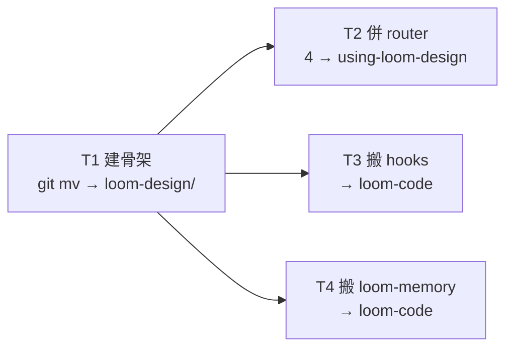

# Plan: loom-design merge — part 1 (structure)

Source brief: docs/loom/plans/2026-08-16-loom-design-merge-plan.md（遷移藍圖，§5 S1-S4）
Goal: 建立 loom-design 骨架（9 member skills + scripts + examples），4 個設計 router 併成 using-loom-design，家族 hooks 與 loom-memory 搬進 loom-code。此 part 完成後 repo 處於 WIP 斷裂狀態（引用仍指舊名），由 part 2 修復。
Stage: finishing
Total tasks: 4
Critical-path depth: 2 (≤5)
Execution order: parallel-where-possible
Plan-document-reviewer verdict: PASS (2026-08-16, round 2)

## Task-flow diagram

## Open Questions

N/A — no unresolved question: 三個設計決定（D1 hooks→loom-code、D2 loom-memory→loom-code、D3 member 名不變）已在藍圖 §3 全數拍板；scripts 碰撞（mint_critic_verdict ×2、test_knowledge_triage ×2、test_marketplace_entry ×4、test_plugin_manifest ×4）經實測全部不同，採 per-plugin subdirs 規避，去重留作後續。

## Task 1 — 建骨架：git mv member skills + scripts + examples → loom-design/
- Description: Create the loom-design/ plugin directory and git mv the 9 member skills, all scripts (into per-plugin subdirs discovery/ principles/ interface/ spec/ pipeline/), and loom-spec's examples/ into it, preserving git history. Leave the 4 router dirs, loom-pipeline's hooks/ and skills/loom-memory/, and all .claude-plugin/ + .codex-plugin/ manifests in place for their dedicated tasks. Move each plugin's CHANGELOG.md and README.md into loom-design/ (keep the primary, archive the rest as CHANGELOG-<plugin>.md / README-<plugin>.md).
- Module: loom-design/ (new plugin root)
- Files touched: loom-design/skills/{business-value,user-insights,product-principles,design-system,interaction-flows,design-critic,spec-expansion,completeness-critic,using-loom-pipeline}/, loom-design/scripts/{discovery,principles,interface,spec,pipeline}/, loom-design/examples/, loom-design/{CHANGELOG.md,README.md}; source dirs in loom-discovery/, loom-product-principles/, loom-interface-design/, loom-spec/, loom-pipeline/
- Context paths:
  - The 5 plugin dirs' skills/ and scripts/ listings (reconnaissance done: 9 member skills, ~50 scripts, 7 examples)
- Acceptance:
  - RED: `test -d loom-design/skills/spec-expansion` fails (loom-design does not exist yet)
  - GREEN: loom-design/ contains all 9 member skills, scripts/ with 5 per-plugin subdirs (no file collisions), examples/ with the 7 change-folders; the 5 old plugin dirs retain only router dirs + hooks/ + skills/loom-memory/ + manifests + (moved) CHANGELOG/README
- Dependencies: none
- Independent: false
- Brief item covered: 藍圖 §1.1 loom-design 目標結構（member skills + scripts + examples）
- Status: done(f0aabc40)
- Gloss: 建立 loom-design 骨架，git mv 保留歷史；scripts 用 per-plugin subdirs 規避碰撞

## Task 2 — 併 router：4 個 using-loom-* → using-loom-design
- Description: Merge the 4 design router skills (using-loom-discovery, using-loom-product-principles, using-loom-interface-design, using-loom-spec) into a single loom-design/skills/using-loom-design/ skill. The merged router covers the 4 stations' entry points (discovery / principles / interface / spec) with the ~70% shared skeleton deduplicated; each station's unique routing content is preserved. Delete the 4 old router dirs.
- Module: loom-design/skills/using-loom-design/
- Files touched: loom-design/skills/using-loom-design/SKILL.md (+ bundled reference files), the 4 old router dirs (loom-discovery/skills/using-loom-discovery/, loom-product-principles/skills/using-loom-product-principles/, loom-interface-design/skills/using-loom-interface-design/, loom-spec/skills/using-loom-spec/)
- Context paths:
  - The 4 router SKILL.md files (read before merging)
- Acceptance:
  - RED: `test -f loom-design/skills/using-loom-design/SKILL.md` fails
  - GREEN: using-loom-design/SKILL.md exists and routes all 4 stations (each station's entry point reachable); the 4 old router dirs are deleted
- Dependencies: Task 1 completes first
- Independent: true
- Brief item covered: 藍圖 §2 改名對照（4 routers → using-loom-design）
- Status: done(8aecf21d)
- Gloss: 4 個設計 router 併成 1 個入口，骨架去重

## Task 3 — 搬 hooks：family hooks + hooks.json + session-start → loom-code
- Description: Move the 6 family hook files (family-reception.md, family-relay.md, plain-relay.md, lang_detect.py, language-anchor.py, language-stop-check.py) from loom-pipeline/hooks/ to loom-code/hooks/. Merge loom-pipeline's hooks.json registrations (PostToolUse → language-anchor.py, Stop → language-stop-check.py) into loom-code's hooks.json (which already has SessionStart + PreToolUse). Merge the two session-start scripts so the combined hook injects BOTH router-card.md and family-reception.md as additionalContext.
- Module: loom-code/hooks/
- Files touched: loom-code/hooks/{family-reception.md,family-relay.md,plain-relay.md,lang_detect.py,language-anchor.py,language-stop-check.py,hooks.json,session-start}
- Context paths:
  - loom-pipeline/hooks/ (source files)
  - loom-code/hooks/hooks.json and session-start (existing, to merge into)
- Acceptance:
  - RED: `test -f loom-code/hooks/family-reception.md` fails
  - GREEN: all 6 family hook files present in loom-code/hooks/; hooks.json registers SessionStart + PreToolUse + PostToolUse + Stop; session-start injects both router-card.md and family-reception.md; loom-pipeline/hooks/ is gone
- Dependencies: Task 1 completes first
- Independent: true
- Brief item covered: 藍圖 §1.2 loom-code 新增（家族 hooks）
- Status: done(4874b93a)
- Gloss: 家族連接組織搬進永遠開著的 loom-code，hooks.json 與 session-start 合併

## Task 4 — 搬 loom-memory → loom-code
- Description: Move the loom-memory skill from loom-pipeline/skills/loom-memory/ to loom-code/skills/loom-memory/ via git mv.
- Module: loom-code/skills/loom-memory/
- Files touched: loom-code/skills/loom-memory/ (moved from loom-pipeline/skills/loom-memory/)
- Context paths:
  - loom-pipeline/skills/loom-memory/ (source)
- Acceptance:
  - RED: `test -d loom-code/skills/loom-memory` fails
  - GREEN: loom-memory/ present in loom-code/skills/; absent from loom-pipeline/skills/
- Dependencies: Task 1 completes first
- Independent: true
- Brief item covered: 藍圖 §3 D2（loom-memory → loom-code，已定）
- Status: done(2c1693d4)
- Gloss: 家族實務記憶搬進 loom-code

## Notes

- **WIP 斷裂狀態**：Part 1 完成後 repo 的引用仍指舊 plugin 名（loom-spec: 等），CI 會紅——這是預期，part 2（引用重指 + driver 重建 + manifest 收斂）修復。
- **scripts per-plugin subdirs**：藍圖 §1.1 原寫「scripts/ 去重後」，但實測 4 組碰撞檔（mint_critic_verdict ×2、test_knowledge_triage ×2、test_marketplace_entry ×4、test_plugin_manifest ×4）全部不同，去重是內容任務——本 part 採 per-plugin subdirs 規避碰撞，去重列為後續。
- **session-start 合併**：兩個 73 行 bash 腳本結構相似（都注入 additionalContext），合併後同時注入 router-card.md + family-reception.md；family-reception 內容更新（6→2 plugin）屬 part 2。
- **CHANGELOG/README**：5 個 plugin 各一份，搬入 loom-design/ 時保留主檔、其餘存檔為 CHANGELOG-<plugin>.md / README-<plugin>.md；正式合併屬 part 3 docs sweep。
