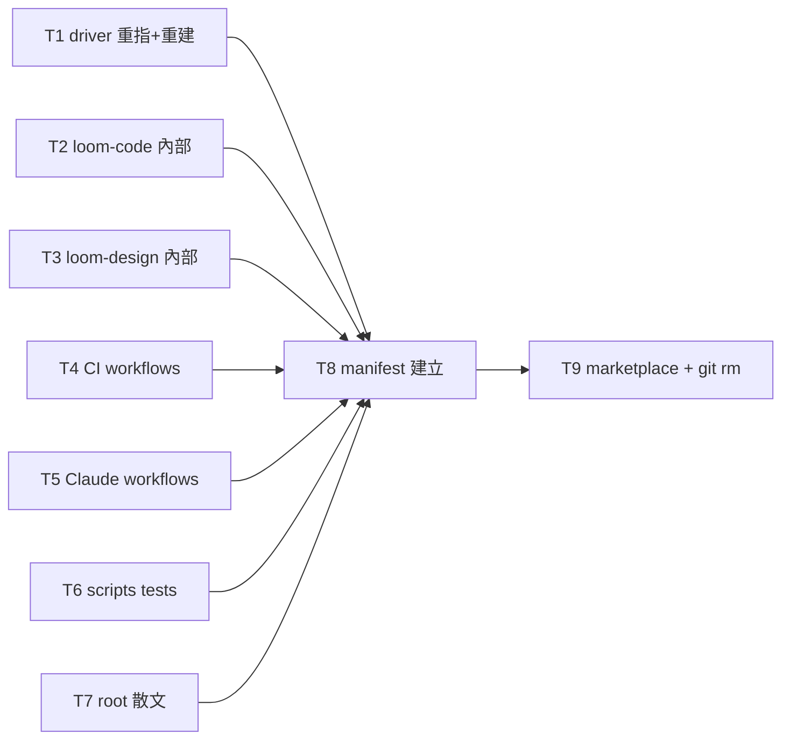

# Plan: loom-design merge — part 2 (references, driver, manifests)

Source brief: docs/loom/plans/2026-08-16-loom-design-merge-plan.md（遷移藍圖，§5 S5-S7）
Goal: 把 ~190 檔對 5 個舊 plugin 名的引用重指到 loom-design/loom-code（S5），重建 driver asset（S6），收斂 5 組 manifest → 1 組 + marketplace 6→2（S7）。此 part 完成後 repo 引用一致，CI 恢復可跑（docs 散文 sweep 屬 part 3）。
Stage: finishing
Total tasks: 9
Critical-path depth: 3 (≤5)
Execution order: parallel-where-possible
Plan-document-reviewer verdict: PASS (2026-08-16, round 4)

## Task-flow diagram

## Open Questions

N/A — no unresolved question: 改名對照已在藍圖 §2 定案（member skill 名不變、只改 plugin 前綴）；loom-pipeline 三處拆分（hooks→loom-code、scripts→loom-design、skills/loom-memory→loom-code）已由 part-1 完成物理搬移，此 part 只做文字重指；藍圖 §4「11 個 driver 限定名」實測為 7 個設計側名（+5 個 loom-code 不變），見 Notes。

## Task 1 — driver 源碼重指 + 重建 asset
- Description: Re-point the driver source group. Change every design-side qualified skill name in driver_*.js from `loom-{discovery,product-principles,interface-design,spec}:*` to `loom-design:*` (member skill names unchanged, only plugin prefix) — the 7 locations: driver_30_seg1.js:107 `loom-product-principles:product-principles`, :154 `loom-interface-design:design-system`, :155 `loom-interface-design:interaction-flows`, :202-203 `loom-interface-design:design-critic` (×2), driver_40_seg2.js:82 `loom-spec:spec-expansion`, :99 `loom-spec:completeness-critic`. Rewrite driver_40_seg2.js:127's hardcoded `loom-spec/scripts/validate_spec_output.py` to `loom-design/scripts/spec/validate_spec_output.py`. Update build_driver.py docstring/BANNER text (`loom-pipeline/scripts/` → `loom-design/scripts/pipeline/`, output path `loom-pipeline/skills/...` → `loom-design/skills/...`). Change driver_00_header.js:26's `name: 'loom-pipeline'` to `name: 'loom-design'`. Then REBUILD the asset with build_driver.py (never hand-edit the generated file) and confirm the drift test passes. The 5 `loom-code:*` names in driver_50_seg3.js (implementer/spec-reviewer/code-reviewer/code-quality-reviewer/ui-verification) stay unchanged.
- Module: loom-design/scripts/pipeline/
- Files touched: loom-design/scripts/pipeline/{driver_00_header.js,driver_10_guard.js,driver_20_runstation.js,driver_30_seg1.js,driver_40_seg2.js,driver_50_seg3.js,driver_60_ledger.js,driver_90_main.js,build_driver.py}, loom-design/skills/using-loom-pipeline/assets/loom-pipeline.js (generated output)
- Context paths:
  - The 8 driver sources (the qualified names to change are listed in Description with line refs)
  - loom-design/scripts/pipeline/test_pipeline_driver_drift.py (the acceptance oracle — rebuild must be byte-identical to the committed asset)
- Acceptance:
  - RED: `grep -l 'loom-spec:spec-expansion' loom-design/scripts/pipeline/driver_*.js` returns a hit (old name still in driver source)
  - GREEN: `grep -E 'loom-(discovery|product-principles|interface-design|spec|pipeline):' loom-design/scripts/pipeline/driver_*.js` returns NOTHING (all qualified names re-pointed to `loom-design:` or removed); `python3 loom-design/scripts/pipeline/build_driver.py` exits 0 and rebuilds the asset; `pytest loom-design/scripts/pipeline/test_pipeline_driver_drift.py -q` passes (byte-identical)
- Dependencies: none
- Independent: true
- Brief item covered: 藍圖 §4 (g) driver + 編譯產物、§5 S6 重建 driver
- Status: done(42c24145)
- Gloss: driver 源碼 7 個設計側限定名 + 1 硬編碼路徑重指，build_driver.py 重建 asset，drift test 驗證 byte-identical

## Task 2 — loom-code 內部引用重指
- Description: Re-point every reference to the 5 old plugin names inside loom-code/. `loom-pipeline/hooks/*` → `loom-code/hooks/*` (family-reception/family-relay/plain-relay moved there in part-1 T3); `loom-pipeline/skills/loom-memory/` and `loom-pipeline:loom-memory` → `loom-code:loom-memory` (moved in part-1 T4); `loom-{discovery,product-principles,interface-design,spec}:*` → `loom-design:*`; `loom-pipeline:using-loom-pipeline` → `loom-design:using-loom-pipeline`. Fix the 9 hard-asserting test files: test_asking_user_briefing_escalation.py:37 (`_PIPELINE_HOOKS` → loom-code/hooks), test_loom_firing_harness.py:44-178, test_backlog_index.py:828, test_writing_plans_verdict_gate.py:221-230, test_brainstorming_greenfield_nudge.py:139,163, test_brainstorming_axis0.py:59,86,169, test_finishing_progress_card.py:63, test_freeze_changefolder.py:61-100, test_check_scenario_coverage.py:2-3. Prose refs in skills/agents/hooks re-pointed to the new names. Leave CHANGELOG.md and research/ prose untouched (archive). Do NOT touch loom-code's 4 agentTypes.
- Module: loom-code/
- Files touched: loom-code/agents/{implementer.md,code-reviewer.md}, loom-code/hooks/{family-reception.md,session-start,lang_detect.py}, loom-code/skills/{using-loom-code,brainstorming,writing-plans,subagent-driven-development,requesting-code-review,verification-before-completion,finishing-a-development-branch,ui-verification}/** (SKILL.md + references + README files), loom-code/scripts/{archive_change_folder.py,check_scenario_coverage.py,living_spec_index.py,test_spec_to_code_wiring.py,test_living_spec_index.py,test_finishing_archive_step.py,test_writing_plans_change_binding.py,test_wp_extraction_pointers.py,test_asking_user_briefing_escalation.py,test_loom_firing_harness.py,test_backlog_index.py,test_writing_plans_verdict_gate.py,test_brainstorming_greenfield_nudge.py,test_brainstorming_axis0.py,test_finishing_progress_card.py,test_freeze_changefolder.py,test_check_scenario_coverage.py}
- Context paths:
  - The part-2 reference inventory (bucket b: 48 files with line refs)
  - The rename map in Task 1's Description (same map applies)
- Acceptance:
  - RED: `grep -lE 'loom-(discovery|product-principles|interface-design|spec|pipeline)(:|/)' loom-code/skills/ loom-code/agents/ loom-code/hooks/` returns a hit in a non-archive file
  - GREEN: `grep -lE 'loom-(discovery|product-principles|interface-design|spec|pipeline)(:|/)' loom-code/skills/ loom-code/agents/ loom-code/hooks/ loom-code/scripts/*.py` returns nothing (excluding loom-code/CHANGELOG.md and loom-code/research/ which stay archive); `pytest loom-code/scripts/test_asking_user_briefing_escalation.py loom-code/scripts/test_loom_firing_harness.py loom-code/scripts/test_backlog_index.py loom-code/scripts/test_writing_plans_verdict_gate.py loom-code/scripts/test_brainstorming_greenfield_nudge.py loom-code/scripts/test_brainstorming_axis0.py loom-code/scripts/test_finishing_progress_card.py loom-code/scripts/test_freeze_changefolder.py loom-code/scripts/test_check_scenario_coverage.py -q` passes (all 9 hard-asserting tests)
- Dependencies: none
- Independent: true
- Brief item covered: 藍圖 §4 (b) loom-code 內部（盤點實測 48 檔 / 9 RED）
- Status: done(040e48f8)
- Gloss: loom-code 內 48 檔重指 family hooks 與設計 plugin 新名，9 個 hard-assert test 同步更新並全數執行

## Task 3 — loom-design 內部引用重指
- Description: Re-point every reference to the 5 old plugin names and old sibling paths inside loom-design/ EXCLUDING the driver group (Task 1 owns driver_*.js + build_driver.py + assets/loom-pipeline.js). Three re-point kinds: (a) qualified names `loom-{discovery,product-principles,interface-design,spec}:*` → `loom-design:*`; (b) old sibling file paths `loom-spec/scripts/*`, `loom-interface-design/scripts/*`, `loom-discovery/scripts/*`, `../using-loom-spec/references/*`, `loom-pipeline/hooks/*` → their new locations (`loom-design/scripts/{spec,interface,discovery}/*`, `../using-loom-design/references/*`, `loom-code/hooks/*`); (c) plugin-name `loom-pipeline` → `loom-design` where it means the plugin (e.g. README.md:1 `# loom-pipeline`, using-loom-pipeline/SKILL.md:9,59,68 `loom-pipeline: N/A`), but `using-loom-pipeline` the SKILL NAME stays. Fix the ~60 hard-asserting script tests (scripts/{discovery,interface,principles,spec,pipeline}/test_*.py including test_plugin_manifest.py, test_marketplace_entry.py, test_using_skill.py, test_entry_*.py, test_pipeline_skill_contract.py's `loom-pipeline: n/a` string, test_pipeline_manifests.py, test_family_relay.py, test_lang_detect.py, test_comms_metrics.py, test_loom_memory_record_contradiction.py). Update examples/ prose only where it references loom-spec as a live pointer (change-folder templates may stay historical). loom-design/CHANGELOG-*.md and README-*.md archives stay untouched.
- Module: loom-design/
- Files touched: loom-design/skills/{using-loom-design,spec-expansion,completeness-critic,design-system,interaction-flows,design-critic,product-principles,business-value,user-insights}/** (all files), loom-design/skills/using-loom-pipeline/SKILL.md (its assets/loom-pipeline.js is Task 1's — glob excludes it mechanically), loom-design/scripts/{discovery,interface,principles,spec}/** (all files), loom-design/scripts/pipeline/{batch_queue.py,comms_metrics.py,fixtures/**,test_*.py} (all non-driver, non-build files), loom-design/README.md, loom-design/examples/**
- Context paths:
  - The part-2 reference inventory (bucket a: 105 files, driver group's 10 owned by Task 1)
  - The rename map in Task 1's Description
  - loom-design/skills/using-loom-design/references/ (new namespaced host-tool refs member skills can re-point to)
- Acceptance:
  - RED: `grep -lE 'loom-(discovery|product-principles|interface-design|spec|pipeline)(:|/)' loom-design/skills/ | head -1` returns a hit (old refs still in skills)
  - GREEN: `grep -lE 'loom-(discovery|product-principles|interface-design|spec|pipeline)(:|/)' loom-design/skills/{using-loom-design,spec-expansion,completeness-critic,design-system,interaction-flows,design-critic,product-principles,business-value,user-insights}/ loom-design/skills/using-loom-pipeline/SKILL.md loom-design/scripts/{discovery,interface,principles,spec}/ loom-design/scripts/pipeline/batch_queue.py loom-design/scripts/pipeline/comms_metrics.py loom-design/scripts/pipeline/test_*.py loom-design/README.md` returns nothing — the grep targets ONLY T3's own Files-touched set (T1-owned `driver_*.js`, `build_driver.py`, and `using-loom-pipeline/assets/loom-pipeline.js` are NOT in the target list, so no parallel race with not-yet-landed T1; loom-design/CHANGELOG-*.md and README-*.md archives are not in the target list either); `pytest loom-design/scripts/ -q --ignore=loom-design/scripts/pipeline/test_pipeline_driver_drift.py --ignore=loom-design/scripts/pipeline/test_pipeline_driver_build.py --ignore=loom-design/scripts/pipeline/test_pipeline_driver_seg2.py --ignore=loom-design/scripts/pipeline/test_pipeline_ci_workflow.py --ignore=loom-design/scripts/pipeline/test_pipeline_manifests.py --ignore=loom-design/scripts/pipeline/test_pipeline_marketplace_entry.py --ignore=loom-design/scripts/interface/test_plugin_manifest.py --ignore=loom-design/scripts/discovery/test_plugin_manifest.py --ignore=loom-design/scripts/spec/test_plugin_manifest.py --ignore=loom-design/scripts/principles/test_plugin_manifest.py --ignore=loom-design/scripts/interface/test_marketplace_entry.py --ignore=loom-design/scripts/discovery/test_marketplace_entry.py --ignore=loom-design/scripts/spec/test_marketplace_entry.py --ignore=loom-design/scripts/principles/test_marketplace_entry.py -q` passes (the self-contained set — all remaining loom-design script tests; the 14 driver/mirror tests are excluded because they assert T1/T4/T8/T9-owned output and are verified at T9's full-suite integration gate)
- Dependencies: none
- Independent: true
- Brief item covered: 藍圖 §4 (a) 5 plugin 內部（盤點實測 105 檔含 driver group）
- Status: done(e1df33bb)
- Gloss: loom-design 內部 105 檔（扣 driver group）重指新名與新路徑，~60 個 script test 更新

## Task 4 — CI workflows 重指
- Description: Re-point the CI workflow path lists in .github/workflows/ to the new plugin layout. loom-code-ci.yml L47-90, loom-pipeline-ci.yml L29-66, loom-spec-ci.yml L23-53, loom-siblings-ci.yml L25-104 path lists: `loom-{spec,interface-design,product-principles,discovery,pipeline}/scripts/...` → `loom-design/scripts/{spec,interface,principles,discovery,pipeline}/...`, `loom-pipeline/hooks/...` → `loom-code/hooks/...`, `loom-pipeline/skills/loom-memory/` → `loom-code/skills/loom-memory/`. skill-structure.yml L51-59: the explicit plugin dir list `loom-spec/loom-interface-design/loom-product-principles` → `loom-design`. Also re-point any `loom-pipeline-ci.yml` name references to `loom-design` where it names the plugin (the workflow FILE name stays loom-pipeline-ci.yml or rename at your discretion — file rename optional, path content must be correct).
- Module: .github/workflows/
- Files touched: .github/workflows/{loom-code-ci.yml,loom-pipeline-ci.yml,loom-spec-ci.yml,loom-siblings-ci.yml,skill-structure.yml}
- Context paths:
  - The part-2 reference inventory (bucket d: CI workflows section)
  - The rename map in Task 1's Description + the `loom-pipeline/hooks/*` → `loom-code/hooks/*` rule
- Acceptance:
  - RED: `grep -lE 'loom-(discovery|product-principles|interface-design|spec|pipeline)(:|/)' .github/workflows/` returns a hit
  - GREEN: `grep -lE 'loom-(discovery|product-principles|interface-design|spec|pipeline)(:|/)' .github/workflows/` returns nothing
- Dependencies: none
- Independent: true
- Brief item covered: 藍圖 §4 (d) CI/tests（盤點實測 5 個 workflow 檔 RED）
- Status: done(641636ef)
- Gloss: 5 個 CI workflow 的 path lists 重指到新 plugin 佈局

## Task 5 — Claude workflows 重指
- Description: Re-point the two .claude/workflows/*.js driver scripts. principles-improve-loop.js:192,432 and principles-replay-matrix.js:22,301,475-476: `loom-product-principles/skills/...` → `loom-design/skills/...`, `loom-product-principles/scripts/improve_loop_verdict.py` → `loom-design/scripts/principles/improve_loop_verdict.py`, any `loom-spec/...` → `loom-design/...`.
- Module: .claude/workflows/
- Files touched: .claude/workflows/{principles-improve-loop.js,principles-replay-matrix.js}
- Context paths:
  - The part-2 reference inventory (bucket d: .claude/workflows section)
  - The rename map in Task 1's Description
- Acceptance:
  - RED: `grep -lE 'loom-(discovery|product-principles|interface-design|spec|pipeline)(:|/)' .claude/workflows/` returns a hit
  - GREEN: `grep -lE 'loom-(discovery|product-principles|interface-design|spec|pipeline)(:|/)' .claude/workflows/` returns nothing
- Dependencies: none
- Independent: true
- Brief item covered: 藍圖 §4 (d) CI/tests（.claude/workflows 盤點 RED）
- Status: done(34cc6b8e)
- Gloss: 2 個 Claude workflow JS 的舊路徑重指

## Task 6 — repo-root scripts + phase2 tests 重指
- Description: Re-point repo-root scripts/ and scripts/phase2-loop/ to the new plugin layout. scripts/test_brief_before_fork_pointer_{brainstorming,discovery,interface_design,principles,sdd,spec}.py: SKILL_REL/SSOT_REL old paths (e.g. `loom-spec/skills/using-loom-spec/SKILL.md`) → `loom-design/skills/using-loom-design/SKILL.md` (or the specific new path each asserts). scripts/test_plain_relay_contract.py:29, test_plain_relay_trigger_card.py:25, test_plain_relay_pointer_family_relay.py:25 (`loom-pipeline/hooks/plain-relay.md` → `loom-code/hooks/plain-relay.md`, `family-reception.md` → `loom-code/hooks/family-reception.md`). test_spec_expansion_phase_markers.py:47,84, test_state_anchor_carrier_inventory.py:41,57, test_bucket_vocabulary_consistency.py:32-68 (old skill paths → loom-design). sync_codex_manifests.py:69-73 hard plugin list → loom-design. phase2-loop/ROUTINE.md:43-240 live `batch_queue.py` commands and test_queue_entry_batch_integration.py:16 `_BATCH_QUEUE_PATH` → `loom-design/scripts/pipeline/batch_queue.py`. Leave comment-only mirrors (check-memory-store-integrity.sh:24, check_version_bump.py:79-80 fixtures) unless they hard-read a moved path.
- Module: scripts/
- Files touched: scripts/{test_brief_before_fork_pointer_brainstorming.py,test_brief_before_fork_pointer_discovery.py,test_brief_before_fork_pointer_interface_design.py,test_brief_before_fork_pointer_principles.py,test_brief_before_fork_pointer_sdd.py,test_brief_before_fork_pointer_spec.py,test_plain_relay_contract.py,test_plain_relay_trigger_card.py,test_plain_relay_pointer_family_relay.py,test_spec_expansion_phase_markers.py,test_state_anchor_carrier_inventory.py,test_bucket_vocabulary_consistency.py,sync_codex_manifests.py}, scripts/phase2-loop/{ROUTINE.md,test_queue_entry_batch_integration.py}
- Context paths:
  - The part-2 reference inventory (bucket d: repo-root scripts section)
  - The rename map in Task 1's Description + the `loom-pipeline/hooks/*` → `loom-code/hooks/*` rule
- Acceptance:
  - RED: `grep -lE 'loom-(discovery|product-principles|interface-design|spec|pipeline)(:|/)' scripts/` returns a hit
  - GREEN: `grep -lE 'loom-(discovery|product-principles|interface-design|spec|pipeline)(:|/)' scripts/` returns nothing (excluding comment-only mirrors); `pytest scripts/test_plain_relay_contract.py scripts/test_plain_relay_trigger_card.py scripts/test_brief_before_fork_pointer_spec.py scripts/phase2-loop/test_queue_entry_batch_integration.py -q` passes
- Dependencies: none
- Independent: true
- Brief item covered: 藍圖 §4 (d) CI/tests（repo-root scripts 盤點 RED）+ §4 (f) root 散文 scripts 面
- Status: done(a47b44a6)
- Gloss: repo-root tests 與 phase2-loop 重指新路徑

## Task 7 — root 散文重指
- Description: Re-point the two root prose files. AGENTS.md:111-117,177: live commands `python3 loom-pipeline/scripts/build_driver.py` → `python3 loom-design/scripts/pipeline/build_driver.py`, `loom-pipeline/scripts/batch_queue.py` → `loom-design/scripts/pipeline/batch_queue.py`. CLAUDE.md:52: prose `` `loom-interface-design:design-critic`、`loom-spec:completeness-critic` `` → `` `loom-design:design-critic`、`loom-design:completeness-critic` ``.
- Module: repo root (AGENTS.md, CLAUDE.md)
- Files touched: AGENTS.md, CLAUDE.md
- Context paths:
  - The part-2 reference inventory (bucket f: 2 files with line refs)
  - The rename map in Task 1's Description
- Acceptance:
  - RED: `grep -nE 'loom-(discovery|product-principles|interface-design|spec|pipeline)(:|/)' AGENTS.md CLAUDE.md` returns a hit
  - GREEN: `grep -nE 'loom-(discovery|product-principles|interface-design|spec|pipeline)(:|/)' AGENTS.md CLAUDE.md` returns nothing
- Dependencies: none
- Independent: true
- Brief item covered: 藍圖 §4 (f) root 散文（盤點實測 AGENTS.md RED + CLAUDE.md soft）
- Status: done(7eac251b)
- Gloss: AGENTS.md 指令路徑與 CLAUDE.md 散文限定名重指

## Task 8 — 建立 loom-design 雙 manifest
- Description: Create loom-design/.claude-plugin/plugin.json and loom-design/.codex-plugin/plugin.json. name: `loom-design`; skills list = the 10 loom-design skills (using-loom-design, using-loom-pipeline, business-value, user-insights, product-principles, design-system, interaction-flows, design-critic, spec-expansion, completeness-critic); description synthesized from the old plugins' manifests; codex manifest keeps the interface block (category/brandColor from the old plugin manifests, e.g. loom-pipeline's). Mirror the surviving loom-code plugin.json manifest shape (top-level fields, hooks registration paths if any). Do NOT update marketplace.json — Task 9 owns it.
- Module: loom-design/ (manifests)
- Files touched: loom-design/.claude-plugin/plugin.json (new), loom-design/.codex-plugin/plugin.json (new)
- Context paths:
  - loom-code/.claude-plugin/plugin.json + loom-code/.codex-plugin/plugin.json (the surviving plugin's manifest shape to mirror)
  - The 5 old plugins' manifests (content to consolidate: names, descriptions, interface blocks)
- Acceptance:
  - RED: `test -f loom-design/.claude-plugin/plugin.json` fails (manifest does not exist yet)
  - GREEN: `test -f loom-design/.claude-plugin/plugin.json` AND `test -f loom-design/.codex-plugin/plugin.json` pass; both parse as JSON; `python3 -c "import json; print(json.load(open('loom-design/.claude-plugin/plugin.json'))['name'])"` prints `loom-design`; `pytest loom-design/scripts/pipeline/test_pipeline_manifests.py -q` passes (or if the test asserts the old manifest shape, update it in the same change — the test lives in Task 3's files, coordinate: Task 3 may already have re-pointed it; if the test hard-asserts loom-design manifest content it passes here)
- Dependencies: Tasks 1, 2, 3, 4, 5, 6, 7 complete first
- Independent: false
- Brief item covered: 藍圖 §1.1 loom-design 的 .claude-plugin/.codex-plugin、§5 S7 收斂 manifest
- Status: done(e3d2ae51)
- Gloss: 建立 loom-design 的雙 manifest（name、10 skills、codex interface block）

## Task 9 — marketplace 6→2 + 舊 plugin 目錄清除
- Description: Update .claude-plugin/marketplace.json from 6 entries to 2: keep loom-code, remove the 5 old entries (loom-discovery, loom-product-principles, loom-interface-design, loom-spec, loom-pipeline), add loom-design entry (`name: "loom-design"`, `source: "./loom-design/"`, description from the old manifests). Then `git rm -r` the 5 now-empty old plugin dirs (loom-discovery/, loom-product-principles/, loom-interface-design/, loom-spec/, loom-pipeline/) — they contain only manifests at this point.
- Module: .claude-plugin/marketplace.json
- Files touched: .claude-plugin/marketplace.json, loom-discovery/ (delete), loom-product-principles/ (delete), loom-interface-design/ (delete), loom-spec/ (delete), loom-pipeline/ (delete)
- Context paths:
  - .claude-plugin/marketplace.json (current 6 entries, lines 90-145)
  - loom-design/.claude-plugin/plugin.json (created in Task 8 — the description to surface)
- Acceptance:
  - RED: `python3 -c "import json; print(len(json.load(open('.claude-plugin/marketplace.json'))['plugins']))"` prints 6 (still old count)
  - GREEN: `python3 -c "import json; d=json.load(open('.claude-plugin/marketplace.json')); print([p['name'] for p in d['plugins']])"` prints `['loom-code', 'loom-design']`; `test ! -e loom-spec/.claude-plugin` AND `test ! -e loom-pipeline/.claude-plugin` AND `test ! -e loom-discovery/.claude-plugin` (old manifest dirs gone); `pytest loom-design/scripts/ -q` passes — the FULL suite, including the 14 tests Task 3 excluded as mirror/driver gates: test_pipeline_driver_drift.py (T1's byte-identical gate, asset now rebuilt), test_pipeline_driver_build.py + test_pipeline_driver_seg2.py (T1's driver), test_pipeline_ci_workflow.py (T4's workflow), test_pipeline_manifests.py + all 4 test_plugin_manifest.py (T8's loom-design manifests), test_pipeline_marketplace_entry.py + all 4 test_marketplace_entry.py (this task's marketplace). By T9 all of T1-T8 have landed, so the full suite is deterministic — this is the plan's integration gate, no task-level races.
- Dependencies: Task 8 completes first
- Independent: false
- Brief item covered: 藍圖 §4 (e) manifests、§5 S7 收斂 manifest、Marketplace 6→2
- Status: done(a4b5b53b)
- Gloss: marketplace 6→2，5 個空 plugin 目錄 git rm

## Notes

- **改名對照（S5 全 task 共用）**：`loom-{discovery,product-principles,interface-design,spec}:*` → `loom-design:*`（member skill 名不變）；`loom-pipeline:using-loom-pipeline` → `loom-design:using-loom-pipeline`；`loom-pipeline/hooks/*` → `loom-code/hooks/*`；`loom-pipeline/skills/loom-memory/` → `loom-code/skills/loom-memory/`；`loom-pipeline/scripts/{build_driver,batch_queue,comms_metrics}.py` + `driver_*.js` → `loom-design/scripts/pipeline/*`；`loom-code:*` agentTypes（implementer/spec-reviewer/code-reviewer/code-quality-reviewer）與 `loom-code:ui-verification` **不變**。
- **driver 限定名實測計數**：藍圖 §4 寫「11 個 `loom-*` 限定名 → loom-design」；實測 driver 源碼含 **7 個設計側限定名**（loom-product-principles:product-principles ×1、loom-interface-design ×4 [design-system、interaction-flows、design-critic ×2]、loom-spec ×2 [spec-expansion、completeness-critic]）+ **5 個 `loom-code:*`**（不變）＝12 個總數。藍圖的 11 是含 loom-code 的舊統計，Task 1 以實測 7 為準，GREEN grep 對全數自我檢查。
- **排除（不改）**：docs/loom/ 散文、docs/skill-*/、docs/harness-audit/、CHANGELOGs、investing-toolkit 全部（34 檔 `loom-spec REQ-ids` 是 docstring 假陽性）、comment-only 鏡像（ascii-graph-toolkit session-start、wiki-update loop_verdict.py、check-memory-store-integrity.sh、check_version_bump.py fixtures）。
- **driver 重建紀律**：asset 是編譯產物，不可手改；改完 driver 源碼必須 `python3 loom-design/scripts/pipeline/build_driver.py` 重建，drift test 驗證 byte-identical。
- **driver 路徑邏輯（執行期發現，覆蓋前版「無需改路徑邏輯」）**：搬遷 loom-pipeline/scripts/ → loom-design/scripts/pipeline/ 破壞了三處 `SCRIPTS_DIR.parent` 推導——搬移前 parent 是 plugin 根（loom-pipeline/），搬移後是 loom-design/scripts/。build_driver.py:26-29 `DEFAULT_OUT` 與 test_pipeline_driver_drift.py:19-22 `ASSET_PATH` 指向錯的 `loom-design/scripts/skills/...`（修法 = `SCRIPTS_DIR.parent.parent`）；test_pipeline_driver_build.py:10 `REPO_ROOT` 指向錯的 `loom-design/`（需三層 `.parent.parent.parent` 才到 repo root，AGENTS.md 斷言會 FileNotFound）。三處都在 Task 1 執行時一併修正，driver tests 3 passed。
- **grep 誤報類：member skill 名 `using-loom-pipeline` 含 `loom-pipeline/` 子字串**：T3/T7 的 GREEN grep regex `loom-(…|pipeline)(:|/)` 對 `using-loom-pipeline/assets/...` 這類**合法新路徑**必然誤報（D3：member skill 名不變）。執行判準：精確 regex `(^|[^a-z-])loom-(…|pipeline)(:|/)`（排除 `using-` 前綴）須為空 + 逐項確認無 `loom-pipeline/scripts|skills|hooks` plugin 前綴路徑與 `loom-pipeline:` plugin 名殘留；`using-loom-pipeline` 子字串殘留屬預期，不算違規（T7 已用此判準驗證通過）。
- **Task 1 與 Task 3 的 driver group 邊界**：driver_*.js、build_driver.py、assets/loom-pipeline.js 屬 Task 1；其餘 loom-design/skills/（含 using-loom-pipeline 的 SKILL.md/references，不含 assets/）+ scripts/ 屬 Task 3。Files touched 已機械收窄（Task 3 的 scripts/pipeline/ 只列 batch_queue.py、comms_metrics.py、fixtures/、test_*.py），不重疊。
- **Task 2 GREEN 執行面**：9 個 hard-assert test 全數列入 pytest（先前版本只跑 4 個，會漏掉已更新未驗證的斷言）。
- **Test-verification split（T3 vs T9）**：T3 有 14 個 test 檔斷言 T1/T4/T8/T9 的產物（3 driver tests → T1 的 asset/源碼、test_pipeline_ci_workflow.py → T4 的 workflow、test_pipeline_manifests.py + 4× test_plugin_manifest.py → T8 的 manifest、test_pipeline_marketplace_entry.py + 4× test_marketplace_entry.py → T9 的 marketplace）——在 T3 的 GREEN 跑必然與尚未落地的 T1/T4/T8/T9 競態。故 T3 GREEN 跑**自足子集**（--ignore 那 14 個），T9 GREEN 跑**全量 suite** 作整合閘（彼時 T1-T8 全落地，確定性通過）。plan-document-reviewer round-2 note 3 的「GREEN 只跑 6 檔」由此解決——每個被改的 test 都在 T3 或 T9 實際執行，無漏網斷言。
- **validate_spec_output.py 目標路徑**：藍圖 §4 L112 寫 `loom-design/scripts/validate_spec_output.py`，但實測 part-1 後檔案在 `loom-design/scripts/spec/validate_spec_output.py`——Task 1 描述採實測路徑，勿為對齊藍圖改回（reviewer round-2 已驗證）。
- **T3 GREEN grep 範圍（round-3 修正）**：T3 的 GREEN grep 只打 T3 自己的 Files-touched set——T1 的 `driver_*.js`、`build_driver.py`、`using-loom-pipeline/assets/loom-pipeline.js` 不在目標內。這是刻意為之：T1/T3 皆 `Independent: true` parallel，若 T3 的 grep 含 T1 產物，T3 GREEN 在 T1 落地前不可能「returns nothing」。pytest 半邊 round-2 已用 14 個 `--ignore` 排除同類競態；grep 半邊 round-3 收窄補上。
- **Header verdict stamped（2026-08-16, round 4）** — stamping the verdict, closed-list amendment, no re-review。Round-2/3/4 的 fixes 皆已 re-review。
- Kickoff decision: T4 workflow 檔名 loom-pipeline-ci.yml 是否改名 → 保留檔名（two-way door、成本近零；改名會牽動 test_pipeline_ci_workflow.py 的 _load_workflow 路徑，徒增耦合，內容重指已達目的）——記錄為 Kickoff decision（arm-1 look-up，不 briefing）。
- Kickoff decision: T8 新 plugin loom-design 的 version → 0.1.0（two-way door；與 using-loom-design/SKILL.md frontmatter 的 version: 0.1.0 一致；新 plugin 從 0.1.0 起，吸納的舊 member 版本 0.5-0.18 不繼承——記錄為 Kickoff decision（arm-1 look-up，不 briefing）。
- **part-3 close-out 前置（reviewer round-3 note）**：藍圖 §6 的「依賴方向 grep 無反向」acceptance 在 close-out 跑之前要先定範圍——T2 依藍圖 §2 改名對照把 loom-code 內 refs 改到 `loom-design`，故 T2 後 loom-code 會**合法含** `loom-design` refs（如 ui-verification/SKILL.md:125,142 的 design-critic/interaction-flows、check_scenario_coverage.py:10 的 validate_spec_output.py、code-reviewer.md:465 的 completeness-critic）。反向 grep 需定義 scope（僅 infra deps，或含全部 prose refs），否則會在 close-out 擋下 T2 自己的合法輸出。
- **搬遷引發的路徑深度迴歸（第三次出現，系統性）**：part-1 把 `loom-X/scripts/f.py` 搬成 `loom-design/scripts/x/f.py` **多一層目錄**，所有 `Path(__file__).parents[N]` / `.parent` 鏈全部淺一層。症狀＝路徑含 `loom-design/scripts/skills/`（本該是 `loom-design/skills/`）。正確深度（檔案在 `loom-design/scripts/<subdir>/`）：`parents[2]` = plugin root、`parents[3]` = repo root。三次出現：T1 的 build_driver `DEFAULT_OUT` + drift `ASSET_PATH` + build test `REPO_ROOT`；T3 的 ~40 個 script/test。**這類 bug grep 抓不到**（沒有舊 plugin 名），只有跑 test 才現形——與下一條「無分隔符陳舊名」合起來說明：**GREEN grep 空是必要非充分條件，全量 pytest 才是真閘門**。
- **part-1 遺留：router 合併的內容契約缺口（22 個 test，非 part-2 範圍）**：4 個舊 router 併成 `using-loom-design/SKILL.md` 後，各站原本的結構契約 test 仍斷言舊結構——`§Intake` 必須是第一節（現在被 `<EXTREMELY-IMPORTANT>` 擋在後面）、`family-relay.md §Family relay discipline` 指標字串不存在、entry skill description 長度上限、`test_canon_references` / `test_knowledge_triage` / `test_product_principles_skill` 的章節斷言。這些是 part-1 S2（併 router）沒收尾的內容工作，**不是 part-2 的重指問題**，也不該靠改 test 掩蓋。立案：part-3 處理（要嘛補齊合併後 SKILL.md 的契約內容，要嘛重寫這批 test 對應新結構——屬內容決策，非機械修復）。
- **盤點盲點：無分隔符的陳舊 plugin 名（grep regex 抓不到）**：盤點用的 `loom-(…)(:|/)` regex 只抓帶 `:` 或 `/` 的形式，漏掉散文形式如「`loom-spec` change-folder」。T2 GREEN grep 全空後，全量 pytest 才抓出 `test_spec_to_code_wiring.py:39` 斷言舊章節名 `Consuming a loom-spec change-folder`（SKILL.md 已改成 loom-design）。連帶 4 檔 cross-file §ref 漂移（writing-plans 的 3 個 README + plan-document-reviewer-prompt.md + design-evidence.md:1 的 Source 行）。**part-3 close-out 必須補一輪無分隔符 grep**：`grep -rn 'loom-spec \|loom-pipeline \|loom-discovery \|loom-interface-design \|loom-product-principles '`（名字後接空白的散文形式）。教訓：GREEN grep 空 ≠ 改完，全量 pytest 才是真閘門。
- **執行期發現：test_brief_before_fork_source.py 是 plan inventory 缺口**：scripts/test_brief_before_fork_source.py:33 的 `RECEPTION = loom-pipeline/hooks/family-reception.md` 是 live path（3 個 test FileNotFoundError），但不在任何 task 的 Files touched 清單。T6 執行時補修（→ `loom-code/hooks/family-reception.md`），與 pointer family 同為 1-line re-point。此檔 T6 的 GREP 已覆蓋，GREEN 無殘留。
- **Task 8/9 與 Task 3 的 test 協調**：test_pipeline_manifests.py、test_pipeline_marketplace_entry.py、test_plugin_manifest.py 屬 Task 3 的 Files touched（重指路徑），Task 8/9 的 GREEN pytest 驗證它們對新 manifest/marketplace 的斷言——若 test 內容在 Task 3 已被改為斷言 loom-design，Task 8/9 執行時直接通過。
- **part 2 完成後**：repo 引用一致、CI workflow 路徑修復；docs 散文 sweep（藍圖 S8）與冷讀者驗收（S9）屬 part 3。
