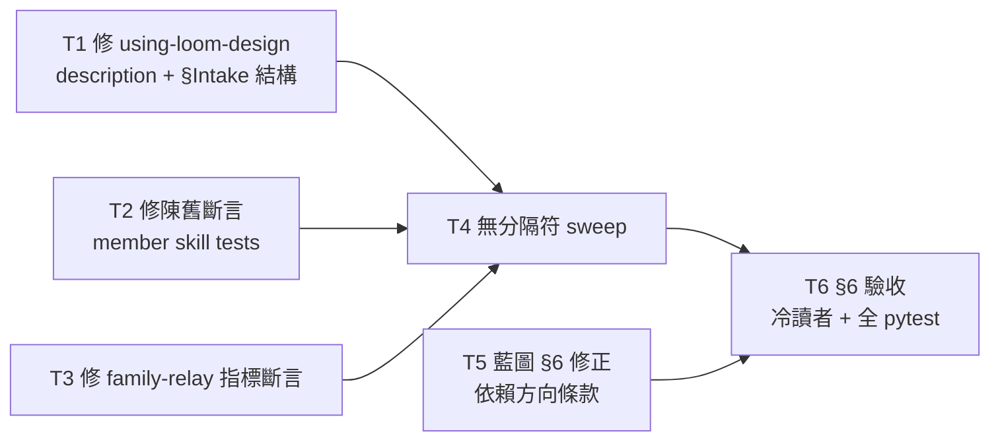

# Plan: loom-design merge — part 3 (收尾驗收)

Source brief: docs/loom/plans/2026-08-16-loom-design-merge-plan.md（遷移藍圖，§5 S8-S9 + §6 驗收清單）
Goal: 清掉 part-1 併 router 遺留的 18 個內容契約缺口，補完無分隔符陳舊名 sweep，跑完藍圖 §6 的六條驗收，讓 6→2 遷移可以收工。
Stage: finishing
Total tasks: 6
Critical-path depth: 3 (≤5)
Execution order: parallel-where-possible
Plan-document-reviewer verdict: PASS (2026-08-16, round 2)

## Task-flow diagram

## Open Questions

N/A — no unresolved question: part-2 執行期已把三類缺口定性完畢（內容缺口 8 個 / 陳舊斷言 10 個 / 藍圖事實錯誤 1 條），處置方向各自明確，無待拍板決定。

## Task 1 — 修 using-loom-design 的 description 與 §Intake 結構
- Description: Fix the merged router's SKILL.md against the three entry-skill guards that survived the 4→1 merge. Three defects: (a) the `description` frontmatter renders to 697 chars against a 250-char house hard cap (target ≤150) — this is a real breakage, not a style nit: an over-budget description is silently dropped by the harness and the skill stops auto-triggering; (b) `## §Intake` must be the FIRST section, before the `<EXTREMELY-IMPORTANT>` block (currently at offset 718 vs 270); (c) §Intake's steps must name `using-loom-design` in the PRINCIPLES.md-absent recommendation and redirect UI/UX + spec asks by name, and the description must carry the literal phrase `family entry`. Rewrite the description to ≤250 chars keeping the four stations' trigger vocabulary (discovery / principles / interface / spec, incl. the zh/ja trigger phrases) and reorder the sections. Do NOT weaken any guard.
- Module: loom-design/skills/using-loom-design/
- Files touched: loom-design/skills/using-loom-design/SKILL.md
- Context paths:
  - loom-design/scripts/interface/test_entry_intake.py (4 failing assertions — the §Intake structure contract)
  - loom-design/scripts/spec/test_spec_entry_skill.py (2 failing — description cap + step-2 redirect)
  - loom-design/scripts/principles/test_principles_entry_skill.py (2 failing — description cap + entry framing)
- Acceptance:
  - RED: `python3 -m pytest loom-design/scripts/interface/test_entry_intake.py loom-design/scripts/spec/test_spec_entry_skill.py loom-design/scripts/principles/test_principles_entry_skill.py -q` reports 8 failed
  - GREEN: the same command passes with 0 failed; `python3 -c "import re,sys; t=open('loom-design/skills/using-loom-design/SKILL.md').read(); d=re.search(r'description: \|\n(.*?)\nversion:', t, re.S).group(1); print(len(' '.join(d.split())))"` prints ≤250
- Dependencies: none
- Independent: true
- Brief item covered: 藍圖 §5 S2（併 router）的收尾——合併後 router 未滿足各站原有的 entry 契約
- Status: done(726f6689)
- Gloss: 合併後的設計側入口 skill 描述超標 2.8 倍（會被系統靜默丟棄而失效）＋章節順序錯，修好它

## Task 2 — 修 member skill 測試裡的陳舊名斷言
- Description: Three test files assert plugin/skill names that no longer exist — the SKILL.md content was correctly re-pointed in part 2, but these assertions were missed because the stale name sits inside an `assert 'literal' in text` argument. Re-point the expected strings: test_knowledge_triage.py expects `using-loom-discovery` (content now says `using-loom-design`) in the domain-convention punt route and the cross-severing guard; test_product_principles_skill.py has FOUR failures — `using-loom-discovery` expected in the tripwire route and in the §Headless remedy, plus two visual-lens tests (test_visual_lens_is_single_axis_a_round, test_question_sets_visual_lens_is_single_axis_a_round) expecting `loom-interface-design`; test_canon_references.py expects `loom-interface-design` as the design-station pointer in canon-design-visual.md (now `loom-design`) — the same defect class as those two. Verify each expectation against the actual SKILL.md/reference text before editing — where the content genuinely still names a station rather than the plugin, keep the station word and change only the plugin prefix.
- Module: loom-design/scripts/principles/
- Files touched: loom-design/scripts/principles/{test_knowledge_triage.py,test_product_principles_skill.py,test_canon_references.py}
- Context paths:
  - loom-design/skills/product-principles/references/knowledge-triage.md (the asserted content)
  - loom-design/skills/product-principles/SKILL.md (the tripwire + §Headless text)
  - loom-design/skills/product-principles/references/canon-design-visual.md (the design-station pointer)
- Acceptance:
  - RED: `python3 -m pytest loom-design/scripts/principles/test_knowledge_triage.py loom-design/scripts/principles/test_product_principles_skill.py loom-design/scripts/principles/test_canon_references.py -q` reports 7 failed
  - GREEN: the same command passes with 0 failed, and `grep -cE 'using-loom-(discovery|product-principles|interface-design|spec)|loom-interface-design' loom-design/scripts/principles/*.py` returns 0
- Dependencies: none
- Independent: true
- Brief item covered: 藍圖 §4 (d) CI/tests（~60 個斷言更新）的漏網部分
- Status: done(95800354)
- Gloss: 三個測試還在找已經改掉的舊名字，內容是對的、斷言過時，改斷言

## Task 3 — 修 family-relay 指標斷言的路徑前綴
- Description: test_family_relay.py's `test_design_side_pointers` asserts the bare substring `family-relay.md §Family relay discipline` appears in each design-side entry SKILL.md. The merged router writes the pointer with its new full path — `loom-code/hooks/family-relay.md §Family relay discipline` — which the bare-substring check does not match, and the test is parameterized over the FOUR old station names (spec / interface-design / product-principles) that no longer have separate routers. Re-point the parameterization to the single merged router and make the pointer assertion match the path-qualified form. Keep the test's intent intact: every design-side entry must point at the relay SSOT rather than copy it.
- Module: loom-design/scripts/pipeline/
- Files touched: loom-design/scripts/pipeline/test_family_relay.py
- Context paths:
  - loom-design/skills/using-loom-design/SKILL.md (the actual pointer text, §Intake)
  - loom-code/hooks/family-relay.md (the SSOT the pointer targets)
- Acceptance:
  - RED: `python3 -m pytest loom-design/scripts/pipeline/test_family_relay.py -q` reports 3 failed
  - GREEN: the same command passes with 0 failed
- Dependencies: none
- Independent: true
- Brief item covered: 藍圖 §4 (d) CI/tests——4 個 router 併 1 後，per-station 參數化失效
- Status: done(726f6689)
- Gloss: 這個測試按「4 個設計站各有一個 router」參數化跑，併成 1 個後要改成單一目標

## Task 4 — 無分隔符陳舊名 sweep
- Description: part 2's inventory grep used `loom-(…)(:|/)` — it only catches names followed by a colon or slash, and silently missed prose forms like "the `loom-spec` change-folder". That blind spot cost a full pytest round to discover (test_spec_to_code_wiring.py asserted a renamed section heading). Sweep the remaining prose form across executable surfaces with `grep -rnE 'loom-(spec|pipeline|discovery|interface-design|product-principles)[ `.,)]'` over loom-code/, loom-design/, scripts/, .github/, .claude/, AGENTS.md, CLAUDE.md. For each hit decide: a live reference (a section name, a skill name, a plugin the reader is told to use) gets re-pointed; a historical statement (a dated note, a "originally §…" provenance line, a CHANGELOG entry) stays. Do NOT touch docs/loom/ prose, CHANGELOGs, or */research/ — the blueprint's §4 safe zone.
- Module: repo-wide (executable surfaces only)
- Files touched: determined by the sweep — expected in loom-code/skills/, loom-code/scripts/, loom-design/skills/, loom-design/scripts/, loom-design/examples/
- Context paths:
  - docs/loom/plans/2026-08-16-loom-design-merge-part-2.md §Notes（盤點盲點那條，記錄了這個 grep 缺口的來由）
  - The part-2 rename map (same Notes section)
- Acceptance:
  - RED: `grep -rlE 'loom-(spec|pipeline|discovery|interface-design|product-principles)[ `.,)]' loom-code/skills loom-code/scripts loom-design/skills loom-design/scripts loom-design/examples AGENTS.md CLAUDE.md 2>/dev/null | grep -v CHANGELOG | grep -v '/research/'` returns hits
  - GREEN: the same command returns only files whose remaining hits are verified-historical (each one named in the report with its reason); `python3 -m pytest loom-code/scripts/ -q` passes and the five loom-design per-directory suites hold at their post-T1/T2/T3 failure counts (no regression)
- Dependencies: Tasks 1, 2, 3 complete first
- Independent: false
- Brief item covered: 藍圖 §5 S8 docs sweep（只改可執行引用）
- Status: done(614637ca)
- Gloss: 補掃「舊名後面接空白」這種散文寫法——part 2 的搜尋式抓不到，害過一次

## Task 5 — 修正藍圖 §6 的依賴方向驗收條款
- Description: The blueprint's §6 acceptance row reads "依賴方向：6 向互指 → 單向 loom-design → loom-code（grep 驗證無反向）". Measured against the shipped layout this is backwards and would fail a correct migration: loom-code legitimately references loom-design in 20 files — it consumes the spec station's validator (`check_scenario_coverage.py` → `loom-design/scripts/spec/validate_spec_output.py`), routes design-shaped asks onward (`brainstorming` → `loom-design:spec-expansion`), and `ui-verification` consumes the design artifacts (`loom-design:design-critic` / `interaction-flows`). The real data flow is design → code, so a code-side reference to a design artifact IS the correct direction. Rewrite the row to state the actual invariant: exactly two loom plugins, no reference to any of the 5 retired plugin names, and loom-design must not depend on loom-code's internals (the one direction that WOULD be a cycle — `loom-design` referencing `loom-code/skills/*` beyond the family hooks it legitimately shares). Record the correction as a dated blueprint amendment note, not a silent edit.
- Module: docs/loom/plans/2026-08-16-loom-design-merge-plan.md
- Files touched: docs/loom/plans/2026-08-16-loom-design-merge-plan.md
- Context paths:
  - The 20 reverse-reference files (enumerate with `grep -rlE 'loom-design(:|/)' loom-code/ --include='*.md' --include='*.py' | grep -v CHANGELOG | grep -v '/research/'`)
- Acceptance:
  - RED: `grep -n '單向 loom-design → loom-code' docs/loom/plans/2026-08-16-loom-design-merge-plan.md` returns a hit
  - GREEN: that grep returns nothing; the §6 table's dependency row states the two-plugin + no-retired-names + no-loom-design→loom-code-internals invariant, and a dated amendment note names the measurement (20 files, three legitimate consumption patterns) that overturned the original wording
- Dependencies: none
- Independent: true
- Brief item covered: 藍圖 §6 驗收清單（依賴方向那列）
- Status: done(95800354)
- Gloss: 藍圖把資料流方向寫反了——設計產物本來就該被寫程式那側消費，改成真正該守的條件

## Task 6 — 跑完藍圖 §6 六條驗收
- Description: Run the blueprint's §6 acceptance list end to end and record each row's measured result in the part-3 Notes. Six rows: (1) cold-reader routing — dispatch a fresh-context agent that sees only the 2-plugin layout and check it routes a product-idea ask to the design side and a code-change ask to loom-code; (2) driver drift test passes; (3) full pytest green — run the five loom-design suites per-directory (a single combined invocation is architecturally impossible: `test_knowledge_triage.py` and `test_mint_critic_verdict.py` each exist in two directories and collide at collection without `__init__.py`, per loom-siblings-ci.yml) plus `loom-code/scripts/` and repo-root `scripts/`; (4) loom skill count = 24; (5) per-session injected bytes below the ~9.5K baseline; (6) the corrected dependency-direction invariant from Task 5. Any row that cannot reach its target is reported with the measured number and the reason — never marked passed on a partial result.
- Module: docs/loom/plans/2026-08-16-loom-design-merge-part-3.md (the Notes acceptance record)
- Files touched: docs/loom/plans/2026-08-16-loom-design-merge-part-3.md
- Context paths:
  - docs/loom/plans/2026-08-16-loom-design-merge-plan.md §6（六條驗收的目標值）
  - The corrected §6 row from Task 5
- Acceptance:
  - RED: the part-3 Notes carry no §6 acceptance record
  - GREEN: all six rows recorded with measured values; rows 2-5 hit their targets (drift test passes; the five loom-design suites + loom-code/scripts + scripts/ all report 0 failed; skill count is exactly 24; injected bytes < 9500); row 1's cold-reader verdict is recorded verbatim; row 6 cites the Task-5 invariant
- Dependencies: Tasks 1, 2, 3, 4, 5 complete first
- Independent: false
- Brief item covered: 藍圖 §5 S9 驗收、§6 驗收清單全表
- Status: done(d4753776)
- Gloss: 六條驗收逐條實測記錄，不到標的照實寫數字與原因

## §6 驗收記錄（Task 6，2026-08-17 實測）

| # | 檢查 | 目標 | 實測 | |
|---|---|---|---|---|
| 1 | 冷讀者路由 | 全新 context 只憑 2-plugin 佈局正確路由 | 三題全對（見下） | ✅ |
| 2 | driver drift test | 通過（重建 byte-identical） | `1 passed` | ✅ |
| 3 | 全 pytest | 綠 | **2463 passed / 0 failed**（loom-code 1262、scripts 273、pipeline 225、interface 181、discovery 75、spec 153、principles 294） | ✅ |
| 4 | loom skill 清單 | 24 | 24（loom-code 14 + loom-design 10） | ✅ |
| 5 | 每 session 注入 bytes | < ~9500 基線 | 9213（router-card 2794 + reception 5937 + visual-defaults 482） | ✅ |
| 6 | 依賴不變量（T5 改寫後） | 2 plugin／無退役名／loom-design 不依賴 loom-code 內部 | marketplace 恰 `['loom-code','loom-design']`；可執行面退役名殘留僅 fixture 一處 | ✅ |

**Row 1 冷讀者逐題結果**（fresh-context agent，只准讀 repo 判斷，禁止臆測舊佈局）：
- Q1「產品點子＋不確定使用者需求＋不知值不值得做」→ 正確答出 `using-loom-design`（plugin `loom-design`），並正確判斷本題同時命中兩個 member（`user-insights` 先、`business-value` 可跳過且可重入），引用 §Discovery station 原文佐證。
- Q2「function 有 bug 要修＋補測試」→ 正確答出 `using-loom-code`（plugin `loom-code`），並自行找到設計側的 negative guard（bug fix 直接跳過設計站），續接 `systematic-debugging` + `tdd-iron-law`。
- Q3 盤點 → 從 `marketplace.json` 正確導出恰兩個 loom plugin 與三個 router（`using-loom-code`／`using-loom-design`／`using-loom-pipeline`）。

**Row 1 冷讀者另外抓到兩件事（皆已處置）**：
1. **五個舊 plugin 目錄的空殼還在磁碟上** — `git rm` 只刪檔案，git 不追蹤空目錄，故 `loom-{discovery,product-principles,interface-design,spec,pipeline}/` 的空目錄樹殘留（`git ls-files` 皆 0 檔）。冷讀者把它們誤讀成「未完成的 plugin」。已 `rmdir` 清除。**教訓：`git rm -r` 後要另外檢查空目錄殼**，否則本機工作區與 clone 出來的樣子不一致。
2. **harness skill 清單仍顯示舊 plugin 前綴**（`loom-discovery:business-value`、`loom-pipeline:loom-memory` 等）與磁碟現況矛盾。這是 **plugin cache 陳舊，非 repo 缺陷**——marketplace 來源是 GitHub，本分支尚未 merge。部署面待辦：merge 後跑 `plugin update` → `/reload-plugins` → 驗 cache 目錄版本（見 auto-memory `feedback_reload_plugins_silently_stale_three_step_sync`）。

**Row 6 殘留說明**：可執行面唯一殘留是 `loom-design/scripts/pipeline/fixtures/fixture_session_tail.jsonl` — 舊名在歷史 session 的 user-message 內容欄位裡，屬測試素材的真實記錄，改了反而破壞素材保真度。`.claude/handoffs/*.md`（歷史交接記錄）比照 CHANGELOG 列入安全區未動。

**Row 6 執行期補修**：查殘留時另外找到兩處**活註解指向失效路徑**（非歷史記述）：`driver_40_seg2.js:51` 註解指 `loom-spec/skills/completeness-critic/SKILL.md`、`.claude/hooks/check-memory-store-integrity.sh:24` 與其 test 寫 `loom-pipeline:loom-memory`。已修並重建 driver asset，drift test 通過。

## Notes

- **18 個殘留失敗的三分法（part-2 執行期定性）**：8 個打 `using-loom-design/SKILL.md` 的內容契約（T1，真缺陷——description 超標會讓 skill 靜默失效）、10 個是測試斷言追不上已正確改名的內容（T2 七個 + T3 三個，測試該改不是內容該改）。分界判準：**先讀被斷言的內容檔**，內容已對＝改斷言；內容真缺＝改內容。
- **description 超標是真故障不是風格問題**：697 字元對 250 上限。實證見 auto-memory `feedback_skill_list_description_budget_eviction.md` — per-skill 描述超過預算會被 harness 靜默丟棄，skill 退化成 name-only 無法 auto-trigger。T1 因此列為缺陷修復而非潤稿。
- **pytest 不能單次跑全 loom-design**：`test_knowledge_triage.py`（interface + principles）與 `test_mint_critic_verdict.py`（interface + spec）各有兩份同名檔，無 `__init__.py` 時 pytest collection 直接 import file mismatch 掛掉。這是 `.github/workflows/loom-siblings-ci.yml` 明文的既定架構（「The suites MUST run as separate pytest invocations」），不是待修缺陷——所有 acceptance 都按目錄分開跑。
- **part-2 帶過來的三條執行期教訓**（已寫入 part-2 Notes，此處只留指標）：路徑深度迴歸（搬深一層 → 所有 `parents[N]` 短一層，出現 3 次，grep 抓不到）、無分隔符陳舊名盲點（T4 處理）、`using-loom-pipeline` member-skill 子字串誤報（精確 regex `(^|[^a-z-])loom-…` 排除）。共同結論：**GREEN grep 空是必要非充分條件，全量 pytest 才是真閘門**。
- **Header verdict stamped（2026-08-16, round 2）** — stamping the verdict, closed-list amendment, no re-review。
- **T4 對 T3 的依賴是保守而非必要（reviewer round-2 note）**：實測 T4 的 sweep grep 命中 T1 的檔與 T2 的三檔，但**不**命中 T3 的 `test_family_relay.py`。保留這條邊是刻意的——T3 改的是 router 指標字串的比對方式，若它順手動到 SKILL.md 側的措辭，sweep 跑在後面才驗得到；成本是 depth 多算一階，無實質代價。
- **T4 排在 T1-T3 之後（reviewer round-1 Check 14）**：T4 的 sweep RED grep 實測會命中 `using-loom-design/SKILL.md:3`（T1 的檔）與 `test_{knowledge_triage,product_principles_skill,canon_references}.py`（T2 的三檔）的同一批行——四個 task 同標 `Independent: true` 平行跑會寫同一行造成競態。改法選「T4 依賴 T1-T3」而非「sweep 指令加排除條件」：後者要在 grep 尾巴堆 `grep -v`，且排除掉的檔案若在 T1/T2 改完後仍有殘留就永遠掃不到；前者讓 sweep 跑在乾淨的後置狀態，順帶驗證 T1-T3 的修改沒留下新的散文舊名。critical-path depth 因此 2 → 3。
- **安全區不動**（藍圖 §4）：root READMEs、`docs/loom/` 散文（143 檔帶舊名，屬歷史存檔）、CHANGELOGs、`*/research/`。T4 的 sweep 明文排除。
- **part-2 完成狀態**：9 個 task 全 done（T1 42c24145 / T2 040e48f8 / T3 e1df33bb / T4 641636ef / T5 34cc6b8e / T6 a47b44a6 / T7 7eac251b / T8 e3d2ae51 / T9 a4b5b53b），marketplace 已 6→2、5 個舊 plugin 目錄已 git rm、skill 數已達標 24。
