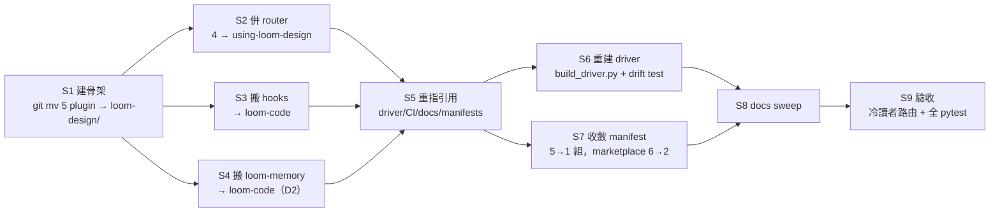

# Plan: loom-design merge (6 plugins → 2)

**Source brief**: `docs/loom/research/2026-08-15-loom-plugin-consolidation.md`（vault 研究筆記，Option B 收斂 2 個）
**Goal**: 把 4 個設計側 plugin（discovery / product-principles / interface-design / spec）＋ loom-pipeline 併成單一 `loom-design`；loom-code 原封不動並承接家族基礎設施。依賴方向收斂為單向：`loom-design → loom-code`。
**Stage**: planning（本文件是遷移藍圖，非可執行 SDD plan；執行時再拆成 writing-plans 格式）
**Status**: 定案（D1/D2/D3 全數拍板）— 執行時每步拆成 writing-plans 格式走正常 git flow

## 0. 目標形（TL;DR）

| 維度 | 現狀 | 目標 |
|---|---|---|
| Plugin 數 | 6 | **2**（loom-code、loom-design） |
| Skill 數 | 27 | **24**（4 個設計 router 併 1） |
| loom-design skill 數 | — | **10**（1 router + 9 member） |
| 依賴方向 | 6 個 plugin 互相引用 | **單向**：loom-design → loom-code |
| 家族 hooks | loom-pipeline/hooks/ | **loom-code/hooks/**（loom-code 依賴它們） |
| loom-memory | loom-pipeline | **loom-code**（已定，§3 D2） |
| Marketplace entries | 6 | **2** |

**不變的**：`loom-code:*` 全部 13 個 skill 名與 5 個 agentType（440 次派遣的依賴）——熱路徑零衝擊。

## 1. 目標結構

### 1.1 loom-design（新 plugin，設計方法論 + 指揮）

```
loom-design/
├── skills/
│   ├── using-loom-design/        # ← 新，4 個 router 合併（~70% skeleton 重疊）
│   ├── using-loom-pipeline/      # 指揮（自 loom-pipeline 原樣搬入）
│   ├── business-value/           # 自 loom-discovery
│   ├── user-insights/            # 自 loom-discovery
│   ├── product-principles/       # 自 loom-product-principles
│   ├── design-system/            # 自 loom-interface-design
│   ├── interaction-flows/        # 自 loom-interface-design
│   ├── design-critic/            # 自 loom-interface-design
│   ├── spec-expansion/           # 自 loom-spec
│   └── completeness-critic/      # 自 loom-spec
├── scripts/                      # validate_*output.py + mint_critic_verdict.py 去重後
├── examples/                     # spec 的 change-folder 範例
├── assets/                       # loom-pipeline.js（重建後）
├── .claude-plugin/plugin.json    # 1 組 manifest（原 5 組）
└── .codex-plugin/plugin.json    # codex 鏡射（含 interface block）
```

### 1.2 loom-code 新增（家族基礎設施）

```
loom-code/
├── hooks/
│   ├── family-reception.md       # 自 loom-pipeline/hooks/（搬遷，非廢除）
│   ├── family-relay.md           # 自 loom-pipeline/hooks/
│   ├── plain-relay.md            # 自 loom-pipeline/hooks/
│   ├── lang_detect.py            # 自 loom-pipeline/hooks/
│   ├── language-anchor.py        # 自 loom-pipeline/hooks/
│   ├── language-stop-check.py    # 自 loom-pipeline/hooks/
│   ├── session-start             # 與現有 session-start 合併
│   └── hooks.json                # 合併註冊
└── skills/loom-memory/           # 自 loom-pipeline（§3 D2 已定）
```

**理由**：Agent 3 實證 loom-code 用 6 個相對路徑引用 family hooks（`hooks/family-relay.md:117 → ../../loom-code/...`）。hooks 是家族連接組織，放永遠開著的 loom-code 才做到「一份、全家指向」。筆記原案「廢除 reception 卡」修正為「搬遷」——loom-code 依賴它，不能廢。

## 2. 改名對照（引用重指的核心）

| 舊（plugin:skill） | 新（plugin:skill） |
|---|---|
| `loom-discovery:using-loom-discovery` | `loom-design:using-loom-design` |
| `loom-interface-design:using-loom-interface-design` | `loom-design:using-loom-design` |
| `loom-spec:using-loom-spec` | `loom-design:using-loom-design` |
| `loom-product-principles:using-loom-product-principles` | `loom-design:using-loom-design` |
| `loom-discovery:business-value` | `loom-design:business-value` |
| `loom-discovery:user-insights` | `loom-design:user-insights` |
| `loom-interface-design:design-system` | `loom-design:design-system` |
| `loom-interface-design:interaction-flows` | `loom-design:interaction-flows` |
| `loom-interface-design:design-critic` | `loom-design:design-critic` |
| `loom-spec:spec-expansion` | `loom-design:spec-expansion` |
| `loom-spec:completeness-critic` | `loom-design:completeness-critic` |
| `loom-product-principles:product-principles` | `loom-design:product-principles` |
| `loom-pipeline:using-loom-pipeline` | `loom-design:using-loom-pipeline` |
| `loom-pipeline:loom-memory` | `loom-code:loom-memory` |
| `loom-code:*`（13 skill + 5 agentType） | **不變** |

**member skill 保持原名**，只改 plugin 前綴——blast radius 最小化。

## 3. 三個設計決定（待 kouko 拍板）

| # | 決定 | 選項 | 建議 |
|---|---|---|---|
| D1 | 家族 hooks 去處 | (a) 搬進 loom-code；(b) 留 loom-design 當新 hub | **(a)**——loom-code 依賴它們，放 loom-code 才自足 |
| D2 | loom-memory 歸屬 | (a) loom-code（家族資產）；(b) loom-design（筆記原案） | **(a) 已定**——家族實務記憶，使用以 loom-code 為主 |
| D3 | member skill 改名 | (a) 保持原名；(b) 加設計側前綴 | **(a)**——改名只影響前綴，member 名不動 |

## 4. 引用重指（blast radius）

掃描結果：**~380 檔引用 5 個 plugin 名，~160 檔會斷**。分類：

| 類別 | 檔數 | 會斷 | 處理 |
|---|---|---|---|
| (g) driver + 編譯產物 | 11 | **11** | 重建 `assets/loom-pipeline.js`（不可手改） |
| (d) CI / tests | ~134 | ~60 | 更新斷言（含 `test_pipeline_skill_contract.py:45` 的 `loom-pipeline: N/A` 字串） |
| (e) manifests | 12 | **12** | 5 組 → 1 組；marketplace 6 → 2 |
| (b) loom-code | ~26 | ~20 | 重指 family hooks 相對路徑 + 散文引用 |
| (a) 5 plugin 內部 | ~55 | ~40 | 內部互指改 `loom-design:` |
| (c) docs/ | 226 | ~13 | 只改可執行引用；`docs/loom/` 散文屬存檔，可留 |
| (f) root 散文 | 4 | **4** | 改 |

**安全區**：root READMEs、`docs/loom/` 散文、CHANGELOGs（歷史記錄，不回溯改）。

**driver 內嵌名**（`driver_*.js` 源碼，改後重建）：
- 11 個 `loom-*` 限定名 → `loom-design:*`（`loom-code:*` 4 個 agentType 不變）
- `driver_40_seg2.js:127` 硬編碼 `loom-spec/scripts/validate_spec_output.py` → `loom-design/scripts/validate_spec_output.py`

## 5. 分步執行

> 執行時每步拆成 writing-plans 格式（RED/GREEN acceptance）。以下為順序與依賴。



- **S1 建骨架**：`git mv` 保留歷史；5 個 plugin 目錄併入 `loom-design/`，subfolder 扁平化（skill 結構規範：subfolder 內不可再嵌 subfolder）。
- **S2 併 router**：4 個 `using-loom-*` 併 1，骨架去重（~70% 重疊）；`using-loom-pipeline` 不併（是指揮不是 router）。
- **S3 搬 hooks**：family hooks + 語言 hooks → loom-code；loom-code 的 6 個相對路徑引用重指；hooks.json 合併註冊。
- **S4 搬 loom-memory**：→ loom-code（D2 已定）。
- **S5 重指引用**：§4 分類逐類處理；driver 源碼改 11 個名 + 1 個路徑。
- **S6 重建 driver**：`build_driver.py`（串接 driver_00→90 → assets/loom-pipeline.js）；`test_pipeline_driver_drift.py` byte-identical 驗證。
- **S7 收斂 manifest**：5 組雙 manifest → 1 組；marketplace.json 6 → 2；codex interface block 保留。
- **S8 docs sweep**：只改可執行引用（§4 (c) 的 13 檔）。
- **S9 驗收**：§6。

## 6. 驗收清單

| 檢查 | 基線 | 目標 |
|---|---|---|
| 冷讀者路由測試 | — | 全新 context agent 只憑 2-plugin 佈局正確路由「產品點子→設計站」與「改 code→loom-code」 |
| driver drift test | — | `test_pipeline_driver_drift.py` 通過（重建 byte-identical） |
| 全 pytest | — | 綠（含更新後的 ~60 個斷言） |
| loom skill 清單 | 27 | **24**（router 4→1） |
| 每 session 注入 bytes | ~9.5K | 下降（reception 卡合併、router 卡併 1） |
| 依賴方向 | 6 向互指 | 單向 loom-design → loom-code（grep 驗證無反向） |

## 7. 風險與反轉條件

**風險**：
- 改名 blast radius ~160 檔——可控（§4 分類逐類處理），但需一次做完，中途半套會壞。
- loom-code 的 6 個 family-hooks 相對路徑引用——S3 必須與 S5 同步，否則 loom-code 當場斷。
- driver 重建必須 byte-identical——改源碼後跑 drift test，不可手改編譯產物。
- `test_pipeline_skill_contract.py:45` 斷言 `loom-pipeline: N/A` 字串——改名後要同步更新。
- codex manifest 的 interface block（category/brandColor）——收斂時保留。

**反轉條件**（出現任一，改變建議）：
- 設計側工作流用量起飛（未來 30 天 ≥5 session 實際呼叫設計站）→ 先跑真實 pipeline 拿行為資料再整併。
- 出現真實子集消費者（只想裝 loom-spec 不裝其他）→ CRP 反對合併。
- Claude Code 推出 extension-pack 機制 → 用 pack 解安裝 UX，合併必要性下降。

## 8. 資料來源

- 研究筆記：`docs/loom/research/2026-08-15-loom-plugin-consolidation.md`（vault，§7 遷移清單為本計畫骨架）
- 盤點（Agent 1）：5 plugin / 14 skill 結構；loom-pipeline 為 hub；knowledge-triage / mint_critic_verdict / validate_*output 三模式重複
- 引用掃描（blast radius）：~380 檔 / ~160 斷，§4 分類
- 基礎設施（Agent 3）：4 router ~70% 重疊可併；family hooks 必須進 loom-code；driver 嵌 11 名；PR #696 已去重家族規則（「4+4+5 重複」已過時）
- 用量（本機掃描，`loom-usage-scan.py`）：loom-code 352 skill / 66 session / 3124 agent；設計側有真實使用（discovery 8/5、spec 12/4、pipeline 58/56）——**與筆記「0 呼叫」不同**（筆記數據來自另一台機器）
