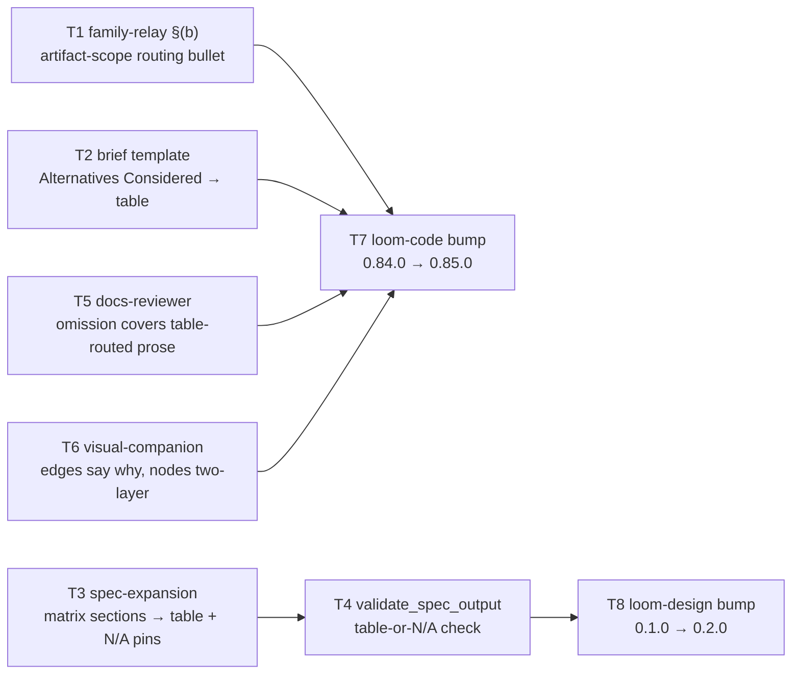

# Plan: artifact-layer table routing

**Source brief**: docs/loom/specs/2026-08-17-artifact-table-routing.md
Goal: `family-relay.md` §(b) carries one added routing bullet that states
    the artifact-layer scope of the existing fork→table rule; the brief's
    `## Alternatives Considered` becomes a fill-or-declare comparison table
    and spec-expansion's two matrix sections gain a validator-checked
    markdown-table form; docs-reviewer's omission row names comparison
    prose in a table-routed section; `visual-companion.md` gains the
    diagram-semantics rule (edges say why, nodes carry title + reason);
    loom-code and loom-design each ship it as one version bump.
Stage: finishing
Steps:
  1. 內容改動五路並行：規則一句、brief 表格化、spec 兩矩陣表格化、審查提示補缺、圖語意規則
  2. validator 接上表格檢查＋loom-code 0.85.0 出貨（codex 鏡射＋changelog）
  3. loom-design 0.2.0 出貨（codex 鏡射＋changelog）
**Total tasks**: 8
**Critical-path depth**: 3 (≤5 ✓)
**Execution order**: parallel-where-possible
**Plan-document-reviewer verdict**: PASS (2026-08-17, round 1, 16/16)

## Task-flow diagram

Caption: a pure dependency DAG — edges are bare by design (no causal why on a build-order edge); the version-bump tasks join after their plugin's content tasks.



## Open Questions

N/A — no unresolved question: the brief's one fork (loom-design leg in or out) is settled in its Decision, and the docs-reviewer reach limit is recorded there and in Notes below.

## Task 1 — family-relay §(b) 加「文件層同樣適用」分流條目

- **Description**: In `loom-code/hooks/family-relay.md`, inside `### (b) Visual defaults` (`family-relay.md:94-103`), insert Pin A VERBATIM as a new bullet immediately after the existing first bullet (the "≥2 options at a fork → a markdown comparison table" bullet, `:96-97`) and before the `ascii-graph-toolkit` bullet (`:98`). Do not rename the heading, do not touch the other three bullets, do not touch §(a)/(a2)/(c)/(d) — `session-start:81-87` extracts §(b) at runtime by the `### (b)` → `### (c)` heading range and `loom-design/scripts/pipeline/test_family_relay.py:246,331` pins the heading literal. Write the failing test FIRST (TDD).
- **Module**: `loom-code/hooks/family-relay.md`
- **Files touched**: `loom-code/hooks/family-relay.md`, `loom-code/scripts/test_family_relay_artifact_routing.py` (NEW)
- **Context paths**:
  - /Users/kouko/.supacode/repos/monkey-skills/loom-doc-container/loom-code/hooks/family-relay.md
  - /Users/kouko/.supacode/repos/monkey-skills/loom-doc-container/loom-code/hooks/session-start (§(b) runtime extraction, lines 75-92 — read, do not edit)
  - /Users/kouko/.supacode/repos/monkey-skills/loom-doc-container/loom-design/scripts/pipeline/test_family_relay.py (existing pins on this file — must stay green)
  - /Users/kouko/.supacode/repos/monkey-skills/loom-doc-container/loom-code/scripts/test_plan_diagram_slot.py (house style for a text-pin test)
  - /Users/kouko/.supacode/repos/monkey-skills/loom-doc-container/docs/loom/plans/2026-08-17-artifact-table-routing.md (§Pinned wording, Pin A)
- **Acceptance**:
  - **RED**: `loom-code/scripts/test_family_relay_artifact_routing.py::test_visual_defaults_carries_artifact_scope_bullet` fails on the current file (asserts Pin A's full phrases "The same fork rule binds written artifacts", "one load-bearing column stating chosen / rejected-because", and "Shape-based, never count-based" each `count()==1` in the text between `### (b) Visual defaults` and `### (c)`; asserts `### (b) Visual defaults` `count()==1` in the whole file).
  - **GREEN**: new test passes; `python3 -m pytest loom-design/scripts/pipeline/test_family_relay.py -v` green (heading + anti-copy pins survive); full suite `python3 -m pytest loom-code/scripts/ scripts/ .claude/hooks/ -v` green.
- **Dependencies**: none
- **Independent**: true
- **Brief item covered**: BI-1; also BI-6 (the umbrella outcome — SSOT sentence here, template binding in Tasks 2/3/6, reviewer dimension in Task 5, validator check in Task 4, text pins in every task).
- **Status**: done(3f43c6a6)
- **Gloss**: 家族唯一的分流規則本體多一條：比較型內容在落盤文件裡也進表格——所有指向 §(b) 的模板一次讀到，session 預載也自動帶上。

## Task 2 — brief 模板的「替代方案」區段改為 fill-or-declare 比較表

- **Description**: In `loom-code/skills/brainstorming/references/handoff-brief-format.md`: (1) in the `### `## Alternatives Considered`` spec entry (`:88-92`), replace the sentence "Format: numbered list, each with a one-sentence rejection rationale." with Pin B transcribed VERBATIM (keep the surrounding sentences about Axis 4 and the proposal-/complexity-critique paste-in); (2) in the §Optional sections preamble (`:86`), change "except `## Diagrams`, which is fill-or-declare (see its entry)" to "except `## Diagrams` and `## Alternatives Considered`, which are fill-or-declare (see their entries)"; (3) in the §Template skeleton (`:190-192`), replace the two numbered-list lines under `## Alternatives Considered` with the Pin B-2 table skeleton VERBATIM. Then in `loom-code/skills/brainstorming/SKILL.md:192`, change "Optional but recommended sections: Alternatives Considered (Axis 4), What Becomes Obsolete (Axis 5), Open Questions." to "Optional but recommended sections: What Becomes Obsolete (Axis 5), Open Questions. `## Alternatives Considered` (Axis 4) and `## Diagrams` are fill-or-declare — see `references/handoff-brief-format.md`." No other SKILL.md change. The literal "numbered list, each with a one-sentence rejection rationale" must be gone from handoff-brief-format.md. Write the failing test FIRST (TDD).
- **Module**: `loom-code/skills/brainstorming/` (one skill: its reference file + one SKILL.md sentence)
- **Files touched**: `loom-code/skills/brainstorming/references/handoff-brief-format.md`, `loom-code/skills/brainstorming/SKILL.md`, `loom-code/scripts/test_brief_alternatives_table.py` (NEW)
- **Context paths**:
  - /Users/kouko/.supacode/repos/monkey-skills/loom-doc-container/loom-code/skills/brainstorming/references/handoff-brief-format.md
  - /Users/kouko/.supacode/repos/monkey-skills/loom-doc-container/loom-code/skills/brainstorming/SKILL.md
  - /Users/kouko/.supacode/repos/monkey-skills/loom-doc-container/loom-code/scripts/test_brief_diagram_slot.py (house style + existing pins on this file — must stay green)
  - /Users/kouko/.supacode/repos/monkey-skills/loom-doc-container/loom-code/scripts/test_brief_item_ids.py (existing pins on this file — must stay green)
  - /Users/kouko/.supacode/repos/monkey-skills/loom-doc-container/docs/loom/plans/2026-08-17-artifact-table-routing.md (§Pinned wording, Pin B / Pin B-2)
- **Acceptance**:
  - **RED**: `loom-code/scripts/test_brief_alternatives_table.py::test_alternatives_considered_is_fill_or_declare_table` fails on the current file (asserts Pin B's line-prefix `N/A — no alternatives found:` `count()==1`, the column-list phrase `Alternative | Who ships it / source | Why rejected` `count()==2` — once in the spec entry, once as the template table's header row — and "numbered list, each with a one-sentence rejection rationale" ABSENT in handoff-brief-format.md); `::test_skill_md_names_alternatives_fill_or_declare` fails on the current SKILL.md (asserts the phrase "`## Alternatives Considered` (Axis 4) and `## Diagrams` are fill-or-declare" `count()==1`).
  - **GREEN**: both new tests pass; `test_brief_diagram_slot.py`, `test_brief_item_ids.py`, and the full loom-code suite (`python3 -m pytest loom-code/scripts/ scripts/ .claude/hooks/ -v`) green.
- **Dependencies**: none
- **Independent**: true
- **Brief item covered**: BI-2; also BI-7 (the numbered-list format sentence and skeleton are deleted in this task).
- **Status**: done(05fa6c01)
- **Gloss**: brief 寫手在「替代方案」這一格只能填表或明寫「無替代方案＋理由」——把分流規則綁在寫作當下的欄位上，而不是只當一句可引用的教條。

## Task 3 — spec-expansion 兩個矩陣區段明定表格形式＋釘住的 N/A 行

- **Description**: In `loom-design/skills/spec-expansion/SKILL.md`: (1) in Phase ③'s **Visible artifact** paragraph (`:293-294`, currently "emit a `## Path × edge matrix` section in `proposal.md` — the grid plus the surviving paths/edges that remain post-prune."), append Pin C-1 VERBATIM after that sentence; (2) in the `### proposal.md — additive richness` section list (`:415-418`), extend the `## Path × edge matrix` bullet with the sentence "Rendered as the markdown table Phase ③ specifies, or its pinned N/A line." and rewrite the `## Cross-object combinations` bullet's honest-empty clause — currently `when no stage is interaction-dense, its body states that honestly (e.g. "no interaction-dense stage — combinations N/A") and does **not** pad.` — to Pin C-2 VERBATIM (the "e.g." example line is replaced by the pinned line). DO NOT change any emitted section header literal (`## USM backbone`, `## OOUX object model`, `## Path × edge matrix`, `## Cross-object combinations`, `## Journey navigation`) — `validate_spec_output.py:278-286` matches whole-line headers and `test_spec_expansion_skill.py:125,301` pins the literals; do not touch the Phase ② diagram-slot block (`:223-234`, pinned by `test_spec_expansion_diagram_forms.py`). Write the failing test FIRST (TDD).
- **Module**: `loom-design/skills/spec-expansion/SKILL.md`
- **Files touched**: `loom-design/skills/spec-expansion/SKILL.md`, `loom-design/scripts/spec/test_spec_expansion_table_forms.py` (NEW)
- **Context paths**:
  - /Users/kouko/.supacode/repos/monkey-skills/loom-doc-container/loom-design/skills/spec-expansion/SKILL.md
  - /Users/kouko/.supacode/repos/monkey-skills/loom-doc-container/loom-design/scripts/spec/test_spec_expansion_diagram_forms.py (house style; existing pins — must stay green)
  - /Users/kouko/.supacode/repos/monkey-skills/loom-doc-container/loom-design/scripts/spec/test_spec_expansion_skill.py (pinned header literals — must stay green)
  - /Users/kouko/.supacode/repos/monkey-skills/loom-doc-container/docs/loom/plans/2026-08-17-artifact-table-routing.md (§Pinned wording, Pin C-1 / Pin C-2)
- **Acceptance**:
  - **RED**: `loom-design/scripts/spec/test_spec_expansion_table_forms.py::test_matrix_sections_specify_table_form_and_na_lines` fails on the current file (asserts Pin C-1's column-list phrase `Backbone step | Object | CTA | State | Lens verdict | Expected reaction` `count()==1`, Pin C-1's line-prefix `N/A — no surviving path/edge:` `count()==1`, Pin C-2's column-list phrase `Stage | Co-active objects | Joint state | Required reaction` `count()==1`, Pin C-2's line-prefix `N/A — no interaction-dense stage:` `count()==1`; asserts the old example `no interaction-dense stage — combinations N/A` ABSENT; asserts the five section-header literals above still present).
  - **GREEN**: new test passes; `test_spec_expansion_skill.py` and `test_spec_expansion_diagram_forms.py` green; full suite `python3 -m pytest loom-design/scripts/ -v` green.
- **Dependencies**: none
- **Independent**: true
- **Brief item covered**: BI-3 (the doctrine half — table form + pinned N/A lines); also BI-8 (the unspecified "grid" body wording is replaced here).
- **Status**: done(b71426bf)
- **Gloss**: spec 裡最天生就是表格的兩個「矩陣」區段，從此不能再用散文寫——寫手照欄位填表，空的就寫釘住的 N/A 行，不准湊格子。

## Task 4 — validate_spec_output 對兩矩陣區段檢查「有表格或有 N/A 行」

- **Description**: In `loom-design/scripts/spec/validate_spec_output.py`, extend `_check_path_edge_matrix_section` (`:345-353`) and `_check_cross_object_combinations_section` (`:356-364`) so that, when the section IS present, its body must contain either a markdown table (at least one table separator row matching `^\s*\|(?:\s*:?-+:?\s*\|)+\s*$` multiline) or one line starting with `N/A — ` (regex `^\s*N/A — ` multiline); otherwise append the problem string `'<header>' section in <proposal> carries neither a markdown table nor its pinned 'N/A — …' line (the section is table-routed; prose does not satisfy it)`. Keep the existing missing-section messages byte-identical. Add module-level compiled regexes `_TABLE_SEP_ROW` and `_NA_LINE` next to the `_SEC_*` constants; do not add a new check to the `CHECKS` list (the two existing functions grow). In `test_validate_spec_output.py`, update the `_write_skeleton` fixture's `## Cross-object combinations` body (`:73-74`, currently a bullet) to a two-row markdown table so the accept-path fixtures stay valid, and add three tests: prose-only `## Path × edge matrix` body rejected; prose-only `## Cross-object combinations` body rejected; a body that is exactly `N/A — no interaction-dense stage: single-stage flow` accepted. Write the failing tests FIRST (TDD).
- **Module**: `loom-design/scripts/spec/validate_spec_output.py`
- **Files touched**: `loom-design/scripts/spec/validate_spec_output.py`, `loom-design/scripts/spec/test_validate_spec_output.py`
- **Context paths**:
  - /Users/kouko/.supacode/repos/monkey-skills/loom-doc-container/loom-design/scripts/spec/validate_spec_output.py
  - /Users/kouko/.supacode/repos/monkey-skills/loom-doc-container/loom-design/scripts/spec/test_validate_spec_output.py (fixture builders `:33-100`, matrix tests `:294-330`)
  - /Users/kouko/.supacode/repos/monkey-skills/loom-doc-container/docs/loom/plans/2026-08-17-artifact-table-routing.md (§Pinned wording, Pin C-1 / Pin C-2 — the N/A prefixes the validator must accept)
- **Acceptance**:
  - **RED**: `loom-design/scripts/spec/test_validate_spec_output.py::test_path_edge_matrix_prose_body_rejected` and `::test_cross_object_prose_body_rejected` fail on the current validator (prose bodies currently pass); `::test_cross_object_na_line_accepted` is written alongside (it passes before and after — state that in the task report; RED comes from the two reject tests).
  - **GREEN**: all three pass; every pre-existing test in `test_validate_spec_output.py` green (fixture updated); `python3 loom-design/scripts/spec/validate_spec_output.py docs/loom/2026-07-12-us-sec-primary-source-layer` now exits non-zero naming both sections (expected — see Notes §Shipped change-folders), and the full suite `python3 -m pytest loom-design/scripts/ -v` green.
- **External surfaces**: none (stdlib `re` + `pathlib`, already imported)
- **Dependencies**: Task 3 completes first
- **Independent**: false
- **Brief item covered**: BI-3 (the mechanical half — validator fails on neither-table-nor-N/A; loom-design test covers both branches).
- **Status**: done(ec70b30b)
- **Gloss**: 表格規則在 spec 這一段是唯一能機械執行的地方——validator 在凍結時就擋下「該是表格卻寫成散文」，不靠人眼。

## Task 5 — docs-reviewer 的 omission 列涵蓋「該進表格卻是散文」

- **Description**: In `loom-code/agents/docs-reviewer.md`, extend the **omission** row of the dimensions table (`docs-reviewer.md:560`) by inserting Pin E VERBATIM immediately after the existing diagram-slot sentence (the one ending "…are both omissions.") and before the final "Assert only after the full-text read (rule 1)." sentence — the existing `test_docs_reviewer_diagram_omission.py:33` ordering assertion (diagram sentence before "Assert only…") must keep holding. Touch NOTHING inside distribute.py-managed marker blocks (`<!-- BEGIN … -->` / `<!-- END … -->`). Write the failing test FIRST (TDD). NOTE (behavioral-verification limit): reviewers dispatched THIS session load the cached plugin contract, not this edit — verification is static (test pin + suite), never a dispatched reviewer's self-report (docs/loom/memory/agent-contract-edits-do-not-reach-this-sessions-subagents.md). NOTE (reach): docs-reviewer reviews contract-class `.md` only (`docs-reviewer.md:330-342`) — this sentence gates templates/references, not generated `docs/**` instances; recorded in the brief's Decision and Notes below.
- **Module**: `loom-code/agents/docs-reviewer.md`
- **Files touched**: `loom-code/agents/docs-reviewer.md`, `loom-code/scripts/test_docs_reviewer_table_omission.py` (NEW)
- **Context paths**:
  - /Users/kouko/.supacode/repos/monkey-skills/loom-doc-container/loom-code/agents/docs-reviewer.md
  - /Users/kouko/.supacode/repos/monkey-skills/loom-doc-container/loom-code/scripts/test_docs_reviewer_diagram_omission.py (house style + the ordering pin that must stay green)
  - /Users/kouko/.supacode/repos/monkey-skills/loom-doc-container/loom-code/scripts/test_docs_reviewer_agent.py (existing pins — must stay green)
  - /Users/kouko/.supacode/repos/monkey-skills/loom-doc-container/loom-code/scripts/test_reviewer_carve_out_wording.py (byte-equal carve-out pin — must stay green)
  - /Users/kouko/.supacode/repos/monkey-skills/loom-doc-container/docs/loom/plans/2026-08-17-artifact-table-routing.md (§Pinned wording, Pin E)
- **Acceptance**:
  - **RED**: `loom-code/scripts/test_docs_reviewer_table_omission.py::test_omission_row_names_table_routed_prose` fails on the current file (asserts Pin E's full phrase "left as prose in a section the artifact's own template routes to a markdown table" `count()==1` in the single `**omission**` row, positioned AFTER "are both omissions." and BEFORE "Assert only after the full-text read (rule 1)").
  - **GREEN**: new test passes; `test_docs_reviewer_diagram_omission.py`, `test_docs_reviewer_agent.py`, `test_reviewer_carve_out_wording.py`, and the full loom-code suite (`python3 -m pytest loom-code/scripts/ scripts/ .claude/hooks/ -v`) green.
- **Dependencies**: none
- **Independent**: true
- **Brief item covered**: BI-4
- **Status**: done(097cb713)
- **Gloss**: 審查迴圈接上——模板與 reference 檔裡「該分流到表格的比較內容還是散文」從此算缺漏；對 docs/ 下的產出實例它管不到，這點在 brief 與 Notes 都寫明。

## Task 6 — visual-companion 加圖語意規則並重寫自己的裸箭頭範例

- **Description**: In `loom-code/skills/brainstorming/references/visual-companion.md`: (1) insert Pin D VERBATIM as a new `## Diagram semantics — edges say why, nodes carry their reason` section immediately before `## Anti-patterns` (`:109`); (2) rewrite the `### Flowchart (Axis 4 — alternatives + decision tree)` example (`:46-62`) so every edge carries a why-label in `-->|"…"|` form (e.g. `Q1 -->|"Yes — reuse the URL, no new surface"| A1`), no `-- Yes -->` / `-- No -->` bare edge remains, and every node keeps two-layer `title<br/>reason-or-cost` text (the current nodes already do; keep their content and the color note); (3) append one bullet to `## Anti-patterns`: "❌ **Bare-arrow flowchart.** Edges with no why and one-word nodes tell the reader that things connect, not why — see §Diagram semantics." Keep "ascii-graph-toolkit" and "channel-aware degradation" present (pinned by `loom-design/scripts/pipeline/test_family_relay.py:187-192`); do not touch §Channel-aware degradation or §When a diagram pays for itself. Write the failing test FIRST (TDD).
- **Module**: `loom-code/skills/brainstorming/references/visual-companion.md`
- **Files touched**: `loom-code/skills/brainstorming/references/visual-companion.md`, `loom-code/scripts/test_visual_companion_semantics.py` (NEW)
- **Context paths**:
  - /Users/kouko/.supacode/repos/monkey-skills/loom-doc-container/loom-code/skills/brainstorming/references/visual-companion.md
  - /Users/kouko/.supacode/repos/monkey-skills/loom-doc-container/loom-design/scripts/pipeline/test_family_relay.py (lines 176-192 — pins on this file that must stay green)
  - /Users/kouko/.supacode/repos/monkey-skills/loom-doc-container/loom-code/scripts/test_plan_diagram_slot.py (house style; its `:122` pointer test must stay green)
  - /Users/kouko/.supacode/repos/monkey-skills/loom-doc-container/docs/loom/plans/2026-08-17-artifact-table-routing.md (§Pinned wording, Pin D)
- **Acceptance**:
  - **RED**: `loom-code/scripts/test_visual_companion_semantics.py::test_diagram_semantics_section_present` fails on the current file (asserts the heading `## Diagram semantics — edges say why, nodes carry their reason` `count()==1`, phrases "Edge labels state the relation's why", "Node text is two-layer", and "may stay bare" each `count()==1`, and that the heading appears before `## Anti-patterns`); `::test_flowchart_example_has_no_bare_edges` fails on the current file (asserts `-- Yes -->` and `-- No -->` ABSENT and `-->|"` present inside the flowchart example's fenced block).
  - **GREEN**: both new tests pass; `python3 -m pytest loom-design/scripts/pipeline/test_family_relay.py loom-code/scripts/test_plan_diagram_slot.py -v` green; full loom-code suite (`python3 -m pytest loom-code/scripts/ scripts/ .claude/hooks/ -v`) green.
- **Dependencies**: none
- **Independent**: true
- **Brief item covered**: BI-9; also BI-10 (the bare-edge example is rewritten in this task).
- **Status**: done(5135f7e5)
- **Gloss**: 每個圖表欄位都指向的那份「怎麼畫」參考檔，從此要求箭頭寫「為什麼」、節點寫「標題＋理由」——圖才能取代旁邊那段散文，而不是多一張裝飾。

## Task 7 — loom-code 版本 0.84.0 → 0.85.0＋codex 鏡射＋changelog

- **Description**: In `loom-code/.claude-plugin/plugin.json`, replace the exact literal `"version": "0.84.0"` with `"version": "0.85.0"`. Run exactly `python3 scripts/sync_codex_manifests.py loom-code` (verified 2026-08-17: `scripts/sync_codex_manifests.py:1-12`, positional arg = plugin directory name, SSOT = `.claude-plugin/plugin.json`) and commit its output to `loom-code/.codex-plugin/plugin.json` unmodified. Insert Pin F's loom-code entry as the newest entry of `loom-code/CHANGELOG.md`, heading format copied from the current top entry (`CHANGELOG.md:8`: `## [0.84.0] — 2026-08-17 — …`). Update the shipping-version pin in `loom-code/scripts/test_docs_review_blocking_class.py:219-224` from `0.84.0` to `0.85.0` (its docstring documents per-bump rewrites — precedent `docs/loom/plans/2026-08-11-visualization-trigger-layer.md` Decision Log 2). No other changes.
- **Module**: `loom-code/.claude-plugin/plugin.json`
- **Files touched**: `loom-code/.claude-plugin/plugin.json`, `loom-code/.codex-plugin/plugin.json`, `loom-code/CHANGELOG.md`, `loom-code/scripts/test_docs_review_blocking_class.py`
- **Context paths**:
  - /Users/kouko/.supacode/repos/monkey-skills/loom-doc-container/loom-code/CHANGELOG.md (top-entry heading format)
  - /Users/kouko/.supacode/repos/monkey-skills/loom-doc-container/loom-code/scripts/test_docs_review_blocking_class.py (lines 205-226, shipping-version pin)
  - /Users/kouko/.supacode/repos/monkey-skills/loom-doc-container/scripts/sync_codex_manifests.py
  - /Users/kouko/.supacode/repos/monkey-skills/loom-doc-container/docs/loom/plans/2026-08-17-artifact-table-routing.md (§Pinned wording, Pin F)
- **Acceptance**:
  - **RED**: `grep -F '"version": "0.85.0"' loom-code/.claude-plugin/plugin.json` exits 1 before the edit; `python3 scripts/sync_codex_manifests.py loom-code --check` exits non-zero after bumping `.claude-plugin` but before the sync run; `test_docs_review_blocking_class.py`'s shipping-version test fails between the plugin.json bump and the pin rewrite.
  - **GREEN**: the grep exits 0 on BOTH `loom-code/.claude-plugin/plugin.json` and `loom-code/.codex-plugin/plugin.json`; `--check` exits 0; `grep -F '## [0.85.0]' loom-code/CHANGELOG.md` exits 0; full suite `python3 -m pytest loom-code/scripts/ scripts/ .claude/hooks/ -v` green.
- **External surfaces**: none (in-repo manifests + repo's own sync script)
- **Dependencies**: Tasks 1, 2, 5, 6 complete first
- **Independent**: true
- **Review-weight**: mechanical
- **Brief item covered**: BI-5 (loom-code half; marketplace.json carries no version fields — verified 2026-08-11 recon, still true — so no marketplace edit)
- **Status**: done(705dd7c9)
- **Gloss**: loom-code 的四處內容改動要隨 0.85.0 出貨——不 bump 的話 marketplace 更新是靜默 no-op。

## Task 8 — loom-design 版本 0.1.0 → 0.2.0＋codex 鏡射＋changelog

- **Description**: In `loom-design/.claude-plugin/plugin.json`, replace the exact literal `"version": "0.1.0"` with `"version": "0.2.0"`. Run exactly `python3 scripts/sync_codex_manifests.py loom-design` (same verified script and SSOT as Task 7) and commit its output to `loom-design/.codex-plugin/plugin.json` unmodified. Insert Pin F's loom-design entry as the newest entry of `loom-design/CHANGELOG.md`, heading format copied from the current top entry (`CHANGELOG.md:14`: `## [0.1.0] — 2026-08-17 — …`); do NOT touch the archived per-surface changelogs (`CHANGELOG-spec.md` etc. — `loom-design/CHANGELOG.md:9-12` states their numbering does not continue). No other changes.
- **Module**: `loom-design/.claude-plugin/plugin.json`
- **Files touched**: `loom-design/.claude-plugin/plugin.json`, `loom-design/.codex-plugin/plugin.json`, `loom-design/CHANGELOG.md`
- **Context paths**:
  - /Users/kouko/.supacode/repos/monkey-skills/loom-doc-container/loom-design/CHANGELOG.md (top-entry heading format + the alongside-histories note)
  - /Users/kouko/.supacode/repos/monkey-skills/loom-doc-container/loom-design/scripts/pipeline/test_pipeline_readme.py (line 47 asserts `[0.1.0]` still present — adding 0.2.0 keeps it)
  - /Users/kouko/.supacode/repos/monkey-skills/loom-doc-container/scripts/sync_codex_manifests.py
  - /Users/kouko/.supacode/repos/monkey-skills/loom-doc-container/docs/loom/plans/2026-08-17-artifact-table-routing.md (§Pinned wording, Pin F)
- **Acceptance**:
  - **RED**: `grep -F '"version": "0.2.0"' loom-design/.claude-plugin/plugin.json` exits 1 before the edit; `python3 scripts/sync_codex_manifests.py loom-design --check` exits non-zero after bumping `.claude-plugin` but before the sync run.
  - **GREEN**: the grep exits 0 on BOTH `loom-design/.claude-plugin/plugin.json` and `loom-design/.codex-plugin/plugin.json`; `--check` exits 0; `grep -F '## [0.2.0]' loom-design/CHANGELOG.md` exits 0; full suite `python3 -m pytest loom-design/scripts/ -v` green.
- **External surfaces**: none (in-repo manifests + repo's own sync script)
- **Dependencies**: Task 4 completes first
- **Independent**: true
- **Review-weight**: mechanical
- **Brief item covered**: BI-5 (loom-design half; marketplace N/A rationale recorded in Task 7's field)
- **Status**: done(0e9a4557)
- **Gloss**: spec 兩矩陣的表格化與 validator 檢查隨 loom-design 0.2.0 出貨。

## Notes

**Endpoint recording**: endpoint named: no → human-pumped (user approved brief scope and said 進 writing-plans; PR-open still requires the finishing flow later).

**Amendment log**: verdict stamped PENDING → PASS (2026-08-17, round 1) — stamping the verdict, no re-review (sanctioned kind 1). `Steps:` title block re-cut from 2 to 3 titles to match the plan's 3 derived dependency levels (plan_card.py mechanical check; reviewer note 1) — formatting of the progress surface only, no field assertion changed, no re-review (sanctioned kind 2). Kickoff-decision lines below appended post-PASS — recording pin-resolved forks + one user-ratified ruling, no technical content change beyond the record itself.

Kickoff decision: where the artifact-scope rule lives (new §(e) vs a bullet inside §(b)) → inside §(b), because `session-start` extracts the §(b)→§(c) range at runtime and 26 pointer sites already name §(b) (pin-resolved)
Kickoff decision: validator on a prose matrix body — hard fail vs warning → hard fail (brief BI-3, user-ratified 2026-08-17 in the brief sign-off); the two shipped change-folders are not retrofitted (Notes §Shipped change-folders)
Kickoff decision: bare-edge exemption in the diagram-semantics rule → allowed for pure dependency DAGs when the caption says so; default stays edges-say-why (pin-resolved, Pin D)
Kickoff decision: docs-reviewer instance reach → template-only, accepted; plan-document-reviewer table check stays recorded debt (user-ratified 2026-08-17 via the brief's amended Decision)

**Change-folder detection**: N/A — explicit brief handoff (Layer 0 analog: the orchestrator invoked writing-plans with the brief path). Branch `loom-doc-container` matches no `docs/loom/<change-id>` slug; the two resident date-slug folders (`2026-07-12-us-sec-primary-source-layer`, `2026-07-19-8k-prose-kpi-intake`) belong to shipped investing arcs, not this change.

**docs-reviewer reach (honest limit)**: docs-reviewer reviews contract-class `.md` only (`docs-reviewer.md:330-342`); Task 5's sentence gates templates/references, not generated `docs/**` briefs/plans. Instance-level enforcement in this arc = Task 4's validator (spec, mechanical at freeze) + the human sign-off gates with the adjudication view (brief, plan). Same reach the 2026-08-11 arc recorded (its Decision Log 1). **Recorded debt (→ PR body 🟢)**: a plan-document-reviewer check for table-routed content in plans is NOT added this arc — plans carry little comparison-shaped prose today; revisit if the table dimension yields findings.

**Shipped change-folders (Task 4 consequence)**: the two resident change-folders under `docs/loom/` carry prose matrix sections and will fail the stricter validator if re-validated. They are shipped arcs, not consumed by any test (verified 2026-08-17: no fixture outside `test_validate_spec_output.py` builds a proposal with these sections), and writing-plans re-validates a change-folder only when consuming it. Not retrofitted (brief Out of Scope). If one is ever re-consumed, convert its two sections to tables first.

**Standing trap-guards for every dispatch packet**: Read a file before you Edit it; on a modified-since-read error, re-Read then re-Edit — never retry the same diff. If a guard/hook blocks the same command twice, stop and report the block message verbatim. Never use `git stash`. The Write tool refuses basename `report.md` — write another basename then `mv`.

**Grep-pin discipline (all NEW tests)**: assert the full phrase the failure message names, never a lone token; `count()` the asserted phrase in the guarded scope and assert uniqueness where the pin is load-bearing (docs/loom/memory/substring-assertions-must-pin-the-phrase-their-message-names.md).

**Anti-copy discipline**: Pins B, C-1, C-2, D, E each end with (or carry) the pointer sentence to `family-relay.md §(b)`; none restates Pin A's rule body — `loom-design/scripts/pipeline/test_family_relay.py:73,96` guards seams against copying §(b) phrases, so a task that finds itself pasting Pin A's sentences into a template has misread the pin.

### Pinned wording — transcribe VERBATIM; amendments go AFTER a pin, never inside it

**Pin A — family-relay §(b) artifact-scope bullet** (Task 1; inserted after the first §(b) bullet):

```
- **The same fork rule binds written artifacts** — a brief, plan, or spec
  that weighs ≥2 options on shared axes routes that content to a markdown
  comparison table: one row per option, the shared axes as columns, and
  one load-bearing column stating chosen / rejected-because. The narrative
  *why* stays as prose beside the table, never inside a cell. Shape-based,
  never count-based: content that is not a comparison is not routed here,
  and a template that owns a comparison-shaped section binds this rule at
  its own slot (it points here; it does not restate this bullet).
```

**Pin B — brief `## Alternatives Considered` format sentence** (Task 2; replaces "Format: numbered list, each with a one-sentence rejection rationale."):

```
Format: a markdown comparison table — one row per alternative, columns
`Alternative | Who ships it / source | Why rejected` (add the shared
trade-off axes as further columns when the comparison is
multi-dimensional). This section is fill-or-declare: either fill the
table, or replace the body with the single line
`N/A — no alternatives found: <one-line reason>`. Do not delete the
section heading — an absent heading or a bare section is a reviewable
omission. The narrative rationale for the chosen path belongs in
`## Decision`, not in a table cell.
Routing rule SSOT: `loom-code/hooks/family-relay.md §(b) Visual defaults`.
```

**Pin B-2 — brief template skeleton rows** (Task 2; replaces the two numbered-list lines under `## Alternatives Considered` in the §Template):

```
| Alternative | Who ships it / source | Why rejected |
|---|---|---|
| (Alt 1 name) | (source) | (1-sentence why rejected) |
| (Alt 2 name) | (source) | (1-sentence why rejected) |
```

**Pin C-1 — spec Phase ③ visible artifact, table form** (Task 3; appended after "…the surviving paths/edges that remain post-prune."):

```
Render it as a markdown table — one row per surviving path/edge, columns
`Backbone step | Object | CTA | State | Lens verdict | Expected reaction`
(`Lens verdict` is keep / flag; add a column rather than prose when a
lens needs more). The table is fill-or-declare: when the pruned grid is
genuinely empty, the body is the single line
`N/A — no surviving path/edge: <one-line reason>` — never a padded
table. Routing rule SSOT: `loom-code/hooks/family-relay.md §(b) Visual
defaults`.
```

**Pin C-2 — spec `## Cross-object combinations` bullet, honest-empty clause** (Task 3; replaces `when no stage is interaction-dense, its body states that honestly (e.g. "no interaction-dense stage — combinations N/A") and does **not** pad.`):

```
Rendered as a markdown table — one row per joint state combination,
columns `Stage | Co-active objects | Joint state | Required reaction`.
When no stage is interaction-dense, the body is the single line
`N/A — no interaction-dense stage: <one-line reason>` and does **not**
pad. Routing rule SSOT: `loom-code/hooks/family-relay.md §(b) Visual
defaults`.
```

**Pin D — visual-companion diagram-semantics section** (Task 6; new section before `## Anti-patterns`):

```
## Diagram semantics — edges say why, nodes carry their reason

A diagram earns its slot only when it can replace the paragraph beside
it, so it must carry the paragraph's *reasons*, not just its nouns.
Default form for every Mermaid block a loom slot forces:

- **Edge labels state the relation's why** — the causal, enabling, or
  blocking reason one node has for pointing at the next
  (`A -->|"drops the parser's only anchor"| B`), never a bare arrow or a
  "connects to". An edge whose relation genuinely has no why — a pure
  dependency DAG such as a plan's Task-flow diagram — may stay bare;
  say so in the diagram's caption.
- **Node text is two-layer** — `title<br/>supporting fact or reason`
  (`["brief template<br/>Alternatives Considered → table"]`), so a reader
  gets the claim and its ground in one glance. Bare one-word nodes are
  a sketch, not a decision aid.

The examples in §Mermaid quick reference follow this form. Routing rule
SSOT: `loom-code/hooks/family-relay.md §(b) Visual defaults`.
```

**Pin E — docs-reviewer omission-row sentence** (Task 5; inserted after the diagram-slot sentence, before "Assert only after the full-text read (rule 1)."):

```
Comparison-shaped content — ≥2 options weighed on shared axes — left as prose in a section the artifact's own template routes to a markdown table (fill-or-declare), and an `N/A — no alternatives found:` declaration whose reason does not hold against the artifact's own content, are likewise omissions.
```

**Pin F — changelog entries** (Tasks 7, 8; date 2026-08-17):

```
loom-code 0.85.0: Artifact-layer table routing — `family-relay.md` §(b)
gains the artifact-scope routing bullet (≥2 options on shared axes → a
markdown comparison table in briefs / plans / specs, not only chat); the
brief's `## Alternatives Considered` becomes a fill-or-declare comparison
table (pinned N/A line); docs-reviewer's omission dimension covers
comparison-shaped prose in a table-routed section; `visual-companion.md`
gains the diagram-semantics rule (edges say why, nodes carry title +
reason) and its flowchart example follows it.

loom-design 0.2.0: spec-expansion's `## Path × edge matrix` and
`## Cross-object combinations` sections specify a markdown-table body
with pinned N/A lines; `validate_spec_output.py` rejects a body that
carries neither a table nor its N/A line.
```

## Decision Log

1. chose to let Task 2 also edit `loom-code/scripts/test_brief_diagram_slot.py` (narrowing its `PIN_B_HEADING_SENTENCE` pin from the bare prefix "Do not delete the section heading" to the full Diagrams-specific sentence) because Pin B VERBATIM legitimately introduces a second "Do not delete the section heading" clause and the pre-existing test pinned a prefix rather than the full phrase (a Grep-pin-discipline shortfall) — Pin B wording stays untouched, the pin becomes more specific not weaker, and the fourth touched file rides through the full triad (precedent: 2026-08-11 arc Decision Log 2) — cost-of-change: none going forward; plan-time recon for any future fill-or-declare slot must grep sibling slot pins for shared clause prefixes so Files touched declares them up front
2. chose to record, not re-plan, a corrected fact from Task 4's GREEN run: `docs/loom/2026-07-12-us-sec-primary-source-layer` already carries markdown tables in both matrix sections and passes the stricter validator (exit 0) — the plan's Notes §Shipped change-folders and Task 4's GREEN line over-generalized from that folder's opening prose lines (2026-07-19-8k-prose-kpi-intake is the one that fails, exit non-zero) — cost-of-change: none; the recorded debt shrinks to one shipped folder, and plan-time recon must run the validator instead of reading a section's first lines
3. chose to route Task 7 through the full triad instead of the mechanical self-check because its Content match is ambiguous by construction: the CHANGELOG target is Pin F reshaped into the file's `### Added` / `### Changed` convention (the dispatch packet instructed mirroring the top entry's shape, so the pin's sentences are present but not as one verbatim paragraph), and the test-pin file carries a per-bump rewrite rather than a single literal — fail-closed toward review per SDD's exemption rule — cost-of-change: none; a future bump-task pin should be written already in the CHANGELOG's Added/Changed shape so the mechanical path stays literal
4. chose, at whole-branch docs review, to narrow Pin D's closing sentence in the shipped visual-companion.md (only the Axis-4 flowchart example is written to the diagram-semantics form; the sequence / before-after / ER blocks are named as syntax references, not models) rather than rewrite three more examples — both docs-review arms flagged the original sentence as false against the file's own content — cost-of-change: the day the other three examples are brought up to the form, this sentence is deleted and the reviewer pin on it (none today) would need adding
5. chose to drop the `family-relay.md §(b)` pointer from the `## Cross-object combinations` bullet (Pin C-2's last sentence) and state the table form as the section's own contract, because that section enumerates joint states rather than weighing options on shared axes — §(b)'s own bullet says non-comparison content is not routed there (docs-review arm B, incorrect-fact 🟡) — the `## Path × edge matrix` pointer stays (its Lens-verdict column is the load-bearing verdict column §(b) describes) — cost-of-change: if §(b) is ever widened to enumeration-shaped sections, restore the pointer here in one line
