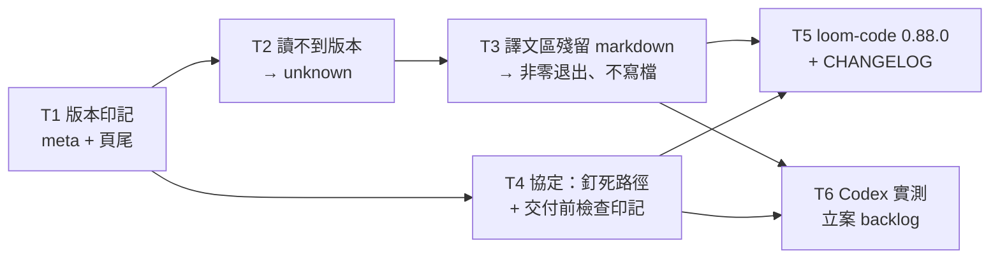

# Plan: make a stale adjudication render impossible to mistake for a good one

**Source brief**: docs/loom/specs/2026-08-18-adjudication-render-staleness-visible.md
Goal: the invocation contract pins WHICH copy of `adjudication_render.py`
    runs (the one shipped beside the protocol being read), every HTML page it
    emits carries the version of the copy that produced it — machine-readable
    and visible to the reader, `unknown` when the copy cannot name itself —
    and a render whose rendition still holds unconverted markdown exits
    non-zero without writing a file.
Stage: finishing
Steps:
  1. 蓋章：頁面帶上產生它的版本（含讀不到版本時的 unknown 退路）
  2. 大聲失敗：譯文區殘留未轉換的 markdown 就非零退出、不寫檔
  3. 釘死路徑：協定規定執行哪一份 copy，並在交付前檢查印記
  4. 收尾：出貨 0.88.0（版本 bump ＋ Codex manifest 同步 ＋ CHANGELOG），並把 Codex 實測立案
**Total tasks**: 6
**Critical-path depth**: 4 (≤5 ✓)
**Execution order**: parallel-where-possible
**Plan-document-reviewer verdict**: PASS (2026-08-18, round 2, 16/16) + post-PASS amendment re-review (Task 5 version number, see Notes)

## Task-flow diagram

Caption: T1 is the gate — both the `unknown` fallback and the protocol's stamp check depend on the stamp existing; T2 and T4 then run in parallel on disjoint files, T3 queues behind T2 only because it edits the same script, and the two close-out tasks fan out again on disjoint trees.



## Open Questions

- OQ-1 [RESOLVED] — Does the visible footer carry the render timestamp as well as the version? → resolved at plan time (brief §Open Questions leaned version-only): **version only**. A timestamp would make two consecutive renders of an unchanged units-JSON differ, which costs the render tests their byte-stability for no gain the version does not already give. Reversal cost: one template slot.
- OQ-2 [RESOLVED] — Does the postcondition treat a leftover ` ```mermaid ` fence and a leftover `**` pair as the same severity? → resolved at plan time: **yes, one severity, one exit code**. Both mean the same thing (the rendition was never converted), and a two-tier signal here would re-create the "warning that nobody acts on" shape the brief rejects.
- OQ-3 [RESOLVED] — Does a live Codex probe of the self-locating path rule gate this arc? → resolved by the user 2026-08-18 at brief sign-off: **no** — the rule's portability is structural (it names no harness-specific primitive), so the probe becomes a backlog entry (T6), not a blocking task.

## Task 1 — stamp every rendered page with the version of the copy that produced it

- **Description**: In `loom-code/scripts/adjudication_render.py`, add `_deployment_version() -> str` reading `"version"` from the `.claude-plugin/plugin.json` that sits beside the running copy (`Path(__file__).resolve().parent.parent / ".claude-plugin" / "plugin.json"`), and thread its value through `_render_page` (`:343-372`) into `DOC_PAGE_TEMPLATE` (`:313-330`) as two new slots: a `<meta name="generator" content="loom-code-adjudication-render/<version>">` tag in `<head>`, and a visible `<footer class="stamp">` line before `</body>` naming the same version. Style the footer in `STYLE` at the muted tier (`--muted`), small, print-visible. Both doc mode and verdict `--html` mode get the stamp — they share `_render_page`, and that sharing is deliberate. This task assumes the manifest is readable; the unreadable case is T2.
- **Module**: loom-code/scripts
- **Files touched**: loom-code/scripts/adjudication_render.py, loom-code/scripts/test_adjudication_render_stamp.py
- **Context paths**:
  - /Users/kouko/.supacode/repos/monkey-skills/Html-viewer-fix/loom-code/scripts/adjudication_render.py
  - /Users/kouko/.supacode/repos/monkey-skills/Html-viewer-fix/loom-code/scripts/test_adjudication_render.py
  - /Users/kouko/.supacode/repos/monkey-skills/Html-viewer-fix/loom-code/.claude-plugin/plugin.json
- **Acceptance**:
  - **RED**: `loom-code/scripts/test_adjudication_render_stamp.py::test_doc_page_carries_generator_meta_and_visible_footer` — `render_doc(FIXTURE_UNITS)` output contains `<meta name="generator" content="loom-code-adjudication-render/` followed by the exact `"version"` string read from `loom-code/.claude-plugin/plugin.json` (the test reads the manifest itself rather than hardcoding a number, so a later bump does not break it), AND contains that same version string inside a `<footer` element. Fails today: neither tag exists.
  - **GREEN**: the new test passes; `render_verdict_html` output carries the same two markers (assert it in the same file, one extra test); the whole existing `test_adjudication_render*.py` set (33 tests) stays green.
- **External surfaces**: none beyond stdlib `json` / `pathlib`, both already imported.
- **Dependencies**: none
- **Independent**: false
- **Brief item covered**: "`adjudication_render.py` stamps every HTML page it emits with the version of the plugin copy that ran — machine-readable (`<meta name="generator">`) and visible to the reader (a small page footer)."
- **Status**: done(ef28ffde)
- **Gloss**: 每份產出的頁面都帶上「是哪個版本產的」，機器讀得到、你也看得見

## Task 2 — a copy that cannot name itself stamps `unknown`, never crashes

- **Description**: Harden `_deployment_version()` so an absent, unreadable, malformed-JSON, or `"version"`-less manifest returns the literal string `unknown` instead of raising — the page still ships both stamp sites, carrying `loom-code-adjudication-render/unknown`. Rationale to carry in the docstring: a copy that cannot identify itself is exactly as suspect as an old one, so it must still be marked rather than silently unmarked. Catch `OSError` and `ValueError` (`json.JSONDecodeError` subclasses `ValueError`) — never a bare `except`.
- **Module**: loom-code/scripts
- **Files touched**: loom-code/scripts/adjudication_render.py, loom-code/scripts/test_adjudication_render_stamp.py
- **Context paths**:
  - /Users/kouko/.supacode/repos/monkey-skills/Html-viewer-fix/loom-code/scripts/adjudication_render.py
  - /Users/kouko/.supacode/repos/monkey-skills/Html-viewer-fix/loom-code/scripts/adjudication_render.py (`_load_bundled_mermaid` at `:374-410` — the existing unreadable-file-degrades-quietly precedent to mirror in shape, not in outcome)
- **Acceptance**:
  - **RED**: `test_adjudication_render_stamp.py::test_unreadable_manifest_stamps_unknown` — with `_deployment_version`'s manifest path monkeypatched to a nonexistent path, and separately to a file containing `not json`, and separately to `{}`, `render_doc(FIXTURE_UNITS)` returns a page containing `loom-code-adjudication-render/unknown` in both the meta tag and the footer, and raises nothing. Fails today: T1's implementation lets the exception escape.
  - **GREEN**: the test passes for all three malformed inputs; T1's happy-path test still passes unchanged.
- **Dependencies**: Task 1 completes first
- **Independent**: true
- **Brief item covered**: "falling back to a literal `unknown` when that file is unreadable (a copy that cannot name itself is as suspect as an old one, and must still be visibly marked)"
- **Status**: done(ed66822d)
- **Gloss**: 連版本檔都讀不到的 copy 會蓋上 unknown，不會當掉，也不會偷偷不蓋

## Task 3 — unconverted markdown in the rendition region fails the render loudly

- **Description**: Add `_assert_rendition_converted(page_html: str) -> None` to `adjudication_render.py`, called from `main()` (`:546-579`) **after** rendering and **before** the `-o` write at `:578`, so a violating run writes no file at all. It scans only the rendition regions (`<div class="rendition">…</div>`), never the `原文` `<details><pre>` block, which carries escaped source markdown BY DESIGN (`:439`). Within each rendition region it first removes `<code>…</code>` and `<pre>…</pre>` spans — a rendition legitimately quoting `` `**bold**` `` as an example must not trip the check; this exact false positive was observed twice on this arc's own brief view — then flags a surviving `**…**` pair or a literal ``` ``` `` fence. On a violation: write nothing, print the offending unit's `id` and the marker to stderr, exit non-zero (`main()` returns 1; a `SystemExit` from `sys.exit(main())`). Same severity for both marker kinds (OQ-2).
- **Module**: loom-code/scripts
- **Files touched**: loom-code/scripts/adjudication_render.py, loom-code/scripts/test_adjudication_render_postcondition.py
- **Context paths**:
  - /Users/kouko/.supacode/repos/monkey-skills/Html-viewer-fix/loom-code/scripts/adjudication_render.py
  - /Users/kouko/.supacode/repos/monkey-skills/Html-viewer-fix/loom-code/scripts/adjudication_lint.py (`:280-283`, the sibling exit-code convention)
  - /Users/kouko/.supacode/repos/monkey-skills/Html-viewer-fix/docs/loom/memory/a-mechanical-check-can-go-green-by-skipping.md
  - /Users/kouko/.supacode/repos/monkey-skills/Html-viewer-fix/docs/loom/memory/a-mutation-test-must-run-the-production-assertion.md
- **Acceptance**:
  - **RED**: `test_adjudication_render_postcondition.py::test_unconverted_rendition_exits_nonzero_and_writes_no_file` — invoking the **production entry point** `main(["doc", str(units_path), "-o", str(out_path)])` on a units file whose `rendition` is pre-escaped text carrying a literal `**bold**` (simulating what a pre-markdown-it copy produces) returns non-zero AND `out_path.exists()` is False. Fails today: `main()` always returns 0 and always writes.
  - **GREEN**: that test passes, plus three non-vacuity companions in the same file, each also driving `main()` rather than the helper: (a) a rendition whose only `**` sits inside an inline code span exits 0 and writes the file (the observed false positive stays green); (b) a normal unit whose `source_text` contains `**bold**` — landing escaped in the `原文` block — exits 0 and writes the file (the by-design block stays excluded); (c) a no-skip probe asserting the scan actually matched something: with the `<div class="rendition">` marker renamed in the fixture the check must NOT silently pass — assert the helper raises on a rendition-region-shaped input, so a future template rename cannot turn the guard into a no-op. The whole `loom-code/scripts/` suite stays green.
- **Dependencies**: Task 2 completes first
- **Independent**: false
- **Brief item covered**: "`adjudication_render.py` fails loud (non-zero exit, no output file written) when a rendered `rendition` still contains unconverted markdown markers."
- **Status**: done(2e72357e)
- **Gloss**: 譯文區還留著沒轉換的 markdown 就直接報錯不寫檔；程式碼片段裡的 `**` 與英文原文區不算數

## Task 4 — the invocation contract pins which copy runs, and gates delivery on the stamp

- **Description**: In `loom-code/skills/using-loom-code/protocols/adjudication-view.md` §Invocation contract (`:190-205`), add two rules. (a) **Which copy**: the scripts to run are the ones shipped beside THIS protocol file — resolve them from this file's own absolute path, `../../../scripts/<script>.py` — never a bare filename, never a hardcoded plugin-cache version directory, never a repo-relative path from the session's working directory. State the reason in one clause (every past silent failure was a copy the executor chose over this one) and carve out the one exception: a session developing these scripts themselves runs its working tree's copy. Do NOT write `${CLAUDE_PLUGIN_ROOT}` — substitution reaches only SKILL.md bodies and `allowed-tools` rules, so in this file the token would survive literally and expand to empty in a shell. (b) **Before delivering**: confirm the produced page carries the generator stamp and that its version matches the plugin whose protocol you are reading; a page with no stamp came from a pre-stamp copy and must not be handed to the user. Keep both additions inside the existing §Invocation contract heading — no new top-level section.
- **Module**: loom-code/skills/using-loom-code/protocols
- **Files touched**: loom-code/skills/using-loom-code/protocols/adjudication-view.md, loom-code/scripts/test_adjudication_protocol_pins.py
- **Context paths**:
  - /Users/kouko/.supacode/repos/monkey-skills/Html-viewer-fix/loom-code/skills/using-loom-code/protocols/adjudication-view.md
  - /Users/kouko/.supacode/repos/monkey-skills/Html-viewer-fix/loom-code/scripts/test_adjudication_protocol_pins.py (`_section` slicing helper — every new assertion runs against the §Invocation contract slice, never the whole document)
- **Acceptance**:
  - **RED**: `test_adjudication_protocol_pins.py::test_invocation_contract_pins_the_shipped_copy` — the §Invocation contract slice contains the relative-resolution rule (assert on the literal `../../../scripts/` path fragment) AND the pre-delivery stamp check (assert on `generator`), AND the slice does NOT contain the literal `CLAUDE_PLUGIN_ROOT`. Fails today: none of the three hold.
  - **GREEN**: the test passes; every pre-existing test in `test_adjudication_protocol_pins.py` stays green; the protocol file stays under the ~3000-word ceiling named in `docs/loom/backlog/2026-08-12-protocol-files-carry-no-size-ceiling.md` (2069 words today — record the post-edit count in the task report).
- **Dependencies**: Task 1 completes first
- **Independent**: true
- **Brief item covered**: "The same invocation contract pins WHICH copy runs, as a self-locating rule… before delivering the page, confirm it carries the stamp and the stamp's version matches the pipeline being run."
- **Status**: done(4754e06b)
- **Gloss**: 協定明文規定「跑跟這份協定一起出貨的那支腳本」，並要求交付前先確認頁面有印記

## Task 5 — ship as loom-code 0.88.0

- **Description**: Bump `loom-code/.claude-plugin/plugin.json` to `0.88.0` — NOT the `0.87.0` this task originally named: PR #704 on branch `onramp-explicit-choice-gate` claimed `0.87.0` and merged to main at 2026-08-18T08:41:58Z (verified at implementation time via `gh pr view 704` and `git show origin/main:loom-code/.claude-plugin/plugin.json`), so `0.87.0` was already taken and the marketplace publishes by version — run `python3 scripts/sync_codex_manifests.py loom-code` so `.codex-plugin/plugin.json` follows in lock-step, and add the `0.88.0` entry to `loom-code/CHANGELOG.md` describing the three shipped behaviors (path pin, version stamp, fail-loud postcondition) and naming the five incidents as the motivation. A version bump is mandatory here rather than optional: T4 changes skill-loaded content, and the marketplace publishes by version, so an unbumped PR is a silent no-op on every installed copy.
- **Module**: loom-code
- **Files touched**: loom-code/.claude-plugin/plugin.json, loom-code/.codex-plugin/plugin.json, loom-code/CHANGELOG.md
- **Context paths**:
  - /Users/kouko/.supacode/repos/monkey-skills/Html-viewer-fix/loom-code/CHANGELOG.md
  - /Users/kouko/.supacode/repos/monkey-skills/Html-viewer-fix/loom-code/.claude-plugin/plugin.json
  - /Users/kouko/.supacode/repos/monkey-skills/Html-viewer-fix/scripts/sync_codex_manifests.py
- **Acceptance**:
  - **RED**: `python3 scripts/sync_codex_manifests.py --check loom-code` exits non-zero immediately after the `.claude-plugin` bump and before the sync — the two manifests diverge on `version`.
  - **GREEN**: `python3 scripts/sync_codex_manifests.py --check loom-code` exits 0; both manifests read `0.88.0`; `loom-code/CHANGELOG.md` carries a `0.88.0` section naming all three behaviors; the full `python3 -m pytest loom-code/scripts/ scripts/ .claude/hooks/` suite is green.
- **Dependencies**: Tasks 3, 4 complete first
- **Independent**: true
- **Brief item covered**: release of the brief's Smallest End State items 1-4 — no new behavior; the version + changelog that make the shipped legs reach an installed copy at all
- **Status**: done(3d29d646)
- **Gloss**: 出貨 0.88.0，Codex manifest 跟著同步，CHANGELOG 記上三項行為

## Task 6 — record the un-probed Codex claim in the backlog

- **Description**: Create `docs/loom/backlog/2026-08-18-codex-live-probe-of-the-self-locating-script-path-rule.md` (frontmatter `status: OPEN`, `start: next real loom run under Codex`) recording that T4's self-locating path rule is argued portable to Codex structurally — it names no harness-specific primitive, and Codex installs by git clone so only the stale-clone staleness class exists there — but was never live-probed, which is what the brief's resolved Open Question 0 deferred. Then regenerate the index with `python3 scripts/backlog_index.py --write --output docs/loom/BACKLOG.md`. Mirror the entry shape of `docs/loom/backlog/2026-08-12-protocol-files-carry-no-size-ceiling.md`, including the body `- Origin:` / `- Start:` bullets that must agree with the frontmatter fields.
- **Module**: docs/loom/backlog
- **Files touched**: docs/loom/backlog/2026-08-18-codex-live-probe-of-the-self-locating-script-path-rule.md, docs/loom/BACKLOG.md
- **Context paths**:
  - /Users/kouko/.supacode/repos/monkey-skills/Html-viewer-fix/docs/loom/backlog/2026-08-12-protocol-files-carry-no-size-ceiling.md
  - /Users/kouko/.supacode/repos/monkey-skills/Html-viewer-fix/docs/loom/backlog/README.md
  - /Users/kouko/.supacode/repos/monkey-skills/Html-viewer-fix/scripts/backlog_index.py
- **Acceptance**:
  - **RED**: `python3 scripts/backlog_index.py --check` exits non-zero with the new entry file present but `docs/loom/BACKLOG.md` not yet regenerated — the index no longer matches the store.
  - **GREEN**: `python3 scripts/backlog_index.py --check` and `--validate` both exit 0; the new entry appears under `## OPEN` in `docs/loom/BACKLOG.md`; `python3 scripts/backlog_index.py --ready` lists it.
- **Dependencies**: Tasks 3, 4 complete first
- **Independent**: true
- **Brief item covered**: brief `## Open Questions` item 0 — "the probe is worth a backlog entry rather than a blocking task… recorded because 'portable by construction' is an argument, not a measurement"
- **Status**: done(8e4fcf81)
- **Gloss**: 把「Codex 沒實測過」這件事立案，不讓它變成沒人記得的口頭承諾

## Notes

- **Same-file chain is deliberate, and the parallel pairs are marked accordingly.** T1 → T2 → T3 all edit `adjudication_render.py`, so they stay sequential regardless of how independent the behaviors read; T1 is the sole task at its level and is therefore `Independent: false` (there is nothing for it to run beside). The genuine parallel pairs are **T2 ‖ T4** (render script + its stamp test vs. the protocol + its pin test — disjoint) and **T5 ‖ T6** (`loom-code/` manifests + changelog vs. `docs/loom/backlog/` — disjoint). T4 depends on T1 only because it documents T1's stamp (doc-mirrors-code).
- **Protocol size ceiling not triggered.** `adjudication-view.md` is 2069 words; T4 adds roughly 150. The unpark condition in `docs/loom/backlog/2026-08-12-protocol-files-carry-no-size-ceiling.md` is "crosses ~3000 words OR a second protocol file lands" — neither fires here, so that entry stays OPEN untouched.
- **Two memory entries bind T3 specifically.** `a-mutation-test-must-run-the-production-assertion.md` is why every T3 test drives `main()` rather than the helper; `a-mechanical-check-can-go-green-by-skipping.md` is why T3 carries the no-skip probe (c). A T3 that skips either is not done.
- **What this plan does NOT fix.** A session whose installed plugin is itself older than 0.88.0 still renders with that old copy and gets no stamp — by design, that absence is the signal. Nothing here prunes the plugin cache, rebases a stale worktree, or retro-flags the five pages already delivered.
- **Verdict stamped, no re-review** — writing the returned verdict + flipping `Stage` to `sdd:wave-1` is the stamping-the-verdict amendment kind.
- **Three citation drifts left in place deliberately.** Round 2 flagged, non-gating: `_render_page` `:343-372` (body ends 371), `DOC_PAGE_TEMPLATE` `:313-330` (template ends 328), and T3's "the `-o` write at `:578`" — which is wrong on both line and branch (the `-o` write is `:576`; `:578` is the no-`-o` stdout branch). Correcting a cited fact is NOT in the closed post-PASS amendment list, and the plan is at its 2-round cap, so the corrections travel in the implementers' dispatch packets instead of a third review round. T1 shifts every one of these line numbers anyway.
- **Post-PASS amendment (re-reviewed, not a skip-note kind).** Task 5's version was changed `0.87.0` → `0.88.0` after the plan's PASS. This is a change to a cited fact, so it is outside the closed skip-list (stamping the verdict / fixing a typo / filling a schema field) and was sent back for a scoped re-review rather than amended silently. Cause: PR #704 claimed `0.87.0` and merged to main mid-arc; the marketplace publishes by version, so shipping a duplicate number would have made the update a silent no-op on every installed copy — the same "looks shipped, is not" failure class this arc exists to fix.
