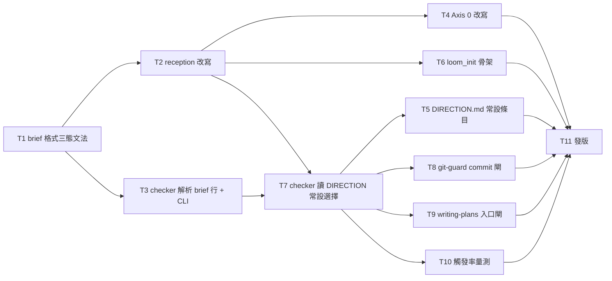

# Plan: on-ramp 顯性選擇閘（brief 的設計側入口決定必須由使用者做，plan 才能落地）

**Source brief**: docs/loom/specs/2026-08-18-onramp-explicit-choice-gate.md
Goal: brief 的 `## Design-side on-ramp` 行若記的是 agent 預設而非使用者明選，就不能變成已提交的 plan：
    三態標準文法寫進 brief 格式規格；一支可攜的 checker 腳本解析該行、把非標準寫法一律當未解決、
    並讀 `docs/loom/DIRECTION.md` 的 repo 級常設選擇；`git-guard.py` 在 `git commit` 新增
    `docs/loom/plans/*.md` 時順 `**Source brief**:` 跑 checker、未解決就擋（Codex 走既有 shim）；
    `writing-plans` 入口跑同一支腳本先給早期回饋；brainstorming Axis 0 與 reception 改成
    「獨立一問、使用者答前寫 `pending`、agent 可建議不可代記」；上線前先量既有 brief 的觸發率。
Stage: finishing
Steps:
    1. 文法定案（brief 格式規格加三態文法）
    2. 散文層與 checker 骨幹（reception 改寫；checker 解析 brief 行＋CLI）
    3. 分支落地（Axis 0 改寫；loom_init 骨架；checker 讀常設選擇）
    4. 門與證據（git-guard commit 閘；writing-plans 入口閘；DIRECTION 常設條目；觸發率量測）
    5. 發版（版本 bump＋CHANGELOG＋codex manifest 同步）
**Total tasks**: 11
**Critical-path depth**: 5 (≤5)
**Execution order**: parallel-where-possible
**Plan-document-reviewer verdict**: PASS (2026-08-18, round 2, 16/16)

## Task-flow diagram

## Open Questions

N/A — no unresolved question: the brief's `## Open Questions` is `none`; every fork below (door placement, no waiver file, standing choices, fail-open posture) is decided in the brief's `## Decision` / `## Alternatives Considered` and restated in Notes.

## Task 1 — brief 格式規格加入 `## Design-side on-ramp` 三態文法

- **Description**: In `loom-code/skills/brainstorming/references/handoff-brief-format.md`, add `## Design-side on-ramp` to the required-sections list and to the `## Template` block, and specify its canonical grammar as a single line under that heading.
  - Required-sections list: `## Required sections`, line 24; today the six
    subsections at lines 28-80 do not include it. `## Template` block: line
    142 onward.
  - The grammar is exactly one of: `not fired — <reason>`; `fired: rows
    <comma-separated row numbers> — user chose <detour|direct>`; `fired: rows
    <…> — standing <detour|direct> (DIRECTION.md)`; `pending`.
  - State that any other wording is *unresolved* (never pass), and that
    `pending` is what the agent writes until the user has answered.
  - State that the `standing` form is legal only when `docs/loom/DIRECTION.md`
    `## On-ramp standing choices` names every listed row (grammar for that
    section is owned by `loom-code/hooks/family-reception.md` — point, don't
    copy).
  - Keep the existing point-don't-copy posture: this file owns the brief-line
    grammar; brainstorming Axis 0 and the checker point here.
- **Module**: loom-code/skills/brainstorming/references
- **Files touched**: loom-code/skills/brainstorming/references/handoff-brief-format.md, loom-code/scripts/test_brief_format_onramp_grammar.py
- **Context paths**:
  - /Users/kouko/GitHub/monkey-skills/loom-code/skills/brainstorming/references/handoff-brief-format.md
  - /Users/kouko/GitHub/monkey-skills/docs/loom/specs/2026-08-18-onramp-explicit-choice-gate.md
  - /Users/kouko/GitHub/monkey-skills/loom-code/scripts/test_brainstorming_axis0.py
- **Acceptance**:
  - **RED**: `loom-code/scripts/test_brief_format_onramp_grammar.py::test_required_sections_and_template_carry_design_side_on_ramp_three_states`
    - Asserts the reference lists `## Design-side on-ramp` inside
      `## Required sections` and inside `## Template`.
    - Asserts the literal tokens `not fired —`, `fired: rows`, `user chose`,
      `standing`, `pending`, and the phrase `unresolved` all appear in that
      section.
    - Fails today (0 hits for "on-ramp" in the file).
  - **GREEN**: the test passes; `python3 -m pytest loom-code/scripts/test_brainstorming_axis0.py` still passes (no wording it pins is touched).
- **Dependencies**: none
- **Independent**: false
- **Brief item covered**: BI-1
- **Status**: done(87746ad7)
- **Gloss**: 先把「那一行只能長四種樣子」寫進 brief 格式的 SSOT，後面的腳本和散文才有東西可指。

## Task 2 — reception：推薦改為獨立一問、`pending`、常設選擇條目文法、改寫「never blocking」

- **Description**: Edit `loom-code/hooks/family-reception.md` §"On-ramp criteria table (SSOT)" (line 61 onward), in three parts (1)-(3) below.
  - (1) Replace the paragraph at lines 76-78 (verbatim today:
    `**Recommend ONCE, never nag.** Surface the recommendation a single time,
    / record the user's choice, then proceed either way — do not re-ask on /
    follow-up turns of the same task.`) with the new wording in the next four
    bullets.
    - Recommend ONCE as a **standalone ask** — on Claude Code the
      `AskUserQuestion` tool, on any host a prose ask whose only question is
      this choice — never a bullet inside another briefing.
    - The brief's `## Design-side on-ramp` line is written `pending` until the
      user answers.
    - The agent may state a recommendation (e.g. "direct — prior vault notes
      cover the principles station") but never records the answer on the
      user's behalf.
    - Never re-raise after the user answers (keep the substrings `ONCE`,
      `never re-raise` verbatim — tests pin them).
  - (2) Add a short `### On-ramp standing choices` sub-note.
    - A repo may pre-answer a row for every future arc in
      `docs/loom/DIRECTION.md` under `## On-ramp standing choices`, one entry
      per row in the grammar
      `- row <n> (<station>): standing <direct|detour> — <reason> (<YYYY-MM-DD>)`.
    - A standing entry lets Axis 0 write the `standing` form without asking;
      the entry is a decision, revisited only by editing DIRECTION.md.
  - (3) Rewrite the sentence at line 87 (`recommendations to surface once,
    never blocking prerequisites.`) to say: never a prerequisite to *run*
    loom-design — but the *choice* is gated: writing-plans intake and the
    plan-commit guard refuse an unresolved line.
  - Point to `handoff-brief-format.md` for the line grammar; do not restate it
    here.
- **Module**: loom-code/hooks
- **Files touched**: loom-code/hooks/family-reception.md, loom-code/scripts/test_reception_onramp_choice.py
- **Context paths**:
  - /Users/kouko/GitHub/monkey-skills/loom-code/hooks/family-reception.md
  - /Users/kouko/GitHub/monkey-skills/loom-code/scripts/test_asking_user_briefing_escalation.py
  - /Users/kouko/GitHub/monkey-skills/docs/loom/specs/2026-08-18-onramp-explicit-choice-gate.md
- **Acceptance**:
  - **RED**: `loom-code/scripts/test_reception_onramp_choice.py::test_reception_requires_standalone_ask_pending_and_standing_choices`
    - Asserts the reception file contains `standalone ask`, `pending`,
      `never records`/`never record` , `## On-ramp standing choices`,
      `standing <direct|detour>`.
    - Asserts it no longer contains `proceed either way` nor `never blocking
      prerequisites`.
    - Fails today.
  - **GREEN**: the test passes; `python3 -m pytest loom-code/scripts/test_asking_user_briefing_escalation.py` still passes.
- **Dependencies**: Task 1 completes first
- **Independent**: true
- **Brief item covered**: BI-5
- **Status**: done(eda97504)
- **Gloss**: 家族入口規則本身改口：這一問要單獨問、答之前寫 pending、agent 不能代答；並開一個 repo 級「常設選擇」的家。

## Task 3 — checker 腳本：解析 brief 的 on-ramp 行＋CLI 退出碼

- **Description**: Create `loom-code/scripts/check_onramp_choice.py` (stdlib only, argparse; mirror the CLI shape of `loom-code/scripts/check_open_questions.py:283-300` — one positional path, exit 1 on missing file, problems to stderr, one clean line to stdout).
  - CLI arguments: positional `brief_path`; optional `--repo-root <dir>`
    (default: `git rev-parse --show-toplevel` of the brief's directory,
    falling back to cwd).
  - Expose a function `resolve(brief_text: str, standing: dict[int, str]) -> Result`
    with `Result.status in {"resolved", "unresolved", "not_fired"}`,
    `Result.rows: list[int]`, `Result.message: str`.
  - Grammar per Task 1: `not fired — …` → not_fired; `fired: rows <n,…> —
    user chose <detour|direct>` → resolved.
  - `fired: rows <n,…> — standing <detour|direct> (DIRECTION.md)` → resolved
    only if every row is in `standing` (this task passes an empty dict —
    Task 7 wires DIRECTION).
  - `pending`, a missing line, or ANY other wording (e.g. `offered — direct
    per repo precedent`, `使用者未反對`) → unresolved.
  - Exit codes: 0 resolved/not_fired; 2 unresolved; 1 file missing.
  - The exit-2 stderr message must name the brief path and the exact question
    to put to the user: "Design-side on-ramp: rows <n> fired — detour into
    loom-design first, or go direct? Record the answer as `fired: rows <n> —
    user chose <detour|direct>`".
  - Match the line by the heading text `Design-side on-ramp` in either form
    the corpus uses (`## Design-side on-ramp` heading followed by the line, or
    a `> **Design-side on-ramp**: …` blockquote line) — but the *value*
    grammar is strict.
- **Module**: loom-code/scripts/check_onramp_choice.py
- **Files touched**: loom-code/scripts/check_onramp_choice.py, loom-code/scripts/test_check_onramp_choice.py
- **Context paths**:
  - /Users/kouko/GitHub/monkey-skills/loom-code/scripts/check_open_questions.py
  - /Users/kouko/GitHub/monkey-skills/loom-code/scripts/test_check_open_questions.py
  - /Users/kouko/GitHub/monkey-skills/loom-code/skills/brainstorming/references/handoff-brief-format.md
  - /Users/kouko/GitHub/monkey-skills/docs/loom/specs/2026-08-18-strategy-dag-plugin.md (real "agent-default" sample, lines 22-24)
- **Acceptance**:
  - **RED**: `loom-code/scripts/test_check_onramp_choice.py::test_fired_without_user_choice_exits_2` — parametrized over fixture briefs.
    - `pending` → 2; `offered — direct per repo precedent` → 2; missing line
      → 2.
    - `fired: rows 1,3 — user chose direct` → 0; `not fired — increment` → 0.
    - stderr for the exit-2 cases contains `user chose <detour|direct>`.
    - Fails today (script absent).
  - **GREEN**: test passes; `python3 loom-code/scripts/check_onramp_choice.py docs/loom/specs/2026-08-18-onramp-explicit-choice-gate.md` exits 0 (this brief's line is `not fired — …`).
- **Dependencies**: Task 1 completes first
- **Independent**: true
- **Brief item covered**: BI-2
- **Status**: done(b0d1cc6d)
- **Gloss**: 真正判「這行算不算使用者答過」的機器；之後 git-guard 與 writing-plans 都只是叫它。

## Task 4 — brainstorming Axis 0 改寫：獨立一問、`pending`、不代記

- **Description**: Edit `loom-code/skills/brainstorming/SKILL.md` Axis 0 (lines 107-112), replacing today's text with the new text below.
  - Today: `If a criteria row triggers, surface the recommendation **ONCE** —
    name the concrete design-side sequence … then record the user's choice in
    the brief under a `## Design-side on-ramp` line ("offered — user chose
    <direct/detour>") and proceed either way. Never re-raise it after a
    decline…`.
  - New text: when a row fires, first check `docs/loom/DIRECTION.md`
    `## On-ramp standing choices` — a standing entry for every fired row →
    write `fired: rows <n> — standing <direct|detour> (DIRECTION.md)` and
    continue without asking.
  - Otherwise write `pending` in the brief and fire the recommendation ONCE as
    a standalone ask (per `loom-code/hooks/family-reception.md` §On-ramp —
    point, don't copy), stating your recommendation inside the ask.
  - Only after the user answers, write `fired: rows <n> — user chose
    <detour|direct>` (grammar SSOT: `references/handoff-brief-format.md`);
    never record an agent default; never re-raise after the user answers.
  - Preserve verbatim the substrings tests pin: `ONCE`, `Design-side on-ramp`,
    `offered`, `chose`, `never re-raise`, `using-loom-design`
    (`test_brainstorming_axis0.py:70-87`,
    `test_brainstorming_backlog_read.py:198-202`).
  - Extend `test_brainstorming_axis0.py` with the new assertion below.
- **Module**: loom-code/skills/brainstorming
- **Files touched**: loom-code/skills/brainstorming/SKILL.md, loom-code/scripts/test_brainstorming_axis0.py
- **Context paths**:
  - /Users/kouko/GitHub/monkey-skills/loom-code/skills/brainstorming/SKILL.md
  - /Users/kouko/GitHub/monkey-skills/loom-code/scripts/test_brainstorming_axis0.py
  - /Users/kouko/GitHub/monkey-skills/loom-code/scripts/test_brainstorming_backlog_read.py
  - /Users/kouko/GitHub/monkey-skills/loom-code/hooks/family-reception.md
- **Acceptance**:
  - **RED**: `loom-code/scripts/test_brainstorming_axis0.py::test_axis0_standalone_ask_pending_no_agent_default` — asserts the Axis 0 section contains `standalone ask`, `pending`, `standing`, `DIRECTION.md`, and does NOT contain `proceed either way`. Fails today.
  - **GREEN**: the whole `test_brainstorming_axis0.py` and `test_brainstorming_backlog_read.py` pass.
- **Dependencies**: Task 2 completes first
- **Independent**: true
- **Brief item covered**: BI-5
- **Status**: done(065396cb)
- **Gloss**: 讓寫 brief 的那一站照新規矩做：先查常設選擇，沒有就單獨問、先寫 pending。

## Task 5 — DIRECTION.md 加 `## On-ramp standing choices` 並記下本 repo 第 1 列的常設決定

- **Description**: Append to `docs/loom/DIRECTION.md` (after `## Later`, line 31-35) a `## On-ramp standing choices` section with one entry in the Task 2 grammar.
  - The entry: `- row 1 (product-principles): standing direct — monkey-skills
    deliberately keeps no docs/loom/PRINCIPLES.md; loom-family arcs go direct
    to a brief (2026-08-18)`.
  - Precede it with a one-line comment that entries are decisions read by
    `check_onramp_choice.py` and revisited only by editing this file.
  - Do not add entries for rows 2-4 (not decided; a future arc that fires them
    gets asked).
- **Module**: docs/loom
- **Files touched**: docs/loom/DIRECTION.md
- **Context paths**:
  - /Users/kouko/GitHub/monkey-skills/docs/loom/DIRECTION.md
  - /Users/kouko/GitHub/monkey-skills/loom-code/hooks/family-reception.md
  - /Users/kouko/GitHub/monkey-skills/loom-code/scripts/check_onramp_choice.py
- **Acceptance**:
  - **RED**: diagnostic — a scratch brief whose line is `fired: rows 1 — standing direct (DIRECTION.md)` run through `python3 loom-code/scripts/check_onramp_choice.py <scratch> --repo-root .` exits 2 today (no standing entry) — record the run in the task's commit message.
  - **GREEN**: the same command exits 0; a scratch brief with `fired: rows 2 — standing direct (DIRECTION.md)` still exits 2 (row 2 has no standing entry).
- **Dependencies**: Task 7 completes first
- **Independent**: true
- **Brief item covered**: BI-6
- **Status**: done(89a5aafb)
- **Gloss**: 把「本 repo 沒有 PRINCIPLES.md 是刻意的」正式記下來，之後第 1 列不會再每弧重問。

## Task 6 — loom_init 的 DIRECTION 模板加空的 `## On-ramp standing choices`

- **Description**: Add an empty `## On-ramp standing choices` section to `loom-code/scripts/templates/DIRECTION.md` after `## Later` (line 32), so `loom_init.py` (`_instantiate`, `loom_init.py:56-59`) scaffolds it.
  - The section is: heading + one-line explanatory comment + placeholder
    `_(none — every fired row is asked)_`.
  - Do not change loom_init's refusal logic.
- **Module**: loom-code/scripts/templates
- **Files touched**: loom-code/scripts/templates/DIRECTION.md, loom-code/scripts/test_loom_init.py
- **Context paths**:
  - /Users/kouko/GitHub/monkey-skills/loom-code/scripts/templates/DIRECTION.md
  - /Users/kouko/GitHub/monkey-skills/loom-code/scripts/loom_init.py
  - /Users/kouko/GitHub/monkey-skills/loom-code/scripts/test_loom_init.py
- **Acceptance**:
  - **RED**: `loom-code/scripts/test_loom_init.py::test_direction_scaffold_has_onramp_standing_choices_section` — scaffolds into `tmp_path` and asserts the written DIRECTION.md contains `## On-ramp standing choices`. Fails today.
  - **GREEN**: test passes; the rest of `test_loom_init.py` passes.
- **Dependencies**: Task 2 completes first
- **Independent**: true
- **Brief item covered**: BI-6
- **Status**: done(2b68d1c4)
- **Gloss**: 新 repo 一 scaffold 就有這個段，不用第一次觸發時才手動補。

## Task 7 — checker 讀 DIRECTION.md 常設選擇並解析 `standing` 形

- **Description**: In `loom-code/scripts/check_onramp_choice.py`, add `load_standing(repo_root) -> dict[int, str]` that reads `<repo_root>/docs/loom/DIRECTION.md`.
  - It finds the exact heading line `## On-ramp standing choices` (exact-line
    match, same posture as `backlog_index.py`'s `## Now` scan at
    `backlog_index.py:607,657-672`).
  - It parses entries `- row <n> (<station>): standing <direct|detour> —
    <reason> (<YYYY-MM-DD>)` into `{n: "direct"|"detour"}`; a missing
    file/section → `{}` (never an error).
  - Wire it into the CLI so the `standing` form resolves only when every
    listed row is present; a `standing` line naming a row with no entry is
    unresolved, and the exit-2 message says which row lacks a standing entry.
- **Module**: loom-code/scripts/check_onramp_choice.py
- **Files touched**: loom-code/scripts/check_onramp_choice.py, loom-code/scripts/test_check_onramp_choice.py
- **Context paths**:
  - /Users/kouko/GitHub/monkey-skills/loom-code/scripts/check_onramp_choice.py
  - /Users/kouko/GitHub/monkey-skills/loom-code/scripts/backlog_index.py
  - /Users/kouko/GitHub/monkey-skills/loom-code/hooks/family-reception.md
- **Acceptance**:
  - **RED**: `loom-code/scripts/test_check_onramp_choice.py::test_standing_choice_in_direction_resolves_listed_rows` — tmp repo with a DIRECTION.md carrying `- row 1 (product-principles): standing direct — x (2026-08-18)`.
    - brief `fired: rows 1 — standing direct (DIRECTION.md)` → exit 0.
    - brief `fired: rows 1,3 — standing direct (DIRECTION.md)` → exit 2 with
      `row 3` in stderr.
    - no DIRECTION.md → exit 2.
    - Fails today.
  - **GREEN**: test passes with the Task 3 test still green.
- **Dependencies**: Tasks 2, 3 complete first
- **Independent**: false
- **Brief item covered**: BI-2
- **Status**: done(4260a489)
- **Gloss**: 常設選擇要真的被機器讀到，閘門才會因為它而放行。

## Task 8 — git-guard：`git commit` 新增 plan 檔時跑 checker，未解決就擋

- **Description**: In `loom-code/hooks/git-guard.py`, add `_gate_commit_plans(cwd, git_globals)` beside `_gate_push` (`git-guard.py:435`), called from `main()`'s commit branch next to the `--no-verify` check (`git-guard.py:526-528`, `if sub == "commit" and _has_no_verify(args)`) for every `commit` subcommand.
  - Run `git diff --cached --name-only --diff-filter=A` through the existing
    `_git()` helper (`git-guard.py:307-312`).
  - For each added path matching `docs/loom/plans/*.md`, read the file, find
    the header line starting `**Source brief**:` (plan-format SSOT:
    `writing-plans/references/plan-format.md:31`), resolve that path against
    the repo toplevel, and call `check_onramp_choice.resolve`/CLI logic.
  - Import the module from `Path(__file__).resolve().parent.parent /
    "scripts"`; if the import or the brief read fails, print exactly one
    stderr line `loom git-guard: on-ramp choice gate inactive (<reason>)` and
    allow — loud fail-open, same posture as `.codex/hooks/git-guard-shim.sh`.
  - Unresolved → print the checker's message plus `MSG_ONRAMP` (new constant
    beside `MSG_REVIEW`, `git-guard.py:114-138`) to stderr and return 2.
  - Modified (not added) plans and commits with no plan files are untouched.
    Honor `LOOM_CODE_MODE=off` as today (`git-guard.py:496-497`).
  - No Codex-side change: the shim forwards unconditionally to this file
    (`.codex/hooks/git-guard-shim.sh` final line).
- **Module**: loom-code/hooks/git-guard.py
- **Files touched**: loom-code/hooks/git-guard.py, loom-code/scripts/test_git_guard.py
- **Context paths**:
  - /Users/kouko/GitHub/monkey-skills/loom-code/hooks/git-guard.py
  - /Users/kouko/GitHub/monkey-skills/loom-code/scripts/test_git_guard.py
  - /Users/kouko/GitHub/monkey-skills/loom-code/scripts/check_onramp_choice.py
  - /Users/kouko/GitHub/monkey-skills/.codex/hooks/git-guard-shim.sh
- **Acceptance**:
  - **RED**: `loom-code/scripts/test_git_guard.py::test_commit_adding_plan_with_unresolved_onramp_blocked` — using the existing `repo` fixture (`test_git_guard.py:84-97`) and `run_hook(bash_event("git commit -m x", cwd=repo))` (`:66-82`).
    - write `docs/loom/specs/b.md` with line `pending`, write
      `docs/loom/plans/p.md` with `**Source brief**: docs/loom/specs/b.md`,
      `git add` both → returncode 2 and `user chose <detour|direct>` in
      stderr.
    - then rewrite the brief line to `fired: rows 1 — user chose direct`,
      re-add → returncode 0.
    - and a commit that only *modifies* an already-committed plan →
      returncode 0.
    - Fails today.
  - **GREEN**: the new test and the whole `test_git_guard.py` pass.
- **Dependencies**: Task 7 completes first
- **Independent**: true
- **Brief item covered**: BI-3, BI-8, BI-9
- **Status**: done(32535afd)
- **Gloss**: 這就是門：新 plan 想進 git，它的 brief 那一行必須是你答的，兩個 host 都一樣。

## Task 9 — writing-plans 入口閘：跑 checker、未解決就拒絕規劃

- **Description**: In `loom-code/skills/writing-plans/SKILL.md`, add a paragraph `**On-ramp choice gate (unconditional):**` immediately after the `**Open-questions gate (unconditional):**` paragraph (`SKILL.md:113`) — same shape.
  - Before dispatching the reviewer (and, stated explicitly, before drafting
    Task 1), run `python3 loom-code/scripts/check_onramp_choice.py
    <brief-path>` on the source brief.
  - exit 2 → STOP: do not draft the plan; relay the checker's question to the
    user as a standalone ask, wait, update the brief line, re-run.
  - Do not add a `## When NOT to use` row (`SKILL.md:37-46`) — the gate is
    unconditional, not an exemption.
  - Cross-reference: `git-guard.py` enforces the same rule at commit time
    (point, don't restate the grammar).
- **Module**: loom-code/skills/writing-plans
- **Files touched**: loom-code/skills/writing-plans/SKILL.md, loom-code/scripts/test_writing_plans_onramp_gate.py
- **Context paths**:
  - /Users/kouko/GitHub/monkey-skills/loom-code/skills/writing-plans/SKILL.md
  - /Users/kouko/GitHub/monkey-skills/loom-code/scripts/test_wp_extraction_pointers.py (line 545 pins the open-questions invocation string — mirror the style)
  - /Users/kouko/GitHub/monkey-skills/loom-code/scripts/test_adjudication_wiring_writing_plans.py
- **Acceptance**:
  - **RED**: `loom-code/scripts/test_writing_plans_onramp_gate.py::test_intake_runs_onramp_choice_gate_before_drafting`
    - asserts the SKILL contains the exact string `python3
      loom-code/scripts/check_onramp_choice.py` inside a paragraph headed
      `On-ramp choice gate`, positioned after the `Open-questions gate`
      paragraph.
    - asserts that the paragraph contains `STOP`.
    - Fails today.
  - **GREEN**: test passes; `test_wp_extraction_pointers.py` and `test_adjudication_wiring_writing_plans.py` still pass.
- **Dependencies**: Task 7 completes first
- **Independent**: true
- **Brief item covered**: BI-4
- **Status**: done(84e3b944)
- **Gloss**: 在還沒花時間寫 plan 之前就先撞到同一道檢查，省一整輪。

## Task 10 — 觸發率量測：checker 掃既有 brief 與 plan→brief 對，寫成審計文件

- **Description**: Run `check_onramp_choice.py` over every `docs/loom/specs/*.md` and over the `**Source brief**:` of every `docs/loom/plans/*.md` (repo-root `--repo-root .`), and write `docs/loom/audits/2026-08-18-onramp-choice-gate-fire-rate.md`.
  - Record: counts by outcome (exit 0 not-fired / exit 0 resolved / exit 2
    unresolved / no line), the list of plan→brief pairs that would be blocked
    *if they were newly added today*, the DIRECTION.md standing-choice state
    at run time, and the exact commands used.
  - State plainly that the gate applies to newly added plans only, so none of
    these historical pairs is affected; the number is the ceremony baseline
    the brief's BI-7 asks for.
  - Cite the brief's 2026-08-18 pre-measurement (71 / 8 / 3 / 4 by wording
    family) beside the checker's numbers.
- **Module**: docs/loom/audits
- **Files touched**: docs/loom/audits/2026-08-18-onramp-choice-gate-fire-rate.md
- **Context paths**:
  - /Users/kouko/GitHub/monkey-skills/loom-code/scripts/check_onramp_choice.py
  - /Users/kouko/GitHub/monkey-skills/docs/loom/specs/2026-08-18-onramp-explicit-choice-gate.md
  - /Users/kouko/GitHub/monkey-skills/docs/loom/memory/measure-a-checks-fire-rate-before-building-it.md
- **Acceptance**:
  - **RED**: diagnostic — the audit file does not exist; the loop command over `docs/loom/specs/*.md` is run and its raw tally captured before writing.
  - **GREEN**: the audit file exists with a counts table whose totals equal the number of spec files scanned plus the number of plans scanned, and the commands section reproduces the numbers when re-run.
- **Dependencies**: Task 7 completes first
- **Independent**: true
- **Brief item covered**: BI-7
- **Status**: done(09d88f08)
- **Gloss**: 上線前先知道這道門在歷史語料上會擋多少，避免做出一個天天叫的閘。

## Task 11 — 發版：loom-code 0.87.0、CHANGELOG、codex manifest 同步

- **Description**: Bump `loom-code/.claude-plugin/plugin.json:3` from `"version": "0.86.0"` to `0.87.0`.
  - Add a `## [0.87.0] — 2026-08-18 — on-ramp explicit-choice gate` entry at
    the top of `loom-code/CHANGELOG.md` (same shape as the `## [0.86.0]` entry
    at lines 8-15).
  - The entry lists the checker script, the git-guard commit gate, the
    writing-plans intake gate, the Axis 0 / reception rewording, the DIRECTION
    standing-choices section, and the fire-rate audit.
  - Run `python scripts/sync_codex_manifests.py --all` so
    `loom-code/.codex-plugin/plugin.json` mirrors the version.
- **Module**: loom-code (release administration)
- **Files touched**: loom-code/.claude-plugin/plugin.json, loom-code/CHANGELOG.md, loom-code/.codex-plugin/plugin.json
- **Context paths**:
  - /Users/kouko/GitHub/monkey-skills/loom-code/CHANGELOG.md
  - /Users/kouko/GitHub/monkey-skills/scripts/sync_codex_manifests.py
  - /Users/kouko/GitHub/monkey-skills/loom-code/scripts/verify-drift.py
- **Acceptance**:
  - **RED**: diagnostic — after editing plugin.json alone, `python3 loom-code/scripts/verify-drift.py` (or `python3 -m pytest loom-code/scripts/test_sync_codex_manifest.py`) reports the codex manifest out of sync.
  - **GREEN**: after running the sync script, `python3 loom-code/scripts/verify-drift.py` exits 0 and `python3 -m pytest loom-code/scripts/ -q` is green.
- **Dependencies**: Tasks 4, 5, 6, 8, 9, 10 complete first
- **Independent**: false
- **Brief item covered**: none — release administration (version bump + changelog + deterministic manifest mirror), delivers no brief outcome
- **Status**: done(f401615b)
- **Gloss**: 沒 bump 版本 marketplace 就不會發佈，Codex 鏡射也要跟上。

## Notes

- **Change-folder detection (writing-plans §Consuming a loom-design change-folder)**: layer (i) branch `onramp-explicit-choice-gate` matches no `docs/loom/<change-id>`; layer (ii) finds two non-archived folders (`2026-07-12-us-sec-primary-source-layer`, `2026-07-19-8k-prose-kpi-intake`) — both investing-toolkit KPI work, unrelated to this brief. **N/A, loudly**: the input is the brainstorming brief (user sign-off 2026-08-18); no change-folder is bound.
- **Coverage**: BI-8 (no waiver file) and BI-9 (enforcement surfaces = Bash-guard + scripts + SessionStart text) are constraints delivered by Task 8's design (no `onramp-waiver.json`; import-from-scripts) — Task 8 cites them alongside its primary BI-3 (primary = the item its RED asserts). BI-10/BI-11 (obsolescence) are delivered by Tasks 2 and 4 (the `proceed either way` wording is removed and the test asserts its absence).
- **Fail-open is loud, never silent** (Task 8): checker import failure or unreadable brief prints one stderr line and allows — matching `.codex/hooks/git-guard-shim.sh`'s posture; a silent allow would recreate the invisible-default failure this arc exists to close.
- **Gate scope**: newly added plans only (`--diff-filter=A`). Historical briefs are not migrated (brief §Out of Scope); a later plan for an old brief must first update that brief's line.
- **Wording pins to preserve** (Tasks 2, 4): `ONCE`, `Design-side on-ramp`, `offered`, `chose`, `never re-raise`, `using-loom-design` (`test_brainstorming_axis0.py:70-87`, `test_brainstorming_backlog_read.py:198-202`).
- **Parallel dispatch**: after Task 1 → Tasks 2 and 3 in parallel; after Tasks 2, 3 → Tasks 4 and 6 in parallel (Task 7 shares Task 3's files, so it is `Independent: false` and runs on SDD's sequential lane at the same level); after Task 7 → Tasks 5, 8, 9, 10 in parallel; Task 11 last.
- **Codex**: no `.codex/` change — the shim forwards every Bash PreToolUse payload to `git-guard.py`; the SessionStart hook already injects the reception on both hosts.
- **Verdict stamped** (PENDING → PASS 2026-08-18 round 2) — stamping the verdict, no re-review.
- Kickoff decision: gate scope for plan files (added-only vs added+modified) → added-only (`--diff-filter=A`); two-way door (one flag), recorded here per kickoff-briefing §b arm-1
- Kickoff decision: checker import / brief-read failure inside git-guard (fail-closed vs loud fail-open) → loud fail-open (one stderr line, allow), matching the Codex shim posture; two-way door, late-vetoable
- Kickoff decision: unresolved exit code → 2 (same code git-guard already uses to deny), 1 = file missing, 0 = resolved/not-fired; two-way door

## Decision Log

1. chose to exempt well-formed `## On-ramp standing choices` entries from DIRECTION.md's no-dates invariant (backlog_index.py) rather than drop the `(YYYY-MM-DD)` from the entry grammar because a standing choice is a dated decision and the grammar is already pinned by four shipped tasks — cost-of-change: the day you want DIRECTION.md fully date-free again, this choice costs re-cutting the entry grammar across reception, brief format, Axis 0 and the checker
