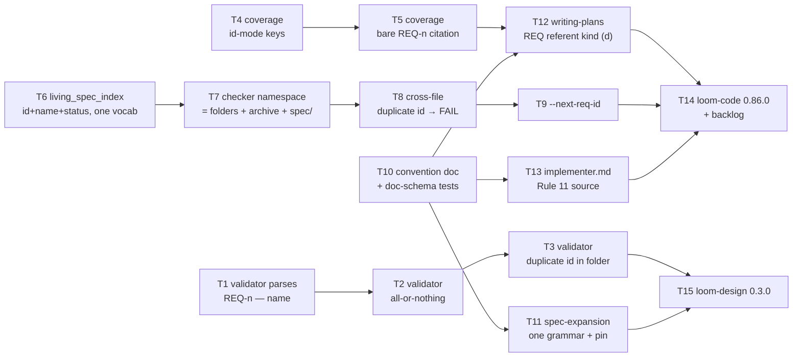

# Plan: requirement identity — REQ-<n> + name from the birthplace onward

**Source brief**: docs/loom/specs/2026-08-18-requirement-identity-hybrid.md
Goal: a change-folder requirement header may carry an authored id ahead of
    its name (`### Requirement: REQ-<n> — <name>`, status suffix unchanged),
    that id is the join key everywhere the name used to be (validator,
    coverage checker, plan referent, `@req` tag), and the CI living-spec
    gate's namespace is widened to live change-folders + archive + living
    root so an id typed once resolves end to end, with dangling or
    duplicate ids rejected and legacy prose-only files unchanged.
Stage: finishing
Steps:
  1. 四路平行起跑：validator 學會 id 標頭、coverage 用 id 當 key、living-spec 解析器學會 id+名字、慣例文件成為 SSOT
  2. 各路加深：全有或全無、requirement 層引用、CI namespace 看見 change-folder、spec-expansion 語法收斂、implementer 守衛更新
  3. 收尾檢查：資料夾內重複 id、跨檔撞號、writing-plans 接上 REQ referent
  4. `--next-req-id` 助手＋loom-design 0.3.0 出貨
  5. loom-code 0.86.0 出貨＋backlog 收帳
**Total tasks**: 15
**Critical-path depth**: 5 (≤5 ✓)
**Execution order**: parallel-where-possible
**Plan-document-reviewer verdict**: PASS (2026-08-18, round 2 + delta-confirmed T9, 16/16)

## Task-flow diagram

Caption: four independent lanes (validator / coverage / living-spec / docs) that only join at the two release tasks; edges are build-order only.

## Open Questions

- OQ-1 [RESOLVED] — Header form: id-first `### Requirement: REQ-<n> — <name>` vs name-first `<name> [REQ-<n>]` → resolved by the user 2026-08-18 at brief sign-off: id-first (mirrors `BI-1 — text` and `## Task 3 — name`; the bracket slot keeps meaning status).
- OQ-2 [RESOLVED] — Is widening the CI namespace (BI-6) in this arc? → resolved by the user 2026-08-18: yes, in scope.
- OQ-3 [RESOLVED] — What does a bare `REQ-<n>` in `Brief item covered` cover, given the coverage checker's unit is the scenario? → resolved at plan time (kickoff-briefing item, one-way door): a bare id is a requirement-level citation and covers every scenario under that requirement; the id-form join key `<change-id> / REQ-<n> / Scenario: <name>` stays the scenario-level referent. Reversal cost: one resolver branch in `check_scenario_coverage.py` (T5).

## Task 1 — validator parses `REQ-<n> — <name>` and rejects a near-miss id

- **Description**: In `loom-design/scripts/spec/validate_spec_output.py`, add the id-aware header grammar from Notes §Canonical grammar as a module regex beside `_REQUIREMENT_HDR` (`:47`, `re.compile(r"^###\s+Requirement:", re.MULTILINE)`).
  - Add a new check `_check_requirement_id_form(root) -> list[str]` registered in `_SKELETON_CHECKS` (`:501-507`).
  - The check walks every delta file (`_delta_files(root)`, the same iteration `_check_requirement_with_rfc2119` at `:234` uses) and, for each `### Requirement:` header, classifies the text as one of three forms.
  - **id-form**: `REQ-\d+` + ` — ` + name.
  - **near-miss**: the token before ` — ` matches `(?i)^r(?:eq)?-?\d+$` but is not exactly `REQ-\d+`.
  - **legacy prose**: anything else.
  - A near-miss is a violation naming the file, the line and the offending token (`REQ1`, `req-1`, `R-1` are the brief's examples). Legacy prose is not a violation.
  - Do not implement duplicate or all-or-nothing checks here (T2/T3).
- **Module**: loom-design/scripts/spec
- **Files touched**: loom-design/scripts/spec/validate_spec_output.py, loom-design/scripts/spec/test_validate_spec_output.py
- **Context paths**:
  - /Users/kouko/GitHub/monkey-skills/loom-design/scripts/spec/validate_spec_output.py
  - /Users/kouko/GitHub/monkey-skills/loom-design/scripts/spec/test_validate_spec_output.py
  - /Users/kouko/GitHub/monkey-skills/loom-code/scripts/check_scenario_coverage.py (the `BI-\d+` precedent regexes at `:123` and `:132`, comment style)
- **Acceptance**:
  - **RED**: `loom-design/scripts/spec/test_validate_spec_output.py::test_rejects_near_miss_requirement_id` — a `_write_skeleton(...)` folder whose delta body carries `### Requirement: req-1 — Foo` (otherwise well-formed, RFC-2119 word present).
    - makes `validate(root)` return `ok=False` with one problem string containing `req-1`;
    - the same body with `### Requirement: REQ-1 — Foo` and with `### Requirement: Foo` both return `ok=True`.
    - Fails today because the check does not exist.
  - **GREEN**: the test passes; every pre-existing test in `test_validate_spec_output.py` still passes.
    - `python3 loom-design/scripts/spec/validate_spec_output.py docs/loom/2026-07-12-us-sec-primary-source-layer` and `... docs/loom/2026-07-19-8k-prose-kpi-intake` exit with the SAME code they exit with before this task
    - (record both codes in the task report — the July folders are legacy prose and must be unaffected by T1).
- **Dependencies**: none
- **Independent**: true
- **Brief item covered**: BI-1
- **Status**: done(9315b3f0)
- **Gloss**: validator 認得「REQ-7 — 名字」這種標頭，並抓出寫壞的 id（REQ1／req-1），舊的純散文標頭完全不受影響

## Task 2 — validator enforces all-or-nothing per spec file

- **Description**: Extend `validate_spec_output.py` with `_check_requirement_id_all_or_nothing(root) -> list[str]` (registered in `_SKELETON_CHECKS`).
  - For each delta file, if at least one `### Requirement:` header is id-form (per the T1 regex) then EVERY `### Requirement:` header in that same file must be id-form; each header that is not becomes one violation naming file + line + header text.
  - A file with zero id-form headers is legacy mode and produces no violation.
  - Mode is per FILE, not per folder — two files in one folder may differ.
- **Module**: loom-design/scripts/spec
- **Files touched**: loom-design/scripts/spec/validate_spec_output.py, loom-design/scripts/spec/test_validate_spec_output.py
- **Context paths**:
  - /Users/kouko/GitHub/monkey-skills/loom-design/scripts/spec/validate_spec_output.py
  - /Users/kouko/GitHub/monkey-skills/loom-design/scripts/spec/test_validate_spec_output.py
- **Acceptance**:
  - **RED**: `test_validate_spec_output.py::test_mixed_id_and_prose_headers_in_one_file_is_invalid` — a delta body with `### Requirement: REQ-1 — Foo` followed by `### Requirement: Bar` returns `ok=False` naming `Bar`;
    - the same two headers split across two capability files (`specs/a/spec.md`, `specs/b/spec.md`) return `ok=True`.
  - **GREEN**: the test passes and the whole `loom-design/scripts/spec/` suite is green.
- **Dependencies**: Task 1 completes first
- **Independent**: false
- **Brief item covered**: BI-2
- **Status**: done(2eb12223)
- **Gloss**: 一個 spec 檔要嘛全部有 id、要嘛全部沒有——混著寫會被擋，避免半套採用

## Task 3 — validator rejects a duplicate `REQ-<n>` within the change-folder

- **Description**: Extend `validate_spec_output.py` with `_check_requirement_id_unique(root) -> list[str]` (registered in `_SKELETON_CHECKS`).
  - Collect every id-form header id across ALL delta files of the folder; any id seen more than once is one violation naming the id and every `file:line` that declares it.
  - Folder scope only — cross-folder collisions are the living-spec checker's job (T8).
- **Module**: loom-design/scripts/spec
- **Files touched**: loom-design/scripts/spec/validate_spec_output.py, loom-design/scripts/spec/test_validate_spec_output.py
- **Context paths**:
  - /Users/kouko/GitHub/monkey-skills/loom-design/scripts/spec/validate_spec_output.py
  - /Users/kouko/GitHub/monkey-skills/loom-design/scripts/spec/test_validate_spec_output.py
- **Acceptance**:
  - **RED**: `test_validate_spec_output.py::test_duplicate_requirement_id_across_files_is_invalid` — `REQ-1 — Foo` in `specs/a/spec.md` and `REQ-1 — Bar` in `specs/b/spec.md` returns `ok=False` with one problem naming `REQ-1` and both paths.
  - **GREEN**: the test passes and the whole `loom-design/scripts/spec/` suite is green.
- **Dependencies**: Task 2 completes first
- **Independent**: false
- **Brief item covered**: BI-1
- **Status**: done(de627f97)
- **Gloss**: 同一個 change-folder 裡不能有兩個 REQ-1；撞號在出生地就被擋下

## Task 4 — coverage checker keys id-mode folders by `REQ-<n>` and drops the duplicate-name warning for them

- **Description**: In `loom-code/scripts/check_scenario_coverage.py`:
  - (1) widen `_REQUIREMENT_HDR` (`:75`, `^###\s+Requirement:\s*(.*)$`) into the id-aware grammar of Notes §Canonical grammar (named groups `id`, `name`, `status`);
  - (2) in `collect_folder_scenario_keys(change_folder, change_id)` (`:197`) emit, for a file in id-mode (≥1 id-form header — per-file, same rule as T2), keys of the form `<change-id> / REQ-<n> / Scenario: <name>`, and for legacy files the existing `<change-id> / Requirement: <name> / Scenario: <name>`;
  - (3) widen `_JOIN_KEY` (`:100-103`) so the middle segment is EITHER `Requirement:\s*(?P<req>.+?)` OR `(?P<req>REQ-\d+)`;
  - (4) the duplicate-key warning at `:217-220` (`Warning: duplicate scenario key seen {count} times (coverage can't distinguish instances) — {key}`) and its comment at `:199-204` become legacy-only —
  - an id-mode duplicate cannot arise from names, so rewrite the comment to say the warning is the legacy path's cost and id-mode has none.
  - Rewrite the file's docstring/`main` help where it names the join-key form.
- **Module**: loom-code/scripts (check_scenario_coverage)
- **Files touched**: loom-code/scripts/check_scenario_coverage.py, loom-code/scripts/test_check_scenario_coverage.py
- **Context paths**:
  - /Users/kouko/GitHub/monkey-skills/loom-code/scripts/check_scenario_coverage.py
  - /Users/kouko/GitHub/monkey-skills/loom-code/scripts/test_check_scenario_coverage.py (`_run` at `:37`, `_write_spec` at `:46`)
- **Acceptance**:
  - **RED**: `loom-code/scripts/test_check_scenario_coverage.py::test_id_mode_folder_keys_use_req_id_and_plan_key_resolves` — a folder whose spec carries `### Requirement: REQ-3 — Foo` with `#### Scenario: S1`, and a plan whose task cites `<change-id> / REQ-3 / Scenario: S1` → exit 0,
    - and stderr contains no `duplicate scenario key` line even when a second id-mode requirement `REQ-4 — Foo` (same NAME, different id) also has a scenario `S1`;
    - the pre-existing `test_dropped_scenario_named_on_stderr_exit_1` (`:87`) passes unchanged.
  - **GREEN**: the test passes and the whole `loom-code/scripts/test_check_scenario_coverage.py` file is green (legacy fixtures unchanged).
- **Dependencies**: none
- **Independent**: true
- **Brief item covered**: BI-4
- **Status**: done(80007bb7)
- **Gloss**: coverage 檢查改用 REQ id 當鑰匙，兩個同名 requirement 再也不會被誤認為同一個

## Task 5 — coverage checker accepts a bare `REQ-<n>` citation as requirement-level coverage

- **Description**: In `check_scenario_coverage.py`'s change-folder mode, treat a `Brief item covered` value that is exactly a bare `REQ-\d+` token (optionally quoted/backticked, same tolerance `_JOIN_KEY` has) as referent kind (d).
  - It resolves to EVERY scenario key of that requirement in the bound folder (OQ-3).
  - A bare `REQ-<n>` that matches no id-form header in the folder is an ERROR naming the task and quoting the value (exit 1) — mirror the brief-mode message shape at `:404-419` — because a `REQ-\d+` token is unambiguous, unlike prose.
  - In `--brief` mode a bare `REQ-<n>` is a warning, not an error (same treatment as a well-formed change-folder join key in brief mode, `:660` test).
- **Module**: loom-code/scripts (check_scenario_coverage)
- **Files touched**: loom-code/scripts/check_scenario_coverage.py, loom-code/scripts/test_check_scenario_coverage.py
- **Context paths**:
  - /Users/kouko/GitHub/monkey-skills/loom-code/scripts/check_scenario_coverage.py (`collect_plan_join_keys` `:235`, `resolve_plan_brief_citations` `:327`, `check_coverage` `:516`)
  - /Users/kouko/GitHub/monkey-skills/loom-code/scripts/test_check_scenario_coverage.py
- **Acceptance**:
  - **RED**: `test_check_scenario_coverage.py::test_bare_req_id_citation_covers_all_scenarios_of_that_requirement` — folder with `REQ-3 — Foo` carrying `S1` and `S2`; a plan with one task citing `REQ-3` → exit 0 (both scenarios covered);
    - a plan citing `REQ-9` (undeclared) → exit 1 with stderr naming the task and quoting `REQ-9`.
  - **GREEN**: the test passes and the whole test file is green.
- **Dependencies**: Task 4 completes first
- **Independent**: false
- **Brief item covered**: BI-5
- **Status**: done(6d58206b)
- **Gloss**: plan 只寫「REQ-3」也算數（視為整條 requirement 都交付）；寫了一個不存在的 REQ 會直接報錯

## Task 6 — living_spec_index parses `REQ-<n> — <name> [status]`, ignores prose headers, and builds both status regexes from one vocabulary

- **Description**: In `loom-code/scripts/living_spec_index.py`, replace `_REQUIREMENT_STATUS_RE` (`:21-23`, id group `(.+?)`) and `_REQUIREMENT_BRACKET_RE` (`:33-35`) with regexes derived from the Notes §Canonical grammar.
  - The id group becomes `(?P<id>REQ-\d+)`, an optional ` — (?P<name>.+?)` follows it, and the optional `[status]` suffix stays.
  - Introduce ONE module constant `_STATUS_VOCAB = "active|deferred"` and build both regexes from it (f-string / `%` — no second literal of the vocabulary anywhere in the file), closing deferred item (a) of the 2026-07-06 living-spec backlog entry.
  - `load_namespace` / `load_req_status` / `find_malformed_status` (`:38/:54/:72`) keep their signatures; a header whose text is not id-form (legacy prose) is skipped by all three — it is not a namespace entry and not a malformed status
  - — EXCEPT that a prose header with a bracket suffix outside `_STATUS_VOCAB` is still reported by `find_malformed_status` (the suffix grammar applies to both modes).
  - Update the module docstring (`:1-9`) accordingly.
- **Module**: loom-code/scripts (living_spec_index)
- **Files touched**: loom-code/scripts/living_spec_index.py, loom-code/scripts/test_living_spec_index.py
- **Context paths**:
  - /Users/kouko/GitHub/monkey-skills/loom-code/scripts/living_spec_index.py
  - /Users/kouko/GitHub/monkey-skills/loom-code/scripts/test_living_spec_index.py
  - /Users/kouko/GitHub/monkey-skills/docs/loom/backlog/2026-07-06-four-deferred-items-from-the-living-spec-index-slices-paired-regex-locks.md
- **Acceptance**:
  - **RED**: `loom-code/scripts/test_living_spec_index.py::test_namespace_parses_id_name_and_status_and_skips_prose` — a spec.md with `### Requirement: REQ-7 — Operational extraction [deferred]`, `### Requirement: REQ-8 — Bare name`, and `### Requirement: Legacy prose name`
    - yields `load_namespace == {"REQ-7": cap, "REQ-8": cap}`, `load_req_status["REQ-7"] == "deferred"`, `["REQ-8"] == "active"`, and `find_malformed_status` is empty;
    - the same file with `### Requirement: Legacy [activ]` reports one malformed entry.
    - Additionally the test asserts `_STATUS_VOCAB in _REQUIREMENT_STATUS_RE.pattern and _STATUS_VOCAB in _REQUIREMENT_BRACKET_RE.pattern` is NOT the check — instead assert `living_spec_index.py`'s source text contains the literal `active|deferred` exactly once (the lockstep property).
  - **GREEN**: the test passes; `test_living_spec_index.py`, `test_check_living_spec_index.py`, `test_living_spec_e2e.py` all green unchanged (they use `REQ-N` headers, which remain valid).
- **Dependencies**: none
- **Independent**: true
- **Brief item covered**: BI-8
- **Status**: done(a62857e8)
- **Gloss**: living-spec 解析器學會「REQ-7 — 名字 [狀態]」，純散文標頭不再被誤當成 id；兩個狀態 regex 共用一份詞彙，改一處不會漏另一處

## Task 7 — living-spec checker namespace = live change-folders + archive + living root

- **Description**: In `loom-code/scripts/check-living-spec-index.py`, add `_namespace_roots(root: Path) -> list[Path]` returning, in this order:
  - every `docs/loom/<change-id>/specs` dir (glob `docs/loom/*/specs`, existing dirs only),
  - every `docs/loom/archive/<x>/specs` dir,
  - and `docs/loom/spec` (tolerated absent).
  - Add `_load_namespace_all(root)` / `_load_req_status_all(root)` / `_find_malformed_status_all(root)` that fold `living_spec_index.load_namespace` / `load_req_status` / `find_malformed_status` over those roots (dict merge; a duplicate id across roots is NOT resolved here — T8 reports it).
  - Replace the four `root / "docs" / "loom" / "spec"` call sites (`build_index` `:198`, `--check-coverage` `:285-307`, the structural lane `:311-333`, and `find_malformed_status` there) with the folded helpers.
  - This fixes the singular nonexistent root (BI-12) by construction.
  - Update the module docstring's namespace sentence (`:28-42`).
- **Module**: loom-code/scripts (check-living-spec-index)
- **Files touched**: loom-code/scripts/check-living-spec-index.py, loom-code/scripts/test_check_living_spec_index.py
- **Context paths**:
  - /Users/kouko/GitHub/monkey-skills/loom-code/scripts/check-living-spec-index.py
  - /Users/kouko/GitHub/monkey-skills/loom-code/scripts/test_check_living_spec_index.py (`_declare_reqs` `:57` writes `docs/loom/spec/<cap>/spec.md`; `_init_repo` `:48`)
  - /Users/kouko/GitHub/monkey-skills/loom-code/scripts/living_spec_index.py
- **Acceptance**:
  - **RED**: `loom-code/scripts/test_check_living_spec_index.py::test_namespace_includes_live_change_folder_and_archive_specs` — a repo fixture with `docs/loom/2026-01-01-x/specs/cap/spec.md` declaring `### Requirement: REQ-3 — Foo`,
    - `docs/loom/archive/2026-01-02-y/specs/cap2/spec.md` declaring `REQ-4 — Bar`, NO `docs/loom/spec/` dir, and a test file tagged `# @req: REQ-3` and another `# @req: REQ-4` → structural lane exit 0;
    - a third tag `# @req: REQ-9` → exit 1 with a dangling violation naming `REQ-9`.
    - Fails today because only `docs/loom/spec` is read.
  - **GREEN**: the test passes; `test_check_living_spec_index.py` + `test_living_spec_e2e.py` green;
    - on THIS repo `python3 loom-code/scripts/check-living-spec-index.py .` exits 0 and `python3 loom-code/scripts/check-living-spec-index.py --verify-index docs/loom/INDEX.md .` still exits 0
    - (the two July folders are legacy prose, so the namespace is still empty and `docs/loom/INDEX.md` is unchanged — state this in the report; if it is NOT unchanged, stop and report why before regenerating).
- **Reuse-adequacy**:
  - Observed: `load_namespace(specs_dir)` globs `<specs_dir>/*/spec.md`, matches each line against `_REQUIREMENT_STATUS_RE`, and returns `{req_id: capability}` with capability = the spec's parent dir name; `load_req_status` walks the same files and returns `{req_id: "active"|"deferred"}` (bare heading → "active"); `find_malformed_status` walks the same files and returns one string per heading whose bracket content is outside the two statuses. All three take ONE `specs_dir` and know nothing about siblings — read loom-code/scripts/living_spec_index.py:36
  - Intended: the folded helpers call each function once per root from `_namespace_roots(root)` (each `docs/loom/<x>/specs`, each `docs/loom/archive/<x>/specs`, then `docs/loom/spec`) and merge the returned dicts / concatenate the lists; per-root behaviour is unchanged, later roots overwrite earlier ones on the same key (a duplicate id across roots is T8's violation, not silently resolved here). After T6 the regex only matches id-form headers, so legacy prose files in the live folders contribute nothing.
- **Dependencies**: Task 6 completes first
- **Independent**: false
- **Brief item covered**: BI-6
- **Status**: done(ae011342)
- **Gloss**: CI 的 living-spec 閘門終於看得見 change-folder（現役＋封存）——今天寫的 `@req: REQ-3` 今天就能解析，指向不存在目錄的 bug 順帶修掉

## Task 8 — living-spec checker fails on the same `REQ-<n>` declared in two namespace files

- **Description**: In `check-living-spec-index.py`, make the folded namespace loader (T7) also collect `{req_id: [declaring spec.md paths]}`.
  - Add `find_duplicate_req_declarations(root) -> list[str]` returning one violation per id declared in more than one file (naming the id and every path).
  - Append it to the structural lane's `violations` (`:311-333`) so it exits 1 with the existing `FAIL: {n} living-spec structural violation(s).` summary.
  - This is the merge-boundary collision guard of BI-3 (two branches each minting `REQ-12` collide on the first CI run after both merge — or earlier, when one rebases onto the other).
- **Module**: loom-code/scripts (check-living-spec-index)
- **Files touched**: loom-code/scripts/check-living-spec-index.py, loom-code/scripts/test_check_living_spec_index.py
- **Context paths**:
  - /Users/kouko/GitHub/monkey-skills/loom-code/scripts/check-living-spec-index.py
  - /Users/kouko/GitHub/monkey-skills/loom-code/scripts/test_check_living_spec_index.py
- **Acceptance**:
  - **RED**: `test_check_living_spec_index.py::test_duplicate_req_id_across_namespace_files_fails_structural_lane` — two change-folders each declaring `### Requirement: REQ-5 — ...` → structural lane exit 1, stderr names `REQ-5` and both spec paths; the same id declared once → exit 0.
  - **GREEN**: the test passes and the file's suite is green.
- **Dependencies**: Task 7 completes first
- **Independent**: false
- **Brief item covered**: BI-3
- **Status**: done(add094ea)
- **Gloss**: 兩個資料夾撞號（都發了 REQ-5）會在 CI 被擋下，而不是靜靜地讓兩個 requirement 共用一個身分

## Task 9 — `--next-req-id` mode reports the next free number, declared in the command surface

- **Description**: Add a `--next-req-id [root]` mode to `check-living-spec-index.py`'s hand-rolled argv parse (`:256-268`, alongside `--write-index` / `--verify-index` / `--check-coverage`).
  - It prints `REQ-<max+1>` where max is the highest `\d+` among ALL id-form headers found by the T7 folded loader across live folders + archive + living root (`REQ-1` when none exist), exit 0.
  - Because ids are never reused (retired numbers stay retired), the scan is over headers PRESENT; a retired number is not re-minted only if the author keeps it declared
  - — document that limit in the mode's help text and in the convention doc's minting rule (T10 already says "next unused = highest ever seen + 1"; the tool computes "highest present + 1", and the doc must say the two coincide only while nothing is deleted).
  - Declare the verb in `AGENTS.md`'s managed command-surface block (`:34`, next to the `:36-47` living-spec entries) and in the module docstring; verify it runs on this repo (`REQ-1` today).
- **Module**: loom-code/scripts (check-living-spec-index)
- **Files touched**: loom-code/scripts/check-living-spec-index.py, loom-code/scripts/test_check_living_spec_index.py, AGENTS.md
- **Context paths**:
  - /Users/kouko/GitHub/monkey-skills/loom-code/scripts/check-living-spec-index.py
  - /Users/kouko/GitHub/monkey-skills/loom-code/scripts/test_check_living_spec_index.py
  - /Users/kouko/GitHub/monkey-skills/AGENTS.md
- **Acceptance**:
  - **RED**: `test_check_living_spec_index.py::test_next_req_id_prints_highest_plus_one_across_roots` — fixture with `REQ-3` in a live folder and `REQ-11` in archive → stdout `REQ-12`, exit 0; empty fixture → `REQ-1`.
  - **GREEN**: the test passes; `python3 loom-code/scripts/check-living-spec-index.py --next-req-id .` prints `REQ-1` on this repo; `AGENTS.md` carries the new invocation line inside the managed block; the manifest-drift gate `python3 scripts/sync_codex_manifests.py --check --all` still exits 0.
- **Reuse-adequacy**:
  - Observed: the T7 folded loader (`_load_namespace_all(root)`) returns one merged `{req_id: capability}` dict built by calling `living_spec_index.load_namespace` once per root from `_namespace_roots(root)`, later roots overwriting earlier ones on the same key; today, before T7 lands, the only loader is the single-root `load_namespace(specs_dir)` at `living_spec_index.py:36` — unverified assumption — the merged dict's shape is settled the moment T7's RED test passes; T9 must re-read the landed helper before wiring against it
  - Intended: `--next-req-id` calls that same folded loader on the same root, ignores the capability values, parses the `\d+` of every key, and prints `REQ-<max+1>` (or `REQ-1` on an empty dict); it opens no new roots and reads no header the structural lane does not already read.
- **Dependencies**: Task 8 completes first
- **Independent**: false
- **Brief item covered**: BI-3
- **Status**: done(a83a0872)
- **Gloss**: 一條指令告訴你下一個空號是幾號，不用自己 grep 三個目錄

## Task 10 — the requirement-identifier convention doc, pinned by doc-schema tests

- **Description**: Write `loom-design/skills/spec-expansion/references/requirement-identifiers.md` as the SSOT of the `REQ-<n>` convention (BI-9), mirroring `loom-code/skills/brainstorming/references/handoff-brief-format.md` §Brief item identifiers (`:122-131`) section-for-section —
  - **Form** (`REQ-<n> — <name>`, id-first, em dash, `REQ1`/`req-1`/`R-1` named as non-forms; the status suffix `[active|deferred]` stays after the name),
  - **Authored, never derived**,
  - **Monotonic across the whole repo, never renumbered, never reused** (minting rule: run `--next-req-id`, or grep the three roots; state that split/merge retires both sides),
  - **Scope: change-folder `specs/*/spec.md` and living-spec `spec.md` share the grammar** (a living-spec header may omit the ` — <name>` half),
  - **Adoption is all-or-nothing per spec FILE; legacy prose-only files are not deprecated**,
  - **Language** (id + name are machine-executed precision content → English),
  - and an **Anti-patterns** list (skipping an id in an id-mode file, renumbering on insert, reusing a retired number, deriving the id from the name, minting an id from inside an implementer).
  - Point at the three parsers by path (validator, coverage checker, living-spec index) — never restate their regexes.
  - Add `loom-design/scripts/spec/test_requirement_ids.py` with the four doc-schema tests shaped like `loom-code/scripts/test_brief_item_ids.py` (`:117/:176/:347/:396`; reuse its fence-aware `_section_body` slicer shape, `:47`).
- **Module**: loom-design/skills/spec-expansion/references
- **Files touched**: loom-design/skills/spec-expansion/references/requirement-identifiers.md, loom-design/scripts/spec/test_requirement_ids.py
- **Context paths**:
  - /Users/kouko/GitHub/monkey-skills/loom-code/skills/brainstorming/references/handoff-brief-format.md
  - /Users/kouko/GitHub/monkey-skills/loom-code/scripts/test_brief_item_ids.py
  - /Users/kouko/GitHub/monkey-skills/docs/loom/specs/2026-08-18-requirement-identity-hybrid.md
- **Acceptance**:
  - **RED**: `loom-design/scripts/spec/test_requirement_ids.py::test_convention_declares_form_minting_and_all_or_nothing` — fails because the reference file does not exist;
    - asserts the doc's Form section names `REQ-<n> — <name>` and the three non-forms, the minting section names `--next-req-id`, the adoption section says all-or-nothing per file and that legacy is not deprecated.
  - **GREEN**: that test plus its three siblings (scope, anti-patterns, language) pass; `python3 -m pytest loom-design/scripts/spec/ -q` green; the skill-folder-structure hook accepts the new file (`references/` is one level deep).
- **Dependencies**: none
- **Independent**: true
- **Brief item covered**: BI-9
- **Status**: done(0da57a32)
- **Gloss**: REQ id 的規則只寫在一個地方（形式／誰發號／永不重編／全有或全無），三個 parser 和所有 skill 文字都指向它

## Task 11 — spec-expansion teaches one header grammar and its pin asserts the single shape

- **Description**: In `loom-design/skills/spec-expansion/SKILL.md`, reconcile the two passages:
  - the skeleton at `:388-400` (`### Requirement: <name>`) becomes `### Requirement: REQ-<n> — <name>` with one sentence saying the id half is optional per file (legacy prose stays legal) and pointing to `references/requirement-identifiers.md`;
  - the status section at `:492-512` (`### Requirement: REQ-X [deferred]`) is rewritten to show the SAME shape with the suffix (`### Requirement: REQ-<n> — <name> [deferred]`) and to point at the same reference for the id rules — no second statement of form/minting.
  - Keep the body under the repo's SKILL.md token ceiling (CLAUDE.md: soft ~5,000 tokens) — if the edit crosses it, move prose to the reference, not the rule.
  - Strengthen `loom-design/scripts/spec/test_spec_expansion_skill.py::test_hybrid_format_markers` (`:370-380`): replace the bare `"### Requirement:" in text` token pin with an assertion that the skeleton fence contains `### Requirement: REQ-<n> — <name>`
  - AND that no fenced example in the file still shows `### Requirement: REQ-X [` (the old dual grammar).
  - Prove the strengthening by mutation: restore the old `:397` line, run the pin, quote the failing assertion name in the task report (a-doc-pin memory).
- **Module**: loom-design/skills/spec-expansion
- **Files touched**: loom-design/skills/spec-expansion/SKILL.md, loom-design/scripts/spec/test_spec_expansion_skill.py
- **Context paths**:
  - /Users/kouko/GitHub/monkey-skills/loom-design/skills/spec-expansion/SKILL.md
  - /Users/kouko/GitHub/monkey-skills/loom-design/scripts/spec/test_spec_expansion_skill.py
  - /Users/kouko/GitHub/monkey-skills/loom-design/skills/spec-expansion/references/requirement-identifiers.md
  - /Users/kouko/GitHub/monkey-skills/docs/loom/memory/a-doc-pin-makes-a-prose-defect-permanent.md
- **Acceptance**:
  - **RED**: the strengthened `test_spec_expansion_skill.py::test_hybrid_format_markers` fails against the current SKILL.md (skeleton still `<name>`, status section still `REQ-X [`).
  - **GREEN**: it passes after the edit; `python3 -m pytest loom-design/scripts/spec/ -q` green; token count of SKILL.md body reported in the task report.
- **Dependencies**: Task 10 completes first
- **Independent**: false
- **Brief item covered**: BI-11
- **Status**: done(5ec4ac0f)
- **Gloss**: spec-expansion 不再一個檔案裡教兩種標頭；釘測改成釘「單一形狀」，回退舊寫法會被抓到

## Task 12 — writing-plans accepts the `REQ-<n>` referent and mandates the id key for id-mode folders

- **Description**: Three consumers of the `Brief item covered` grammar, updated together (consumer census, brief BI-5):
  - (1) `loom-code/skills/writing-plans/references/plan-format.md:113-121` — add referent kind (d): a `REQ-<n>` id declared by an id-mode change-folder header, or the id-form join key `<change-id> / REQ-<n> / Scenario: <name>`;
  - state OQ-3's semantics (bare id = requirement-level, covers all its scenarios) in one sentence and point at `loom-design/skills/spec-expansion/references/requirement-identifiers.md` for the id rules; keep the single-field rule (`test_traceability_generalization.py:62-70`).
  - (2) `plan-document-reviewer-prompt.md:34` Check 3 — add "(d) a `REQ-<n>` id or id-form join key" to the accepted-kinds list (presence-only, unchanged).
  - (3) `writing-plans/SKILL.md:261` — the join-key mandate sentence gains: when the bound folder is in id mode, cite `<change-id> / REQ-<n> / Scenario: <name>` (or the bare id for a whole requirement); the name form stays for legacy folders.
  - `plan_card.py:423` needs no change (opaque read) — say so in the task report.
- **Module**: loom-code/skills/writing-plans
- **Files touched**: loom-code/skills/writing-plans/references/plan-format.md, loom-code/skills/writing-plans/references/plan-document-reviewer-prompt.md, loom-code/skills/writing-plans/SKILL.md, loom-code/scripts/test_plan_req_referent.py
- **Context paths**:
  - /Users/kouko/GitHub/monkey-skills/loom-code/skills/writing-plans/references/plan-format.md
  - /Users/kouko/GitHub/monkey-skills/loom-code/skills/writing-plans/references/plan-document-reviewer-prompt.md
  - /Users/kouko/GitHub/monkey-skills/loom-code/skills/writing-plans/SKILL.md
  - /Users/kouko/GitHub/monkey-skills/loom-code/scripts/test_traceability_generalization.py
  - /Users/kouko/GitHub/monkey-skills/loom-code/scripts/test_wp_extraction_pointers.py
- **Acceptance**:
  - **RED**: `loom-code/scripts/test_plan_req_referent.py::test_plan_format_reviewer_and_skill_name_the_req_referent` — asserts all three files name kind (d) with the `REQ-<n>` token and the id-form join key,
    - and that `plan-format.md` still declares exactly ONE `Brief item covered` field (the existing single-field pin keeps passing).
  - **GREEN**: the test passes; `test_traceability_generalization.py`, `test_wp_extraction_pointers.py`, `test_adjudication_wiring_writing_plans.py` green; any word-ceiling test on `writing-plans/SKILL.md` still passes (raise it deliberately with the reason inline if the one added clause breaches it).
- **Dependencies**: Tasks 5, 10 complete first
- **Independent**: false
- **Brief item covered**: BI-5
- **Status**: done(8b7e9e9f)
- **Gloss**: plan 的 traceability 欄位正式接受 REQ id；審查提示與 writing-plans 的 join key 規定同步改，三個消費者一次到位

## Task 13 — implementer Rule 11 names id-mode change-folder headers as the namespace

- **Description**: In `loom-code/agents/implementer.md:103-128` (Rule 11, `@req` Definition-of-Done), replace "resolves in the `loom-design` namespace" wording with the concrete namespace the checker reads after T7:
  - an id declared by an id-form `### Requirement: REQ-<n> — <name>` header in a live change-folder, the archive, or `docs/loom/spec/`;
  - keep the never-mint rule verbatim and add that `--next-req-id` exists for AUTHORS of specs, not implementers.
  - Point at `loom-design/skills/spec-expansion/references/requirement-identifiers.md`.
- **Module**: loom-code/agents
- **Files touched**: loom-code/agents/implementer.md, loom-code/scripts/test_implementer_req_tag_guard.py
- **Context paths**:
  - /Users/kouko/GitHub/monkey-skills/loom-code/agents/implementer.md
  - /Users/kouko/GitHub/monkey-skills/loom-code/scripts/test_implementer_req_tag_guard.py
- **Acceptance**:
  - **RED**: `test_implementer_req_tag_guard.py::test_rule_11_names_change_folder_headers_as_namespace_source` — asserts Rule 11 mentions the change-folder id-form header as a source of resolvable ids and still contains the never-mint sentence (existing `test_rule_11_forbids_minting_ids` `:61` unchanged).
  - **GREEN**: the test passes and the file's suite is green.
- **Dependencies**: Task 10 completes first
- **Independent**: false
- **Brief item covered**: BI-7
- **Status**: done(8474cbed)
- **Gloss**: implementer 的 `@req` 規則從「查一個從不存在的 namespace」變成「查 change-folder 裡真的有的 id」，永不自己發號的規定不變

## Task 14 — loom-code 0.85.0 → 0.86.0, CHANGELOG, Codex manifest, backlog hygiene

- **Description**: Bump `loom-code/.claude-plugin/plugin.json:3` to `0.86.0`;
  - add a `## [0.86.0] — <date> — requirement identity (REQ-<n> + name)` entry to `loom-code/CHANGELOG.md` listing T4–T9, T12, T13 in the file's bolded-lead bullet style;
  - run `python3 scripts/sync_codex_manifests.py --all` so the Codex mirror carries the version;
  - then backlog hygiene: flip `docs/loom/backlog/2026-08-13-requirement-identity-splits-between-birthplace-and-living-spec.md` to the store's done/closed status per `docs/loom/backlog/README.md`
  - and correct its stale `loom-spec/scripts/validate_spec_output.py:46-47` citation to `loom-design/scripts/spec/validate_spec_output.py:47`;
  - in `2026-07-06-four-deferred-items-…` mark item (a) done by T6 (this PR) and leave (b)–(d) OPEN;
  - regenerate the backlog index via the repo's `scripts/backlog_index.py` if it writes one;
  - update `docs/loom/DIRECTION.md` `## Now` per that file's convention.
- **Module**: loom-code (release administration)
- **Files touched**: loom-code/.claude-plugin/plugin.json, loom-code/CHANGELOG.md, .codex/ (manifest output of sync script), docs/loom/backlog/2026-08-13-requirement-identity-splits-between-birthplace-and-living-spec.md, docs/loom/backlog/2026-07-06-four-deferred-items-from-the-living-spec-index-slices-paired-regex-locks.md, docs/loom/BACKLOG.md, docs/loom/DIRECTION.md
- **Context paths**:
  - /Users/kouko/GitHub/monkey-skills/loom-code/CHANGELOG.md
  - /Users/kouko/GitHub/monkey-skills/docs/loom/backlog/README.md
  - /Users/kouko/GitHub/monkey-skills/scripts/sync_codex_manifests.py
- **Acceptance**:
  - **RED**: `python3 scripts/sync_codex_manifests.py --check --all` exits non-zero after the plugin.json bump and before the sync (the mirror lags) — the diagnostic that goes green.
  - **GREEN**: `--check --all` exits 0; `python3 loom-code/scripts/check-living-spec-index.py .` exits 0; the backlog validator/index script (whatever `docs/loom/backlog/README.md` names) exits 0; the CHANGELOG entry exists.
- **Dependencies**: Tasks 5, 9, 12, 13 complete first
- **Independent**: false
- **Brief item covered**: none — release administration and backlog hygiene; delivers no brief outcome
- **Status**: done(14e801b7)
- **Gloss**: loom-code 出貨 0.86.0，Codex 鏡射同步，backlog 兩條記帳（本弧收掉、遞延項 (a) 銷掉）

## Task 15 — loom-design 0.2.0 → 0.3.0 + CHANGELOG

- **Description**: Bump `loom-design/.claude-plugin/plugin.json:3` to `0.3.0`; add a `## [0.3.0] — <date> — requirement identifiers` entry to `loom-design/CHANGELOG.md` listing T1–T3, T10, T11; run `python3 scripts/sync_codex_manifests.py --all` for the loom-design mirror.
- **Module**: loom-design (release administration)
- **Files touched**: loom-design/.claude-plugin/plugin.json, loom-design/CHANGELOG.md, .codex/ (manifest output of sync script)
- **Context paths**:
  - /Users/kouko/GitHub/monkey-skills/loom-design/CHANGELOG.md
  - /Users/kouko/GitHub/monkey-skills/scripts/sync_codex_manifests.py
- **Acceptance**:
  - **RED**: `python3 scripts/sync_codex_manifests.py --check --all` exits non-zero after the bump and before the sync.
  - **GREEN**: `--check --all` exits 0; `python3 -m pytest loom-design/scripts/spec/ -q` green; the CHANGELOG entry exists.
- **Dependencies**: Tasks 3, 11 complete first
- **Independent**: false
- **Brief item covered**: none — release administration; delivers no brief outcome
- **Status**: done(ddf469eb)
- **Gloss**: loom-design 出貨 0.3.0（validator 三項＋慣例文件＋skill 語法收斂）

## Notes

**Change-folder detection**: N/A — explicit brief handoff (Layer 0 analog: the orchestrator invoked writing-plans with the brief path). Branch `feat/requirement-identity-hybrid` matches no `docs/loom/<change-id>` slug; the two resident date-slug folders (`2026-07-12-us-sec-primary-source-layer`, `2026-07-19-8k-prose-kpi-intake`) belong to shipped investing arcs, not this change.

**Canonical grammar (frozen here so T1 / T4 / T6 / T10 can start in parallel without a doc-mirrors-code edge; T10's reference file restates it in prose and is the SSOT after this PR — the plan is the SSOT only until T10 lands):**

- Header, both change-folder and living spec (one regex, three named groups; `re.MULTILINE`):
  `^###\s+Requirement:\s*(?:(?P<id>REQ-\d+)(?:\s+—\s+(?P<name>.+?))?|(?P<name_legacy>.+?))\s*(?:\[(?P<status>[^\]]*)\])?\s*$`
  — `id` present ⇒ id-form; `name` may be absent only in living-spec files (validator T1 requires it in change-folders: an id with no name is a near-miss there); the separator is a single em dash U+2014 with one space each side; status vocabulary is `active|deferred` (T6's `_STATUS_VOCAB`).
- Near-miss detector (validator T1 only): the first whitespace-delimited token after `Requirement:` matches `(?i)^r(?:eq)?-?\d+$` and is not exactly `REQ-\d+`.
- Mode: per FILE — ≥1 id-form header ⇒ id-mode ⇒ all headers must be id-form (T2); zero ⇒ legacy (unchanged behaviour everywhere).
- Coverage keys (T4): id-mode `<change-id> / REQ-<n> / Scenario: <name>`; legacy `<change-id> / Requirement: <name> / Scenario: <name>`. Plan referent kind (d) (T5/T12): the id-form key, or a bare `REQ-<n>` = every scenario of that requirement (OQ-3).
- Namespace roots (T7): `docs/loom/*/specs/*/spec.md` (live), `docs/loom/archive/*/specs/*/spec.md`, `docs/loom/spec/*/spec.md`. Only id-form headers enter the namespace; prose headers are legacy and ignored (T6).

**Why the four lane-heads are `Independent: true` despite sharing a grammar**: the grammar is frozen above, verbatim, and each of T1/T4/T6 carries it in its own regex by existing convention (`check_scenario_coverage.py:44-47` already declares "same underlying grammar as validate_spec_output.py's `_REQUIREMENT_HDR`" by comment, not import — cross-plugin import is not available). T10 documents; it does not define what the code parses. This is a recorded no-change reason under the consumer-census rule (memory `widening-a-value-grammar-needs-a-consumer-census-at-plan-time`).

**Consumer census of the `### Requirement:` header grammar** (every consumer has a task or a recorded reason): `validate_spec_output.py` T1–T3 · `check_scenario_coverage.py` T4–T5 · `living_spec_index.py` T6 · `check-living-spec-index.py` T7–T9 · `spec-expansion/SKILL.md` T11 · `writing-plans` (3 files) T12 · `implementer.md` T13 · `completeness-critic/SKILL.md:398` + `references/consistency-lens.md:12,29` — read the header body only, id-agnostic, **no change**; `:29`'s `REQ-002` example is already id-form-compatible · `README-spec.md:61` pipeline diagram names `### Requirement:` generically — **no change** · `test_spec_to_code_wiring.py:58` asserts the token `### Requirement:` is present in writing-plans — still true after T12, **no change** · `living_spec_tags.py:39` / `living_spec_collect.py` / `_drift` / `_gitref` — parse the `@req` TAG, not the header; the tag token stays `REQ-<n>`, **no change** · `plan_card.py:423` opaque, **no change** · `archive_change_folder.py` — moves the folder; T7 reads archive by path so archived ids stay in the namespace, **no change**.

**Shipped change-folders**: the two July folders are legacy prose and stay legal under every task (T1 GREEN, T7 GREEN both assert this on the real repo). Not retrofitted (brief Out of Scope).

**INDEX.md**: with zero id-form headers in the repo the widened namespace is still empty, so `docs/loom/INDEX.md` stays the one-line base case and `--verify-index` stays green (T7 GREEN pins this). The first arc that ships an id-mode change-folder will regenerate it — expected, and that arc's `--write-index` run is the moment.

**Cross-branch collision handling** (brief Decision): grep-then-check via `--next-req-id` (T9) + the merge-boundary duplicate FAIL (T8); the reversal condition (a central sequencer) is recorded in the brief's Alternatives, not planned.

**Secondary brief items** (one primary referent per task — tie-break rule): BI-10 (duplicate-name warning becomes legacy-only) is delivered inside T4; BI-12 (the singular nonexistent root) is fixed by construction inside T7. The brief-mode coverage check reports both as uncovered warnings; this note is the recorded reason.

**Review trail**: round 1 NEEDS_REVISION (Checks 14/16/17) → fixed; round 2 NEEDS_REVISION (Check 17 on T9 only) → Reuse-adequacy block added and CONFIRMED_RESOLVED by the same reviewer via delta check; verdict stamped — stamping the verdict, no re-review.

Kickoff decision: bare `REQ-<n>` in `Brief item covered` → requirement-level coverage of every scenario under it (OQ-3, option A; user-ratified 2026-08-18 at kickoff). Post-arc follow-up (user decision, same kickoff): a blind dogfood AFTER this arc ships — cold plan-writers on an id-mode fixture folder, measuring bare-id over-claim rate and reviewer catch rate; results binding on whether OQ-3 flips to scenario-only (cost: one resolver branch in T5). Not a task of this plan; file it as a backlog entry at close-out.

## Decision Log

1. chose to leave the backlog status flip and BACKLOG.md/DIRECTION.md regeneration out of Task 14 and let finishing-a-development-branch's Step 8 do them at close-out because docs/loom/backlog/README.md §Verbs assigns the close duty there (a SHIPPED flip before merge would lie) — cost-of-change: the day you want the release task to own backlog closure, this choice costs one Step-8 pointer edit
2. chose to fold two reviewer should-fixes into small follow-up commits (T8's private-import refactor → public `load_req_paths`; T3's dead `d` parameter) rather than log them as debt because each was named concretely by the reviewer and cost minutes — cost-of-change: none; the only surviving debt is T5's untested `if dropped:` guard (a citation-error-only run with full coverage), left for the whole-branch review or a follow-up test
3. chose to keep Task 12's Description text as written (it says "when the bound folder is in id mode") and correct the shipped docs to the SSOT's per-FILE rule instead of rewriting the plan record — whole-branch docs review found the folder-vs-file drift in three files that faithfully copied the plan's wording; the plan is a record, the docs are the contract — cost-of-change: none beyond this line
4. chose to keep the legacy coverage key byte-identical (a `[status]`-suffixed prose name keeps its suffix in the key) rather than migrate the one shipped July plan citation — the plan's canonical-grammar note promised "legacy: unchanged behaviour everywhere" and whole-branch review caught the regression — cost-of-change: the day legacy keys should also drop the status suffix, this choice costs one regex-group tweak plus that plan line

