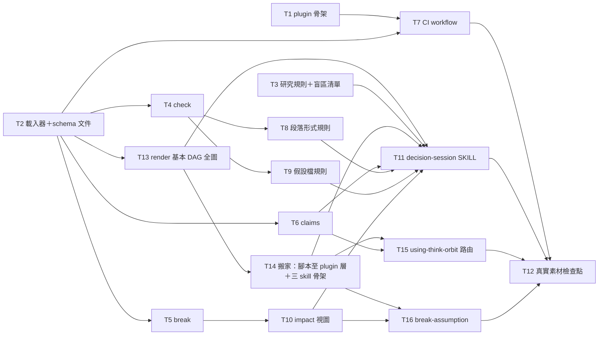

# Plan: think-orbit plugin — Part 1（格式・機械閘・假設傳播・核心對話協定・骨架 → 真實素材檢查點）

**Source brief**: docs/loom/specs/2026-08-18-think-orbit-plugin-part-1.md
Goal: Part 1 交付後：plugin 骨架在 repo 內、有自己的 CI lane；使用者在任一資料夾說「我要決定 X」，
    agent 依對話協定寫 `GOAL/FACT/CLAIM/DECISION` 節點檔與假設檔（≤3／分支、agent 起草人確認、
    可證偽測試），每個節點邊界靜默跑機械閘腳本（失敗才一行），使用者宣告假設破裂時腳本沿承重鏈
    標 `stale`、輸出影響範圍視圖、不重算；研究筆記以其 `claim` 一行被引用、`claim` 變了才通知下游；
    整張 DAG 由腳本畫成一張基本 Mermaid 全圖給人看；最後使用者用自己的真實素材跑完一輪、
    對著 DAG 全圖與節點檔寫下檢查點結論。
Stage: finishing
Steps:
    1. 骨架與地基（plugin 骨架／載入器＋格式文件／研究規則與盲區清單）
    2. 四個腳本動詞與 CI lane（check／break／claims／render 基本 DAG 全圖／CI workflow）
    3. 補齊規則與影響範圍視圖（段落形式／假設檔規則／impact 視圖）
    4. 搬家＋三個 skill（腳本移到 plugin 層／路由／decision-session／break-assumption）
    5. 真實素材檢查點（使用者親跑）
**Total tasks**: 16
**Critical-path depth**: 5 (≤5)
**Execution order**: sequential（所有 `Files touched` 皆為 PROPOSED-new 路徑 → `Independent: false`；SDD 逐一派發，同層任務無先後之分）
**Plan-document-reviewer verdict**: PASS (2026-08-18, round 3, 16/16)
**Continuous mode**: endpoint named: yes（2026-08-18 `/goal 開始實作到完成吧`）→ continuous to PR-open; never auto-merge; T12 是使用者親跑的計畫內停點
**Umbrella brief**: docs/loom/specs/2026-08-18-think-orbit-plugin.md（總覽；Part 2 = `…-part-2.md`，只在 T12 檢查點檔存在後開工）

## Task-flow diagram



## Open Questions

N/A — no unresolved question: the three schema defaults are recorded as decisions in the brief (§Decision), and any schema change the checkpoint surfaces is routed to the Part 2 brief, not left open here.

## Task 1 — plugin 骨架與 marketplace 登錄

- **Description**: Create the `think-orbit/` plugin skeleton:
  - `.claude-plugin/plugin.json` (name `think-orbit`, version `0.1.0`, description, keywords),
  - the Codex mirror `.codex-plugin/plugin.json` produced by `python3 scripts/sync_codex_manifests.py think-orbit`,
  - `README.md` / `README.ja.md` / `README.zh-TW.md` (short: what it is, one usage line, "Part 1 — pre-release"),
  - `CHANGELOG.md` with a `0.1.0` entry,
  - a stub `skills/think-orbit/SKILL.md` (frontmatter `name` + `description` + a one-paragraph body marked "Part 1 draft — protocol lands in T11"),
  - and the marketplace entry appended to `.claude-plugin/marketplace.json` with a description byte-identical to plugin.json's. Write the test first.
- **Module**: think-orbit (plugin root)
- **Files touched**: NEW: think-orbit/.claude-plugin/plugin.json, NEW: think-orbit/.codex-plugin/plugin.json, NEW: think-orbit/README.md, NEW: think-orbit/README.ja.md, NEW: think-orbit/README.zh-TW.md, NEW: think-orbit/CHANGELOG.md, NEW: think-orbit/skills/think-orbit/SKILL.md, NEW: think-orbit/skills/think-orbit/scripts/test_plugin_manifest.py, .claude-plugin/marketplace.json
- **Context paths**:
  - /Users/kouko/.supacode/repos/monkey-skills/strage-dag-skill/four-dx-coach/.claude-plugin/plugin.json
  - /Users/kouko/.supacode/repos/monkey-skills/strage-dag-skill/four-dx-coach/.codex-plugin/plugin.json
  - /Users/kouko/.supacode/repos/monkey-skills/strage-dag-skill/.claude-plugin/marketplace.json
  - /Users/kouko/.supacode/repos/monkey-skills/strage-dag-skill/scripts/sync_codex_manifests.py
  - /Users/kouko/.supacode/repos/monkey-skills/strage-dag-skill/scripts/check-marketplace-description-sync.py
  - /Users/kouko/.supacode/repos/monkey-skills/strage-dag-skill/CLAUDE.md
- **Acceptance**:
  - **RED**: `think-orbit/skills/think-orbit/scripts/test_plugin_manifest.py::test_manifest_marketplace_and_codex_mirror_are_consistent` — fails because none of the files exist.
    - asserts plugin.json exists with `name == "think-orbit"` and `version == "0.1.0"`,
    - marketplace.json has an entry `name == "think-orbit"` whose `description` equals plugin.json's,
    - `python3 scripts/sync_codex_manifests.py --check think-orbit` exits 0,
    - and the three READMEs + CHANGELOG + SKILL.md exist.
  - **GREEN**: the test passes; `python3 scripts/check-marketplace-description-sync.py` exits 0; `bash .claude/hooks/validate-skill-folder-structure.sh think-orbit/skills/think-orbit/SKILL.md` exits 0.
- **Dependencies**: none
- **Independent**: false
- **Brief item covered**: BI-8 — Plugin scaffold（主：RED 斷言 plugin.json／marketplace／Codex mirror／READMEs／CHANGELOG／SKILL stub 存在且一致）
- **Status**: done(28c2cc38)
- **Gloss**: 讓 plugin 在 marketplace 與 Codex 鏡射裡「存在」，之後每個任務都有落腳的資料夾；不做這步，CI 與發佈檢查根本找不到它。

## Task 2 — 載入器 `dag.py load` 與 node-schema 參考文件

- **Description**: Implement `think-orbit/skills/think-orbit/scripts/dag.py` with `load_project(root: Path) -> Project` that parses YAML frontmatter (`yaml.safe_load`) of every `*.md` under `<root>/nodes/`, `<root>/assumptions/`, and `<root>/research/` into dataclasses:
  - `Node(id, type, seq, inputs: list[Input(ref, load_bearing)], summary, status, branch, branch_type, source, quote, path)`,
  - `Assumption(id, status, statement, breaks_if, source, branch, path)`,
  - and a research note with a frontmatter `claim` loaded as a `Node` of `type == "FACT"` whose `summary` is the `claim` line and whose `id` is the note's frontmatter `id`.
  - Also write `references/node-schema.md` documenting the same field sets, the three schema defaults from the brief (extraction-driven node granularity / multi-role paragraphs / user-chosen project dir), and a minimal example of each file. Write the test first.
- **Module**: think-orbit/skills/think-orbit/scripts/dag.py
- **Files touched**: NEW: think-orbit/skills/think-orbit/scripts/dag.py, NEW: think-orbit/skills/think-orbit/scripts/test_dag.py, NEW: think-orbit/skills/think-orbit/references/node-schema.md
- **Context paths**:
  - /Users/kouko/.supacode/repos/monkey-skills/strage-dag-skill/docs/loom/specs/2026-08-18-think-orbit-plugin-part-1.md
  - /Users/kouko/.supacode/repos/monkey-skills/strage-dag-skill/docs/loom/specs/2026-08-18-think-orbit-plugin.md
  - /Users/kouko/kouko-obsidian-vault/research/2026-08-18 決策推演 plugin v0 設計定案.md
  - /Users/kouko/.supacode/repos/monkey-skills/strage-dag-skill/dev-workflow/skills/handoff/scripts/test_handoff_readmes.py
- **Acceptance**:
  - **RED**: `think-orbit/skills/think-orbit/scripts/test_dag.py::test_load_project_parses_nodes_assumptions_and_research_claims` — fails with `ModuleNotFoundError: dag`.
    - builds a project under `tmp_path` with one GOAL, one FACT (`source`, `quote`), one CLAIM in branch `b1` (`branch_type: exclusive`, `inputs: [{ref: goal, load_bearing: true}]`),
    - one assumption `q4_budget_holds` (`status: open`, `breaks_if` set), and one `research/r1.md` with `id: r1` and `claim: ...`;
    - asserts the four `Node`s (incl. the research FACT with `summary == claim`) and the one `Assumption` come back with every field populated.
  - **GREEN**: the test passes; `references/node-schema.md` exists and names every frontmatter field the dataclasses carry (spot-checked by the test via a `for field in (...)` presence loop over the doc text).
- **External surfaces**:
  - SDK package: PyYAML `yaml.safe_load` — grounding: in-repo evidence `dev-workflow/skills/handoff/scripts/test_handoff_readmes.py` (imports `yaml`); pinned reference https://pyyaml.org/wiki/PyYAMLDocumentation (captured 2026-08-18)
- **Dependencies**: none
- **Independent**: false
- **Brief item covered**: BI-1 — Node files（主：RED 斷言節點欄位集）＋ BI-2 — Assumption files（欄位集的載入半邊）＋ BI-3 — Research note as FACT（`claim` 載入半邊）
- **Status**: done(6ac29cc3)
- **Gloss**: 「檔案就是圖」的第一塊磚——之後 check／break／claims 全部從這個載入器讀圖；schema 文件是使用者手動編輯檔案時的對照表。

## Task 3 — 研究規則與盲區清單參考文件

- **Description**: Write two prose reference files for the SKILL to point at:
  - `references/research-rules.md` transcribing the brief's BI-7 table
    - (project docs answer → infer; one missing external fact → ≤1 arm, write result + source into the current note; topic survey / explicit request → standalone research note; hard rule: any external fact entering the reasoning must be findable in the docs; the four agent-initiated search triggers),
  - and `references/blind-spot-checklist.md`
    - (the umbrella's list: resources unchanged / competitors static / enough time / people available / regulation unchanged / demand persists — offered once when a branch opens, plus the one extra question 「這條路還踩在什麼上面」).
  - Each file ≤60 lines, paragraphs of 2–4 sentences.
- **Module**: think-orbit/skills/think-orbit/references
- **Files touched**: NEW: think-orbit/skills/think-orbit/references/research-rules.md, NEW: think-orbit/skills/think-orbit/references/blind-spot-checklist.md
- **Context paths**:
  - /Users/kouko/.supacode/repos/monkey-skills/strage-dag-skill/docs/loom/specs/2026-08-18-think-orbit-plugin-part-1.md
  - /Users/kouko/kouko-obsidian-vault/research/2026-08-18 決策推演 plugin v0 設計定案.md
- **Acceptance**:
  - **RED**: diagnostic `grep -c "findable in the docs\|找得到出處" think-orbit/skills/think-orbit/references/research-rules.md` returns 0 / file missing, and `grep -c "" think-orbit/skills/think-orbit/references/blind-spot-checklist.md` fails (file missing).
  - **GREEN**: both files exist; research-rules.md contains the hard rule sentence and the four search triggers; blind-spot-checklist.md lists the six blind spots; `bash .claude/hooks/validate-skill-folder-structure.sh think-orbit/skills/think-orbit/SKILL.md` still exits 0.
- **Dependencies**: none
- **Independent**: false
- **Review-weight**: prose
- **Brief item covered**: BI-7 — Research rules in SKILL.md（規則本文落在 reference，SKILL 於 T11 指向）
- **Status**: done(85381dfe)
- **Gloss**: 把「要查就獨立成篇、進推論的事實一定要有出處」與開分支時的盲區提問寫成 agent 可指向的檔案，避免規則只活在對話裡。

## Task 4 — `dag.py check`：結構閘（欄位／參照解析／退出碼）

- **Description**: Add subcommand `check <root>` to `dag.py`: load the project and report:
  - (a) every `inputs` entry missing `load_bearing`,
  - (b) every `inputs.ref` that resolves to no node / assumption / research `id`,
  - (c) every FACT missing `source` or `quote`,
  - (d) any node missing a required field (`type`, `id`, `seq`, `summary`).
  - Print nothing and exit 0 when clean; print exactly one line per violation (`<file>: <rule>: <detail>`) and exit 1 otherwise.
  - `check` never writes to any file. Write the test first.
- **Module**: think-orbit/skills/think-orbit/scripts/dag.py
- **Files touched**: think-orbit/skills/think-orbit/scripts/dag.py, think-orbit/skills/think-orbit/scripts/test_dag.py
- **Context paths**:
  - /Users/kouko/.supacode/repos/monkey-skills/strage-dag-skill/docs/loom/specs/2026-08-18-think-orbit-plugin-part-1.md
  - /Users/kouko/.supacode/repos/monkey-skills/strage-dag-skill/docs/loom/memory/fail-closed-default-must-be-enforced-not-emergent.md
  - /Users/kouko/.supacode/repos/monkey-skills/strage-dag-skill/docs/loom/memory/section-gate-must-flag-entry-lookalikes-not-just-matches.md
- **Acceptance**:
  - **RED**: `test_dag.py::test_check_prints_one_line_per_structural_violation_and_is_silent_when_clean` — fails because `check` is not a recognised subcommand.
    - a fixture with exactly three violations (one `inputs` entry without `load_bearing`, one dangling `ref`, one FACT without `quote`) yields exit 1 and exactly 3 stdout lines each naming its file;
    - the clean fixture from Task 2 yields exit 0 and empty stdout;
    - the fixture files' mtimes are unchanged after the run.
  - **GREEN**: the test passes.
- **Dependencies**: Task 2 completes first
- **Independent**: false
- **Brief item covered**: BI-4 — Mechanical gate script (`check`)（主：結構規則＋靜默／一行一錯／退出碼；段落規則在 T8）
- **Status**: done(e395c9f7)
- **Gloss**: 每個節點邊界靜默跑的安全網——通過不吭聲、失敗只講一句；memory 實證散文閘會失守，所以這裡是腳本。

## Task 5 — `dag.py break`：假設破裂 → 承重鏈 stale 傳播

- **Description**: Add subcommand `break <root> <assumption-id>` to `dag.py`:
  - set the assumption's frontmatter `status: broken`;
  - walk `inputs` edges from that assumption's `id`;
  - every node reached through a chain in which every hop is `load_bearing: true` gets frontmatter `status: stale`;
  - nodes reachable only through a chain containing a `load_bearing: false` hop are listed under `weakened:` on stdout and left unchanged;
  - no other field of any file changes; nothing is recomputed.
  - Frontmatter rewrite preserves key order and the body byte-for-byte. Write the test first.
- **Module**: think-orbit/skills/think-orbit/scripts/dag.py
- **Files touched**: think-orbit/skills/think-orbit/scripts/dag.py, think-orbit/skills/think-orbit/scripts/test_dag.py
- **Context paths**:
  - /Users/kouko/.supacode/repos/monkey-skills/strage-dag-skill/docs/loom/specs/2026-08-18-think-orbit-plugin-part-1.md
  - /Users/kouko/kouko-obsidian-vault/research/2026-08-18 決策推演 plugin v0 設計定案.md
- **Acceptance**:
  - **RED**: `test_dag.py::test_break_marks_load_bearing_chain_stale_and_reports_weakened` — fails because `break` is not a recognised subcommand.
    - fixture: assumption `a1`; `n1` inputs `a1` (lb true); `n3` inputs `n1` (lb true); `n2` inputs `a1` (lb false); `n4` inputs `n2` (lb true).
    - After `break a1`: `a1.status == broken`, `n1` and `n3` have `status: stale`, `n2` and `n4` keep `status: current` and appear in the `weakened:` stdout list, every file body is byte-identical to before.
  - **GREEN**: the test passes.
- **Dependencies**: Task 2 completes first
- **Independent**: false
- **Brief item covered**: BI-5 — Assumption-broken propagation（主：stale／weakened 語意；影響範圍視圖在 T10）
- **Status**: done(0ef7a763)
- **Gloss**: 前提破了，系統只做「標記誰受影響」這一件事——不刪、不重算，讓使用者決定重看哪裡。

## Task 6 — `dag.py claims`：研究筆記 `claim` 變更 → 列出下游

- **Description**: Add subcommand `claims <root> [--since <git-rev>]` (default `HEAD`) to `dag.py`:
  - for every `research/*.md` with a frontmatter `claim`, read the same file at `<git-rev>` via `git show <rev>:<relpath>` (run with `cwd=<root>`; a file absent at that rev counts as unchanged-new), compare the `claim` values,
  - and for each changed claim print one line `<research-id>: claim changed → dependents: <ids>` listing every node whose `inputs.ref` names that research `id`.
  - Print nothing and exit 0 when no claim changed. Write the test first.
- **Module**: think-orbit/skills/think-orbit/scripts/dag.py
- **Files touched**: think-orbit/skills/think-orbit/scripts/dag.py, think-orbit/skills/think-orbit/scripts/test_dag.py
- **Context paths**:
  - /Users/kouko/.supacode/repos/monkey-skills/strage-dag-skill/docs/loom/specs/2026-08-18-think-orbit-plugin-part-1.md
- **Acceptance**:
  - **RED**: `test_dag.py::test_claims_lists_dependents_only_for_research_claims_changed_since_rev` — fails because `claims` is not a recognised subcommand.
    - `tmp_path` project initialised as a git repo with one commit; `research/r1.md` `claim` edited afterwards, `research/r2.md` untouched; node `n1` inputs `r1`, node `n2` inputs `r2`;
    - `claims --since HEAD` prints exactly one line naming `r1` and `n1`, not `r2`/`n2`; with no edits it prints nothing and exits 0.
  - **GREEN**: the test passes.
- **External surfaces**:
  - CLI flag: `git show <rev>:<path>` — grounding: `git show --help` (captured 2026-08-18); in-repo evidence `dev-workflow/skills/git-memory` scripts use `git show`.
- **Dependencies**: Task 2 completes first
- **Independent**: false
- **Brief item covered**: BI-3 — Research note as FACT（主：`claim` 變了才通知下游，git diff 不用雜湊）
- **Status**: done(3026ad5f)
- **Gloss**: 研究筆記可以隨時修，只有那一行結論改了才會敲下游——這是「不做雜湊鏈」決定的具體落地。

## Task 7 — CI workflow `think-orbit-ci.yml`

- **Description**: Add `.github/workflows/think-orbit-ci.yml` modelled on `tsundoku-ci.yml`:
  - trigger on `push`/`pull_request` with `paths: ['think-orbit/**', '.github/workflows/think-orbit-ci.yml']`;
  - steps: checkout, setup-python 3.11, `pip install pytest pyyaml`, `python3 -m pytest think-orbit/skills/think-orbit/scripts/ -q`, `bash .claude/hooks/validate-skill-folder-structure.sh think-orbit/skills/think-orbit/SKILL.md`, `python3 scripts/sync_codex_manifests.py --check think-orbit`.
  - Write the test first. Runnable-capability line: the pytest verb for this plugin is declared in this workflow (the plugin has no other command surface) and verified to run locally.
- **Module**: .github/workflows/think-orbit-ci.yml
- **Files touched**: NEW: .github/workflows/think-orbit-ci.yml, NEW: think-orbit/skills/think-orbit/scripts/test_ci_workflow.py
- **Context paths**:
  - /Users/kouko/.supacode/repos/monkey-skills/strage-dag-skill/.github/workflows/tsundoku-ci.yml
  - /Users/kouko/.supacode/repos/monkey-skills/strage-dag-skill/docs/loom/memory/test-must-land-in-the-ci-lane-its-plugin-runs.md
  - /Users/kouko/.supacode/repos/monkey-skills/strage-dag-skill/docs/loom/memory/gha-paths-filter-gates-at-workflow-level.md
- **Acceptance**:
  - **RED**: `think-orbit/skills/think-orbit/scripts/test_ci_workflow.py::test_workflow_runs_pytest_structure_hook_and_codex_check` — fails because the workflow file does not exist.
    - parses the workflow YAML and asserts the `paths` filter contains `think-orbit/**` and the `run:` steps contain the pytest invocation over `think-orbit/skills/think-orbit/scripts/`, the structure-hook invocation, and the codex `--check`.
  - **GREEN**: the test passes and `python3 -m pytest think-orbit/skills/think-orbit/scripts/ -q` passes locally.
- **Dependencies**: Tasks 1, 2 complete first
- **Independent**: false
- **Brief item covered**: BI-8 — Plugin scaffold（CI lane 半邊：repo 既有 skill-structure 掃描不含新 plugin，見 brief §Error）
- **Status**: done(7877db56)
- **Gloss**: 讓這個 plugin 的測試真的會在 PR 上跑——repo 既有掃描不涵蓋新 plugin，沒有這條 lane 就是暗測試。

## Task 8 — `check` 加段落形式規則

- **Description**: Extend `dag.py check` with rule (e):
  - every body paragraph of a node file (text below the frontmatter, split on blank lines; skip headings, list items, blockquotes, fenced code, and Mermaid blocks) must contain 2–4 sentences, counting sentence terminators `.`, `!`, `?`, `。`, `！`, `？`;
  - a paragraph outside that range prints one line `<file>: paragraph-form: paragraph <n> has <k> sentences`.
  - Same silent/exit semantics as Task 4. Write the test first.
- **Module**: think-orbit/skills/think-orbit/scripts/dag.py
- **Files touched**: think-orbit/skills/think-orbit/scripts/dag.py, think-orbit/skills/think-orbit/scripts/test_dag.py
- **Context paths**:
  - /Users/kouko/kouko-obsidian-vault/CLAUDE.md
  - /Users/kouko/.supacode/repos/monkey-skills/strage-dag-skill/docs/loom/specs/2026-08-18-think-orbit-plugin-part-1.md
- **Acceptance**:
  - **RED**: `test_dag.py::test_check_flags_paragraphs_outside_two_to_four_sentences` — fails because no `paragraph-form` rule exists.
    - a node whose body has one 6-sentence Chinese paragraph (using `。`) and one 1-sentence English paragraph yields exactly two `paragraph-form` lines and exit 1;
    - a body of two 3-sentence paragraphs plus a heading, a bullet list, and a Mermaid block yields exit 0.
  - **GREEN**: the test passes and Task 4's test still passes.
- **Dependencies**: Task 4 completes first
- **Independent**: false
- **Brief item covered**: BI-4 — Mechanical gate script (`check`)（段落形式規則半邊）
- **Status**: done(a5c77ac2)
- **Gloss**: 擋住 LLM 寫出使用者讀不下去的長段落——每段 2–4 句是 vault 寫作規則，這裡機械化。

## Task 9 — `check` 加假設檔規則

- **Description**: Extend `dag.py check` with rules on assumption files:
  - (f) required fields `id`, `status` ∈ {open, broken, confirmed}, `statement`, `breaks_if` (non-empty), `branch`;
  - (g) more than three assumptions sharing one `branch` prints one line `assumptions: branch <b> has <n> assumptions (max 3)`.
  - Same silent/exit semantics as Task 4. Write the test first.
- **Module**: think-orbit/skills/think-orbit/scripts/dag.py
- **Files touched**: think-orbit/skills/think-orbit/scripts/dag.py, think-orbit/skills/think-orbit/scripts/test_dag.py
- **Context paths**:
  - /Users/kouko/.supacode/repos/monkey-skills/strage-dag-skill/docs/loom/specs/2026-08-18-think-orbit-plugin-part-1.md
- **Acceptance**:
  - **RED**: `test_dag.py::test_check_flags_assumption_missing_breaks_if_and_more_than_three_per_branch` — a fixture with one assumption lacking `breaks_if` and four assumptions on branch `b1` yields exactly two lines (one `breaks_if`, one `max 3`) and exit 1 — fails because no assumption rules exist.
  - **GREEN**: the test passes and Tasks 4/8 tests still pass.
- **Dependencies**: Task 4 completes first
- **Independent**: false
- **Brief item covered**: BI-2 — Assumption files（主：≤3／分支＋可證偽欄位 `breaks_if` 必填的機械檢查）
- **Status**: done(11ef2664)
- **Gloss**: 「一條分支最多三個假設、每個假設要能說出什麼事發生代表它破了」——從對話規則變成閘門會擋的東西。

## Task 10 — `dag.py impact` 與 `break` 產出影響範圍視圖

- **Description**: Add subcommand `impact <root> <assumption-id>` to `dag.py` that writes `<root>/views/impact-<assumption-id>.md`:
  - containing a Mermaid `flowchart LR` with the assumption as a stadium node, every load-bearing dependent as a box (class `stale` when its `status` is stale), and weakened nodes as dashed edges;
  - the file starts with an HTML comment `<!-- generated by dag.py impact — regenerate, never hand-edit; agent must not read -->`.
  - Make `break` call `impact` after propagation. Write the test first.
- **Module**: think-orbit/skills/think-orbit/scripts/dag.py
- **Files touched**: think-orbit/skills/think-orbit/scripts/dag.py, think-orbit/skills/think-orbit/scripts/test_dag.py
- **Context paths**:
  - /Users/kouko/kouko-obsidian-vault/research/2026-08-18 決策推演 plugin v0 設計定案.md
  - /Users/kouko/.supacode/repos/monkey-skills/strage-dag-skill/docs/loom/memory/a-shared-index-file-is-regenerated-from-entries-never-hand-merged.md
- **Acceptance**:
  - **RED**: `test_dag.py::test_break_writes_impact_view_with_stale_dependents` — fails because `impact` is not a recognised subcommand.
    - using Task 5's fixture, after `break a1` the file `views/impact-a1.md` exists, begins with the generated-marker comment, contains a ```` ```mermaid ```` block naming `a1`, `n1`, `n3` with `class n1,n3 stale` (or per-node class lines) and a dashed edge to `n2`;
    - running `impact a1` twice yields byte-identical output.
  - **GREEN**: the test passes.
- **Dependencies**: Task 5 completes first
- **Independent**: false
- **Brief item covered**: BI-5 — Assumption-broken propagation（影響範圍視圖半邊）
- **Status**: done(bfc98c83)
- **Gloss**: 前提破了之後使用者看的那張圖——只給人看、由腳本重生成、agent 不讀。

## Task 11 — decision-session SKILL.md：核心對話協定

- **Description**: Write `think-orbit/skills/decision-session/SKILL.md` (created as a stub by Task 14) — the core sitting protocol (body ≤4,500 words; conversation-language examples allowed).
  - Intake and the resume opening live in the router (Task 15) and the break flow in Task 16; this skill assumes the router has already resolved the project dir and hands over.
  - Content: the three interrupt points (confirm GOAL / ask assumptions when a branch opens / confirm DECISION) and the rule that everything else is silent file writing;
  - the first-sitting flow (GOAL → branches with `branch_type` → ≤3 assumptions drafted by agent, confirmed by user, falsifiability check → CLAIM/FACT nodes with monotonic `seq` and `inputs` tagged `load_bearing`); procedural/social content produces no node;
  - run `python3 <skill>/scripts/dag.py check <root>` at every node boundary and relay only failures;
  - run `python3 ${CLAUDE_PLUGIN_ROOT}/scripts/dag.py render <root>` after every milestone (GOAL confirmed / branch opened / DECISION written / assumption broken) and tell the user where `views/dag.md` is — the DAG is the CoT made visible, the user reads it, the agent never does;
  - when the user says an assumption broke, hand off to the `break-assumption` skill (do not re-implement it); user may hand-edit any file between turns; the agent must not read `views/` files;
  - point at its own `references/node-schema.md`, `references/research-rules.md`, `references/blind-spot-checklist.md` (moved here by Task 14); a short "not yet in Part 1" line naming mainline/branches views, proposal compile, and milestone commits.
  - Frontmatter `description` triggers on 「我要決定」/「決策推演」/「繼續上次的決策」/ "help me decide" / "continue the decision" — but the router (Task 15) is the primary entry; this skill's description must say it is normally reached via `using-think-orbit`.
  - All `dag.py` invocations use `python3 ${CLAUDE_PLUGIN_ROOT}/scripts/dag.py <verb> <root>` (plugin-level scripts, Task 14). Write the test first.
- **Module**: think-orbit/skills/decision-session/SKILL.md
- **Files touched**: think-orbit/skills/decision-session/SKILL.md, NEW: think-orbit/scripts/test_skill_md.py
- **Context paths**:
  - /Users/kouko/.supacode/repos/monkey-skills/strage-dag-skill/docs/loom/specs/2026-08-18-think-orbit-plugin-part-1.md
  - /Users/kouko/kouko-obsidian-vault/research/2026-08-18 決策推演 plugin v0 設計定案.md
  - /Users/kouko/.supacode/repos/monkey-skills/strage-dag-skill/think-orbit/skills/decision-session/references/node-schema.md
  - /Users/kouko/.supacode/repos/monkey-skills/strage-dag-skill/think-orbit/skills/decision-session/references/research-rules.md
  - /Users/kouko/.supacode/repos/monkey-skills/strage-dag-skill/loom-code/skills/using-loom-code/SKILL.md (router shape precedent)
  - /Users/kouko/.supacode/repos/monkey-skills/strage-dag-skill/CLAUDE.md
- **Acceptance**:
  - **RED**: `think-orbit/scripts/test_skill_md.py::test_decision_session_skill_names_cli_verbs_interrupts_view_prohibition_and_word_cap` — fails on the stub (verbs absent).
    - asserts decision-session SKILL.md body word count ≤4,500, contains the literal strings `dag.py check`, `dag.py claims`, `dag.py render`, `break-assumption` (hand-off),
    - references all three `references/*.md` files by relative path, contains a "views/" prohibition sentence, and names the three interrupt points.
  - **GREEN**: the test passes; `bash .claude/hooks/validate-skill-folder-structure.sh think-orbit/skills/decision-session/SKILL.md` exits 0; `python3 scripts/check-plugin-description-skill-coherence.py` exits 0.
- **Dependencies**: Tasks 3, 6, 8, 9, 10, 13, 14 complete first
- **Independent**: false
- **Brief item covered**: BI-6 — Core conversation protocol (SKILL.md)（主）＋ BI-7 — Research rules（SKILL 指向 T3 的 reference）＋ BI-12 — Basic DAG view（SKILL 教何時看 `views/dag.md`）＋ BI-10 — Umbrella (Part 1)（骨架＋腳本＋核心 SKILL 落地）
- **Status**: done(0e081d1d)
- **Gloss**: 使用者「只是講話」就能讓討論落成節點與假設檔的那份劇本——三處打斷、其餘靜默寫檔、閘門失敗才出聲（B 拆法下的核心動詞 skill）。

## Task 12 — 真實素材檢查點（使用者親跑）

- **Description**: Run one real decision of the user's through the Part 1 protocol:
  - reading `views/dag.md` (the basic full DAG) alongside the node files (headless or interactive per `docs/loom/memory/headless-branch-plugin-testing-recipe.md`),
  - then write `docs/loom/dogfood/2026-08-<dd>-think-orbit-real-material.md` with sections `## 素材`, `## 發現`, `## schema 變更`（或「無」）, `## Part 2 go / no-go`.
  - This task is executed by the user + orchestrator in a live session, not by an implementer subagent; SDD sets `Stage: blocked:user-decision` when it reaches this task and resumes on the file's existence.
- **Module**: docs/loom/dogfood
- **Files touched**: NEW: docs/loom/dogfood/2026-08-<dd>-think-orbit-real-material.md
- **Context paths**:
  - /Users/kouko/.supacode/repos/monkey-skills/strage-dag-skill/docs/loom/memory/headless-branch-plugin-testing-recipe.md
  - /Users/kouko/.supacode/repos/monkey-skills/strage-dag-skill/think-orbit/skills/using-think-orbit/SKILL.md
- **Acceptance**:
  - **RED**: diagnostic `ls docs/loom/dogfood/2026-08-*-think-orbit-real-material.md` returns nothing.
  - **GREEN**: the file exists with the four sections; `## Part 2 go / no-go` states go or no-go; if `## schema 變更` is non-empty, the Part 2 brief's OQ-1 is resolved by citing this file.
- **Dependencies**: Tasks 7, 11, 15, 16 complete first
- **Independent**: false
- **Brief item covered**: BI-9 — Real-material checkpoint（主）＋ BI-10 — Umbrella (Part 1)（檢查點檔存在＝Part 1 收尾）
- **Status**: done(docs/loom/dogfood/2026-08-19-think-orbit-real-material.md)
- **Gloss**: 唯一剩下的關鍵未知（真實素材下分類站不站得住）在這裡驗——Part 2 的視圖只蓋在驗過的格式上。

## Task 13 — `dag.py render`：基本 DAG 全圖

- **Description**: Add subcommand `render <root>` to `dag.py` that writes `<root>/views/dag.md`:
  - first line the HTML comment `<!-- generated by dag.py render — regenerate, never hand-edit; agent must not read -->`,
  - then one ```` ```mermaid ```` `flowchart TD` block containing every node ordered by `seq` (GOAL as a hexagon `{{ }}`, FACT as a rectangle, CLAIM as a rounded rectangle, DECISION as a double-border rectangle `[[ ]]`; label `<id><br/><summary>`),
  - every assumption as a stadium node `([ ])` inside a `subgraph` per `branch` together with that branch's member nodes (subgraph title `<branch> (<branch_type>)`),
  - one edge per `inputs` entry (`-->` when `load_bearing: true`, `-.->` when false), and `classDef stale` (grey fill) applied to nodes whose `status` is `stale`.
  - No collapsing, no partial rendering (Part 2). Output is deterministic (stable ordering) so two runs are byte-identical. Write the test first.
- **Module**: think-orbit/skills/think-orbit/scripts/dag.py
- **Files touched**: think-orbit/skills/think-orbit/scripts/dag.py, think-orbit/skills/think-orbit/scripts/test_dag.py
- **Context paths**:
  - /Users/kouko/.supacode/repos/monkey-skills/strage-dag-skill/docs/loom/specs/2026-08-18-think-orbit-plugin-part-1.md
  - /Users/kouko/kouko-obsidian-vault/research/2026-08-18 決策推演 plugin v0 設計定案.md
  - /Users/kouko/.supacode/repos/monkey-skills/strage-dag-skill/docs/loom/memory/a-shared-index-file-is-regenerated-from-entries-never-hand-merged.md
- **Acceptance**:
  - **RED**: `test_dag.py::test_render_writes_full_dag_mermaid_with_branches_assumptions_and_stale_class` — fails because `render` is not a recognised subcommand.
    - using Task 2's fixture plus one node with `status: stale` and one `load_bearing: false` input: after `render`, `views/dag.md` exists, begins with the generated-marker comment, its mermaid block names every node id and the assumption id,
    - contains a `subgraph b1` line, one `-.->` edge, `classDef stale`, and the stale node's id in a `class ... stale` line;
    - running `render` twice yields byte-identical files.
  - **GREEN**: the test passes.
- **Dependencies**: Task 2 completes first
- **Independent**: false
- **Brief item covered**: BI-12 — Basic DAG view (`render`)（主：整張 CoT DAG 給人看，不折疊）
- **Status**: done(534578ab)
- **Gloss**: 核心概念「CoT 透明化」的觀看面——整條推理鏈、分支與假設一張圖看完；只給人看、由腳本重生成、agent 不讀。

## Task 14 — 搬家：腳本移到 plugin 層＋三個 skill 骨架（B 拆法）

- **Description**: Restructure the plugin for the router + verb-skill layout (user decision 2026-08-18, option B).
  - (1) `git mv think-orbit/skills/think-orbit/scripts/*.py think-orbit/scripts/` (dag.py, test_dag.py, test_plugin_manifest.py, test_ci_workflow.py) — plugin-level scripts shared by all skills; fix `REPO_ROOT`/path constants in the tests (depth changes) and any path in test_ci_workflow.py;
  - (2) `git mv think-orbit/skills/think-orbit/references think-orbit/skills/decision-session/references` and `git mv think-orbit/skills/think-orbit/SKILL.md think-orbit/skills/decision-session/SKILL.md`
    - (stub stays a stub: frontmatter `name: decision-session` + one-paragraph body "Part 1 draft — protocol lands in T11"); remove the now-empty `skills/think-orbit/`;
  - (3) create stub `think-orbit/skills/using-think-orbit/SKILL.md` (frontmatter `name: using-think-orbit`, description = plugin entry/router; body "stub — Task 15") and stub `think-orbit/skills/break-assumption/SKILL.md` (frontmatter `name: break-assumption`; body "stub — Task 16");
  - (4) update `.github/workflows/think-orbit-ci.yml`: pytest over `think-orbit/scripts/`, structure hook run for each of the three skills; update `test_ci_workflow.py` assertions accordingly;
  - (5) update `plugin.json` description if it names a single skill, keep marketplace byte-identical (re-run description sync), re-sync the Codex mirror; README one-line usage now names `using-think-orbit`.
  - Write the test first (adjust `test_plugin_manifest.py` to assert the three SKILL.md files exist and `think-orbit/scripts/dag.py` exists — RED before the move).
- **Module**: think-orbit (plugin root)
- **Files touched**: think-orbit/scripts/dag.py, think-orbit/scripts/test_dag.py, think-orbit/scripts/test_plugin_manifest.py, think-orbit/scripts/test_ci_workflow.py, think-orbit/skills/decision-session/SKILL.md, think-orbit/skills/decision-session/references/node-schema.md, think-orbit/skills/decision-session/references/research-rules.md, think-orbit/skills/decision-session/references/blind-spot-checklist.md, NEW: think-orbit/skills/using-think-orbit/SKILL.md, NEW: think-orbit/skills/break-assumption/SKILL.md, .github/workflows/think-orbit-ci.yml, think-orbit/.claude-plugin/plugin.json, think-orbit/.codex-plugin/plugin.json, .claude-plugin/marketplace.json, think-orbit/README.md, think-orbit/README.ja.md, think-orbit/README.zh-TW.md, think-orbit/CHANGELOG.md
- **Context paths**:
  - /Users/kouko/.supacode/repos/monkey-skills/strage-dag-skill/loom-code/scripts/ (plugin-level scripts precedent)
  - /Users/kouko/.supacode/repos/monkey-skills/strage-dag-skill/loom-code/skills/using-loom-code/SKILL.md (router precedent)
  - /Users/kouko/.supacode/repos/monkey-skills/strage-dag-skill/CLAUDE.md (skill folder rules)
  - /Users/kouko/.supacode/repos/monkey-skills/strage-dag-skill/scripts/check-plugin-description-skill-coherence.py
- **Acceptance**:
  - **RED**: `think-orbit/scripts/test_plugin_manifest.py::test_layout_is_router_plus_verb_skills` — fails before the move.
    - asserts `think-orbit/scripts/dag.py` exists, the three `skills/{using-think-orbit,decision-session,break-assumption}/SKILL.md` exist with matching frontmatter `name`, `skills/think-orbit/` does not exist, and `decision-session/references/node-schema.md` exists.
  - **GREEN**: the test passes; `python3 -m pytest think-orbit/scripts/ -q` passes; the structure hook exits 0 for all three SKILL.md;
    - `python3 scripts/check-marketplace-description-sync.py`, `python3 scripts/sync_codex_manifests.py --check think-orbit`, `python3 scripts/check-plugin-description-skill-coherence.py` all exit 0.
- **Dependencies**: Task 13 completes first
- **Independent**: false
- **Brief item covered**: BI-8 — Plugin scaffold（B 拆法下的骨架重整；CI lane 路徑更新）
- **Status**: done(7c0ccc79)
- **Gloss**: 把單一 skill 骨架改成「入口路由＋動詞 skill」的形狀，腳本升到 plugin 層讓三個 skill 共用——之後每個動詞各自有清楚的觸發描述。

## Task 15 — using-think-orbit SKILL.md：入口路由＋intake＋續談開場

- **Description**: Write `think-orbit/skills/using-think-orbit/SKILL.md` (stub from Task 14): the plugin's entry/router (body ≤2,500 words).
  - Content: what think-orbit is (one paragraph, plain language: your discussion becomes a transparent chain of thought — one file per node, a regenerated DAG view);
  - intake once per project (ask for the project dir; sources are local paths — external services via MCP, not this plugin);
  - state detection (`python3 ${CLAUDE_PLUGIN_ROOT}/scripts/dag.py check <root>` and, when `research/` exists, `claims --since HEAD`);
  - resume opening line (restate the last DECISION + open assumptions, list changed claims);
  - routing table: new/continue a decision → `decision-session`; user says an assumption broke / situation changed → `break-assumption`; views/compile → "Part 2, not yet";
  - the agent must not read `views/` files; the "three interrupt points" rule stated once here as the family contract.
  - Frontmatter description triggers on 「我要決定」/「決策推演」/「用 think-orbit」/ "help me decide" / "think-orbit". Write the test first.
- **Module**: think-orbit/skills/using-think-orbit/SKILL.md
- **Files touched**: think-orbit/skills/using-think-orbit/SKILL.md, think-orbit/scripts/test_skill_md.py
- **Context paths**:
  - /Users/kouko/.supacode/repos/monkey-skills/strage-dag-skill/loom-code/skills/using-loom-code/SKILL.md (router shape)
  - /Users/kouko/.supacode/repos/monkey-skills/strage-dag-skill/docs/loom/specs/2026-08-18-think-orbit-plugin-part-1.md (BI-6)
  - /Users/kouko/kouko-obsidian-vault/research/2026-08-18 決策推演 plugin v0 設計定案.md §使用者互動
- **Acceptance**:
  - **RED**: `think-orbit/scripts/test_skill_md.py::test_router_skill_routes_to_verbs_and_forbids_views` — asserts using-think-orbit SKILL.md names `decision-session` and `break-assumption`, contains `dag.py check` and `dag.py claims`, a "views/" prohibition sentence, and body ≤2,500 words — fails on the stub.
  - **GREEN**: the test passes; structure hook exits 0; `python3 scripts/check-plugin-description-skill-coherence.py` exits 0.
- **Dependencies**: Tasks 6, 14 complete first
- **Independent**: false
- **Brief item covered**: BI-6 — Core conversation protocol（intake／續談開場／路由半邊）
- **Status**: done(bfeb9382)
- **Gloss**: 使用者的單一入口——說「我要決定 X」或「繼續」就進來，由它判斷現況、開場，再把你交給正確的動詞 skill。

## Task 16 — break-assumption SKILL.md：假設破裂流程

- **Description**: Write `think-orbit/skills/break-assumption/SKILL.md` (stub from Task 14; body ≤2,000 words):
  - the agent may only raise its hand ("this sounds like `<assumption-id>` may have broken — do you declare it broken?"); the user declares;
  - then run `python3 ${CLAUDE_PLUGIN_ROOT}/scripts/dag.py break <root> <assumption-id>` (rewrites `status`, marks the load-bearing chain stale, prints `stale:`/`weakened:`, writes `views/impact-<id>.md`);
  - offer exactly two follow-ups: "direct dependents only" (list from stdout) vs "full impact" (tell the user to open the impact view — the agent does not read it);
  - nothing is recomputed — the user decides what to re-examine; then hand back to `decision-session` if they want to continue.
  - Point at `${CLAUDE_PLUGIN_ROOT}/skills/decision-session/references/node-schema.md` §assumptions.
  - Frontmatter description triggers on 「假設破了」/「情況變了」/「前提不成立了」/ "assumption broke" / "situation changed". Write the test first.
- **Module**: think-orbit/skills/break-assumption/SKILL.md
- **Files touched**: think-orbit/skills/break-assumption/SKILL.md, think-orbit/scripts/test_skill_md.py
- **Context paths**:
  - /Users/kouko/kouko-obsidian-vault/research/2026-08-18 決策推演 plugin v0 設計定案.md §假設機制 (六條規則)
  - /Users/kouko/.supacode/repos/monkey-skills/strage-dag-skill/docs/loom/specs/2026-08-18-think-orbit-plugin-part-1.md (BI-5, BI-6)
- **Acceptance**:
  - **RED**: `think-orbit/scripts/test_skill_md.py::test_break_assumption_skill_names_break_verb_and_two_followups` — fails on the stub.
    - asserts the SKILL.md contains `dag.py break`, `impact-`, both follow-up phrases ("direct dependents" and "full impact"), a "does not recompute" sentence, and body ≤2,000 words.
  - **GREEN**: the test passes; structure hook exits 0; `python3 scripts/check-plugin-description-skill-coherence.py` exits 0.
- **Dependencies**: Tasks 10, 14 complete first
- **Independent**: false
- **Brief item covered**: BI-6 — Core conversation protocol（break-assumption 流程半邊）＋ BI-5（impact 視圖的人工使用）
- **Status**: done(a44dab08)
- **Gloss**: 「前提破了」那一刻的劇本——agent 只能舉手，你宣告，系統只標記受影響節點並給你一張影響範圍圖，重看哪裡由你決定。

## Notes

- **BI 覆蓋對照**：BI-1→T2；BI-2→T9（主）／T2；BI-3→T6（主）／T2；BI-4→T4／T8；BI-5→T5／T10／T16；BI-6→T11／T15／T16；BI-7→T3／T11；BI-8→T1／T7／T14；BI-9→T12；BI-10→T11／T12；BI-11（What Becomes Obsolete，nothing）不需任務；BI-12→T13（主）／T11。
- **Amendment skip note（2026-08-18, round 3 PASS 後）**：header 蓋章＋相依圖兩條邊對齊 `Dependencies` 欄位（移除 T1→T11、補 T6→T15、T14→T11 標籤）——stamping／formatting 類，欄位不變，no re-review。
- **Amendment（2026-08-18, after T7）**：使用者選 skill 拆法 **B（路由＋動詞）** → 新增 T14（搬家＋三 skill 骨架）、T15（using-think-orbit 路由）、T16（break-assumption）；T11 改為 decision-session；T12 依賴補 T15／T16；T8／T9／T10 的 `Files touched` 路徑在 T14 之後為 `think-orbit/scripts/`（派工時以當下實際路徑為準——T14 前後皆可，因 SDD 逐一派發不併行）；scope 變更 → verdict 回 PENDING、重審（round 3）。
- **Amendment（2026-08-18, round 1 PASS 後）**：使用者再對齊核心概念（CoT 透明化＝DAG 圖＋每節點一檔）→ 新增 T13 基本 DAG 全圖並接進 T11／T12；屬 scope 變更 → verdict 回 PENDING、重審（round 2）→ round 2 PASS 16/16；header 蓋章屬 stamping 類，no re-review。
- **平行派發**：所有 `Files touched` 皆為 PROPOSED-new 路徑（plan-format §Empty-recon sentinel）→ 一律 `Independent: false`，SDD 逐一派發；同層（T1/T2/T3；T4/T5/T6/T7/T13；T8/T9/T10）之間無先後之分，可由 orchestrator 任選順序。T4/T5/T6/T8/T9/T10/T13 共用 `dag.py`＋`test_dag.py`，天然序列。
- **PyYAML**：repo 有 `import yaml` 先例（`dev-workflow/skills/handoff/scripts/test_handoff_readmes.py`）；CI（T7）安裝 `pyyaml`。使用者的專案資料夾是 Obsidian vault，YAML frontmatter 是硬需求，不自寫解析器。
- **T12 的執行者是使用者＋orchestrator**（非 implementer subagent）；SDD 走到 T12 時 Stage 改 `blocked:user-decision`，檔案出現後 Part 1 收尾（`finishing-a-development-branch`）。Part 2 的 writing-plans 只在 T12 檔存在後啟動；schema 若改，先修 Part 2 brief（其 OQ-1）。
- **Cross-part ordering**：Part 2 的所有任務對 Part 1 的依賴以 Part 2 plan 的 Notes 記錄（`Dependencies` 欄位為 within-plan only）。
- **memory 約束帶入實作**：`fail-closed-default-must-be-enforced-not-emergent`（check 的失敗判定要顯式早退）；`section-gate-must-flag-entry-lookalikes-not-just-matches`（`inputs` 的變體寫法——字串而非物件——要報錯不是忽略）；`a-mechanical-check-can-go-green-by-skipping`（T4 測試包含「乾淨 fixture 至少載入了 N 個節點」的斷言，避免空掃描綠燈）；`derived-durable-id-slug-is-a-lossy-one-way-door`（`id` 由作者命名，不從標題衍生）；`a-shared-index-file-is-regenerated-from-entries-never-hand-merged`（T10 視圖檔帶 generated 標記）。
- **版本**：T1 定 0.1.0；Part 1 內之後的 skill 內容變更（T3、T11）不再 bump（同一未發佈版本內，`check_version_bump.py` 以 PR 為單位比對 base→head，T1 已含 bump）。CHANGELOG 0.1.0 條目由 T1 建立、T11 補一行（`version-bump-packets-must-name-changelog-entry`）。
- **Amendment skip note（2026-08-18, round 1 PASS 後）**：header 蓋章 PENDING→PASS；本段 Kickoff 決策行為記錄流程狀態——stamping 類，no re-review。
- **T4 PASS_WITH_NOTES 債（2026-08-18）**：mapping 形式的 `inputs` 條目若有 `load_bearing` 但缺 `ref`，`check` 看不到（code-quality-reviewer 🟡）→ 併入 T9 實作（新增 `ref` 缺失規則＋測試），不另開回合。
- **Rename（2026-08-18, after T6）**：使用者定案 plugin 名稱 `think-orbit`（原工作名 `strategy-dag` 來自分支名筆誤；候選 decision-cot／deliberate／think-trail 討論後選定）。skill 拆法：使用者於 T7 後選 **B（路由＋動詞拆分）**——`using-think-orbit`／`decision-session`／`break-assumption`（Part 2 再加 `render-views`／`compile-proposal`）；見下方 Amendment。本計畫與三份 brief 內的 `strategy-dag` 路徑／識別字全數機械替換為 `think-orbit`——純識別字替換，任務範圍／驗收不變，屬 stamping 類，no re-review；程式側改名以獨立 commit 完成（見 T6 之後的 rename commit）。分支名 `strage-dag-skill` 不改。
- **T13 PASS_WITH_NOTES 債（2026-08-18）**：label 中的 `node.id`／`assumption.id` 仍未 escape（`"`／`<`／`>`），只有 summary／statement 走 `_mermaid_label_text` → 併入 T10（同模組、共用 label 組合），加 RED 測試。
- **T8 PASS_WITH_NOTES 債（2026-08-18）**：`_count_sentences` 對稱謂縮寫（Dr./Mr./Mrs./Ms./Prof./St./Jr./Sr./No.）後接大寫專名仍切句 → 併入 T9（同模組），加小型縮寫表＋測試。
- **CI gotcha（2026-08-18, T16 收尾發現）**：`.claude/hooks/validate-skill-folder-structure.sh` 只讀 stdin 的 PostToolUse JSON、忽略 argv——`bash hook <path>` 永遠 exit 0；think-orbit CI 已改用 `scripts/check-skill-structure.py think-orbit`（eece4620）。`tsundoku-ci.yml` 有同型死步驟，列為收尾 backlog／memory 項。
- **T12 執行方式**：實作全部完成後（T1–T11、T13–T16 done）分支先走 finishing（整支審查→驗證→PR-open 停），T12 由使用者在 PR 開啟後以 headless recipe 或安裝後親跑；檢查點檔落成一個後續 commit（可進同一 PR）。Stage 到 T12 時為 `blocked:user-decision`。
- **Whole-branch review（2026-08-18）**：rebase 到 origin/main 6186d710 後三輪——round 1 程式臂 6 條 🟡（讀寫 frontmatter 分隔線容忍度不一致→`break` 靜默不寫；`render` 對無 id 節點崩潰；PyYAML 未守衛；死 `load` 動詞；載入／視圖／查找重複；測試 git-init 重複）＋文件臂 1 條 🟡（路由的 git-repo 前置條件未定義）→ 30173dcc 修畢、文件臂 CONFIRMED_RESOLVED；round 2 一條 🟡（區塊字串內縮排 `  ---` 提早關閉 frontmatter）→ cbe782f1 修畢（rstrip-only）；round 3 聯集恰 1 條 🟡 → **PASS_WITH_NOTES**。帶走的債：**frontmatter 純量型別**（`seq: "2"`／`id: 7`／`branch: 2026` 會 traceback 而非走 `problems` 通道；修法在 `_parse_frontmatter_mapping` 做型別正規化＋問題行）→ 列為 Part 2 第一個觸碰項；🟢：三路 mermaid id 碰撞、`seq: 0` 被當缺、`claims`／`render_dag` 超過 50 行。
- **T12 狀態**：本 PR 開啟時 T12 仍 pending（使用者親跑）；plan Stage 於收尾 commit 設 `finishing`（分支收尾），T12 完成後檢查點檔另行 commit（同 PR 或 merge 後）。
- **Kickoff sweep（2026-08-18）**：一路門（one-way door）僅一條——節點／假設檔的 frontmatter 欄位集（使用者資料會累積在上面）；已由 brief 簽核＋T12 檢查點在 Part 2 前留改口，於 kickoff 簡報向使用者揭示，不另開分岔。其餘皆兩路門，記入 Decision Log。
- Kickoff decision: frontmatter 解析 → PyYAML `yaml.safe_load`（repo 先例＋Obsidian YAML 硬需求；自寫解析器是 YAGNI），CI 安裝 pyyaml
- Kickoff decision: `break` 是否直接改檔 → 直接改 assumption `status` 與依賴節點 `status`（使用者已宣告破裂；「只輸出建議再由 agent 改檔」多一輪且易漏），其餘欄位與本文 byte-identical
- Kickoff decision: 節點 `id` → 作者命名（agent 起草時提議、寫入 frontmatter），不從標題衍生（memory：derived slug 是有損一路門）
- Kickoff decision: 測試檔位置 → 與腳本同層 `skills/think-orbit/scripts/test_*.py`（copywriting-toolkit 先例；skill 資料夾不可再嵌套）

## Decision Log

1. chose PyYAML for frontmatter parsing because Obsidian requires YAML frontmatter and the repo already imports yaml — cost-of-change: the day you want zero third-party deps, this choice costs writing a YAML-subset parser plus its edge cases
2. chose to let `break` rewrite `status` fields in place because the user has already declared the assumption broken — cost-of-change: the day you want a dry-run preview, this choice costs adding a `--dry-run` flag
3. chose author-named node ids over title-derived slugs because derived slugs collide silently — cost-of-change: the day you want auto-naming, this choice costs a naming step in the SKILL, not a data migration
4. chose that a verified external fact lands as its own FACT node (source+quote) referenced from the current node's inputs — not as a prose sentence — because the mechanical gate can only see facts it can resolve as refs — cost-of-change: the day you want cheaper inline citations, this choice costs teaching `check` to parse body citations
5. chose to define "one arm" as a single subagent dispatch (or one WebSearch/WebFetch call without subagent tooling), never a retry loop — cost-of-change: the day you want deeper verification, this choice costs promoting the case to a standalone research note rather than widening the arm
6. chose to exempt research-note FACT nodes from the fact-source rule (the note file is the source, its `claim` the citable line; only `nodes/` FACTs need `source`+`quote`) — cost-of-change: the day you want research notes to carry an external `source` too, this choice costs one rule tweak plus a schema line, no data migration
7. chose the name `think-orbit` (user's call: 'think' carries the thinking-partner action, 'orbit' the coming-back-across-sessions feel) over decision-cot / think-trail — cost-of-change: the day you want the name to say 'decision' or 'trail', this choice costs a mechanical rename plus a marketplace re-publish
8. chose the router + verb-skill layout (`using-think-orbit` / `decision-session` / `break-assumption`) with plugin-level shared `scripts/` (user's call, option B) — cost-of-change: the day you want a single entry file, this choice costs folding three SKILL.md bodies into one under the 4,500-word cap
9. chose a per-session `<root>` resolution ladder (path in the message → cwd containing nodes/ → ask once per session; no state file in Part 1) because a fresh session has no memory and must never guess a project path — cost-of-change: the day you want the plugin to remember projects, this choice costs adding a small pointer file (e.g. `~/.think-orbit/last-root`) and a consent line
10. chose `current | stale` as the only node status vocabulary and added a `node-status` gate rule (found `active` drift between decision-session and node-schema at T16 review) — cost-of-change: the day you want more states (e.g. `superseded`), this choice costs one enum edit plus a schema line
