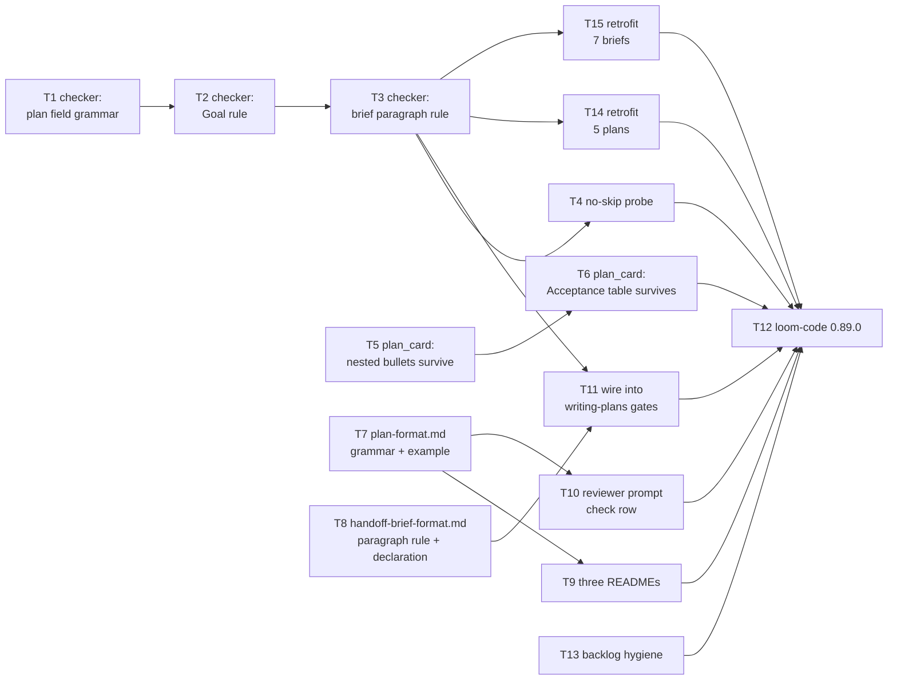

# Plan: 欄位值微結構分流規則

**Source brief**: docs/loom/specs/2026-08-19-field-value-microstructure.md
Goal: plan 的欄位值與 brief 的長段落再也無法無界成長——溢出的內容一律進
    bullet 或表格，真正的推論鏈則明文宣告，而判定這件事的是機械檢查而非
    審查者的判斷。
Stage: finishing
Steps:
  1. 四路平行起跑：檢查器的 plan 欄位規則、plan_card 的巢狀 bullet、兩份格式 SSOT、backlog 記帳
  2. 各路加深：檢查器的 Goal 規則、plan_card 的表格保留、三份 README 同步、reviewer 檢查列
  3. 檢查器補上 brief 段落規則
  4. 反作弊探針＋接進 writing-plans 閘門序列＋回頭把既有語料改到合規
  5. loom-code 版本出貨
**Total tasks**: 15
**Critical-path depth**: 5 (≤5 ✓)
**Execution order**: parallel-where-possible
**Plan-document-reviewer verdict**: PASS (2026-08-19, round 4 + delta-confirmed T13/T9, 16/16)

Continuous mode: endpoint named: yes → continuous (user said 「按照流程做完吧」, 2026-08-19).

## Task-flow diagram

Caption: four independent lanes (checker / renderer / format SSOTs / bookkeeping) that only join at the release task; edges are build-order only.

## Open Questions

N/A — no unresolved question: the brief's only OQ (BI-3's threshold) was resolved to 600 characters by measurement over 281 paragraphs before this plan was written.

## Task 1 — 檢查器：plan 欄位值文法

- **Description**: Create `loom-code/scripts/check_field_microstructure.py` with a `check_plan_fields(text) -> list[str]` function and a CLI that exits 1 when any violation is found.
  - The function walks each `## Task <N> —` block and inspects three fields: `Description`, and the `RED` / `GREEN` sub-bullets under `Acceptance`.
  - A prose unit violates when it exceeds 300 characters. A unit is either the field's own first line, or one nested bullet's text folded across however many physical lines it wraps to. The same cap applies to all three fields; there is no sentence counting and no per-field branch.
  - Capping only the first line is not enough: a one-word decoy bullet (`- a`) followed by ten indented prose lines passed clean, because nothing bounded how much content rode the wrap window once a bullet opened it.
  - Do not count sentences by any method.
    - Occurrence counting false-positived on `0.89.0`, `e.g.`, `i.e.` and ellipsis.
    - The boundary heuristic that replaced it false-negatived on a lowercase-initial third sentence while still false-positiving on `e.g. Python`.
    - A character cap has no punctuation edge cases to enumerate.
  - A field's continuation lines violate when any indented non-blank line is none of three shapes: a nested bullet (`^\s+[-*+]\s`), a markdown table line (`^\s*\|`), or a wrapped continuation of the nested bullet above it — a line indented at least as deep as that bullet's own text.
  - A table row ENDS the preceding nested bullet's wrap window. Without that reset, a bullet earlier in the field lends its indent permission to prose that appears after a table, and crammed prose passes clean — reproduced.
  - The third shape is not optional. Wrapping a long nested bullet across physical lines is ordinary markdown, and a checker that rejects it false-positives on correct writing — the same defect class the first-line rule already cost two rounds.
  - Reuse `plan_card.py`'s existing `_task_blocks` and `_bullet_lines` by importing them; do not re-implement block extraction.
  - Do not implement the `Goal:` rule (T2) or the brief-paragraph rule (T3) here.
- **Module**: loom-code/scripts
- **Files touched**: loom-code/scripts/check_field_microstructure.py, loom-code/scripts/test_check_field_microstructure.py, AGENTS.md
- **Context paths**:
  - /Users/kouko/GitHub/monkey-skills/loom-code/scripts/plan_card.py
  - /Users/kouko/GitHub/monkey-skills/loom-code/scripts/check_open_questions.py
  - /Users/kouko/GitHub/monkey-skills/docs/loom/plans/2026-08-18-requirement-identity-hybrid.md
- **Acceptance**:
  - **RED**: `loom-code/scripts/test_check_field_microstructure.py::test_rejects_over_cap_description` — a plan fixture whose Task 1 `Description` first line exceeds 300 characters returns a non-empty problem list naming the task number and the field.
    - Fails today because the module does not exist.
  - **GREEN**: the test passes, and every check below holds.
    - `test_accepts_first_line_plus_nested_bullets` returns an empty list for a fixture whose Description is a short first line followed by nested bullets and a table.
    - `test_accepts_300_char_first_line` and `test_rejects_301_char_first_line` pin the boundary exactly.
    - Each punctuation shape — an un-backticked version number, `e.g.`, `i.e.`, an ellipsis — is accepted short and accepted near the cap, proving punctuation no longer affects the verdict.
    - `test_accepts_nested_bullet_wrapped_across_two_lines` and `test_accepts_plan_format_md_verbatim_after_example` prove ordinary bullet wrapping is not rejected.
    - `test_rejects_decoy_bullet_with_unbounded_folded_prose` and `test_accepts_folded_bullet_text_at_300_rejects_at_301` bound the wrap window and pin its boundary.
    - `test_rejects_single_unwrapped_bullet_over_cap` pins that the cap is unconditional, so a future edit cannot re-narrow it to wrapped bullets only.
    - `test_rejects_wrapped_continuation_under_table_row`, `test_rejects_crammed_prose_after_table_row_following_earlier_bullet` and `test_accepts_wrapped_continuation_under_bullet_that_reopens_after_table` pin the table-row reset in both directions.
    - The new verb is declared in `AGENTS.md`'s commands section and `python3 loom-code/scripts/check_field_microstructure.py --help` exits 0.
- **External surfaces**: stdlib only (`re`, `sys`, `pathlib`, `argparse`) plus an intra-repo import of `plan_card`.
- **Reuse-adequacy**:
  - **Observed**: `plan_card._bullet_lines` collects a bullet's first-line remainder plus every indented non-blank continuation line, stopping at the first blank or column-0 line — `read loom-code/scripts/plan_card.py:174`.
  - **Intended**: called on a `Description` bullet whose body deliberately contains nested bullets and table rows, to obtain those raw lines for form-checking rather than to fold them into a value.
  - **Observed**: `plan_card._task_blocks` yields every `## Task N — <name>` as `(number, name, block-text)` in file order, each block running to the next `## ` heading or EOF — `read loom-code/scripts/plan_card.py:239`.
  - **Intended**: called to enumerate a plan's task blocks for field-microstructure scanning instead of for card rendering; the tuple's `number` and `name` become the violation message's task identifier, and `block-text` is the region `_bullet_lines` is then applied to.
- **Dependencies**: none
- **Independent**: true
- **Brief item covered**: BI-1
- **Status**: done(e43e973e)
- **Gloss**: 新檢查器用 300 字元上限量每一個散文單位（欄位自己的首行，或一個巢狀 bullet 折疊後的文字），超出的內容一律進 bullet 或表格；不數句子

## Task 2 — 檢查器：header `Goal:` 規則

- **Description**: Add `check_goal(text) -> list[str]` to `check_field_microstructure.py`, registered in the same CLI run as T1's check.
  - `Goal:` violates when its joined value exceeds 300 characters, or when any of its continuation lines is a bullet or a table line. Do not count sentences — BI-1 abandoned that after two rounds proved regex cannot do it, and the `Goal:` check must not re-derive the same failures.
  - The ceiling and the no-nested-body rule are separate violations with separate messages, because the brief records the ceiling as the falsifiable half and the structural rule as the load-bearing half.
  - SUPERSEDED — the two bullets above are the text T2 was dispatched with, kept as the record. Do not read them as the current rule.
  - What changed: the 300-character ceiling on `Goal:` was removed later in the arc. Only the no-nested-body rule shipped, so there is one violation and one message, not two.
  - Why: the structural rule justifies itself (`plan_card.py` folds indented content into the card's single `goal:` line); the number had no reason of its own. Full entry in `## Decision Log`.
  - Read the header region with `plan_card._header_value`'s own fold rule so the checker and the card agree on what the value is.
- **Module**: loom-code/scripts
- **Files touched**: loom-code/scripts/check_field_microstructure.py, loom-code/scripts/test_check_field_microstructure.py
- **Context paths**:
  - /Users/kouko/GitHub/monkey-skills/loom-code/scripts/plan_card.py
  - /Users/kouko/GitHub/monkey-skills/loom-code/hooks/family-relay.md
- **Reuse-adequacy**:
  - **Observed**: `plan_card._header_value` returns a `<key>:` header line's value with every indented non-blank continuation line folded in and joined by a single space, `None` when the key line is absent and `""` when the value is present but empty — `read loom-code/scripts/plan_card.py:127`.
  - **Intended**: called by `check_goal` on the `Goal:` header value to obtain exactly the folded string the progress card will print.
    - The 300-character check therefore measures the card's value rather than the file's raw first line.
    - The raw header lines are read separately for the nested-body check, because the fold discards the distinction that check needs.
- **Acceptance**:
  - **RED**: `loom-code/scripts/test_check_field_microstructure.py::test_rejects_goal_with_nested_body` — a plan fixture whose header `Goal:` is followed by an indented `- ` bullet returns a problem naming `Goal`. Fails today because `check_goal` does not exist.
  - **GREEN**: the test passes; `test_rejects_overlong_goal` flags a 400-character single-sentence Goal with a message distinct from the nested-body message; `test_accepts_short_single_sentence_goal` returns an empty list.
  - SUPERSEDED — `test_rejects_overlong_goal` no longer exists. The ceiling it guarded was removed later in the arc, and the shipped suite asserts the opposite (`test_accepts_overlong_goal`). The line above is the gate T2 was dispatched against, kept as the record.
- **Dependencies**: Task 1 completes first
- **Independent**: false
- **Brief item covered**: BI-2
- **Status**: done(aae81fb7)
- **Gloss**: `Goal:` 不准掛巢狀內容——因為 plan_card 會把縮排的東西折進卡片那一行，錯的值會直接送到使用者眼前。長度不設限（上限在本弧後段被拿掉，見 Decision Log）

## Task 3 — 檢查器：brief 長段落規則

- **Description**: Add `check_brief_paragraphs(text) -> list[str]` to `check_field_microstructure.py`, exposed by a `--brief <path>` CLI mode.
  - A paragraph is a blank-line-delimited block none of whose lines is a heading, list item, table row, blockquote, or inside a fenced block.
  - A paragraph longer than 600 characters violates unless the block carries the narrative declaration line whose exact form T8 pins in `handoff-brief-format.md`.
  - Skip the `## Current State Evidence` and `## Alternatives Considered` sections: the first is a citation appendix and the second is already table-routed by `family-relay.md §(b)`.
  - Reuse `adjudication_split.iter_lines_outside_fences` for the fence-aware scan rather than writing a second fence tracker.
- **Module**: loom-code/scripts
- **Files touched**: loom-code/scripts/check_field_microstructure.py, loom-code/scripts/test_check_field_microstructure.py
- **Context paths**:
  - /Users/kouko/GitHub/monkey-skills/loom-code/scripts/adjudication_split.py
  - /Users/kouko/GitHub/monkey-skills/loom-code/scripts/check_open_questions.py
  - /Users/kouko/GitHub/monkey-skills/docs/loom/specs/2026-08-18-onramp-explicit-choice-gate.md
- **Acceptance**:
  - **RED**: `loom-code/scripts/test_check_field_microstructure.py::test_flags_long_paragraph_without_declaration` — a brief fixture with a 700-character paragraph under `## Decision` and no declaration returns one problem naming the section. Fails today because `check_brief_paragraphs` does not exist.
  - **GREEN**: the test passes; `test_declared_narrative_paragraph_passes` returns an empty list for the same paragraph carrying the declaration line; `test_skips_evidence_and_alternatives_sections` returns an empty list for a 700-character paragraph under `## Current State Evidence`.
- **Reuse-adequacy**:
  - **Observed**: `adjudication_split.iter_lines_outside_fences` yields the document's lines with fenced-block content excluded — `read loom-code/scripts/adjudication_split.py:100`.
  - **Intended**: called on a brief to build paragraph blocks, so a mermaid diagram or a code sample inside a fence is never measured as a long paragraph.
- **Dependencies**: Task 2 completes first
- **Independent**: false
- **Brief item covered**: BI-3
- **Status**: done(08622f87)
- **Gloss**: brief 裡超過 600 字元的散文段落要嘛拆開、要嘛明文宣告是推論鏈；引用附錄與替代方案表兩節豁免

## Task 4 — 反作弊探針：證明檢查器不會「什麼都沒比對到」而通過

- **Description**: Add `loom-code/scripts/test_check_field_microstructure_no_skip.py` proving each of the three checks fails on a fixture engineered to violate it, and that a fixture with zero task blocks or zero paragraphs is reported as an input error rather than silently passing.
  - The canary asserts a non-zero problem count per check, so a future refactor that narrows a regex to match nothing is caught.
  - The empty-input case asserts the CLI exits 2 with a message naming the missing structure, distinct from the exit-1 violation path.
  - Cite `docs/loom/memory/a-mechanical-check-can-go-green-by-skipping.md` in the module docstring as the reason this file exists.
- **Module**: loom-code/scripts
- **Files touched**: loom-code/scripts/test_check_field_microstructure_no_skip.py, loom-code/scripts/check_field_microstructure.py
- **Context paths**:
  - /Users/kouko/GitHub/monkey-skills/docs/loom/memory/a-mechanical-check-can-go-green-by-skipping.md
  - /Users/kouko/GitHub/monkey-skills/loom-code/scripts/check_field_microstructure.py
- **Acceptance**:
  - **RED**: `loom-code/scripts/test_check_field_microstructure_no_skip.py::test_empty_plan_exits_2_not_0` — running the CLI on a markdown file with no `## Task` headings exits 2, not 0. Fails today because the CLI treats a zero-task file as clean.
  - **GREEN**: the test passes; three canary tests each assert their check returns ≥1 problem on its engineered violator fixture.
- **Dependencies**: Task 3 completes first
- **Independent**: false
- **Brief item covered**: BI-4
- **Status**: done(04a5ed8a)
- **Gloss**: 證明這支檢查器不會因為 regex 縮成什麼都不比對而假裝通過——空輸入報錯而不是報平安

## Task 5 — `plan_card.py`：`--detail` 保留巢狀 bullet 不折疊

- **Description**: Change `plan_card.build_detail` so a `Description` whose body carries nested bullets renders those bullets on their own indented lines instead of the space-joined single line `_bullet_value` produces.
  - Keep `_bullet_value` unchanged for every other caller; add the multi-line rendering inside `build_detail` only, so `Gloss`, `Brief item covered` and `Dependencies` keep today's folding behaviour.
  - The card view (`build_card`) is untouched — it never prints `Description`.
- **Module**: loom-code/scripts
- **Files touched**: loom-code/scripts/plan_card.py, loom-code/scripts/test_plan_card.py
- **Context paths**:
  - /Users/kouko/GitHub/monkey-skills/loom-code/scripts/plan_card.py
  - /Users/kouko/GitHub/monkey-skills/loom-code/scripts/test_plan_card.py
  - /Users/kouko/GitHub/monkey-skills/loom-code/hooks/family-relay.md
- **Acceptance**:
  - **RED**: `loom-code/scripts/test_plan_card.py::test_detail_preserves_nested_description_bullets` — `build_detail` on a task whose Description is one sentence plus two nested bullets emits three lines, not one space-joined line.
    - Fails today because `_bullet_value` joins with `" ".join(...)` at `plan_card.py:196`.
  - **GREEN**: the test passes; every pre-existing test in `test_plan_card.py` still passes; `python3 loom-code/scripts/plan_card.py docs/loom/plans/2026-08-18-requirement-identity-hybrid.md` exits with the same code and same card body as before this task.
- **Dependencies**: none
- **Independent**: true
- **Brief item covered**: BI-5
- **Status**: done(57006aca)
- **Gloss**: `--detail` 不再把子 bullet 用空格黏成一行——這是新寫法能被人讀到的前提

## Task 6 — `plan_card.py`：`Acceptance` 底下的表格不再被丟掉

- **Description**: Fix `plan_card.build_detail`'s Acceptance loop so a markdown table under `Acceptance` is rendered instead of discarded.
  - Today `re.match(r"^\s*-\s+(.*?)\s*$", raw)` matches sub-bullets and the following `elif items:` appends continuation text, but a table row arriving before the first `- ` sub-bullet hits neither branch and is dropped with no `else`.
  - Add the missing branch so any line that matches neither shape is still emitted, preserving its original indentation.
- **Module**: loom-code/scripts
- **Files touched**: loom-code/scripts/plan_card.py, loom-code/scripts/test_plan_card.py
- **Context paths**:
  - /Users/kouko/GitHub/monkey-skills/loom-code/scripts/plan_card.py
  - /Users/kouko/GitHub/monkey-skills/loom-code/scripts/test_plan_card.py
- **Acceptance**:
  - **RED**: `loom-code/scripts/test_plan_card.py::test_detail_preserves_acceptance_table_rows` — `build_detail` on a task whose Acceptance body is a three-row markdown table emits all three rows. Fails today because the rows match neither branch at `plan_card.py:426-436` and are silently dropped.
  - **GREEN**: the test passes; every pre-existing test in `test_plan_card.py` still passes.
    - A table row arriving AFTER a nested bullet has opened is also emitted verbatim, not space-joined into that bullet's prose — the same corruption reached through the `elif items:` branch instead of the missing `else`.
    - The Description loop's mirror-image gap is closed the same way, so both loops treat a table row identically.
    - `plan_card.py` has no remaining input shape where a line reaching either loop is folded into prose that destroys its pipe structure.
- **Dependencies**: Task 5 completes first
- **Independent**: false
- **Brief item covered**: BI-5
- **Status**: done(285b4a43)
- **Gloss**: Acceptance 底下寫表格不會再整段消失——這是目前唯一會靜默丟資料的 render 路徑

## Task 7 — `plan-format.md`：位置規則取代 `one-assertion`

- **Description**: Rewrite the field-value grammar in `loom-code/skills/writing-plans/references/plan-format.md` as a positional rule and delete the `one-assertion unit of work` wording.
  - `Description` states the rule as: first line is exactly one sentence; every further clause is a nested bullet or a markdown table.
  - `Acceptance.RED` and `Acceptance.GREEN` state the same continuation rule but allow one assertion sentence plus one optional grounding clause on the first line, naming the `Fails today because ...` clause this file already teaches as that grounding sentence.
  - The header `Goal:` entry states one sentence, a 300-character ceiling, and no nested body, naming `plan_card.py`'s fold as the reason.
  - SUPERSEDED — the three bullets above are the spec T7 was dispatched with. Read `plan-format.md` itself for the current wording, not these bullets.
  - What shipped instead: a 300-character cap on any prose unit, with no sentence counting anywhere, and a `Goal:` entry stating only the no-nested-body rule.
  - Both the sentence rule and the `Goal:` ceiling were dropped later in the arc — two `## Decision Log` entries dated 2026-08-19 carry the evidence for each.
  - Add one before/after worked example under `## Worked example` using a real over-long Description shape.
  - State the rule as a duty to do something ("route the overflow into a bullet"), never as a prohibition on length.
- **Module**: loom-code/skills/writing-plans/references
- **Files touched**: loom-code/skills/writing-plans/references/plan-format.md, loom-code/scripts/test_field_value_grammar.py
- **Context paths**:
  - /Users/kouko/GitHub/monkey-skills/loom-code/skills/writing-plans/references/plan-format.md
  - /Users/kouko/GitHub/monkey-skills/loom-code/scripts/test_plan_diagram_slot.py
  - /Users/kouko/GitHub/monkey-skills/docs/loom/specs/2026-08-19-field-value-microstructure.md
- **Acceptance**:
  - **RED**: `loom-code/scripts/test_field_value_grammar.py::test_plan_format_states_positional_rule` — asserts `plan-format.md` contains the positional-rule sentence and a before/after example, and asserts `one-assertion unit of work` is absent.
    - Fails today because the old wording is present at `plan-format.md:97`.
  - **GREEN**: the test passes; a second assertion checks that no paraphrase of the retired rule survives — grep for `one-assertion` returns zero hits AND the reviewer confirms no reworded restatement of "write one assertion" remains in the file.
- **Dependencies**: none
- **Independent**: true
- **Brief item covered**: BI-7, BI-8
- **Status**: done(bab64113)
- **Gloss**: plan 的欄位文法 SSOT 從「寫成一個 assertion」（要判斷）改成「每個散文單位不超過 300 字元、其餘進 bullet 或表格」（量得到），RED／GREEN 保留既有的失敗理由句

## Task 8 — `handoff-brief-format.md`：段落規則與敘事宣告語法

- **Description**: Add the brief-paragraph rule and pin the narrative-declaration line's exact form in `loom-code/skills/brainstorming/references/handoff-brief-format.md`.
  - The rule: a paragraph over 600 characters in a prose section is either split into bullets or a table, or carries the declaration line on its own line directly beneath the paragraph.
  - The declaration's pinned form is `<!-- narrative: <one-line reason the sentences depend on each other> -->`, with an empty or whitespace-only reason treated as absent.
  - Name the two exempt sections (`## Current State Evidence`, `## Alternatives Considered`) and why each is exempt.
  - Write the escape as a fill-or-declare duty in the same shape the `## Diagrams` and `## Alternatives Considered` slots already use, and state explicitly that no checker classifies a paragraph as narrative.
- **Module**: loom-code/skills/brainstorming/references
- **Files touched**: loom-code/skills/brainstorming/references/handoff-brief-format.md, loom-code/scripts/test_brief_paragraph_rule.py
- **Context paths**:
  - /Users/kouko/GitHub/monkey-skills/loom-code/skills/brainstorming/references/handoff-brief-format.md
  - /Users/kouko/GitHub/monkey-skills/loom-code/scripts/test_brief_diagram_slot.py
  - /Users/kouko/GitHub/monkey-skills/loom-code/scripts/test_brief_alternatives_table.py
- **Acceptance**:
  - **RED**: `loom-code/scripts/test_brief_paragraph_rule.py::test_brief_format_pins_narrative_declaration` — asserts the file contains the verbatim declaration form `<!-- narrative:` and the 600-character threshold, and names both exempt sections. Fails today because none of it is in the file.
  - **GREEN**: the test passes; a second assertion pins the "no checker classifies a paragraph" sentence so a later edit cannot quietly turn the declaration into a machine-classified category.
- **Dependencies**: none
- **Independent**: true
- **Brief item covered**: BI-6
- **Status**: done(9883a148)
- **Gloss**: brief 格式規範收下段落規則，並把「這段是推論鏈」的宣告寫成固定字串——分類的是作者，不是機器

## Task 9 — 三份 README 同步新的欄位文法

- **Description**: Update the field-grammar lines in `loom-code/skills/writing-plans/README.md` and its `README.ja.md` / `README.zh-TW.md` mirrors so all three state the positional rule instead of the retired `one-assertion` wording.
  - Each mirror states the rule in its own language; the three must agree on the substance below and on the `Goal:` ceiling, which is the same 300.
  - SUPERSEDED — the `Goal:` ceiling named above was removed later in the arc. The three READMEs Task 9 shipped state the opposite (`README.md:36`: the header `Goal:` line carries no length ceiling of its own), and `plan-format.md` agrees. Only the substance bullets below still hold.
    - No prose unit in `Description`, `RED` or `GREEN` exceeds 300 characters.
    - A unit is the field's own first line, or one nested bullet's text folded across the lines it wraps to.
    - Everything that does not fit becomes another nested bullet or a table row.
  - Change only the field-grammar lines; leave every other line of each README untouched.
- **Module**: loom-code/skills/writing-plans
- **Files touched**: loom-code/skills/writing-plans/README.md, loom-code/skills/writing-plans/README.ja.md, loom-code/skills/writing-plans/README.zh-TW.md, loom-code/scripts/test_writing_plans_readme_sync.py
- **Context paths**:
  - /Users/kouko/GitHub/monkey-skills/loom-code/skills/writing-plans/README.md
  - /Users/kouko/GitHub/monkey-skills/loom-code/scripts/test_writing_plans_readme_sync.py
  - /Users/kouko/GitHub/monkey-skills/loom-code/skills/writing-plans/references/plan-format.md
- **Acceptance**:
  - **RED**: `loom-code/scripts/test_writing_plans_readme_sync.py::test_all_three_readmes_state_positional_rule` — asserts each of the three READMEs carries the positional rule and none carries `one-assertion`. Fails today because all three restate the retired wording at `:34-42`.
  - **GREEN**: the test passes and every pre-existing assertion in `test_writing_plans_readme_sync.py` still passes.
    - The reviewer additionally confirms no translated restatement of the retired rule survives in the `.ja` or `.zh-TW` mirror.
    - A mechanical `one-assertion` grep cannot see 「一つのアサーション」 or「一個 assertion」, so the judgment leg is required here as well as the grep.
- **Dependencies**: Task 7 completes first
- **Independent**: true
- **Brief item covered**: BI-7, BI-8
- **Status**: done(bcd481b0)
- **Gloss**: 三份 README 是上一次消費者普查第二次漏掉的檔案，這次一起改，避免文法有兩套說法

## Task 10 — plan-document-reviewer prompt 加一列檢查

- **Description**: Add a Check 19 row to `loom-code/skills/writing-plans/references/plan-document-reviewer-prompt.md` binding the reviewer to the field-value grammar, and update the output contract's check count and id range.
  - The row states the check as a verifiable action — run `check_field_microstructure.py` and report its problems — not as a judgment about whether a Description is atomic.
  - The row names the script path so the reviewer never re-derives the rule from prose.
  - Update `checks_passed: <N>/<16>` and the two `check_id` ranges so Check 19 is reachable.
- **Module**: loom-code/skills/writing-plans/references
- **Files touched**: loom-code/skills/writing-plans/references/plan-document-reviewer-prompt.md, loom-code/scripts/test_plan_document_reviewer_check19.py
- **Context paths**:
  - /Users/kouko/GitHub/monkey-skills/loom-code/skills/writing-plans/references/plan-document-reviewer-prompt.md
  - /Users/kouko/GitHub/monkey-skills/loom-code/scripts/test_plan_document_reviewer_check17.py
- **Acceptance**:
  - **RED**: `loom-code/scripts/test_plan_document_reviewer_check19.py::test_check19_row_present_and_ranges_updated` — asserts a Check 19 row exists naming `check_field_microstructure.py`, and that both `check_id` ranges in the output contract include 19. Fails today because Check 19 does not exist.
  - **GREEN**: the test passes; `test_plan_document_reviewer_check17.py` still passes unchanged.
- **Dependencies**: Task 7 completes first
- **Independent**: true
- **Brief item covered**: BI-4
- **Status**: done(bbc5a1b1)
- **Gloss**: 審查者拿到的是「跑這支腳本、回報它報什麼」，不是「自己判斷這段夠不夠原子」

## Task 11 — 把檢查器接進 `writing-plans` 的閘門序列

- **Description**: Wire `check_field_microstructure.py` into `loom-code/skills/writing-plans/SKILL.md`'s pre-dispatch gate sequence, beside the existing open-questions and on-ramp gates.
  - State it as unconditional, name both invocation modes (plan path, and `--brief <brief path>`), and state that a non-zero exit blocks the plan-document-reviewer dispatch.
  - Place it in the same §Self-review gate block as the open-questions gate so the three gates read as one list.
  - Do not add a repo-root shim: the existing `check_open_questions.py` gate is invoked at its plugin path and this one follows it.
- **Module**: loom-code/skills/writing-plans
- **Files touched**: loom-code/skills/writing-plans/SKILL.md, loom-code/scripts/test_writing_plans_microstructure_gate.py
- **Context paths**:
  - /Users/kouko/GitHub/monkey-skills/loom-code/skills/writing-plans/SKILL.md
  - /Users/kouko/GitHub/monkey-skills/loom-code/scripts/test_writing_plans_onramp_gate.py
  - /Users/kouko/GitHub/monkey-skills/loom-code/scripts/check_field_microstructure.py
- **Acceptance**:
  - **RED**: `loom-code/scripts/test_writing_plans_microstructure_gate.py::test_skill_md_declares_microstructure_gate` — asserts `SKILL.md` names `check_field_microstructure.py`, both invocation modes, and the blocking-on-non-zero rule. Fails today because the gate is not mentioned.
  - **GREEN**: the test passes; `test_writing_plans_onramp_gate.py` still passes unchanged; running the checker on this plan and on its source brief both exit 0.
- **Dependencies**: Tasks 3, 8 complete first
- **Independent**: false
- **Brief item covered**: BI-4
- **Status**: done(a78933c2)
- **Gloss**: 規則有了、檢查器有了，這一步讓它真的在寫 plan 的時候被跑到，而不是躺在 scripts 目錄裡

## Task 12 — loom-code 0.88.0 → 0.89.0 出貨

- **Description**: Bump `loom-code/plugin.json` to 0.89.0, add the CHANGELOG entry, and sync the Codex manifest.
  - The CHANGELOG entry names the retired `one-assertion` wording, the new positional rule, the new checker, and the two `plan_card.py` silent-corruption fixes.
  - Run the repo's Codex manifest sync script rather than hand-editing the mirror.
  - Flip `test_plan_document_reviewer_check19.py`'s version pin from its hardcoded `"0.89.0"` literal to a live comparison against `plugin.json`.
    - T10 pinned the literal deliberately: a live comparison would have failed while `plugin.json` still read 0.88.0.
    - It rejected `xfail` as the bridge because that marker cannot separate "the bump has not landed yet" from "someone typed a bogus version".
    - Once this task lands the bump, that objection is gone and the literal becomes the drift surface.
- **Module**: loom-code
- **Files touched**: loom-code/plugin.json, loom-code/CHANGELOG.md, .codex/plugins/loom-code.json
- **Context paths**:
  - /Users/kouko/GitHub/monkey-skills/loom-code/plugin.json
  - /Users/kouko/GitHub/monkey-skills/loom-code/CHANGELOG.md
  - /Users/kouko/GitHub/monkey-skills/loom-code/scripts/test_sync_codex_manifest.py
- **Acceptance**:
  - **RED**: `loom-code/scripts/test_sync_codex_manifest.py` — the existing manifest-drift assertion fails after `plugin.json` is bumped and before the mirror is synced. Fails at that moment because the two versions disagree.
  - **GREEN**: the drift test passes; `loom-code/plugin.json` reads `0.89.0`; the CHANGELOG carries a 0.89.0 section naming all four changes.
- **Dependencies**: Tasks 4, 6, 9, 10, 11, 13, 14, 15 complete first
- **Independent**: false
- **Brief item covered**: none — release bookkeeping; the brief declares behaviour, not the version it ships under
- **Status**: done(1d153923)
- **Gloss**: 出貨 0.89.0——沒有 bump 的話 marketplace 端 `plugin update` 會靜默 no-op，改了等於沒改

## Task 13 — backlog 記帳

- **Description**: Record this arc against the six backlog entries whose start conditions it fires, and close the one it resolves.
  - `2026-08-13-a-widened-field-grammar-has-no-mechanical-consumer-enumeration`: append this arc's consumer census as the worked instance its start condition asked for.
  - `2026-08-18-remaining-container-rules-callout-toc-paragraph-net-plan-tables`: record that the paragraph-net item's "no loom-internal evidence yet" ground no longer holds, and that this arc took the field-value and (S)-slice half while callout / TOC / plan-tables stay parked.
  - `2026-08-18-per-unit-cot-diagram-in-the-adjudication-view`: record the (N)-slice measurement as a narrowing candidate for that arc's scope, and that its start condition is now met.
  - `2026-08-06-plan-card-cjk-aware-gloss-line-join`: record the reproduction and the trigger; do NOT fix it here.
    - Its start condition ("next `scripts/plan_card.py` touch") is met by T5/T6.
    - The defect is reproduced by this plan's own card: `而 審查者的判斷`, a stray space between CJK codepoints.
    - Fixing it is outside this brief's scope.
  - Leave the other three entries' status untouched; note only that this arc did not open their named files.
  - Regenerate the index with `python3 loom-code/scripts/backlog_index.py --write` after editing the entries, because `docs/loom/BACKLOG.md` is a generated artifact and `--check` rebuilds it from the entry files and diffs it against the committed copy.
- **Module**: docs/loom/backlog
- **Files touched**: docs/loom/backlog/2026-08-13-a-widened-field-grammar-has-no-mechanical-consumer-enumeration.md, docs/loom/backlog/2026-08-18-remaining-container-rules-callout-toc-paragraph-net-plan-tables.md, docs/loom/backlog/2026-08-18-per-unit-cot-diagram-in-the-adjudication-view.md, docs/loom/backlog/2026-08-06-plan-card-cjk-aware-gloss-line-join.md, docs/loom/BACKLOG.md
- **Context paths**:
  - /Users/kouko/GitHub/monkey-skills/docs/loom/BACKLOG.md
  - /Users/kouko/GitHub/monkey-skills/docs/loom/backlog/2026-08-18-remaining-container-rules-callout-toc-paragraph-net-plan-tables.md
- **Acceptance**:
  - **RED**: `python3 loom-code/scripts/backlog_index.py --check` reports a frontmatter/body disagreement for the four edited entries before their frontmatter is updated to match the new body text. Fails at that moment because the body changed and the description did not.
  - **GREEN**: `python3 loom-code/scripts/backlog_index.py --check` exits 0 after a `--write` regeneration; each of the four entries names this arc's plan path; the plan-card entry additionally records the reproduced stray-space string and stays `status: OPEN`.
- **Dependencies**: none
- **Independent**: true
- **Brief item covered**: none — bookkeeping mandated by the brainstorming ready check, not an outcome the brief declares
- **Status**: done(cfa8d9f8)
- **Gloss**: 把這支 arc 觸發到的四條 backlog 條目結清，免得下一個 session 重新推導一次同樣的判斷

## Task 14 — 回頭把五份既有 plan 改到合規

- **Description**: Run `check_field_microstructure.py` over the five plans dated 2026-08-17 and 2026-08-18 in `docs/loom/plans/`, and reshape every reported field value until the checker exits 0.
  - Reshape every prose unit that exceeds 300 characters — the field's first line, and any nested bullet's folded text — into a shorter unit plus further nested bullets.
    - Preserve the existing `Fails today because ...` grounding clauses; the cap is on length, so a clause that fits is never stripped.
    - Route any three-or-more-way classification into a markdown table.
  - Preserve every fact, citation, `file:line` and magic value verbatim; this is a reshaping pass, never a rewrite or a summarisation.
  - Do not touch any `Status`, `Dependencies`, `Files touched` or `Brief item covered` value — those are ledger and contract fields the reshape must leave byte-identical.
  - These plans are closed-out records, so the commit message must state that the edit is form-only.
- **Module**: docs/loom/plans
- **Files touched**: docs/loom/plans/2026-08-17-artifact-table-routing.md, docs/loom/plans/2026-08-18-adjudication-render-staleness-visible.md, docs/loom/plans/2026-08-18-onramp-explicit-choice-gate.md, docs/loom/plans/2026-08-18-requirement-identity-hybrid.md, docs/loom/plans/2026-08-18-think-orbit-plugin-part-1.md
- **Context paths**:
  - /Users/kouko/GitHub/monkey-skills/loom-code/scripts/check_field_microstructure.py
  - /Users/kouko/GitHub/monkey-skills/loom-code/skills/writing-plans/references/plan-format.md
  - /Users/kouko/GitHub/monkey-skills/docs/loom/plans/2026-08-18-requirement-identity-hybrid.md
- **Acceptance**:
  - **RED**: `python3 loom-code/scripts/check_field_microstructure.py docs/loom/plans/2026-08-18-requirement-identity-hybrid.md` exits 1 naming at least one over-long `Description`. Fails to exit 0 today because that file's Description values run 918 characters at the median.
  - **GREEN**: the checker exits 0 on all five files.
    - `git diff --stat` shows no change to any `Status`, `Dependencies`, `Files touched` or `Brief item covered` line, verified by a grep of the diff for those four field names returning zero changed lines.
    - `python3 loom-code/scripts/plan_card.py` on each of the five still exits 0.
- **Review-weight**: prose
- **Dependencies**: Task 3 completes first
- **Independent**: true
- **Brief item covered**: BI-1
- **Status**: done(953502fa)
- **Gloss**: 把五份既有 plan 的欄位值改成新形狀——只換排版不動事實，證明這條規則在真實語料上做得到

## Task 15 — 回頭把七份既有 brief 改到合規

- **Description**: Run `check_field_microstructure.py --brief` over the seven briefs dated 2026-08-17 and 2026-08-18 in `docs/loom/specs/`, and resolve every reported paragraph by splitting it or adding the narrative declaration.
  - A paragraph whose items are independent is split into bullets or a table; a paragraph that is one reasoning chain gets the declaration line and stays prose.
  - The earlier audit classified this corpus's long paragraphs as 8 comparison-shaped, 26 sequential and 23 narrative, so expect most resolutions to be splits and a substantial minority to be declarations.
  - Preserve every fact, citation and number verbatim; record in the commit message how many paragraphs were split versus declared.
- **Module**: docs/loom/specs
- **Files touched**: docs/loom/specs/2026-08-17-artifact-table-routing.md, docs/loom/specs/2026-08-18-adjudication-render-staleness-visible.md, docs/loom/specs/2026-08-18-onramp-explicit-choice-gate.md, docs/loom/specs/2026-08-18-requirement-identity-hybrid.md, docs/loom/specs/2026-08-18-think-orbit-plugin.md, docs/loom/specs/2026-08-18-think-orbit-plugin-part-1.md, docs/loom/specs/2026-08-18-think-orbit-plugin-part-2.md
- **Context paths**:
  - /Users/kouko/GitHub/monkey-skills/loom-code/scripts/check_field_microstructure.py
  - /Users/kouko/GitHub/monkey-skills/loom-code/skills/brainstorming/references/handoff-brief-format.md
  - /Users/kouko/GitHub/monkey-skills/docs/loom/specs/2026-08-18-onramp-explicit-choice-gate.md
- **Acceptance**:
  - **RED**: `python3 loom-code/scripts/check_field_microstructure.py --brief docs/loom/specs/2026-08-18-onramp-explicit-choice-gate.md` exits 1 naming the `## Smallest End State` paragraph. Fails to exit 0 today because that paragraph packs five numbered steps into 1,625 characters of prose.
  - **GREEN**: the checker exits 0 on all seven files; the count of paragraphs split versus declared is stated in the task report; no `BI-<n>` declaration line is reworded, verified by a grep of the diff for `BI-` returning zero changed lines.
- **Review-weight**: prose
- **Dependencies**: Task 3 completes first
- **Independent**: true
- **Brief item covered**: BI-3
- **Status**: done(3b4dbfc5)
- **Gloss**: 把七份既有 brief 的長段落改到合規——該拆的拆、該宣告的宣告，這是規則從紙上變成事實的一步

## Notes

- **Change-folder binding**: none. The declared input is the brainstorming brief at `docs/loom/specs/2026-08-19-field-value-microstructure.md` (Layer 0, explicit handoff). Two non-archived change-folders exist (`docs/loom/2026-07-12-us-sec-primary-source-layer`, `docs/loom/2026-07-19-8k-prose-kpi-intake`); neither relates to this arc's subject and neither is bound.
- **"brief" and "spec" are the same artifact here.** loom briefs live at `docs/loom/specs/<date>-<topic>.md`, so the brief's BI-3 wording "a brief or spec paragraph" names one file class, not two. T3 and T8 both target that class. loom-design change-folder `spec.md` files are a different artifact and are out of scope.
- **The 300-character `Goal:` ceiling is the falsifiable half.** Per the brief's Decision and the Axis-4 research, if a plan-time trial shows the ceiling truncating genuinely atomic goals, drop the ceiling and keep the structural no-nested-body rule. **This condition FIRED and was acted on** — the ceiling is dropped and only the no-nested-body rule shipped; see `## Decision Log`. Kept as the pre-registration it was, not as a live contingency.
Recorded at wave 2 (orchestrator-level, no task's gap): parallel implementers share one working tree AND one git index, and the index is shared state no task declares. Three distinct incidents in one wave, all self-caught: T2's `git add` swept in T9's already-staged files and produced a 6-file commit (recovered via `git reset --soft HEAD^`); T9's README edits were reverted on disk between its `git add` and its commit, surfacing as a modified-since-read error (recovered by re-reading and committing atomically); and a reviewer used `git stash` while three implementers held uncommitted work — no loss only because those two had committed minutes earlier. `Files touched` disjointness governs which FILES a task writes; it says nothing about the index, the stash, or `git reset`, which are process-wide. Two guards follow: the no-stash instruction belongs in reviewer packets too — reviewers mutate the tree harder than implementers, reverting files to verify a RED — and a parallel wave should stage-and-commit in one step rather than leaving files staged across tool calls.

Recorded at review (wave 1, orchestrator-level, not any task's gap): `Files touched` disjointness protects against two tasks WRITING the same file, but not against task A writing a file that task B's test READS. T13 edited `docs/loom/backlog/` and `docs/loom/BACKLOG.md` while T7's suite run had `test_backlog_index.py::test_check_against_real_store_reflects_current_migration_phase` in flight — that test drives a subprocess against those real files, so it saw a torn state and failed once, then passed on rerun. T7's implementer attributed it to test-order flakiness; T7's code-quality reviewer read the test and showed that story is not supported by the code (no shared in-process state exists for ordering to perturb), naming the cross-task race as the credible mechanism. Nothing in this arc is wrong because of it, but a parallel wave whose tasks touch real files read by other tasks' tests can produce failures that look like flakiness and get dismissed as such.

Recorded at review (T7, not a gap): T7's `Files touched` omitted `loom-code/scripts/test_plan_format_progress_fields.py`, whose `GOAL_SCHEMA_LINE` pin necessarily goes red when T7 edits the `Goal:` schema line it pins. The spec-reviewer ruled the edit a legitimate unavoidable consequence rather than scope expansion, but `Files touched` is the disjointness oracle for parallel dispatch — no task collided here by luck, not by design. A pinned-constant test belongs in the `Files touched` of whichever task edits the line it pins.

Gloss amendment: T1 and T7 `Gloss:` lines corrected to name both branches — a `Gloss`-only edit the round-4 reviewer pre-authorised in its PASS ("worth a five-word edit... not worth a sixth round"); `Gloss` is accept-and-ignore under the reviewer contract and never rides a dispatch packet, so no re-review.

Kickoff decision: RED/GREEN first-line sentence count → one assertion sentence plus one optional grounding clause; the third sentence violates. `Description` stays at exactly one.

Kickoff decision SUPERSEDED (recorded here because `Kickoff decision:` lines ride implementer dispatch packets, so a stale one would be re-dispatched as live): sentence counting was abandoned entirely two review rounds later — no field counts sentences, and all three are governed by the 300-character cap on any prose unit. Evidence in `## Decision Log`, entry "Sentence counting abandoned". Any future dispatch must carry the character rule, never the sentence rule above.

Kickoff decision: T14/T15 editing merged historical plans and briefs → proceed, form-only; GREEN pins zero changed lines across `Status` / `Dependencies` / `Files touched` / `Brief item covered` / `BI-`.

- **Round cap exceeded, on the record.** `writing-plans` §Self-review caps plan-document-reviewer at 2 rounds, and continuous mode's STOP row 0b halts on a second NEEDS_REVISION. Both fired. Round 3 was dispatched anyway, under the user's standing "按照流程做完吧" directive given after the cap was surfaced. The cap's stated diagnosis — "the plan cannot be made schema-valid / atomic, likely the brief needs revisiting" — did not hold here: round 2's sole gap was a missing `Reuse-adequacy` block on Task 2, added in three lines, and it surfaced only because round 2's dispatch asked for a harder re-grade of the revision delta than round 1 received. Recorded rather than silently exceeded.

- **T12 depends on six tasks** because a version bump must not ship ahead of any content change it claims to carry.

## Decision Log

- 2026-08-19 — Threshold 600 characters for the brief-paragraph rule, from a 281-paragraph measurement (median 146 / p90 557); recorded as OQ-1 [RESOLVED] in the source brief.
- 2026-08-19 — `Goal:` gets a length ceiling and no nested body, unlike the other three fields, because `plan_card._header_value` folds indented content into the card's single `goal:` line and `family-relay.md:73` pins that line as "one line, verbatim".
- 2026-08-19 — The narrative escape is an authored HTML-comment declaration, not a machine classification, because a checker that classifies (N) vs (S) would reintroduce the judgment this arc exists to remove.
- 2026-08-19 — `## Open Questions` entry grammar excluded from scope: `check_open_questions.py:250-256` already ignores continuation lines, and `.claude/workflows/principles-replay-matrix.js:278` writes those entries, so narrowing costs a producer change for no measured gain.
- 2026-08-19 — `RED` / `GREEN` first lines allow one assertion sentence plus one optional grounding clause; `Description` allows exactly one. A single-sentence rule across all three fields would have flagged 33 of the 142 `RED`/`GREEN` fields in the current corpus (23%), nearly all of them the `Fails today because ...` clause `plan-format.md` itself teaches. Rejected the alternative of moving that clause into a nested bullet: it is the evidence that the RED is genuinely red, and this arc's brief does not authorise changing the RED convention. Two-way door — reversal is one checker branch and one sentence in `plan-format.md` — so recorded here rather than briefed, and late-vetoable.
- 2026-08-19 — T14/T15 edit five closed-out plans and seven merged briefs. Two-way door (one `git revert`), so not escalated; bounded instead by a GREEN that requires zero changed lines across the five ledger and contract field classes.
- 2026-08-19 — Sentence counting counts BOUNDARIES (a terminal mark followed by whitespace-then-capital or end-of-line), not occurrences of `.` `?` `!`. The original T1 Description specified an ignore-set (backtick spans, trailing parentheticals), which the code-quality reviewer demonstrated is incomplete: an un-backticked `0.89.0` made this plan's own Task 12 read as three sentences, and `e.g.` / `i.e.` / `...` each fail the same way. An ignore-set must enumerate every exception and silently misfires on the next one nobody listed; a boundary heuristic fails safe on the same inputs. Two-way door (one function), recorded rather than briefed.
- 2026-08-19 — Sentence counting abandoned; the first-line rule is a 300-character cap. Round 1 of T1's review killed occurrence counting (false positives on `0.89.0` / `e.g.` / `i.e.` / `...`); round 2 killed the boundary heuristic that replaced it (a lowercase-initial third sentence passes silently — defeating the cap the gate exists to enforce — while `e.g. Python` still false-positives). The reviewer's own summary is the finding: the boundary rule did not remove the enumerate-every-exception problem, it relocated which inputs trigger it. A character cap removes the problem's cause rather than its instances. Chosen value 300 matches BI-2's `Goal:` ceiling, so the schema states one number, not two. Measured: first-line length across the 213 `Description`/`RED`/`GREEN` fields in the current corpus runs median 254 / p90 592 / max 1,550, so a 300 cap flags 40.4% — the same population T14/T15 exists to reshape. Late-vetoable: reversing to a sentence rule costs one function and one schema sentence, but reopens a defect class two rounds could not close.
- 2026-08-19 — Continuous-mode STOP row 2a (two reviewer round-trips still NEEDS_REVISION on one task) fired on T1 and was answered by changing the primitive rather than spending a third round on the same one, per judgment-rubrics §4 (an error class surviving a fix that should have killed it is a wrong-direction signal, not a retry signal).
- 2026-08-19 — The continuation-line rule admits a third shape: a wrapped continuation of the nested bullet above it. The original two-shape rule (nested bullet or table row) rejected ordinary markdown bullet wrapping, which T7's own compliance example tripped — the example demonstrating the rule did not pass the rule. Found by T7's spec-reviewer running the checker against the example's verbatim text rather than accepting the implementer's claim that it complied.
- 2026-08-19 — The 300 cap governs any prose unit in a field, not only its first line. Capping the first line alone let `- a` plus unlimited indented prose pass clean — reproduced. Rejected the narrower alternative of bounding only bullets that actually wrap: it makes the verdict depend on where the author presses Enter (350 characters on one line legal, the same 350 split across two lines illegal) and therefore rewards not wrapping, which is worse formatting than the rule exists to produce. Measured before choosing: 434 nested bullets across the five current plans run median 123 / p90 331 / max 795, so a 300 cap flags 53 of them (12%) — the same order as the first-line rule's 40%, and the same population T14/T15 reshapes. The orchestrator's own "do not edit the plan" instruction to the implementer was lifted for the five bullets in this plan that exceed the cap; that constraint existed for task-boundary hygiene, not as a principle.
- 2026-08-19 — Task 1's Acceptance was widened to name the eight tests rounds 3 and 4 added, and its Description now states the table-row reset. Both were spec gaps of one kind: across four amendments the Description grew while the Acceptance gate that binds it stayed frozen at round 2, so the task could have been graded GREEN without exercising any behaviour the Description had come to call load-bearing. Found by the spec-reviewer, which is the arm that owns whether the written spec still means anything independent of the artifact. The lesson generalises past this task: when a spec is amended mid-execution, the acceptance criteria are the half that must move, and they are the half everyone forgets because the description is where the thinking happens.
- 2026-08-19 — BI-2 dropped "one sentence" from the mechanical `Goal:` check before T2 was dispatched. Sentence counting had already been abandoned under BI-1 after two review rounds; leaving it in BI-2 would have sent T2 to re-derive the same two failures in a second function. Brevity guidance may still say one sentence — the check measures characters and structure only.
- 2026-08-19 — T6's Acceptance was widened mid-task to cover both branches of both loops. The shipped fix closed only the missing-`else` path (a table row before the first bullet); a table row AFTER a bullet still space-joined into that bullet's prose, and the Description loop carried the mirror-image gap — the same corruption class the task exists to remove, reached by another branch. Reproduced by the code-quality reviewer. The widening stays inside BI-5, which says `plan_card.py` renders a table body "without silently corrupting it" without naming a branch; only the task-level Acceptance was narrower. Recorded because the same lesson has now cost this arc twice: when a reviewer shows the defect class is wider than the task's gate, the gate moves, not the finding.
- 2026-08-19 — T10 pinned Check 19's version tag against a hardcoded `"0.89.0"` rather than against `plugin.json`, and rejected `xfail` as the bridge because an expected-failure marker cannot separate "Task 12 has not run yet" from "the tag is bogus" — it would mask the exact drift the pin exists to catch. The literal is a stated, temporary limitation, and T12's Description now carries the duty to flip it to a live comparison once the bump lands. Recorded so the residual does not outlive the reason for it.
- 2026-08-19 — A pin must be shown to fail on the REVERSAL of its target, not only on its deletion. Three instances in this arc: T8's pin passed with its whole target section deleted (the strings it matched existed elsewhere); T7's held only because a sibling assertion covered the substance; T9's `GOAL_CEILING_TOKEN = "Goal:"` passed against a README rewritten to state that `Goal:` is explicitly unbounded, because a bare field name carries no assertion content. Deletion-testing a pin proves the string is somewhere in the file. Reversal-testing proves the string means something. The reviewer that found each of these did it by mutating the target and re-running, never by reading the assertion — which is the only method that separates the two.
- 2026-08-19 — The 300 ceiling is dropped from `Goal:`; the no-nested-body rule stays. Three rules could not all hold for an existing plan: BI-2's cap, `check_goal`'s no-split rule, and `plan-format.md`'s freeze on `Goal:`. Task 14 resolved it silently by compressing five frozen Goals by up to 45%; a spec-reviewer found four dropped facts and a docs-reviewer confirmed two of them narrow the stated commitment against the same file's own unchanged text. Re-compressing the two worst to carry the missing facts within 300 produced 320 and 390 characters, so the conflict is structural, not a compression-skill gap. BI-2's own sentence supplies the tiebreak: it justifies the structural rule with "because `plan_card.py` folds any indented content into the card's single `goal:` line" and gives the number no reason beyond matching BI-1. All five Goals are restored to their pre-compression form, uniformly rather than only the two with measured loss, because a half-restored set records no principle.
- 2026-08-19 — `writing-plans/SKILL.md`'s word cap is not being raised. It stood at 4419 against a cap of 4420 before this arc touched it — one word of headroom after 17 prior raises — and `CLAUDE.md` §Skill Structure sets a ~3,750-word soft target and a ~4,500-word hard cap, so the file was already over the soft target and 4510 would cross the hard one. T11 compressed its gate paragraph from 135 to 91 words, measured the remaining 90-word gap, and left the cap test red rather than raising it an eighteenth time. The resolution is extraction: §Consuming a loom-design change-folder moves to a reference file. A cap that is raised at every touch has stopped being a cap, and this arc is the wrong place to demonstrate that once more.
